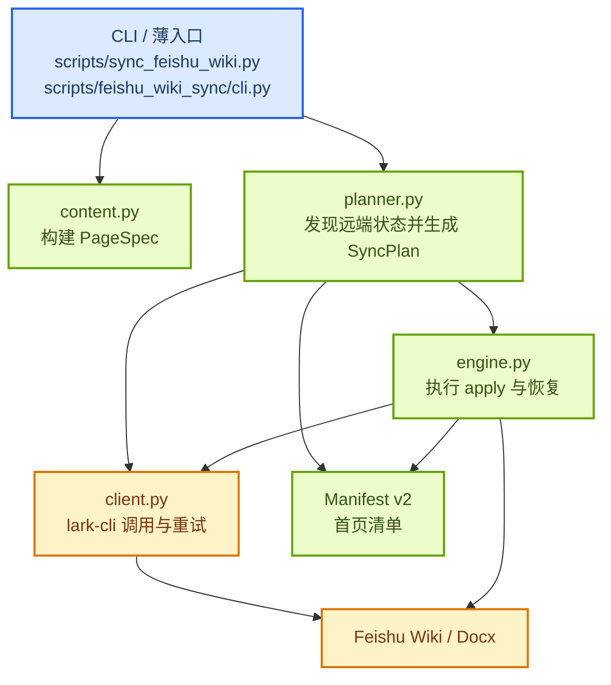

# Feishu Wiki 同步器代码指导文档

本文档面向后续维护 `scripts/sync_feishu_wiki.py` 及其拆分模块的 agent 和开发者，说明模块职责、关键数据流、性能边界与安全不变量。当前结构保留原入口脚本，主体逻辑位于 `scripts/feishu_wiki_sync/`。

## 执行总览

## 模块职责

| 模块 | 负责内容 | 不负责内容 |
| --- | --- | --- |
| `scripts/sync_feishu_wiki.py` | 兼容现有 CLI：`--check`、`--plan`、`--apply`；只做参数转发和退出码桥接 | 业务逻辑、远端调用、内容解析 |
| `cli.py` | 参数解析、环境变量校验、模式分发、阶段耗时日志 | 页面内容构建、远端计划细节 |
| `models.py` | `PageSpec`、`RemotePage`、`TreeNode`、`SyncAction`、Manifest v1/v2 结构与迁移 | lark-cli 调用、树遍历 |
| `content.py` | 读取 README / Notes / Blogs，规范化 Markdown/QMD，媒体清单、内部链接映射，产出 `PageSpec` | 远端比对、写入顺序 |
| `client.py` | 统一封装 lark-cli 子进程、JSON 解析、限流重试、Wiki 节点查询、Docx 基本信息与正文覆盖 | 业务决策、Manifest 合并 |
| `planner.py` | 拉取 Manifest、发现远端树、候选 revision 审计、哈希比较、生成 `SyncPlan` | 真正执行写入 |
| `engine.py` | 执行创建、认领、重命名、正文更新、删除、检查点与最终 Manifest 提交 | 内容解析、CLI 参数解释 |

`content.py` 的读者可见输出遵循“用途优先”规则：页面开头只说明主题、收录范围和阅读用途，不显示同步警告或实现细节；来源路径和 Git commit 追加到正文末尾的中性“文档信息”区域。修改页面外壳时必须更新 `PAGE_RENDER_VERSION`，确保已有页面的哈希发生变化并进入更新计划。

## 关键数据流

同步器的核心数据流固定为：

| 阶段 | 输入 | 输出 | 说明 |
| --- | --- | --- | --- |
| 内容构建 | README、Notes、Blogs、媒体文件 | `PageSpec[]` | 本地真源视图，包含用于后续计算哈希的规范化正文与媒体路径 |
| 远端快照 | Wiki 树、Manifest、首页 Docx 信息 | `RemoteSnapshot` | Wiki 树和 Manifest 共同保存 token、revision、`obj_edit_time` |
| 计划生成 | `PageSpec[]` + `RemoteSnapshot` | `SyncPlan` | 显式列出需要执行的 `create/update/rename/delete/recover` 动作；无动作就是快路径 |
| 写入执行 | `SyncPlan` | 检查点与最终 Manifest v2 | 非首页写入前落 `in_progress`，全部成功后最后提交 `complete` |

推荐把以下对象理解为由上游创建、下游消费；仅 `engine.py` 会在执行期间推进快照里的 Manifest 和树状态：

| 对象 | 谁创建 | 谁消费 |
| --- | --- | --- |
| `PageSpec` | `content.py` | `planner.py` |
| `RemoteSnapshot` | `planner.py` | `planner.py`、`engine.py` |
| `SyncPlan` | `planner.py` | `cli.py`、`engine.py` |
| Manifest v2 | `models.py` 解析 / `engine.py` 写回 | `planner.py`、`engine.py` |

## Manifest v2 规则

Manifest v2 相比 v1 的关键变化，是为非首页受管页面记录 Wiki API 返回的 `obj_edit_time`，用于无变更快路径和候选筛选。该字段是远端对象变更信号；相关接口定义见[获取 Wiki 子节点](https://open.feishu.cn/document/server-docs/docs/wiki-v2/space-node/list?lang=zh-CN)。

| 字段 | 作用 |
| --- | --- |
| `content_hash` | 判断本地正文与媒体是否变更 |
| `revision_id` | 冲突检测最终依据 |
| `obj_edit_time` | 快速判断远端是否可能被改动 |
| `status` | `in_progress` / `complete` 恢复检查点 |

迁移规则：

1. 读取时同时兼容 v1 与 v2。
2. 首次 `apply` 遇到 v1 时，先做一次轻量远端审计，把 Wiki API 已提供的 `obj_edit_time` 写入 v2。
3. `obj_edit_time` 缺失、候选页面哈希变化、或远端编辑时间变化时，才进入 revision 审计。
4. 如果 API 没有返回 `obj_edit_time`，该页必须在后续每次运行继续审计，不能用 `None` 建立快路径。
5. 正文写入并稳定后必须再次读取节点元数据；若 revision 已变化而 `obj_edit_time` 没有推进，就把该字段保存为 `None`，让后续运行回退到逐页审计。
6. revision 仍是正文冲突的最终判据，`obj_edit_time` 只是筛选器；轻量 revision 读取使用[获取文档基本信息](https://open.feishu.cn/document/server-docs/docs/docs/docx-v1/document/get?lang=zh-CN)，不拉取正文。

## 并发与性能边界

重构后的执行模型不是“全串行”，而是“只读有限并发 + 写入保守并发”：

| 阶段 | 并发上限 | 说明 |
| --- | --- | --- |
| Wiki 树发现 | 4 | 分层读取远端节点，记录 `obj_edit_time` |
| 候选 revision / 文档基本信息查询 | 4 | 只对候选页面发起审计 |
| 正文写入 | 2 | 仅不同正文文档可并行 |
| 创建 / 认领 / 重命名 / 删除 / 首页提交 | 1 | 始终串行，避免结构竞争 |

快路径要求：

- 同一 commit、Manifest 为 `complete`、且没有结构或正文动作时，`--apply` 不应逐页查询 revision。
- 上一条只适用于 `obj_edit_time` 完整且未变化的页面；缺失元数据时宁可继续审计，不得静默假设远端未变。
- 完全无动作时首页应为零写入；存在非首页动作时，首页只承担开始检查点和最终提交。
- 只有存在真正写入动作时，才落 `in_progress` 检查点。

GitHub Actions 的阶段耗时日志用于观察回归。完成一次 v1 到 v2 迁移后，以多次运行的中位数作为参考验收：无变化同步不超过 90 秒，常见的 2 页内容更新不超过 150 秒，40 页内容更新不超过 12 分钟。网络限流、GitHub 排队和 runner 冷启动应与同步器自身阶段耗时分开判断。

## 安全不变量

下面这些约束不能被重构破坏：

| 不变量 | 原因 |
| --- | --- |
| 首页 Manifest 是唯一所有权来源 | 禁止按标题认领节点 |
| 未受管节点永不删除 | 防止误删用户内容 |
| 重复标题、未知子节点、受管节点被移动时失败关闭 | 不猜测远端意图 |
| revision 冲突时停止该页覆盖 | 防止静默覆盖手工修改 |
| 首页成功清单最后提交 | 防止中途状态看起来“已完成” |
| 暂存标题与检查点可恢复 | 支持中断后安全重跑 |

## 修改导航

如果后续要改行为，优先落到对应模块，不要把逻辑重新堆回入口脚本：

| 想改什么 | 应修改模块 |
| --- | --- |
| README / Notes / Blogs 到页面正文的转换规则 | `content.py` |
| Manifest 字段、迁移、异常类型 | `models.py` |
| lark-cli 参数、重试、JSON 解析 | `client.py` |
| 哪些页面进入候选审计、动作如何判定 | `planner.py` |
| 创建顺序、并发 worker、恢复与最终提交 | `engine.py` |
| 命令行参数、日志摘要、模式入口 | `cli.py` |
| 保持旧命令不变 | `scripts/sync_feishu_wiki.py` |

## 测试索引

测试建议按职责拆分，而不是继续堆在单个大文件里：

| 测试主题 | 文件 | 重点覆盖 |
| --- | --- | --- |
| 内容转换与 Manifest | `tests/test_feishu_wiki_models_content.py` | README/Notes/Blogs、媒体、内部链接、v1/v2 迁移 |
| 客户端 / 重试 | `tests/test_feishu_wiki_client.py` | lark-cli 调用、429/临时错误、基本信息查询 |
| 计划与执行引擎 | `tests/test_feishu_wiki_planner_engine.py` | 快路径、候选筛选、并发上限、首页最后提交、恢复、删除边界 |

最低必测场景：

- v1 Manifest 首次 `apply` 迁移到 v2。
- 96 页无变更时逐页 revision 查询数为 0。
- 本地哈希变更，以及远端 `obj_edit_time` 变化后发现 revision 漂移的更新路径。
- 只读并发不超过 4，正文写入不超过 2，结构写入始终串行。
- 并发任务部分成功后，下一次 `apply` 能基于检查点恢复。

## 故障恢复思路

排查时先看状态，再看层级：

1. 先看首页 Manifest 是否为 `in_progress`，以及哪些页面已有 token 但未完成。
2. 再看 `SyncPlan` 是否包含 `recover`、`update` 或 `delete`；删除被未知子节点阻塞、revision 冲突等安全错误会直接终止并打印原因。
3. 如果是远端限流或网络波动，优先重跑；如果是重复标题、未知子节点、节点移动，先人工清理远端异常。
4. 不要手工编辑首页 Manifest JSON 来“修好”状态，除非是在恢复历史版本后重新执行 `--plan` / `--apply`。

## 推荐阅读顺序

第一次接手同步器时，建议按这个顺序阅读代码：

1. `scripts/sync_feishu_wiki.py`
2. `scripts/feishu_wiki_sync/cli.py`
3. `scripts/feishu_wiki_sync/models.py`
4. `scripts/feishu_wiki_sync/content.py`
5. `scripts/feishu_wiki_sync/planner.py`
6. `scripts/feishu_wiki_sync/engine.py`
7. `scripts/feishu_wiki_sync/client.py`

这样可以先理解外部接口和数据模型，再进入远端交互与执行细节。
