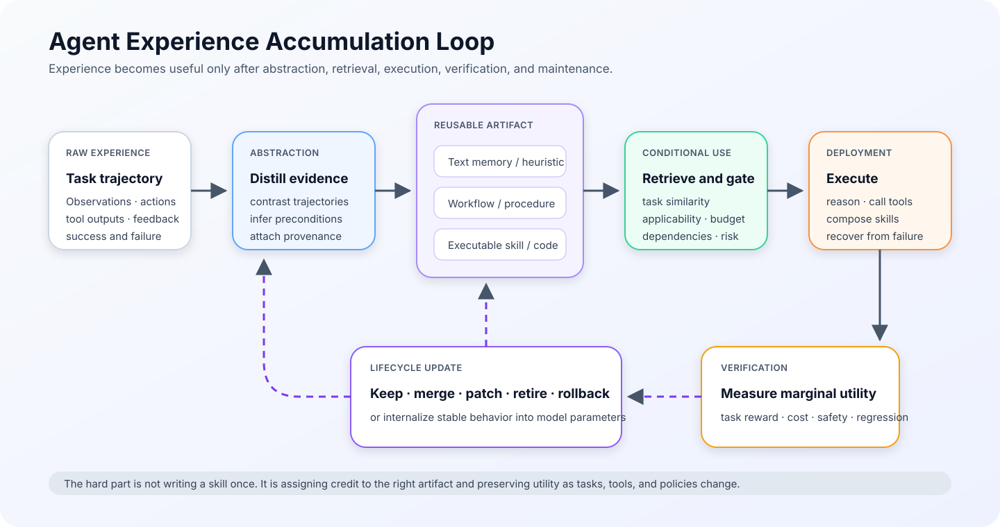
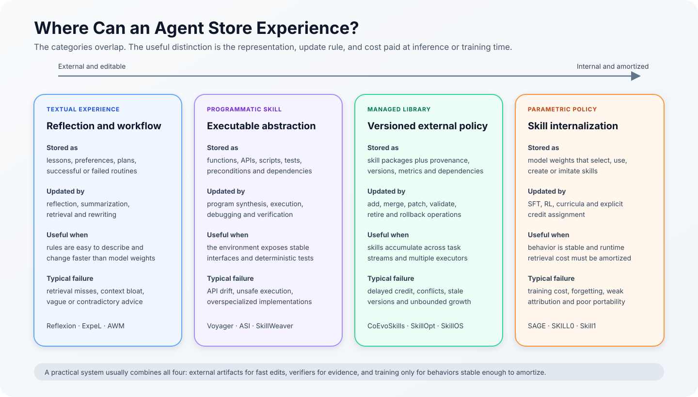

LLM-based agents can now reason, search, call tools, and complete multi-step tasks in browsers, code repositories, and desktop environments. Most systems, however, still behave like executors whose memory resets every day. An API pitfall diagnosed today is encountered again tomorrow. A failed trajectory exposes a bad strategy, yet the same strategy reappears on the next task. A user may repeatedly correct a formatting preference, but the correction remains effective only inside the current conversation.

The question “How can an agent accumulate experience?” is therefore not answered by attaching another vector store to the context window. The real problem is how to compress states, actions, environment feedback, and outcomes from one task into a capability unit that can be triggered correctly, executed reliably, and maintained over time.

Research from the past three years offers several answers. Reflexion writes post-failure reflections into episodic memory. AWM induces workflows from trajectories. Voyager stores experience as executable code. SkillOpt and SkillGrad treat skill documents as optimizable external parameters. SKILL0 gradually removes skill context during training so that behavior moves into model parameters. These systems do not form four clean technological generations. The more useful axes are **where experience is stored, how it is represented, when it is updated, and how feedback is assigned to a particular skill.**

::: {.callout-warning title="Evidence scope"}
The literature search for this note was completed on 2026-06-30. Early systems such as Reflexion and Voyager have accumulated substantial follow-up discussion, but most skill-centric methods covered here appeared between late 2025 and the first half of 2026 and remain arXiv preprints. Their models, harnesses, tasks, and cost accounting differ. Reported numbers are used to explain each method, not to rank papers across benchmarks.
:::

## 1. Experience, Memory, Workflows, and Skills Are Different Objects

An agent trajectory can be written as:

$$
\tau = (o_0, a_0, f_0, o_1, a_1, f_1, \ldots, o_T, r),
$$

where $o_t$ is an observation, $a_t$ an action, $f_t$ a tool or environment response, and $r$ the final reward or task result. Saving $\tau$ proves that the system retained a log; it does not prove that the system learned from experience. A future task rarely matches the old one token for token, and raw trajectories contain unproductive searches, accidental successes, and environment noise. Experience learning must extract causal clues that transfer and state the conditions under which they hold.

This note uses the following distinctions:

| Concept | Primary content | Typical use | Common failure |
| --- | --- | --- | --- |
| Episodic memory | A task trajectory, result, and reflection | Retrieve a similar case or retry the same task | Long, noisy, and prone to memorizing instances rather than rules |
| Semantic memory | Facts, preferences, and heuristics distilled across experiences | Retrieve and inject into context | Vague scope and conflicts between positive and negative lessons |
| Workflow | A reusable sequence of high-level actions | Provide a planning scaffold for a new task | Breaks when the interface or task structure changes |
| Tool | An atomic callable environment interface | Execute one well-defined action with arguments | Provides an action but not when to call it or how to compose it |
| Skill | A capability package with triggers, procedures, resources, and verification | Retrieve, compose, and guide a full task | Expensive versioning, dependencies, retrieval, validation, and security |
| Parametric policy | Behavioral tendencies encoded in model weights | Generate actions without extra retrieval | Expensive to update, hard to audit and roll back, vulnerable to forgetting |

The word “skill” has itself shifted meaning. In classical hierarchical RL, a skill often means an option or temporally extended policy. Recent agent papers use the same word for Markdown guidance, Python functions, APIs, scripts, and test bundles. This note follows the newer engineering usage but imposes a stricter criterion: a skill should answer **when it applies, how it runs, and how correctness is checked**. Instructions without triggers are closer to knowledge; a function signature without a procedure is closer to a tool.

## 2. Experience Accumulation Is a Verified Loop

Placing existing work in one system reveals six linked stages: record trajectories, extract regularities, choose a representation, retrieve it conditionally, execute and compose it, and maintain it from feedback. A failure at any stage can turn the experience store from an asset into a source of noise.

_Figure 1: Synthesized for this note. Experience produces attributable value only after abstraction, conditional use, and verification._

A candidate skill can be represented as a structured object:

$$
s = \{
\text{trigger},
\text{scope},
\text{preconditions},
\text{procedure},
\text{resources},
\text{verifier},
\text{fallback},
\text{provenance},
\text{version}
\}.
$$

These fields are not meant to turn Markdown into a needlessly complicated schema. They supply boundaries that plain reflections omit. `procedure` explains what to do. `preconditions` and `scope` limit incorrect transfer. `verifier` supplies observable completion criteria. `fallback` lets the agent choose a simpler strategy when cost or environment compatibility becomes a problem. `provenance` links the conclusion to the trajectories and feedback that support it.

A skill should not be retained merely because a task succeeded after loading it. The more relevant target is marginal utility:

$$
\Delta U(s;x)
=
\mathbb{E}\left[R(\pi, s, x)-R(\pi, \varnothing, x)\right]
-\lambda C(s,x)
-\mu \operatorname{Risk}(s,x),
$$

where $x$ is the task, $R$ the task benefit, $C$ retrieval, context, tool, and latency cost, and the risk term covers unauthorized actions, harmful side effects, and supply-chain exposure. This expression makes one point that success rate often hides: a skill that improves pass rate by one point while multiplying token and execution cost may not be worth deploying.

_Figure 2: Synthesized for this note. Text, programs, managed libraries, and parameter internalization are complementary rather than mutually exclusive._

## 3. Externalized Textual Experience: From Within-Task Reflection to Cross-Task Workflows

### 3.1 Reflexion: beginning with within-task retry

[Reflexion](https://arxiv.org/abs/2303.11366) uses a direct loop. After an attempt, the agent produces a reflection from scalar or linguistic feedback, stores it in episodic memory, and reads it during the next attempt. Model weights remain fixed; learning takes place in context. The mechanism fits tasks with explicit retry opportunities, such as summarizing the cause of a failed code test or revising a plan from ALFWorld feedback.

Reflexion made post-failure linguistic summaries operational, but it mainly addresses retries of the same or closely related task. Whether a reflection transfers across tasks, whether an old reflection conflicts with a new environment, and what to preserve when memory fills up remain open. A single failure may produce a plausible lesson such as “check the input first,” yet provide too little evidence to justify a permanent rule.

[ExpeL](https://arxiv.org/abs/2308.10144) moves from retry toward cross-task experiential learning. It gathers successful and failed training-task experiences, extracts natural-language insights by comparing them, and retrieves both insights and similar trajectories at inference time. This creates a pattern that later systems repeatedly reuse: concrete cases preserve evidence, while abstract lessons support transfer. Cases alone consume context; principles alone lose applicability conditions.

### 3.2 AWM: compressing trajectories into reusable workflows

[Agent Workflow Memory (AWM)](https://arxiv.org/abs/2409.07429) does not simply place a full trajectory or a reflection back into the prompt. It induces recurring routines from web-navigation tasks, such as “search for a product, open its detail page, verify attributes, and add it to the cart.” The method supports offline induction and online induction from tasks completed during evaluation.

AWM reports relative success-rate gains of 24.6% on Mind2Web and 51.1% on WebArena while reducing the steps required for successful WebArena tasks. More instructive than the score is the representation shift. A workflow sits between atomic clicks and a complete task. It compresses long trajectories and allows old routines to be composed for new goals.

A workflow is still text. When page labels change, site state shifts, or an action requires exact argument binding, the agent must reinterpret the prose and regenerate low-level operations. Errors accumulate across workflow retrieval, workflow interpretation, element grounding, and execution. The flexibility of textual experience comes from interpretive freedom; its fragility comes from the same place.

### 3.3 ReasoningBank, AutoRefine, and AutoSkill: giving text repositories a lifecycle

[ReasoningBank](https://arxiv.org/abs/2509.25140) distills reasoning strategies from self-judged successful and failed experiences and uses memory-aware test-time scaling to generate richer contrastive trajectories. It values failed experience rather than storing only successful routines, because failure can identify when a strategy does not apply. The corresponding risk is that an unreliable self-judge can write incorrect attributions into the bank.

[AutoRefine](https://arxiv.org/abs/2601.22758) uses two experience forms. Complex procedures become specialized subagents with their own reasoning and memory, while static knowledge is stored as guidelines or code snippets. Scoring, pruning, and merging are explicit parts of the design, preventing repository quality from degrading as experience accumulates. [AutoSkill](https://arxiv.org/abs/2603.01145) focuses on long-term user interaction, turning stable preferences and requirements into standardized textual skills that can be injected into later sessions.

These methods share attractive operational properties: they do not require access to model weights, can update quickly, remain readable, and are easy to roll back. Their costs are equally concrete:

- The retriever must find truly relevant experience in a growing library.
- Every injection consumes context and may displace direct evidence for the current task.
- Textual rules provide no type or execution guarantee; an agent can read a rule without following it.
- User preferences, environment facts, and procedures expire at different rates, which a single undifferentiated vector store tends to hide.

Programmatic skills have therefore not made textual experience obsolete. Text remains appropriate for fast-changing, difficult-to-formalize, human-auditable rules. The mistake is treating “expressible in one sentence” as equivalent to “learned.”

## 4. Programmatic Skills: Turning Experience into Executable Interfaces

### 4.1 Voyager: an early code-skill-library pattern

[Voyager](https://arxiv.org/abs/2305.16291) maintains a growing JavaScript skill library in Minecraft. Each skill is executable code. The agent retrieves functions for a task and iterates on them through environment errors, execution feedback, and self-verification. Compared with natural-language advice, functions can be called, composed, and tested directly, compressing many low-level actions behind a high-level interface.

Voyager reports 3.3 times as many unique items as earlier methods and can transfer its skill library into a new Minecraft world. The result makes program representation attractive for open-ended environments, but the setting is unusually favorable: action interfaces are explicit, execution is retryable, outcomes are observable, and mistakes do not cause real-world damage.

[OS-Copilot/FRIDAY](https://arxiv.org/abs/2402.07456) extends related ideas to operating-system tasks. FRIDAY creates and reuses skills across browsers, terminals, files, and office applications. General computer environments expose harder engineering constraints than Minecraft: application state is partially observed, GUI actions are unstable, and permission boundaries are more complex. As program skills move closer to real systems, verification and isolation become mandatory rather than optional.

### 4.2 ASI: the value of program skills comes from verification, not the appearance of code

[Agent Skill Induction (ASI)](https://arxiv.org/abs/2504.06821) induces, verifies, and uses programmatic skills online. On WebArena, the paper reports a 23.5% improvement over a static agent and an 11.3% improvement over its textual-skill counterpart, together with 10.7%–15.3% fewer execution steps. The authors attribute much of the difference to programmatic verification during induction: a candidate must pass correctness, usage, and validity checks before entering the library.

This conclusion is more precise than “code is more stable than text.” LLM-generated code can still hallucinate, hard-code a page layout, or fail on boundary inputs. What program representation adds is testability. When an environment supplies deterministic feedback, the system can reject an incorrect skill instead of asking another LLM whether its prose sounds reasonable.

[SkillWeaver](https://arxiv.org/abs/2504.07079) lets a web agent explore a site, propose skills it can practice, execute them repeatedly, and distill the resulting experience into APIs. It reports relative success-rate gains of 31.8% on WebArena and 39.8% on real websites and shows that APIs produced by a stronger agent can help a weaker one. The operative word is “honing”: an API is not finished when a single successful trace is converted into code. Repeated practice is used to turn an accidentally working script into a more robust interface.

### 4.3 PolySkill: separating goals from implementations

Program skills often overfit a particular website. A function called `search_product_amazon` may work well but transfer poorly to another retailer. [PolySkill](https://arxiv.org/abs/2510.15863) borrows polymorphic abstraction from software engineering and separates what a skill accomplishes from how it is implemented on a particular site. The paper reports 1.7 times greater reuse on seen websites and success-rate gains of up to 13.9% on unseen sites.

This separation reduces tension between reuse and adaptation. The abstract goal can transfer across sites, while the implementation remains replaceable. The system must still maintain an interface contract. If inputs, outputs, preconditions, and side effects are underspecified, polymorphism merely postpones the error until runtime.

Programmatic skills also introduce risks that textual memory does not. A skill may read and write files, access the network, or execute shell commands, and malicious behavior can be hidden in auxiliary resources. [PhantomSkill](https://arxiv.org/abs/2606.19191) demonstrates this supply-chain surface for third-party skill packages. Production systems need sandboxing, least privilege, dependency locking, resource-level scanning, execution auditing, and reversible versions. “The code runs” is never a sufficient admission criterion.

## 5. Skill-Library Maintenance: Versioning, Verification, and Attribution

When a library contains ten skills, embeddings and manual inspection may be enough. With hundreds of skills shared across agents, the library behaves more like a continuously changing software repository. A new skill can shadow an old one. Two locally correct workflows can conflict. Environment upgrades make old experience stale. A final task score rarely identifies which loaded skill mattered.

### 5.1 From trajectory induction to versioned editing

[Trace2Skill](https://arxiv.org/abs/2603.25158) dispatches multiple analysis agents to read different execution trajectories, extract trajectory-local lessons, and consolidate them hierarchically into a more coherent skill directory. It avoids patching the skill sequentially in trajectory arrival order, which can overfit the repository to the most recent local lesson. A second 2026 paper uses the same Trace2Skill name for EDA agents; this note refers to arXiv:2603.25158.

[CoEvoSkills](https://arxiv.org/abs/2604.01687) isolates a Skill Generator from an independent Surrogate Verifier. The generator edits a multi-file skill package. The verifier sees only the task specification and outputs, creates deterministic assertions, and returns diagnostics. If surrogate tests pass while a hidden oracle still fails, the system strengthens the verifier rather than revealing hidden tests to the generator. The object being evolved is therefore not just the skill but also the mechanism used to check it.

[SkillOpt](https://arxiv.org/abs/2605.23904) resembles a text-space optimizer. A separate optimizer model turns scored rollouts into bounded add, delete, and replace edits on one skill document, and accepts an edit only when held-out validation improves strictly. It also uses a textual learning-rate budget, a rejected-edit buffer, and slower meta updates. [SkillGrad](https://arxiv.org/abs/2605.27760) treats failure diagnoses as text gradients, accumulates recurring problems through momentum memory, and lets a patcher update the skill package.

These systems borrow the language of gradient descent, but the analogy is not a mathematical equivalence. Text edits do not inhabit a continuous differentiable space, and an LLM-generated “gradient” is not an analytic derivative of the objective. The useful part of the analogy is optimization discipline: bound each edit, remember rejected proposals, evaluate against an independent set, and roll back regressions.

### 5.2 Learning how to maintain instead of fixing maintenance rules

[SkillOS](https://arxiv.org/abs/2605.06614) freezes the executor and trains a curator to update a SkillRepo from task streams and delayed feedback. Skills produced on early tasks are evaluated through later related tasks, giving curation actions a longer-horizon signal. [CODESKILL](https://arxiv.org/abs/2605.25430) targets coding agents and formulates multi-granularity skill extraction and skill-bank maintenance as a learned policy. It combines rubric-based quality feedback with downstream execution results and constrains the bank to a stable size.

The attribution problem can be represented by a confounded outcome function:

$$
R_t = F(\pi_t, x_t, H_t, \mathcal{S}_t, E_t, \xi_t),
$$

where $\pi_t$ is the current model, $H_t$ the harness, $\mathcal{S}_t$ the retrieved skill set, $E_t$ the environment version, and $\xi_t$ sampling randomness. Task success does not prove that a skill helped. Failure may result because the model did not retrieve the skill, read it without executing it, encountered a tool timeout, or ran against a changed environment. A maintainer that attributes all outcomes to skill content will update the library incorrectly.

My view is that the core skill-library record should contain more than a body and an embedding. It should also preserve source trajectories, applicable environments, dependency versions, usage counts, paired evidence of help and harm, the last verification time, and a rollback point. Without those fields, “automatic evolution” easily becomes automatic append-only growth.

## 6. SFT and RL: Teaching Models to Select, Use, and Internalize Skills

External skills update quickly, but every inference pays retrieval, loading, and interpretation costs. Training-based work tries to move some of this cost into model parameters. Skill-augmented RL and skill internalization, however, are not the same thing.

### 6.1 Including skills in training does not imply internalization

[SAGE](https://arxiv.org/abs/2512.17102) uses Sequential Rollout so that an agent accumulates skills across a chain of similar tasks and introduces a Skill-integrated Reward to encourage generation and reuse. On AppWorld, it reports an 8.9% increase in Scenario Goal Completion, 26% fewer interaction steps, and 59% fewer generated tokens. Skills remain in an external library, but the RL policy learns to act in states augmented by them.

[SkillRL](https://arxiv.org/abs/2602.08234) distills a hierarchical SkillBank from experience, distinguishes general heuristics from task-specific skills, and recursively co-evolves the bank with the RL policy. Its main target is the length and noise of raw trajectories, not complete removal of the external library.

Both methods train skill-aware policies, but inference still depends on a SkillBank. They can improve retrieval and use while also coupling the policy to a particular library structure. Replacing the backbone, harness, or skill schema therefore requires a new transfer evaluation.

### 6.2 SKILL0: provide skills during training, remove them at inference

[SKILL0](https://arxiv.org/abs/2604.02268) gives internalization a stricter definition. Training begins with full skill context. A dynamic curriculum gradually removes skills from which the current policy still benefits, until the model no longer retrieves skills at inference time. The paper reports improvements over standard RL of 9.7% on ALFWorld and 6.6% on Search-QA while keeping per-step context below 0.5k tokens.

The design resembles privileged-information distillation: skills serve as scaffolding during training, and model parameters eventually carry the behavior. Runtime cost falls, but external editability is lost. When a rule changes, editing Markdown is no longer sufficient; the system needs retraining or another distillation cycle. Experience should enter weights based on stability, not frequency alone. User preferences, business rules, and API details change quickly and are usually safer outside the model. General decomposition strategies, tool-selection patterns, and recovery habits are better candidates for internalization.

### 6.3 Skill1 and SkillMaster: assigning training signals to the skill lifecycle

[Skill1](https://arxiv.org/abs/2605.06130) uses one policy to generate a retrieval query, rerank and select a skill, solve the task with that skill, and distill a new skill from the trajectory. It tries to derive credit for selection, use, and distillation from a shared task-outcome signal, avoiding separate rewards that pull the three capabilities toward incompatible objectives.

[SkillMaster](https://arxiv.org/abs/2605.08693) trains an agent to create, update, or retain a skill based on a completed trajectory and evaluates candidate edits by counterfactual utility on related probe tasks. DualAdv-GRPO estimates separate advantages for task-solving actions and skill-edit decisions, reducing interference between decisions that operate on different time scales.

Both methods target the hardest issue in skill-centric RL: should the final reward credit the current task action or a skill edit made earlier? Validation on the current task alone encourages instance memorization; validation far in the future produces an extremely sparse signal. Counterfactual evaluation, paired rollouts, and separate advantages all shorten this attribution path.

## 7. Evaluation: Separating Skill Quality, Retrieval, Use, and Task Utility

Early papers often compared final success rates with and without an experience module. That aggregate mixes skill quality, retrieval, harness behavior, model capability, and extra tokens. Benchmarks released in 2026 begin separating these factors, and their conclusions are more restrained than the one-directional gains in individual method papers.

### 7.1 SkillsBench: curated skills help, self-generated skills may not

[SkillsBench v4](https://arxiv.org/abs/2602.12670) currently contains 87 tasks across 8 domains with deterministic verifiers and evaluates 18 model–harness configurations under paired conditions. Curated skills raise average pass rate from 33.9% to 50.5%, a gain of 16.6 percentage points. All 18 configurations improve, but gains range from +4.1pp to +25.7pp.

The positive headline has three important qualifications:

1. Thirteen of the 87 tasks have negative skill deltas. Typical causes are an unnecessarily heavy workflow, displacement of a stronger default strategy, or a solver that the agent cannot debug.
2. Focused skills with two or three modules outperform exhaustive documentation, while the average gain falls substantially when four or more skills are supplied.
3. On Claude Code + Opus 4.7, Codex + GPT-5.5, and Gemini CLI + Gemini 3.1 Pro, self-generated skills trail the no-skill baselines by 8.1, 11.3, and 11.5 points. Audits find generated packs that the solver never discovers and others that lock in incorrect assumptions.

These results do not establish that agents can reliably author their own skills. They support a narrower claim: high-quality procedural guidance matched to the task can help substantially, while skill creation, discovery, and applicability remain separate problems.

### 7.2 SWE-Skills-Bench: small average gains in software engineering

[SWE-Skills-Bench](https://arxiv.org/abs/2603.15401) pairs 49 public software-engineering skills with real GitHub repositories pinned at fixed commits, producing roughly 565 tasks with deterministic acceptance tests. It reports an average improvement of only +1.2%. Thirty-nine of the 49 skills do not change pass rate; token overhead reaches 451%; and three skills reduce performance, by as much as 10%, because their guidance is incompatible with the repository version.

Software-engineering tasks already receive broad coverage from pretraining, code search, and existing tools. Generic advice such as “read the code and write tests first” may add no information. The useful skills are often version-sensitive, domain-specific, and explicit about verifier-facing details. This benchmark also shows why repository and dependency versions must be fixed: experience can be correct for an old environment and still fail at execution time.

### 7.3 SkillLearnBench, SkillRet, and SRA-Bench: separating generation, retrieval, and use

[SkillLearnBench](https://arxiv.org/abs/2604.20087) contains 20 verified skill-dependent tasks across 15 subdomains and evaluates continual learning at three levels: skill quality, execution trajectory, and task outcome. No method leads across every task and model, and stronger backbones do not consistently produce better skills. Multiple rounds with external feedback can yield genuine improvement; self-feedback alone can create recursive drift.

At library scale, retrieval becomes a separate bottleneck. [SkillRet](https://arxiv.org/abs/2605.05726) includes 17,810 public skills, 63,259 training samples, and 4,997 evaluation queries and measures large-scale routing with metrics such as NDCG@10. [SRA-Bench](https://arxiv.org/abs/2604.24594) decomposes the pipeline into retrieval, incorporation, and end-task execution. Its analysis finds that current agents load skills at similar rates whether a gold skill was retrieved or whether the task actually needs external capability. Even after correct retrieval, the model may fail to use the skill at the right time.

### 7.4 GDPevo: evaluating cross-task rule induction rather than retrying the same question

[GDPevo](https://github.com/Prism-Shadow/GDPevo) releases 12 task groups and 120 real-business tasks in CRM, ERP, and Finance. Each group shares a business environment and contains five training tasks and five held-out test tasks. Training examples reveal fragments of underlying rules, while test tasks recombine those rules to distinguish rule induction from answer memorization. Deterministic rubrics score `acc@3`, tokens, and dollar cost.

In the current project results, few-shot or reflection conditions improve `acc@3` over the base by roughly 18–20 points across three agents, while cost changes range from -25.75% to +11.82%. GDPevo is a project benchmark rather than a peer-reviewed publication, and its scores should not be compared directly with SkillsBench. Its useful design choice is to define experience learning as cross-task transfer and place cost on the same scorecard.

Taken together, these benchmarks suggest a broader evaluation stack:

| Level | Example metrics | Question to isolate |
| --- | --- | --- |
| Generation | Factual correctness, procedure coverage, test pass rate | Is the candidate skill itself reliable? |
| Trigger and retrieval | Recall@k, NDCG, false-trigger rate | Does the system find the skill it should use and reject irrelevant ones? |
| Use | Invocation rate, step adherence, argument accuracy | Does the agent execute a retrieved skill correctly? |
| Task | Paired pass rate, reward delta | What is the marginal contribution to the final outcome? |
| Cost | Tokens, latency, tool calls, training compute | Is the gain worth the overhead? |
| Transfer | Across tasks, websites, models, and harnesses | Did the system learn a rule or an implementation detail? |
| Lifecycle | Regression rate, library size, staleness, rollback count | Does accumulated experience remain beneficial over time? |
| Safety | Permission violations, malicious dependencies, irreversible effects | Does executable experience expand the attack surface? |

## 8. Engineering an Auditable Experience-Learning Loop

Method papers usually validate one component in a clean benchmark. A real system must connect the components into an auditable engineering loop. I would impose the following constraints.

First, trajectory logging must preserve causal context. Final answers and rewards are insufficient. Logs should include environment version, tool schema, loaded skills, model and harness versions, important intermediate artifacts, and per-check verifier feedback. Without these fields, future maintenance cannot distinguish a skill error from environment drift.

Second, skill creation needs an evidence threshold. A single successful trajectory belongs in a candidate area, not directly in a global rule. Promotion can require support from independent trajectories or, at minimum, paired validation on related held-out probes. Failed experience also matters, but should be recorded as “strategy P failed under condition C,” not generalized into “never use P.”

Third, retrieval needs an explicit abstain path. Many systems force top-k to return something, so a library without a valid match still supplies the semantically nearest wrong procedure. A retriever should estimate relevance, preconditions, environment compatibility, and expected cost. Below a threshold, no skill is often the better choice.

Fourth, skill updates should resemble software releases. A candidate version first runs on shadow or canary tasks and is compared against no-skill, old-version, and new-version conditions. It becomes active only after passing, and regressions trigger rollback. Programmatic skills also need locked dependencies, limited permissions, and recorded side effects. Merging two skills requires new combination tests; local correctness does not necessarily compose.

Fifth, parameter internalization should be reserved for stable patterns. Weights are suitable for behavior that transfers across environments, is invoked frequently, and is expensive to load externally: checking tool responses, confirming state before irreversible operations, or choosing search versus code execution from task structure. Frequently changing policies, user preferences, and API details should remain in editable external artifacts. This reduces runtime context without sacrificing fast revision.

Finally, the maintainer itself requires evaluation. An agent that constantly writes new skills can look productive in a short demonstration while allowing library size, conflicts, and retrieval cost to grow without bound. A useful maintenance policy must be willing to delete, merge, reject, and roll back. Growth is not the objective. Long-term marginal utility after cost and risk is.

## 9. Conclusion

Agent experience learning is moving toward skill-centric representations, but “skill-centric” is not evidence that agents already self-evolve reliably. The current literature supports a more limited set of conclusions:

- Linguistic reflection and workflows preserve experience cheaply, with retrieval, context, and scope as the main bottlenecks.
- Programmatic skills improve composition and testability while adding interface drift, execution safety, and dependency management.
- Once a library grows continuously, the central problem shifts from generation to credit assignment, versioned verification, and regression control.
- RL can train models to select, use, and edit skills. Genuine parameter internalization requires capability to survive after external scaffolding is removed at inference time.
- Benchmarks show that curated skills can be highly useful and that self-generated skills, incorrect retrieval, and extra cost can erase the benefit.

The next question worth tracking is therefore not how many skills an agent can write in one run. It is whether the agent can answer four concrete questions from sparse feedback: Does this lesson transfer? Under which conditions should it trigger? What evidence shows positive marginal utility? When the environment changes, should the skill be revised or removed? Experience is accumulated only when those questions are answered reliably.
