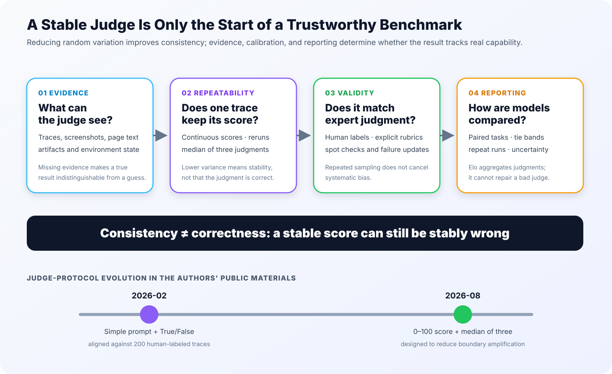

Model leaderboards often interpret a gap of a few percentage points as a clear capability difference. That number, however, passes through at least two stochastic processes: the agent must first perform the task, and a judge must then decide how well it did. In [The Benchmark Behind the Benchmark](https://browser-use.com/posts/benchmark-behind-the-benchmark), the authors froze the agent trajectories and changed only the judging model. The aggregate score for the same work ranged from **62.5% to 83.7%**. A 21.2-point range is wider than the separation between many neighboring models on public leaderboards.

The value of this experiment is not another agent ranking. It turns the judge from an implementation detail into an object of evaluation. This note first reconstructs the complete evidence chain and then asks a stricter question: once the judge becomes stable, is the score trustworthy? My answer is no. Lower variance improves repeatability; correctness still depends on evidence coverage, task specification, human calibration, and the comparison protocol.

## 1. What Sources of Noise Move an Observed Score?

The original article describes a benchmark as a task set plus a judge. For open-ended web-agent work, this is a useful simplification: a dataset does not produce a score by itself. Some grading procedure must decide how much of the requested outcome was achieved.

The article begins by decomposing observed score variance into two terms:

$$
\mathrm{Var}(\text{score})
=
\underbrace{\sigma^2_{\text{agent}}}_{\text{measured, not removed}}
+
\underbrace{\sigma^2_{\text{judge}}}_{\text{reducible}}
$$

`agent noise` comes from model sampling and the live web. A popup can load 100 ms later, an IP can be blocked, a button can move, or the agent can misread a filter and stop one step too early. Identical configurations can therefore produce different trajectories. `judge noise` appears after execution is complete: the same finished trajectory receives different scores when graded again.

### 1.1 One Agent Does Not Have One Fixed Outcome

The authors ran GPT-5.5 five times on the same 106 tasks with the same model, harness, and configuration. Each run solved about 89 tasks, but never the same 89.

Of the 106 tasks, 64 passed in all five runs and 2 failed every time. The remaining 40 moved between success and failure. A single run scored roughly 85%, whereas the union over five runs contained 104 tasks that succeeded at least once.

Those numbers answer different questions. A single-run score approximates how reliable the configuration usually is. Best-of-5 is closer to whether it can complete the task when given repeated attempts. A leaderboard that reports one number without the trial count and aggregation rule conflates capability with reliability.

### 1.2 Judge Variation Can Be Larger Than Agent Variation

The authors then froze 104 completed trajectories with human labels and changed only the judging model, evaluating 11 judges in total.

All judges passed 48 trajectories and failed 9. They disagreed on the remaining 47. In other words, about 45% of the task outcomes depended on which judge was asked. The most lenient judge reported 83.7%; the strictest reported 62.5%.

The term “judge noise” needs care here. Differences across 11 models are not necessarily all random. They can include stable biases in how a judge treats formatting errors, substituted workflows, missing evidence, and partial completion. Repeated sampling mainly suppresses the random component. Detecting stable bias requires human labels and a rubric.

## 2. From a Single Call to an Agentic Judge

The first judge described in the source was a single LLM call: put the entire trajectory in a prompt and request a verdict. That can work for short traces from one harness. With several harnesses and hundreds of steps, the decisive evidence may be removed by truncation or compaction.

### 2.1 The Decisive Error May Appear Once

The article gives a task that asks for rental listings below \$2,000 per month. At step 34, the agent sets the filter to \$20,000. The remaining 126 steps are clean and coherent, but they all operate under the wrong condition.

If the judge reads only the final answer, the result can look plausible. If the trace is truncated around the wrong region, the judge cannot recover the cause either. Grading this task is not ordinary text classification; it is evidence retrieval over a long trajectory and workspace.

The authors therefore converted the judge into a read-only agent. It can inspect the trajectory, open a generated CSV, return to a specific step, and compare a value with its source page. The concrete advantage of an agentic judge is not merely “better reasoning.” It receives opportunities to search and cross-check.

### 2.2 The Evidence Contract Comes Before Prompt Engineering

A judge can verify only the material it can open. Screenshots, page text, generated files, and full traces can all be truncated under a budget. Once a correct answer loses its evidence, it becomes indistinguishable from an invented claim to the judge.

An evaluation system therefore needs an evidence contract before it tunes the judge prompt: what each run saves, in which format, whether the judge can locate generated artifacts, whether page state can be reconstructed, and where truncation happens. Prompt changes cannot restore evidence that was never collected.

## 3. Why Continuous Scores Are More Stable Than Binary Verdicts

Many real tasks have no natural 0/1 boundary. “Check one of the top contributors” does not specify the top 10 or top 20. Returning a CSV with all the correct data when JSON was requested is also difficult to equate with total failure.

One task in the experiment asked the agent to open a recommended Space, inspect a top contributor, and return the follower count. The recommended-Spaces page required login, so the agent used a publicly reachable Space and verified **227 followers**. Given the same screenshots and number, 5 of 11 judges passed the task and 6 failed it. Their disagreement centered on whether replacing the login-gated Space was acceptable.

Encoding the result as 0 or 1 hides the underlying judgment. A score of 60 can still be debated, but the debate now refers to visible completion and evidence.

The authors changed the question to: what percentage of the requested outcome was delivered correctly and backed by evidence? The same judge graded the same traces four times while only a setting that should not affect the answer was changed. Interpreted as pass/fail, the benchmark moved by 20 percentage points. Retaining the raw 0–100 scores reduced the movement to 0.5 points.

The binary judge does not necessarily make more mistakes. The threshold amplifies borderline cases: a two-point change can move an entire task from 0 to 1, after which that discrete flip enters the aggregate with a full task's weight. Continuous scoring preserves partial completion and avoids some of this discontinuity.

## 4. How Multi-Judge Aggregation Reduces Variance

A second method is to judge one trajectory independently several times and combine the results.

If each judgment is the true score plus independent zero-mean error, the variance of the average over $n$ judgments is:

$$
\mathrm{Var}(\bar{s}) = \frac{\sigma^2}{n}
$$

Three independent judgments reduce standard deviation to $1/\sqrt{3}$ of the original, and five reduce it to $1/\sqrt{5}$. The reported experiment observed less than the ideal independent-noise gain, but the aggregate benchmark moved by only about one point across repeated judging runs.

### 4.1 Why Use the Median?

Finding a buried defect in a long trace is a search problem. Three judges might report 96, 98, and 10 because the low-scoring judge happened to open the decisive file. The mean would fall by almost 30 points. The median resists that outlier.

The cost is equally clear. With scores of 20, 25, and 95, the median removes the only correct high-scoring judge. A median cannot tell whether an outlier is wrong or whether a minority judge found the missing evidence.

The authors tried sending widely separated scores and their audits to a fourth model for arbitration.

This made the final number less stable because the arbitrator was another stochastic LLM. The team ultimately accepted that a median would miss a few real defects in exchange for a repeatable aggregate.

### 4.2 A Failure-Mode Library Acts Like a Marking Scheme

Universities do not ask every teaching assistant to invent partial-credit rules from scratch. They provide a marking scheme that assigns points to proof steps. The authors similarly ran a task about 20 times across models, collected the ways it failed, and supplied the resulting **5,692 failure modes** to the judge.

This reduces disagreement for known cases but cannot cover new strategies. If an agent skips the browser and reverse-engineers a site's API, the existing list may have no applicable rule. The failure-mode library is a versioned artifact, not a static prompt that can be written once.

## 5. From Per-Task Scores to Model Comparisons

Once every task has a continuous score, an evaluation still needs a rule for concluding that model A is better than model B. The article compares threshold counting, task-level pairing, and Elo in that order.

### 5.1 Threshold Counting Reintroduces Amplification

The common approach is to choose a pass line, convert every score above it to a success, and report the total pass rate.

This discards the information preserved by continuous scoring. A 52 and a 48 are close in practical completion but become opposite outcomes after thresholding.

### 5.2 Same-Task Pairing Removes Some Shared Noise

A more informative comparison has both models attempt the same task, assigns a per-task winner, and keeps a tie band for small score differences. The source used a five-point tie band because that roughly matched the natural movement of the same judge on the same task.

The paired difference and its standard error can be written as:

$$
\bar{\Delta}
=
\frac{1}{n}\sum_{i=1}^{n}(A_i-B_i),
\qquad
\mathrm{SE}
=
\frac{s_{\Delta}}{\sqrt{n}}
$$

Mean differences can still be contaminated by a few extreme judge decisions. In the article, Opus beat Grok on 44 tasks by an average of 12.3 points. Grok beat Opus on 28 tasks by an average of 26.7 points. The mean difference favored Grok, whereas win counts favored Opus by 56.6 to 43.4. The authors trusted the latter because a 90-point difference on one task was more likely to be a judge artifact than a capability gap.

Win counting also discards magnitude. The justification is that task-level magnitude may contain more judge artifact than useful signal. This choice depends on the task and judge error structure and should not be treated as universal.

### 5.3 Elo Scales the Comparison but Cannot Repair the Judge

When there are many models and incomplete task overlap, each shared task can be treated as a game. A score difference above five points produces a win; a difference within five produces a draw. With 106 tasks and six configurations, the authors constructed 1,590 matches.

The top four configurations were separated by only 56 Elo, which the author considered too close for a decisive ranking. A clearer gap came from reasoning effort within one model: Opus 5 at low effort ranked 88 Elo below Opus 5 at high effort. Under this internal task set and judge protocol, increasing reasoning effort moved the result more than switching model vendors.

Elo only aggregates existing wins and losses. If the underlying scores share a systematic bias, Elo compresses that bias into a stable-looking rank; it does not correct it.

The article closes by comparing judged success with run cost.

The source reports that Luna xhigh finished only two fewer tasks than Opus 5 at about one-sixteenth of the cost. That conclusion depends on holding the task set, evidence protocol, and judge version fixed. Changing any of them can move the apparent frontier.

## 6. Additional Analysis: Consistency Is Not Correctness

The preceding 14 figures reproduce the source article's visual argument in its original order. The next two figures examine boundaries that the article does not fully develop; they do not replace or independently validate the source team's internal results.

### 6.1 From Evidence Coverage to Trustworthy Reporting

The article's variance decomposition is a useful debugging entry point, not a complete statistical model. A real evaluation also includes task ambiguity, harness differences, web state, shared infrastructure failures, and covariance among these factors. If three judges all fail to open the same file, their errors are not independent. The median will preserve the same mistake consistently.

Two objectives should therefore remain separate:

- **Consistency:** does repeated grading of one trajectory produce a stable result?
- **Validity:** does that stable result match expert judgment of task completion?

Continuous scoring and a median of three primarily improve the first. The second still requires human labels, explicit rubrics, periodic spot checks, and updates for new failure modes.

### 6.2 A Benchmark Contains More Than Tasks and a Judge

*Source: [Anthropic, Demystifying evals for AI agents](https://www.anthropic.com/engineering/demystifying-evals-for-ai-agents).*

Anthropic defines each attempt at a task as a trial, the complete interaction record as a transcript, the final environment state as the outcome, and the infrastructure that executes, records, grades, and aggregates as the evaluation harness. This fills in what the “tasks + judge” abstraction omits: a model score belongs to a **model × agent harness × environment × judge protocol** configuration rather than being an intrinsic model constant.

Anthropic likewise recommends multiple trials for stochastic agents, deterministic graders for verifiable outcomes where possible, partial credit for multi-component tasks, and continuing expert calibration of LLM graders. Those recommendations align with the source team's move toward evidence access, continuous scores, and repeated judgments.

### 6.3 The Judge Protocol Must Be Versioned

In its February 2026 article on [scalable evaluation infrastructure](https://browser-use.com/posts/our-browser-agent-evaluation-system), the authors wrote that after alignment against 200 human-labeled traces, simple prompts and absolute True/False verdicts worked best. By August, the present article reported that binary verdicts amplified borderline noise by 20 points and replaced them with 0–100 scores plus a median of three.

This need not be read as a simple contradiction. The experiments may have used different tasks, judges, evidence, and optimization targets. It does show that the judge prompt, output schema, scoring scale, aggregation rule, failure-mode library, and model version are all part of the benchmark's public interface. Publishing a dataset without those artifacts does not let another team reproduce the same benchmark.

## 7. Conclusion

The reported experiment supports a concrete engineering rule: evaluate the judge repeatedly before comparing agents. For open-ended tasks, preserve the complete evidence record, report repeated agent trials, use a scale that can express partial completion, rejudge trajectories independently, publish the aggregation method, and version the judge protocol alongside the dataset.

Yet “the score no longer moves” is only the minimum requirement. A median of three can suppress random variance and can also consistently discard the only judge that found the decisive evidence. Elo can aggregate thousands of task-level games but cannot correct a shared systematic bias. A trustworthy benchmark must make its task definitions, evidence, human labels, judge versions, and uncertainty inspectable.

When two models differ by only a few points, I now want four details before interpreting the result: the number of trials, the judge identity, the partial-credit rule for borderline tasks, and the repeat-judging variance of the same trajectories. Without them, a leaderboard provides a number, not an explainable capability difference.

## 8. References

1. Gregor Zunic. [The Benchmark Behind the Benchmark](https://browser-use.com/posts/benchmark-behind-the-benchmark). 2026-08-05.
2. [How we aligned our evals](https://x.com/browser_use/status/2085382641696768358). X, 2026-08-06.
3. 机智流. [LLM Benchmark 里的分数到底是怎么打的](https://mp.weixin.qq.com/s/o8h4t5ioA62td7dhjB3BEA). WeChat, 2026-08-09.
4. Alexander Yue. [How we built scalable evaluation infrastructure for AI web agents](https://browser-use.com/posts/our-browser-agent-evaluation-system). 2026-02-23.
5. Anthropic. [Demystifying evals for AI agents](https://www.anthropic.com/engineering/demystifying-evals-for-ai-agents). 2026-01-09.
