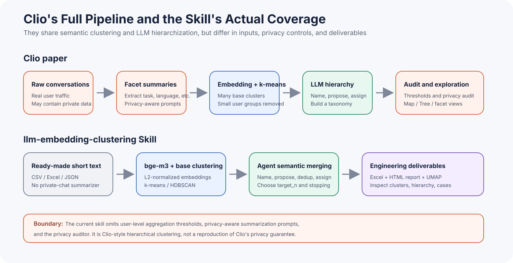
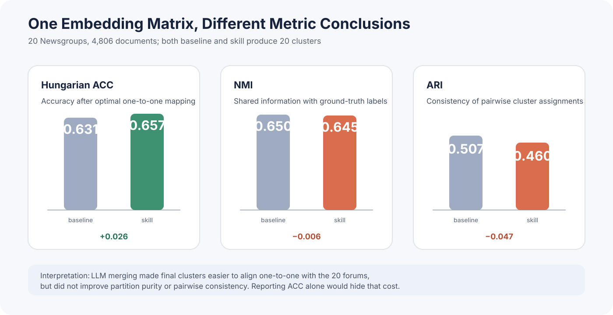

Short-text clustering is easy to leave half-finished. The embeddings are computed and k-means returns `cluster_0` and `cluster_1`, but the work that matters to an analyst has barely begun. What should $K$ be? What does each cluster mean? How should topics merge? When should the process stop, and how can a person inspect the result?

The obvious shortcut is to place every text in one LLM context and ask for groups, names, and a taxonomy. That can be the simplest solution for a few dozen items. At a few thousand, context length, cost, order sensitivity, and coverage become one combined failure mode. The model may classify early samples precisely and push later samples into broad parents. If it misses a long-tail topic, there is no explicit assignment table to inspect.

The division of labor I settled on is simple: embeddings provide scalable, cacheable local similarity; the LLM works only on a bounded number of cluster representations to name concepts, resolve boundaries, and merge parents. [*Clio: Privacy-Preserving Insights into Real-World AI Use*](https://arxiv.org/abs/2412.13678) presents a complete system built around that division. My scope is narrower: I turned its clustering subsystem into the [llm-embedding-clustering](https://github.com/BrenchCC/cilo-llm-embedding-clustering) Agent Skill and evaluated it on a labeled 20 Newsgroups sample.

The result is not a blanket claim that LLM hierarchy building beats k-means. On the same bge-m3 embedding matrix, Hungarian ACC rose from 0.631 to 0.657, while NMI fell from 0.650 to 0.645 and ARI fell from 0.507 to 0.460. The hierarchy made the final 20 clusters easier to align one-to-one with the 20 forums, but it lost some global partition information and pairwise consistency. Both directions matter.

One boundary matters even more: this work reconstructs **Clio's semantic clustering subsystem**, not the complete Clio platform. The skill has no user-level aggregation threshold, privacy-aware summarization prompt, or privacy auditor. Its report can expose original cases for inspection. “Clio-style hierarchical clustering” is an accurate description; inheriting the paper's privacy guarantee is not.



## 1. Clio Places This Division of Labor Inside a Privacy System

Access to real usage data does not make unconstrained analysis acceptable. Conversations can contain identity, health, employment, and business information; human review repeatedly exposes those details, and daily message volume exceeds manual synthesis capacity.

Clio is designed to extract aggregate patterns while preventing individual conversations and small-group information from reaching analysts. Its pipeline extracts facets, embeds summaries, forms many initial clusters with k-means, uses Claude to label and describe them, recursively builds a hierarchy, and exposes the results through Map and Tree views.


*Source: Figure 2 of the Clio paper. The original figure number and caption are retained in the crop.*

Two design choices are easy to lose in a short summary.

First, Clio does not cluster arbitrary raw text. It clusters facet summaries. The summarization question determines which information survives into the embedding space. Asking what task the user wants completed produces a task taxonomy; asking for conversation language produces another distribution. A conversation can have several facets, which lets analysts examine intersections among task, language, turn count, or time. The clustering goal is part of the representation, not decorative prompt text.

Second, the paper does not treat k-means as evidence that real usage consists of discrete natural kinds. The authors describe conversation types as a continuous manifold and use k-means as an efficient neighborhood finder. The base $k$ can reach thousands. Base clusters provide manageable fine-grained units; the LLM turns them into a readable taxonomy.

Appendix G.7 specifies more than “ask an LLM to group clusters.” At each level, Clio embeds cluster names and descriptions, places roughly 40 clusters in each neighborhood, and asks Claude to propose parent candidates using both internal clusters and nearby boundary clusters. It then deduplicates candidates globally, assigns every child to its best parent, and renames each parent from the children it actually received. A proposed name is not frozen before assignment; the contents correct it afterward.

## 2. Privacy Is Not an Automatic Property of Clustering

Figure 2 can make the privacy barriers look like annotations around the clustering stages. Figure 5 shows what they accomplish. On 5,000 Claude.ai conversations, the paper's automated auditor compares privacy scores for raw conversations, conversation summaries, and cluster summaries. Roughly 10% of raw data receives an unacceptable score of 1 or 2. At the analyst-visible cluster-summary stage, no item receives a score from 1 through 3, and 92.2% receive a 5.


*Source: Figure 5 of the Clio paper. The original figure number and caption are retained in the crop.*

That outcome depends on four interventions working together:

1. The conversation-summary prompt answers only the facet question and omits private information.
2. A cluster must exceed minimum counts for both unique accounts and conversations.
3. Cluster-summary generation is again instructed to omit private information.
4. A privacy auditor checks names and descriptions and removes clusters that may still identify a person or small organization.

These measures are part of Clio's system definition. They do not emerge automatically from embeddings, k-means, or LLM labeling. The current skill receives ready-made short text and has no account identity or unique-user counter. Its HTML report deliberately shows original cases for debugging, and UMAP hover data also contains source text. That design is useful for public data, sanitized data, or authorized internal analysis. It is missing the most important protections needed for private conversations.

Removing names after clustering cannot repair that gap. A rare description without an explicit name may still identify a small group through a combination of location, occupation, illness, and time. A large cluster may also consist of repeated submissions from one account rather than evidence from many people. Clio constrains both unique accounts and conversations precisely to separate “many records” from “many independent users.” Privacy evaluation must therefore inspect provenance and aggregation, not only run redaction rules over the final cluster title.

I therefore preserved the clustering idea without presenting an unimplemented privacy property as a default capability.

## 3. Turning the Method into an Executable Agent Skill

The paper describes the method, but not a ready-to-run workflow for arbitrary local files. I wanted a user to ask a coding agent to “cluster these queries into a topic hierarchy” and have the agent connect data loading, scripts, semantic decisions, and deliverables. The skill separates deterministic scripts from agent judgments and passes state through JSON files under `state/`.

The reconstruction experiment ran at commit `683cdf4`; when I wrote this note, remote `main` had advanced to `890b66a`. Both revisions use the same clustering algorithms and semantic-decision flow. The metrics, timings, and `196 → 60 → 20` hierarchy therefore still represent the current method; the later commit changes runtime constraints, not algorithmic performance.

### 3.1 Input Representation and Base Clustering

The skill reads one short-text column from CSV, Excel, or JSON and uses `BAAI/bge-m3` by default. Every vector is L2 normalized because the downstream kNN profile, cosine silhouette, and hierarchy neighborhoods depend on directional similarity. If an online API returns unnormalized embeddings, vector magnitude contaminates those distances.

In addition to saving embeddings, data preparation computes 10-NN distance statistics, a TwoNN intrinsic-dimension estimate, and the LOF outlier ratio. The agent selects a base algorithm from that profile and the user's clustering goal. k-means is the default for regular, moderately sized dense data; HDBSCAN is available when noise and uneven density matter. For k-means, the workflow tests 0.7, 1.0, and 1.3 times the heuristic $\sqrt{8N}$ and selects among them with cosine silhouette.

This search does not guarantee a globally optimal $K$. It prevents the agent from choosing a number without evidence and, more importantly, leaves enough base clusters for semantic merging. Setting the base count directly to the desired top-level count reduces the entire workflow to one k-means run followed by LLM labeling.

### 3.2 The Agent Owns Semantic Decisions That Cannot Be Hard-Coded

After base clustering, at most 50 examples from each cluster are supplied to the agent for a name and description. Each later level embeds those descriptions, forms neighborhoods of roughly 20 clusters, and adds 10 external nearest neighbors. The paper uses about 40 internal clusters per neighborhood; the skill halves that context to control coding-agent token use.

The agent performs five judgment-heavy operations:

- Infer `target_n` and `should_stop` from the current sample, desired top-level granularity, and user goal.
- Propose parent candidates for each neighborhood.
- Deduplicate candidates across neighborhoods while preserving coverage.
- Assign each child against a shuffled parent list to reduce position bias.
- Rename each parent from the children it actually received.

The skill requires at least two hierarchy levels and allows at most six. The lower bound prevents a first probe from ending the process before hierarchy building occurs; the upper bound prevents an unstable semantic loop. The user's clustering goal is mandatory because topic discovery, risk discovery, and recommendation labels produce different names and merge boundaries from the same text.

### 3.3 JSON State Is More Auditable Than One Long Prompt

The agent does not keep every cluster in conversational context. State is stored by stage: one record preserves the data profile and algorithm decision, another preserves base clusters, and each later level records neighborhoods, candidates, parents, assignments, and final clusters. Deterministic computation owns vector and data transformations; the agent writes back only the semantic decision for the current step.

This does not remove model randomness, but it creates checkpoints. If a parent name looks wrong, I can inspect its children and assignment at that level instead of reconstructing the entire dialogue. The same embedding matrix is cached, so prompt changes and hierarchy reruns do not repeat the most expensive computation.

The final stage writes `result.xlsx` and a six-section `report.html`. The workbook contains the hierarchy, the source-item-to-leaf mapping, and statistics. The report contains the data profile, algorithm rationale, per-level decisions, final tree, UMAP projection, and case browser. “Interpretability” here does not mean a causal explanation for every k-means assignment. It means that names, parent-child relations, sizes, and representative cases remain inspectable.

### 3.4 What Base Clustering Compresses—and What It Loses

The workflow scales because base clustering changes the size of the problem, not because the LLM reads faster. It compresses 4,806 documents into 196 local units. The agent sees samples, names, and descriptions from those units, and higher levels operate on 196 cluster representations rather than rereading every post. Every source text still has an explicit base assignment, so a long-tail topic or suspicious placement can be traced through the state chain.

Compression also discards freedom. A bad base assignment cannot be split later; the hierarchy can only recombine existing units. The LLM can reinterpret relations among clusters, but it cannot undo which samples were bound together at the bottom. That limitation later appears in the metrics: hierarchy building repairs several class-level correspondences without repairing NMI and ARI globally.

## 4. Invoking the Skill

Install it through the generic Agent Skills CLI:

```bash
npx skills add brenchcc/cilo-llm-embedding-clustering
```

After installation, there are no internal commands to memorize. I usually give the coding agent four facts: the file, text column, clustering goal, and embedding model.

> Use the `llm-embedding-clustering` skill to cluster the `text` column in `data.xlsx` into a topic hierarchy. The goal is to inspect content-topic distribution; use `BAAI/bge-m3` for embeddings.

If the request is only “cluster these queries by topic,” the agent still needs the data location and clustering objective. The objective matters: content distribution, risk discovery, and recommendation labeling produce different names and merge boundaries on the same support queries. The skill can handle the remaining execution details.

## 5. Running the Workflow on 20 Newsgroups

The local 20 Newsgroups files yielded 37,656 boundary-delimited records and 18,828 documents after deduplication, indicating that the source contained one complete duplicate copy. I then drew a stratified sample of 4,806 documents across all 20 forums with seed 42. Its SHA-256 is `014abaeb1606f18fec3caea58b010463a79f00a0251f2d06619aae34a4894cf2`.

Eleven documents contained 21 control characters prohibited by Excel. The bge-m3 token sequences were identical before and after cleanup, so the fix made the workbook writable without changing embedding inputs.


The goal was to identify the content topics discussed in forum posts. Baseline and skill reused exactly the same 1,024-dimensional bge-m3 embeddings so that a representation change could not be credited to hierarchy building:

| Setting | Baseline | Skill |
| --- | --- | --- |
| Base algorithm | k-means | k-means |
| Top-level clusters | 20 | 20 |
| Hierarchy | One level | 196 → 60 → 20 |
| Random setup | `random_state = 42`, `n_init = 10` | Fixed seed for base k-means; semantic steps retain this agent run |
| Input vectors | The same L2-normalized bge-m3 matrix | Same |

The base candidates were 137, 196, and 254, with cosine silhouette scores of 0.0423, 0.0449, and 0.0383. The script therefore selected 196. All three scores are low, consistent with the paper's description of a continuous semantic manifold. Silhouette chooses among three candidates here; it does not establish that the data contains 196 strongly separated natural clusters.

Embedding took 39 minutes 11 seconds, hierarchy building took 11 minutes 27 seconds, and the complete run took 50 minutes 38 seconds. Roughly 77% of wall time was embedding, which makes vector caching materially useful when iterating on hierarchy prompts.

## 6. Two Rounds of Merging: `196 → 60 → 20`

Those three numbers can look like a preset schedule. Only 196 came from the silhouette comparison. The agent selected 60 and then 20 from semantic coverage, requested granularity, and the stopping condition at each level. Per-level state matters because it turns “the model decided to merge them” into reviewable candidate counts, assignments, and stopping rationales.

Level 1 divided 196 base clusters into nine neighborhoods. The agent proposed roughly 60 subtopic families because computing, recreation, science, religion, politics, commerce, and health still contained useful internal distinctions. Collapsing directly to 20 would merge hardware with software and doctrine with religious practice too early. Sixty candidates remained after global deduplication, and `should_stop` was false.

At Level 2, the 60 intermediate clusters formed three neighborhoods. The agent proposed 24 candidates, deduplicated them to 20 parents, and returned `should_stop = true`. Its rationale was that another merge would combine domains such as computing, recreation, science, religion, and politics.


The final names include `PC Hardware`, `Windows and DOS`, `Computer Graphics`, `Motorcycles`, `Baseball`, `Medicine and Health`, `Space Science and Exploration`, `Christianity`, and `Middle East Politics`. They resemble the manual forums without reproducing them verbatim. `Guns and Law Enforcement`, for example, combines gun policy, crime enforcement, and Waco-related subclusters. `US and International Politics` includes both US social policy and war or human-rights material. Those groups are semantically defensible but do not necessarily match benchmark boundaries.


UMAP is useful for finding local mixtures and isolated regions, but it is not a clustering metric. The skill uses `n_neighbors = 15`, `min_dist = 0.1`, and cosine distance to project 1,024 dimensions into two. The paper's projector uses `min_dist = 0`. Projection parameters change the visible geometry, and an island in two dimensions is not proof of a reliable boundary in the original space.

## 7. The Result Does Not Improve Every Metric

At this point it is tempting to expect hierarchy building to win across the board. The result is less tidy: ACC rises while NMI and ARI fall. That disagreement is the most useful result of the reconstruction.



| Method | NMI | ARI | Hungarian ACC | Clusters |
| --- | ---: | ---: | ---: | ---: |
| k-means baseline | 0.650 | 0.507 | 0.631 | 20 |
| Hierarchical skill | 0.645 | 0.460 | 0.657 | 20 |
| skill − baseline | −0.006 | −0.047 | +0.026 | — |

Hungarian ACC first finds the optimal one-to-one mapping between predicted clusters and true classes, then measures hits. The skill explicitly tries to produce distinct, readable top-level topics, so it is plausible that its 20 parents align more easily with the 20 forums.

NMI measures how much information the predicted partition shares with the true labels without requiring a one-to-one naming scheme. ARI asks whether pairs of samples remain consistently grouped or separated. Their decline means that producing cleaner parent concepts caused some locally coherent embedding clusters to be recombined across true categories or split within a true category.

Per-class recall shows where the change occurred. `comp.os.ms-windows.misc` rose from 0.131 to 0.709, `talk.politics.guns` from 0.418 to 0.828, `alt.atheism` from 0.137 to 0.534, and `comp.sys.ibm.pc.hardware` from 0.271 to 0.602. Naming and merging helped those fragmented categories converge on stable parents.

The cost is equally concentrated. `rec.sport.hockey` fell from 0.929 to 0.643, `soc.religion.christian` from 0.902 to 0.624, `rec.motorcycles` from 0.748 to 0.504, and `misc.forsale` from 0.802 to 0.657. The baseline already separated hockey and Christianity well from lexical and local geometric evidence. Semantic hierarchy building reinterpreted some of those boundaries and damaged strong clusters.

`talk.religion.misc` has zero recall under both methods. It has only 160 examples and overlaps atheism, Christianity, and politics. One-to-one Hungarian matching may also allocate the corresponding predicted cluster to a larger, cleaner class. Zero recall does not mean every document lacks semantic neighbors; it means no unsupervised cluster was optimally assigned to that forum.

I would therefore not report the +0.026 ACC as an unqualified “improvement.” A more accurate conclusion is that LLM hierarchy building redistributes error: it repairs several weak one-to-one correspondences, damages several strong classes, gains ACC, and pays in NMI and ARI. A production system must decide whether it values a readable taxonomy, label alignment, or stable geometric partitioning.

The comparison also needs a fairness qualification. The baseline runs one $K=20$ k-means, while the skill begins with 196 base clusters and spends multiple rounds of agent inference. They share the representation and top-level count, but not the compute budget. The experiment isolates direct geometric partitioning from semantic merging after fine-grained geometric partitioning; it is not a same-cost algorithm race. If latency and LLM tokens are deployment constraints, whether +0.026 ACC justifies roughly 11 additional minutes of hierarchy work requires a separate utility analysis.

## 8. Why 0.657 Cannot Be Compared with the Paper's 94%

Figure 4 reports 94% reconstruction accuracy on 19,476 synthetic regular conversations across 20 high-level categories. That number is much higher, but it measures a different setup.


*Source: Figure 4 of the Clio paper. The original figure number and caption are retained in the crop.*

For the paper's quantitative reconstruction, Clio first creates base clusters without labels and then receives the **known set of 20 ground-truth top-level categories**. It performs the assignment step of the hierarchizer against those fixed parents. The test asks whether summarization, base clustering, and assignment recover the original category distribution.

My experiment never supplies the 20 Newsgroups labels to the agent. Parents such as `PC Hardware` and `Windows and DOS` are proposed, deduplicated, and renamed from base clusters. Only after the run does Hungarian matching align them with true labels. This is closer to the paper's unsupervised reconstruction section, where the authors provide confusion matrices and qualitative analysis rather than a directly comparable aggregate accuracy.

The datasets also differ. The paper's synthetic set is generated downward from predefined high-level classes to subcategories and conversations, so its hierarchy has a construction prior. Natural 20 Newsgroups posts contain quotations and often mix technical detail, political positions, and religious debate. Placing 94% beside 0.657 to declare either a failed reproduction or a weaker model would be methodologically wrong.

## 9. When the Skill Is Worth Using

The negative result makes the operating boundary clearer. Hierarchy building primarily optimizes for a taxonomy that people can browse, name, and audit. It may improve alignment with external labels, but it does not promise to preserve every geometric neighborhood. Whether the LLM stage is worth adding depends on which result the user actually needs.

I would use this skill when inputs are already short, the goal is exploratory topic discovery, geometric clusters need a readable multi-level taxonomy, the dataset can afford several rounds of LLM naming and assignment, and the data is public, sanitized, or handled in an environment authorized by its owner.

Several tasks should not use it directly. Long documents need an explicit facet-summary design before embedding. If the only requirement is stable vector partitioning, direct k-means or HDBSCAN is cheaper and easier to repeat. Strict label prediction calls for supervised training and held-out evaluation, not an unsupervised taxonomy presented as a classifier. Private conversations require user-level aggregation, privacy-aware summaries, output audits, access controls, and retention policy. Hiding the case browser alone is insufficient.

This experiment also contains only one fixed sample, one seed, and one set of agent decisions. A different hierarchy prompt, agent model, or candidate order can change the parents. My next evaluation would prioritize six checks:

The stopping decision deserves a separate audit. This run stopped at 20 parents, exactly matching the known benchmark cardinality. That makes evaluation convenient, but it may also anchor the agent on the requested target. On unknown real data, I cannot assume the natural taxonomy has a predetermined number of top-level topics. A stronger protocol would retain each round's candidate counts, merge rationales, and rejected parents, then ask a reviewer who cannot see the ground-truth labels whether to continue while also checking parent coherence. Otherwise, `196 → 60 → 20` may demonstrate obedience to a target more than a uniquely supported hierarchy.

1. Repeat sampling and k-means across seeds and report means, standard deviations, and class-level variation.
2. Repeat propose, dedup, assign, and rename with different agent models to measure taxonomy stability.
3. Add a controlled run with the 20 parents fixed, matching the paper's supervised reconstruction more closely.
4. Ablate the number of levels and the intermediate count in `196 → 60 → 20`.
5. Change the clustering goal and compare topic discovery, risk discovery, and recommendation labeling on the same embeddings.
6. Before private data, implement unique-user thresholds, privacy-aware summaries, and an independent auditor, then evaluate privacy explicitly.

## 10. Conclusion: Start with Roles, Then Read the Metrics

The useful engineering lesson is not merely that an LLM can participate in clustering. Embeddings and LLMs should own different parts of the problem. Embeddings provide scalable, cacheable local similarity. The LLM reads a bounded set of cluster descriptions, proposes readable parents, and resolves semantic boundaries that are difficult to encode as fixed rules. JSON state turns those roles into a workflow that can pause, be inspected, and rerun.

The 20 Newsgroups run provides a restrained result. The `196 → 60 → 20` hierarchy produces a readable taxonomy and raises Hungarian ACC by 2.6 percentage points, but lower NMI and ARI show that readable parents are not free. The LLM repairs some geometric boundaries and breaks others that were already clean.

The trade is worthwhile only when an analyst needs a navigable topic map. If the objective is maximum partition consistency, plausible names are not enough. Reliability requires inspectable state, stability across runs, and complete metrics. The privacy boundary is sharper still: before processing user data, the system needs user-level aggregation thresholds, privacy-aware summaries, and independent auditing. The current implementation cannot borrow Clio's privacy conclusion.

## References

1. Alex Tamkin et al. [Clio: Privacy-Preserving Insights into Real-World AI Use](https://arxiv.org/abs/2412.13678). 2024.
2. BrenchCC. [cilo-llm-embedding-clustering](https://github.com/BrenchCC/cilo-llm-embedding-clustering), experiment commit `683cdf4` and usage-documentation commit `890b66a`. 2026-08-13.
3. BAAI. [BAAI/bge-m3](https://huggingface.co/BAAI/bge-m3).
