If a chat box that writes SQL, an executor that runs a notebook, and a planner that revises an analytical workflow are all called a Data Agent, the label has little discriminating power. The product name looks the same to a user even though task scope, failure impact, and responsibility differ substantially. [Data Agents: Levels, State of the Art, and Open Problems](https://arxiv.org/abs/2602.04261) addresses precisely this vocabulary problem.

The paper borrows the form of driving-automation levels and classifies data agents from L0 to L5. The useful part is not the existence of six bins by itself. The taxonomy forces three questions to be asked together: who decides what happens next, who can directly change data or systems, and who remains responsible when the workflow fails. On those terms, most present research is still L1 or L2. A smaller group of systems exhibits portions of end-to-end orchestration, for which the paper deliberately uses Proto-L3. L4 and L5 are research visions rather than benchmarked product capabilities.

```{mermaid}
%%| fig-width: 10
flowchart TB
    L0["<b>L0 · No autonomy</b><br/>Agent: none<br/>Human: performs and owns every task"]
    L1["<b>L1 · Assistance</b><br/>Agent: stateless responder<br/>Human: executes and verifies"]
    L2["<b>L2 · Partial autonomy</b><br/>Agent: procedural executor<br/>Human: orchestrates the pipeline"]
    L3["<b>L3 · Conditional autonomy</b><br/>Agent: end-to-end orchestrator<br/>Human: supervises plans and outcomes"]
    L4["<b>L4 · High autonomy</b><br/>Agent: proactive, self-governing component<br/>Human: delegates without routine supervision"]
    L5["<b>L5 · Full autonomy</b><br/>Agent: generative data scientist<br/>Human: no longer required"]

    L0 -->|Respond to requests| L1
    L1 -->|Perceive and act on the environment| L2
    L2 -->|Own workflow orchestration| L3
    L3 -->|Discover tasks proactively| L4
    L4 -->|Invent methods and paradigms| L5

    classDef baseline fill:#f3f4f6,stroke:#6b7280,color:#111827,stroke-width:2px;
    classDef current fill:#e8f1ff,stroke:#2563eb,color:#172554,stroke-width:2px;
    classDef frontier fill:#fff3cd,stroke:#d97706,color:#451a03,stroke-width:3px;
    classDef vision fill:#f3e8ff,stroke:#9333ea,color:#3b0764,stroke-width:2px,stroke-dasharray:6 4;
    class L0 baseline;
    class L1,L2 current;
    class L3 frontier;
    class L4,L5 vision;
```

_Reading map: the levels transfer task dominance from human to agent through five boundaries: response, environment interaction, workflow orchestration, task discovery, and method invention. Blue marks established L1–L2 patterns, amber marks the Proto-L3 research frontier, and dashed purple marks the paper's L4–L5 visions. Definitions are condensed from [Section 2.2.1 of the paper](https://arxiv.org/html/2602.04261#S2.SS2.SSS1)._

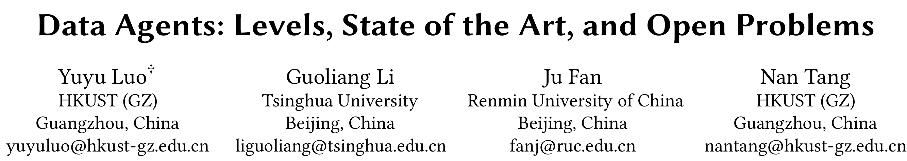

_Figure 1: Title and authors of the paper. Yuyu Luo, Guoliang Li, Ju Fan, and Nan Tang are affiliated with HKUST (GZ), Tsinghua University, and Renmin University of China. Source: [paper PDF, page 1](https://arxiv.org/pdf/2602.04261)._

::: {.callout-warning title="Evidence scope"}
This note reads the nine-page SIGMOD 2026 tutorial proposal released in February 2026. It specifies a tutorial program, taxonomy, representative systems, and research agenda. It does not introduce one unified algorithm or a new experiment spanning L0 through L5. Results discussed for Data Interpreter, AgenticData, and DeepAnalyze come from their respective papers, whose models, tasks, baselines, and cost accounting are not directly comparable. I did not reproduce these systems.
:::

## 1. Establish the paper type first: a teaching framework, not a unified empirical study

The document's form matters for interpreting its claims. It proposes a three-hour tutorial: a 140-minute lecture followed by a 40-minute playground. The lecture moves from problem definition to L0–L2, Proto-L3, and finally L4–L5 and open problems. The last part lets participants observe workflows at different levels. Much of the paper is written in the future tense—“we will”—because its main job is to organize material and establish shared terminology, not to report a newly completed experimental campaign.

Its relationship to the 2025 survey [A Survey of Data Agents: Emerging Paradigm or Overstated Hype?](https://arxiv.org/abs/2510.23587) also needs precise attribution. The tutorial abstract says that it proposes the first hierarchical taxonomy, while the introduction states that recent work has already proposed the L0–L5 hierarchy and that this tutorial builds on that survey to create a teaching-oriented framework for SIGMOD. The safest reading is therefore that the taxonomy is a central product of the authors' continuous research line: the 2025 survey develops it systematically, and the 2026 paper turns it into a tutorial. Reading only the tutorial abstract would over-attribute the entire classification to these nine pages.

That does not make the tutorial unimportant. Discussion of Data Agents has often been led by product naming. A system connects an LLM, registers several tools, draws a multi-agent diagram, and is then described as an “AI data scientist.” The tutorial moves the debate from names to observable boundaries: whether the environment is visible, who designed the workflow, whether work begins without an explicit request, and whether a human acts as executor or supervisor. Its output is an analytical coordinate system.

## 2. Formal definition: the object is a Data+AI environment, not a chat transcript

The paper defines a data agent as an abstract mapping:

$$
\mathcal{A} : (\mathcal{T}, \mathcal{D}, \mathcal{E}, \mathcal{M}) \rightarrow \mathcal{O},
$$

where $\mathcal{T}$ is a data-related task, $\mathcal{D}$ is raw data, $\mathcal{E}$ is an environment such as a DBMS, code interpreter, or API, $\mathcal{M}$ is the LLM, and $\mathcal{O}$ is the output. The output may be natural language, but it can also be a configuration, processed dataset, visualization, analytical report, or modification to a production system.

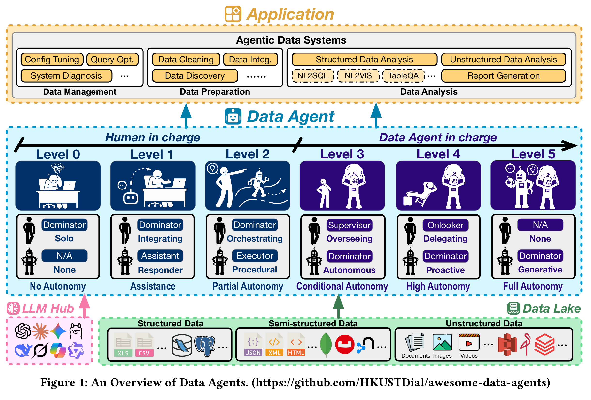

_Figure 2: Figure 1 from the paper. Applications are divided into data management, preparation, and analysis; L0–L5 describes the transfer of control from human to agent; the bottom connects an LLM hub to a heterogeneous data lake. Source: [paper PDF, page 1](https://arxiv.org/pdf/2602.04261)._

This definition is broad enough to include both an SQL assistant and an aspirational generative data scientist, but it is not an operational test. It does not explicitly represent history, policy constraints, permissions, human approvals, or recovery state; those are folded into $\mathcal{E}$ or the implementation of the agent. The equation tells us what belongs in the discussion, not which level a concrete system has reached. Level assignment still requires examination of control flow and responsibility.

The comparison between general LLM agents and data agents is more operational. General agents often consume a bounded, prepared input and produce an artifact for a human. A data agent operates across the data lifecycle. It must discover and manipulate objects in large, heterogeneous, changing, and noisy stores, using specialized tools such as database loaders, SQL-equivalence checkers, and visualization libraries. These are not disjoint model families. The difference comes from the task environment and consequences rather than a renamed model architecture.

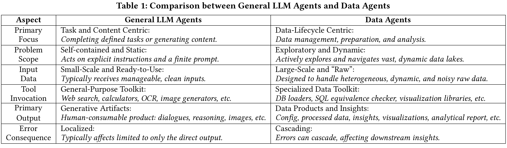

_Figure 3: Table 1 from the paper, comparing primary focus, problem scope, input data, tools, outputs, and error consequences. Source: [paper PDF, page 3](https://arxiv.org/pdf/2602.04261)._

The most consequential row is error consequence. A wrong chat response usually remains in that response. An error in a data workflow propagates. A mistaken join key can change the sample distribution; the corrupted sample can enter model training; the resulting metric can then be quoted in a report. The final prose may remain fluent after the evidence chain has broken. Data agents therefore cannot be evaluated only by asking whether the final answer appears correct. Intermediate data versions, plans, tool outputs, constraint checks, and mutations all belong to the system boundary.

My engineering shorthand is that a data agent must form an observable loop over data objects and data systems. Reading a small CSV fragment inside a prompt and answering a question is still compatible with a data assistant. The word “agent” gains operational content when the system can inspect environment state, act on data or workflows, and revise subsequent steps from feedback. Whether that reaches L3 depends on who organizes the loop.

## 3. L0–L5: the levels change task dominance

Inspired by SAE J3016, the paper binds each autonomy level to both human and agent roles. The following table restates the definitions without treating product language as evidence.

| Level | Agent role | Human role | Observable boundary |
| --- | --- | --- | --- |
| L0: No Autonomy | No agent involvement | Performs all work and carries all responsibility | Manual scripts, rules, and conventional tools without agent decisions |
| L1: Assistance | Stateless responder | Designs, executes, and verifies the workflow | Answers prompts, writes code, or suggests SQL and cleaning operations; does not perceive or manipulate the live environment |
| L2: Partial Autonomy | Procedural executor | Orchestrates the workflow and owns the result | Reads a DBMS, data lake, or code environment, invokes tools, and uses execution feedback; task steps remain human-prescribed |
| L3: Conditional Autonomy | Autonomous orchestrator | Supervises plans and outcomes | Interprets high-level intent, designs and revises a cross-stage workflow, and requests intervention at defined boundaries |
| L4: High Autonomy | Proactive component | Observes or delegates | Monitors Data+AI systems continuously and discovers problems or opportunities without an explicit request |
| L5: Full Autonomy | Generative data scientist | No routine involvement | Identifies limitations in existing methods, proposes alternatives, runs experiments, and iteratively develops new algorithms or paradigms |

The L1–L2 boundary is environment interaction. An L1 agent may write correct SQL but does not connect to the database, execute the query, and inspect the result. An L2 agent can do those things, maintain some state, and retry from execution errors inside a prescribed process. That is autonomous execution without workflow ownership. A human still decides which tables to inspect, when to perform a quality check, and whether a failed model warrants a different analytical approach.

The L2–L3 boundary is more difficult. L3 is conditional autonomy: a user supplies a high-level objective, and the agent constructs a tailored workflow spanning data management, preparation, and analysis, replanning as intermediate results change. The human moves from pipeline designer to supervisor. A function call, a ReAct loop, or automatic retries on a fixed DAG therefore cannot establish L3 on their own. They show execution ability, not ownership of what should be executed.

L4 adds task discovery. L3 still begins with an instruction such as “analyze customer churn.” L4 would continuously observe drift, performance degradation, schema changes, missing indexes, or analytical opportunities and decide when work should begin. L5 moves the boundary again, from composing existing operators to identifying why existing methods fail, developing hypotheses, and testing alternatives.

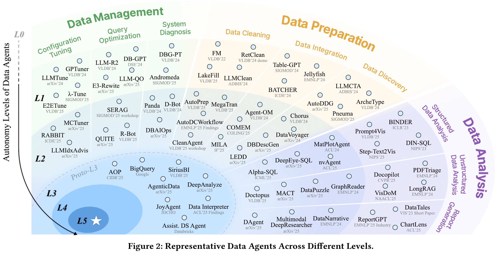

_Figure 4: Figure 2 from the paper. The horizontal axis spans data management, preparation, and analysis; the vertical axis represents autonomy. Current systems cluster around L1, L2, and Proto-L3. Source: [paper PDF, page 4](https://arxiv.org/pdf/2602.04261)._

This map is useful for seeing research concentration, not as a precise leaderboard. The vertical axis combines environment perception, orchestration scope, initiative, and responsibility. Different horizontal tasks also carry different risks: generating a visualization and modifying a database configuration should not be compared only by the number of automatically completed steps. The L4/L5 regions are better read as directional markers. The text explicitly says that fully realized L4 and L5 agents remain speculative.

## 4. From L2 to L3: orchestration, supervision, and responsibility must move together

The paper's L3 diagram contains a minimal control loop. A user provides a task and supervises. An L3 agent has perception, planning, memory, and tool-calling capabilities; it executes inside an environment composed of tools and a data lake, repeatedly optimizing the pipeline before returning an answer.

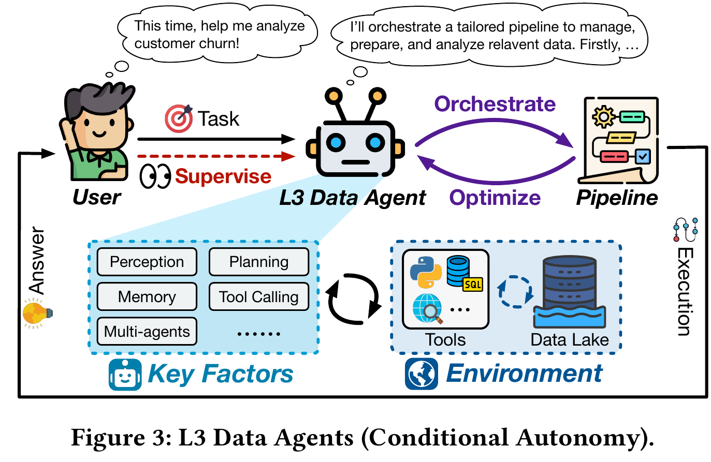

_Figure 5: Figure 3 from the paper. An L3 agent orchestrates and optimizes a pipeline from a high-level request, operating over tools and a data lake under supervision. Source: [paper PDF, page 5](https://arxiv.org/pdf/2602.04261)._

I would look for five kinds of evidence before claiming that a system crosses L2→L3.

First, is the input a high-level objective rather than a human-written procedure? Second, does the plan cross multiple stages such as discovery, preparation, modeling, and reporting? Third, can the system change the task graph after an intermediate failure instead of retrying the same code? Fourth, does validation cover semantic correctness and data quality rather than only exit status? Finally, has the human actually become a supervisor? If a person must choose every tool, confirm every field, and select each subsequent path, responsibility remains at L2 even if the architecture diagram contains an orchestrator.

### 4.1 Testing the levels on one customer-churn task

The same instruction—“analyze customer churn”—can describe several levels, and report length is not the difference. At L1, a person provides a prepared schema and sample fields. The system writes SQL, Python, or analytical suggestions; the person selects data, runs the code, and interprets the result. A ten-step plan in the answer does not create an environment loop.

At L2, the system can connect to a warehouse, inspect customer, subscription, and interaction tables, and invoke registered profiling, join, training, and plotting tools. It may repair SQL after a column error or apply a prescribed fallback when training fails. That removes substantial manual execution, but the data sources, step order, target variable, metrics, and stopping rules still come from a human-authored workflow. It resembles an automated machine that can read its instruments.

A Proto-L3 system instead receives the business objective and constraints: “explain the last quarter's change in churn among high-value customers; do not read restricted fields or write to production.” It first discovers available data and lineage, then determines whether cancellation events, support records, and usage logs can be joined lawfully. It schedules quality checks, temporal splitting, leakage detection, baseline comparisons, and report generation. If the high-value label was written only after churn, it should change the feature plan rather than continue training. If an essential table is inaccessible, it should expose the evidence gap, narrow the question, or request approval.

The difficulty of full L3 appears in that last segment. The system must not only produce a new plan but also remain responsible for its applicability and expose high-impact choices to a supervisor. L4 would monitor retention and schema changes without waiting for the analytical request and initiate the task. L5 would form and test a new hypothesis when available survival-analysis or causal methods are inadequate. The final report can look identical across these cases; the level is determined by task discovery, plan control, and accountability before the report exists.

These properties need not appear at equal strength, which is why the tutorial uses Proto-L3 instead of declaring full L3. Proto-L3 means that a system provides some evidence of orchestration while remaining dependent on a curated tool set, prepared data, human-authored rules, or a narrow task distribution.

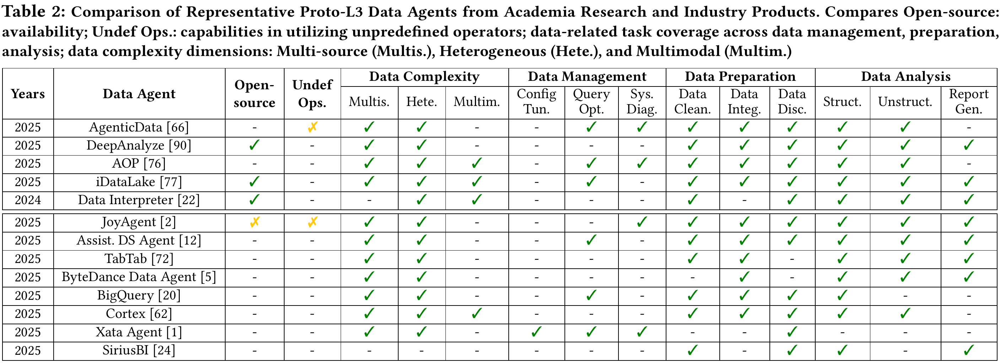

_Figure 6: Table 2 from the paper, comparing source availability, undefined operators, data complexity, and lifecycle task coverage. Academic systems occupy the upper block and products the lower block. Source: [paper PDF, page 6](https://arxiv.org/pdf/2602.04261)._

Table 2 provides breadth: whether a system handles multisource, heterogeneous, or multimodal data and whether it covers configuration, query optimization, cleaning, integration, discovery, structured analysis, or unstructured analysis. It does not directly measure responsibility transfer. A system may check ten task columns by routing requests through ten fixed experts. Another may cover fewer tasks but autonomously restructure its task graph. Coverage and autonomy are related, but they are not the same variable.

## 5. Three Proto-L3 cases: where the evidence actually lands

### 5.1 Data Interpreter: separating task graphs from action graphs

[Data Interpreter](https://arxiv.org/abs/2402.18679) models a data-science project through two graph levels. A task graph expresses high-level dependencies among exploration, correlation analysis, feature engineering, training, evaluation, and visualization. Each task is then decomposed into an executable action graph. A Task Graph Generator, Action Graph Generator, and Graph Executor handle planning, conversion to code-level actions, and execution.

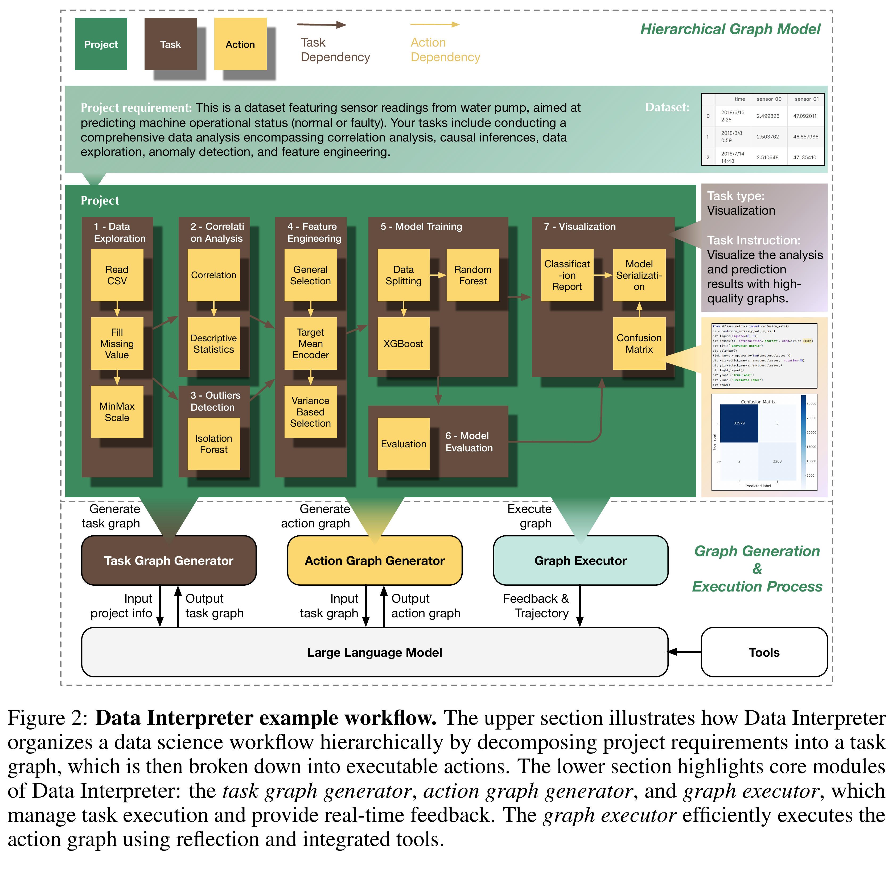

_Figure 7: Figure 2 from Data Interpreter. A project requirement becomes a task graph, then an action graph, which the Graph Executor runs with tools and feedback. Source: [Data Interpreter](https://arxiv.org/abs/2402.18679)._

This design supplies stronger orchestration evidence than one flat ReAct trace. The paper also describes graph refinement after failure. If code execution fails, the system first debugs for a preset number of attempts. If the task remains unsuccessful, it regenerates the task graph from episodic memory and current context, uses prefix matching to preserve successful nodes before the failure fork, and replaces the downstream portion. That is a change of plan rather than repetition of an action.

The boundary is equally visible. The workflow begins from an explicit project requirement and runs in an environment whose tools and executor have already been prepared. Failures are often exposed through runtime errors and local task state. If code runs successfully while a statistical assumption is wrong, the executor may not detect it. Data Interpreter therefore demonstrates hierarchical planning, state retention, and failure-driven replanning. It does not by itself establish cross-organizational permissions, business-policy reasoning, or transfer of final accountability.

### 5.2 AgenticData: placing semantic validation and cost optimization inside the planning loop

[AgenticData](https://arxiv.org/abs/2508.05002) targets queries over structured and unstructured data. Its architecture separates data profiling, query planning, memory, validation, semantic optimization, and semantic execution. The planning layer constructs a tree-shaped semantic plan. A validator checks grammar, semantic errors, and missing data. Memory stores error, transition, and cross-task feedback. The optimizer estimates cost, rewrites queries, and selects plans. A customized MCP server connects database, file, and web servers underneath.

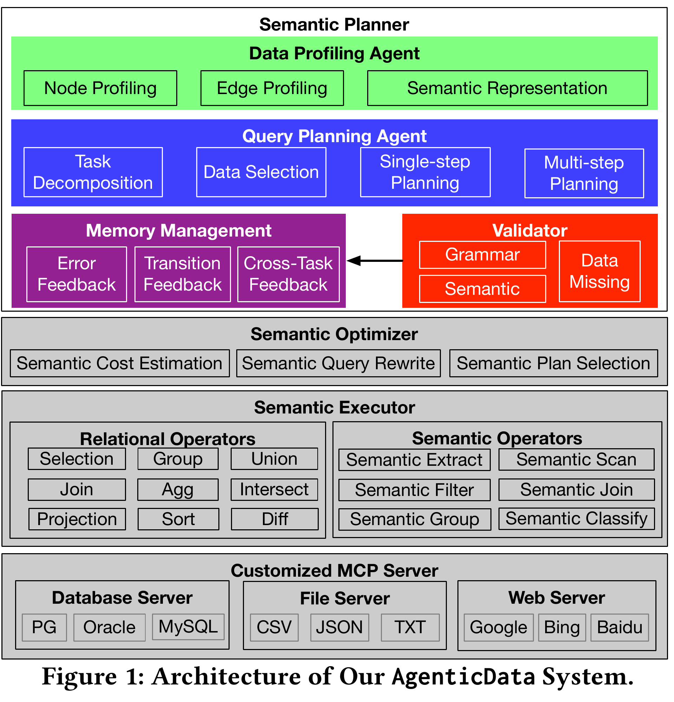

_Figure 8: Figure 1 from AgenticData. A semantic planner is separated from optimizer, executor, and MCP server, while validator feedback is written into memory. Source: [AgenticData](https://arxiv.org/abs/2508.05002)._

The increment is not merely the number of agents. Data profiles and semantic validation give the system a chance to identify missing fields or logical mistakes before execution. Cost optimization and task planning also share a feedback path. This is closer to the verification required by data systems than checking whether Python raised an exception.

Figure 8 of the AgenticData paper reports six panels: DABStep-easy, DABStep-hard, DABench, Spider-2.0-Lite, Real-Bank, and Wikipedia. Strictly speaking, these represent five benchmark families because DABStep is split into easy and hard settings. AgenticData achieves high accuracy under the authors' selected baselines and model configurations, but the same figure also shows substantial dependence on the backbone.

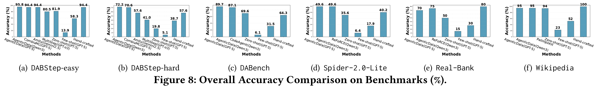

_Figure 9: Figure 8 from AgenticData, reporting overall accuracy across six settings. These are results from that paper, not direct proof of an autonomy level, and they should not be merged numerically with results from other papers. Source: [AgenticData](https://arxiv.org/abs/2508.05002)._

Accuracy supports the narrower claim that the architecture is effective on these tasks. It cannot, by itself, show that the system is closer to L3. Evaluating autonomy also requires evidence about who supplied the plan, how often people intervene, whether the system routes safely around an unseen schema or permission denial, and whether it knows when to stop. Table 2 likewise treats AgenticData's use of undefined operators as limited: it offers a rich set of relational and semantic operators and can use generated code for non-predefined operations, but the designer still shapes the tool space.

### 5.3 DeepAnalyze: writing orchestration behavior into training

[DeepAnalyze](https://arxiv.org/abs/2510.16872) differs primarily on the training side. It defines five action-token families—Analyze, Understand, Code, Execute, and Answer—so the model can switch among reasoning, structured-data inspection, code generation, execution, and response production. Training first strengthens individual abilities such as reasoning, structured-data understanding, and code generation, then uses multi-ability agentic training to combine data preparation, analysis, modeling, visualization, insight generation, and reporting.

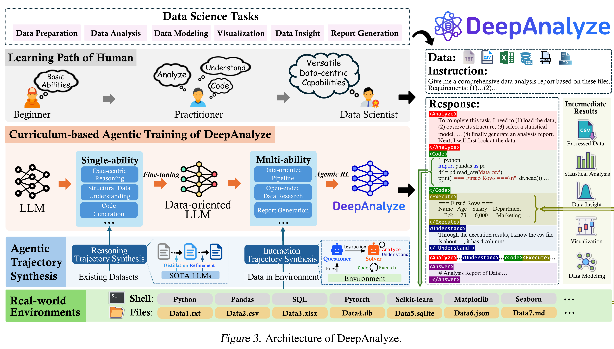

_Figure 10: Figure 3 from DeepAnalyze. The left maps a human learning path to single-ability fine-tuning and multi-ability agentic training; the bottom synthesizes trajectories from real file environments; the right shows actions and execution results interleaved in one response. Source: [DeepAnalyze](https://arxiv.org/abs/2510.16872)._

The paper states that inference does not rely on a human-defined workflow or rule and that the model generates the actions itself. This is closer to policy internalization than a fixed external DAG. The model learns not only to list planner steps in a prompt but also when to inspect data, execute code, and resume analysis. Data-grounded trajectory synthesis creates reasoning and interaction traces from existing datasets and environments. The multi-ability stage uses agentic reinforcement learning, and open-ended research tasks include LLM-as-a-judge reward components.

Action autonomy still differs from task autonomy. Researchers define the action grammar, training tasks, environment interfaces, and rewards. A user continues to supply an explicit task and files. The model's ability to orchestrate one data-science job does not mean that it proactively discovers an organizational data problem, much less invents a new statistical method. LLM-judged open-ended reports also impose an evidence ceiling: prose completeness and methodological validity are not always recognized reliably by the same judge. DeepAnalyze's primary Proto-L3 evidence is cross-step orchestration learned in training, not L4 task discovery.

### 5.4 Putting the three systems together

The three projects substantiate different pieces of Proto-L3:

| System | Strongest evidence | Still insufficiently covered |
| --- | --- | --- |
| Data Interpreter | Hierarchical task/action graphs and task-graph revision after failure | Semantic failure, permission governance, and cross-lifecycle responsibility |
| AgenticData | A feedback loop spanning data profiles, semantic validation, memory, and plan optimization | Generality of undefined tools, dynamic environments, and responsibility transfer |
| DeepAnalyze | Multi-action orchestration internalized through curriculum training and agentic RL | Proactive task discovery, reliable validation of open-ended outputs, and production governance |

No single module creates L3. A planner without a verifier may execute the wrong workflow to completion. A verifier without a mutable plan can only reject repeatedly. Memory without provenance and versioning can carry obsolete experience into a new environment. Training can internalize behavior while making rule updates and audits less visible. The “proto” in Proto-L3 is not politeness; it accurately preserves these missing capabilities.

## 6. Real systems must also manage identity, network, and service boundaries

Academic systems in the tutorial emphasize task capabilities. A deployed environment adds network topology, identity, region, secrets, data residency, and service responsibility. Google Cloud's cross-cloud open-lakehouse reference architecture makes these constraints visible. Parquet in AWS S3, metadata in Databricks Unity Catalog, and lakehouse tables and an operational database in a Google Cloud region are connected through controlled network and catalog-federation paths. Secret Manager, service identity, and credential verification sit next to the data path rather than inside an agent prompt.

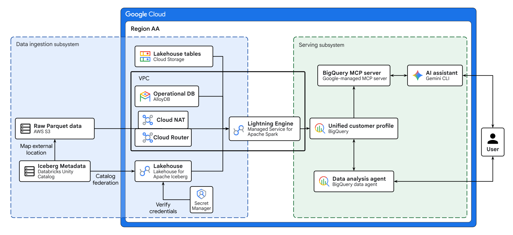

_Figure 11: Official Google Cloud cross-cloud open data lakehouse architecture. Data ingestion, VPC, credential verification, lakehouse services, and agent-serving boundaries are explicit. Source: [Google Cloud Architecture Center](https://docs.cloud.google.com/architecture/agentic-ai-build-multicloud-open-data-lakehouse)._

The diagram does not prove that a cloud product has reached L3. It establishes a different point: as an agent approaches production, it cannot become a superuser that bypasses platform governance. It should read through constrained interfaces, use short-lived credentials, and act only within VPC, IAM, and audit policy. High autonomy in a data system does not mean broader permissions. It means completing more decisions within a well-defined operating envelope and stopping reliably, with an explanation, outside it.

## 7. The taxonomy works better as capability and responsibility labels

My view is that L0–L5 should not be collapsed into one maturity score. The line orders at least four qualitatively different leaps: L1→L2 adds environment perception; L2→L3 transfers workflow orchestration; L3→L4 adds proactive task discovery; L4→L5 requires generative methodological innovation. Each transition expands both capability and the radius of failure.

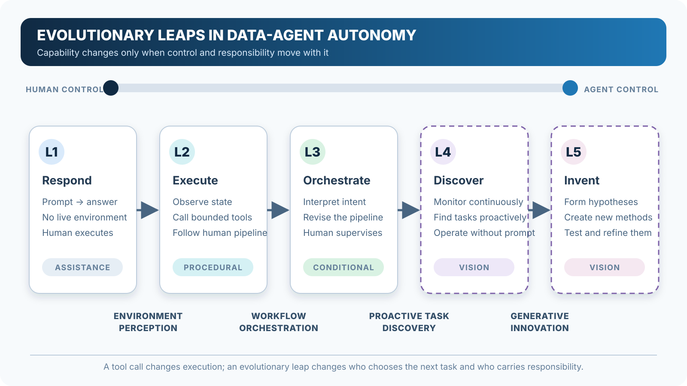

_Figure 12: Original synthesis for this note. Tool calls change execution. An autonomy transition occurs only when authority over the next decision moves together with responsibility. L4 and L5 are outlined as visions._

A linear score hides two facts. First, one product can behave like Proto-L3 for exploratory analysis but remain L1 for database configuration because the latter is riskier. Second, more capability does not automatically mean a better deployment. For payroll, medical, or financial data, a clearly approved L2 workflow may be more appropriate than an unauditable L3. Autonomy should be selected jointly with task and risk, not treated as a product version that must always increase.

Crossing lifecycle with level clarifies the boundary. An L1 preparation assistant proposes cleaning rules. L2 executes known operators and adjusts from quality checks. Proto-L3 discovers data, chooses operators, composes a pipeline, and revises the workflow after failure. The same phrase—“automatic cleaning”—can refer to three different control structures.

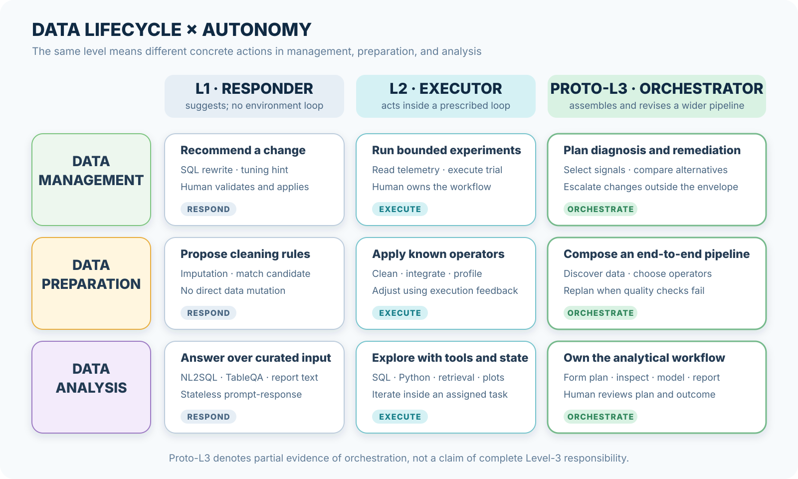

_Figure 13: Original synthesis for this note. The matrix compares L1, L2, and Proto-L3 across management, preparation, and analysis. The last column denotes partial orchestration evidence, not complete L3 responsibility._

System descriptions should therefore report level, scope, and operating envelope together. A useful statement might read: “Proto-L3 for exploratory analysis in one read-only warehouse; writes require human approval; cross-region data is inaccessible.” It is longer than “L3 Data Agent,” but it tells a user what the system can do and where it must stop.

## 8. Governance is part of the control loop

Data-agent errors cascade, so governance must enter execution. Provenance begins during discovery. Policy checks occur before sensitive reads or writes. High-impact actions require approval. Audit records need plans, parameters, data snapshots, and tool outputs. Recovery requires a path back to a known state. Appending these records after the report has been generated is too late.

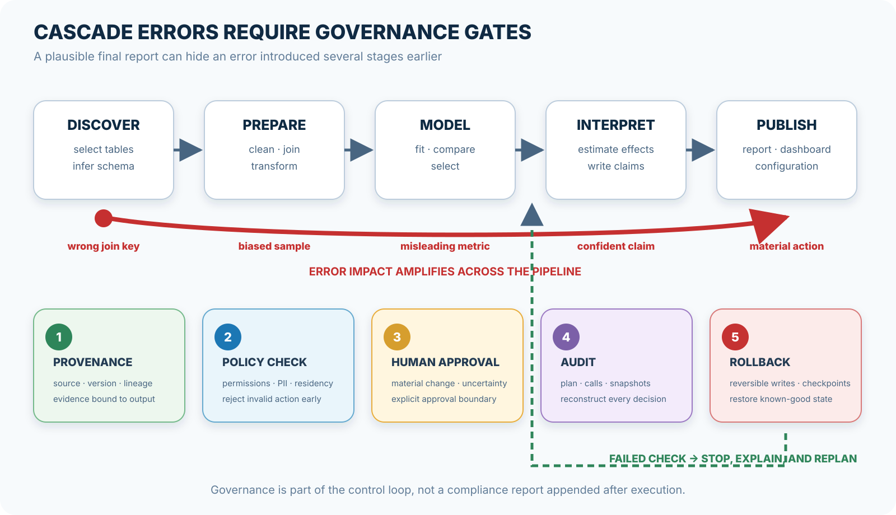

_Figure 14: Original synthesis for this note. A wrong join key can amplify through preparation, modeling, interpretation, and publication. Provenance, policy checks, human approval, audit, and rollback need to function as blocking and replanning gates._

Responsibility transfer needs an operational definition. If a system can write back to a database, its documentation should specify which tables and columns are writable, the maximum size of a mutation, which failed checks force a stop, who can approve an exception, how the decision can be reconstructed, and how the write can be reversed. Without these fields, “human in the loop” is only a promise. A reviewer may receive seconds to approve a plan too large to inspect or may be notified only after the error has propagated.

A stronger supervisor interface presents differences rather than summaries: how the new plan differs from the baseline, which data versions it read, which assumptions remain unverified, and the expected cost and impact range. Human supervision then becomes a control mechanism rather than a signature on the last page.

## 9. High-autonomy evaluation needs six dimensions of evidence

Most current benchmarks emphasize final accuracy, completion rate, or report quality. Those metrics are useful for L1 and L2, but the evaluated boundary must expand when the agent gains workflow control. At minimum, evaluation should report six dimensions separately:

$$
\mathbf{E}
=
(Q, A, R, D, G, C),
$$

where $Q$ covers correctness and data quality, $A$ measures realized autonomy, $R$ measures robustness to tool errors, missing data, and schema drift, $D$ measures adaptation and replanning from feedback, $G$ covers permission, provenance, audit, approval, and rollback, and $C$ accounts for tokens, latency, data scans, tool calls, and human review.

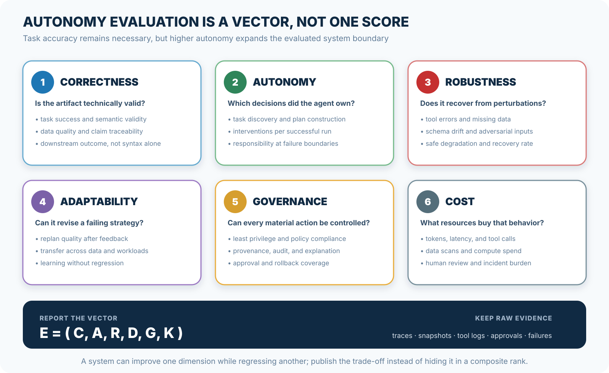

_Figure 15: Original synthesis for this note. Correctness, autonomy, robustness, adaptability, governance, and cost should retain their underlying evidence. One aggregate score cannot reveal which dimension regressed._

Autonomy should not be counted by the number of steps the agent generated. More auditable measures include the share of high-level decisions first proposed by the agent, human interventions per successful task, the fraction of failures that produce a changed strategy rather than a repeated action, and the rate at which unauthorized requests are correctly refused. Each can still be gamed, so traces and outcomes must accompany the number. Fewer interventions are easy to achieve by asking fewer questions while silently increasing error and incident cost.

Robustness should go beyond randomly deleting rows. Real perturbations include renamed fields, changed table relationships, revoked permissions, tool upgrades, late data, distribution shift, and services failing halfway through a run. An evaluation should test whether the system recognizes an unrecoverable state, selects a degraded path, and preserves earlier valid artifacts. Retrying until the token budget is exhausted is not robustness.

Governance cannot be represented by a boolean saying that logs exist. Whether a log records the input data version, execution plan, tool arguments, validation results, human approvals, and write diffs determines whether an incident can be reconstructed. Cost must also include human time. A system that saves tokens by turning every step into manual review is not unconditionally more efficient.

## 10. Open problems: the main gaps are control and validation

The paper's research agenda forms several dependent technical chains.

**Perception over large data estates.** A data agent cannot place an entire lakehouse in context. It needs catalogs, profiles, samples, indexes, lineage, and learned representations to form queryable perception: decide which structures to inspect first, then drill down. If perception misses the relevant table or misreads a field, stronger downstream planning cannot recover the absent evidence.

**Undefined operators and tool evolution.** Current systems are effective at composing registered SQL, Python, retrieval, and visualization tools. When no suitable operator exists, an agent must generate code, test side effects, decide whether it should become a reusable tool, and manage versions and dependencies. Writing the function is not the hardest part. The hard part is establishing that the operator can safely enter this pipeline under current data, permission, and cost constraints.

**Causal and meta reasoning.** Successful execution does not establish valid analysis. An agent has to distinguish correlation from causation, identify leakage and selection bias, and reject an inappropriate metric. It also needs to diagnose why it failed: insufficient data, a broken tool, a false hypothesis, or a flawed plan structure. Without diagnosis, “replanning” is undirected variation.

**Dynamic adaptation and long-horizon trade-offs.** The L4 vision requires monitoring workload, quality, latency, and cost over time. A local optimization can increase future maintenance. A materialized view that helps today may become a liability after a workload shift. The agent must reason about cumulative cost, data quality, performance, and governance under multiple objectives rather than greedily optimize one request.

**Training data and realistic evaluation.** Human-authored success traces and fixed sandboxes do not cover production incidents. Configuration histories, query logs, quality alerts, and incident reports can provide training evidence, but they contain sensitive data, selection bias, and organization-specific policy. De-identification, attribution, counterfactual construction, and preventing historical bad practice from becoming policy are part of the learning problem.

**Safety and accountability.** Higher levels cannot rely on a sentence in the prompt saying “be safe.” Permissions, policies, approvals, audits, and rollback must be enforced externally, with the agent restricted to the interfaces it has been granted. Evaluation must reward correct refusal and timely requests for supervision; otherwise, benchmarks favor reckless completion.

These requirements explain why L4 and L5 remain visions. Proactive task discovery requires persistent monitoring and an understanding of organizational objectives. Generating new methods additionally requires reliable experimental design, causal judgment, comparison, and self-correction. Calling an automatically produced EDA report an “AI data scientist” only hides the unresolved control problems inside a name.

## 11. Conclusion

The tutorial's most useful contribution is the order in which it asks questions. When inspecting a Data Agent, do not begin with the number of models, tools, or agents in the diagram, and do not begin with whether a demo produces a complete report. Begin by asking whether the environment is genuinely visible, who designed the workflow, whether failure can change the plan, which actions require approval, and whether errors can be traced and reversed.

On those terms, the current state is reasonably clear. L1 is widespread. L2 has stable patterns around SQL, cleaning, retrieval, code execution, and visualization. Data Interpreter, AgenticData, and DeepAnalyze show how hierarchical planning, semantic validation, memory, and training-based internalization are beginning to meet, which constitutes Proto-L3 evidence. Full L3 still lacks unified validation across the lifecycle, dynamic environments, governance, and responsibility. L4 and L5 should continue to be treated as hypotheses under test.

I would use L0–L5 as capability and responsibility labels, not as a marketing upgrade path. A constrained, auditable L2 that stops at its boundary is often more trustworthy than a purported L4 that cannot explain where its data came from. The next step for data agents is not to add more automatic arrows to pipeline diagrams. It is to support every transfer of control with corresponding evidence of validation, permission, and accountability.

## References

- Yuyu Luo, Guoliang Li, Ju Fan, Nan Tang. [Data Agents: Levels, State of the Art, and Open Problems](https://arxiv.org/abs/2602.04261), 2026.
- Yuyu Luo et al. [A Survey of Data Agents: Emerging Paradigm or Overstated Hype?](https://arxiv.org/abs/2510.23587), 2025.
- Sirui Hong et al. [Data Interpreter: An LLM Agent For Data Science](https://arxiv.org/abs/2402.18679), Findings of ACL 2025.
- Ji Sun et al. [AgenticData: An Agentic Data Analytics System for Heterogeneous Data](https://arxiv.org/abs/2508.05002), 2025.
- Shaolei Zhang et al. [DeepAnalyze: Agentic Large Language Models for Autonomous Data Science](https://arxiv.org/abs/2510.16872), 2025.
- Google Cloud Architecture Center. [Build a cross-cloud open data lakehouse with agentic AI](https://docs.cloud.google.com/architecture/agentic-ai-build-multicloud-open-data-lakehouse).
- HKUSTDial. [Awesome Data Agents](https://github.com/HKUSTDial/awesome-data-agents).
