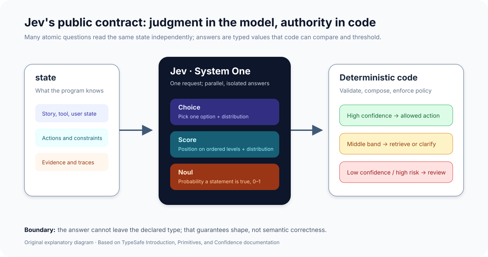
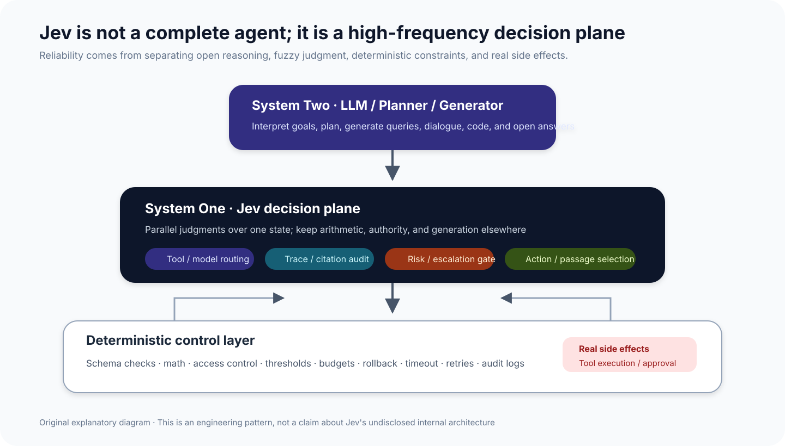
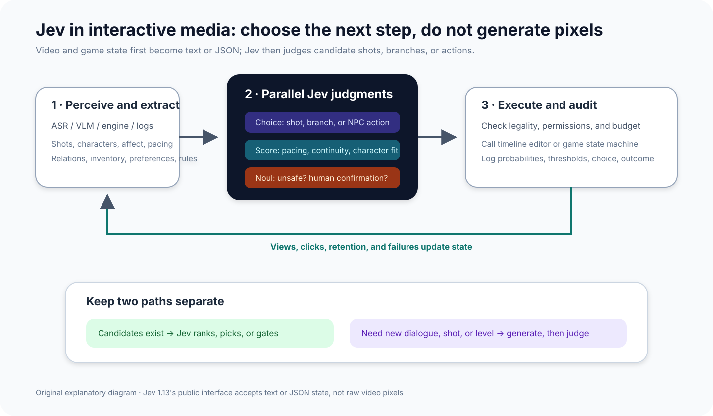
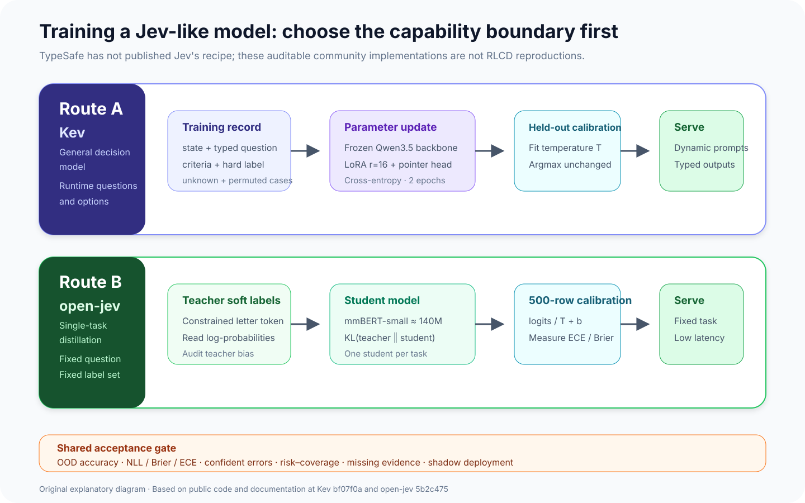
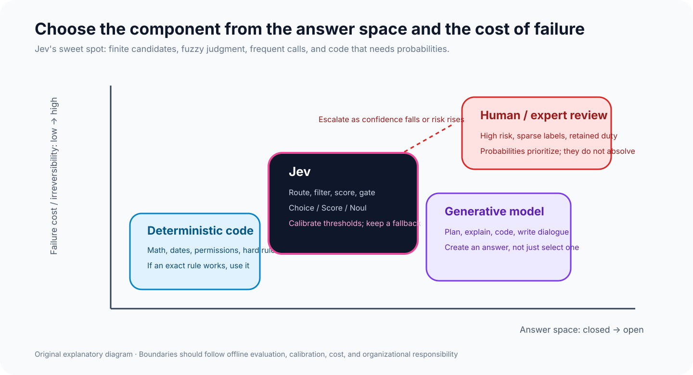

Jev can be compressed into one sentence: **give it program state and questions whose answer spaces are known in advance, and it returns probabilistic typed values rather than prose.**

That may sound like a stricter version of structured output. The meaningful change is at the software boundary. A caller no longer asks a model to write JSON and then parses, validates, or repairs it. It receives a Choice, Score, or Noul that ordinary code can compare, threshold, rank, and route to a person. TypeSafe therefore presents Jev as the first public System One model: a model for fast, bounded judgment rather than slow, open-ended reasoning and generation.

This framing explains why Jev attracted agent developers immediately after launch. An agent makes many small decisions on every run: which tool to call, which retrieved passage deserves context, whether a tool trace looks abnormal, and whether to act, clarify, or escalate. A general reasoning model is capable of these judgments, but its latency and cost are difficult to sustain inside a high-frequency loop. Jev returns much less, deliberately, and that narrow output matches this layer of “intelligent if statements.”

::: {.callout-warning title="Evidence boundary"}
TypeSafe released Jev on September 15, 2026, and the current public documentation covers `jev-1.13`. The company says that it built a new architecture, parallel sampler, and training method called Reinforcement Learning for Calibrated Decisions (RLCD). It has not published weights, parameter count, network design, training data, or an algorithmic specification of RLCD. This note can explain the public contract, system decomposition, and disclosed evaluations; it cannot infer the internal implementation from a hosted API. I did not call the paid API. Every performance figure below is attributed to either a vendor evaluation or an independent study.
:::

## 1. Jev changes the task, not merely the JSON shape

A general LLM predicts the next token. Even under JSON Schema or function calling, it still generates a string sequence while a service constrains the acceptable shape. Jev's public interface does not offer text generation. Its inputs are `state` and `questions`; its outputs are typed values and probability distributions associated with those questions. The [official introduction](https://docs.typesafe.ai/introduction) summarizes the contract as unstructured state in and typed probabilistic decisions out.

The `state` is context the program already has. It can be text or JSON containing a user request, account state, tool trace, candidate actions, and policy constraints. A question should be atomic enough that a knowledgeable person could make the judgment quickly from the supplied evidence. Composite goals are split into independent questions, while weights, dependencies, thresholds, and side effects remain in code.

{width="94%" fig-align="center"}

_Figure 1: Original explanatory diagram. Jev answers typed questions in parallel over one state; deterministic code composes probabilities, applies policy, and chooses automation or review. This diagram describes the public contract, not Jev's internal neural architecture._

### 1.1 Three primitives

The [Primitives documentation](https://docs.typesafe.ai/primitives) defines three question types:

| Primitive | Question shape | Main return values | Typical use |
| --- | --- | --- | --- |
| Choice | Which known option fits best? | `choice`, per-option `probabilities`, `confidence` | Tool, route, or candidate-action selection |
| Score | Where does the state fall on ordered levels? | Continuous `score`, `legend`, distribution, `confidence` | Severity, quality, pacing, or fit |
| Noul | Is a proposition true? | Probability `noul` that it is true | Risk gates, escalation, relevance |

A Choice distribution is relative: which candidate is best among those supplied. A Noul is absolute: how likely is a proposition to hold. The two forms are not interchangeable. The official [Jev 1.13 jaggedness guide](https://docs.typesafe.ai/model-jaggedness/jev-1.13) shows that semantically similar Noul and yes/no Choice questions need not return corresponding numbers. Asking a proposition and its negation as separate Nouls does not guarantee probabilities that sum to one. A threshold tuned for one primitive therefore cannot be copied blindly to another.

For Choice and Score, `confidence` summarizes how concentrated the full probability distribution is; it is not a synonym for the probability of correctness. Noul has no separate confidence because its output is already a one-dimensional probability. A basic routing policy can be written as:

$$
a^* = \arg\max_{a \in \mathcal{A}} p(a \mid s, q),
$$

$$
\mathrm{route}(c) =
\begin{cases}
\text{execute}, & c \ge \tau_{\mathrm{high}}, \\
\text{retrieve or clarify}, & \tau_{\mathrm{low}} \le c \lt \tau_{\mathrm{high}}, \\
\text{human review}, & c \lt \tau_{\mathrm{low}}.
\end{cases}
$$

Those thresholds are not model-supplied business constants. They must follow error cost, offline labels, calibration, and available review capacity. High-impact actions also require separate authorization and approval rules.

### 1.2 Why several questions can run together

Questions in one request share a state, but the public contract evaluates them independently. One answer does not become hidden context for another. A compound evaluation can therefore become several atomic judgments that code combines. When an agent finishes a tool run, one request might ask whether it departed from the goal, whether citations support the conclusion, whether sensitive data appeared, and whether a person should inspect the run. The model does not need to write a holistic review.

A second request is still necessary when a later judgment genuinely depends on an earlier answer. A first call might shortlist several skills from 182 candidates; only after code fetches the full text of those skills can the next call evaluate their actual fit. The sequence follows information availability instead of hiding control flow inside a prompt.

{width="98%" fig-align="center"}

_Figure 2: TypeSafe's published security-incident workflow. The model reads an alert, evidence strength, and environment state; code combines Bool, Score, and Choice results into close, queue, contain, or urgent-escalation actions. Source: [Introducing System One Models & Jev](https://typesafe.ai/blog/introducing-system-one-models-and-jev). This is a vendor example, not a reproduction in this note._

## 2. How it differs from structured output, small models, and classifiers

Jev is not a replacement for every classifier, and the absence of prose does not create correctness by itself. Four useful comparison points are:

| Approach | Answer space | Inference and interface | Good fit | Main boundary |
| --- | --- | --- | --- | --- |
| General LLM + JSON Schema | A schema is declared per call; content may remain open | Autoregressive generation with service- or client-side validation | Tasks mixing explanation, extraction, and generation | Output tokens, latency, refusal, and semantic drift remain |
| Small or distilled LLM | Constrained by prompt and schema | Still text generation; can be self-hosted | Domain adaptation with tolerable generation overhead | Probabilities may not compare cleanly; evaluate form and meaning |
| Conventional classifier | Labels fixed during training | One forward pass yields logits or probabilities | Stable task with enough labeled data | A new question commonly requires new data and training |
| Jev | Choice, Score, and Noul declared at call time | Hosted typed-probability interface; no prose | Frequent routing, scoring, filtering, and gating | Closed model; bounded judgments only; calibration still needs audit |

The consequential product choice is giving up strings. Jev can guarantee that an answer stays within the declared structure, avoiding failures such as invented tool names, missing fields, or invalid enum values. Yet zero schema violations is not zero semantic error. If state lacks evidence, a question is wrong, or the options omit the right answer, the model can still select the wrong value with high confidence. TypeSafe's “zero hallucinations” language is best read as **no value outside the schema**, not immunity from factual or judgment errors.

{width="96%" fig-align="center"}

_Figure 3: Structured-output and tool-call error rates from TypeSafe's launch page. The company explicitly says Jev's 0% is a schema-matching guarantee rather than an empirical estimate; the LLM figures come from OpenRouter and may contain routing bias. Source: [Hallucination and Type-safety in the launch post](https://typesafe.ai/blog/introducing-system-one-models-and-jev)._

## 3. Why it became popular: agent call density

TypeSafe lists a price of $0.042 per million input tokens with output free and claims 70–500 ms end-to-end latency. Across its average of four workflows, the home page further advertises 193.6× lower latency and 444.6× lower cost. The launch post also says these numbers are likely at the high end of real-world gains. The workflows were prepared by the company's model-capabilities team, reference probabilities average GPT-6 Astra and Claude Fable 5.1, and comparison LLMs use a wrapper that makes them emulate the System One API. The results demonstrate the promise of the design, not a universal multiplier over arbitrary classification tasks.

{width="88%" fig-align="center"}

_Figure 4: TypeSafe's average accuracy-versus-cost plot over four workflows. Diamonds are structured workflows; circles put the policy into a single prompt. Jev occupies the vendor evaluation's low-cost edge. TypeSafe controls the model versions, label construction, and harness, so this note does not treat the plot as an independent benchmark. Sources: [launch post](https://typesafe.ai/blog/introducing-system-one-models-and-jev) and [workflow evals](https://evals.typesafe.ai/)._

The interesting point is not merely another cheaper model. An agent may call an open planner a few times while making tens or thousands of repetitive judgments: rerank each passage, inspect every tool call, score each candidate action, or choose a move on every interaction step. A generative model's output capacity is often wasted there, while handwritten rules cannot cover natural language and fuzzy semantics. Jev sits between those two options.

The pitch holds only under two conditions. First, the task must actually admit a closed question. If an answer must be invented, another system has to generate candidates first. Second, the probabilities must be usable on the deployment distribution. Producing a hundred million uncalibrated scores cheaply does not create controlled automation.

## 4. The independent warning: audit the probabilities

The preprint [Calibrated Decisions at Scale](https://arxiv.org/abs/2609.24052), released six days after Jev's launch, applies Jev 1.13 to coding Texas crash narratives. The study begins from roughly 5.02 million usable narratives, screens 499,500 in stage one, and runs the full 27-question schema over 195,857 records. Its calibration and accuracy audit uses 2,416 blinded human judgments. The authors report pooled F1 of 0.908 against those human labels.

This is not a general Jev leaderboard. Its schema, sampling design, and labels are specific to crash narratives. It does, however, show something more useful than a launch demo: returned probabilities are not automatically calibrated. Pooled expected calibration error fell from 0.0231 to 0.0069 after Platt scaling, a reduction of roughly 3.3×. The Jev weights stayed fixed; the fitted object was a one-dimensional recalibration map for each variable.

{width="96%" fig-align="center"}

_Figure 5: Figure 1 from the crash-narrative study. Jev returns probabilities under a typed schema, human labels fit a recalibration map, and calibrated probabilities become a review budget. Source: [paper PDF, page 8](https://arxiv.org/pdf/2609.24052). This is the authors' reported workflow and was not reproduced here._

The study also translates a confidence threshold into a review budget: how many flagged records a person must read each year to reach a target precision. That formulation is more operational than saying “send uncertain cases to a person.” A threshold determines both automation coverage and error cost. When the base rate is very low, the discrete resolution of reported probabilities can itself impose a calibration floor.

Jev's probability interface is therefore an instrument, not a quality certificate. Before deployment, a team still needs to ask whether higher probability tracks higher correctness, whether question types can share thresholds, whether calibration survives distribution shift, how much review selective automation removes, and which high-risk cases it misses.

## 5. Put it in an agent as a decision plane, not the commander

The architecture I find most defensible is layered. A generative model interprets goals, creates open plans, and writes content. Jev handles frequent, finite judgments whose candidate sets can be stated clearly. Deterministic code owns arithmetic, permissions, budgets, auditing, and real side effects. The boundaries should be harder than another prompt.

{width="94%" fig-align="center"}

_Figure 6: Original explanatory diagram. Jev can handle tool routing, trace review, risk gates, and passage selection, while code retains authorization, rollback, and execution. This is an engineering recommendation, not an official internal architecture._

Several agent tasks fit especially well:

- **Tool and model routing:** Choice picks from currently legal tools; a Noul separately asks whether any tool should be called. The authorization system must create the candidate set. An agent should never receive forbidden actions and then be trusted to avoid them.
- **RAG filtering:** Judge whether each passage supports the query, contains an answer, or conflicts with another passage. Code still controls top-k, deduplication, and token budgets. Jev should not split strings or count tokens.
- **Trace review:** Evaluate whether a run departed from the goal, whether evidence supports its conclusion, and whether to retry or escalate. Parallel questions fit naturally, and full probabilities remain available for later audit.
- **Context compaction:** Rules and retrieval first narrow the material; Jev then judges which events matter to the current objective. The vendor explicitly documents accuracy loss from irrelevant long state, so Jev is not an infinite-context filter.

## 6. Video editing and interactive narrative: turn pixels into judgeable state

Jev 1.13 is not a vision model. TypeSafe's Doom demo used a textual structured state rather than image input. A sound editing integration therefore does not send a video file to Jev. ASR, shot segmentation, a VLM, OCR, audio analysis, and conventional code first produce timeline metadata such as:

```json
{
  "current_sequence": {
    "duration_s": 18.4,
    "emotion": "tense",
    "speaker": "A",
    "unresolved_beat": "door knock"
  },
  "candidates": [
    {"id": "shot_12", "type": "reaction", "duration_s": 2.1},
    {"id": "shot_18", "type": "wide", "duration_s": 3.8},
    {"id": "shot_27", "type": "insert", "duration_s": 1.4}
  ],
  "constraints": ["preserve dialogue continuity", "no duplicate frame"]
}
```

A Choice selects the next shot. Separate Scores judge pacing, continuity, and affect. A Noul asks about policy risk or whether an editor should confirm. Code then checks exact duration, track conflicts, asset rights, and editor state before calling the timeline API. Jev does not decode frames, compute exact timings, or render a transition.

Short drama and games have the same shape. State contains the current chapter, relationships, revealed information, earlier player choices, inventory, cooldowns, and legal actions. A Choice selects from allowed story branches or NPC actions. Scores measure pacing and character consistency. Nouls implement safety and editorial gates. Views, clicks, exits, and later choices feed the next state to form a low-latency loop.

{width="95%" fig-align="center"}

_Figure 7: Original explanatory diagram. Perception models convert audiovisual or game state into structured input, Jev selects among finite candidates, and code executes and records the result. New dialogue, shots, or levels still require a generative model before Jev or rules review the candidates._

The common design error is confusing selection with generation. Jev's typed probabilities fit when candidate shots, plot nodes, or actions already exist. If a story must invent a character, dialogue, or visual asset at runtime, the answer space is open. A generative model should propose candidates first. Jev can evaluate that second stage, but chaining Choices over a vocabulary is a poor way to write a script.

A more concrete interactive-drama loop can divide work as follows:

1. A generative model proposes four to eight candidate events from the chapter objective, including structured preconditions.
2. A rule engine removes candidates that violate world rules, permissions, budget, or content policy.
3. Jev judges character consistency, suspense continuity, user preference, and repetition risk in parallel over the surviving candidates.
4. Code combines probabilities with editorial objectives and exploration budget; low-confidence or high-impact nodes go to a writer.
5. Playback and interaction logs return as evidence, but threshold updates pass through offline evaluation instead of treating click-through rate as correctness.

This design does not put Jev in charge of creation. It uses Jev where candidates already exist, rules cannot rank them easily, and the judgment recurs often enough for latency to matter.

## 7. How to train a Jev-like decision model: two public routes

The short answer is that **an external developer cannot currently reproduce or fine-tune the official Jev**. TypeSafe has named a new architecture, a parallel sampler, and Reinforcement Learning for Calibrated Decisions (RLCD), but it has not released weights, training code, data composition, objectives, or the RLCD algorithm. “How to train Jev” therefore splits into two tractable questions: how to train a general decision model that implements the System One contract, and how to distill one stable decision into a smaller specialist.

Two open projects illustrate those routes. Every number below is an author-reported result from a fixed code revision. This note did not retrain either model, and neither project reveals Jev's internal implementation.

- **[Kev](https://github.com/jaredpalmer/kev/tree/bf07f0ac7beb0e92db1d8372785ebbc4e23ba552): the general route.** It accepts new state, questions, and options at request time. Training freezes a Qwen3.5 backbone, jointly updates rank-16 LoRA and a pointer head with hard-label cross-entropy, then applies temperature scaling. This preserves a general Choice, Score, and Noul interface for later domain adaptation. It remains a community reconstruction, not Jev weights, RLCD, or an official architecture.
- **[open-jev](https://github.com/Shalimov04/open-jev/tree/5b2c475c9dd588bd6297b6aaa3e6faa8c0e27e61): the specialist route.** It fixes one question and label set. An LLM teacher supplies constrained letter-token log-probabilities; a roughly 140M mmBERT-small student learns the soft labels with KL and is calibrated separately. This suits a stable, high-volume route or risk gate, but each student serves one trained task and cannot accept arbitrary options at runtime.

### 7.1 Case one: how Kev retains runtime-defined questions

Kev encodes state and questions in one request format. A pointer head compares the hidden state at each option's end with the hidden state at the question's final `<decide>` token. Softmax turns those logits into candidate probabilities. The base weights remain frozen while the LoRA adapter and readout head are updated. For question $i$, the smallest hard-label objective is ordinary cross-entropy:

$$
\mathcal{L}_{\mathrm{hard}}
= -\sum_{k=1}^{K_i} y_{ik}\log p_\theta(k \mid s, q_i, \mathcal{A}_i).
$$

Kev's current public `decision-v7` recipe contains 10,000 examples from ten public datasets, 896 generated policy examples, and 1,680 examples from 60 generated rule structures. Its 0.8B, 4B, and 9B variants train for two epochs with LoRA rank 16. The 0.8B run uses a `1e-4` learning rate; the 4B and 9B runs use `5e-5`. The authors also add “unknowable” records with the deciding evidence removed and train them toward a uniform distribution, discouraging sharp probabilities when evidence is absent.

The essential part is not the hyperparameter table. Each training unit must match the serving contract and store state, typed question, criteria, and label together. A Choice label is an option name, a Noul label is Boolean, and a Score label is an ordered level. Records derived from the same source task, template, or entity should stay in one split so paraphrases do not leak across train and evaluation. For a domain with only a few hundred labels, Kev recommends continuing from its released adapter and pointer head instead of restarting from base Qwen. That is project experience, not a universal rule.

### 7.2 Case two: how open-jev distills one decision into a specialist

open-jev narrows the target. A YAML file fixes the question, options, and data source. For each example, the teacher LLM emits one constrained letter token; the pipeline reads the letters' log-probabilities and normalizes them into a soft target. The student does not imitate explanatory prose. It minimizes divergence between probability distributions:

$$
\mathcal{L}_{\mathrm{soft}}
= T^2\,D_{\mathrm{KL}}\!\left(
p_{\mathrm{teacher}}^{(T)} \;\|\; p_\theta^{(T)}
\right).
$$

After training, the project fits `logits / T + b` on a separate 500-row calibration set, then reports accuracy, F1, ECE, Brier score, and latency on evaluation data. Its AG News case uses 4,000 training examples; the authors report student accuracy of 0.888 and ECE moving from 0.075 to 0.030. This shows that distillation plus calibration can produce a deployable baseline for that repository, dataset, and teacher. It is not evidence about Jev's own training results.

The choice between the routes is direct. Use a Kev-style general readout when questions and candidates change at runtime. Use open-jev-style task distillation when the question is stable and call volume is large. The latter is closer to a collection of natural-language-configured specialist classifiers; one student cannot take over every agent decision.

{width="96%" fig-align="center"}

_Figure 8: Original explanatory diagram. The upper route summarizes Kev's public general decision-model recipe; the lower route summarizes open-jev's single-task distillation pipeline. Both keep calibration data outside gradient training and use business thresholds to define automation coverage. They are community cases, not TypeSafe's RLCD implementation._

### 7.3 A training checklist for agents, editing, and interactive narrative

For a business-specific model, start from the decision contract rather than a model download:

1. **Fix the responsibility boundary.** State which verifiable fields enter state, which answers each question permits, who owns an error, and where low confidence goes. An open generation task should not be disguised as classification data.
2. **Build group-disjoint data from real traces.** Agents can contribute tool calls, retrieved passages, and escalation outcomes; editing can contribute candidate shots and an editor's final pick; interactive drama can contribute legal branches, writer review, and later player response. Split by episode, user, incident, or source to keep adjacent material from leaking.
3. **Collect hard counterexamples.** Include missing candidates, absent evidence, option permutations, negated paraphrases, irrelevant long context, and injected instructions. When evidence is insufficient, add an `unknown` or human-escalation answer, or use a near-uniform target. Do not force a plausible-looking class onto an unknowable record.
4. **Choose hard-label fine-tuning or soft-label distillation.** Reliable human labels and dynamic questions favor Kev-style cross-entropy. Expensive labels and a fixed task may justify teacher probabilities followed by human spot checks. Distillation carries teacher bias into the student; it is not a substitute for label audit.
5. **Calibrate separately.** Fit temperature scaling or Platt scaling only on data that did not update model weights. Calibration can change sharpness, not argmax, and cannot repair the wrong decision boundary.
6. **Accept by automation risk.** In addition to accuracy and F1, inspect NLL, Brier, ECE, confident-error rate, and the risk–coverage curve: at a 1% or 5% error allowance, what share can actually run automatically? Test question isolation, option order, out-of-domain inputs, and missing-evidence cases separately.
7. **Shadow before opening thresholds.** Record decisions without firing tools, changing an editing timeline, or advancing the plot. Recalibrate against online human outcomes. Code and approval still own permissions, budgets, and irreversible actions.

The difficult part of training a decision model is usually not reducing loss. It is defining “cannot tell” and “must go to a person.” A dataset containing only answerable examples teaches a model to bet on every request, which defeats selective automation through a probability interface.

## 8. Known failure modes define the engineering boundary

TypeSafe's own [Jev 1.13 jaggedness](https://docs.typesafe.ai/model-jaggedness/jev-1.13) is more useful than the launch slogans:

- **Literal reading:** the model answers the condition that was written, not the product intent left unstated. Boundary cases belong in criteria.
- **Numbers, counting, and dates:** Jev is not a calculator. Code should count, compare dates, sum budgets, and convert units; the model should judge semantic categories.
- **Indirection:** double negatives, properties of properties, and multi-hop references reduce reliability. Retrieval or code should identify the relevant fields before a direct question is asked.
- **Irrelevant long state:** more context is not free insurance. Distractors create context rot and make errors harder to attribute.
- **Adversarial content:** state is treated as data, not as hostile input by default. User text, web content, and tool results all require threat modeling.
- **No structural invariants:** probabilities for opposing questions need not be complements, and Choice need not numerically match Noul. Required identities belong in one unified question or in code.
- **No generation:** use a generative model for explanations, summaries, code, or dialogue. Forcing text through chained Choices is slow and ineffective.

{width="92%" fig-align="center"}

_Figure 9: Original explanatory diagram. Jev fits closed answer spaces whose semantic judgment is hard to hand-code. Exact rules belong in code, open creation belongs in a generative model, and high-risk decisions with retained duty remain under human approval._

## 9. My assessment: the value is interface discipline, not a mysterious architecture

There is not enough public evidence to discuss Jev's attention design, parameter scale, or training recipe. Calling it a BERT regressor or a non-autoregressive LLM would go beyond the primary sources. What is established is the strict product contract: questions must be atomic, answer spaces declared, probabilities exposed, and composition returned to code. That discipline alone can improve agent engineering because it forces a team to turn vague requirements into testable judgments and auditable policy.

Whether Jev becomes a durable model category depends on three ordinary questions. Can accuracy and calibration be reproduced across independent tasks? Do the price and latency hold under larger, messier states? Will teams maintain question schemas, thresholds, labels, and drift monitoring for every business workflow? Once inference becomes cheap, the dominant cost may shift from model calls to decision engineering.

I would use Jev, but only where the candidate set and fallback are explicit. A practical test is whether the team can first write down which answers are allowed, who owns an error, and where low confidence goes. If the answer space itself is unclear, model the task before changing the model.

## References

- TypeSafe AI, [Introducing System One Models & Jev](https://typesafe.ai/blog/introducing-system-one-models-and-jev), September 15, 2026.
- TypeSafe AI Docs, [Introduction](https://docs.typesafe.ai/introduction), [Primitives](https://docs.typesafe.ai/primitives), [Confidence](https://docs.typesafe.ai/confidence), and [Jev 1.13 jaggedness](https://docs.typesafe.ai/model-jaggedness/jev-1.13).
- TypeSafe AI, [Python SDK at fixed revision `0ffd094`](https://github.com/typesafe-ai/typesafe-sdk-python/tree/0ffd094c72ed9445223060b24ffd7a56aa781fb4).
- Amir Rafe and Subasish Das, [Calibrated Decisions at Scale: Converting Police Crash Narratives into Probabilistic Crash Variables with a System One Model (Jev)](https://arxiv.org/abs/2609.24052), 2026.
- Jared Palmer, [Kev at fixed revision `bf07f0a`](https://github.com/jaredpalmer/kev/tree/bf07f0ac7beb0e92db1d8372785ebbc4e23ba552), 2026.
- Sergey Shalimov, [open-jev at fixed revision `5b2c475`](https://github.com/Shalimov04/open-jev/tree/5b2c475c9dd588bd6297b6aaa3e6faa8c0e27e61), 2026.
