The terms *self-evolving*, *self-improving*, and *recursive self-improvement* are often used for very different systems. A response can improve after reflection; a deployed agent can write a new skill; a model can train on its own samples; or an AI system can participate in developing a successor. Each involves self-directed change, but the technical burden and evidentiary standard are not remotely the same.

This note uses a stricter test. Artifacts, harnesses, and models can all enter self-improvement loops. The loop approaches RSI in the strong sense only when updates persist, transfer beyond the search tasks, and improve the system's ability to make later improvements. A higher benchmark score, by itself, does not establish that claim.

# Conceptual boundary and evidence scope

A [2026 survey of RSI](https://arxiv.org/abs/2607.07663) reviews 1,250 arXiv papers from 2024–2026. It separates bounded, convergent self-refinement from open-ended RSI and points out that every improvement loop makes a judgment claim: some automatic signal is assumed to stand in for human evaluation. Formal verifiers generally sit above single-model self-assessment in its verification hierarchy, while research direction-setting remains the least automated part of the loop.

That distinction also determines the evidence policy here. Controlled papers and repositories support technical conclusions. Company pages document what an organization says it has built. Funding announcements, slogans, and product demonstrations are useful directional signals, but they do not establish general capability. When the tasks, budget, and baseline are unavailable, a number remains a company-reported result.

## What frontier organizations have disclosed

OpenAI's [GPT‑5.6 release](https://openai.com/index/gpt-5-6/) aggregates Internal Research Debugging, KernelGen 1P, NanoGPT, and PostTrainBench Lite into an RSI Index. GPT‑5.6 Sol scores 57.9%, versus 41.7% for GPT‑5.5, a 16.2-point difference. The suite spans research-code debugging, kernel optimization, small-model pretraining, and post-training recipes. It measures the ability to assist AI R&D; it does not demonstrate an autonomous system designing and delivering its successor. OpenAI's [system card](https://deploymentsafety.openai.com/gpt-5-6/) separately rates GPT‑5.6 below its High threshold for AI Self-Improvement.

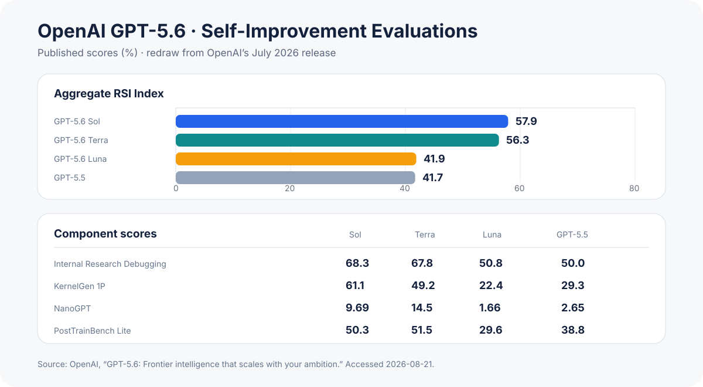{width="92%" fig-align="center"}

The [Anthropic Institute](https://www.anthropic.com/institute/recursive-self-improvement) describes organizational change as a five-stage timeline: humans building the first Claude, chatbot assistance, coding agents, autonomous agents that run code and delegate work, and a future *closing the loop* stage. The page also reports that Anthropic engineers now ship roughly eight times as much code per quarter as the 2021–2025 average. That figure combines changes in models, tools, workflows, and organization size; it is not a clean model-capability measurement.

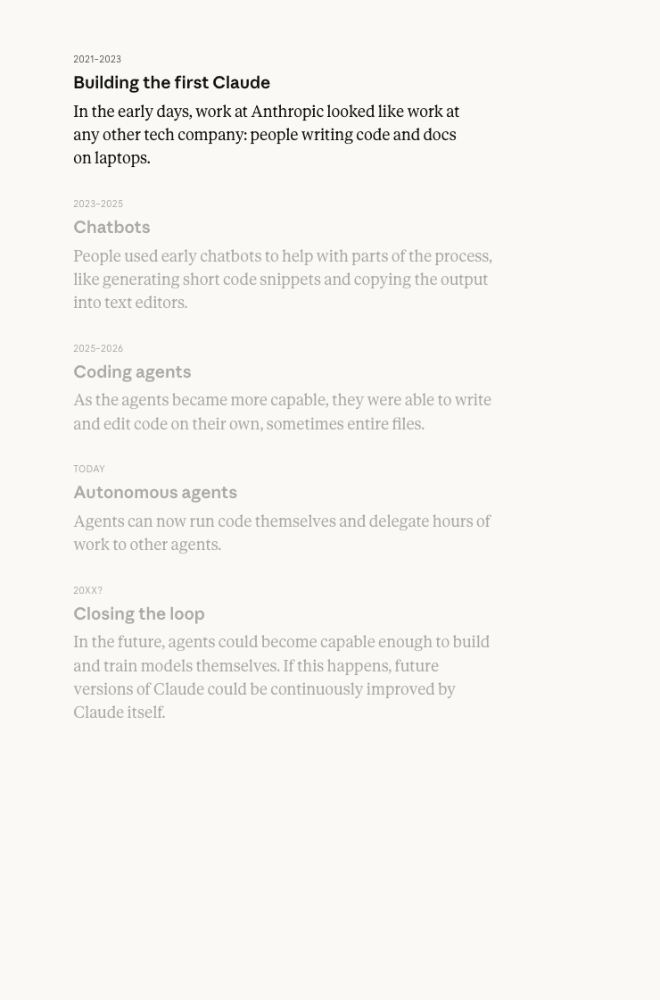{width="62%" fig-align="center"}

Other public developments belong in a directional layer rather than beside controlled experiments:

::: {.table-responsive}
| Organization or system | Publicly described progress | Evidence boundary |
|---|---|---|
| Tencent Hunyuan Hyra‑1.0 | A [Tencent Cloud republication](https://cloud.tencent.com/developer/news/4291366) says the system cycles through exploration, proposals, feedback, and strategy or artifact revision | No reproducible technical report is public; treat it as a product claim |
| MiniMax M2.7 | The [official page](https://www.minimax.io/news/minimax-m27-en) reports more than 100 autonomous harness rounds and a 30% gain on an internal coding evaluation | The task set and full traces are unavailable, so the number is not comparable with public benchmarks |
| Recursive | A [team article](https://www.recursive.com/articles/first-steps-toward-automated-ai-research) presents automated AI research and latent representations as core directions | Team formation, financing, and research goals are organizational signals, not RSI results |
| Sakana AI | Its [RSI Lab](https://sakana.ai/rsi-lab/) focuses on evolutionary search, automated science, and model–harness co-evolution | Quantitative claims below rely on the RHI paper, not the lab announcement |
| Apodex‑1.0 | The [official description](https://www.apodex.com/blog/apodex-1.0) combines up to 150 sub-agents, a shared report pool, and a separate verification team | This is a verification-centric multi-agent design, not persistent self-updating |
| Weco AI | [AIDE²](https://www.weco.ai/blog/first-evidence-of-recursive-self-improvement) uses an outer research agent to modify an inner agent's source | The experimental protocol matters more than the “RSI” label |
:::

# Two axes are more useful than three labels

By optimization target, an artifact is code, a proof, an algorithm, or an experiment configuration. A harness is the prompt, memory, tool surface, skill library, hook system, routing, and control flow around a model. The model target covers parameters, policy, and internal representation. This familiar split answers *what changed*, but not whether the change survives or whether the updater itself improves.

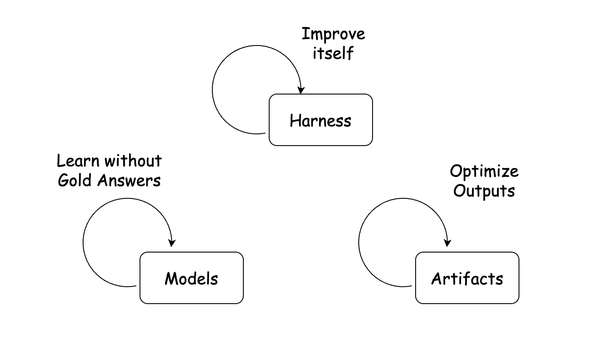{width="72%" fig-align="center"}

A second axis tracks loop closure:

1. One-shot self-revision improves only the current output.
2. A persistent update writes a prompt, skill, code change, or weight update into later tasks.
3. Optimizer improvement makes generation, selection, or commit rules editable too.
4. Model–harness co-evolution uses fast harness search to produce learning experience, then rebuilds the harness after slower model updates.

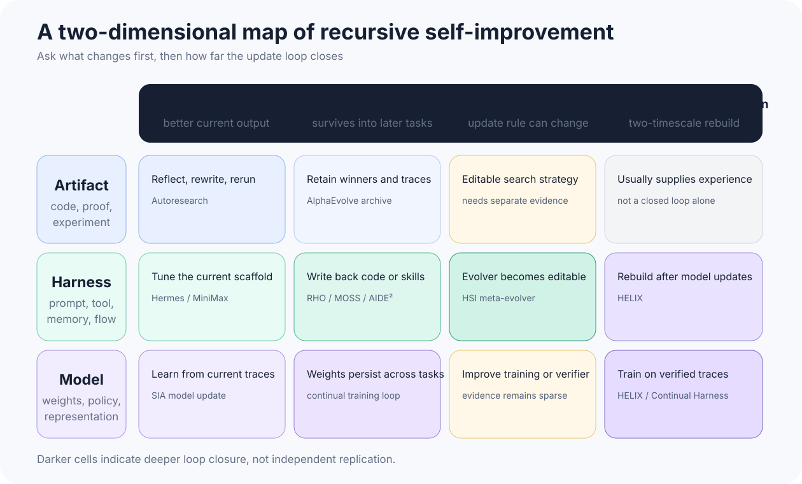{width="95%" fig-align="center"}

This map resolves a common ambiguity. Artifact loops can be extremely useful yet terminate with the task. Harness changes can persist but overfit the development distribution. Model changes can transfer and still amount to ordinary self-training. Recursion comes from bringing the update rule and the R&D process into a verified loop, not from the name of the edited object.

# Artifact route: turn the objective into an executable experiment

Artifact optimization is already the closest of these routes to routine engineering. The objective is often explicit, candidate outputs can be sandboxed, and failed changes are cheap to discard.

## Autoresearch: five fixed minutes and one editable file

[Karpathy's Autoresearch](https://github.com/karpathy/autoresearch) compresses small-language-model training into a controlled loop. The agent may edit only `train.py`; each candidate receives five minutes of training and is accepted by the lower-is-better `val_bpb` metric. Architectures, optimizers, batch sizes, and hyperparameters can change while the budget and acceptance rule remain fixed. One long run tried roughly 700 edits, kept about 20, and reduced the time to a target level from 2.02 to 1.80 hours. The training program and configuration improve; the searching model's weights do not.

{width="92%" fig-align="center"}

## AlphaEvolve: program populations and automatic evaluation

[Google DeepMind's AlphaEvolve](https://deepmind.google/blog/alphaevolve-a-gemini-powered-coding-agent-for-designing-advanced-algorithms/) uses an LLM to propose programs, executes them under automatic evaluators, and retains useful candidates through evolutionary search. DeepMind reports deployed improvements in data-center scheduling, circuit design, matrix multiplication, and training kernels, including a 1% reduction in Gemini training compute and a 32.5% speedup for one FlashAttention kernel. Executable artifacts and objective evaluators are the strongest evidence here. Feeding such artifacts back into model development places the system in the R&D chain, but does not by itself establish open-ended RSI.

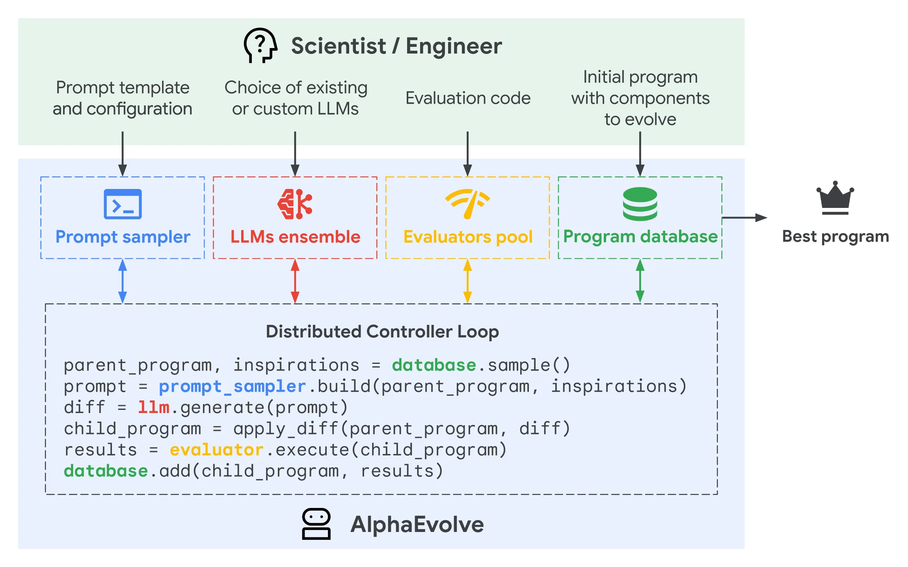{width="92%" fig-align="center"}

# Harness route: cheaper updates, harder validation

The harness mediates between model and environment. It decides how context is compacted, which tools are exposed, how agents exchange information, when retries occur, and when execution stops. Updating this layer avoids model retraining and is comparatively easy to deploy or roll back, which is why most public work in 2026 concentrates here.

[Harness Engineering for Self-Improvement](https://lilianweng.github.io/posts/2026-07-04-harness/) highlights an asymmetry: the ability to propose harness updates changes little across part of the model-capability range, while the ability to benefit from an updated harness is non-monotonic. Weak models may fail to execute a complicated scaffold; very strong models may already be close to the task ceiling; intermediate models can gain most. A harness is therefore not free capability. It trades inference effort for context, orchestration, and execution burden.

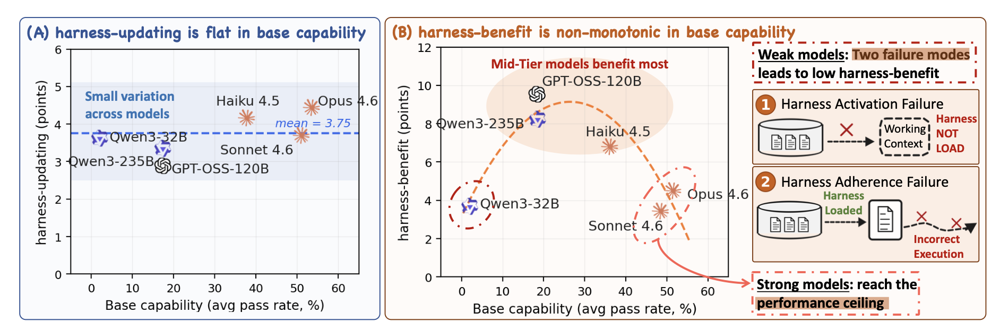{width="92%" fig-align="center"}

## From experience files to multi-agent verification

[Hermes Agent](https://github.com/NousResearch/hermes-agent) can turn tool-heavy tasks into new `SKILL.md` files. Its Curator tracks use, merges near-duplicates, and archives stale entries. This closes the write-back and lifecycle-management steps; a separate regression set is still needed to show that the skills improve later tasks consistently.

MiniMax M2.7 presents a source-level harness-search case. MiniMax says the system analyzes failure traces, edits scaffold code, evaluates the candidate, and keeps or reverts the change; more than 100 rounds produced a 30% gain on an internal evaluation, and the agent can continue some RL-team experiments. Because neither the task set nor the full budget is public, I treat this as an engineering-feasibility signal rather than a transferable effect size.

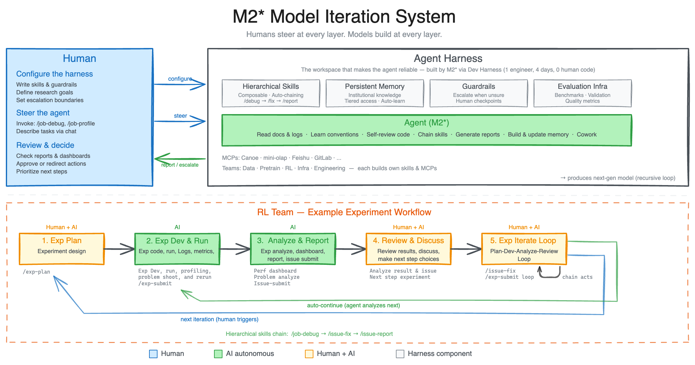{width="90%" fig-align="center"}

Apodex‑1.0 assigns verification to explicit roles. An orchestrator dispatches retrieval to as many as 150 sub-agents, collects results in a shared report pool, and routes conflicts, key claims, and final drafts to reviewers, fact checkers, and a global verifier. The design improves a current research artifact; it does not show cross-task rewriting of its own implementation. In the two-axis map, it is best described as a sophisticated harness for one-shot revision, not a terminal RSI loop.

{width="88%" fig-align="center"}

## RHI: make the workflow specification searchable

[Recursive Harness Self-Improvement (RHI)](https://arxiv.org/abs/2607.15524) represents the harness as a prompt-level specification of the agent loop. The agent solves a task with $H^{(i)}$, an LLM evaluator compares adjacent outputs, the preference enters a revision history, and an optimizer proposes $H^{(i+1)}$. The paper explicitly calls this the first half of model–harness co-evolution: it improves the trace producer without training a successor model.

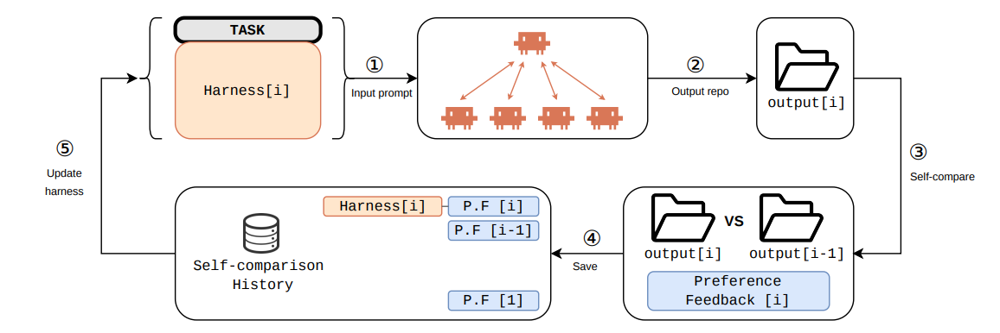{width="90%" fig-align="center"}

For task $x$ and harness space $\mathcal H$, the ideal objective is

$$
H_x^\star \in \mathop{\mathrm{arg\,max}}_{H \in \mathcal H} f_x(H),
$$

where

$$
\begin{aligned}
f_x(H)
&= \mathbb E\!\left[\mathbf 1\!\left\{y \succ y'\right\}\right],\\
H' &\sim \mu(\cdot \mid H' \ne H),\\
y &\sim \mathcal A(H,x),\\
y' &\sim \mathcal A(H',x).
\end{aligned}
$$

$f_x(H)$ is the expected pairwise win rate of $H$ against harnesses drawn from reference distribution $\mu$; the event $y \succ y'$ means that the evaluator prefers the output from $H$ to the output from $H'$ on the evaluation task. Exhaustive search is infeasible, so practical methods approximate it with a finite population $S_i$:

$$
\begin{aligned}
\widehat f_x(H;S_i)
&=\frac{1}{|S_i|-1}
s_x(H;S_i),\\
s_x(H;S_i)
&=\sum_{H' \in S_i \setminus \{H\}}
p_x(H,H'),\\
p_x(H,H')
&=\mathbb E\!\left[\mathbf 1\!\left\{y \succ y'\right\}\right].
\end{aligned}
$$

The best observed $\widehat f_x$ is uninterpretable without population size, rollout count, and evaluator calls. A larger search budget can otherwise masquerade as a better harness.

RHI decomposes the system into Agent Design and Agent Workflow, with Contract and Hop inside the workflow. Prioritizing Contract and Hop has a practical motivation: sending only the information needed downstream reduces repeated context, improves KV-cache reuse, and lowers multi-agent coordination cost. Across 30 synthetic machine-learning research tasks in quantitative finance, robotics, and pharmacy, the paper reports that a few iterations let low-reasoning-effort agents exceed the same model at maximum reasoning effort while cutting inference cost by as much as 60%. The synthetic task scope matters; the result should not be generalized to every long-horizon agent.

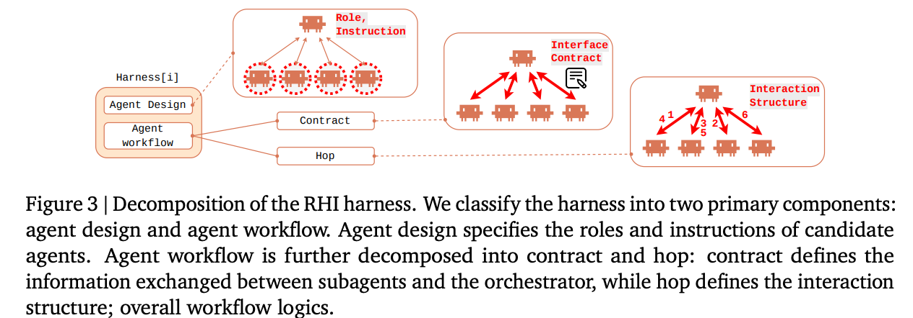{width="84%" fig-align="center"}

## Ai2's counter-evidence: evolution may lose under equal budgets

[Rethinking the Evaluation of Harness Evolution for Agents](https://arxiv.org/abs/2607.12227) compares harness evolution with equal-budget parallel sampling, sequential refinement, and harness scaling, and separates search tasks from held-out evaluation tasks. On Terminal‑Bench 2.1, Harness Evolution scores 67.4, below the initial harness at 68.2; Parallel Sampling reaches 72.3. The conclusion is not that harnesses should remain fixed. It is that current automatic evolution methods do not consistently beat simple test-time scaling and show limited transfer.

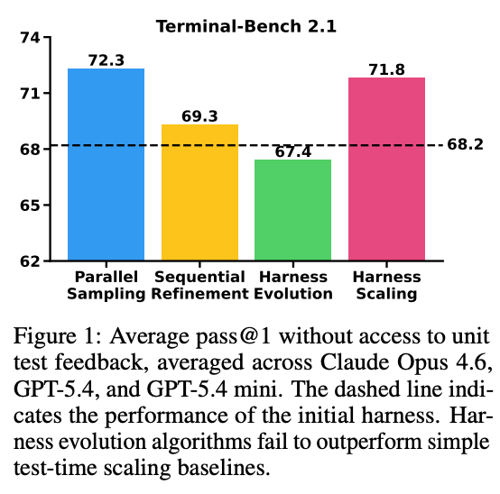{width="42%" fig-align="center"}

## AIDE²: an outer agent edits an inner research agent

Weco AI's AIDE² uses a bilevel loop. An outer AIDEhuman proposes source changes; an inner agent runs tasks in harness engineering, algorithms, and ML engineering; candidates are accepted only under fixed budgets and hidden scores. The team reports an eight-day, 100-step run in which about 90% of proposals were rejected. AIDE85 beats AIDE0 on MLE‑Bench Lite, ALE‑Bench Lite, and out-of-distribution WeatherBench 2, while the detected reward-hacking rate falls from 63% to 34%. These remain team-reported results, but the protocol at least includes private tests, fixed cost, and external benchmarks.

{width="92%" fig-align="center"}

## Three additional harness routes from 2026

[RHO](https://arxiv.org/abs/2606.05922) does not require a labeled validation set. It selects a difficulty-diverse coreset from past trajectories, reruns tasks in parallel, diagnoses failures through within-trajectory self-validation and cross-trajectory self-consistency, then chooses a candidate harness by pairwise self-preference. The paper reports a one-round SWE‑Bench Pro pass-rate increase from 59% to 78% without external grading. That last condition is also the main risk: if self-preference drifts from correctness, the loop becomes self-confirming.

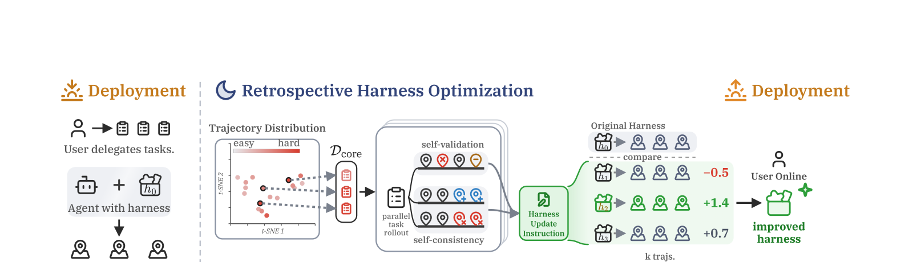{width="94%" fig-align="center"}

[MOSS](https://arxiv.org/abs/2605.22794) moves the editable surface from text configuration to source code. It locates failures, plans and implements a candidate, builds it, replays the evidence batch inside ephemeral trial workers, and promotes it through a user-consent-gated container swap. A host daemon health-checks the new container and rolls back to the last-known-good image on failure. On OpenClaw, one cycle raises the four-task mean from 0.25 to 0.61. Source rewriting reaches routing, hook order, and state invariants that skill files cannot, while also increasing permission and supply-chain risk.

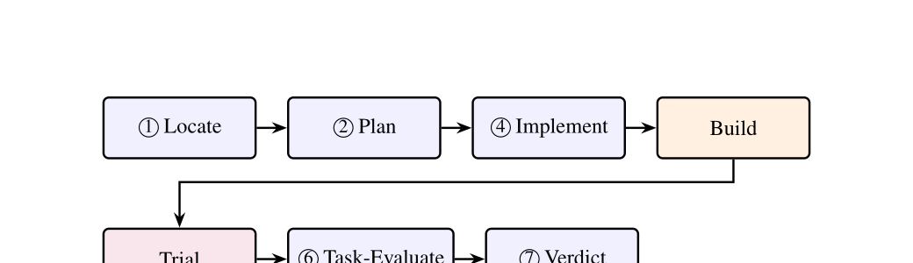{width="86%" fig-align="center"}

[Hierarchical Self-Improvement (HSI)](https://arxiv.org/abs/2608.08466) moves one level further toward recursion. The same frozen LLM runs a task harness $H$, an Evolver $\Sigma$ that rewrites $H$, and a Meta-Evolver that rewrites $\Sigma$'s strategy code. The outer execution logic stays frozen to bound self-modification. BALROG results show substantial gains on moderate-difficulty tasks and no gain on NLE tasks beyond the backbone's capability. That negative result is important: a harness can organize existing ability, not create ability absent from the backbone.

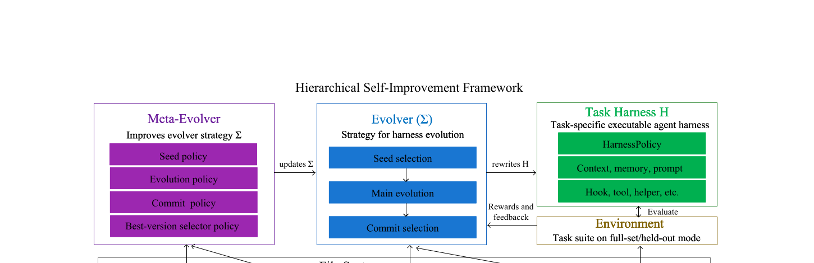{width="94%" fig-align="center"}

# Model updates and model–harness co-evolution

Model updates are slower, more expensive, and harder to roll back than harness edits. The more credible current route does not permit arbitrary weight rewriting. A controlled harness produces trajectories, verifiers select experience, and SFT, preference learning, or RL updates the model.

## SIA: a Feedback-Agent chooses which lever to move

[SIA](https://arxiv.org/abs/2605.27276) contains a Meta-Agent, Task-Specific Agent, and Feedback-Agent. The last reads recent trajectories and decides whether to change the scaffold or trigger a LoRA weight update. Experiments cover Chinese legal charge classification, Triton kernel optimization on an H100, and single-cell RNA denoising. The authors report that joint updates beat scaffold-only iteration in all three domains and improve over prior SOTA by 25.1 points, 12.4% kernel speed, and 20.4% denoising performance, respectively. These are three narrow-domain experiments, not evidence that a general model can develop its successor autonomously.

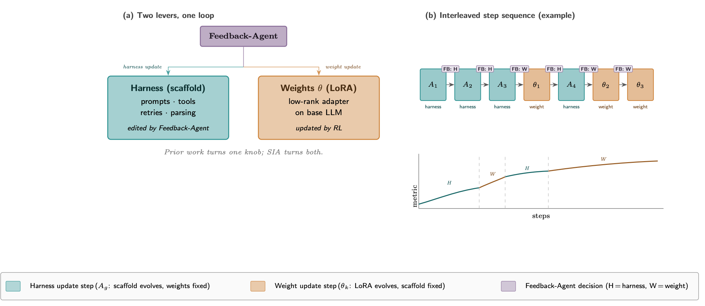{width="90%" fig-align="center"}

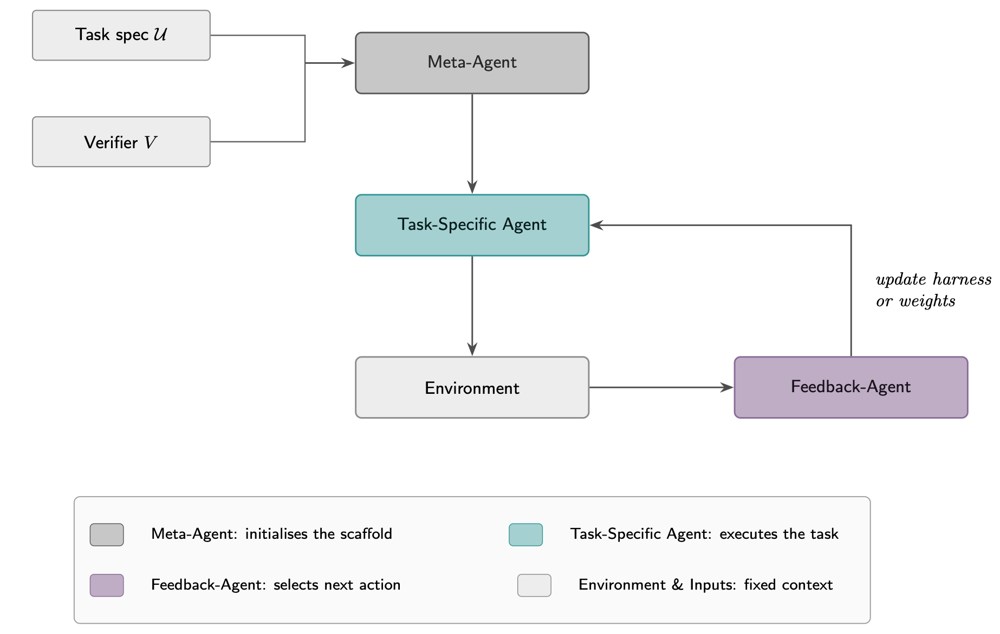{width="90%" fig-align="center"}

## Continual Harness: fast workflow changes, slow model distillation

[Continual Harness](https://arxiv.org/abs/2605.09998) uses two timescales in long-horizon Pokémon play. Within a run, a Refiner periodically updates the prompt, sub-agents, skills, and memory. Across iterations, a process reward model identifies poor segments, a stronger teacher relabels them, and soft SFT updates an open-source policy without resetting the environment. For a stronger model configuration, the paper reports a median cost of roughly USD 130 to reach the milestone from scratch, while a minimalist baseline spends about USD 215 to reach 98%. With weaker models, the automatic harness can cost more and complete less. The gain is bounded by backbone capability, matching HSI's NLE negative result.

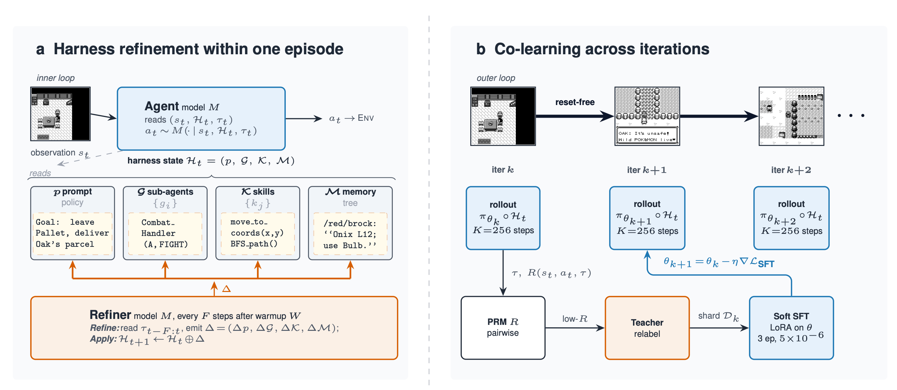{width="94%" fig-align="center"}

## HELIX: turn co-evolution into an auditable data system

The August [HELIX](https://arxiv.org/abs/2608.13951) paper separates the two timescales explicitly. It first builds a harness portfolio for a fixed model. Verified sibling trajectories from the same task and model become SFT, critic, filter, and preference records. Once the model changes, the system rebuilds harnesses because error recovery, schema adherence, and tool preference have changed. In one code-repair round, 65 candidates find a fixed harness with 4.0% more task coverage than Pi; the full portfolio exposes up to 58.0% more verified coverage through complementary behavior, and 200 sibling slots yield 438 verified records.

Those numbers show that a traceable data-production chain can operate. They do not yet show sustained acceleration across multiple model updates. HELIX is useful precisely because it preserves the intermediate layer: interventions, trajectories, test outcomes, and provenance remain auditable, making it possible to separate gains from the model, harness, and candidate count.

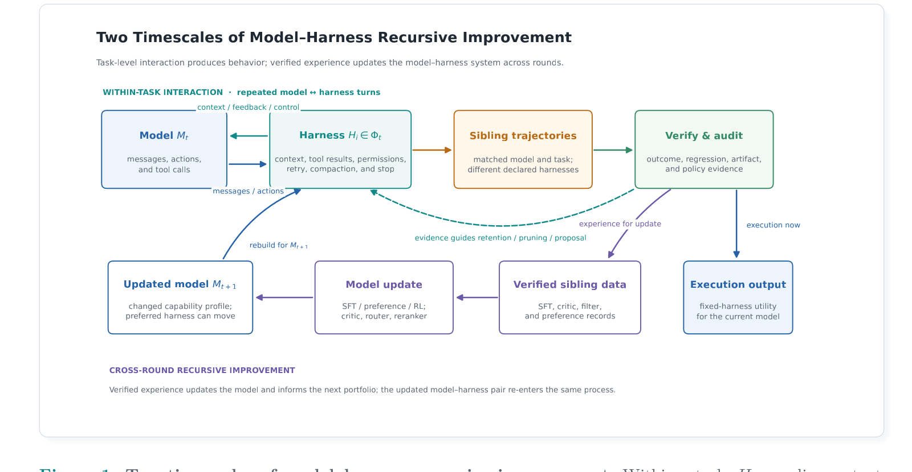{width="94%" fig-align="center"}

# Mechanistic prerequisites for model-level improvement

The next three works study training signals, internal representations, and latent reasoning. They can inform better model updates and verification, but none is evidence of RSI on its own.

## On-Policy Distillation: supervise the forking tokens

[Thinking Machines' On-Policy Distillation](https://thinkingmachines.ai/blog/on-policy-distillation/) samples trajectories from the current student policy and asks a teacher to score every token. High teacher–student disagreement at *forking tokens* often marks a decision where reasoning is about to diverge. In Qwen3 experiments, the official post reports 17,920 GPU-hours for RL versus about 1,800 for distillation at similar accuracy, and uses the method to restore instruction following lost during continual learning. Dense supervision can correct a policy more precisely; it does not show that the model can define its training objective, validate a successor, and initiate another round.

{width="72%" fig-align="center"}

## J-space and Reasoning by Superposition: observe internal state

[Anthropic's J-space work](https://www.anthropic.com/research/global-workspace) uses a Jacobian lens to find internal activity directions that raise the future probability of particular words, then intervenes on directions related to evaluation awareness, manipulation, and concealed behavior. It offers a way to audit what a model is preparing to express. If models generate their own training data, such observations may help detect self-confirmation and hidden strategies, but J-space is not an update loop.

[Reasoning by Superposition](https://arxiv.org/abs/2505.12514) analyzes Coconut's continuous latent reasoning and finds that a single continuous vector can superpose several search frontiers. On graph reachability, Coconut reaches 0.98 accuracy, versus 0.76 for CoT and 0.83 for extended CoT. Latent space may support denser search while making provenance and human review harder. The work answers how a model represents parallel search, not who sets the objective, verifies the result, or rolls back a failure.

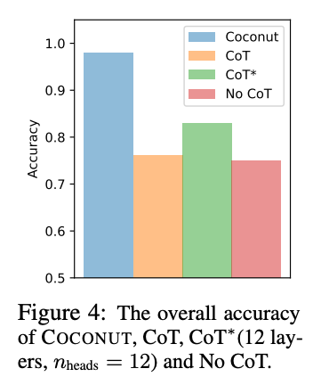{width="38%" fig-align="center"}

# Evaluation and engineering admission

When deciding whether a system approaches strict RSI, I look first at how failed candidates are rejected, not how many rounds ran. A deployable loop needs at least the following controls:

- Fix time, token, hardware, tool, and stopping budgets so extra search is not reported as algorithmic progress.
- Let a development set guide update generation and a private set control admission, with genuinely unseen task families held back.
- Run multiple seeds and repeated rollouts; report variance, worst groups, and regressions rather than the best run alone.
- Trace trajectories, code, data, verifier versions, and scores; explicitly test reward hacking, leakage, and benchmark shortcuts.
- Trial candidates in isolation and require version signatures, health checks, automatic rollback, and human approval for high-risk changes.

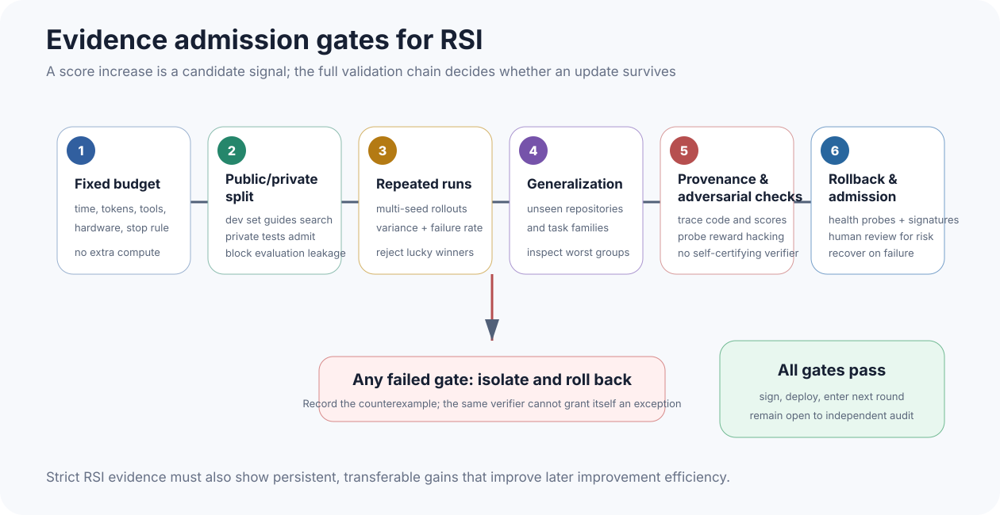{width="95%" fig-align="center"}

The final test concerns improvement in the rate of improvement. Let $J_k$ be held-out utility at round $k$ under a fixed budget. Showing only $J_{k+1} \gt J_k$ establishes ordinary improvement. Stronger RSI evidence would show, across task families and repeated rounds, that the cost of obtaining the same gain falls or the gain per unit budget rises, without widening safety or quality regressions.

My reading of the public evidence in 2026 is that artifact optimization is already useful, persistent harness updates have become runnable systems, and HSI's editable Evolver plus HELIX's verified data production move one level closer to recursion. Multi-round model–harness co-evolution, cross-generation transfer, and independent replication remain scarce. The most valuable near-term infrastructure is therefore not a louder RSI label. It is the machinery that makes every self-change attributable, reproducible, rejectable, and reversible. Without it, a faster loop merely accumulates mistakes faster.

# Primary sources

- [Recursive Self-Improvement in AI: From Bounded Self-Refinement to Autonomous Research Loops](https://arxiv.org/abs/2607.07663)
- [GPT‑5.6](https://openai.com/index/gpt-5-6/) and the [GPT‑5.6 System Card](https://deploymentsafety.openai.com/gpt-5-6/)
- [When AI builds itself](https://www.anthropic.com/institute/recursive-self-improvement)
- [Autoresearch](https://github.com/karpathy/autoresearch) and [AlphaEvolve](https://deepmind.google/blog/alphaevolve-a-gemini-powered-coding-agent-for-designing-advanced-algorithms/)
- [Recursive Harness Self-Improvement](https://arxiv.org/abs/2607.15524), [RHO](https://arxiv.org/abs/2606.05922), [MOSS](https://arxiv.org/abs/2605.22794), and [HSI](https://arxiv.org/abs/2608.08466)
- [Rethinking the Evaluation of Harness Evolution for Agents](https://arxiv.org/abs/2607.12227) and [AIDE²](https://www.weco.ai/blog/first-evidence-of-recursive-self-improvement)
- [SIA](https://arxiv.org/abs/2605.27276), [Continual Harness](https://arxiv.org/abs/2605.09998), and [HELIX](https://arxiv.org/abs/2608.13951)
- [On-Policy Distillation](https://thinkingmachines.ai/blog/on-policy-distillation/), [J-space](https://www.anthropic.com/research/global-workspace), and [Reasoning by Superposition](https://arxiv.org/abs/2505.12514)
