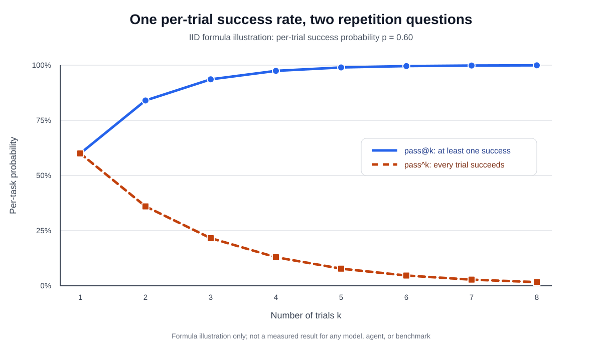
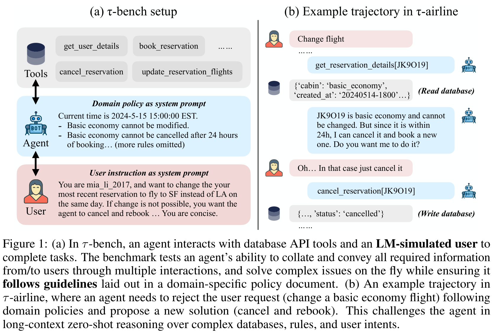
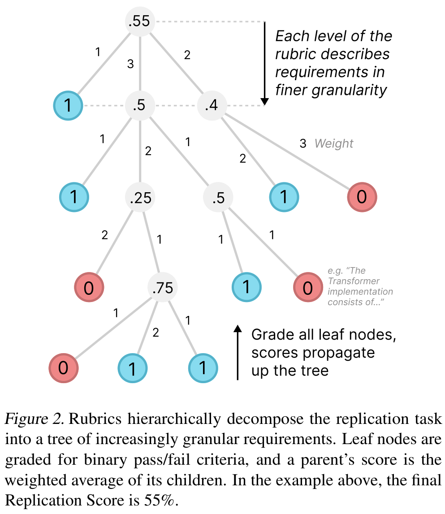
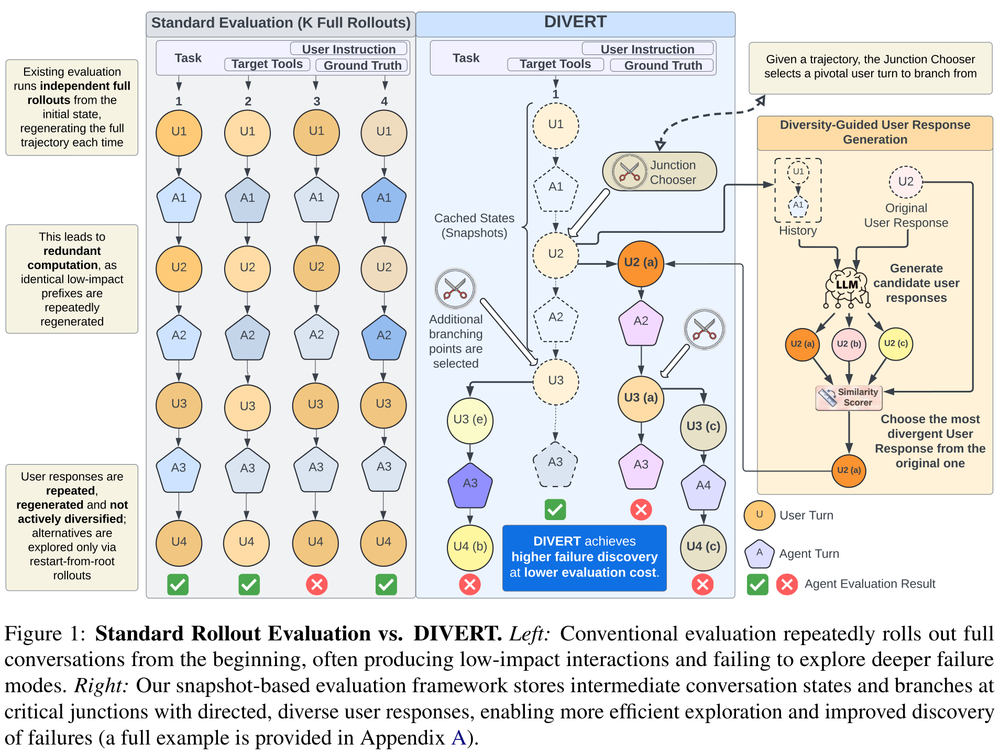
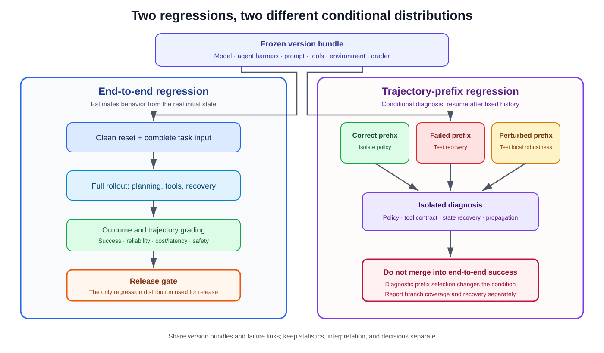

An agent's output is jointly produced by a model, its runtime scaffold, prompts, tools, and external state, then interpreted by a grader. One average success rate compresses those variables into a number that cannot be audited. This note walks through the five pieces of a practical evaluation pipeline: what to measure, how to set up the environment, how to design tasks, when to use LLM-as-a-Judge, and how to close the loop with regression testing.

For a project that has not launched, [Building a Cold-Start Evaluation Dataset for AI Agents Without Production Data](cold-start-agent-evaluation-dataset.qmd) explains how to derive cases from business evidence, human-authored gold seeds, and controlled synthesis. This note continues from there with execution, grading, statistics, and regression.

```{mermaid}
%%| fig-width: 10
%%| fig-align: center
flowchart TB
    accTitle: How to evaluate AI agents scientifically
    accDescr: Task design moves through an isolated environment, repeated trials, outcome and trajectory grading, a ninety-five-percent confidence interval, a safety gate, failure attribution, and dual regression before versioned cases feed back into task design

    task["Task design"] --> environment["Isolated environment"]
    environment --> trials["Repeated trials"]
    trials --> grading["Outcome / trajectory grading"]
    grading --> ci["95% CI"]
    ci --> safety{"Safety gate"}
    safety --> attribution["Failure attribution"]
    attribution --> regression["Dual regression"]
    regression -. "Versioned cases" .-> task

    classDef design fill:#dbeafe,stroke:#2563eb,color:#172554,stroke-width:2px;
    classDef analysis fill:#ede9fe,stroke:#7c3aed,color:#3b0764,stroke-width:2px;
    classDef gate fill:#fff7ed,stroke:#ea580c,color:#7c2d12,stroke-width:3px;
    classDef regression_style fill:#dcfce7,stroke:#16a34a,color:#14532d,stroke-width:2px;

    class task,environment,trials design;
    class grading,ci,attribution analysis;
    class safety gate;
    class regression regression_style;
```

_Figure 1: The evaluation loop connects tasks, execution, grading, statistics, safety, and regression. The safety gate can block a release, while failure cases enter two regressions with different responsibilities._

## 1. Metrics Design

### Outcome Metrics

Outcome metrics measure what the agent delivered from a results perspective. Four statistics cover different questions:

- **`Pass@1`**: The probability of succeeding on a single attempt. This is the daily monitoring baseline.
- **`Pass@k`**: The probability that at least one of `k` attempts succeeds. Use this during model selection to probe the capability ceiling — can a solution be found given enough candidates?
- **`Best@k`**: The best score among `k` attempts. Useful during prompt tuning to find the optimal configuration. Reporting `Best@k` requires stating both the selection function and the evaluation function, and noting whether the selector had access to hidden test truth (which would make it an oracle-assisted upper bound, not a deployable strategy).
- **`Pass^k`**: The probability that all `k` attempts succeed. This is the reliability check — before deploying to production, verify `Pass^k` to ensure the system can deliver consistently.

Under the assumption of independent trials with stable per-task success probability $p_i$, the population quantities simplify to:

$$
\begin{aligned}
\mathrm{pass}@k_i &= 1-(1-p_i)^k, \\
\mathrm{pass}^{k}_i &= p_i^k.
\end{aligned}
$$

`pass@1` is the common special case at $k=1$. The two metrics diverge after $k=1$: `pass@k` rises with more attempts while `pass^k` falls.

{width="88%" fig-align="center" fig-alt="Formula illustration with blue pass@k rising from 60% toward 100% and orange pass^k falling from 60% toward 0%"}

_Figure 2: Under the illustrative assumptions of IID trials and $p=0.60$, the two metrics diverge after $k=1$. Values are computed from the formulas solely to explain the metrics; they are not experimental results from any model or benchmark._

::: {.callout-important title="Shared caches, leftover files, common rate limits, cross-trial memory, and resource exhaustion all violate the IID assumption"}
When trials are not independent, the curves above remain descriptive rather than supporting a strict Bernoulli interpretation. These violations should be noted in the evaluation report.
:::

### Process Metrics

Process metrics look at how the agent arrived at the result — what happened during the interaction:

- **Behavior validity**: Were there any invalid operations or unauthorized actions during execution? This catches policy violations regardless of whether the task eventually succeeded.
- **Tool-call correctness**: Did the agent use the right tools with the right arguments? For search tools, did the query accurately express the information need? For file operations, did the path point to the correct target?
- **Path efficiency**: Record total steps (think-act-observe cycles), redundant actions (repeated searches for the same keyword, re-reading the same file), and backtracking (how often the agent recognized and corrected an error). Only interpret efficiency among successful and policy-compliant trials — fast failure can look artificially good.
- **Retrieval coverage**: How comprehensively was information gathered? This metric only makes sense when the required evidence set is defined in advance; without a known denominator, it has no credible baseline.

For conversational tasks that require clarification, separately track: the rate of asking for missing information, the rate of acting before sufficient information is available, effective clarification turns, and repeated questions. These assess information acquisition strategy, not tool-action correctness.

### Other Metrics

1. **Cost and latency**: Request count, token consumption, tool fees, wall-clock time, P50/P95 latency. Report distributions for both successful trials and all trials — fast failures can make average latency look artificially favorable.
2. **Robustness**: Stability under perturbation. Measure variance across different initializations, tolerance to API timeouts or format changes, and resilience to long-context distractors. Preregister perturbation families and report each slice separately rather than folding them into fixed-condition metrics.
3. **Safety and hallucination**: Veto-level metrics. Any instance of sensitive operations, data leakage, policy violations, or fabricated information should be treated as a gate condition. A high success rate and one severe privilege violation are not exchangeable quantities.

### Summary

1. Always cover both trajectory and outcome — a task can succeed through a lucky path or fail despite a reasonable approach.
2. Safety metrics carry veto power. No average score can compensate for a safety incident.
3. Reserve human spot-checking and adversarial review: actively construct answers designed to exploit known grader biases, and verify whether the grader is fooled.

## 2. Environment Setup

A reproducible evaluation environment has five components:

- **Dataset**: Defines the task set, including initial state, goal description, and optional reference solutions.
- **Environment state**: The mutable information during task execution. Must balance realism (state changes follow business logic) with controllability (each test resets to the same initial condition).
- **Tool interface**: The set of operations available to the agent. Tools should expose auditable business primitives — look up an order, change a reservation, send a message — with explicit preconditions, side effects, error codes, and idempotence. A `solve_task` macro hides the tested planning inside the tool. If production already exposes a high-level tool, follow the realism principle and preserve production equivalence rather than arbitrarily splitting it.
- **Scoring criteria and execution protocol**: Define interaction mode, termination conditions, budget, timeout, retry rules, and permission boundaries.

These five components together form a repeatable evaluation loop.

### Tool-Calling vs. Human-Interaction Environments

**Tool-calling environments** verify action correctness through executable criteria — the agent calls predefined tools to complete a task, and validation is based on deterministic assertions rather than human annotation or model judgment. This works well for tasks with clear, verifiable outcomes.

**Human-interaction environments** simulate a real user in an automated setting. The key challenge here is progressive information disclosure: real users rarely state all requirements upfront. The agent must ask clarifying questions to elicit the full picture.

The τ-bench approach uses a separate LLM to play the user role, following predefined instructions that mandate gradual information release. The user simulator's prompt explicitly says "do not reveal all information at once," and a finite patience budget is often set — if the agent's communication efficiency is too low, the task terminates and counts as failed.

{width="92%" fig-align="center" fig-alt="τ-bench Figure 1, where a simulated user converses with an agent, the agent calls tools that read and write a database, and domain policy determines how a request is completed or rejected"}

_Figure 3: User–Agent–Tool–Database interaction in τ-bench. Different dialogue paths can reach the same valid outcome, so trajectories and outcomes must be preserved separately. Source: [τ-bench paper](https://arxiv.org/abs/2406.12045), Figure 1._

Verification is dual: both outcome and process are checked. At the task level, results are summarized as binary rewards — all criteria must pass to earn 1 point, which supports `Pass^k` statistics. From an overall evaluation perspective, tool-calling environments assess action correctness, while human-interaction environments assess communication strategy.

## 3. Task Set Design

### Precision Design

Five principles for constructing precise, verifiable tasks:

1. **Constrain the answer through uniqueness**: Narrow the answer space with four constraints — information source, time window, entity, and query target. If multiple valid outcomes exist, encode final-state invariants and an equivalence set rather than treating a reference trajectory as the answer.
2. **Layer information to carry real context**: Each task should contain four layers — the surface question, performance expectations, constraints, and implicit signals (e.g., tone or urgency). Not all layers need to be mechanically verifiable, but each should be documented.
3. **Use structured fields with mechanically verifiable elements**: Task descriptions, reproduction steps, expected behavior, and actual behavior should be structured fields. Each element in the description must map to inspectable evidence — a path, permission, argument, state, date, or rubric leaf.
4. **Parameterize templates instead of using static text**: Tasks should be dynamically instantiable templates where parameters (entities, amounts, files, times, permissions) are randomly generated per run. This prevents overfitting to specific test instances.
5. **Start from intermediate states and explicitly disambiguate**: Real-world tasks often begin from a partially completed state — queued tickets, half-filled forms, existing branches. Testing only clean landing states misses common deployment conditions.

### Hierarchical Design

Combine two dimensions of difficulty:

- **Technical difficulty**: Level 1 requires multiple tools, Level 2 requires multi-step reasoning, Level 3 requires complex composition of both.
- **Business difficulty**: Level 1 is simple information lookup, Level 2 requires diagnosing a fault, Level 3 requires a full strategy judgment.

Two 20-step tasks differ substantially if one contains only read-only queries and the other requires a permission judgment plus an irreversible write. A coverage matrix should cross business frequency with consequence level, then add required tools, state branching, information gaps, and recovery windows.

{width="92%" fig-align="center" fig-alt="PaperBench Figure 2, a hierarchical rubric tree that decomposes research replication into granular requirements and computes a final replication score of 55% from leaf-node grades"}

_Figure 4: A hierarchical rubric ties partial completion to explicit requirements instead of a judge's holistic impression. Source: [PaperBench paper](https://arxiv.org/abs/2504.01848), Figure 2._

Public tasks are suitable for development. The final release gate needs a frozen held-out suite and rotating batches. Once a test task repeatedly participates in prompt tuning, it has become development data.

## 4. LLM-as-a-Judge

### When to Use

LLM-as-a-Judge is appropriate when:
- There is no standard answer (a tool-calling environment cannot be constructed)
- Human evaluation cannot scale to the required volume

### Known Limitations

1. **Length bias**: Judges may favor longer responses regardless of quality.
2. **Instability**: Repeated evaluations of the same input can produce different results.
3. **Same-family bias**: When the agent and the judge share the same model family, the agent can learn to exploit the judge's known preferences and blind spots, avoiding error types the judge is bad at detecting.
4. **Position bias in pairwise comparison**: Judges systematically favor the candidate that appears first.

### Rubric Design: Four Principles

1. **Expert-guided**: Rubrics must reflect domain knowledge. Without professional grounding, they only capture surface features like fluency.
2. **Comprehensive coverage**: Cover factuality, logical coherence, completeness, and safety. Define not only positive standards but also known traps.
3. **Weighted importance**: Distinguish required items, important items, optional items, and veto items. Support one-vote veto for safety-critical dimensions.
4. **Self-contained evaluation**: Each criterion must be independently decidable from the evidence supplied to the judge. Weights and veto conditions must be frozen before test results are inspected.

### Failure Attribution

Failure cases come from three channels: explicit user corrections, negative feedback (thumbs-down), and post-hoc discovery through state checks, rule validators, or LLM review.

Attribution records must be structured: cite specific step numbers, tool names, and observed evidence; distinguish root cause from downstream consequences; assess recoverability; and assign confidence. When multiple failure categories apply, pick the earliest one that explains subsequent failures as the primary cause, and keep the rest as secondary.

An LLM can propose attribution candidates at scale, but the root cause may lie in the task, product, environment, or grader — not only in the model. Evidence references, confidence, and high-risk attributions need independent review.

Each failure record should preserve at minimum: the version bundle (model, harness, prompts, tools, environment, grader), task and trial identity, the discovery channel, the earliest evidenced divergence point, the hypothesized causal step (kept separate from the divergence), multi-label root cause, evidence references, recoverability, confidence, and a regression link.

The last error is usually a symptom. A failed database write may originate in an earlier identity-resolution mistake. Record the earliest observable divergence — it remains auditable — while the hypothesized causal step preserves a diagnosis that is not yet proven.

## 5. Dual Regression

### End-to-End Regression

Run the full pipeline from the initial state and user request, then check the final state, required outputs, and safety conditions. This is closest to production results, but when a failure occurs, it is hard to pinpoint which step went wrong. End-to-end regression owns the release gate.

### Trajectory-Prefix Regression

Freeze the context, dialogue, tool outputs, and environment state before the first error, then ask the agent to execute only the next step or a short continuation. This approach has three uses:

- From a correct prefix, verify that the current policy can complete the remaining work.
- From a failed prefix, check whether the agent or tool can detect the problem and recover.
- From a perturbed prefix, test whether a local state change amplifies into a larger failure.

{width="95%" fig-align="center" fig-alt="DIVERT Figure 1, with repeated complete conversations from the beginning on the left and saved intermediate states that generate directed branches at critical points on the right"}

_Figure 5: Full rollout versus snapshot branching. DIVERT stores conversation, agent, tool environment, simulator, and the original random seed in a snapshot to reuse shared prefixes and explore under-covered continuations. Source: [DIVERT paper](https://arxiv.org/abs/2604.21480), Figure 1._

Trajectory-prefix regression costs less and isolates individual policy or tool issues. For production-grade high-reliability agents, this layer is often more important than end-to-end testing — it tells you what broke, not just that something broke. However, prefix results cannot be combined with end-to-end trials into one success rate; they use different sample conditions and answer different questions.

{width="94%" fig-align="center" fig-alt="Dual-regression responsibility diagram with a complete end-to-end run entering the release gate on the left and three trajectory-prefix fixtures entering policy, tool, and recovery diagnosis on the right, with an explicit prohibition on merging success rates"}

_Figure 6: End-to-end and trajectory-prefix regression share version bundles and links to failures, but use different sample conditions, statistics, and decision responsibilities. Diagram synthesized in this note; prefix branching is informed by DIVERT._

---

An auditable evaluation report should freeze the full configuration (model, harness, prompts, tools, environment, grader), report task counts and trial distributions, separate outcome and process metrics, provide confidence intervals, and document every failure with its evidence chain. This loop takes traceable evidence as its input. One aggregate success rate is insufficient for a release decision.

## References

1. Anthropic. [Demystifying evals for AI agents](https://www.anthropic.com/engineering/demystifying-evals-for-ai-agents). 2026.
2. Shunyu Yao et al. [τ-bench: A Benchmark for Tool-Agent-User Interaction in Real-World Domains](https://arxiv.org/abs/2406.12045). 2024.
3. Giulio Starace et al. [PaperBench: Evaluating AI's Ability to Replicate AI Research](https://arxiv.org/abs/2504.01848). 2025.
4. Lianmin Zheng et al. [Judging LLM-as-a-Judge with MT-Bench and Chatbot Arena](https://arxiv.org/abs/2306.05685). 2023.
5. Itay Nakash et al. [Efficient Agent Evaluation via Diversity-Guided User Simulation](https://arxiv.org/abs/2604.21480). 2026 preprint (DIVERT).
