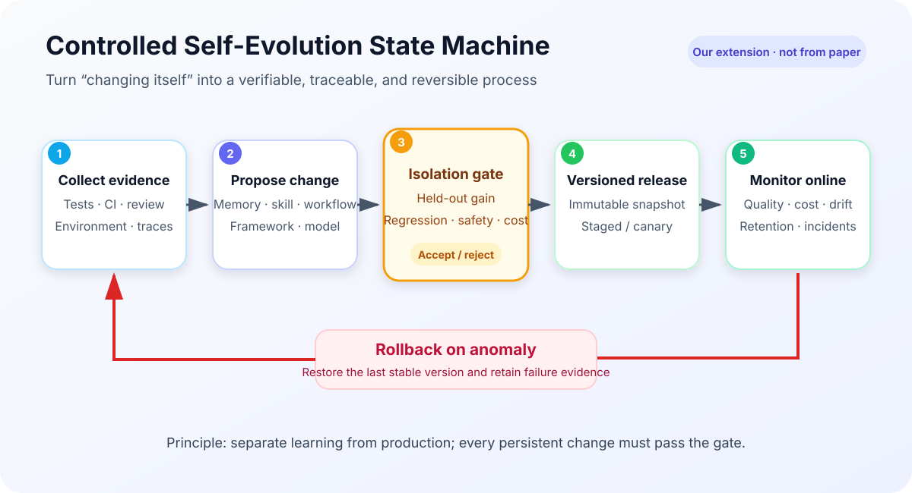
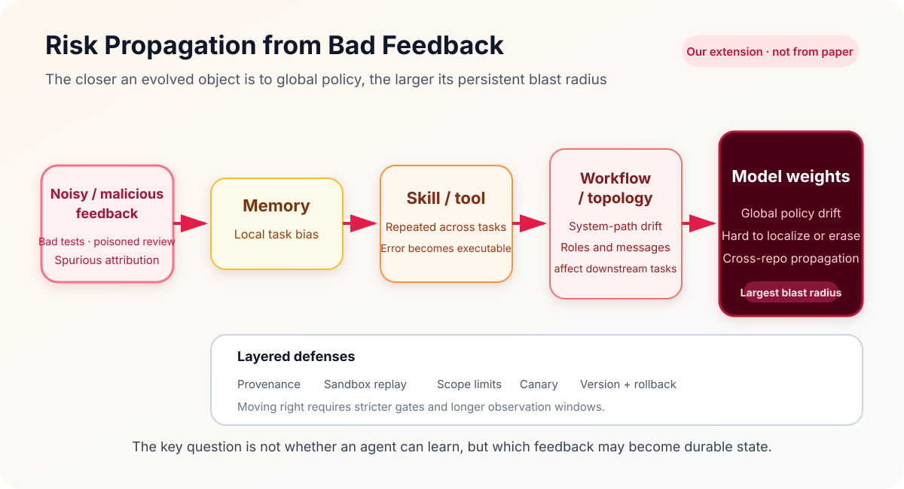

{width="78%" fig-align="center"}

*Paper: Hao Zhou, Haichuan Hu, Ye Shang, and Quanjun Zhang; Nanjing University of Science and Technology and Nanjing University; arXiv:2608.03392v1, August 4, 2026. Screenshot from the [v1 PDF](https://arxiv.org/pdf/2608.03392v1).*

This survey is not about making a coding agent retry more often. It asks a stricter question: **can an episode of software work alter the agent's durable state and produce a verifiable improvement on future tasks?** If a failure merely triggers another attempt inside the same context and all experience disappears when the task ends, the agent remains static. Self-evolution begins when the system makes reusable updates to its framework, memory, skills and tools, model, or workflow and topology.

> Paper: *[Self-Evolving Coding Agents](https://arxiv.org/abs/2608.03392v1)*  
> Resources: [Awesome Self-Evolving Coding Agents](https://github.com/zhouhao1024/Awesome-Self-Evolving-Coding-Agents) · [DOI](https://doi.org/10.48550/arXiv.2608.03392)

::: {.callout-warning title="Evidence boundary"}
This is a **guiding synthesis** of a rapidly changing area, not an empirical paper proposing one algorithm or a unified experimental protocol. Its taxonomy and tables organize heterogeneous systems whose datasets, base models, tool budgets, and success criteria differ, so reported numbers should not be compared directly. The sections below distinguish the survey's conclusions from our extensions. The linked WeChat article served only as a topic pointer; technical attributions come from the v1 paper and primary papers.
:::

## 1. Conceptual boundary: persistent adaptation, not one-off retry

The paper separates three neighboring concepts:

- A **coding agent** interprets requirements, explores repositories, edits multiple files, invokes shells, compilers, and test tools, diagnoses failures, and produces patches inside a software-engineering loop.
- A **self-evolving agent** updates its own components from prior interaction so that future behavior changes persistently, but its task domain need not be software engineering.
- A **self-evolving coding agent** operates over repositories and executable artifacts, using prior coding attempts and software-specific feedback to update its components over time.

{width="95%" fig-align="center"}

*Paper Figure 1: a self-evolving coding agent contains mutable frameworks, memory, skills and tools, models, and workflow or topology, and receives feedback from its coding environment. Source: [v1 PDF](https://arxiv.org/pdf/2608.03392v1).*

Software engineering is an unusually strong setting for this problem because its feedback can be **executable, localized, and reproducible**. Unit tests, compiler errors, runtime traces, lint findings, CI results, and code review provide more concrete evidence than free-form preference alone. Yet rich feedback is not necessarily correct feedback. Tests may be incomplete, environments may fail transiently, and reviews may be biased. Once such signals enter durable state, a one-off mistake can become a systematic bias.

{width="92%" fig-align="center"}

*Paper Table 1: differences in goals, environments, feedback, and update targets across the three concepts. Source: [v1 PDF](https://arxiv.org/pdf/2608.03392v1).*

A practical test has three parts:

1. **Does the change survive across tasks?** Experience remains after the current context ends.
2. **Does it alter future policy?** Later retrieval, tool use, collaboration, or generation differs because of the update.
3. **Is it independently validated?** The benefit reproduces on held-out tasks instead of merely memorizing the source problem.

## 2. A three-dimensional taxonomy: what, when, and from what evidence

The survey's main axis is a five-way taxonomy by the **object of evolution**. It adds two orthogonal views: when evolution happens and which evidence drives it. Together the axes specify what changed, when it changed, and which software signal justified the change.

{width="95%" fig-align="center"}

*Paper Figure 2: five primary evolution objects and representative mechanisms. These are analytical views rather than mutually exclusive bins; one system may update several objects. Source: [v1 PDF](https://arxiv.org/pdf/2608.03392v1).*

{width="95%" fig-align="center"}

{width="95%" fig-align="center"}

*Paper Table 2: representative systems mapped to evolution object, timing, evidence, mechanism, and evaluation. The page-wide table is split into two crops for web readability. Source: [v1 PDF](https://arxiv.org/pdf/2608.03392v1).*

The taxonomy matters less as a labeling scheme than as a map of **state scope and blast radius**. A memory item is often local. A skill can be reused across tasks. A workflow changes control paths among several roles. A model update may affect every repository and user. The more global the object, the stronger the evidence, regression coverage, and observation window should be before release.

## 3. Five objects of evolution

### 3.1 Framework: letting the agent rewrite its control logic

The framework layer includes prompts, control flow, tool interfaces, and runtime structure. Systems such as SICA, SIFT, and the Darwin Gödel Machine propose and evaluate changes to the agent implementation itself. This is the most literal form of a system improving the system: it can alter search, reflection, and tool-use policy, but a bad modification can also damage the entire executor.

{width="86%" fig-align="center"}

*The paper's definition of framework self-evolution. Source: [v1 PDF](https://arxiv.org/pdf/2608.03392v1).*

The decisive engineering question is not whether an agent can edit code. It is whether old and new versions are isolated, whether candidates are evaluated in a sandbox, and whether failure supports atomic rollback. Without those boundaries, a local benchmark gain can become a production incident.

### 3.2 Memory: compressing trajectories into retrievable experience

Memory evolution writes successful patches, failure traces, repository structure, and project conventions into long-term storage, then retrieves them for similar tasks. Systems such as SWE-Exp illustrate the route from experience extraction to future reuse. The hard problem is deciding what deserves to persist: raw traces preserve detail but are expensive, while summaries save context and can erase the conditions under which an attempt failed.

{width="86%" fig-align="center"}

*The paper's definition of memory self-evolution. Source: [v1 PDF](https://arxiv.org/pdf/2608.03392v1).*

Useful memory should carry its repository, commit, dependency environment, evidence type, confidence, and expiry. Otherwise, “once correct” becomes stale after APIs, dependencies, or code structure change. Memory systems therefore need deduplication, conflict handling, expiry, and revalidation—not unlimited append-only storage.

### 3.3 Skills and tools: turning experience into executable procedure

A skill is an invocable, composable unit of action. It is more procedural than memory: rather than only recording what happened, it encodes how to diagnose and act when a class of problems recurs. CODESKILL, GSkill, Socratic-SWE, and Live-SWE-Agent explore skill extraction, revision, composition, and tool generation.

{width="86%" fig-align="center"}

*The paper's definition of skill and tool self-evolution. Source: [v1 PDF](https://arxiv.org/pdf/2608.03392v1).*

The distinction can be stated compactly: **memory supplies context; a skill supplies executable policy**. Skills offer greater reuse but also repeat mistakes consistently. A releasable skill needs preconditions, scope, counterexamples, a version, and regression cases. Generated tools additionally require permission, file-scope, and network boundaries.

### 3.4 Model: writing interaction experience into parameters

Model evolution uses self-generated tasks, self-play, reinforcement learning, or verifier feedback to change policy parameters. Representative directions include Self-Play SWE-RL, Agent-RLVR, ReVeal, and CURE. Parameter updates can reduce reliance on external memory, but they have the highest cost and blast radius and can embed benchmark artifacts or flawed reward functions into global behavior.

{width="86%" fig-align="center"}

*The paper's definition of model self-evolution. Source: [v1 PDF](https://arxiv.org/pdf/2608.03392v1).*

Not every software-engineering post-training run is self-evolution. If an external party fixes the training set and the deployed agent has no interaction–feedback–update–interaction loop, the method is closer to conventional fine-tuning. Self-evolution requires the system to turn its own experience into training signal and return the updated policy to later interactions.

### 3.5 Workflow and topology: changing roles, edges, and coordination protocols

Multi-agent systems can evolve task decomposition, role definitions, message flow, edges, and scheduling order. SEW, AFlow, EvoAgentX, SEMAG, EvoMAC, and AgentConductor treat collaboration structure itself as an optimization object.

{width="86%" fig-align="center"}

*The paper's definition of workflow and topology self-evolution. Source: [v1 PDF](https://arxiv.org/pdf/2608.03392v1).*

These systems benefit from routing the right problem to the right role. As structures grow, however, it becomes difficult to tell whether a gain came from more calls, a stronger model, or better topology. Evaluation should report call count, parallelism, communication volume, end-to-end latency, and failure recovery alongside resolution rate.

## 4. Evolution timing and software evidence

### 4.1 Three evolution times

{width="88%" fig-align="center"}

*The paper's synthesis of evolution timing. Source: [v1 PDF](https://arxiv.org/pdf/2608.03392v1).*

- **Task-time** evolution reflects and reorganizes during one execution. Feedback is immediate, but a single accident can dominate the update.
- **Post-task** evolution aggregates a completed trajectory before updating. It supports filtering and review and is well suited to durable memory or skills.
- **Stage-wise** evolution batches experience for training or search. It costs more but uses more stable statistical evidence, making it appropriate for models and global workflows.

Timing and object should not be paired arbitrarily. Local memory may update frequently; skills should usually pass post-task validation; models and global topology should use staged, offline, versioned changes. The harder a change is to reverse, the less appropriate it is for a single online signal to trigger directly.

### 4.2 Three classes of evolution evidence

{width="88%" fig-align="center"}

*The paper's synthesis of evidence used for evolution. Source: [v1 PDF](https://arxiv.org/pdf/2608.03392v1).*

| Evidence | Typical signals | Strength | Main blind spot |
|---|---|---|---|
| Outcome-based | Tests pass, task resolved, patch accepted | Explicit and easy to automate | Explains the result poorly; tests may be incomplete |
| Environmental | Compiler errors, runtime logs, CI, dependency state, review | Software-specific and localizable | Noise, tool versions, and permissions alter the signal |
| Trajectory-derived | Tool-call sequences, failed branches, reflection, search paths | Extracts process strategy and counterexamples | Long traces and unstable attribution can turn accidents into rules |

Reliable evolution should combine evidence. A passing test is stronger when paired with static checks, incremental regression, code-diff review, and trajectory attribution. Otherwise an agent may obtain superficial success by deleting tests, hard-coding outputs, or bypassing constraints.

## 5. Evaluating whether the agent actually evolves

Many systems report resolved rate or pass rate on repository-level benchmarks such as SWE-bench. The survey argues that an evaluation of self-evolution must also cover the evolution process, cost, generalization, and long-term quality.

{width="88%" fig-align="center"}

*The paper's discussion of evolution process, cost efficiency, and generalization. Source: [v1 PDF](https://arxiv.org/pdf/2608.03392v1).*

A minimal measure of evolution gain is:

$$
\Delta_{\mathrm{evo}}
=
S(A_{t+1}; \mathcal{D}_{\mathrm{holdout}})
-
S(A_t; \mathcal{D}_{\mathrm{holdout}})
$$

The evaluation set must contain repositories or future time slices that did not participate in the update. A complete report should cover at least:

- **Capability gain:** resolution, patch correctness, code quality, and maintainability;
- **Evolution efficiency:** extra tokens, tool calls, wall-clock time, training compute, and human review;
- **Retention and regression:** whether old capabilities degrade and how long gains last;
- **Cross-domain generalization:** transfer across repositories, languages, dependency versions, and task types;
- **Safety and governance:** unauthorized actions, test gaming, feedback poisoning, and rollback success.

An essential baseline is **the same budget without persistent updates**. If an evolving system simply makes more model calls, its entire gain cannot be credited to evolution. Strong static prompting, retrieval augmentation, additional inference sampling, and genuinely persistent cross-task adaptation should be compared separately.

## 6. Our extension: from self-evolution to trustworthy evolution

The next two diagrams are engineering deductions from the survey's taxonomy, not figures from the paper. The central proposal is to prevent the learning loop from writing directly into the production loop. Every durable update should instead be treated as a controlled software release.

{width="94%" fig-align="center"}

*Our extension: a candidate enters versioned, staged release only after held-out, regression, safety, and cost gates; monitoring can trigger rollback.*

Each evolvable object should have a uniform change record: parent version, evidence provenance, scope, proposer, validation set, gains and regressions, release time, expiry condition, and rollback target. That record makes it possible to answer why the agent learned something, which signal caused a regression, and which tasks are affected.

{width="94%" fig-align="center"}

*Our extension: the same bad signal has a different potential scope depending on where it is persisted; gates should become stricter toward workflow and model updates.*

Trustworthy evolution can be reduced to six design principles:

1. **Trace evidence:** preserve origin, time, and environment version for every memory, skill, and training item.
2. **Gate updates:** replay in isolation and require functional, regression, safety, and cost checks.
3. **Version state:** use immutable snapshots with explicit parentage instead of unaudited in-place mutation.
4. **Stage releases:** shadow-evaluate first, canary on a narrow scope, and expand only after observation.
5. **Make failure reversible:** define monitoring thresholds and rollback targets before release.
6. **Expire knowledge:** revalidate memory and skills after repository, dependency, or tool changes.

## 7. Open problems and reading recommendations

{width="92%" fig-align="center"}

*The paper's discussion of reproducibility and contamination, feedback reliability and safety, and long-term memory maintenance. Source: [v1 PDF](https://arxiv.org/pdf/2608.03392v1).*

The most valuable next step is not another reflection prompt but a reproducible evolution protocol: fix the initial agent, publish task arrival order, separate update data from future-time holdouts, log every state transition, and compare static and evolving systems under the same total budget. Online systems must additionally address malicious feedback, poisoning of shared skill libraries, information leakage across users, and parameter changes that are difficult to erase.

Three audiences can enter the area at different levels:

1. **Beginner · difficulty: low:** use the three tests—cross-task persistence, future-policy change, and independent validation—to distinguish self-evolution from retry, then read representative work along the five object categories.
2. **Graduate researcher · difficulty: medium–high:** build a cross-repository, time-split holdout protocol that reports evolution gain, extra cost, forgetting, and safety regression together, and release the full state-change log.
3. **Faculty or research lead · difficulty: medium:** treat performance and evolution governance as joint objectives. Build evidence provenance, versioned state, canary deployment, and rollback before granting broader self-modification rights to models or multi-agent topology.

## 8. Takeaway

The survey's central shift is from a coding agent that starts each task from approximately zero durable experience to a long-lived system that accumulates software experience. Five evolution objects explain **what changes**, three timings explain **when it changes**, and three evidence classes explain **why a change is justified**.

The ceiling of self-evolution is determined not only by learning capability but also by governance. Tests, CI, and trajectories make software engineering a natural learning environment; they also allow bad feedback to be automated, amplified, and made permanent. A trustworthy self-evolving coding agent is not the system that rewrites itself most often. It is the one that can show why each change happened, what it improved, where it applies, and how to return safely when the judgment was wrong.

## References

- Hao Zhou, Haichuan Hu, Ye Shang, and Quanjun Zhang. *[Self-Evolving Coding Agents](https://arxiv.org/abs/2608.03392v1)*, 2026.
- Companion collection: *[Awesome Self-Evolving Coding Agents](https://github.com/zhouhao1024/Awesome-Self-Evolving-Coding-Agents)*.
- Supplementary reading: [WeChat article](https://mp.weixin.qq.com/s/hSrJLcZN3j7J7X02N2HIMg) (not used as evidence for technical claims).
