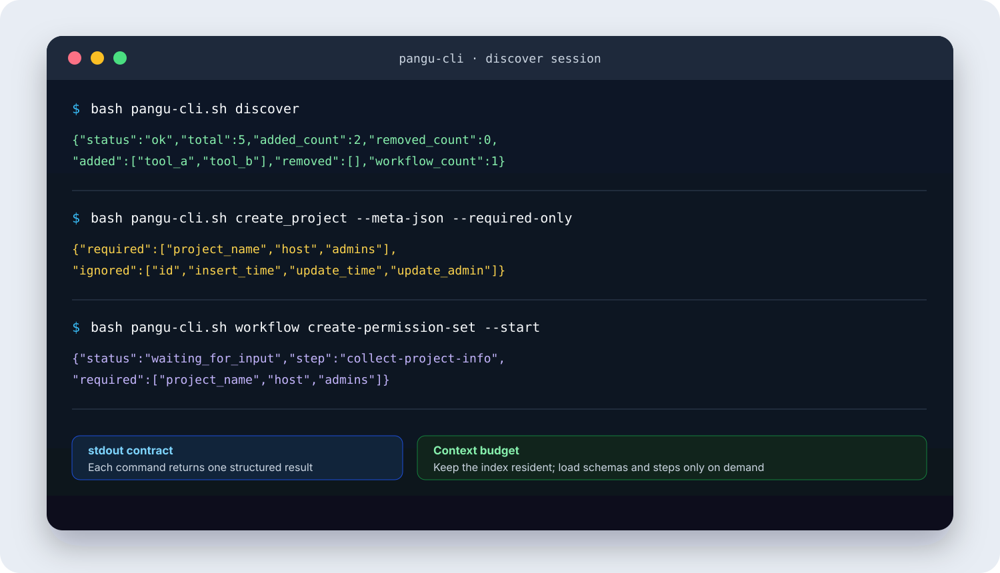
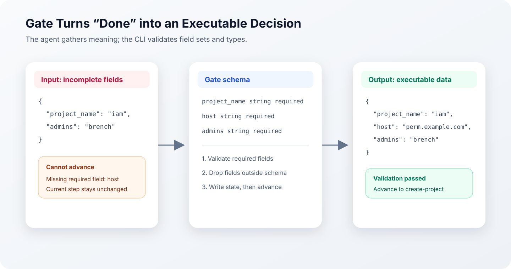
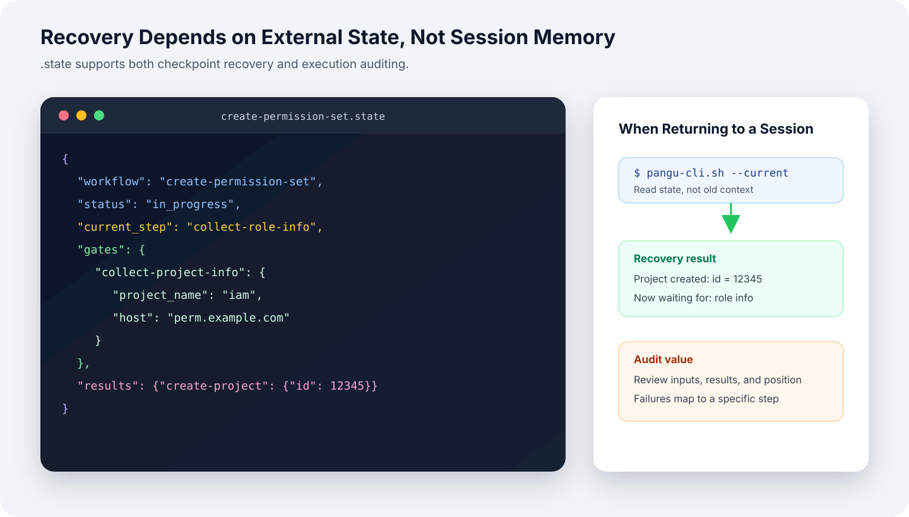
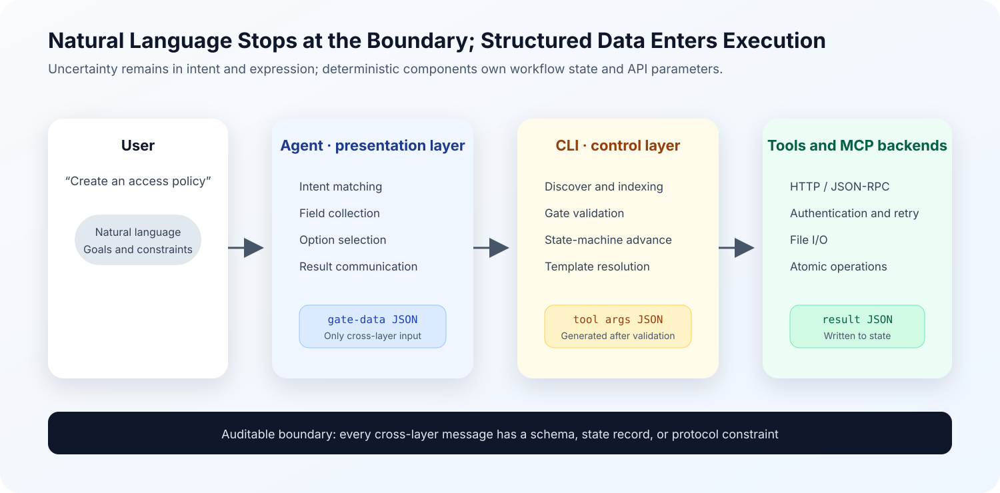

The problem I wanted to solve was not “how to write a stronger prompt.” It was a more specific engineering question: how can an agent execute reliably across multi-tool, multi-step tasks that may be interrupted, while keeping context consumption and debugging costs within acceptable limits?

The resulting design has three parts. A Skill describes the entry point and behavioral boundaries. A CLI takes over deterministic operations. A Workflow preserves process order and runtime state. The agent still interprets natural language, evaluates options, and composes responses, but it no longer maintains API parameters, step dependencies, or cross-session memory directly.

This design cannot turn a probabilistic model into a deterministic function in the mathematical sense. What it can do is narrow the region in which randomness matters. When identical inputs pass through schema validation, a state machine, and atomic tools, execution paths become easier to reproduce and failures become traceable to specific steps.


## 1. Problem Boundary: A Long Prompt Is Not a Reliable Execution System

The first implementation was straightforward: put the business rules, tool parameters, and operation order into one `SKILL.md`. Once the document grew to roughly 200 lines, the same failure patterns kept returning. The agent would skip confirmation, carry a field from one interface into another, or execute immediately while required parameters were still missing.

The prompt looked roughly like this:

> You are an assistant for a business platform. Use the CLI for operations; collect parameters from the user first; confirm before execution; validate a particular field against an allowlist before continuing...

Adding more instances of “must,” “do not,” and “always do X first” could patch one case temporarily. As the rule set grew, however, each individual rule received less attention. A change in context order or model version could cause the same underlying problem to reappear in a different form.

The cost was larger than one failed request. Consider “create a permission set.” If the agent first guesses the tool, then fills fields, then chooses another path after an error, the task may consume around five interaction rounds. With a pre-orchestrated flow, the target is to collect user input once and let the CLI perform the remaining steps continuously. This count comes from decomposing the flow, not from a formal benchmark, but it shows why conversation turns and tokens should be treated as engineering metrics.

A 128K context window describes how much input a model can receive. It does not mean every rule inside that input receives stable or equal attention. This observation does not explain every failure discussed here, but it is enough to show that placing an entire operations manual into context cannot substitute for process control.


After reviewing failed cases, I divided the work into two categories:

| Task type | Typical behavior | Better owner |
| --- | --- | --- |
| Semantic task | Interpret “create a project,” evaluate options, explain the result to the user | Agent |
| Deterministic task | Build an HTTP request, validate fields, write YAML, persist state | Program |

This changed the goal. Instead of requiring the agent to remember the entire process, the system should expose only the information needed for the decision at hand.

## 2. Responsibility Boundaries: The Agent Decides, the CLI Executes

The CLI began as a Bash script and gradually took ownership of API calls, data validation, file I/O, and state management. The agent and CLI exchange structured data only.

| Role | Agent | CLI |
| --- | --- | --- |
| Input | User language and the current-step instructions | JSON parameters and workflow state |
| Responsibility | Intent understanding, information gathering, option evaluation, result communication | API calls, schema validation, files, and state management |
| Output | CLI parameters or a user-facing response | A structured result and next-step instruction |
| Main source of uncertainty | Semantic interpretation and judgment | Constrained by code paths, protocols, and exit codes |


Take “create a project” as an example. The old path required the agent to construct the request itself, leading to missing headers, misspelled fields, and inconsistent authentication formats. The new path asks the agent to submit only a tool name and field values:

```text
tool: create_project
name: foo
host: bar.com
```

The CLI then validates the parameters, applies authentication, and sends the request. The point is not that Bash is smarter than an agent. Field mapping and protocol implementation simply do not require semantic reasoning.

This separation produced two immediate changes:

1. The agent no longer keeps every invocation detail resident in context.
2. A failed execution can be reproduced from its command, exit code, and structured output without replaying the entire natural-language reasoning process.

## 3. Context Management: From Complete Schemas to Progressive Disclosure

When there are only a few tools, putting their schemas in `SKILL.md` is usually harmless. As the tool count grows, however, complete schemas displace the task itself from context. Several common approaches have different tradeoffs:

| Approach | Implementation | Main problem |
| --- | --- | --- |
| Put everything in `SKILL.md` | Flatten tool descriptions and parameters into one document | Schemas occupy context permanently and rules interfere with one another |
| One reference per tool | Let the agent choose and read the relevant file | File selection and version judgment still belong to the agent |
| Expose every MCP schema | Let the host inject all tool definitions | Token cost becomes significant with many tools, with limited room for pruning |
| Maintain a separate tool index | Read a directory first, then load details | The index can drift from the actual schemas |

My implementation divides tool information into three layers:

| Layer | Content | When it enters agent context | Storage |
| --- | --- | --- | --- |
| Index | Tool name and one-line description | Visible after activation | `tools-index.md` |
| Metadata | Fields, types, required items, and enums | Loaded after a specific tool matches | `tools/<name>.meta` |
| Rules | `IGNORE`, `NOTE`, and `ENUM` | Merged by the CLI into metadata output | `tools/<name>.rules` |

A typical path looks like this:

```text
Skill activates
  → CLI discover synchronizes tools and workflows
  → Agent receives a compact index
  → User asks to “create a project”
  → Agent requests required metadata for create_project
  → CLI returns filtered field JSON
  → Agent gathers the fields and submits the operation
```

The agent does not have to guess which schema file to read. The index still grows linearly with the tool count, but full parameter documentation enters context only for the matched tool. This grows more slowly than full injection and is easier to measure and control.

## 4. Discover: Synchronizing Tools, Rules, and Workflows

Whenever the Skill activates, the CLI first runs:

```bash
bash pangu-cli.sh discover
```

The command obtains backend tools through MCP `tools/list`, compares them with the local cache, and updates the index. stdout contains one change summary only:

```json
{"status":"ok","total":5,"added_count":2,"removed_count":0,"added":["tool_a","tool_b"],"removed":[],"workflow_count":1}
```



The CLI performs more work internally:

1. Fetch the current tool list and determine additions and removals.
2. Generate an independent `.meta` file for each new tool.
3. Extract enumerations from parameter descriptions and write `ENUM` rules.
4. Identify system fields such as `id` and `update_time`, then generate `IGNORE` rules.
5. Scan `workflows/` and rebuild a unified index.

For example, the rules file for `create_project` may look like this:

```text
IGNORE:id
IGNORE:insert_time
IGNORE:update_time
IGNORE:update_admin
NOTE:host must be a valid domain on the allowlist
ENUM:auth_mode:0-pre-auth,1-SDK,2-openapi,3-not-integrated  #auto
```


The value is concrete: when the backend adds a tool, the Skill no longer needs a large prompt block to be updated in parallel. The agent also avoids reading all parameters before it needs a tool. Automatic rule extraction can handle fields with recognizable patterns; business semantics still require manually authored `NOTE` rules or validation logic.

## 5. Workflow: Turning Multiple Tool Calls into a Recoverable Process

Once individual tools are stable, composition becomes the remaining problem. Users rarely say, “call `create_project`, then call `create_role`.” They say, “help me set up a permission system.” That request involves step order, dependencies between results, user confirmations, and recovery after interruption.


A Workflow maps a high-level intent onto a predefined execution path:

```text
Create permission set
  → Collect project information
  → Create project
  → Collect role information
  → Create role
  → Present execution summary
```

The index produced by discover places Workflows before atomic tools. Matching follows the same priority: first look for a Workflow that covers the complete request, and fall back to an individual tool only when no Workflow matches. This prevents the agent from improvising an unverified multi-tool path.

### 5.1 The filesystem is part of the process definition

A Workflow is not hard-coded into the CLI. It is represented by a set of Markdown files:

```text
workflows/create-permission-set/
├── WorkFlow.md
└── references/
    ├── 01-collect-project-info.md
    ├── 02-create-project.md
    ├── 03-collect-role-info.md
    ├── 04-create-role.md
    └── 05-summary.md
```

`WorkFlow.md` stores the name and description. Step files declare their type, Gate, and automation in YAML front matter, while the body contains instructions for the agent. Filename prefixes determine execution order.

Adding a Workflow does not require changing `SKILL.md` or the core CLI logic. After a directory is placed under `workflows/`, the next discover run adds it to the index. Domain specialists still need to understand fields and dependencies, but they do not need to modify the state-machine internals.

### 5.2 Workflows and Skills have isomorphic structures

| Skill | Workflow |
| --- | --- |
| `SKILL.md` describes the capability entry point | `WorkFlow.md` describes the process entry point |
| `references/` stores staged guidance | `references/` stores step definitions |
| Triggered by the CLI | Started and advanced by the CLI |
| Enters discovery when activated | Enters the Workflow index during discover |

This structural similarity makes existing assets easier to migrate. A stable `permission-set-skill` can contribute its step documents to another Skill as a Workflow; a mature Workflow can also become a standalone Skill. Migration is not free: tool names, template paths, Gate fields, and authorization boundaries still need review. The business guidance, however, does not have to be rewritten from scratch.

### 5.3 Three constraints determine whether a Workflow is reliable

| Constraint | Result when it is not modeled explicitly | Mechanism |
| --- | --- | --- |
| Process order | Skipped, reordered, or omitted steps | Step files and a state machine |
| Data between steps | Lost or mixed fields and manual transcription errors | State and template variables |
| Interruption recovery | A new session must restart from the beginning | Persistent state and `--current` |

None of these problems is solved reliably by saying “follow the steps strictly.” They must be represented in data structures that can be validated.

### 5.4 Stepwise disclosure keeps only the current task in context

If all five steps are exposed at once, the agent must interpret the present action, future actions, and previous results simultaneously. My implementation keeps every step in a separate file and exposes only two progression commands:

- `--start`: create a run and return the first step.
- `--advance`: submit data for the current step, validate it in the CLI, and return the next step.


Completed-step data is written to state; future steps do not enter the current context. The CLI state machine owns global order, while the agent handles the immediate interaction or decision. Editing the process becomes local as well: add one file to add a step, or change filename prefixes to change the order.

### 5.5 Gate turns completion conditions into a schema

“Collect basic information” is an open-ended instruction to an agent. It may omit a required item or include a field the backend does not accept. Every interactive step therefore declares a Gate:

```yaml
---
id: collect-project-info
type: interactive
gate:
  schema:
    project_name: { type: string, required: true, desc: "Project name" }
    host: { type: string, required: true, desc: "Service domain" }
    admins: { type: string, required: true, desc: "Administrator RTX" }
---
```

The agent submits fields through `--advance --gate-data '{...}'`. The CLI performs three checks in order:

1. Reject progression when a required field is missing and return the missing items.
2. Discard fields that are not declared in the schema.
3. After validation succeeds, write the data to state and enter the next step.



A Gate does not make the agent smarter. It gives “complete” a definition that a program can evaluate. The agent may phrase its questions in different ways, but submitted data must satisfy the same schema.

### 5.6 Persistent state makes recovery independent of session context

After an IDE closes, a network connection drops, or the model changes, a new agent session should not infer progress from the old conversation. The CLI writes each run to a `.state` file containing at least:

- The current step and overall status.
- Gate data submitted by each interactive step.
- Results from each automated step.
- Completed, active, or aborted status markers.

When the user returns, `--current` returns recovery information directly. The new session needs only the current step, a summary of completed results, and fields that remain to be collected.




State also provides basic auditing: the input used for a run, the tool result, and the step where failure occurred can all be inspected. If a state file contains sensitive fields, redaction, access control, and retention policies must be addressed separately. Persistence does not solve those security problems by itself.

### 5.7 Template variables let the CLI carry data between steps

`create-project` needs the `project_name` and `host` collected by the previous step. The agent should not copy these values from the conversation. The automated step declares the mapping instead:

```yaml
---
id: create-project
type: automated
automation:
  tool: create_project
  input_mapping:
    name: "{{gate.collect-project-info.project_name}}"
    host: "{{gate.collect-project-info.host}}"
---
```

The system currently supports two reference forms:

- `{{gate.<step-id>.<field>}}` reads input from an earlier interactive step.
- `{{result.<step-id>.<path>}}` reads a tool result from an earlier automated step.

The CLI reads values from state, resolves the template, and invokes the tool. The agent neither remembers field provenance nor sees intermediate parameters for automated steps. A validator should catch invalid template paths before a Workflow is published; otherwise, the error is merely deferred until runtime.

### 5.8 Step types and control handoffs

A Workflow uses three step types:

| Type | Purpose | Executor |
| --- | --- | --- |
| `interactive` | Gather information, select an option, or confirm | Agent and user |
| `automated` | Invoke a tool for an atomic operation | CLI |
| `notification` | Present a stage result or final summary | Agent |

After the agent submits Gate data, the CLI can execute several automated steps continuously. Control returns only when the flow reaches another interactive or notification step:

```text
Agent submits project_name and host
  → CLI validates the Gate
  → Resolve create_project arguments
  → Invoke the tool and write its result
  → If the next step is also automated, continue
  → Return new instructions when an interactive step is reached
```


This removes meaningless conversational round trips. Continuous automated execution also increases the impact of a single operation. Workflows that delete data, incur charges, send messages, or change permissions should insert explicit confirmation points instead of relying on one general chaining policy.

### 5.9 Why process definitions use Markdown files

File-based definitions provide four main benefits:

- Business guidance, Gate configuration, and automation can be reviewed in the same step file.
- A Git diff shows the exact step that changed.
- A step can be copied into another Workflow and then have its field mappings reviewed.
- Ordering is visible, because the directory itself expresses the process skeleton.

There are costs. If filenames carry logic, renaming can change execution order. As cross-step references grow, a static validator becomes mandatory. Markdown is convenient for process definitions, but the format does not make those definitions correct automatically.

## 6. Bootstrapping: Generating Process Definitions with workflow-creator

Once runtime execution became stable, creating Workflows by hand became the next repetitive task: create directories, write front matter, design Gates, configure automation, and validate template references. This work also has fixed steps and explicit formats, so I built `workflow-creator`.

The same responsibility boundary still applies:

- The agent analyzes the business request, decomposes steps, selects their types, and designs the data flow.
- A companion CLI generates and validates files through `init`, `add-step`, and `validate`.

```text
Requirement description
  → Agent designs steps and fields
  → workflow-creator CLI generates files
  → Validator checks structure and references
  → Runtime CLI executes the Workflow
```

This creates a bootstrapping chain, but “generated successfully” does not mean “correct for the business.” Authorization boundaries, confirmation for dangerous operations, field semantics, and rollback policies still require review by someone who understands the domain.

## 7. System View: Which Layer Contains the Uncertainty?

The full system can be divided into three responsibility layers:

1. The presentation layer belongs to the agent and handles intent, information gathering, judgment, and expression.
2. The control layer lives inside the CLI and handles discover, Gates, step progression, template resolution, and the state machine.
3. The execution layer handles MCP, HTTP, file I/O, authentication, retries, and exit codes.

The MCP backend is an external service, not part of the three internal layers. The agent and CLI communicate through JSON; the CLI reaches the backend through JSON-RPC or a concrete protocol.

The current implementation places control and execution in the same `pangu-cli.sh`. The control responsibility covers discover, the state machine, and data flow; the execution responsibility covers atomic tool calls. They share one deployment entry point, but they must remain conceptually separate. Otherwise, orchestration and protocol details become coupled again.



The critical boundary is not whether the system “has an agent.” It is where natural language ends. Data entering the control layer should already be structured and schema-validated. The agent may explain tool results before showing them to the user, but raw results and runtime state must remain available.

## 8. Applicability and Unresolved Problems

This architecture has a real cost. Several task types usually do not need a complete Workflow:

| Scenario | Simpler implementation |
| --- | --- |
| One-shot question or query | A short `SKILL.md` or direct tool call |
| No more than two steps and no recovery requirement | State the order clearly inside the Skill |
| Prototype validation | Prove the tool and requirement first, then decide whether to add a state machine |
| Pure knowledge question | Do not add an execution layer |

The engineering signal is easy to recognize. When a prompt repeatedly says “always do this first,” “do not skip,” or “must happen before that step,” natural language is already simulating a state machine. At that point, order, completion conditions, and state should move into code or structured definitions.

Several parts of the current design still need independent validation:

- Whether discover produces false positives when inferring `IGNORE` and `ENUM`, and how manual rules override automatic rules.
- Retry idempotency, compensating operations, and human takeover after an automated step fails.
- Encryption, redaction, authorization, and lifecycle management for sensitive fields inside `.state`.
- Migration of in-flight state after a Workflow version changes.
- Retrieval quality and token-cost measurement as the tool index continues to grow.

These questions matter because they determine whether the design can move beyond a demo. The next evaluation should record task completion rate, average interaction rounds, tool-call failure rate, recovery success rate, and context tokens—not merely compare whether one version “feels more stable.”

## Conclusion

The core of this Skill engineering design is to migrate operational constraints out of the prompt one by one. Field requirements become Gates. Step order becomes a state machine. Cross-step dependencies become template references. Cross-session memory becomes state. Tool discovery becomes a CLI synchronization operation.

The agent remains the semantic part of the system. It has not been replaced, nor has it become deterministic. The change is at the execution boundary. When a process is validatable, state is recoverable, and results are traceable, differences in phrasing or judgment no longer imply that the entire task is out of control.

That is closer to what I mean by “treating an agent as an algorithm” than extending a 200-line prompt yet again.
