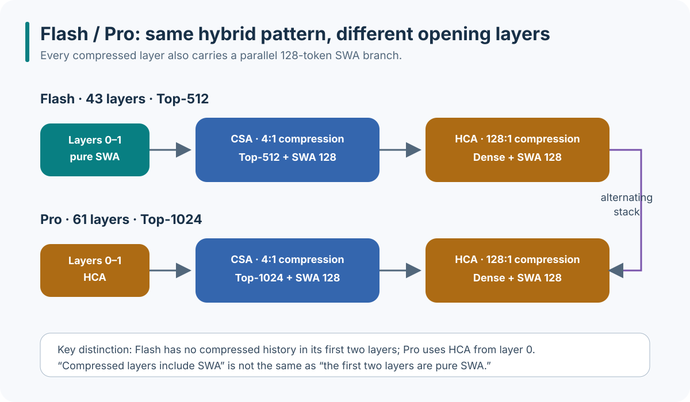
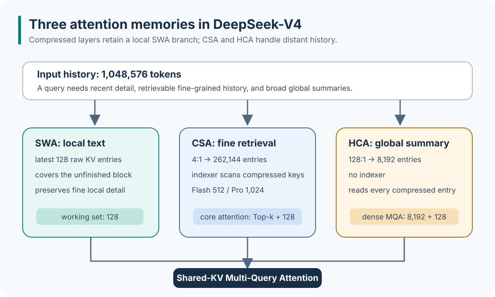
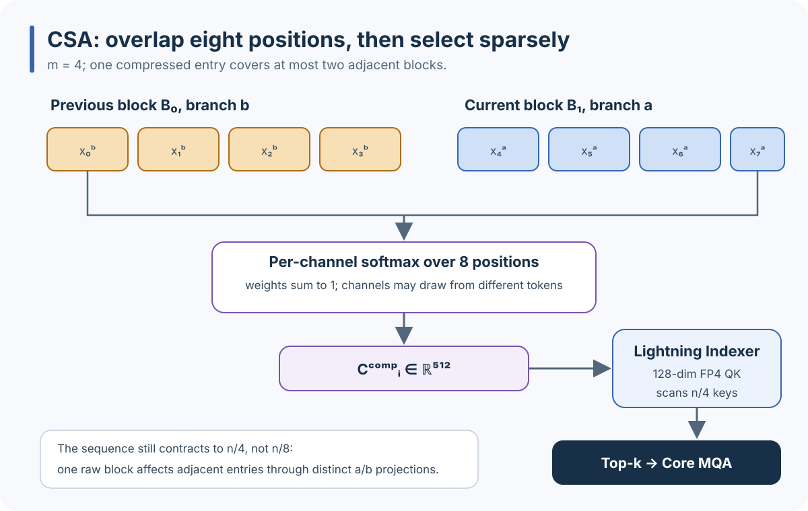
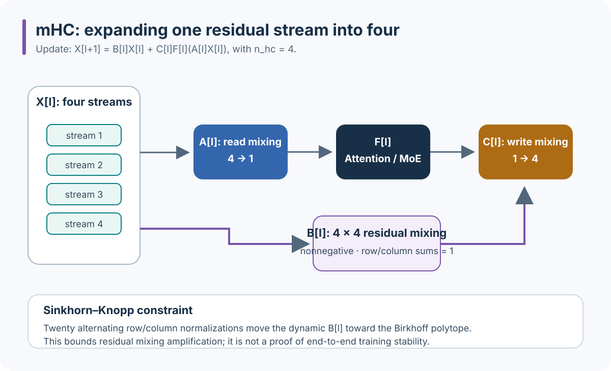
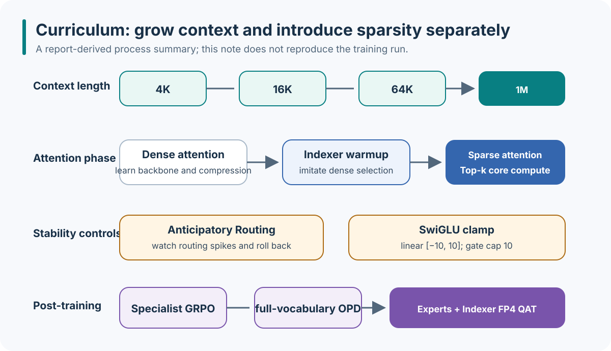

<style>
@media (max-width: 480px) {
  html,
  body {
    max-width: 100vw;
    overflow-x: clip;
  }

  #quarto-content,
  #quarto-document-content {
    min-width: 0;
    max-width: 100%;
  }

  mjx-container[display="true"] {
    display: block;
    max-width: 100%;
    overflow-x: auto;
    overflow-y: hidden;
  }
}
</style>

{fig-alt="DeepSeek-V4 report title Towards Highly Efficient Million-Token Context Intelligence and author DeepSeek-AI" width="82%"}

## Summary and central argument

DeepSeek-V4 does not apply one sparse-attention scheme to every layer. It coordinates three memory granularities: SWA preserves the latest 128 uncompressed tokens; CSA compresses history by four and lets a low-cost indexer select a small subset; HCA compresses history by 128 and applies dense attention to every summary. Local text, retrievable history, and a global overview therefore coexist.

The compute boundary is equally important. CSA's indexer still scans $n/4$ compressed keys, but it uses a 128-dimensional, 64-head low-precision path. The expensive core attention reads only the Top-k history plus 128 local KV entries. HCA performs no retrieval, but it sees only $n/128$ summaries. “Million-token attention” is implemented as a hierarchy of working sets with different precision, compression ratios, and access patterns.

::: {.callout-note title="Evidence scope"}
The factual sources are the [DeepSeek-V4 Technical Report](https://arxiv.org/abs/2606.19348) and the official [DeepSeek-V4-Pro inference implementation](https://huggingface.co/deepseek-ai/DeepSeek-V4-Pro/blob/b5968e9190ef611bbf34a7229255be88a0e937c1/inference/model.py) pinned at revision `b5968e9`. Numerical consequences derived from the formulas are identified as calculations in this note. This note does not reproduce pretraining, post-training, or the report's evaluations, and the inference code is not a complete training implementation.
:::

## Architecture and configurations

V4-Flash and V4-Pro use the same main components: hybrid CSA/HCA, DeepSeekMoE, four-stream mHC residual paths, and one MTP module. Their main differences are scale, Top-k, and the opening attention layers.

| Configuration | DeepSeek-V4-Flash | DeepSeek-V4-Pro |
| --- | ---: | ---: |
| Total / active parameters per token | 284B / 13B | 1.6T / 49B |
| Transformer layers | 43 | 61 |
| Hidden dimension | 4,096 | 7,168 |
| Attention heads | 64 | 128 |
| First two layers | pure SWA | HCA |
| Later attention layout | alternating CSA / HCA | alternating CSA / HCA |
| CSA compression / Top-k | 4:1 / 512 | 4:1 / 1,024 |
| HCA compression | 128:1 | 128:1 |
| Indexer | 64 heads × 128 dim, FP4 QK | 64 heads × 128 dim, FP4 QK |
| SWA window | 128 | 128 |
| Routed / shared experts | 256 / 1 | 384 / 1 |
| Active routed experts per token | 6 | 6 |
| mHC width / Sinkhorn iterations | 4 / 20 | 4 / 20 |
| MTP depth | 1 | 1 |

{fig-alt="DeepSeek-V4 architecture with mHC mixing, CSA or HCA, DeepSeekMoE, prediction head, and MTP modules" width="90%"}

{fig-alt="Flash begins with two pure SWA layers, Pro begins with two HCA layers, and both then alternate CSA and HCA" width="96%"}

Two statements are easy to conflate: **every compressed layer includes a local SWA branch**, but only Flash begins with **two pure SWA layers**. Pro uses HCA from layer 0, with a 128-token SWA branch running beside it.

## Why compress the KV cache

Standard single-head self-attention is:

$$
Q = HW_Q,
\qquad
K = HW_K,
\qquad
V = HW_V
$$

$$
\mathrm{Attention}(Q,K,V)
=
\mathrm{softmax}\left(\frac{QK^\top}{\sqrt{d_h}}\right)V
$$

Prefilling a sequence of length $n$ constructs an $n \times n$ correlation matrix. During autoregressive decoding, every new token reads the preceding $n$ KV entries. If every layer and KV head stores uncompressed history, both the cache and per-step reads grow linearly with $n$, making memory bandwidth dominant at one million tokens.

V4 does not ask one compressor to preserve every type of information. It separates the working set into three levels:

{fig-alt="A million-token history becomes 128 local SWA entries, 262144 retrievable CSA entries, and 8192 densely attended HCA summaries" width="96%"}

Taking 1M specifically as $2^{20}=1{,}048{,}576$ gives:

$$
n/4 = 262{,}144,
\qquad
n/128 = 8{,}192
$$

CSA's core attention reads $512+128=640$ entries in Flash or $1{,}024+128=1{,}152$ in Pro. HCA reads $8{,}192+128=8{,}320$ entries. CSA first performs a full scan over 262,144 low-dimensional compressed keys, so Top-k must not be read as making the whole layer independent of sequence length.

{fig-alt="Paper-reported single-token FLOPs and KV cache curves comparing DeepSeek-V4 Pro and Flash with DeepSeek-V3.2" width="62%"}

Figure 1 reports that at one million tokens, Pro and Flash use 3.7× and 9.8× fewer single-token FLOPs than V3.2, while their accumulated KV caches are 9.5× and 13.7× smaller. These are the report's internal model comparisons, not independent benchmarks in this note.

## CSA: overlap compression followed by sparse retrieval

{fig-alt="CSA consists of a token-level compressor, Lightning Indexer, Top-k selector, SWA entries, and shared key-value multi-query attention" width="96%"}

### Two-branch overlap compression

Let the hidden states be $H\in\mathbb{R}^{n\times d}$. The compressor produces two sets of content vectors and weight logits:

$$
C^a,C^b,Z^a,Z^b
\in
\mathbb{R}^{n\times c}
$$

For compressed entry $i$, CSA combines the previous block's $b$ branch with the current block's $a$ branch. Each block has $m=4$ positions, so every channel $j$ is normalized independently across $2m=8$ positions:

$$
\alpha_{i,:,j}
=
\mathrm{softmax}\left(
\left[
Z^b_{(i-1)m:im,j};
Z^a_{im:(i+1)m,j}
\right]
\right)
\in
\mathbb{R}^{8}
$$

$$
C^{\mathrm{comp}}_{i,j}
=
\sum_{r=1}^{m}
\alpha_{i,r,j}C^b_{(i-1)m+r,j}
+
\sum_{r=1}^{m}
\alpha_{i,m+r,j}C^a_{im+r,j}
$$

The output has shape $C^{\mathrm{comp}}\in\mathbb{R}^{(n/m)\times c}$. Eight positions form the receptive field of one compressed entry; the output length remains $n/4$, not $n/8$. The $a/b$ projections of one original block affect adjacent compressed entries, which creates the overlap.

For one channel, suppose positive unnormalized weights are $[1,2,1,2,4,2,1,3]$. Their normalized values are:

$$
\alpha
=
\frac{1}{16}
[1,2,1,2,4,2,1,3]
$$

This channel emphasizes the fifth position. Another channel receives another eight-dimensional distribution. CSA does not compress a whole vector with one shared token-weight vector; each channel extracts different information from the same eight positions.

{fig-alt="The previous block's b branch and current block's a branch form an eight-position receptive field, each channel is normalized independently, and the indexer selects Top-k entries" width="96%"}

### Lightning Indexer: cheap scan, expensive compute only for Top-k

For the current query, the indexer produces 64 low-dimensional heads of width 128 and corresponding index keys for compressed history. Its score can be summarized as:

$$
s_{t,i}
=
\sum_{h=1}^{64}
w_{t,h}
\mathrm{ReLU}\left(
\left\langle q^I_{t,h},k^I_{i,h}\right\rangle
\right)
$$

Here $i$ ranges over $n/4$ compressed history entries and $w_{t,h}$ is a query-dependent head weight. The index QK path uses FP4 to compute all $s_{t,i}$ at relatively low cost before taking Top-k: 512 for Flash and 1,024 for Pro.

The core attention uses high-dimensional queries and concatenates selected compressed entries with the latest 128 uncompressed KV entries. It is shared-KV MQA: one compressed representation serves as shared K and V while groups of query heads read the same history. The outputs are then aggregated by group and projected back to model width. The low-dimensional indexer decides “where to look”; the high-dimensional attention decides “what to retrieve.”

Storage precision is also split. The report keeps RoPE-related dimensions in BF16 and the remaining compressed representation in FP8; FP4 is used for the indexer's QK path. “FP4 indexer” does not mean the full attention computation is FP4.

## HCA: heavy compression followed by dense reading

{fig-alt="HCA compresses 128 tokens into one KV entry, concatenates summaries with SWA entries, and applies shared key-value multi-query attention" width="96%"}

HCA reuses the compressor idea with non-overlapping blocks of $m'=128$. For block $i$ and channel $j$:

$$
\beta_{i,:,j}
=
\mathrm{softmax}\left(
Z_{im':(i+1)m',j}
\right)
\in
\mathbb{R}^{128}
$$

$$
C^{\mathrm{hca}}_{i,j}
=
\sum_{r=1}^{m'}
\beta_{i,r,j}C_{im'+r,j},
\qquad
C^{\mathrm{hca}}
\in
\mathbb{R}^{(n/128)\times c}
$$

Because only $n/128$ compressed entries remain, HCA needs no indexer. It applies dense MQA to all summaries and concatenates them with the 128-token SWA branch. It trades token-level granularity for reliable global coverage.

| Dimension | CSA | HCA |
| --- | --- | --- |
| Compression | overlapping adjacent branches | non-overlapping single blocks |
| Compression ratio | 4:1 | 128:1 |
| History entries at 1M | 262,144 | 8,192 |
| Remote-history access | full index scan, then Top-k | every compressed entry |
| Core-attention working set | Top-k + 128 SWA | 8,192 + 128 SWA |
| Information granularity | finer, suitable for exact retrieval | coarser, continuous global coverage |
| Main extra cost | low-dimensional index scan and Top-k | dense MQA over summaries |

CSA and HCA do not replace each other. CSA preserves detail but reads only a small candidate set. HCA lowers granularity but cannot miss a summary through retrieval. Alternating layers lets the model exchange these two information types repeatedly.

## SWA, RoPE, RMSNorm, and the attention sink

Every CSA/HCA layer has a parallel SWA branch with a 128-token window. This branch both retains nearby dependencies and covers the newest tokens before they complete a compression block. Compressed history and local text are therefore complementary.

V4 applies RoPE only to the final 64 dimensions of each attention head, leaving the remaining dimensions as non-rotated content. After core attention, the implementation applies inverse RoPE to that output slice before grouped output projection. Partial RoPE reduces the share of content channels occupied by positional rotation, while the inverse path moves the output back into the coordinate system expected by the projection.

RMSNorm appears around queries, compressed representations, and several projections:

$$
\mathrm{RMSNorm}(x)
=
\frac{x}{\sqrt{\mathrm{mean}(x^2)+\epsilon}}
\odot g
$$

Attention also includes a sink logit that is not stored in the KV cache. For regular logits $z_1,\ldots,z_L$ and sink $z_s$, a real token receives:

$$
p_i
=
\frac{\exp(z_i)}
{\exp(z_s)+\sum_{j=1}^{L}\exp(z_j)}
$$

The sink absorbs probability mass that the model does not want to assign to any history token, without introducing a persistent dummy cache entry.

## Reading the official source path

The following non-runnable pseudocode is organized from the pinned `model.py`. It omits distributed communication, cache layout, quantized kernels, and shape plumbing to expose only the `Compressor → Indexer → Attention → Block` path:

```python
class Compressor:
    def forward(hidden, ratio):
        content_a, logits_a = project_a(hidden)
        if ratio == 4:                         # CSA overlap
            content_b, logits_b = project_b(hidden)
            values = concat(previous_b, current_a, axis = "token")
            weights = softmax(concat(logits_b, logits_a), axis = "2m")
        else:                                  # HCA, ratio = 128
            values = reshape_blocks(content_a, block = ratio)
            weights = softmax(reshape_blocks(logits_a), axis = "m")
        return sum(weights * values, axis = "block")

class Indexer:
    def forward(query_hidden, history_hidden):
        index_keys = compressor(history_hidden, ratio = 4)
        scores = weighted_sum(relu(fp4_qk(query_hidden, index_keys)), heads = 64)
        return topk(scores, k = 1024)           # Pro; Flash uses 512

class Attention:
    def forward(hidden, cache):
        local_kv = cache.last(128)
        compressed_kv = compressor(cache.hidden, ratio = layer_ratio)
        if layer_ratio == 4:
            selected_kv = gather(compressed_kv, indexer(hidden, cache.hidden))
        else:
            selected_kv = compressed_kv        # HCA reads all summaries
        memory = concat(local_kv, selected_kv, axis = "sequence")
        output = shared_kv_mqa(partial_rope(query(hidden)), memory, attention_sink)
        return grouped_output_projection(inverse_rope(output))

class Block:
    def forward(x):
        x, residual = hc_pre(x, sublayer = "attention")
        x = attention(x)
        x = hc_post(x, residual, sublayer = "attention")
        x, residual = hc_pre(x, sublayer = "moe")
        x = moe(x)
        return hc_post(x, residual, sublayer = "moe")
```

The same `Compressor` supports both attention compression and indexer compression. `Attention` chooses a layer ratio of 4, 128, or 0 from configuration. `Block.hc_pre/hc_post` runs once around Attention and once around MoE. The pinned code establishes the inference data flow and configuration; it does not reveal training losses, warmup schedules, or the distributed trainer.

## mHC: four residual streams under a doubly stochastic constraint

A conventional residual block is:

$$
x_{l+1}=x_l+F_l(x_l)
$$

mHC expands one state into $n_{hc}=4$ residual streams and updates them as:

$$
X_{l+1}
=
B_lX_l
+
C_lF_l(A_lX_l)
$$

$A_l$ mixes four streams into the sublayer input, $C_l$ writes the sublayer output back into four streams, and $B_l$ controls how old residual state moves across streams. V4 constrains $B_l$ to be nonnegative and doubly stochastic:

$$
B_{l,ij}\geq 0,
\qquad
B_l\mathbf{1}=\mathbf{1},
\qquad
B_l^\top\mathbf{1}=\mathbf{1}
$$

A doubly stochastic matrix lies in the Birkhoff polytope and can be expressed as a convex combination of permutation matrices, giving $\lVert B_l\rVert_2\leq 1$. $A_l$ and $C_l$ also receive nonnegativity and magnitude constraints. The code constructs $B_l$ with 20 Sinkhorn–Knopp row/column normalization iterations, and the mixing parameters are generated dynamically from the current hidden state.

{fig-alt="Four residual streams are read by A into Attention or MoE, C writes the result back, and doubly stochastic B mixes the old residual state" width="96%"}

This bounds amplification by the residual mixer itself; it is not a mathematical proof that the full training process is stable. Attention, MoE, optimization, and low-precision error remain outside that bound.

## Training: only what is needed to understand the architecture

{fig-alt="Context grows from 4K to 16K, 64K, and 1M; attention moves from dense through indexer warmup to sparse; post-training uses specialist GRPO, OPD, and FP4 QAT" width="96%"}

Most pretraining parameters use Muon; embeddings, prediction heads, and RMSNorm parameters use AdamW. Context expands as $4\mathrm{K}\rightarrow16\mathrm{K}\rightarrow64\mathrm{K}\rightarrow1\mathrm{M}$. Flash keeps dense attention for its first 1T tokens, warms the indexer against dense-attention selections, and switches to sparse attention at the 64K stage; Pro retains a longer dense phase. This sequence separates learning representations from learning which candidates to discard, avoiding an untrained indexer cutting off useful history from the outset.

Two engineering controls target stability. Anticipatory Routing watches for MoE routing spikes and rolls back around anomalies. SwiGLU clamps the linear branch to $[-10,10]$ and caps the gate branch at 10. They are controls used in the reported training run, not isolated causal ablations.

Post-training first builds domain specialists and improves them with GRPO. More than ten teachers are then merged through full-vocabulary on-policy distillation (OPD), using reverse KL across the entire vocabulary. Before deployment, experts and indexer QK receive FP4 QAT. The indexer constructs candidates with twice the target Top-k, and the report states a 99.7% recall of the target Top-k; this remains a paper-reported result.

## Assessment and evidence boundaries

V4's main trade-off fits in three lines: CSA preserves “details that can be located,” HCA preserves “an overview that is always visible,” and SWA preserves “immediate text that cannot wait for compression.” mHC addresses a separate axis by limiting amplification across residual streams as model scale and low-precision paths grow.

Four boundaries remain:

1. The official `model.py` is an inference reference, not the full training pipeline. Muon schedules, indexer warmup, Anticipatory Routing, GRPO, and OPD can only be interpreted from the technical report.
2. This note does not reproduce the reported FLOPs, KV cache, long-context capability, or 99.7% indexer recall. Those numbers retain the label “reported by the paper.”
3. A nominal one-million-token window shows that the model and serving system accept that length; it does not imply effective use of every token on every task. Compression, position distribution, and evaluation design still determine effective context.
4. CSA limits expensive core attention to Top-k, but its indexer still scans $n/4$ keys at low cost. It reduces constants and high-dimensional compute rather than making end-to-end reading strictly constant-time.

## References

- DeepSeek-AI. [DeepSeek-V4 Technical Report](https://arxiv.org/abs/2606.19348), 2026.
- DeepSeek-AI. [DeepSeek-V4-Pro `inference/model.py`, revision `b5968e9`](https://huggingface.co/deepseek-ai/DeepSeek-V4-Pro/blob/b5968e9190ef611bbf34a7229255be88a0e937c1/inference/model.py).
- DeepSeek-AI. [DeepSeek-V4-Pro `inference/config.json`, revision `b5968e9`](https://huggingface.co/deepseek-ai/DeepSeek-V4-Pro/blob/b5968e9190ef611bbf34a7229255be88a0e937c1/inference/config.json).
- DeepSeek-AI. [DeepSeek-V4-Flash-0731 configuration, revision `7872f01`](https://huggingface.co/deepseek-ai/DeepSeek-V4-Flash-0731/blob/7872f01b1d1fe23eabc4c98b48bffcef5a386062/config.json).
