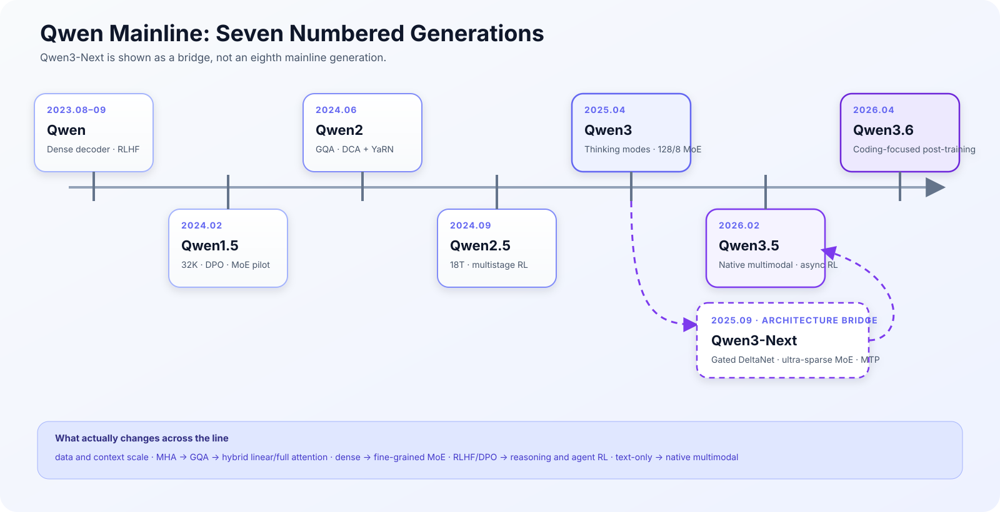
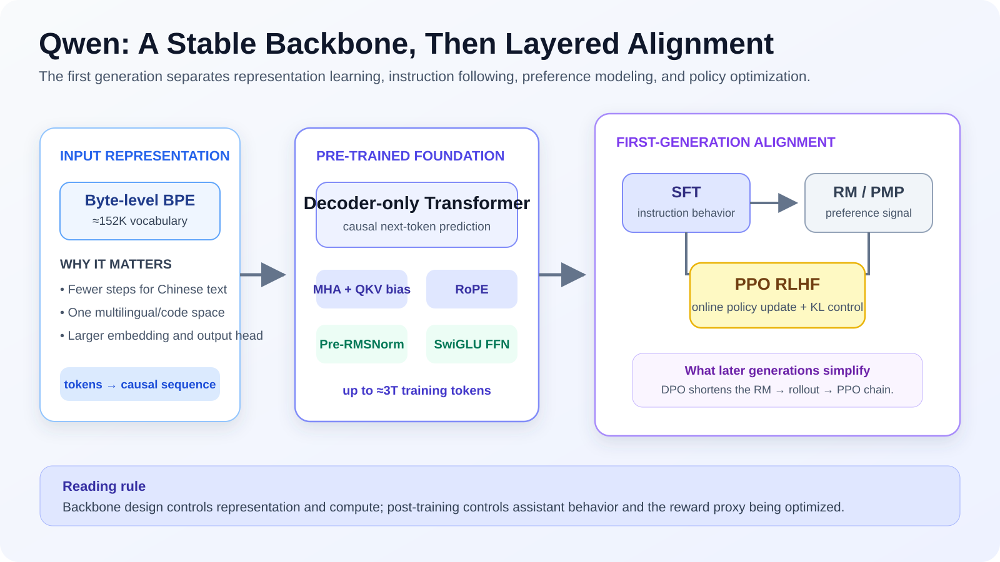
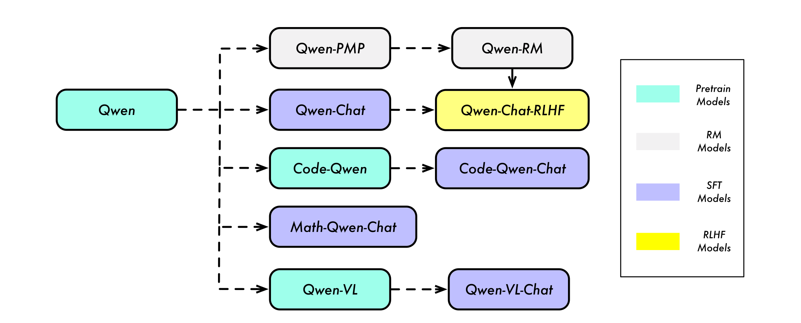
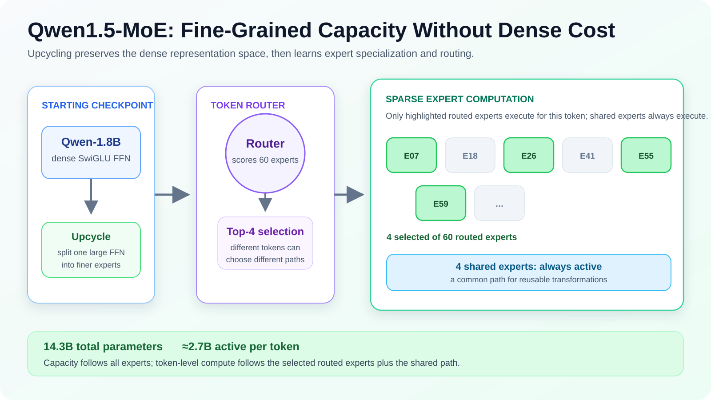
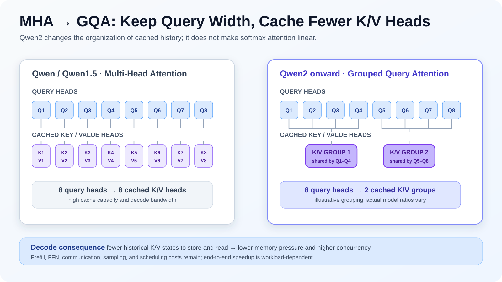
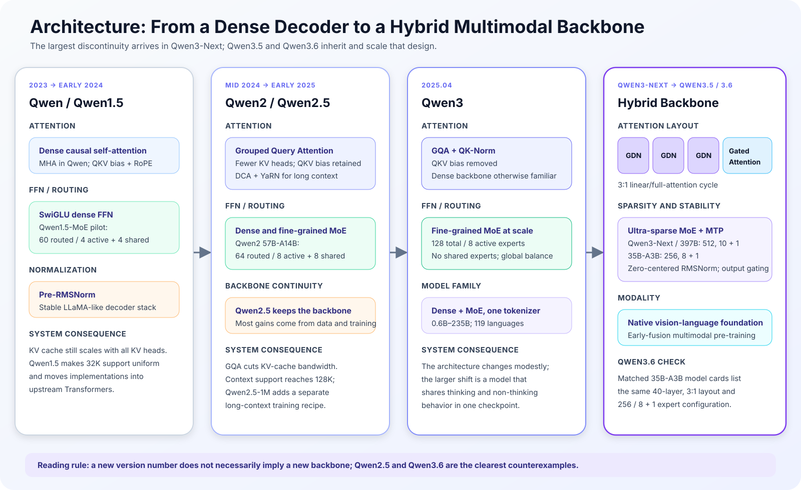
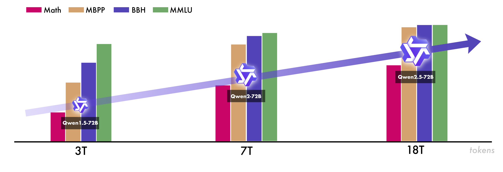
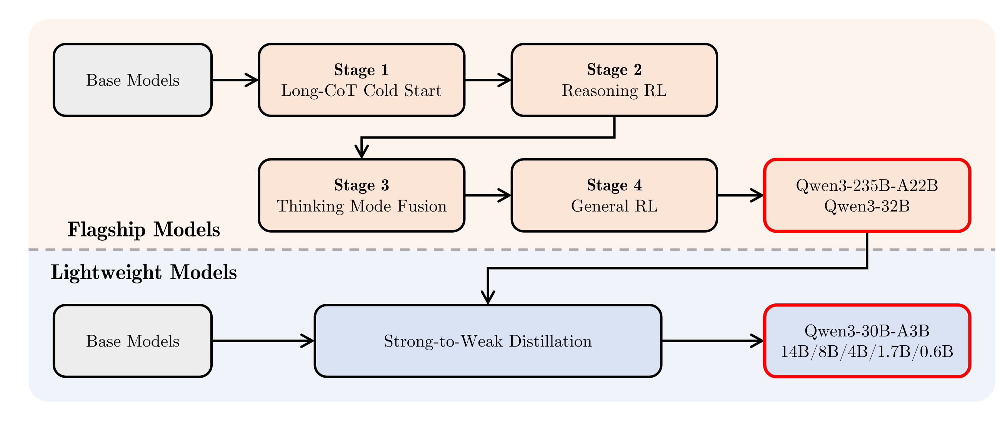
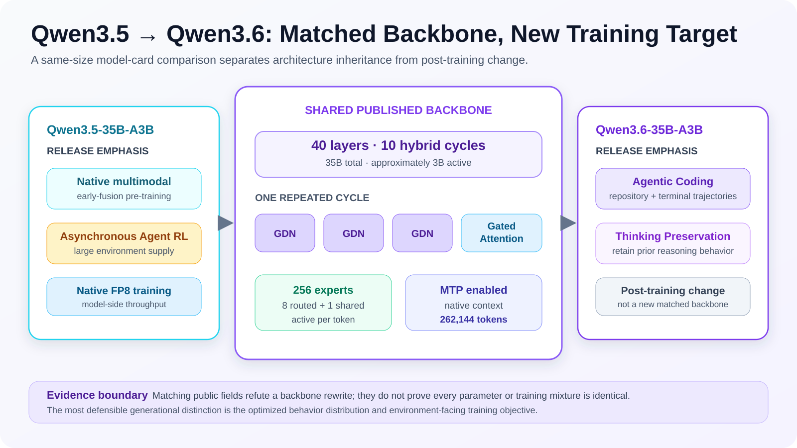
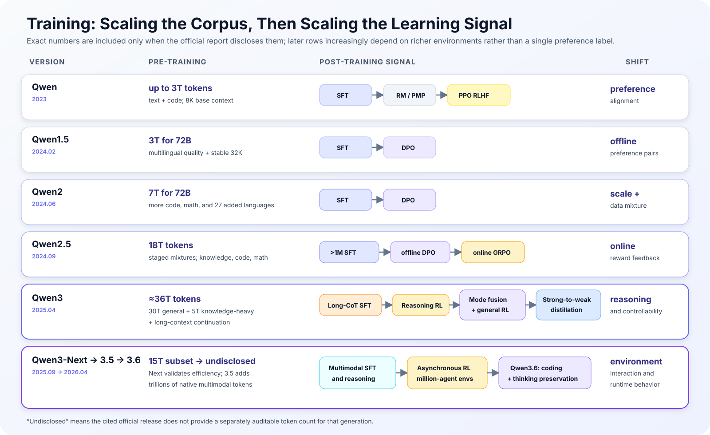

## Abstract

The rising version numbers between Qwen in 2023 and Qwen3.6 in 2026 do not describe seven successive backbone rewrites. The official mainline contains seven generations: Qwen, Qwen1.5, Qwen2, Qwen2.5, Qwen3, Qwen3.5, and Qwen3.6. Qwen3-Next is not counted as an eighth. Its purpose was to expose and validate a next-generation architecture between Qwen3 and Qwen3.5: Gated DeltaNet, a 3:1 hybrid attention pattern, ultra-sparse MoE, Zero-Centered RMSNorm, and Multi-Token Prediction (MTP). Those mechanisms subsequently became the structural foundation of Qwen3.5 and Qwen3.6.[^qwen3next]

The lineage has two broad phases. From Qwen through Qwen2.5, the engineering problem was to scale, lengthen, and sparsify a stable decoder-only Transformer. The tokenizer and multilingual corpus expanded; MHA became GQA; DCA and YaRN supported longer contexts; fine-grained MoE moved from a pilot into a regular model family. Representative pre-training budgets grew from roughly 3T to 18T tokens, while post-training moved from an SFT–reward model–PPO stack toward large-scale SFT, DPO, and online reinforcement learning. After Qwen3, the emphasis shifted to controlled reasoning, efficient long-sequence inference, native visual-language learning, and interaction with executable environments. QK-Norm, four-stage reasoning post-training, strong-to-weak distillation, hybrid linear/full attention, native multimodal pre-training, and asynchronous agent RL entered the mainline in that order.[^qwen][^qwen2][^qwen25][^qwen3][^qwen35card]

Two distinctions organize the analysis. Training tokens, context length, and expert count are different forms of scale: they affect information exposure, visible state, and per-token computation respectively. A new version is also not necessarily a new architecture. Qwen2.5 derived most of its gains from data and training, while the published Qwen3.6-35B-A3B backbone fields match the same-size Qwen3.5 model field by field. Qwen3.6 is primarily an agentic-coding and thinking-preservation post-training release on that inherited backbone.[^qwen25][^qwen35card][^qwen36card]

## 1. Counting Seven Generations and Setting the Evidence Boundary

### 1.1 Why the answer is seven, not eight

This note counts a generation when an official numbered release defines a public mainline family. That rule yields seven nodes:

1. **Qwen** established the general base, Chat, and RLHF branches.
2. **Qwen1.5** was presented as a beta of Qwen2, but shipped a complete size range, uniform 32K support, and a formal MoE experiment.
3. **Qwen2** established GQA, long-context mechanisms, and parallel dense/MoE product lines.
4. **Qwen2.5** retained the backbone while scaling data, long-context training, and post-training.
5. **Qwen3** combined thinking and non-thinking behavior, revised the MoE layout, and formalized reasoning post-training.
6. **Qwen3.5** adopted the Qwen3-Next hybrid backbone and moved to native vision-language and agent training.
7. **Qwen3.6** kept the same-size Qwen3.5 structure and concentrated on coding agents and reasoning retention.

The name Qwen3-Next makes an eight-generation reading tempting, but the official release argues against it. It describes a *next-generation architecture* on the path to Qwen3.5 and releases an 80B-A3B checkpoint to test long-context throughput, ultra-sparse MoE, and stability. It did not replace the complete Qwen3 family. Representing it as a bridge preserves the genuine architectural discontinuity without turning an architectural preview into a full product generation.[^qwen3next]

{fig-alt="Timeline of Qwen, Qwen1.5, Qwen2, Qwen2.5, Qwen3, Qwen3.5, and Qwen3.6, with Qwen3-Next shown as an architectural bridge"}

### 1.2 Source hierarchy and rules for numerical claims

The evidence comes from four types of first-party material, ordered by auditability:

- **Technical reports** establish architectures, data stages, training objectives, and author-reported ablations.
- **Official model cards and configs** establish layer counts, expert layouts, context limits, and inference controls.
- **Official research posts** supplement system designs, release intent, and engineering measurements that are not in papers.
- **Official repositories** establish model families, runtime parameters, and implementation entry points; README leaderboards are not treated as controlled experiments.

An exact number appears only when an official source gives it. “Approximately 36T” means that Qwen3 reports a 30T first stage, a 5T knowledge-intensive second stage, and a long-context continuation without compressing the final stage into one exact total. “Undisclosed” means the cited release does not provide a separately auditable generation-level count. It does not mean no training took place. Context figures are likewise separated into native training windows, supported model-card windows, and extension settings such as YaRN.

Official benchmarks are used only for local checks, not cross-generation causal attribution. Model size, prompt template, thinking mode, context settings, and benchmark revision all change outcomes. This note therefore relies more heavily on configurations, training pipelines, and size-matched comparisons than on a composite release leaderboard.

A final distinction is equally important. Matching field names in a community config do not prove matching training. Successful loading in an inference framework does not prove that the framework reproduces every training-time operator. A throughput ratio without sequence length, batch size, precision, and parallelism cannot be transferred to another cluster. Here, a matching config can refute a claimed backbone rewrite, and a changed training objective can explain the direction of a release, but neither is used to infer a benchmark delta by itself.

| Mainline generation | Backbone change | Representative disclosed pre-training budget | Post-training path | Most defensible source of gains |
|---|---|---:|---|---|
| Qwen | MHA, RoPE, RMSNorm, SwiGLU, QKV bias | Up to roughly 3T | SFT, RM/PMP, PPO | General base model and human-preference alignment |
| Qwen1.5 | Backbone continuity; first formal MoE validation | 3T for 72B in a later retrospective | SFT, DPO; PPO retained in parts of the release | 32K, deployment standardization, MoE pilot |
| Qwen2 | GQA, DCA+YaRN; dense and MoE lines | 7T for 72B | SFT, DPO | KV cost and a stronger multilingual/code/math mixture |
| Qwen2.5 | Largely retains Qwen2 | 18T | Million-scale SFT, offline DPO, online GRPO | Data quality, long-context training, post-training |
| Qwen3 | Removes QKV bias, adds QK-Norm; 128/8 MoE | Approximately 36T | Four-stage reasoning post-training and distillation | Reasoning and controllable thinking |
| Qwen3.5 | 3:1 GDN/attention, ultra-sparse MoE, MTP, native multimodality | No auditable total disclosed | Multimodal SFT and asynchronous agent RL | Inference efficiency, vision-language learning, environment interaction |
| Qwen3.6 | Same-size configs retain Qwen3.5 backbone | Undisclosed | Agentic coding and thinking preservation | Post-training and runtime behavior |

## 2. Qwen: Establishing a Stable Decoder-Only Baseline

The first Qwen generation did not depend on an unfamiliar sequence architecture. It assembled a scalable decoder-only Transformer from causal self-attention, RoPE, pre-RMSNorm, and SwiGLU. Attention remained MHA, and the Q, K, and V projections retained bias terms. A byte-level BPE tokenizer used a vocabulary of roughly 152K tokens to accommodate Chinese, multilingual text, and code in one system.[^qwen]

That choice established the stable part of the next several generations. Decoder-only computation, RoPE, RMSNorm, and SwiGLU survived multiple version changes. The moving parts were the organization of K/V heads, normalization details, whether routed experts replaced a dense FFN, the composition of the corpus, and the form of the learning signal. A list of Transformer modules therefore gives an incomplete account of the lineage.

The larger vocabulary also reallocates compute. Fewer tokens may represent the same Chinese passage, putting more semantic content in a fixed sequence and reducing autoregressive decoding steps. The cost is a larger embedding and output projection, plus more softmax memory traffic. Vocabulary size alone does not produce multilingual ability: rare tokens still learn poor representations without enough observations. The benefit comes from jointly designing the tokenizer, multilingual mixture, code corpus, and filtering pipeline. Reusing that tokenizer family also reduced migration costs across later checkpoints.

The largest first-generation models were trained on approximately 3T tokens drawn from web pages, books, code, and other sources after quality filtering, deduplication, and mixing. Three trillion training tokens do not correspond to three trillion independent facts. Duplication, domain ratios, language coverage, and stage sampling determine the effective information content. Qwen2.5 later visualized the 3T, 7T, and 18T budgets of Qwen1.5-72B, Qwen2-72B, and Qwen2.5-72B, making the early lineage visibly a data-engineering curve.[^qwen25]

The reports disclose source classes and a general cleaning process, not a sample-level reproducible corpus. It is therefore reasonable to state that the data were multi-source, filtered, and deduplicated. It is not reasonable to invent exact source percentages or claim a reproduction of the private mixture. For closed training corpora, the auditable unit is the published pipeline and its ablations, not a reconstructed list of documents.

Post-training followed the then-standard three-part RLHF stack. Instruction and conversation data first produced an SFT model. Preference data then trained reward or process-aware preference models. PPO finally updated the Chat policy. This separated “behaves like an assistant” from “receives a higher preference score,” but required a reward model, online rollouts, a reference policy, and a stable policy-optimization system. DPO in later releases shortened this chain.

The reward model could only express distinctions present in its preference data. If annotators favored a concise but unchecked answer, the policy could learn a stylistic proxy for quality. A KL constraint limited sudden drift from SFT but did not make the reward correct. Mathematics and code later moved toward executable verifiers because an answer checker or test suite can provide a harder signal than general preference. Agent RL would place that verifier inside an environment, gaining richer feedback while introducing reward hacking and environment leakage.

{fig-alt="Diagram of first-generation Qwen training with a roughly 152K-token BBPE vocabulary, MHA and RoPE backbone components, SFT, reward or process-aware preference modeling, and PPO RLHF"}

{fig-alt="The Qwen technical report model lineage showing Qwen, Qwen-Chat, Qwen-RM, Qwen-Chat-RLHF, Code-Qwen, Math-Qwen-Chat, and Qwen-VL"}

The figure records one more important fact. Code, mathematics, visual language, and reward modeling were already present in the first-generation program, but they occupied separate branches. Qwen3.5 did not mark the first time Qwen processed an image. It moved vision-language learning from a specialized branch into the foundation model’s early pre-training. “A family contains a vision model” and “the shared backbone is natively multimodal” are different claims.

## 3. Qwen1.5: Deployment Standardization and the First Fine-Grained MoE Validation

Qwen1.5 was officially described as a beta of Qwen2, but it did more than rename a checkpoint. It extended 32K context across the complete 0.5B-to-72B family and entered the upstream Hugging Face Transformers implementation without requiring `trust_remote_code`. The first change made document, retrieval, and agent-state workloads available to small checkpoints. The second reduced execution differences among training, quantization, and inference tools.[^qwen15]

Upstream support matters for evidence as well as convenience. Remote model code can hide positional scaling, cache layouts, stopping rules, and chat-template behavior in a repository. Two backends may silently execute different semantics. A standard implementation makes version pinning and module-aware quantization easier. It does not raise the theoretical capability of the weights, but it reduces the chance of mistaking an implementation difference for a model difference. Qwen1.5 is therefore a genuine generation in product engineering even though its dense backbone remained familiar.

The public Qwen1.5-Instruct cards list SFT and DPO as the main post-training route, while the release discussion retained PPO in parts of the broader program. DPO directly optimizes the relative likelihood of chosen and rejected responses instead of first learning a scalar reward and then running online policy optimization. It does not remove preference-data bias, but it materially reduces the number of coupled systems in the first-generation RM–PPO chain.

Qwen1.5-MoE was the more consequential architectural experiment. It contained 14.3B total parameters and activated about 2.7B per token. Each routing layer used 60 routed experts, selected four, and also passed every token through four shared experts. The team upcycled a Qwen-1.8B dense checkpoint, splitting its FFN into finer experts and continuing training.[^qwen15moe]

Three mechanisms should be kept separate:

1. **Fine-grained experts** divide a large FFN into smaller units that the router can combine.
2. **Shared experts** provide a universal path so that common transforms need not be redundantly learned by every routed expert.
3. **Sparse activation** separates capacity, which follows total parameters, from per-token computation, which is closer to active parameters.

Upcycling made Qwen1.5-MoE a useful bridge experiment. Starting every expert from random initialization would confound architecture, corpus, training length, and initialization. Splitting an already converged dense FFN preserved its attention and representation spaces while continued training focused on routing and specialization. The initial experts were correspondingly similar and needed data and routing noise to differentiate. The result validates one workable path; it does not show that upcycling dominates from-scratch MoE training at every scale.

The experiment did not immediately turn the full line into MoE. Its narrower question was whether a model with roughly 2.7B active parameters could exploit a 14.3B capacity and whether routing remained stable. Qwen2-57B-A14B retained the routed-plus-shared pattern, showing that the pilot had entered the regular architecture.

{fig-alt="Qwen1.5-MoE routing diagram showing upcycling from a Qwen-1.8B dense FFN, top-four selection among sixty routed experts, four shared experts, 14.3B total parameters, and about 2.7B active parameters"}

## 4. Qwen2: GQA, Long Context, and a Stable Dense/MoE Split

The clearest dense-backbone change in Qwen2 was the move from MHA to Grouped Query Attention (GQA). MHA stores independent K/V states for every query head; GQA lets several query heads share fewer K/V heads. During autoregressive decoding, every historical K/V state must remain cached. Cache capacity and read bandwidth therefore depend more directly on the number of KV heads than the number of query heads. GQA does not make attention linear, but it reduces KV Cache pressure in long-context and high-concurrency serving.[^qwen2]

The benefit differs between prefill and decode. Prefill processes an input block and is relatively compute-heavy. Decode emits one token while reading all historical K/V states and is more easily limited by memory bandwidth. GQA therefore has a particularly direct effect on decode memory and concurrency. End-to-end throughput will not rise exactly in proportion to the KV-head reduction because embeddings, FFNs, communication, sampling, and scheduling remain. “Reduces KV Cache” is a more precise claim than a generic “accelerates inference.”

Long context required more than GQA. Qwen2 combined Dual Chunk Attention (DCA) with YaRN. DCA structures interactions among local, neighboring, and more distant chunks, while YaRN changes RoPE frequency scaling for positions beyond the original training length. These are training and extrapolation mechanisms, not a guarantee that a model understands an arbitrary long document. Retrieval accuracy, cross-section reasoning, peak memory, and time to first token remain separate measurements.

DCA and YaRN also address different failure modes. A positional method can remain numerically stable beyond the training window while the model still lacks long-document examples from which to learn evidence aggregation. A model can retrieve from a moderate window while full-attention cache costs make deployment uneconomical. Introducing both mechanisms made “long-context support” a joint model-quality and systems-cost problem from Qwen2 onward.

{fig-alt="Side-by-side MHA and GQA diagram: MHA caches an independent key and value head for every query head, while GQA shares fewer KV groups among multiple query heads to reduce decode memory and bandwidth"}

Qwen2 retained RoPE, RMSNorm, SwiGLU, and QKV bias and released both dense and MoE checkpoints. Qwen2-57B-A14B used 64 routed experts, selected eight per token, and added eight shared experts. Relative to Qwen1.5-MoE, it slightly raised total routed experts and doubled selected routed experts. Relative to Qwen3, it still relied on a substantial shared path. MoE evolution was not a monotonic expert-count race; it repeatedly rebalanced expert granularity, shared capacity, activation cost, and load balancing.[^qwen2]

One pre-training number did not cover all sizes. The report gives approximately 7T tokens for Qwen2-72B, 4.5T for Qwen2-57B-A14B, and 12T for the 0.5B model. A small model receiving more tokens is not contradictory: more data can improve capability per parameter while remaining cheaper than training a large model on the same number of tokens. Qwen2 also increased code, mathematics, and multilingual data and added 27 languages. Those mixture changes matter as much as the headline 7T.

Post-training centered on high-quality SFT and DPO. The chain was shorter than Qwen’s PPO RLHF and less elaborate than Qwen2.5’s million-scale SFT plus online GRPO. Qwen2 is therefore a clean boundary: the backbone reduced KV costs, the corpus expanded code/math/multilingual capability, and DPO simplified preference optimization.

{fig-alt="Four-column diagram comparing attention, MoE, normalization, and modality in Qwen and Qwen1.5, Qwen2 and Qwen2.5, Qwen3, and Qwen3-Next through Qwen3.5 and Qwen3.6"}

## 5. Qwen2.5: Holding the Backbone Fixed While Scaling Data and Post-Training

Qwen2.5 is the first decisive counterexample to the idea that a new version implies a new backbone. Its report states that it largely retains the Qwen2 decoder-only design: GQA, RoPE, RMSNorm, SwiGLU, and QKV bias remain. The major changes are a larger and better-structured corpus, longer sequences, and stronger post-training.[^qwen25]

The pre-training corpus grew from 7T tokens for Qwen2-72B to 18T for Qwen2.5-72B, with more high-quality web data, code, mathematics, synthetic data, and structured knowledge. Figure 1 of the report aligns Qwen1.5-72B, Qwen2-72B, and Qwen2.5-72B with 3T, 7T, and 18T. It establishes that the public training budgets expanded and that several task scores increased alongside them. It does not establish that the extra 11T tokens alone caused every gain: filtering, mixture, hyperparameters, and post-training changed at the same time.

{fig-alt="Qwen2.5 report data-scaling figure mapping Qwen1.5-72B, Qwen2-72B, and Qwen2.5-72B to 3T, 7T, and 18T tokens"}

Long-context work moved from positional extrapolation toward genuinely long training data. Qwen2.5 staged pre-training sequence length up to 32,768 and mixed real long documents with synthetic long sequences. Public checkpoints generally supported 128K; Qwen2.5-1M was a separate continuation and inference recipe. One million tokens should therefore be treated as a specialized variant, not the native label for every Qwen2.5 checkpoint.

A long-sequence curriculum has a less visible cost. Under a fixed token budget, longer examples reduce the number of independent documents and tasks. Concatenating unrelated pages increases length without teaching a useful cross-section dependency, while manually constructing every long sample is expensive. The mixed real/synthetic strategy sought both natural structure and controllable dependencies. Evaluation should distinguish finding one fact in a large context, synthesizing several pieces of evidence, and executing dozens of dependent actions.

Post-training expanded by an order of magnitude. The report discloses more than one million SFT samples across instruction following, mathematics, code, long context, structured output, and system-prompt behavior. Offline DPO then used a stable preference dataset, while online GRPO sampled from the current policy and obtained reward feedback. Offline pairs are cheap and reproducible but become stale as the policy changes. Online trajectories expose current errors but require rollout, verification, and distributed-training infrastructure. Their combination turned post-training from one alignment step into a staged capability program.[^qwen25]

The value of million-scale SFT does not come from replicating similar question-answer pairs. Code needs execution, mathematics needs essential derivations, JSON needs syntax constraints, and system instructions must persist across turns. Mixing these objectives creates gradient competition, making sampling weights and stage order part of the recipe. The report discloses categories and scale but not the complete dataset or every mixing weight. It supports a claim of broader post-training coverage, not an inference about average sample quality from “one million” alone.

Qwen2.5’s stable backbone makes the training variables easier to interpret. Data size, mixture, sequence length, and post-training scale are more credible explanations of the difference from Qwen2 than an attention module that did not change.

## 6. Qwen3: Turning Reasoning Training into a Formal Pipeline

Qwen3 made small but deliberate changes to the dense backbone. It retained GQA, RoPE, RMSNorm, and SwiGLU, removed QKV bias, and added QK-Norm. Normalizing Q and K before the attention dot product controls their scale and reduces the risk of runaway attention logits at larger training scales. Removing bias simplifies the projections. These are stability choices rather than a new attention paradigm.[^qwen3]

The MoE design changed more substantially. Representative Qwen3 MoE models used 128 experts, selected eight per token, removed shared experts, and applied global batch-level load balancing. Compared with Qwen2’s 64 routed, eight active, and eight shared experts, fixed shared capacity was reallocated to a larger routed pool. This increased expert combinations but made common knowledge more dependent on routing and balance. The `A` in Qwen3-235B-A22B and Qwen3-30B-A3B denotes active parameters; total parameters should not be read as dense per-token computation.[^qwen3]

Pre-training used approximately 36T tokens in purposeful stages. Roughly 30T established general, multilingual, and base capabilities. About 5T then raised knowledge density and the proportion of STEM, code, and reasoning. A final long-context continuation extended sequence length from 32K to 128K. Later tokens were therefore not interchangeable with early tokens. They came from costlier and more targeted mixtures. The report also expanded coverage to 119 languages and dialects, another variable hidden by a single total.[^qwen3]

The main generational change was post-training. Flagship models passed through four stages:

1. **Long-CoT Cold Start** used curated long reasoning traces to put the base policy in a usable reasoning regime before RL.
2. **Reasoning RL** optimized mathematics, code, and logic against verifiable outcomes rather than teacher text alone.
3. **Thinking Mode Fusion** merged long-reasoning behavior with non-thinking instruction data in one checkpoint.
4. **General RL** repaired instruction following, formatting, preference, and general interaction after reasoning specialization.

The order supplies a plausible causal chain. Cold start reduces the exploration burden of discovering a stable long-CoT format. Reasoning RL increases the probability of successful trajectories. Mode fusion reconciles two behavior distributions. General RL restores user-facing behavior that a reasoning-only objective may degrade. The report does not prove that this is the unique best order for every task, but it shows that curriculum order has become part of the post-training algorithm.

Verifiable reward is still not ground truth. A mathematics parser can reject an equivalent form, tests can be incomplete, and a templated logic task can leak its label. Reasoning RL improves success under a verifier. General reasoning claims still require cross-template checks, contamination analysis, and human review. The Qwen3 report supports the full pipeline with multiple benchmarks, but no single score isolates the exact contribution of cold start, RL, or mode fusion.

{fig-alt="Qwen3 post-training diagram showing Long-CoT Cold Start, Reasoning RL, Thinking Mode Fusion, General RL, and Strong-to-Weak Distillation"}

Smaller checkpoints did not each repeat the complete flagship exploration. The 32B and 235B-A22B models served as teachers for 30B-A3B, 14B, 8B, 4B, 1.7B, and 0.6B students. The report says this strong-to-weak route required roughly one tenth of the GPU hours of directly training the smaller models under its conditions. That is a system measurement, not a universal distillation constant. The broader mechanism is more important: expensive exploration became concentrated in a few flagships, then transferred across the family.[^qwen3]

Thinking and non-thinking coexistence also requires more than a prompt switch. A model optimized only for long CoT can overthink simple requests, increasing latency and damaging direct answers. General alignment alone can shorten the reasoning distribution. Mode Fusion and General RL explicitly address that conflict and make “whether and how long to think” a trained behavior inside one checkpoint.

## 7. Qwen3-Next: The Real Architectural Break, but Not an Eighth Generation

Qwen3-Next replaced a uniform self-attention stack with a 3:1 hybrid cycle: three Gated DeltaNet (GDN) layers followed by one Gated Attention layer. GDN is a gated linear-attention or recurrent-state mechanism. It does not require every layer to retain and reread a full KV Cache over a long sequence. Periodic full attention restores high-capacity content addressing. The design does not claim that linear attention universally replaces softmax attention; it concentrates expensive full attention in roughly one quarter of the layers.[^qwen3next]

The hybrid retains full attention because compressed recurrent state and explicit KV memory have complementary failure modes. A fixed-shape state offers smooth memory and throughput but may discard token-level details that later require exact lookup. Full attention preserves explicit addressing but becomes increasingly expensive with context length. The 3:1 cycle acts as a periodic correction mechanism: GDN carries most state updates cheaply, while gated full attention performs high-capacity retrieval. The ratio is Qwen3-Next’s engineering choice, not a universal optimum for every hybrid model.

The model also added attention output gating, partial RoPE, Zero-Centered RMSNorm, and MTP. Output gating controls how strongly attention writes into the residual stream. Partial RoPE leaves some channels free of rotational position encoding. Zero-Centered RMSNorm reparameterizes scaling as a zero-centered increment for stability. MTP predicts several future tokens during training, providing denser local supervision and an interface for speculative decoding. These mechanisms target stability, throughput, and learning signal; they are not one category of “long-context trick.”

MTP’s training and inference benefits must also be separated. Additional future-token objectives can improve local planning and representations during training. Standard autoregressive inference may still accept only the primary token unless the serving stack uses auxiliary predictions for speculation. A model card that lists MTP establishes the architecture, not an automatic speedup in every backend. Likewise, without a same-data ablation, final quality cannot be assigned solely to Zero-Centered RMSNorm.

MoE sparsity increased to 512 experts, with ten routed and one shared expert active per token. Relative to Qwen3’s 128/8 layout without a shared path, total experts quadrupled while per-token activation rose only modestly and a narrow shared path returned. The 80B-A3B name captures the intent: roughly 80B total capacity with about 3B active per token. The team reported more than a 10× throughput advantage over Qwen3-32B beyond 32K context. That result depends on hardware, batch, implementation, and model size; it is evidence for a measured system configuration, not an algorithmic constant.[^qwen3next]

Qwen3-Next trained on a uniform 15T subset of Qwen3’s roughly 36T corpus. It did not seek a larger headline corpus. It asked whether hybrid attention and ultra-sparse MoE would train stably and improve efficiency on a controlled subset. That is a second reason to call it a bridge: it reduced backbone risk, while Qwen3.5 combined the validated design with native multimodality, a full model range, and agent RL.

## 8. Qwen3.5: Native Multimodality, a Hybrid Backbone, and Asynchronous Agent RL

Qwen3.5 made the Qwen3-Next experiment the mainline architecture. Qwen3.5-35B-A3B has 40 layers arranged as ten cycles. Each cycle contains three Gated DeltaNet layers and one Gated Attention layer, with an MoE after each sequence layer. The MoE has 256 experts, selects eight routed experts, and adds one shared expert. Its model card lists MTP, a native 262,144-token context, and an extension configuration to approximately 1,010,000 tokens. The 397B-A17B model uses 60 layers, 512 experts, and a 10-routed-plus-1-shared layout. The structural template remains consistent while sparse capacity grows.[^qwen35card][^qwen35large]

Native vision-language training is the substantive difference from the earlier Qwen-VL branch. Text, image, and video representations entered a unified sequence and shared backbone early in pre-training instead of attaching a vision encoder to an already trained language model and aligning it only later. Early fusion lets the language layers learn conditional relations among visual tokens, text, actions, and code from the beginning. It also complicates dynamic resolution, sequence packing, data mixing, and parallel training. The model card reports multimodal throughput near the optimized text-only baseline. That should be read as a result of a specific stack, not as proof that visual tokens carry no cost.[^qwen35card]

Native multimodality introduces competition for shared capacity. Image and video tokens consume sequence positions and compute. Too much visual sampling can displace pure-text knowledge and code updates; too little can leave vision at shallow alignment. Dynamic resolution, frame sampling, and multimodal packing determine the effective tokens in a batch. Multimodal token totals consequently cannot be added to Qwen3 text-token totals as if the units were identical.

Qwen3.5 combined native FP8 training, asynchronous RL, and a large supply of agent environments. Agent rollout duration has a far longer tail than short-text generation: one task stops after a failed compile, another browses a repository, runs tests, and repairs the result several times. A synchronous trainer waits for the slowest trajectory. Asynchronous RL decouples rollout workers, environments, and parameter updates so completed trajectories can continuously enter a training queue. The new problems are policy staleness, reward versions, reproducibility, and off-policy bias—not merely the choice between PPO and GRPO.

FP8 and asynchronous RL address different bottlenecks. FP8 reduces matrix and communication cost while requiring careful scaling, accumulation, and outlier handling. Asynchronous scheduling reduces idle time while requiring every trajectory to retain policy and environment version metadata. One raises model-side throughput; the other raises system utilization. Their appearance in the same generation shows that training efficiency now spans numerical formats, parallelism, and environment scheduling.

Official material refers to a million-scale supply of agent environments and tasks. This describes environment and task capacity, not one million simultaneous trajectories or one million independent real repositories per update. The auditable conclusion is that learning signals increasingly came from execution: tests, tool calls, web or GUI states, and task completion. Preference labels remained useful but ceased to be the only source of supervision.

Qwen3.5 does not disclose one generation-level token total on the same auditable basis as Qwen2.5’s 18T or Qwen3’s staged budget. This note leaves the cell “undisclosed” rather than inferring a total from modality fragments, example counts, or throughput. The definition of a multimodal token depends on image compression and video sampling, so false precision would make cross-generation comparison worse.

## 9. Qwen3.6: Coding Agents and Thinking Preservation on the Same Backbone

The most reliable way to decide whether Qwen3.6 introduced a new backbone is to compare same-size model cards field by field. Qwen3.5-35B-A3B and Qwen3.6-35B-A3B publish the same structural values:

| Configuration | Qwen3.5-35B-A3B | Qwen3.6-35B-A3B | Assessment |
|---|---:|---:|---|
| Total / active parameters | 35B / 3B | 35B / 3B | Same |
| Layers | 40 | 40 | Same |
| Attention cycle | 10 × (3 GDN + 1 Gated Attention) | 10 × (3 GDN + 1 Gated Attention) | Same |
| Total experts | 256 | 256 | Same |
| Routed / shared experts | 8 / 1 | 8 / 1 | Same |
| Multi-Token Prediction | Yes | Yes | Same |
| Native context | 262,144 | 262,144 | Same |

{fig-alt="Matched Qwen3.5 and Qwen3.6 35B-A3B diagram with the same 40 layers, ten hybrid cycles, 256 experts, eight routed plus one shared expert, MTP, and 262144-token context, flanked by their different post-training emphases"}

The table cannot prove that every implementation detail and parameter value is identical, but it is enough to reject the claim that Qwen3.6-35B-A3B uses an entirely new backbone merely because its version changed. The official Qwen3.6 material instead concentrates on Agentic Coding and Thinking Preservation. The first expands repository-level coding, terminals, tool use, and long-horizon trajectories. The second aims to prevent further optimization of direct answers, tools, and coding from overwriting Qwen3.5’s existing reasoning behavior.[^qwen35card][^qwen36repo][^qwen36card]

A same-size comparison must also control inference mode. A coding score obtained with a specialized system prompt, tool protocol, and thinking setting contains both template and post-training effects if the Qwen3.5 baseline uses an ordinary chat setup. Model-card benchmarks establish the overall result under their stated settings; they do not isolate the exact effect size of Thinking Preservation. A stronger attribution would require same-backbone, same-budget ablations or before/after capability-retention curves. Without them, the defensible conclusion is that the target and config are auditable while the individual contribution is not isolated.

Thinking Preservation is a stability–plasticity problem in post-training. As a policy learns a new task, a short route to reward can suppress its previous long-reasoning distribution. Test-based coding reward may encourage trial-and-error tool use and damage rigorous reasoning that does not need tools. Mitigation can involve replaying prior capability data, retaining thinking traces, capability-specific rewards, or teacher constraints. The full Qwen3.6 mixture and loss weights are not public, so this note treats preservation as a stated training target rather than inventing a reproducible recipe.

Agentic Coding is not simply more source-code pre-training. Function completion learns local syntax and library patterns. A repository agent must locate files, form a plan, invoke tools, observe tests, and revise actions after failure. Its unit of data is a stateful trajectory rather than a code fragment, and failed steps contain credit-assignment information. Qwen3.6’s generational identity lies in that behavior distribution: the backbone represents long state, while post-training determines whether the model inspects the environment, when it calls tools, and how it recovers.

Qwen3.6 also includes dense checkpoints. The 27B model has 64 layers arranged as sixteen cycles of three GDN layers and one Gated Attention layer. Dense FFNs replace MoE, while MTP remains. This shows that Qwen3-Next’s main inheritance is the hybrid sequence backbone, not one particular MoE layout. A generation comparison must match size and dense/MoE type; comparing Qwen3.6-27B dense with Qwen3.5-35B-A3B would mislabel a model-type difference as a version difference.[^qwen36dense]

## 10. Five Axes of Evolution

{fig-alt="Diagram of Qwen training evolution from 3T, 7T, 18T, and approximately 36T pre-training through SFT, PPO, DPO, GRPO, reasoning RL, distillation, asynchronous agent RL, and Qwen3.6 coding post-training"}

### 10.1 Attention and KV Cache: From Fewer KV Heads to Fewer Full-Attention Layers

Qwen and Qwen1.5 stored K/V for every MHA head. Qwen2, Qwen2.5, and Qwen3 reduced KV heads with GQA. Qwen3-Next, Qwen3.5, and Qwen3.6 then limited full attention to roughly one quarter of their sequence layers. The two changes operate at different levels: GQA shrinks cache inside each attention layer, while hybrid GDN reduces the number of layers that need a full cache. DCA, YaRN, partial RoPE, and long-sequence data affect whether the model can extend; GQA and GDN affect whether that extension is affordable.

A deployment comparison should measure prefill throughput, decode throughput, time to first token, peak memory, and long-document quality. Hybrid GDN can strongly reduce cache cost in long decode without necessarily winning for a short prompt and low batch. MoE communication can also offset attention savings. Architecture arrows record inheritance, not monotonic improvement in every workload.

### 10.2 MoE Sparsity: Growing Total Capacity Under a Controlled Activation Budget

The MoE path moved from Qwen1.5’s 60 routed / 4 active + 4 shared layout, to Qwen2’s 64 / 8 + 8, Qwen3’s 128 / 8 with no shared experts, and Qwen3-Next or large Qwen3.5 configurations with 512 / 10 + 1. More experts were not uniformly better. Shared experts disappeared and then returned as a narrow path. Load balancing became a global batch constraint. Total parameter count became progressively less representative of token-level cost. Any useful MoE description should report total parameters, active parameters, total experts, selected experts, and shared experts.

Expert parallelism also turns model design into a network problem. Routed tokens require all-to-all exchange among devices. Finer and more numerous experts increase the risk of small messages, hot experts, and cross-node traffic. A balance loss can spread traffic while occasionally pushing tokens toward a less suitable expert. A shared expert spends fixed compute in exchange for a universal path and more predictable load. The changing shared-expert choices across Qwen generations reflect that model/system trade-off.

### 10.3 Data and Context: From Token Expansion to Structured Curricula

The public 3T, 7T, 18T, and approximately 36T figures describe a large part of the Qwen1.5-72B to Qwen3 expansion. Qwen3, however, already split its total into general, knowledge-intensive, and long-context stages. Text, image, and video token accounting became less comparable in Qwen3.5, and no same-basis total was disclosed. The defensible trend is not “tokens double every generation,” but a shift from a broad text mixture toward curricula structured by domain, length, modality, and environment.

A token also has different marginal value at different stages. General data builds language and broad knowledge. Dense code, mathematics, and synthetic data target specific weaknesses. Long sequences and high-quality instructions alter behavior later. A total cannot reveal whether new compute expanded coverage or repeated a narrow domain. Qwen3’s stage breakdown is more informative than a single number; the missing Qwen3.5/3.6 totals should remain missing rather than be reconstructed from duration or patch counts.

Context grew from standard 8K/32K windows to 128K, native 262K, and extension settings around 1M. The window is a memory boundary, not a complete capability measure. Retrieval, multi-evidence reasoning, positional extrapolation, and agent-state retention require different tests. A needle-retrieval result cannot substitute for a repository or multi-document reasoning evaluation.

### 10.4 Post-Training: From a Human-Preference Scalar to Verifiable Processes and Environments

Qwen compressed preference into RM/PMP and PPO. Qwen1.5 and Qwen2 shortened the chain with DPO. Qwen2.5 combined million-scale SFT, offline DPO, and online GRPO. Qwen3 sequenced Long-CoT, Reasoning RL, Mode Fusion, General RL, and distillation. Qwen3.5 and Qwen3.6 moved reward into code execution, tool calls, and environment state. The signal became richer and simultaneously more vulnerable to verifier hacking, stale policies, and irreproducible rewards.

The optimizer name is not the main lineage. The supervision unit changed from a demonstration, to a preference pair, to a verifiable answer, to a teacher distribution, and finally to an environment trajectory. Every unit requires a different data generator, validator, and distributed system. Comparing only the algebra of PPO, DPO, and GRPO misses the larger share of post-training cost.

Evaluation must therefore become a retention matrix rather than one score. After reasoning RL, mathematics and code should rise without sacrificing dialogue, formatting, or safety. After agent coding, tests should pass without the agent rewriting tests, extracting protected answers, or leaving an unmaintainable patch. Thinking Preservation requires comparing new-task gains with old-reasoning losses. Environment versions, containers, timeouts, and retry rules must be recorded for such results to be reproducible.

### 10.5 Native Multimodality and Agent Environments: Expanding Both Input and Training World

The first Qwen family included a separate Qwen-VL branch. Qwen3.5 brought visual-language tokens into the shared backbone from early pre-training. That changes where representations are learned. Agent RL then changed the output from a text string into a sequence of actions over terminals, browsers, repositories, or GUIs. Together, they make throughput, tool protocols, environment determinism, trajectory storage, and verifiers part of the model system.

They also expand the boundary of a “model version.” A static language model is roughly identified by weights, tokenizer, and generation config. A native multimodal agent additionally depends on visual preprocessing, tool schemas, system prompts, sandboxes, environment images, and trajectory management. Qwen3.6 weights paired with an incompatible tool protocol may not exhibit their agentic-coding training. Reporting future results will require both a weight version and an environment version.

## 11. Conclusion: The Underlying Change Is How Compute Is Allocated

The Qwen lineage is more continuous than its names suggest. RoPE, RMSNorm, SwiGLU, and a decoder-only organization persisted across several generations. Qwen2.5 and Qwen3.6 demonstrate directly that data and post-training can constitute the main content of a release. There are three major architectural breaks: Qwen2 reorganized KV Cache with GQA; Qwen3 added QK-Norm and revised fine-grained MoE to a 128/8 layout; Qwen3-Next changed long-sequence compute with a 3:1 GDN/full-attention cycle, ultra-sparse MoE, and MTP. Qwen3.5 productized the last break, and Qwen3.6 continued training agent behavior on that backbone.

Training evolution was not simply a corpus race. Early scaling asked how many high-quality tokens a model could absorb. After Qwen3, the harder question became how expensive learning signals could be generated and transferred. Verifiable reasoning concentrated exploration, strong-to-weak distillation amortized flagship training, asynchronous agent RL obtained feedback from execution, and thinking preservation reduced the risk that a new behavior overwrote an old one. The mainline shifted from expanding a corpus to organizing curricula, teachers, verifiers, and runtime environments.

The next Qwen release should therefore be read through five questions: Has the growth pattern of KV Cache changed? How are total MoE capacity and active compute allocated? Is the data budget stated on an auditable basis? What is the unit of post-training supervision? Have multimodal inputs and agent environments entered the pre-training or RL loop? Only after answering those questions does the generation number acquire technical meaning.

## References

[^qwen]: Qwen Team. [Qwen Technical Report](https://arxiv.org/abs/2309.16609), arXiv:2309.16609.
[^qwen15]: Qwen Team. [Qwen1.5: A Leap Forward in Large Language Models](https://qwen.ai/blog?id=qwen1.5).
[^qwen15moe]: Qwen Team. [Qwen1.5-MoE: Matching 7B Model Performance with 1/3 Activated Parameters](https://qwen.ai/blog?id=qwen-moe).
[^qwen2]: Qwen Team. [Qwen2 Technical Report](https://arxiv.org/abs/2407.10671), arXiv:2407.10671.
[^qwen25]: Qwen Team. [Qwen2.5 Technical Report](https://arxiv.org/abs/2412.15115), arXiv:2412.15115.
[^qwen3]: Qwen Team. [Qwen3 Technical Report](https://arxiv.org/abs/2505.09388), arXiv:2505.09388.
[^qwen3next]: Qwen Team. [Qwen3-Next: Towards Ultimate Training & Inference Efficiency](https://qwen.ai/blog?from=research.latest-&id=4074cca80393150c248e508aa62983f9cb7d27cd).
[^qwen35card]: Qwen Team. [Qwen3.5-35B-A3B Model Card](https://huggingface.co/Qwen/Qwen3.5-35B-A3B).
[^qwen35large]: Qwen Team. [Qwen3.5-397B-A17B Model Card](https://huggingface.co/Qwen/Qwen3.5-397B-A17B).
[^qwen36repo]: Qwen Team. [Qwen3.6 Official Repository](https://github.com/QwenLM/Qwen3.6).
[^qwen36card]: Qwen Team. [Qwen3.6-35B-A3B Model Card](https://huggingface.co/Qwen/Qwen3.6-35B-A3B).
[^qwen36dense]: Qwen Team. [Qwen3.6-27B Model Card](https://huggingface.co/Qwen/Qwen3.6-27B).
