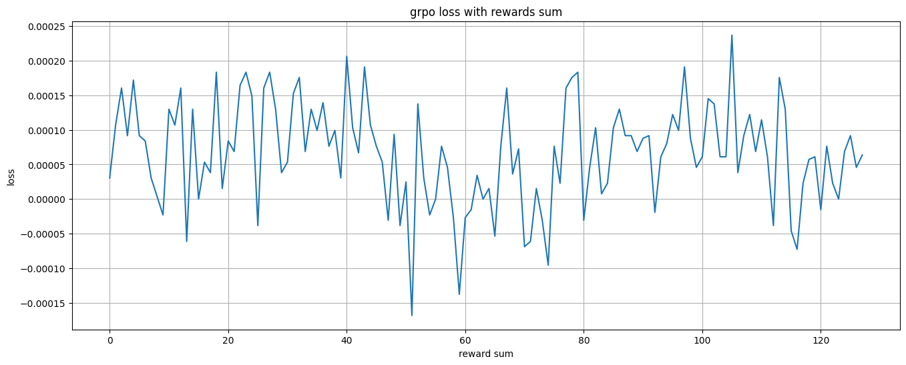

## Abstract

The question that first motivated this analysis was not where the GRPO formula came from, but a more immediate training observation: why can the loss be negative? The optimizer performs gradient descent, while the paper describes objective ascent. If reward increases, which direction should the loss move?

The short answer is that the implementation returns the negative of the GRPO objective:

$$
\mathcal{L}_{\mathrm{GRPO}}(\theta) = -J_{\mathrm{GRPO}}(\theta)
$$

Minimizing the loss is therefore equivalent to maximizing the objective. A negative loss only means that, for the current batch, the policy surrogate is larger than the KL penalty. It does not indicate a training error. More generally, neither the sign nor the magnitude of the loss is a reliable measure of policy quality: adding any constant to the loss changes its sign without changing its gradient.

This note follows a minimal GRPO loss implementation and revisits its accompanying experiments. Several losses stay close to zero not because reward and loss obey a stable relationship, but because one scalar ratio is broadcast across a group of standardized advantages, causing the policy terms to cancel during aggregation.

## Problem Definition and Objective

### Scope of the analysis

GRPO was introduced in DeepSeekMath and can be viewed as a PPO variant without a learned value model. It constructs relative advantages among multiple responses sampled for the same prompt, then applies a PPO-style clipped surrogate to constrain policy updates.[^1] PPO is originally written as stochastic gradient ascent on a surrogate objective; implementations usually negate that objective and pass the resulting loss to a gradient-descent optimizer.[^2]

The implementation studied here is a minimal example for interviews and learning, not a complete trainer. It retains the following computations:

- extract generated-token log probabilities from the current, old, and reference policies;
- use a group advantage to increase or decrease response probability;
- constrain each update through an importance ratio and clipping;
- regularize policy drift with a reference KL penalty;
- aggregate the loss over response tokens only.

The reward model, online rollout, grouping of multiple prompts, padding, distributed training, and optimizer state are outside its scope. This boundary matters; otherwise, behavior from a shape demonstration can easily be mistaken for a real training curve.

### The objective implemented by the code

For a prompt $q$, sample $G$ responses $\{o_i\}_{i=1}^{G}$. The maximization objective represented by the code is:

$$
J_{\mathrm{GRPO}}(\theta)
=
\frac{1}{G}
\sum_{i=1}^{G}
\frac{1}{|o_i|}
\sum_{t=1}^{|o_i|}
\left[
\min\left(
r_{i,t}(\theta) A_i,
\operatorname{clip}\left(r_{i,t}(\theta), 1-\epsilon, 1+\epsilon\right) A_i
\right)
- \beta K_{i,t}
\right]
$$

where

$$
r_{i,t}(\theta)
=
\exp\left(
\log \pi_\theta(o_{i,t}\mid q,o_{i,<t})
-
\log \pi_{\theta_{\mathrm{old}}}(o_{i,t}\mid q,o_{i,<t})
\right).
$$

The code ultimately returns:

$$
\mathcal{L}_{\mathrm{GRPO}}(\theta)
=
-J_{\mathrm{GRPO}}(\theta).
$$

The following graph summarizes the data flow. The objective is the quantity to maximize; the loss is what the optimizer receives.

```{mermaid}
flowchart TB
    accTitle: GRPO Objective and Loss Flow
    accDescr: Sampled responses produce group advantages and token log probabilities, which form the clipped surrogate and KL penalty before the objective is negated for gradient descent

    sampled_data([Sample responses and rewards]) --> group_advantage[Normalize group advantage]
    sampled_data --> token_logprob[Gather token log probability]
    group_advantage --> clipped_surrogate[Compute clipped surrogate]
    token_logprob --> clipped_surrogate
    token_logprob --> kl_penalty[Estimate reference KL]
    clipped_surrogate --> objective[Build objective J]
    kl_penalty --> objective
    objective --> training_loss[Negate to loss L]
    training_loss --> parameter_update([Run gradient descent])

    classDef input fill:#f3f4f6,stroke:#6b7280,stroke-width:2px,color:#1f2937
    classDef process fill:#dbeafe,stroke:#2563eb,stroke-width:2px,color:#1e3a5f
    classDef objective_style fill:#ede9fe,stroke:#7c3aed,stroke-width:2px,color:#3b0764
    classDef update fill:#dcfce7,stroke:#16a34a,stroke-width:2px,color:#14532d

    class sampled_data input
    class group_advantage,token_logprob,clipped_surrogate,kl_penalty process
    class objective,training_loss objective_style
    class parameter_update update
```

## Inputs and Tensor Flow

### From logits to response-token probabilities

The example constructs three logit tensors with shape `(3, 5, 32)`:

```python
pi_logits = torch.randn(3, 5, 32)
pi_ref_logits = torch.randn(3, 5, 32)
pi_old_logits = torch.randn(3, 5, 32)
```

The dimensions represent batch, sequence, and vocabulary:

$$
\text{logits}\in\mathbb{R}^{B\times T\times V}.
$$

Applying `log_softmax` along the vocabulary dimension preserves the shape. `torch.gather` then selects the log probability of the corresponding `token_ids` from the $V$ candidates at each position:

```python
pi_logprob = torch.gather(
    pi_logprob,
    dim = -1,
    index = token_ids.unsqueeze(-1)
).squeeze(-1)
```

The shape changes as follows:

$$
(B,T,V)
\xrightarrow{\operatorname{gather}}
(B,T,1)
\xrightarrow{\operatorname{squeeze}}
(B,T).
$$

The three policies play different roles in the subsequent computation:

| Tensor | Code variable | Role |
| --- | --- | --- |
| Current policy | `pi_logprob` | Retains gradients and receives parameter updates |
| Old policy | `pi_old_logprob` | Forms the denominator of the importance ratio |
| Reference policy | `pi_ref_logprob` | Forms the KL penalty that constrains policy drift |

The example verifies shapes only. A real causal LM must also account for the one-token prediction shift: logits at position $t$ normally predict the token at position $t+1$. If the upstream code has not shifted inputs already, gathering the same-position `token_ids` misaligns labels and logits. A standard implementation aligns `logits[:, :-1]` with `token_ids[:, 1:]`, then recomputes the response-mask boundary.

### Group advantage

The experiment standardizes rewards within the group:

$$
A_i
=
\frac{R_i-\bar{R}}
{\sigma_R+\delta}.
$$

This gives GRPO its direct relative comparison: responses above the group mean receive positive advantages, and those below the mean receive negative ones. The main loss function does not compute this step; it receives the values directly:

```python
advantage = torch.tensor([-1, 2, 1])
```

Before entering the loss, `(B,)` is expanded to `(B, 1)`:

```python
advantage = advantage.unsqueeze(dim = 1)
```

It is then broadcast to `(B, T)`, so every response token in a sequence shares one sequence-level advantage.

Two properties follow from this construction. First, group standardization gives:

$$
\sum_{i=1}^{G}A_i\approx 0.
$$

Second, adding the same constant to all rewards in a group does not change the advantages. Ignoring $\delta$, multiplying rewards by a positive constant also leaves them almost unchanged. A rise in raw reward therefore does not mechanically force the GRPO loss up or down.

If all responses in a group receive the same reward, every advantage becomes zero. Group comparison then provides no policy-gradient signal, leaving only the KL penalty. This outcome does not distinguish between “all responses are good” and “all responses are bad”; both lack within-group ranking information.

## Components of the Loss

### Importance ratio and clipping

The code constructs the ratio between the current policy and the policy used for sampling:

```python
ratio = torch.exp(pi_logprob - pi_old_logprob)
ratio_clip = torch.clamp(ratio, 1 - epsilon, 1 + epsilon)
```

With `epsilon = 0.2`, the clipping interval is `[0.8, 1.2]`. The ratio has a direct interpretation:

$$
r_{i,t}>1
\Rightarrow
\pi_\theta(o_{i,t})>\pi_{\theta_{\mathrm{old}}}(o_{i,t}).
$$

The current policy now favors the token more than the old policy; $r_{i,t}<1$ means the opposite.

The surrogate is computed as:

```python
policy_gradient = torch.minimum(
    ratio * advantage,
    ratio_clip * advantage
)
```

`minimum` handles both advantage signs, but clipping activates in different directions:

| Advantage | Region with zero local gradient | Constrained behavior |
| --- | --- | --- |
| $A_i>0$ | $r_{i,t}>1+\epsilon$ | Stops rewarding excessive probability increases for a good response |
| $A_i<0$ | $r_{i,t}<1-\epsilon$ | Stops rewarding excessive probability decreases for a bad response |

The surrogate is not flattened in the opposite direction. For example, when $A_i>0$ and the ratio falls, the objective continues to penalize the change; clipping does not let the model ignore a good response whose probability is being reduced incorrectly.

The variable name `policy_gradient` is misleading. At this point the tensor stores a surrogate-objective contribution, not a gradient. Autograd computes parameter gradients only after `loss.backward()`.

### Reference KL penalty

The KL term in the code is:

```python
kl = (
    pi_ref_logprob.exp() / pi_logprob.exp()
    - (pi_ref_logprob - pi_logprob)
    - 1
)
```

Let

$$
\Delta_{i,t}
=
\log\pi_{\mathrm{ref}}(o_{i,t})
-
\log\pi_\theta(o_{i,t}).
$$

The token-level estimator is then:

$$
K_{i,t}
=
e^{\Delta_{i,t}}-\Delta_{i,t}-1
=
\frac{\pi_{\mathrm{ref}}(o_{i,t})}{\pi_\theta(o_{i,t})}
-
\log\frac{\pi_{\mathrm{ref}}(o_{i,t})}{\pi_\theta(o_{i,t})}
-1.
$$

Because $e^x\geq 1+x$,

$$
K_{i,t}\geq 0.
$$

The quantity is zero when the current and reference policies assign the same probability to the sampled token. This sampled-KL form matches the GRPO objective in DeepSeekMath.[^1] If the token is genuinely sampled from the current policy, its expectation recovers $D_{\mathrm{KL}}(\pi_\theta\|\pi_{\mathrm{ref}})$. If data come from an old policy, or from hard-coded tokens as in this example, “sample-level KL surrogate” is more precise than “exact full-vocabulary KL.”

Its gradient direction is also explicit. The KL contribution to the loss is $+\beta K_{i,t}$, and

$$
\frac{\partial K_{i,t}}
{\partial\log\pi_\theta(o_{i,t})}
=
1-
\frac{\pi_{\mathrm{ref}}(o_{i,t})}
{\pi_\theta(o_{i,t})}.
$$

When the current-policy probability is higher than the reference probability, this derivative is positive and gradient descent pushes the current log probability down. When it is lower, the direction reverses. The KL term is a soft constraint; it does not require the two policies to match exactly.

### Masking, length normalization, and scalar aggregation

The first three tokens in the example are prompt tokens and the final two are response tokens:

```python
mask = torch.zeros(bs, seq_len)
mask[:, input_len:] = 1
```

For `input_len = 3`, the mask is:

```text
[
    [0, 0, 0, 1, 1],
    [0, 0, 0, 1, 1],
    [0, 0, 0, 1, 1],
]
```

The prompt conditions policy generation and should not contribute to the response policy objective. The same mask is applied to both the surrogate and the KL term:

```python
loss = (policy_gradient - beta * kl) * mask
```

The next line averages over the batch and response length, then flips the sign:

```python
loss = (-1 / bs) * (1 / len_oi.unsqueeze(dim = 1)) * loss
loss = loss.sum()
```

For `(B, T) = (3, 5)` and response length 2, six tokens contribute to aggregation. Each token receives the external coefficient:

$$
-\frac{1}{3}\times\frac{1}{2}
=
-\frac{1}{6}.
$$

The full shape flow is:

| Step | Input shape | Output shape |
| --- | --- | --- |
| `log_softmax` | `(B, T, V)` | `(B, T, V)` |
| `gather` | `(B, T, V)` and `(B, T, 1)` | `(B, T, 1)` |
| `squeeze` | `(B, T, 1)` | `(B, T)` |
| Advantage expansion | `(B,)` | `(B, 1)` |
| Ratio, clipping, KL | `(B, T)` | `(B, T)` |
| Response mask | `(B, T)` | `(B, T)` |
| Length normalization | `(B, T)` and `(B, 1)` | `(B, T)` |
| Full reduction | `(B, T)` | scalar |

## Loss Sign and Optimization Direction

### Why the loss can be negative

Temporarily omitting masks and averaging, the implementation returns:

$$
\mathcal{L}
=
-\operatorname{mean}(S-\beta K)
=
\beta\operatorname{mean}(K)
-
\operatorname{mean}(S),
$$

where $S$ is the clipped policy surrogate. Therefore,

$$
\mathcal{L}<0
\quad\Longleftrightarrow\quad
\operatorname{mean}(S)
>
\beta\operatorname{mean}(K).
$$

This is simply the result of subtracting two terms. Cross-entropy is usually positive because its definition and the range of probabilities guarantee that property; GRPO loss has no analogous lower-bound convention.

The irrelevance of the sign can be shown more directly. Add an arbitrary constant $C$:

$$
\mathcal{L}'(\theta)=\mathcal{L}(\theta)+C.
$$

Its gradient is unchanged:

$$
\nabla_\theta\mathcal{L}'
=
\nabla_\theta\mathcal{L}.
$$

A sufficiently large $C$ turns every negative loss positive; a sufficiently small one can do the reverse. The optimization path remains identical. The zero point of the loss is a convention, while its gradient determines the update.

### Why gradient descent is objective ascent

The optimizer performs:

$$
\theta_{k+1}
=
\theta_k
-
\eta\nabla_\theta\mathcal{L}(\theta_k).
$$

Substituting $\mathcal{L}=-J$ gives:

$$
\theta_{k+1}
=
\theta_k
+
\eta\nabla_\theta J(\theta_k).
$$

From the loss perspective, this is gradient descent. From the GRPO-objective perspective, the same update is gradient ascent. There is no contradiction; the two descriptions observe different signed quantities.

Ignoring clipping and KL, the policy loss for one token is:

$$
\mathcal{L}_{i,t}^{\mathrm{policy}}
=
-r_{i,t}A_i.
$$

Let $\ell_{i,t}=\log\pi_\theta(o_{i,t})$. Then:

$$
\frac{\partial\mathcal{L}_{i,t}^{\mathrm{policy}}}
{\partial\ell_{i,t}}
=
-r_{i,t}A_i.
$$

- If $A_i>0$, the derivative is negative, so gradient descent increases the token log probability.
- If $A_i<0$, the derivative is positive, so gradient descent decreases it.
- If the surrogate enters a constant clipping branch, its local gradient with respect to the ratio is zero.

This view treats token log probabilities as independent variables only to clarify direction. In a real model, logits are coupled through softmax and shared parameters, so updating one token also affects others.

### Why a zero loss can still produce learning

At the start of a fresh on-policy update, the current policy usually equals the old policy, so $r_{i,t}=1$. If advantages have been centered within the group,

$$
\frac{1}{G}\sum_i A_i=0.
$$

The policy objective may therefore evaluate to exactly zero. Its gradient is generally nonzero:

$$
\left.
\nabla_\theta J(\theta)
\right|_{\theta=\theta_{\mathrm{old}}}
=
\frac{1}{G}
\sum_i
A_i
\nabla_\theta
\log\pi_\theta(o_i\mid q).
$$

Different responses contain different tokens and contexts and therefore induce different parameter-gradient vectors. Even if the scalar advantages sum to zero, those vectors usually do not cancel.

Function value and gradient must be kept separate: a function can equal zero at a point without having zero gradient there. GRPO can still update effectively when its initial policy loss is close to zero.

## Reinterpreting the Experiment

To isolate variables, the experiment's `minimal_grpo_loss` removes clipping and the token dimension:

```python
loss = -(
    torch.exp(pi_logprob - pi_old_logprob) * A
    - beta * KL
)
```

Here, `pi_logprob`, `pi_old_logprob`, and `pi_ref_logprob` are all scalars. The same ratio and KL value are broadcast across a group of eight samples. Because the standardized advantages sum to approximately zero,

$$
\sum_{i=1}^{G}rA_i
=
r\sum_{i=1}^{G}A_i
\approx 0.
$$

The policy term necessarily cancels, leaving the aggregate loss approximately equal to:

$$
\sum_i\mathcal{L}_i
\approx
G\beta K.
$$

This explains each reported output:

| Experiment | Output | Actual cause |
| --- | ---: | --- |
| `pi = pi_old = 0.5`, `pi_ref = 0.6` | `0.0014` | Policy terms cancel, leaving eight KL penalties |
| Ratio 20, one positive reward | `-3.8147e-06` | Theoretical value is near zero; the sign comes from floating-point error |
| Ratio 20, two positive rewards | `3.8147e-06` | Again theoretically near zero, with the opposite rounding sign |
| Positive-reward count grows from 1 to 7 | approximately `0` | A shared ratio cannot break advantage cancellation |
| `pi = pi_old` falls from `0.4` to `0.1` | `0.0000 → 0.1297` | Policy terms still cancel; KL grows as the policy moves away from the reference |



_Figure 1: The horizontal loop index corresponds to reward sums from 1 to 128. Aggregate loss fluctuates around a KL baseline of roughly $6\times10^{-5}$; most variation comes from float32 cancellation of large values._

Figure 1 does not simulate training. The loop changes only the reward vector, performs no parameter update, and keeps one shared ratio for all samples. It mainly displays standardization, a constant KL term, and floating-point error. It cannot answer whether training loss should rise as reward improves.

A more informative minimal experiment must give each response a distinct current/old log probability and make those values separate differentiable variables. Only then can ratios correlate with advantages, and gradients from positive and negative responses avoid forced cancellation through one shared scalar.

## Metrics Worth Monitoring During Training

A GRPO loss curve alone says little about whether the policy is improving. Every step may resample responses, recompute rewards, and re-standardize group advantages. The comparison baseline changes with each batch, while clipping and response-length distributions change as well.

I would monitor the following quantities together:

| Metric | Question it should answer |
| --- | --- |
| Raw reward and reward components | Is the policy improving the actual task objective? |
| Within-group reward standard deviation | Does each group contain a learnable relative signal? |
| KL and its coefficient | How far has the current policy moved from the reference? |
| Clip fraction | How many tokens lie in a flat surrogate region? |
| Importance-ratio distribution | Has the current policy drifted too far from the old policy? |
| Response length | Are reward or loss changes caused by length bias? |
| Entropy | Is the policy collapsing prematurely to a small set of outputs? |
| Gradient norm | Do changes in loss correspond to effective and stable updates? |

If reward rises while KL remains stable and clip fraction does not stay saturated, a loss that moves from negative toward zero does not establish training degradation. Conversely, a falling loss with flat reward may only reflect a smaller KL term, a changed length distribution, or better optimization of the surrogate on a fixed batch.

## Engineering Boundaries of the Minimal Implementation

The code is useful for showing formulas and shapes, but a trainer must address at least the following issues:

1. `mask` and `len_oi` are created on CPU by default; CUDA log probabilities will cause a device mismatch.
2. `len_oi` copies one scalar across the batch and cannot represent responses of different lengths.
3. The response mask excludes neither padding tokens nor variable prompt lengths.
4. `bs` serves as both batch size and group size, whereas real training usually has a separate prompt-batch dimension.
5. Causal-LM logits and labels require a shift; random logits verify dimensions only.
6. The old policy, reference policy, and advantages should normally be treated as fixed values to avoid unintended gradient paths.
7. Hard-coded `token_ids` are not sampled from the current policy, so the KL term lacks a strict Monte Carlo interpretation.
8. `exp(ref_logprob - logprob)` is numerically safer than `exp(ref_logprob) / exp(logprob)`, which is more vulnerable to overflow and underflow.

These limits do not change the sign derivation, but they can change training results. Masking, shifting, and device placement are much more likely to create real bugs than the sign of the loss.

## Conclusion

The intermediate tensor named `loss` is still an objective contribution before its sign is flipped. The final factor `-1 / bs` converts it into a loss that the optimizer can minimize. Consequently,

$$
\operatorname{gradient\ descent}(\mathcal{L})
\equiv
\operatorname{gradient\ ascent}(J).
$$

A negative loss has no special meaning. It only indicates that the clipped surrogate exceeds the weighted KL penalty on the current batch; a zero loss does not imply a zero gradient. Training assessment should return to reward, KL, clip fraction, ratios, and gradients rather than requiring the loss to remain positive or decrease monotonically.

The experiment offers a second, more concrete lesson. Standardized group advantages already sum to approximately zero. If every response is also assigned the same scalar ratio, policy terms cancel algebraically. The smaller the experiment, the more important it is to check that it still preserves the degrees of freedom behind the mechanism under study.

## Appendix: Source Code

The appendix reproduces both source artifacts used in this analysis. The code has been lightly reformatted and its comments normalized, without changing the computational logic. Notebook code cells are presented in execution order; the empty final cell is omitted.

### Minimal GRPO implementation (`grpo_loss.py`)

```python
import torch
import torch.nn.functional as F


def grpo_kl(pi_logprob, pi_ref_logprob):
    """Estimate the token-level KL divergence.

    Args:
        pi_logprob: Current-policy log probabilities for sampled tokens.
        pi_ref_logprob: Reference-policy log probabilities for the same tokens.

    Returns:
        Per-token KL estimates with the same shape as the inputs.
    """
    # Let x = log(pi_ref / pi). Then exp(x) - x - 1 is non-negative.
    return (
        pi_ref_logprob.exp() / pi_logprob.exp()
        - (pi_ref_logprob - pi_logprob)
        - 1
    )


def grpo_loss(
    pi_logprob,
    pi_old_logprob,
    pi_ref_logprob,
    advantage,
    input_len,
    len_oi
):
    """Compute the normalized GRPO loss for one batch.

    Args:
        pi_logprob: Current-policy token log probabilities with shape
            ``[batch, seq_len]``.
        pi_old_logprob: Rollout-policy token log probabilities with shape
            ``[batch, seq_len]``.
        pi_ref_logprob: Reference-policy token log probabilities with shape
            ``[batch, seq_len]``.
        advantage: Group-relative sequence advantages with shape ``[batch]``.
        input_len: Number of prompt tokens excluded from the loss.
        len_oi: Effective response length used for normalization.

    Returns:
        A scalar tensor containing the normalized GRPO loss.
    """
    epsilon = 0.2
    beta = 0.01

    batch_size, sequence_length = pi_logprob.shape
    # This minimal example assumes that every response has the same length.
    len_oi = torch.tensor([len_oi] * batch_size, dtype = torch.long)

    # Optimize generated response tokens, not prompt tokens.
    mask = torch.zeros(batch_size, sequence_length)
    mask[:, input_len:] = 1

    ratio = torch.exp(pi_logprob - pi_old_logprob)
    ratio_clip = torch.clamp(ratio, 1 - epsilon, 1 + epsilon)

    # Broadcast one sequence-level advantage across its response tokens.
    advantage = advantage.unsqueeze(dim = 1)
    policy_gradient = torch.minimum(
        ratio * advantage,
        ratio_clip * advantage
    )

    kl = grpo_kl(pi_logprob, pi_ref_logprob)
    objective = (policy_gradient - beta * kl) * mask

    # Negate the objective for minimization and normalize by response length.
    loss = (
        (-1 / batch_size)
        * (1 / len_oi.unsqueeze(dim = 1))
        * objective
    )
    return loss.sum()


if __name__ == "__main__":
    # Verify the token-level KL estimator.
    pi = torch.randn(3, 5)
    pi_ref = torch.randn(3, 5)
    pi_logprob = F.log_softmax(pi, dim = 1)
    pi_ref_logprob = F.log_softmax(pi_ref, dim = 1)
    print(grpo_kl(pi_logprob, pi_ref_logprob))

    # Simulate vocabulary logits from the three policies.
    pi_logits = torch.randn(3, 5, 32)
    pi_ref_logits = torch.randn(3, 5, 32)
    pi_old_logits = torch.randn(3, 5, 32)

    pi_logprob = F.log_softmax(pi_logits, dim = -1)
    pi_ref_logprob = F.log_softmax(pi_ref_logits, dim = -1)
    pi_old_logprob = F.log_softmax(pi_old_logits, dim = -1)

    # One prompt with three sampled responses.
    token_ids = torch.tensor(
        [
            [11, 12, 13, 14, 15],
            [11, 12, 13, 15, 16],
            [11, 12, 13, 16, 17],
        ]
    )

    # Select the log probability assigned to each sampled token.
    pi_logprob = torch.gather(
        pi_logprob,
        dim = -1,
        index = token_ids.unsqueeze(-1)
    ).squeeze(-1)
    pi_ref_logprob = torch.gather(
        pi_ref_logprob,
        dim = -1,
        index = token_ids.unsqueeze(-1)
    ).squeeze(-1)
    pi_old_logprob = torch.gather(
        pi_old_logprob,
        dim = -1,
        index = token_ids.unsqueeze(-1)
    ).squeeze(-1)

    loss = grpo_loss(
        pi_logprob,
        pi_old_logprob,
        pi_ref_logprob,
        torch.tensor([-1, 2, 1]),
        3,
        2
    )
    print(loss)
```

### Notebook experiments (`grpo_loss_analysis.ipynb`)

```python
import torch
import torch.nn as nn
import torch.nn.functional as F


def grpo_kl(pi_logprob, pi_ref_logprob):
    """Estimate the token-level KL divergence.

    Args:
        pi_logprob: Current-policy log probabilities.
        pi_ref_logprob: Reference-policy log probabilities.

    Returns:
        Per-token KL estimates.
    """
    return (
        pi_ref_logprob.exp() / pi_logprob.exp()
        - (pi_ref_logprob - pi_logprob)
        - 1
    )


def grpo_advantage(rewards):
    """Standardize rewards within a response group.

    Args:
        rewards: Reward tensor for one response group.

    Returns:
        Standardized group-relative advantages.
    """
    epsilon = 0.00001
    advantage = (rewards - rewards.mean()) / (rewards.std() + epsilon)
    return advantage


def minimal_grpo_loss(
    pi_logprob,
    pi_old_logprob,
    pi_ref_logprob,
    rewards,
    is_debug = True
):
    """Compute the unclipped minimal GRPO loss used by the experiments.

    Args:
        pi_logprob: Current-policy log probability.
        pi_old_logprob: Rollout-policy log probability.
        pi_ref_logprob: Reference-policy log probability.
        rewards: Rewards for one response group.
        is_debug: Whether to print intermediate tensors.

    Returns:
        Per-response loss values.
    """
    beta = 0.01
    kl = grpo_kl(pi_logprob, pi_ref_logprob)
    advantage = grpo_advantage(rewards)
    loss = -(
        torch.exp(pi_logprob - pi_old_logprob) * advantage
        - beta * kl
    )
    if is_debug:
        print("[Rewards]    :", rewards)
        print("[Advantage]  :", advantage)
        print("[Loss]       :", loss)
    return loss


# Experiment 1: positive aggregate loss.
pi_logprob = torch.tensor(0.5).log()
pi_old_logprob = torch.tensor(0.5).log()
pi_ref_logprob = torch.tensor(0.6).log()
rewards_group = torch.tensor(
    [1, 0, 0, 0, 0, 0, 0, 0],
    dtype = torch.float32
)
loss = minimal_grpo_loss(
    pi_logprob,
    pi_old_logprob,
    pi_ref_logprob,
    rewards_group
)
loss.sum()

# Experiment 2: negative aggregate loss.
pi_logprob = torch.tensor(0.1).log()
pi_old_logprob = torch.tensor(0.005).log()
pi_ref_logprob = torch.tensor(0.1001).log()

rewards_group = torch.tensor(
    [1, 0, 0, 0, 0, 0, 0, 0],
    dtype = torch.float32
)
loss = minimal_grpo_loss(
    pi_logprob,
    pi_old_logprob,
    pi_ref_logprob,
    rewards_group
)
print(loss.sum())

rewards_group = torch.tensor(
    [1, 1, 0, 0, 0, 0, 0, 0],
    dtype = torch.float32
)
loss = minimal_grpo_loss(
    pi_logprob,
    pi_old_logprob,
    pi_ref_logprob,
    rewards_group
)
print(loss.sum())

# Experiment 3: increase the reward sum while holding probabilities fixed.
pi_logprob = torch.tensor(0.4).log()
pi_old_logprob = torch.tensor(0.3).log()
pi_ref_logprob = torch.tensor(0.401).log()
reward_groups = [
    [1, 0, 0, 0, 0, 0, 0, 0],
    [1, 1, 1, 1, 0, 0, 0, 0],
    [1, 1, 1, 1, 1, 1, 1, 0],
    [1, 1, 1, 1, 1, 1, 1, 1],
]
for reward_values in reward_groups:
    rewards_group = torch.tensor(reward_values, dtype = torch.float32)
    loss = minimal_grpo_loss(
        pi_logprob,
        pi_old_logprob,
        pi_ref_logprob,
        rewards_group
    )
    print("result:", rewards_group.sum().item(), loss.sum())

# Experiment 4: move the current policy away from the reference policy.
for probability in [0.4, 0.3, 0.1]:
    pi_logprob = torch.tensor(probability).log()
    pi_old_logprob = torch.tensor(probability).log()
    pi_ref_logprob = torch.tensor(0.401).log()
    rewards_group = torch.tensor(
        [1, 1, 0, 0, 0, 0, 0, 0],
        dtype = torch.float32
    )
    loss = minimal_grpo_loss(
        pi_logprob,
        pi_old_logprob,
        pi_ref_logprob,
        rewards_group
    )
    print("result:", rewards_group.sum().item(), loss.sum())

# Experiment 5: plot aggregate loss as the number of positive rewards grows.
pi_logprob = torch.tensor(0.1).log()
pi_old_logprob = torch.tensor(0.005).log()
pi_ref_logprob = torch.tensor(0.101).log()

num_responses = 128
rewards_group = torch.zeros(num_responses)
loss_list = []
for index in range(num_responses):
    rewards_group[index] = 1.0
    loss = minimal_grpo_loss(
        pi_logprob,
        pi_old_logprob,
        pi_ref_logprob,
        rewards_group,
        is_debug = False
    )
    loss_list.append(loss.sum().item())

import matplotlib.pyplot as plt

plt.figure(figsize = (16, 6))
plt.plot(loss_list)
plt.title("GRPO loss with reward sum")
plt.xlabel("Reward sum")
plt.ylabel("Loss")
plt.grid()
plt.show()
```

## References

[^1]: Shao, Z., et al. (2024). "DeepSeekMath: Pushing the Limits of Mathematical Reasoning in Open Language Models." _arXiv_. https://arxiv.org/abs/2402.03300

[^2]: Schulman, J., Wolski, F., Dhariwal, P., Radford, A., & Klimov, O. (2017). "Proximal Policy Optimization Algorithms." _arXiv_. https://arxiv.org/abs/1707.06347
