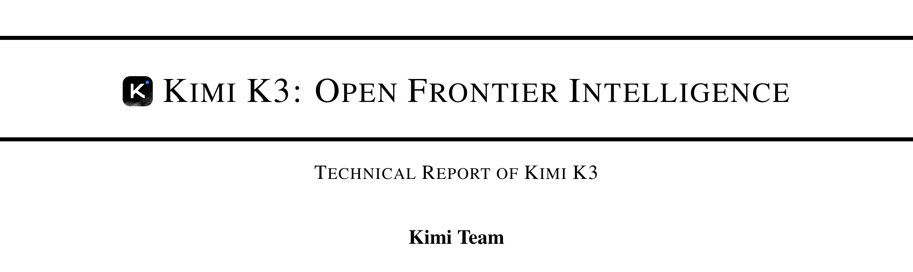{fig-alt="The Kimi K3 Open Frontier Intelligence technical report title and Kimi Team attribution"}

*Source: [Kimi K3 technical report](https://arxiv.org/abs/2607.24653), page 1.*

## Summary and Core Assessment

The headline Kimi K3 figures are 2.8T total parameters, 104.2B active parameters, and a one-million-token context window. The paper is not simply about making those numbers larger. K3 changes four information paths at once. KDA compresses long history into an updated recurrent state. Periodic Gated MLA layers still retrieve information directly from earlier tokens. Block AttnRes lets a layer choose which earlier blocks to read. Stable LatentMoE compresses features before routing them through a pool of 896 experts. MoonViT-V2 brings images, video, and text into the same model from the beginning of pre-training. The common goal is practical: the model must remain trainable and deployable while handling long inputs and complex tool-use trajectories.

A short terminology guide makes the rest of the note easier to read:

| Term | Plain meaning |
|---|---|
| token | The basic unit processed by the model for text, images, or video. A single character does not always map to one token. |
| KDA | Kimi Delta Attention. It updates a fixed-size matrix memory instead of retaining key/value entries for every historical token. |
| MLA | Multi-head Latent Attention. It caches compressed key/value information for each token and can still retrieve history by content. |
| AttnRes | Attention Residuals. A layer weights earlier layer outputs instead of adding every earlier contribution with the same weight. |
| MoE | Mixture of Experts. Each token uses only a small subset of experts, so total capacity can grow without activating every parameter. |
| latent | A lower-dimensional internal feature representation, not a separate data type. |
| rollout | One full attempt inside an RL environment, including reasoning, tool calls, observations, and follow-up actions. |
| compaction | Context compression that summarizes or removes old pages, repeated logs, and tool noise. |

My assessment has four parts:

1. K3’s value lies in coordination, not one isolated module. The reported “2.5× scaling efficiency” belongs to the combined architecture, data, and training recipe. The paper does not contain the ablations needed to allocate that factor among KDA, AttnRes, and LatentMoE.
2. 1M is a maximum window, not proof that every task uses one million tokens effectively. The primary BrowseComp result uses 300K compaction, while the raw full-window run scores slightly lower.
3. Post-training does more than add generic RL. It trains nine policies across three domains and three reasoning budgets, then distills them into one served model.
4. Open weights make study and deployment possible, but the corpus, complete data pipeline, environments, and cluster software were not released. “Open weights” should not be rewritten as “fully open and reproducible.”

This note does not call the Kimi K3 API, and it does not present published benchmarks as personal reproductions. It addresses questions supported by public evidence: how the mechanisms work, which bottleneck each mechanism targets, what the reported numbers measure, and where the claims remain bounded by the authors’ own evaluation.

## 1. Evidence Boundary: Open Weights, Reproducibility, and Official Claims

The primary evidence is the K3 technical report and official repository. The lineage of KDA is checked against [Kimi Linear](https://arxiv.org/abs/2510.26692), the depth mechanism against the original [Attention Residuals](https://arxiv.org/abs/2603.15031) report, and the structural motivation for LatentMoE against the [NVIDIA paper](https://arxiv.org/abs/2601.18089). Cache behavior and serving measurements come from the [vLLM engineering report](https://vllm-project.github.io/2026/07/27/k3.html). Artificial Analysis contributes a dated external snapshot rather than evidence for a durable model ranking.

The official repository publishes model weights, configuration, and inference entry points, but the license is neither Apache-2.0 nor MIT. The [Kimi K3 License](https://github.com/MoonshotAI/Kimi-K3/blob/main/LICENSE) permits use, modification, distribution, fine-tuning, and derivative works, subject to additional conditions at commercial scale. An operator of a Model-as-a-Service business whose aggregate affiliate revenue exceeds US$20 million over any consecutive twelve months must reach a separate agreement before commercial use. Commercial products above 100 million monthly active users or US$20 million in monthly revenue must prominently display “Kimi K3,” with exceptions for internal use and official or certified channels. The precise description is therefore “open weights under a custom license,” not unrestricted open source.

The reproducibility gap is larger. The report specifies an 8K→64K→256K→1M curriculum, MoonViT-V2, Per-Head Muon, Quantile Balancing, nine-policy RL, MOPD, MXFP4 QAT, and long-trajectory systems. It does not release the raw corpus, all filters, the complete synthetic task collection, reward environments, hardware topology, and execution logs needed to rebuild a 2.8T-parameter training run. External teams can test checkpoint behavior, rewrite kernels, measure serving, and run small-scale module experiments. None of those activities retroactively make the official end-to-end training reproducible.

Evidence must also separate the existence of a mechanism from its contribution. A config and implementation can establish that the checkpoint contains 69 KDA and 24 MLA layers or that a backend executes the required operators. The same material cannot say how much the final score would change if KDA were removed. Small-scale ablations support directional judgments but do not establish proportional gains at 2.8T parameters. This note therefore treats configuration facts as direct facts, author experiments as reported results, and cross-experiment comparisons as interpretations rather than invented causal percentages.

Zhihu and Tencent Cloud posts are useful for identifying recurring interpretations, not for establishing architecture. The [official Kimi Zhihu post](https://zhuanlan.zhihu.com/p/2061380200647205373) follows the release framing, a [Zhihu user test](https://www.zhihu.com/question/2061204677446964906/answer/2063674631316414638) provides task-level experience, and a [Tencent Cloud community article](https://cloud.tencent.com/developer/article/2714420?policyId=1004) gives a rapid overview. Secondary summaries often collapse “1M window” into “effective million-token reasoning” or assign the 2.5× figure to one new module. A stronger reading separates capacity, training, effective context, and evaluation protocol, then checks each against a first-party source.

## 2. From K2 to K3: Total Capacity and Per-Token Compute

K3 has 93 layers and retains a hidden width of 7,168. Sixty-nine layers use KDA and twenty-four use MLA. Each MoE path contains 896 routed experts, selects sixteen per token, and adds two full-width shared experts. Total parameters rise from K2’s 1.04T to 2.78T; active parameters rise from 32.6B to 104.2B. Both totals matter. The former describes expert capacity, and the latter is closer to per-token forward compute, but communication, routing, weight reads, and cache costs do not collapse into the active-parameter number.

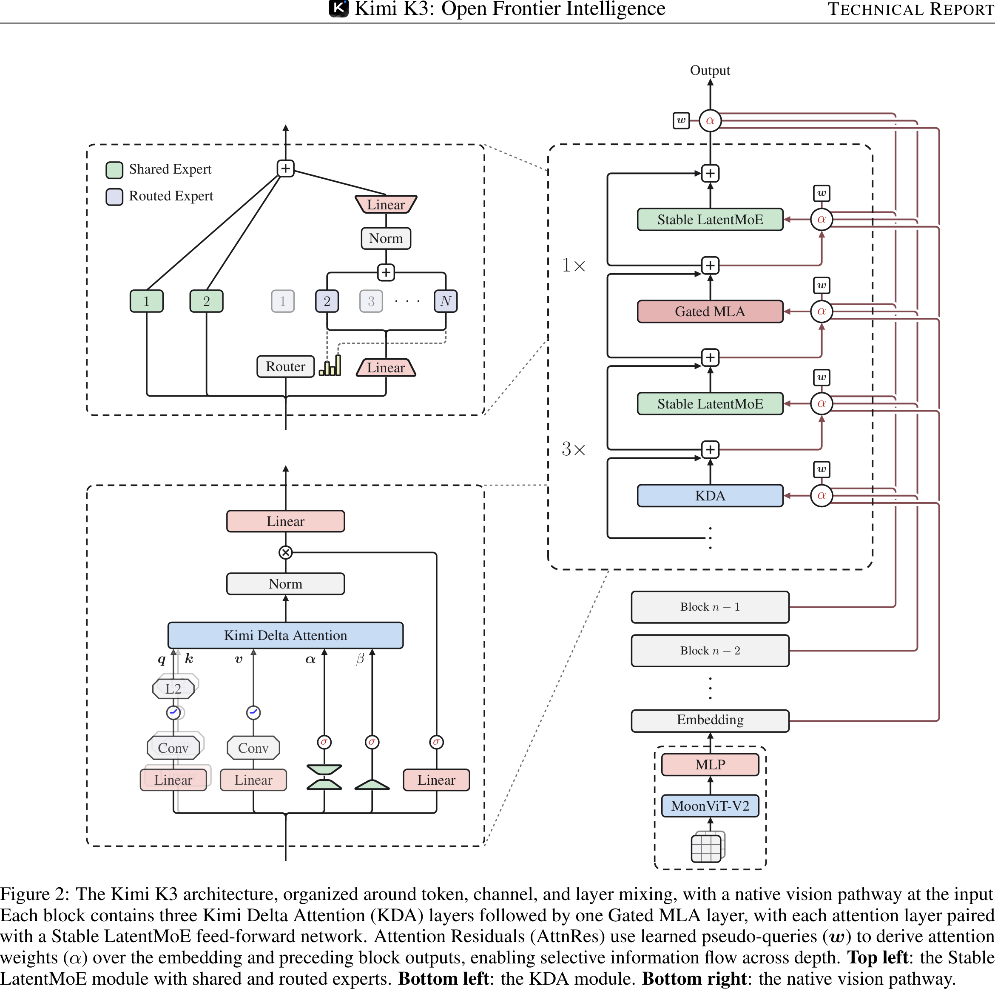{fig-alt="Figure 2 of the Kimi K3 report showing Stable LatentMoE, KDA, Gated MLA, Attention Residuals, and MoonViT-V2"}

*Source: [Kimi K3 technical report](https://arxiv.org/abs/2607.24653), Figure 2, page 3.*

The paper organizes the design along sequence, depth, and width, with vision as a fourth input path into the shared backbone. This decomposition makes the division of labor clear. KDA and MLA determine how a token reads sequence history. AttnRes determines how a layer reads earlier layer outputs. LatentMoE determines which channel-wise expert transforms act on that token. MoonViT-V2 determines how images become tokens trained jointly with text. These are not four parallel models; all of them write into the same residual and prediction path.

Figure 2 is easy to misread because it overlays four information paths. Black lines show sequential computation and ordinary residual flow within the current module. The wine-red lines on the right carry the embedding and completed block outputs across depth. A circled $w$ is the learned pseudo-query of the current module, and the red $\alpha$ values are its Softmax weights over those depth sources. The $\alpha$ inside the KDA detail at lower left is entirely different: it is a channel-wise retention factor used to update state along the token sequence.

The `3×` and `1×` labels on the right do not reduce the entire 93-layer backbone to four layers. They define one repeated unit: three “KDA + Stable LatentMoE” pairs followed by one “Gated MLA + Stable LatentMoE” pair. The reported 69 KDA and 24 Gated MLA layers reconstruct exactly as

$$
23\times
\left(
3\,\mathrm{KDA}+1\,\mathrm{Gated\ MLA}
\right)
+1\,\mathrm{Gated\ MLA}
=69\,\mathrm{KDA}+24\,\mathrm{Gated\ MLA}
=93\ \text{layers}.
$$

The extra Gated MLA is not followed by another 3:1 unit. It ensures that the last sequence-mixing operation at the top of the backbone is global token-to-token attention. Here, 93 counts attention layers, each paired with a channel-mixing sublayer; Figure 2 shows Stable LatentMoE on the main repeated path.

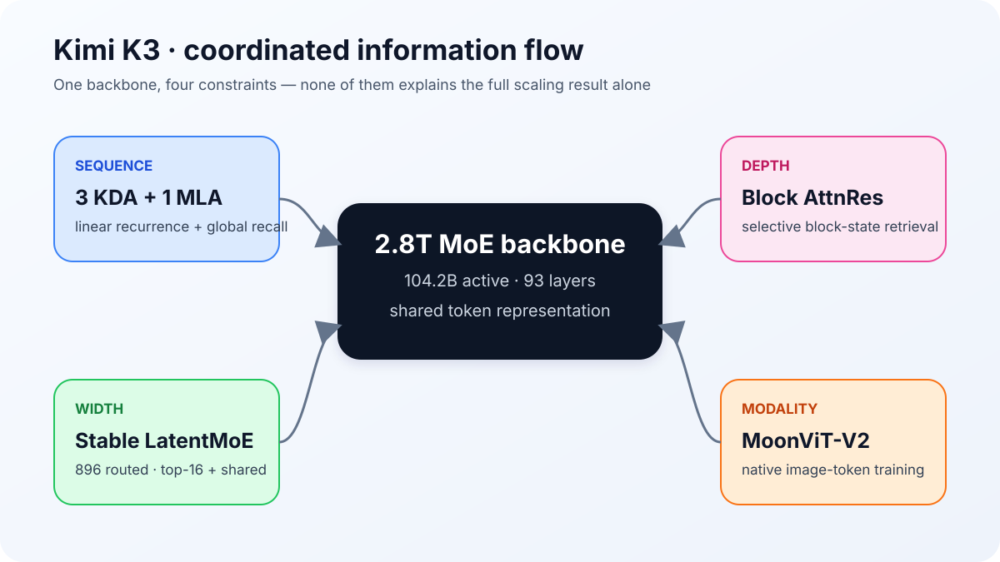{fig-alt="Custom Kimi K3 information-flow map with three KDA plus one MLA for sequence, Block AttnRes for depth, Stable LatentMoE for width, and MoonViT-V2 for modality"}

*Based on §2 and Figure 2 of the [K3 report](https://arxiv.org/abs/2607.24653).*

The decomposition also exposes the boundary of the scaling-law result. K3’s fitted curve is shifted by approximately 2.5× relative to K2, meaning that the authors’ full configuration reaches a given validation loss with fewer fitted training FLOPs. Architecture, data mixture, native vision training, optimizer, and stabilization methods all changed together. The curve is not a causal single-module experiment. The 2.5× figure can characterize the full K3 recipe; it cannot support the statement that “KDA alone made training 2.5× more efficient.”

The four axes also have an order within a forward pass. MoonViT-V2 first encodes an image into visual tokens that share the embedding stream with text. KDA or MLA mixes sequence information. AttnRes selects depth history for the sublayer. Stable LatentMoE then performs sparse channel mixing. Implementation details interleave these operations through PreNorm, residual paths, and parallel schedules, but this order reveals a systems property: an upstream scale error reaches the 896-expert router, while distorted depth aggregation changes the inputs of the next sequence mixer. K3’s normalizations, smooth caps, and clipping rules sever different paths through which such errors could compound.

## 3. KDA and Gated MLA: Why K3 Uses a 3:1 Mixture

This section focuses on the input, state edit, and output of one KDA layer inside K3. The recurrence lineage, WY/UT derivation, ablations, and public implementations are covered in the companion note, [Kimi Linear and KDA](../attention/kimi-linear-kda.qmd).

### 3.1 From indefinite accumulation to address-directed rewriting

The simplest linear-attention recurrence adds every key–value outer product to a fixed-size state:

$$
S_t=S_{t-1}+k_tv_t^{\top},
\qquad
o_t=S_t^{\top}q_t.
$$

It does not retain K/V entries for every historical token, but similar keys repeatedly write into the same direction. New content can only accumulate; it cannot explicitly replace an old association. The delta rule instead treats the state as an online associative map from key space to value space. It asks what the old state predicts at the current key and writes only the prediction error:

$$
\widehat{v}_t=S_{t-1}^{\top}k_t,
\qquad
S_t
=
S_{t-1}
+\beta_tk_t\left(v_t-\widehat{v}_t\right)^{\top}.
$$

If the old state already maps $k_t$ close to $v_t$, the update is small. If the prediction is wrong, the update rewrites the association along the $k_t$ direction. KDA adds per-key-channel forgetting before this edit. For one attention head, $S_t\in\mathbb{R}^{d_k\times d_v}$, and the full recurrence is

$$
S_t = \left(I - \beta_t k_t k_t^{\top}\right)\mathrm{Diag}(\alpha_t)S_{t-1} + \beta_t k_t v_t^{\top},
\qquad
\widetilde{o}_t = S_t^{\top}q_t.
$$

Because $\mathrm{Diag}(\alpha_t)$ multiplies the state on the left, it scales rows of $S_{t-1}$—memory associated with key channels—not columns in value space. KDA's key change from Gated DeltaNet is replacing one head-wide scalar decay with $\alpha_t\in(0,1)^{d_k}$, allowing different key directions within one head to learn different time scales. Fixed shape means that state memory does not grow with sequence length; it does not mean history is preserved losslessly. Similar keys can still collide, and old content can be decayed or overwritten.

### 3.2 Inputs, state, and outputs for one token

During decoding, a KDA layer does more than map one token input to one token output. It reads and updates the recurrent state of every head together with the layer's short-convolution cache for its q/k/v paths:

$$
\left(
x_t,\,
S_{t-1},\,
C_{t-1}^{\mathrm{conv}}
\right)
\xrightarrow{\mathrm{KDA}}
\left(
y_t,\,
S_t,\,
C_t^{\mathrm{conv}}
\right).
$$

$x_t\in\mathbb{R}^{d}$ is the hidden representation assembled by AttnRes for the current KDA sublayer. $S_{t-1}$ retains compressed long-range associations, and $C_{t-1}^{\mathrm{conv}}$ holds the few recent tokens needed by ShortConv. The visible output $y_t\in\mathbb{R}^{d}$ returns to the backbone residual stream. The updated $S_t$ and convolution cache remain internal for the next token rather than being passed directly to the following MoE.

The five input branches in the lower-left detail of Figure 2 produce $q$, $k$, $v$, $\alpha$, and $\beta$. For head $h$, they are parameterized from the current hidden state $x_t$ as

$$
q_t^h,k_t^h
=
\mathrm{L2Norm}\!\left(
\mathrm{Swish}\!\left(
\mathrm{ShortConv}\!\left(W_{q/k}^h x_t\right)
\right)
\right),
\qquad
v_t^h
=
\mathrm{Swish}\!\left(
\mathrm{ShortConv}\!\left(W_v^h x_t\right)
\right),
$$

$$
\beta_t^h=\mathrm{Sigmoid}\!\left(W_\beta^h x_t\right),
\qquad
z_t^h=W_{\alpha\uparrow}^hW_{\alpha\downarrow}x_t+b_\alpha^h.
$$

The formula abbreviates convolution as a function of the current $x_t$. During decoding, ShortConv also reads $C_{t-1}^{\mathrm{conv}}$, so $q$, $k$, and $v$ have a small local receptive field. L2Norm controls the scale of $q$ and $k$, leaving their directions to act primarily as read and edit addresses rather than allowing key norm to become another implicit write-strength control. The decay logit $z_t^h$ is not itself the retention factor; the lower-bounded mapping below converts it into $\alpha_t^h$.

Rearranging the recurrence exposes the exact order of one state edit and read:

$$
\overline{S}_t
=
\mathrm{Diag}(\alpha_t)S_{t-1},
\qquad
\widehat{v}_t
=
\overline{S}_t^{\top}k_t,
$$

$$
S_t
=
\overline{S}_t
+\beta_tk_t\left(v_t-\widehat{v}_t\right)^{\top},
\qquad
\widetilde{o}_t
=
S_t^{\top}q_t.
$$

The old state is first decayed by key channel. The key $k_t$ then reads the old prediction at the edit address. The error $v_t-\widehat{v}_t$ is written back, and $q_t$ finally reads from the updated state. Because the read follows the update, $\widetilde{o}_t$ includes information written by the current token. The scalar $\beta_t$ controls the strength of one edit, coupling erasure of the old prediction and writing of the error rather than providing two independent gates.

{fig-alt="Single-token KDA input-output flow: alpha decays key channels, beta and the key perform a directed state edit, and the query reads the updated state"}

*Source: the KDA recurrence in Kimi Linear; see the companion [Kimi Linear and KDA note](../attention/kimi-linear-kda.qmd).*

The signals have distinct contracts:

| Signal | Intuitive role | Where it acts |
|---|---|---|
| $q_t$ | Read address | Retrieves a value representation from the updated $S_t$. |
| $k_t$ | Edit address | Selects the key direction where erasure and rewriting occur. |
| $v_t$ | Target content | Specifies the value that should be stored at the current address. |
| $\alpha_t$ | Memory lifetime | Decays rows of the old state by key channel. |
| $\beta_t$ | Edit strength | Scales both directed erasure and error writing. |
| $\mathrm{Sigmoid}(W_gx_t)$ | Output exposure gate | Selects which readout channels enter the backbone residual stream. |

K3 replaces Kimi Linear's low-rank output gate with an input-dependent full-rank channel gate:

$$
y_t
=
W_o\!\left[
\mathrm{Sigmoid}\!\left(W_gx_t\right)
\odot
\mathrm{RMSNorm}\!\left(\widetilde{o}_t\right)
\right].
$$

RMSNorm first stabilizes the recurrent readouts, the current token then selects exposed channels, and $W_o$ maps the multi-head result back to model width. The three controls are not interchangeable: $\alpha_t$ determines memory lifetime, $\beta_t$ determines state-edit strength, and the output gate determines how much of the readout is visible to the residual stream.

Placed back into the full Figure 2 path, AttnRes first assembles $x_t$ from the embedding, completed blocks, and the current block's partial sum. KDA emits the visible $y_t$ while advancing its hidden state to $S_t$, and $y_t$ is added to the current AttnRes block's partial sum. The subsequent Stable LatentMoE sublayer performs its own AttnRes input selection before channel mixing. The recurrent $S_t$ is never passed to the MoE as a 7,168-dimensional token representation.

### 3.3 Recurrent decoding, chunked prefill, and periodic global retrieval

K3 does not replace every layer with linear recurrence. Each repeated unit contains three KDA layers and one Gated MLA layer, and a final MLA layer guarantees global attention at the top of the backbone. MLA compresses each token's key–value representation to $c_t=W_cx_t$. Inference caches $c_t$ and reconstructs head-specific content keys and values through learned up-projections. Its cache still grows linearly with token count, but it preserves direct, global content-addressable access to earlier positions. Gated MLA uses the same kind of input-dependent full-rank channel gate:

$$
y_t
=
W_o\!\left[
\mathrm{Sigmoid}\!\left(W_gx_t\right)
\odot
\widetilde{o}_t
\right].
$$

Every MLA layer uses NoPE, so its queries and keys receive no explicit positional encoding. The paper assigns position-sensitive and recency-aware sequence mixing to the intervening KDA layers and unrestricted global content interaction to MLA. The 3:1 mixture is therefore a cache-cost versus exact-retrieval tradeoff, not evidence that linear attention has superseded Softmax attention.

During decoding, KDA follows the recurrent interface above one token at a time. A layer retains only the fixed-shape $S_t$ and a small convolution cache across the sequence. Training and long-prompt prefill do not execute one million serial iterations; WY/UT organizes the same update as parallel work within chunks and state transfer between chunks:

$$
\left(
X_{[c]},\,
S_{[c]}^{\mathrm{in}}
\right)
\longrightarrow
\left(
Y_{[c]},\,
S_{[c]}^{\mathrm{out}}
\right),
\qquad
S_{[c+1]}^{\mathrm{in}}=S_{[c]}^{\mathrm{out}}.
$$

Multiple tokens inside one chunk become matrix operations, while recurrent state crosses only chunk boundaries. Both execution paths implement the same causal state update, although their floating-point association differs and low-precision outputs need not be bit-identical. K3's difficulty is reciprocal cumulative decay: a run of near-zero retention factors can push the chunk algorithm's scaling outside finite precision. Lower-bounded decay targets that numerical failure.

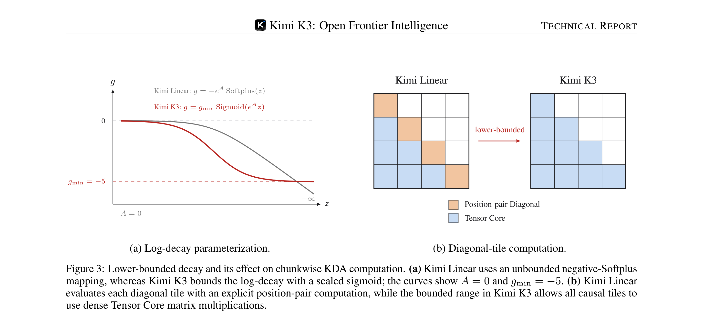{fig-alt="Figure 3 of the Kimi K3 report comparing Kimi Linear negative-Softplus decay with K3 lower-bounded decay and the Tensor Core diagonal-tile path"}

*Source: [Kimi K3 technical report](https://arxiv.org/abs/2607.24653), Figure 3, page 5.*

Lower-bounded decay is the central KDA engineering change. Kimi Linear uses an unbounded negative Softplus. K3 constrains per-step log-decay as follows:

$$
g_t^h = g_{\min}\,\mathrm{Sigmoid}\!\left(e^{A^h}z_t^h\right) \in (g_{\min},0)^{d_k},
\qquad
\alpha_t^h = \exp(g_t^h) \in (e^{g_{\min}},1)^{d_k},
\qquad g_{\min}=-5.
$$

For a secondary tile of length sixteen, cumulative log-decay lies in $(-80,0)$ and reciprocal scaling remains below $e^{80}$, within BF16’s dynamic range. Diagonal tiles previously needed a position-pair special path; they can now use the same dense Tensor Core matrix multiplication as off-diagonal tiles. This is not merely a threshold trick intended to “remember longer.” It first bounds a numerical range, then exchanges that bound for a regular, batchable kernel.

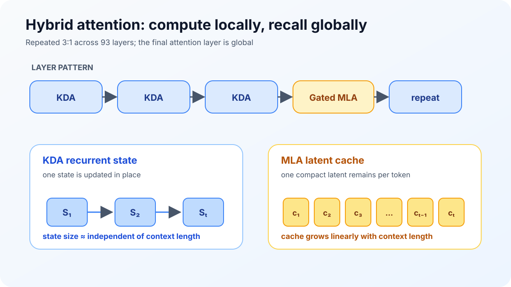{fig-alt="Custom KDA and MLA hybrid-cache diagram showing the three-to-one layer pattern, fixed-shape recurrent state, and per-token MLA latent growth"}

*Based on §2.1 of the [K3 report](https://arxiv.org/abs/2607.24653) and the [vLLM K3 engineering report](https://vllm-project.github.io/2026/07/27/k3.html).*

## 4. Block AttnRes: Letting Deep Layers Select Earlier Information

A standard PreNorm Transformer repeatedly adds outputs with unit weight. As depth grows, hidden-state magnitude and provenance accumulate together, diluting early contributions inside the sum. Attention Residuals replace addition across depth with attention across depth. Each layer learns one pseudo-query $w_l$, computes weights from RMS-normalized embeddings and earlier outputs, and forms the current input from their weighted sum.

$$
h_l=h_{l-1}+f_l(h_{l-1})
=h_0+\sum_{i=1}^{l}f_i(h_{i-1}).
$$

This expansion makes the default weighting explicit: every historical contribution enters the standard residual stream with coefficient one. AttnRes instead treats network depth as a retrievable dimension:

$$
\phi(q,k)=\exp\!\left(q^{\top}\mathrm{RMSNorm}(k)\right),
\qquad
\alpha_{i\to l}=\frac{\phi(w_l,v_i)}{\sum_{j=0}^{l-1}\phi(w_l,v_j)},
\qquad
h_l=\sum_{i=0}^{l-1}\alpha_{i\to l}v_i.
$$

Unlike a sequence-attention query, the pseudo-query is a learned vector for the layer and is not derived from the current token. Keys and values are the representations of that token at different depths, so the attention weights remain token-dependent. Full AttnRes requires all layer outputs to remain accessible. Activation recomputation and pipeline parallelism turn its $O(Ld)$ storage and cross-stage communication into a practical obstacle.

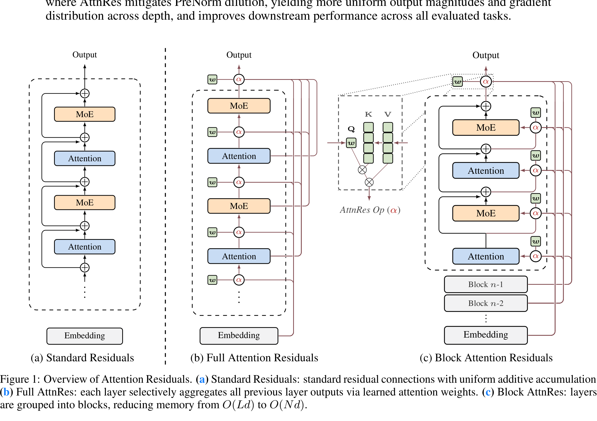{fig-alt="Figure 1 from Attention Residuals comparing standard residual accumulation, Full AttnRes over all earlier layers, and summarized Block AttnRes"}

*Source: [Attention Residuals](https://arxiv.org/abs/2603.15031), Figure 1, page 1.*

Block AttnRes compresses depth history into block summaries. Ordinary residual accumulation remains inside a block, while only one representation survives for cross-block access. K3 caps a block at twelve layers and forms eight backbone blocks: seven complete twelve-layer blocks and one partial nine-layer block. The input embedding is a ninth depth source. The red paths in Figure 2 are precisely the choices among the embedding, completed blocks, and the current block's partial sum. This loses layer-level retrieval granularity but reduces the representations that must stay live and cross pipeline stages from $L$ to $N$. It is useful to think of the mechanism as a block index over a depth cache rather than another sequence-attention layer: it changes where a layer obtains its input without changing token-level causal order.

The pseudo-query has another useful property. It is decoupled from the layer’s forward result, allowing depth weights for a group of layers to be computed in a batch rather than waiting for each layer’s output in sequence. A partial sum for the current block joins completed block summaries as a temporary value. Block AttnRes therefore compresses long-term history while retaining fine-grained updates within the active block. The cost is explicit: if one early layer inside a completed block produced a unique feature, later blocks can retrieve only the summed summary rather than that layer alone.

Scaling and ablation results in the AttnRes report show improved loss and gradient distributions in controlled small models and at Kimi Linear scale. K3 does not publish a sufficiently fine-grained, equal-budget ablation for every module at full scale. A block size of twelve is not a theoretical optimum either. Its value depends on pipeline partitioning, recomputation, and interconnect. A different training system may prefer a different block boundary.

## 5. Stable LatentMoE: Compress First, Then Route to Experts

LatentMoE projects a token from $d=7{,}168$ to $\ell=3{,}584$, performs routed expert computation and all-to-all exchange in the smaller space, and projects back to the backbone width. The NVIDIA paper motivates this design from serving constraints. Lower-dimensional expert computation reduces expert weight traffic and communication by roughly $d/\ell$, and that budget can be exchanged for more experts and a larger top-k. K3 uses 896 routed experts and top-16 selection, a routed selection rate of $16/896\approx1.79\%$. Two always-active full-width shared experts remain outside this ratio, so 1.79% is not the activation fraction of the complete layer.

The two branches at the upper left of Figure 2 should not be collapsed. The router scores the full hidden state $x$. A separate Linear performs $z=W_\downarrow x$, and the selected routed experts receive the 3,584-dimensional $z$. The two shared experts operate directly on the full 7,168-dimensional $x$. The routed path is aggregated, normalized, and projected upward before it is added to the shared path.

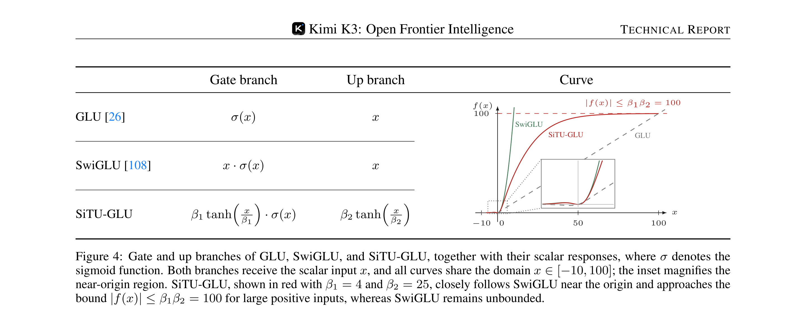{fig-alt="Figure 4 of the Kimi K3 report comparing the gate and up branches and scalar responses of GLU, SwiGLU, and SiTU-GLU"}

*Source: [Kimi K3 technical report](https://arxiv.org/abs/2607.24653), Figure 4, page 7.*

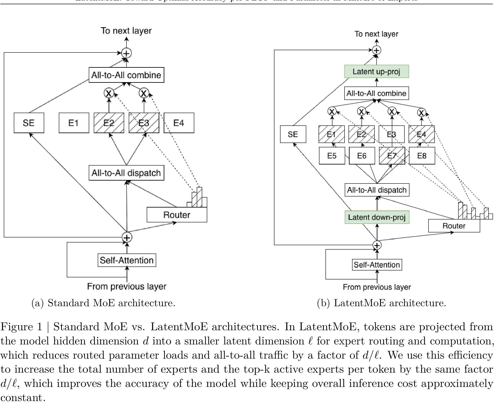{fig-alt="Figure 1 from NVIDIA LatentMoE with standard routing at the model width and LatentMoE down-projecting into more low-dimensional experts before up-projection"}

*Source: [LatentMoE](https://arxiv.org/abs/2601.18089), Figure 1, page 2.*

K3 stabilizes the basic LatentMoE path. Let $T_k(x)$ denote the selected experts and $p_i$ their routing weights. The routed path is aggregated and then normalized before up-projection:

$$
u=\sum_{i\in T_k(x)}p_i E_i^{\mathrm{routed}}(W_{\downarrow}x),
\qquad
y=\sum_{j=1}^{N_s}E_j^{\mathrm{shared}}(x)
+W_{\uparrow}\mathrm{RMSNorm}(u),
\qquad N_s=2.
$$

RMSNorm between expert aggregation and up-projection isolates scale changes caused by different expert mixtures. SiTU-GLU separately applies tanh soft caps with $\beta_1=4$ and $\beta_2=25$ to the gate and up branches, bounding the absolute product at 100. The repairs target different risks: RMSNorm manages aggregate scale; SiTU-GLU limits per-expert activation explosions. Expanding the expert pool is only half of the capacity ledger. The other half is keeping 896 routes trainable under large batches, low precision, and expert parallelism.

$$
\mathrm{SiTU\text{-}GLU}(x)
=
\left[
\beta_1\tanh\!\left(\frac{W_gx}{\beta_1}\right)
\odot
\mathrm{Sigmoid}(W_gx)
\right]
\odot
\left[
\beta_2\tanh\!\left(\frac{W_ux}{\beta_2}\right)
\right],
\qquad
(\beta_1,\beta_2)=(4,25).
$$

Near the origin it preserves the characteristic response of SwiGLU. At large magnitude, the two linear factors approach $\beta_1$ and $\beta_2$, bounding the scalar product by $\beta_1\beta_2=100$. This is a smooth asymptotic cap rather than a hard threshold.

The latent dimension is not free compression. If $\ell$ falls below the task’s effective feature rank, the down-projection removes information before the experts can act on it. If $\ell$ is too large, communication and weight-read savings shrink. K3 chooses half the backbone width and exchanges the savings for more routed experts and top-16 combinations. The theoretical number of expert combinations grows rapidly, but only a much smaller subset is thoroughly exercised by data. LatentMoE should therefore be evaluated through validation loss, expert load, all-to-all time, and low-batch latency together, rather than through FLOPs alone.

Quantile Balancing (QB) manages the load ledger. Earlier auxiliary-loss-free routing updates expert bias by the sign of load error and a fixed step. Small steps adapt slowly; large steps oscillate. QB obtains the Top-$(k+1)$ cutoff $\alpha_i^{(t)}$ for each token and directly chooses the expert-specific quantile that produces the target load $q=mk/n$:

$$
\widehat{b}_j^{(t+1)}
\leftarrow
-\mathrm{quantile}_{1-k/n}\!\left(s_{:,j}-\alpha^{(t)}\right),
\qquad
b^{(t+1)}
\leftarrow
\widehat{b}^{(t+1)}-\mathrm{mean}\!\left(\widehat{b}^{(t+1)}\right)\mathbf{1}.
$$

Training does not gather every margin for millions of tokens across 896 experts. Each rank accumulates a histogram, performs one integer all-reduce at the end of the step, and reads the global quantile. Bias affects dispatch in the next step but not final mixture weights, and it is frozen for inference. Load balance becomes a separate and interpretable routing calibration problem rather than an auxiliary loss that perturbs the main objective.

Histogram error is controlled by bin width. The report uses a fixed number of bins per expert and updates the represented interval dynamically. Communication is independent of token count and grows only with experts and bins. This is far cheaper than gathering raw margins, although it assumes that the large-batch distribution does not change too abruptly. A domain shift creates an unavoidable one-step lag because the bias takes effect on the next batch. Mean centering removes a common offset that leaves Top-k unchanged, preventing all biases from drifting together, but it cannot solve a persistent domain preference for a small expert subset. Data mixture and capacity must handle that problem.

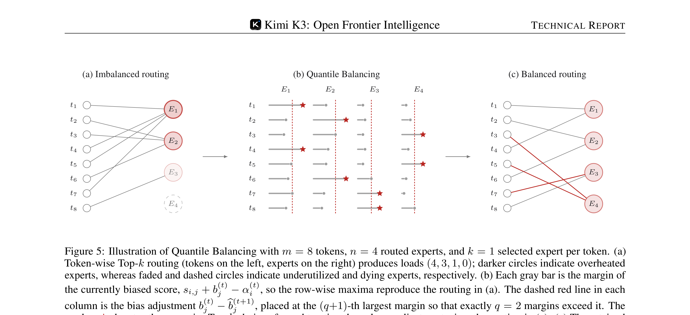{fig-alt="Figure 5 of the Kimi K3 report showing Quantile Balancing for eight tokens and four experts, changing loads from 4 3 1 0 to 2 2 2 2"}

*Source: [Kimi K3 technical report](https://arxiv.org/abs/2607.24653), Figure 5, page 8.*

## 6. Native Vision, Per-Head Muon, and the 2.5× Scaling Result

“Native vision” means that text, image, and video tokens are jointly optimized under one next-token objective from the beginning of pre-training, rather than attaching a visual encoder to a completed language model for post-hoc alignment. MoonViT-V2 has 401M parameters, 27 layers, patch size 14, and twelve attention heads; a lightweight MLP projector maps it into the shared 7,168-dimensional embedding. Images and videos share encoder parameters. Video attention is factorized into intra-frame spatial and inter-frame temporal passes, followed by temporal pooling. Before the projector, a $2\times2$ pixel shuffle reduces visual-token count by a factor of four, keeping inputs up to $3584\times3584$ pixels affordable within the long context. The report finds lower and less spiky vision-tower gradient norms for from-scratch MoonViT-V2 than for a SigLIP-initialized MoonViT-3D baseline, with comparable vision evaluations. This is a joint observation about the reported training trajectory and downstream tests, not evidence that pretrained visual encoders are generally unnecessary.

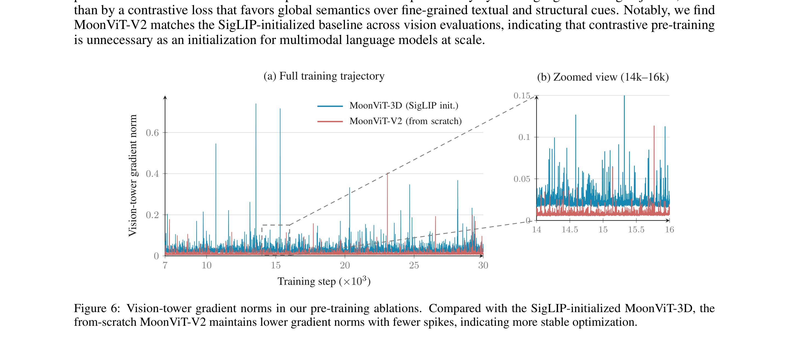{fig-alt="Figure 6 of the Kimi K3 report comparing gradients of from-scratch MoonViT-V2 and SigLIP-initialized MoonViT-3D"}

*Source: [Kimi K3 technical report](https://arxiv.org/abs/2607.24653), Figure 6, page 9.*

Per-Head Muon treats attention heads as separate matrices for Muon’s orthogonalized update instead of applying the operation to a complete attention projection. Different heads occupy different subspaces; coupling their scales inside one large matrix can make their updates interfere. K3 also retains K2’s weight clipping and uses a 1% linear warmup, cosine learning-rate schedule, and 0.1 weight decay. No evidence supports a story in which one optimizer solves stability alone. Per-Head Muon, lower-bounded decay, RMSNorm, SiTU-GLU, QB, and clipping collectively form the stability budget.

The stronger native-vision claim concerns interaction, not a static VQA score. Web development and video editing place generated code, rendered screenshots, and subsequent revisions back into one context. A shared backbone removes a cross-model handoff, but the vision encoder’s resolution, frame sampling, and projector still compress information. Sharing a context does not preserve every pixel detail. The gradient plot supports training stability; it does not replace targeted evaluation of OCR, small objects, long-video temporal structure, and errors introduced by visual tools.

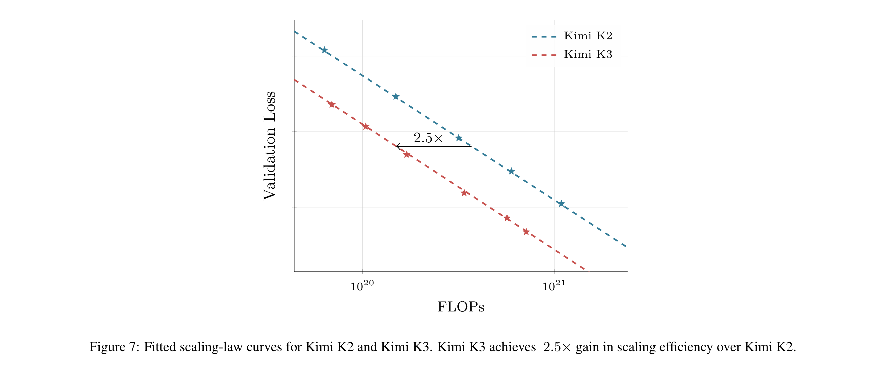{fig-alt="Figure 7 of the Kimi K3 report showing fitted validation-loss curves against training FLOPs for K2 and K3 with a 2.5-times annotation"}

*Source: [Kimi K3 technical report](https://arxiv.org/abs/2607.24653), Figure 7, page 11.*

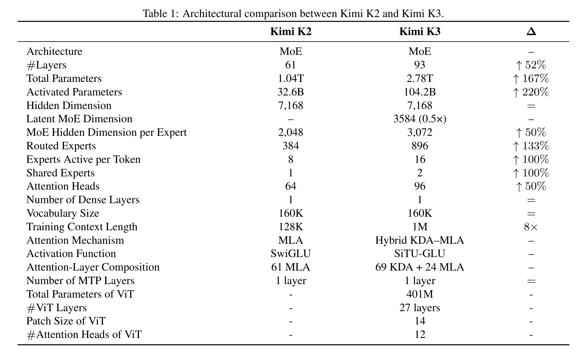{fig-alt="Table 1 of the Kimi K3 report comparing 61 versus 93 layers, 1.04T versus 2.78T total parameters, 32.6B versus 104.2B active parameters, and other K2 and K3 settings"}

*Source: [Kimi K3 technical report](https://arxiv.org/abs/2607.24653), Table 1, page 11.*

Figure 7 needs Table 1 beside it. K3 increases total parameters by 167%, active parameters by 220%, and layers by 52%. It extends training context from 128K to 1M and adds native vision. The scaling curve compares training FLOPs required for the same validation loss, not equal serving latency, memory, or per-request cost. It supports the narrower statement that the K3 recipe is more efficient under the authors’ fitted setup. It does not imply that every K3 deployment is cheaper than K2.

## 7. One-Million-Token Context: A Long Window Is Not Automatically Useful

K3 uses no explicit positional embedding. Causal recurrence, decay, and ShortConv in KDA, together with the causal mask in periodic MLA, encode order implicitly. Expanding the window does not require RoPE rescaling or interpolation. NoPE removes one positional extrapolation boundary; it does not teach the model to retrieve evidence from one million tokens. The report is explicit about the data problem. Natural long documents and videos contain duplicates, corruption, truncation, binaries, and invalid logs. The pipeline applies exact and fuzzy deduplication, perceptual video hashing, quality classification, and structural validation, then upsamples scarce long examples. It also permutes and concatenates multimodal documents and subtasks so that some samples can be solved only through evidence scattered across the full context.

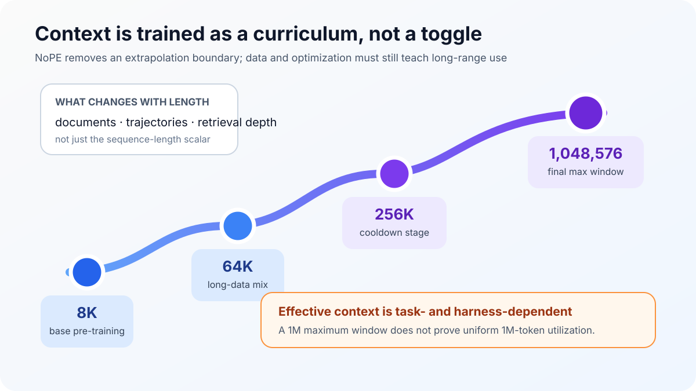{fig-alt="Custom Kimi K3 context curriculum showing 8K, 64K, 256K, and 1048576 tokens while noting that effective context depends on data and task"}

*Based on §3.4 of the [K3 report](https://arxiv.org/abs/2607.24653).*

The curriculum has four stages. Pre-training grows from 8K to 64K; cooldown introduces 256K and then 1M. Expensive ultra-long sequences occupy only a small late fraction of the budget. This is more economical than training at 1M throughout and lets optimization adapt gradually to long-range dependency. The tradeoff is that rare 1M examples receive fewer updates, so utilization may vary across positions, task classes, and modalities.

Advertised, runnable, and effective context must remain separate. The primary BrowseComp score of 91.2 uses 300K compaction. Feeding raw trajectories into the full 1M window without context management yields 90.4. The gap is small but directly refutes the assumption that more retained tokens necessarily improve the score. Compaction loses information, yet it also removes irrelevant pages, repeated observations, and tool noise. In agentic search, compression policy is part of the reasoning system. A useful context evaluation varies evidence location, distractor density, cross-section composition, tool-log growth, and failure recovery; one needle-in-a-haystack run is not enough.

A million tokens also increase the cost of mistakes. An irrelevant page capture, failed terminal dump, or duplicate screenshot keeps occupying later attention and cache unless it is compressed. A flawed plan formed at the hundred-thousand-token mark may be carried forward by recurrent state through many subsequent steps. Context management is therefore not merely a patch for shorter-window models; it performs noise removal and state correction. Reporting both raw 1M and compacted results is useful, but the paper still lacks detailed buckets by trajectory length, evidence distance, and compaction deletion error.

## 8. Post-Training: Combining Nine Policies into One Model

Post-training starts with an SFT cold start. Earlier domain-specific Kimi models synthesize long trajectories, which undergo multistage verification and human-in-the-loop annotation before serialization in an XTML chat format. RL then separates coding, general, and agentic domains. Each domain receives low, high, and max reasoning-effort policies, creating nine teachers. An effort level is more than a prompt label. Training estimates an initial per-problem token budget $b_0(x)$, overrides task reward when a trajectory exceeds $\tau b_0(x)$, and progressively reduces $\tau$ to obtain shorter policies.

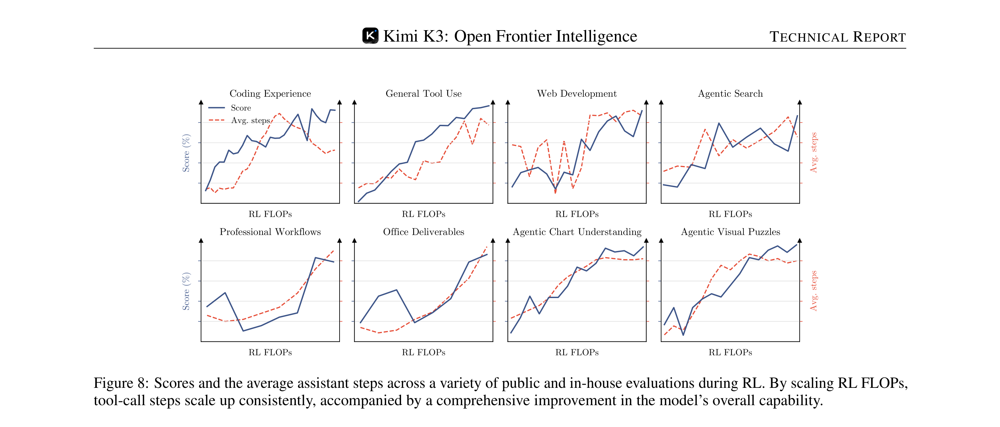{fig-alt="Figure 8 of the Kimi K3 report showing RL score and average-step curves for coding, tool use, web development, search, professional workflows, office work, chart understanding, and visual puzzles"}

*Source: [Kimi K3 technical report](https://arxiv.org/abs/2607.24653), Figure 8, page 13.*

Figure 8 shows that scores and average tool-call steps generally rise with RL FLOPs across several tasks. It establishes that training drives longer interaction, but it does not prove that more steps cause the higher scores. Both change with training progress, and several curves are non-monotonic. Token budgets and verbosity controls suppress unproductive length. Non-verifiable tasks depend on an Agentic GRM whose judge must read the result, create a rubric, score each candidate, and record a scorepad. Once a learned judge participates, rubric quality and verbosity penalties can become proxy objectives of their own.

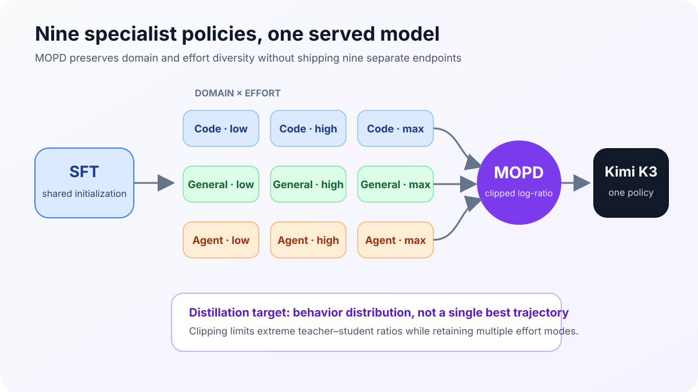{fig-alt="Custom Kimi K3 post-training diagram showing coding, general, and agent domains at low, high, and max effort after SFT, followed by MOPD into one model"}

*Based on §4.1 of the [K3 report](https://arxiv.org/abs/2607.24653).*

MOPD consolidates multiple teachers through on-policy distillation. The student first generates tokens from its current policy, so training covers prefixes that the student actually visits. The matching domain-and-effort teacher then provides a dense token-level signal. For domain $d$, effort $e$, and current token $y_t$, the reward is a clipped log-ratio between teacher and student probabilities:

$$
r_{\mathrm{opd}}^{d}\!\left(y_t\mid e,x,y_{\lt t}\right)
=
\mathrm{clip}\!\left(
\mathrm{sg}\!\left[
\log\frac{\pi_{\mathrm{teacher}}^{(d,e)}\!\left(y_t\mid x,y_{\lt t}\right)}
{\pi_{\theta}\!\left(y_t\mid e,x,y_{\lt t}\right)}
\right],
-R_{\max},R_{\max}
\right).
$$

$\mathrm{sg}$ stops gradients through the teacher signal, while clipping prevents extreme advantages where the student assigns very low probability. Unlike collecting complete teacher trajectories for offline cross-entropy, on-policy distillation rewards prefixes the student actually visits and composes naturally with partial rollout. The cost remains substantial: training must query the corresponding one of nine teachers and maintain policy versions, caches, and long-lived trajectory state. The report notes that a finer top-k distillation objective produced no clear gain. That negative result is informative; a more elaborate target did not automatically improve convergence.

Nine policies also separate capability from budget. Coding, general, and agentic domains use different reward sources, while low, high, and max change available tokens. Training only a max policy and requesting brevity at inference may not teach early convergence within a hard budget. Effort-specific RL gives each teacher behavior adapted to its constraint. MOPD aims to preserve these distributions rather than average nine outputs. The paper does not provide a complete forgetting matrix across domains and effort levels, so whether the unified student loses specialist ceilings on some tail tasks remains open.

Deployment constraints enter post-training early. Routed expert weights, which dominate parameter memory, use MXFP4, and activations use MXFP8. Attention projections, latent projections, shared experts, and routers remain at higher precision. QAT spans SFT and RL, and rollout shares the training quantization scheme to reduce train–inference mismatch. A pretrained MTP layer is fine-tuned as an EAGLE-3-style draft model. K3’s post-training target therefore combines capability, reasoning budget, and deployed numerical format rather than applying compression as an unrelated final step.

## 9. Agentic Environments: Saving and Resuming Very Long Trajectories

Agentic RL quickly moves the bottleneck from the loss to the environment. K3 trains search, software engineering, GPU kernels, web development, office deliverables, vision-in-the-loop tasks, and persistent assistant workflows. Its knowledge-graph-guided synthesis process recursively expands concepts from coarse domains, jointly samples related keywords, retrieves public materials, and chooses a task type. The benefit is coverage control: compared with unconstrained task generation, the graph can expose rare concepts and reduce topic collapse. Risk shifts to graph expansion, source licensing, synthesizer bias, and verifier quality.

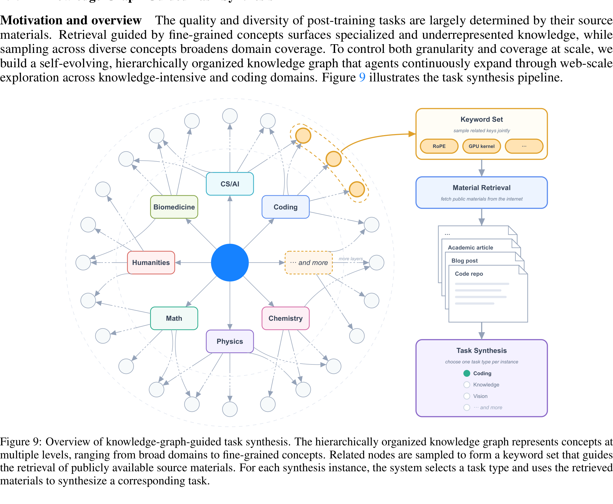{fig-alt="Figure 9 of the Kimi K3 report showing a hierarchical knowledge graph sampling keywords, retrieving papers blogs and code, and synthesizing coding knowledge or vision tasks"}

*Source: [Kimi K3 technical report](https://arxiv.org/abs/2607.24653), Figure 9, page 15.*

Million-token rollouts require persistent runtime state. The report says AgentENV uses microVM isolation, with approximately 133 ms median checkpoint and 49 ms resume time. Memory overcommit reaches up to 6.5×, and training launched 51,219,741 sandboxes. This demonstrates a large operational system. It does not mean there were 51 million independent, high-quality tasks: a single environment may be retried, resumed, or reused by several trajectories.

Partial rollout resumes unfinished work after a policy update instead of discarding every long trajectory. An external KV pool separates inference state from worker lifetime, and auto-throttling regulates concurrency as training and rollout pressure change. Without this separation, GPUs wait on browsers, compilers, and networks, while environment state is lost when a worker or model version changes. Algorithm papers often compress this into “asynchronous rollout.” K3 gives it several sections, which is one of the report’s most useful contributions for engineering teams.

Persistent environments also create version-consistency problems. A restored sandbox must align files, processes, browser pages, and credentials with the matching prefix. Restoring KV against a different environment state produces a syntactically valid but unverifiable trajectory. When a partial rollout crosses a policy update, the system must decide whether a prefix generated by an older policy remains valid and how reward is assigned. The report gives the checkpointing, scheduling, and isolation design but not every failure rate or replay-consistency statistic. For a team building Agent RL, these missing measurements may determine reliability more than the choice between PPO and another policy objective.

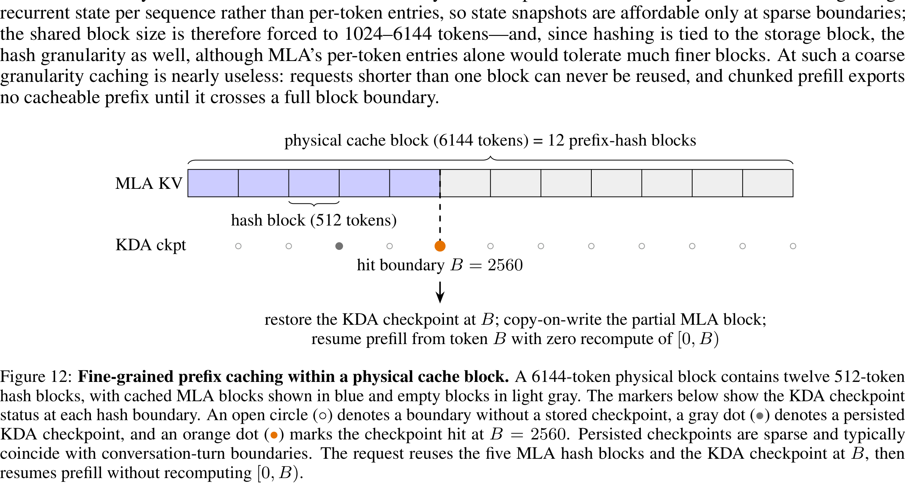{fig-alt="Figure 12 of the Kimi K3 report showing a 6144-token physical block divided into twelve 512-token hash blocks and recovery from a KDA checkpoint at token 2560"}

*Source: [Kimi K3 technical report](https://arxiv.org/abs/2607.24653), Figure 12, page 23.*

Hybrid attention turns prefix caching into a two-representation problem. MLA retains a latent per token and can reuse fine-grained hash boundaries. KDA holds one large recurrent state per sequence and layer, so checkpoints are affordable only at sparse boundaries. K3 divides a 6,144-token physical block into twelve 512-token hash blocks. A hit at token 2,560 reuses the first five MLA blocks and restores the KDA state at the same boundary before resuming prefill. An MLA prefix hit alone is insufficient when the corresponding recurrent state is absent.

{fig-alt="vLLM K3 engineering diagram with an fp32 KDA recurrent state per sequence and layer on the left and a bf16 MLA latent cache growing to one million tokens on the right"}

*Source: vLLM, [“Serving Kimi K3 at Frontier Scale”](https://vllm-project.github.io/2026/07/27/k3.html), accessed 2026-08-01.*

On a specified setup of 16 GB300 NVL72 systems, vLLM reports approximately 118 tokens/s without speculative decoding and roughly 370 tokens/s with DSpark. This demonstrates that an open-weight implementation can reach high serving throughput and that the draft model matters substantially. It is not a single-GPU result and cannot be transferred to other hardware without the cluster scale, parallel plan, quantization, request shape, and software version. The cache diagram is more portable than one tokens-per-second figure because it explains why an existing paged KV allocator cannot handle recurrent state unchanged.

## 10. How to Read the Evaluations, Costs, and Engineering Cases

The K3 report spans coding, agentic search, knowledge work, vision, mathematics, and general reasoning. Primary tables generally use max reasoning effort and temperature 1, while some models run under vendor-recommended agent harnesses. Models may differ in fallback behavior, context management, and safety filters. Cyberguard changes refusals on security tasks. Browsers, terminals, parsers, and timeouts change agent evaluations. Kimi Code Bench 2.0 and several professional-workflow suites are created or maintained by the model team. Combining these scores into one “intelligence ranking” obscures that the measurements do not share one harness.

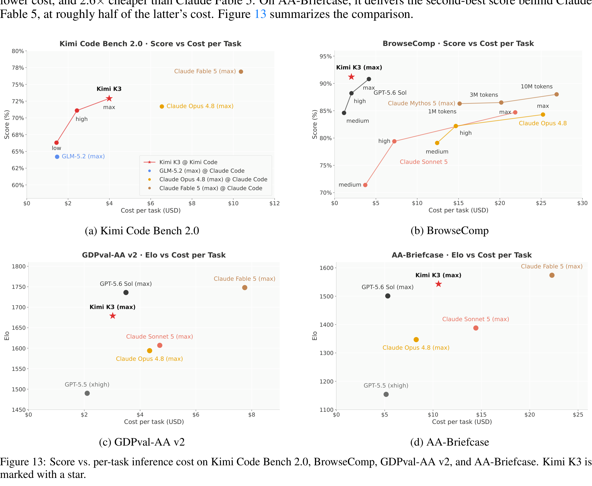{fig-alt="Figure 13 of the Kimi K3 report with per-task dollar cost against score or Elo on four evaluations, marking Kimi K3 with a star"}

*Source: [Kimi K3 technical report](https://arxiv.org/abs/2607.24653), Figure 13, page 32. Cost uses API prices listed by the paper at evaluation time.*

Figure 13 places scores beside per-task inference cost, which is more useful than ranking by score alone. The horizontal axis still uses API pricing and token consumption from the paper, not total hardware ownership cost. Harness-specific tool calls, compaction, and retries change expense, and prices change over time. K3 occupies a favorable score–cost region in several plots. The defensible claim is that it was competitive under that protocol and those prices, not that it is cheaper for every workload.

Low, high, and max points for one model should not be read solely as “pay more for a better answer.” Reasoning effort changes generated length, tool steps, retries, and timeout rate, and cost distributions can have long tails. Mean cost per task hides a small number of runaway trajectories, whereas deployed agents care about P95 latency, human takeover after failure, and recoverable state. Plotting a score–cost curve is closer to the engineering question than a single leaderboard point. Per-task tokens, tool errors, and confidence intervals would make it stronger.

The report’s GPU compiler, I–Love–Q, AI-ASIC research site, gravitational-wave analysis, and video-editing cases illustrate the upper shape of long-horizon behavior. They include two-hour runs, thousands of code lines or searches, and concurrent subagents. These are selected by the model team and lack a control group, failure distribution, and independently reproduced logs. Their evidence level is that of an engineering demonstration. They answer “can this system complete a task of this form?” rather than estimating one-shot success or labor savings for an ordinary user.

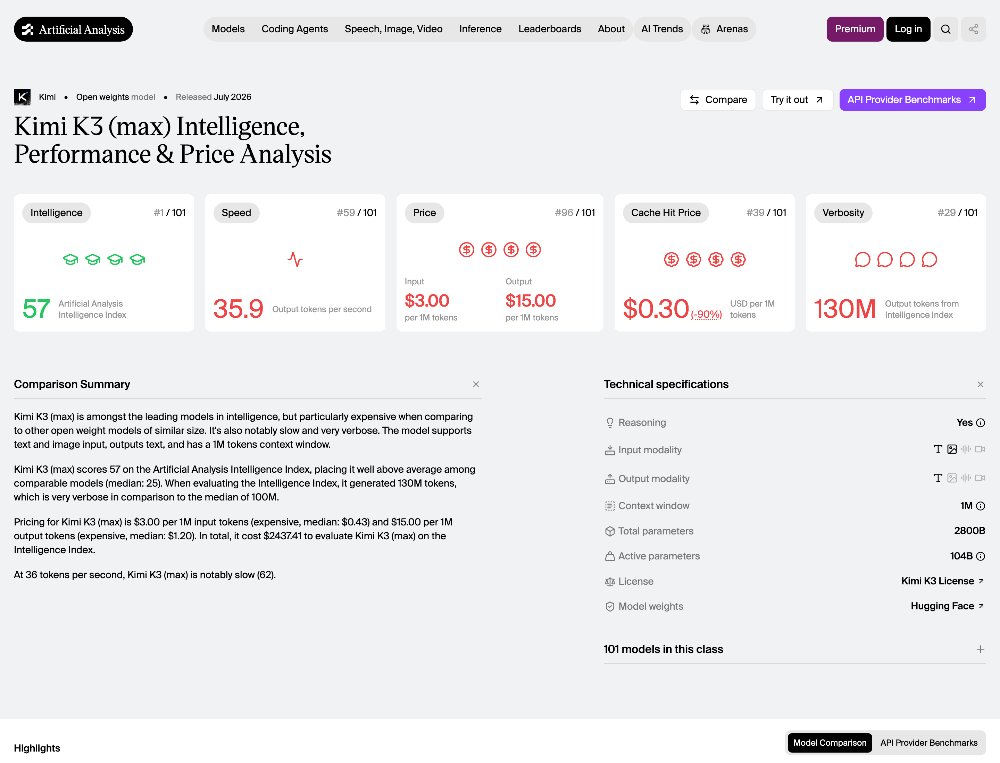{fig-alt="Artificial Analysis Kimi K3 max page values on August 1 2026 showing Intelligence Index 57, about 35.9 output tokens per second, 3 dollar input and 15 dollar output price, and a one-million-token context"}

*Source: [Artificial Analysis Kimi K3 page](https://artificialanalysis.ai/models/kimi-k3/), accessed 2026-08-01. Rankings, speed, pricing, and sample counts are dynamic.*

The snapshot records an Intelligence Index of 57, output speed of approximately 35.9 tokens/s, and listed input/output prices of US$3/US$15 per million tokens. The page also shows a 1M context and 2.8T/104B parameter figures. This is not the same experiment as the paper’s cost plot: provider, load, sampling, test version, and aggregation rules may differ. The purpose of the screenshot is to preserve what the platform displayed on the access date, not to assign K3 a permanent rank.

## 11. Reading Judgment, Limitations, and Conclusion

K3 is most persuasive when it connects model structure to system constraints in the same report. Lower-bounded decay maps a finite numerical range to a Tensor Core path. Block AttnRes maps block summaries to pipeline communication. LatentMoE maps low-dimensional experts to all-to-all and weight bandwidth. QB maps global load among nearly one thousand experts to a histogram all-reduce. Separating KDA checkpoints from MLA hash blocks maps the hybrid architecture to prefix caching. Many papers treat kernels, caches, and environments as implementation detail. K3 recognizes that these details determine whether the model can be trained at all.

I remain cautious about three results. The 2.5× factor lacks a complete decomposition under equal data and equal active compute, so it is a systems-level result. The 1M claim lacks independent effective-context tests spanning task classes, evidence locations, and distractor ratios. The final value of nine-policy MOPD lacks enough comparisons among teachers, the student, offline distillation, and single-policy RL. Open weights make the first two easier to measure externally. The third depends on training environments and teacher policies and remains much harder to audit.

Reading K3 only as a “3T-class open-weight model” reduces it to scale. A more precise technical position is that it tries to place million-token model training, million-token agent rollout, and million-token serving state inside one design. Architecture creates the possibility; curriculum data teaches use; RL spends the window on long tasks; caches and sandboxes keep systems cost from overwhelming training. If any link is missing, 1M may remain only a configuration field.

That is the final reading judgment. K3 deserves study less for one composite leaderboard than for a set of interfaces that can be questioned and implemented independently. KDA’s numerical bound, AttnRes’s depth index, LatentMoE’s stability mechanisms, MOPD’s policy consolidation, and hybrid prefix caching are more concrete than the phrase “open frontier intelligence.” The evidence most likely to change this assessment will come from third-party long-context tasks, same-hardware serving measurements, small-scale training reproductions, and documented failure cases rather than another release table.

## References

- Kimi Team. [Kimi K3: Open Frontier Intelligence](https://arxiv.org/abs/2607.24653), 2026.
- Moonshot AI. [Kimi K3 official repository](https://github.com/MoonshotAI/Kimi-K3), 2026.
- Kimi Team. [Kimi Linear: An Expressive, Efficient Attention Architecture](https://arxiv.org/abs/2510.26692), 2025.
- Kimi Team. [Attention Residuals](https://arxiv.org/abs/2603.15031), 2026.
- Elango et al. [LatentMoE: Toward Optimal Accuracy per FLOP and Parameter in Mixture of Experts](https://arxiv.org/abs/2601.18089), 2026.
- vLLM. [Serving Kimi K3 at Frontier Scale](https://vllm-project.github.io/2026/07/27/k3.html), 2026.
- Artificial Analysis. [Kimi K3 (max) Intelligence, Performance & Price Analysis](https://artificialanalysis.ai/models/kimi-k3/), accessed 2026-08-01.
- Moonshot AI. [Kimi K3 License](https://github.com/MoonshotAI/Kimi-K3/blob/main/LICENSE), 2026.
- Kimi. [Official Kimi K3 Zhihu post](https://zhuanlan.zhihu.com/p/2061380200647205373), 2026.
- Zhihu user evaluation. [Kimi K3 answer](https://www.zhihu.com/question/2061204677446964906/answer/2063674631316414638), 2026.
- Tencent Cloud Developer Community. [Kimi K3 technical overview](https://cloud.tencent.com/developer/article/2714420?policyId=1004), 2026.
