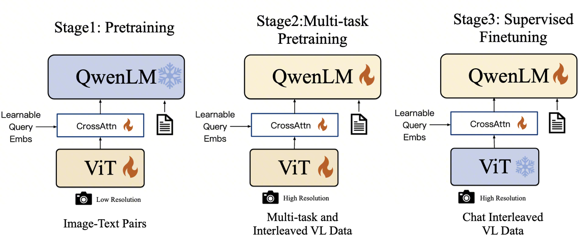
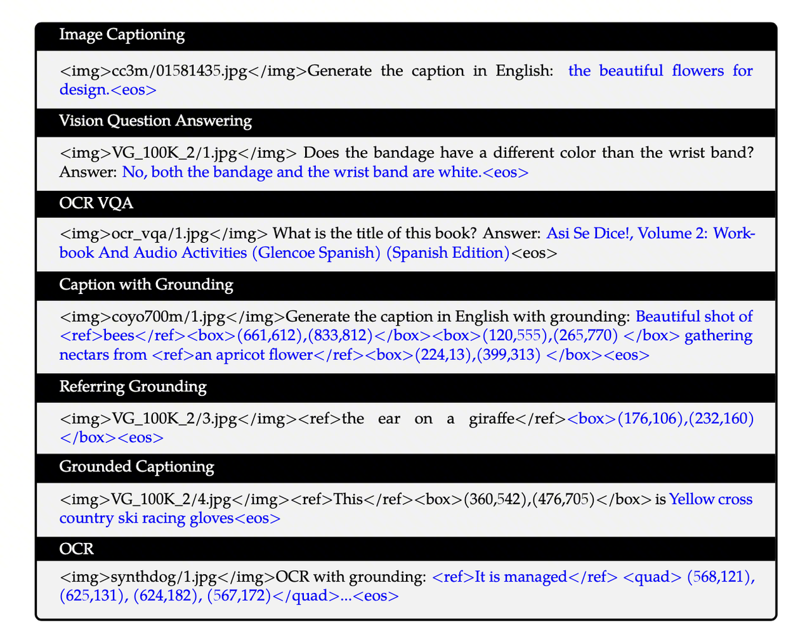
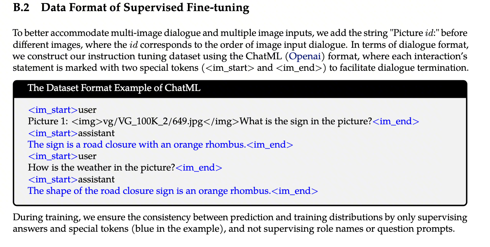
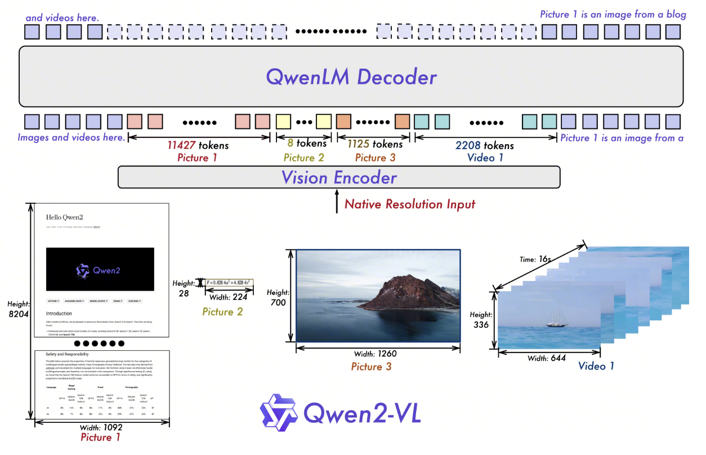
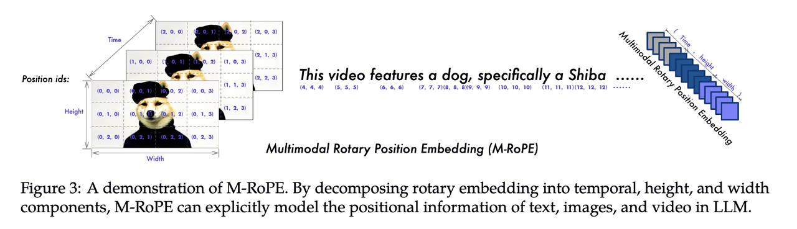
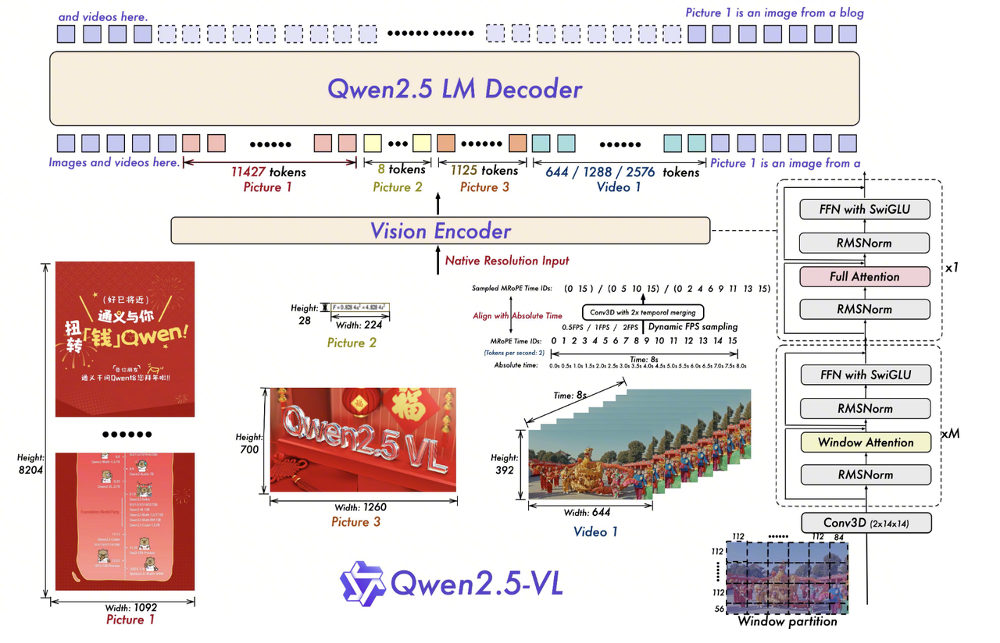

> **TL;DR:** This note traces the architectural and training changes across four Qwen-VL generations. [Qwen-VL](https://arxiv.org/abs/2308.12966) established a three-stage vision-language alignment pipeline. [Qwen2-VL](https://arxiv.org/abs/2409.12191) introduced dynamic resolution, M-RoPE, and native video input. [Qwen2.5-VL](https://arxiv.org/abs/2502.13923) addressed inference cost, physical-time modeling, and post-training data quality. [Qwen3-VL](https://arxiv.org/abs/2511.21631) moved visual injection deeper into the early LLM layers.

The Qwen-VL models are useful to study as a series because each generation directly addresses constraints introduced or exposed by the previous one. Qwen-VL first connected visual features to a language model. Qwen2-VL and Qwen2.5-VL then addressed dynamic resolution, video input, position encoding, and compute cost. Qwen3-VL shifted the question toward where and at what granularity visual features should participate in LLM computation.

| Part | Model | Main topics |
| :-- | :-- | :-- |
| Part I | [Qwen-VL (2023)](https://arxiv.org/abs/2308.12966) | Three-stage training, vision-language alignment, unified multitask modeling |
| Part II | [Qwen2-VL (2024)](https://arxiv.org/abs/2409.12191) | M-RoPE, 3D convolution, native dynamic resolution |
| Part III | [Qwen2.5-VL (2025)](https://arxiv.org/abs/2502.13923) | Window attention, dynamic FPS, rejection sampling, and CoT |
| Part IV | [Qwen3-VL (2025)](https://arxiv.org/abs/2511.21631) | Interleaved MRoPE, DeepStack, explicit timestamps |

***

# 1. Part I: [Qwen-VL](https://arxiv.org/abs/2308.12966): Three-Stage Vision-Language Alignment (2023)

Qwen-VL is based on Qwen-7B. Its main contribution is a progressive three-stage training pipeline: Align, Enhance, and Chat. Later generations changed position encoding, added video input, and expanded the training data, but retained this staged training pattern.

## 1.1. Progressive Capability Building

Training gradually relaxes parameter and task constraints. The first stage maps visual features into Qwen-7B's language space. The second adds fine-grained grounding, OCR, and VQA capabilities through multitask data. The third adjusts instruction following and conversational behavior.

This sequence balances training stability against fusion depth. Updating the LLM immediately with noisy web image-text pairs risks damaging its language capabilities. Keeping it frozen throughout training prevents it from learning the relationship between spatial information, visual details, and textual instructions.

The three objectives are:

1. **Align**: establish a basic image-text mapping.
2. **Enhance**: add grounding, OCR, chart understanding, and related abilities through multitask learning.
3. **Align with Humans**: turn the model into the instruction-following Qwen-VL-Chat.

## 1.2. Stage 1: Pre-training

The first stage trains the visual encoder and adapter to compress an image into a feature sequence accepted by the LLM. It uses roughly **1.4 billion** cleaned web image-text pairs from sources such as LAION, DataComp, and Coyo.

The sample format is:

` [visual feature sequence] </img> [text description] <eos>`

The visual encoder and adapter convert an image into 256 vectors. Qwen-7B remains frozen, while the ViT and adapter are optimized with the standard autoregressive cross-entropy objective. This stage produces coarse alignment rather than reliable grounding, OCR, or visual reasoning.

## 1.3. Stage 2: Multi-task Pre-training

The second stage introduces higher-quality annotations across seven task families. Prompts and context are excluded from the loss, while answers, captions, coordinates, and OCR text become generation targets.

| Task | Input | Target | Training signal |
| :-- | :-- | :-- | :-- |
| Image Captioning | Image and caption prompt | Caption | Image description |
| VQA | Image and question | Answer | Visual question answering |
| OCR VQA | Image and text-related question | Answer | Reading text in images |
| Caption with Grounding | Image and grounding prompt | Caption with boxes | Joint captioning and localization |
| Referring Grounding | Image and referring phrase | Box coordinates | Text-to-region localization |
| Grounded Captioning | Image and a specified box | Region description | Region-to-text description |
| OCR | Image and OCR prompt | Text with quadrilateral coordinates | Text recognition and localization |

Grounding is modeled as text generation rather than through a separate detection head. The model emits sequences such as `<ref>...</ref>`, `<box>...</box>`, and `<quad>...</quad>`. This gives up some structural priors from specialized detectors, but lets every task share the LLM's autoregressive objective.

Pure-text data is mixed into this stage to reduce catastrophic forgetting. The ViT, adapter, and LLM are all unfrozen because grounding, OCR, and chart understanding require the LLM to learn spatial relations and instruction semantics.

## 1.4. Stage 3: Supervised Fine-tuning

The third stage produces Qwen-VL-Chat. Its multimodal instruction and dialogue data includes human-authored samples and data generated with stronger models such as GPT-4. Conversations may contain one or multiple images and follow ChatML formatting.

The visual encoder is frozen again, while the adapter and LLM are trained to improve response organization, instruction following, and dialogue behavior.

Cross-entropy loss is computed only on assistant answers and special markers, not on role names or user prompts. This matches inference, where user input is context and the assistant response is the sequence to predict.

> **Part I Summary:** Qwen-VL establishes basic vision-language alignment through staged training. Its limitations are equally clear: resizing every image to 448×448 loses detail, video is unsupported, and absolute position embeddings are poorly suited to richer multimodal coordinates.

***

# 2. Part II: [Qwen2-VL](https://arxiv.org/abs/2409.12191): Native Dynamic Resolution and Multimodal Position Encoding (2024)

## 2.1. Main Changes from Qwen-VL

Qwen2-VL focuses on input representation and position encoding:

1. It removes absolute position embeddings and adopts 2D-RoPE, allowing images to retain their aspect ratios and use dynamic resolutions.
2. It introduces M-RoPE to represent text, images, and videos in a shared spatiotemporal coordinate system.
3. It uses a depth-2 3D convolution to merge 2D patches from adjacent frames into 3D tubes.
4. It expands multilingual capabilities.

The central question changes from how to connect an image to an LLM to how to assign consistent coordinates across modalities.

## 2.2. M-RoPE

M-RoPE assigns each token three position components: $(t, h, w)$. Text, images, and videos still enter the model as one sequence, but their position encoding no longer depends on a single one-dimensional index.

### 2.2.1. Computation

For input features $X \in \mathbb{R}^{B \times L \times D}$, each token has temporal, height, and width indices $P_t$, $P_h$, and $P_w$, each shaped $(B, L)$. The hidden dimension is split into three subspaces:

$$
X_t = X[\ldots, 0:D_t], \quad
X_h = X[\ldots, D_t:D_t + D_h], \quad
X_w = X[\ldots, D_t + D_h:D]
$$

RoPE is applied independently:

$$
X'_t = \text{RoPE}(X_t, P_t), \quad
X'_h = \text{RoPE}(X_h, P_h), \quad
X'_w = \text{RoPE}(X_w, P_w)
$$

The subspaces are concatenated:

$$
X_{out} = \text{Concat}(X'_t, X'_h, X'_w, \text{dim}=-1)
$$

The output remains shaped $(B, L, D)$. Temporal differences are primarily represented in $X'_t$, while row and column differences appear in $X'_h$ and $X'_w$.

### 2.2.2. Problems Addressed

#### 2.2.2.1. Incompatible Modal Dimensions

Text is one-dimensional, images have two spatial dimensions, and videos add time. Flattening every token into a one-dimensional index mixes spatial and temporal structure. M-RoPE instead uses:

- Text: $(i, i, i)$
- Image: $(1, h, w)$
- Video: $(t, h, w)$

All modalities still share the same attention space, while their native positional structure remains explicit.

#### 2.2.2.2. Position Extrapolation in Long Videos

A 1,000-frame video with 256 tokens per frame produces 256,000 tokens. A one-dimensional RoPE index would therefore exceed 250,000, far beyond a model trained only up to 32k positions.

M-RoPE decomposes this large index. The sequence may contain 250k tokens, but the temporal index may reach only 1,000 while height and width indices may remain below 16. Spatial coordinates therefore stay in a familiar range, and temporal growth does not simultaneously distort spatial positions.

### 2.2.3. Spatiotemporal Downsampling with 3D Convolution

#### 2.2.3.1. Purpose

Adjacent video frames contain substantial redundancy. Qwen2-VL uses a depth-2 3D convolution to process the same spatial region in two adjacent frames as a $2 \times 14 \times 14$ tube. This approximately halves the number of visual tokens for a fixed video duration. Images can be duplicated into two frames, allowing images and videos to share a similar input interface.

#### 2.2.3.2. Implementation

If a conventional ViT produces $N$ patches per frame, independently processing $T$ frames creates $T \times N$ tokens. The depth-2 kernel merges corresponding spatial patches from every two adjacent frames before they enter the later visual stack.

## 2.3. Training

Qwen2-VL still uses next-token prediction and computes cross-entropy only on text tokens. The LLM is initialized from Qwen2 1.5B, 7B, or 72B, while the ViT is initialized from DFN with absolute position embeddings replaced by 2D-RoPE.

### 2.3.1. Main Training Principles

#### 2.3.1.1. Stage 1: ViT Training

The first stage trains the ViT and adapter while freezing the LLM. It uses 600B tokens of large-scale weakly labeled image-text data to adapt the ViT to 2D-RoPE and align visual features with Qwen2's semantic space.

#### 2.3.1.2. Stage 2: Full-Parameter Pre-training

The second stage unfreezes all parameters and adds 800B tokens, bringing the cumulative total to 1.4T. The data covers interleaved image-text documents, OCR, video, and pure text. Native dynamic resolution, M-RoPE, and 3D convolution are active in this stage.

#### 2.3.1.3. Stage 3: Instruction Fine-tuning

The third stage freezes the ViT and trains the LLM on ChatML-formatted multimodal dialogue, long-video QA, agent trajectories, and text-only instructions. Loss is computed only on assistant responses.

> **Part II Summary:** Qwen2-VL addresses fixed image resolution and native video input. M-RoPE provides a shared coordinate system, 3D convolution reduces video tokens, and dynamic resolution avoids unnecessary resizing. These changes expose new bottlenecks: global ViT attention scales quadratically with high-resolution inputs, while video time is still represented by relative frame indices rather than physical time.

***

# 3. Part III: [Qwen2.5-VL](https://arxiv.org/abs/2502.13923): Inference Efficiency, Time Modeling, and Training Data Quality (2025)

## 3.1. Main Changes from Qwen2-VL

Qwen2.5-VL introduces window attention to control high-resolution inference cost, dynamic FPS sampling for videos with different sampling rates, and absolute-time MRoPE to align temporal positions with physical time.

## 3.2. Window Attention

Global ViT attention has complexity $O(N^2)$. Under dynamic resolution, $N$ grows with image area. Qwen2.5-VL limits most layers to local windows, making their cost approximately linear in image area.

### 3.2.1. Computation

The image dimensions are adjusted to multiples of 28 and split into $14 \times 14$ patches:

$$
L = (H/14) \times (W/14)
$$

A $112 \times 112$ pixel window contains $8 \times 8 = 64$ patches:

$$
N_{win} = \frac{L}{8 \times 8} = \frac{L}{64}
$$

Each window independently computes:

$$
\text{Attention}(Q, K, V) = \text{Softmax}\left(\frac{QK^T}{\sqrt{d_k}}\right)V
$$

Local attention weakens cross-window communication, so layers `{7, 15, 23, 31}` retain full self-attention.

## 3.3. Dynamic FPS Sampling

Video tokens are still organized as 3D tubes with a temporal stride of 2. For $T$ sampled frames at resolution $H \times W$, the token count changes from:

### 3.3.1. Computation

$$
T \times (H/14) \times (W/14)
$$

to:

$$
\frac{T}{2} \times (H/14) \times (W/14)
$$

The model can accept inputs sampled at rates such as 0.5 FPS or 2 FPS, provided that the physical time represented by each tube is encoded later.

## 3.4. MRoPE with Absolute Time

Relative frame numbers cannot distinguish whether two adjacent sampled frames are 0.1 seconds or 10 seconds apart. Qwen2.5-VL maps each visual tube to its physical timestamp:

### 3.4.1. Computation

$$
ID_t^{(i)} = \text{Round}(t_{abs}^{(i)} \times v)
$$

If $v=2$, timestamps 0.0s, 0.5s, and 2.0s map to positions 0, 1, and 4. Position IDs may therefore be discontinuous. The temporal, height, and width components are applied as:

$$
0,\quad 1,\quad 4
$$

The hidden dimension is split into temporal, height, and width subspaces:

$$
X_t = X[\ldots, 0:D_t], \quad
X_h = X[\ldots, D_t:D_t + D_h], \quad
X_w = X[\ldots, D_t + D_h:D]
$$

RoPE is then applied independently:

$$
X'_t = \text{RoPE}(X_t, ID_t), \quad
X'_h = \text{RoPE}(X_h, ID_h), \quad
X'_w = \text{RoPE}(X_w, ID_w)
$$

The three results are concatenated into the complete feature:

$$
X_{out} = \text{Concat}(X'_t, X'_h, X'_w, \text{dim}=-1)
$$

For video tokens $i$ and $j$, temporal phase differences depend on:

$$
\Delta_t = ID_t^{(i)} - ID_t^{(j)}
$$

The model can therefore distinguish physical time spans rather than only relative frame distances.

## 3.5. How the Three Mechanisms Work Together

Dynamic FPS determines which frames enter the model, and 3D tubes reduce sequence length. Absolute-time MRoPE records the physical timestamp represented by each tube. Most ViT layers then use local window attention, while a few full-attention layers exchange information across windows. Together, these mechanisms address long video sequences, irregular sampling intervals, and the cost of global attention on high-resolution inputs.

## 3.6. Difference from Swin Transformer's Shifted Windows

### 3.6.1. Cross-Window Information Exchange

Swin Transformer alternates standard and shifted windows so information propagates through overlapping regions. Qwen2.5-VL keeps fixed, non-overlapping windows in most layers and inserts a small number of full-attention layers.

### 3.6.2. Why Not Use Shifted Windows?

Dynamic image dimensions make shifted windows more expensive to implement efficiently because irregular boundaries require additional padding and masking. Fixed windows plus occasional full attention are simpler under dynamic resolution and can still use optimized kernels such as FlashAttention.

## 3.7. Training

Qwen2.5-VL uses five stages across pre-training and post-training. Its data scale expands to **4.1T tokens**, with more emphasis on high-resolution inputs, long videos, reasoning data, and preference alignment.

### 3.7.1. Pre-training

#### Stage 1: Visual Encoder Initialization

Only the redesigned ViT is trained on image-text pairs, visual knowledge data, and OCR data to establish stable visual representations.

#### Stage 2: Multimodal Pre-training

All parameters are unfrozen. Interleaved image-text data, VQA, multitask data, and pure text are trained with an **8,192-token** context.

#### Stage 3: Long-Context Pre-training

The context length expands to **32,768 tokens**. Long videos, agent trajectories, and high-resolution documents are added. Dynamic packing reduces load imbalance across samples with different visual token counts.

### 3.7.2. Post-training

#### Stage 4: Supervised Fine-tuning

The ViT is frozen and the LLM is trained on roughly **2 million** ChatML samples, split evenly between text-only and multimodal dialogue. Rule-based filtering removes duplicates and corrupt samples, while a 72B model filters image-text relevance.

For mathematics, code, and selected VQA tasks, rejection sampling generates multiple CoT candidates. Ground-truth answers or verifiers retain only correct, high-quality reasoning traces.

#### Stage 5: Direct Preference Optimization

DPO continues to freeze the ViT and optimizes the LLM from preferred and rejected answer pairs. It is used on image-text and pure-text data to reduce hallucination and improve preference alignment.

### 3.7.3. Rejection Sampling

Rejection sampling acts as Best-of-N data construction:

1. An intermediate Qwen2.5-VL generates $N$ responses for one prompt.
2. Hard verification checks final mathematical answers, code tests, or VQA ground truth.
3. Quality filters remove code switching, repetition, excessive length, and malformed outputs.
4. Retained CoT samples are added back into the SFT dataset.

This process fills in reasoning traces for datasets that contain only questions and final answers. It also produces verified samples closer to the current model's output distribution. For VLMs, visual-text consistency remains essential: a well-formatted CoT that describes objects absent from the image must still be rejected.

> **Part III Summary:** Qwen2.5-VL keeps Qwen2-VL's input representation while addressing its compute and data bottlenecks. Window attention controls high-resolution cost, dynamic FPS and absolute-time MRoPE improve video-time representation, and 4.1T tokens plus rejection sampling broaden training coverage and improve CoT data quality.

***

# 4. Part IV: [Qwen3-VL](https://arxiv.org/abs/2511.21631): Deep Vision-Language Fusion (2025)

Qwen3-VL addresses uneven frequency allocation across MRoPE axes and the limited fusion depth caused by injecting visual information only at the LLM input. Its main changes are Interleaved MRoPE, DeepStack, and explicit video timestamps.

## 4.1. Main Architectural Changes

### 4.1.1. Interleaved MRoPE

Standard MRoPE assigns contiguous embedding blocks to time, height, and width. This can restrict each axis to a particular frequency range. Interleaved MRoPE distributes the three axes throughout the embedding dimension, allowing each one to access both low- and high-frequency bands.

### 4.1.2. DeepStack

Conventional vision-language models usually project only the final ViT layer into the LLM. This interface is simple, but low-level texture and small-object information may disappear from deep semantic features.

DeepStack extracts visual tokens from multiple SigLIP-2 layers. Projected low- to high-level features are injected through residual connections into the first three LLM layers. The model gains access to both semantic and fine-grained visual features without appending additional tokens to the context sequence.

### 4.1.3. Explicit Video Timestamps

Qwen2.5-VL represents physical time through time-synchronized MRoPE, which can produce large, sparse position IDs in long videos. Qwen3-VL instead inserts textual timestamps before groups of video frames, using formats such as `<125.5 seconds>` and `<00:02:05>`. This makes time directly available in the text sequence and reduces dependence on a fixed sampling rate.

***

# 5. Summary and Open Questions

## 5.1. Technical Progression Across Four Generations

| Dimension | Qwen-VL (2023) | Qwen2-VL (2024) | Qwen2.5-VL (2025) | Qwen3-VL (2025) |
| :-- | :-- | :-- | :-- | :-- |
| **Visual encoder** | ViT + fixed resolution | ViT + native dynamic resolution | ViT + window attention | SigLIP-2 + DeepStack |
| **Position encoding** | Absolute position embedding | Blockwise M-RoPE | M-RoPE + absolute time | Interleaved MRoPE |
| **Video processing** | Unsupported | 3D convolutional downsampling | Dynamic FPS sampling | Explicit textual timestamps |
| **Training** | Three progressive stages | ViT → full parameters → SFT | Five stages with long context and DPO | Extended staged training |
| **Main change** | Basic alignment pipeline | Unified multimodal coordinates | Inference efficiency and data quality | Deep visual fusion |

## 5.2. Recurring Design Patterns

1. **Training stability comes first**: visual components are aligned before the LLM participates in more complex tasks.
2. **A unified serialized interface**: grounding coordinates, OCR text, and video timestamps are represented as text whenever possible.
3. **Time becomes increasingly explicit**: no native video support gives way to relative frame indices, absolute-time positions, and finally textual timestamps.
4. **Data quality gains importance**: the pipeline moves from web image-text pairs to multitask annotations and verified CoT generated through rejection sampling.

## 5.3. Open Questions

DeepStack shifts the question from where to attach the visual encoder to what visual granularity should participate in which LLM layers. Explicit timestamps also show that a longer context window alone does not solve video understanding; time representation and sampling strategy affect localization and long-video description stability.

Two questions remain especially important: whether deep visual injection introduces training instability or modality interference, and how well explicit timestamps generalize across sampling rates and long-video QA tasks.

***

# 6. Further Reading

**Visual encoders**

- [An Image is Worth 16x16 Words](https://arxiv.org/abs/2010.11929) (ViT)
- [Swin Transformer](https://arxiv.org/abs/2103.14030)
- [Sigmoid Loss for Language Image Pre-Training](https://arxiv.org/abs/2303.15343) (SigLIP)

**Position encoding and video modeling**

- [RoFormer: Enhanced Transformer with Rotary Position Embedding](https://arxiv.org/abs/2104.09864)
- [ViViT: A Video Vision Transformer](https://arxiv.org/abs/2103.15691)

**Vision-language fusion**

- [Flamingo: a Visual Language Model for Few-Shot Learning](https://arxiv.org/abs/2204.14198)
- [DeepStack: Deeply Stacking Visual Tokens is Surprisingly Simple and Effective for LMMs](https://arxiv.org/abs/2406.04334)
- [Visual Instruction Tuning](https://arxiv.org/abs/2304.08485) (LLaVA)

**Training and alignment**

- [Direct Preference Optimization](https://arxiv.org/abs/2305.18290)
- [Self-Rewarding Language Models](https://arxiv.org/abs/2401.10020)

**Dynamic resolution and related models**

- [Patch n' Pack: NaViT](https://arxiv.org/abs/2307.06304)
- [InternVL](https://arxiv.org/abs/2312.14238)

Su Jianlin's blog [Scientific Spaces](https://spaces.ac.cn/) provides additional derivations and discussions of RoPE, NTK-aware extrapolation, and multimodal position encoding.

*This note is based on personal paper reading and may contain omissions.*
