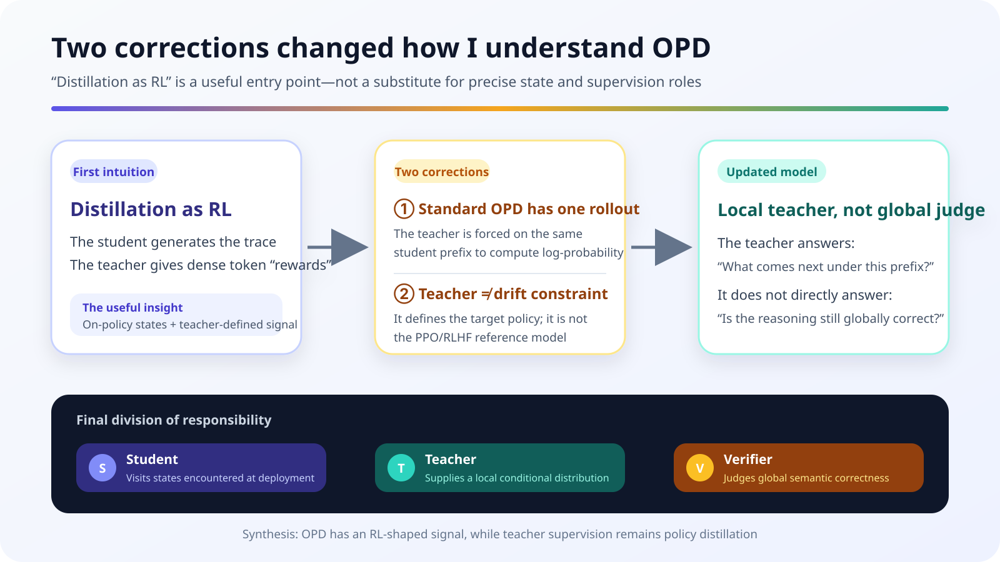
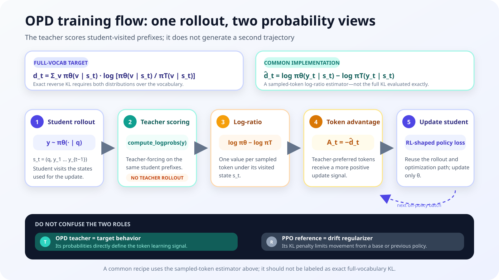
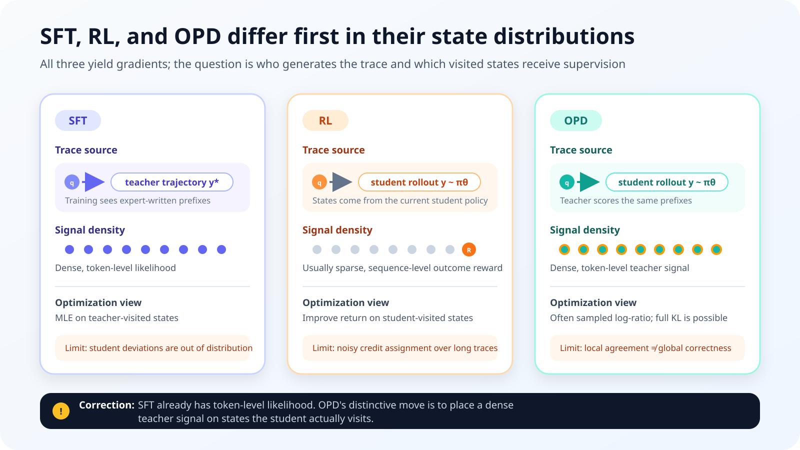
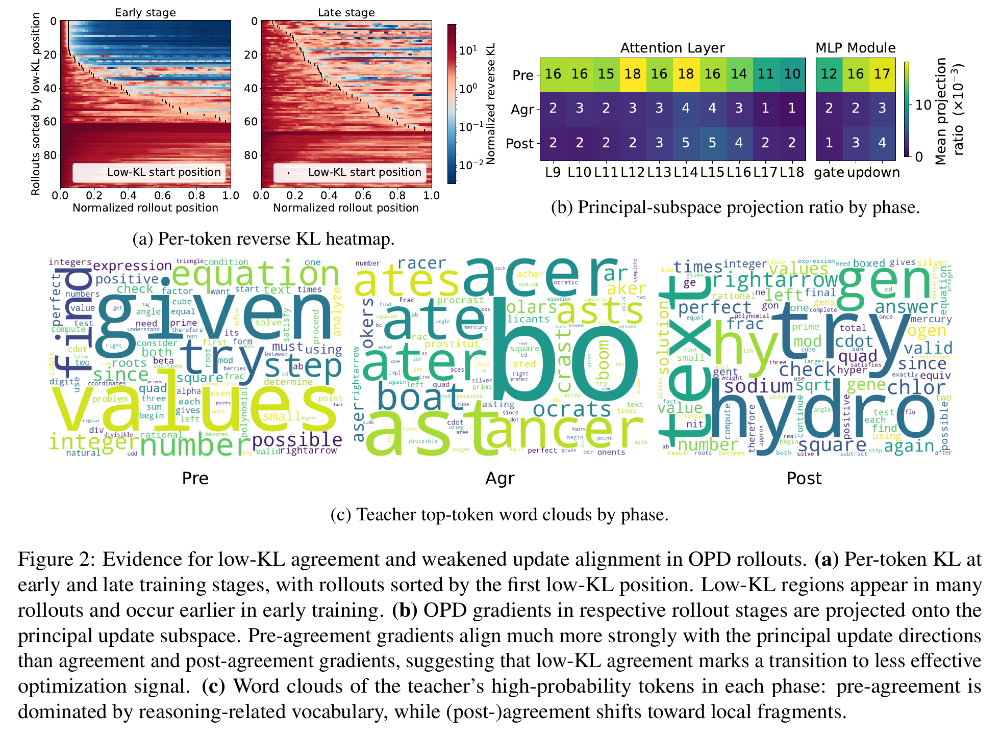
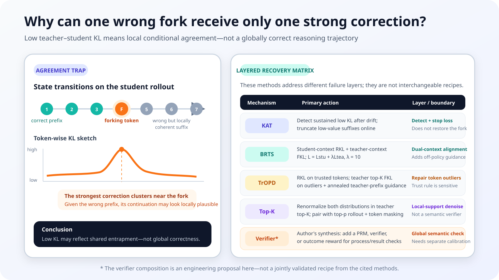
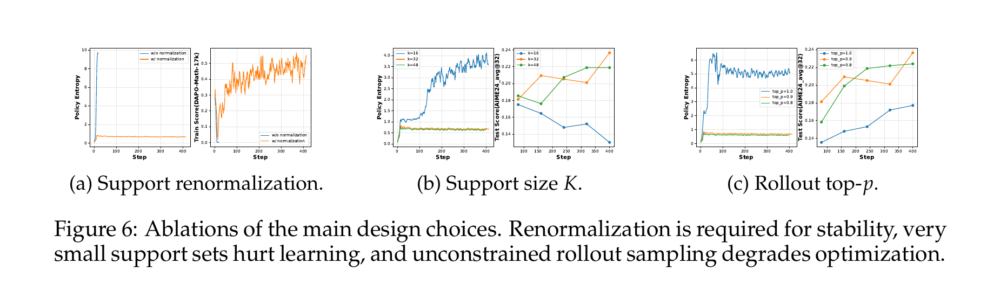

My first mental model of OPD was simple: it looked like a form of "distilled reinforcement learning." The student would generate a trajectory, the teacher would provide dense feedback on every token, and the teacher–student log-probability ratio would act as an implicit reward. Compared with RL driven by a terminal score, this appeared to move credit assignment down from the whole sequence to individual tokens. Compared with SFT, it seemed able to tell the student where its own reasoning went wrong.

That intuition captures the most useful engineering property of OPD, but it also hides two implementation errors. Standard OPD does not generate one student trajectory and one teacher trajectory and align them token by token. Only the student rolls out; the teacher is teacher-forced on the same student prefix. Nor is the teacher merely the reference model used in PPO or RLHF to limit policy drift. It is the target policy that defines where the student should move.

The more consequential correction appeared when I asked what happens after the student has already taken a wrong branch. A teacher conditional distribution answers: **given this prefix, which next tokens are plausible?** It does not directly answer: **is the reasoning state represented by this prefix globally correct?** This distinction explains why OPD can sharply penalize some forking tokens while returning to low KL later in an incorrect trajectory.

{#fig-opd-mental-model-journey-en fig-align="center" width="94%"}

I keep the distilled-RL intuition in this note, but make its objective, state distribution, and failure modes explicit. My conclusion is that OPD supplies local policy supervision on student-visited states. When a task requires deciding whether an entire reasoning path still leads to the correct result, it needs an additional state-level or outcome-level signal.

## 1. Why “distilled RL” is useful but incomplete

There is a sound reason to view OPD as RL-like training. The current student policy produces the trajectories, and an implementation can reuse rollout workers, old log probabilities, importance ratios, and a policy-gradient update path. The Thinking Machines engineering recipe places the negative student/teacher log ratio directly into the advantage field. In that sense, the teacher behaves like a state-dependent dense reward provider.

But an RL-shaped training loop does not mean the objective comes from an environment reward. In standard OPD, the teacher distribution already defines the update direction. The system does not first train a reward model and then let the policy discover any behavior that scores well. It asks the student to approach the teacher on the states that the student itself visits. With a fixed teacher, this leaves considerably less freedom than outcome-only RL.

The teacher should not be conflated with the reference model in RLHF either. A common PPO/RLHF abstraction is

$$
\max_{\theta}
\mathbb{E}_{y \sim \pi_{\theta}}[R(q,y)]
-
\beta
D_{\mathrm{KL}}
\left(
\pi_{\theta}
\,\|\,
\pi_{\mathrm{ref}}
\right)
$$

$R$ determines what the task rewards, while $\pi_{\mathrm{ref}}$ mainly prevents excessive drift from the initial behavior. Standard OPD does not split these responsibilities: $\pi_T$ is the target distribution, and reducing student-to-teacher divergence is the task itself. Calling the teacher a reference distribution is mathematically harmless, but importing the RLHF meaning can suggest that a separate reward determines what to do and teacher KL merely says how far the policy may move. That is not the standard OPD setup.

I also initially imagined that the teacher solved the same prompt separately and that the two solutions were aligned. Such alignment has no stable semantics once the reasoning chains differ in length or branch at different positions. The standard procedure is simpler:

1. Sample a response $y$ from the student on prompt $q$.
2. Hold each generated student prefix fixed and compute both student and teacher next-token distributions.
3. Compare the distributions under the same conditioning state and update only the student.

The teacher does not need to solve the prompt again. It is placed at the state the student has already reached and asked how it would distribute probability over the next token from there.

This also gives a practical implementation check: the two logit tensors at a position must correspond to the same prompt, student prefix, attention mask, and token boundary. If the teacher reads its own generated prefix, or if chat templates, special tokens, or truncation points shift the two contexts, the resulting KL no longer means “policy disagreement at one state.” The computation may still return a number and the loss may even decrease, but the supervised object has silently changed. Prefix alignment is not a data-cleaning detail in OPD; it is a precondition for the objective.

{#fig-opd-reverse-kl-training-flow-en fig-align="center" width="92%"}

This detail gives “on-policy” its meaning: the training states come from the distribution the current student actually visits, not from a set of answers written by the teacher in advance. It also creates the central limitation of the method, because the teacher must provide a conditional distribution even on student prefixes that the teacher would rarely visit under its own policy.

## 2. From full reverse KL to a sampled-token signal

For prompt $q$, write the student rollout and the state at position $t$ as

$$
y \sim \pi_{\theta}(\cdot \mid q),
\qquad
s_t = (q, y_{\lt t})
$$

On the same $s_t$, the full next-token reverse KL between student and teacher is

$$
d_t
=
D_{\mathrm{KL}}
\left(
\pi_{\theta}(\cdot \mid s_t)
\,\|\,
\pi_T(\cdot \mid s_t)
\right)
=
\sum_{v \in \mathcal{V}}
\pi_{\theta}(v \mid s_t)
\log
\frac{\pi_{\theta}(v \mid s_t)}{\pi_T(v \mid s_t)}
$$

Keeping a full-vocabulary distribution at every position makes memory scale with sequence length, vocabulary size, and batch size. Long-reasoning implementations therefore often keep only the token sampled by the student:

$$
\hat{d}_t
=
\log \pi_{\theta}(y_t \mid s_t)
-
\log \pi_T(y_t \mid s_t),
\qquad
y_t \sim \pi_{\theta}(\cdot \mid s_t)
$$

Negating that log ratio produces a local signal that fits an RL training path:

$$
A_t = -\hat{d}_t
=
\log \pi_T(y_t \mid s_t)
-
\log \pi_{\theta}(y_t \mid s_t)
$$

If the student assigns high probability to the sampled token while the teacher assigns very little, $\hat{d}_t$ is large and the update suppresses that student preference. When their probabilities are close, the update is small. Calling $A_t$ a teacher-defined dense reward is therefore useful engineering shorthand. Strictly, it is a sampled-token reverse-KL log-ratio signal, not a binary correct/incorrect label emitted by the teacher.

“Teacher-defined” does not mean that the teacher alone emits a scalar reward. $A_t$ contains both the teacher log probability and the student's own log probability. The teacher specifies the target-side preference, while the student term records how much mass the current policy placed on the sampled action. Because $y_t$ is sampled from the student, the one-token log ratio is a Monte Carlo estimate of the full RKL at that state. In a policy-gradient implementation, one must still identify which log probabilities came from the rollout policy, which were recomputed by the learner, and where importance correction applies. Otherwise a simple negative log ratio can mix estimator bias with policy staleness without immediately producing an obvious failure in the loss curve.

The full OPD objective also contains two expectations: prompts come from the training distribution, while trajectories come from the current student:

$$
\mathcal{L}_{\mathrm{OPD}}(\theta)
=
\mathbb{E}_{q \sim \mathcal{D},\,y \sim \pi_{\theta}(\cdot \mid q)}
\left[
\sum_{t=1}^{T}
D_{\mathrm{KL}}
\left(
\pi_{\theta}(\cdot \mid s_t)
\,\|\,
\pi_T(\cdot \mid s_t)
\right)
\right]
$$

Once the parameters change, the distribution of $y$ changes as well, so the same prompts lead to different training states at later steps. A strict on-policy implementation refreshes rollouts continuously. Reusing old trajectories for many epochs gradually turns the method into an approximation with stale policy data. The RL infrastructure matters not only because it exposes a convenient loss API, but because it manages versions between generation and learning.

There is a second distinction hidden under the phrase “token-level OPD.” The policy gradient of the complete sequence reverse-KL couples an action to later log-ratio terms. The common immediate-token update retains only $\hat{d}_t$ at the same position. It is biased relative to the sequence-level objective, but its removal of future-reward coupling lowers variance. [Revisiting OPD](https://arxiv.org/abs/2603.25562) derives worst-case variance bounds that scale as $O(T^2)$ for the immediate-token estimator and $O(T^4)$ for the sequence-level estimator. Sampled-token OPD is therefore not only a memory shortcut; it is an explicit bias–variance choice for long trajectories.

The correspondence matters: $O(T^2)$ is the worst-case upper bound for the immediate-token estimator, whereas $O(T^4)$ belongs to the future-coupled sequence-level estimator. These are conservative bounds under bounded rewards and bounded score gradients, not exact variance predictions for every training run. They support the narrower claim that local estimation is easier to control over long horizons. They do not make the local estimator unbiased, nor do they prove that a sequence-level objective is always unusable. If a task genuinely requires cross-step causal attribution, removing all future coupling also removes part of the signal one may want to learn.

The mode-seeking behavior of reverse KL creates a support problem as well. Because the expectation is sampled from the student, a teacher mode the student never generates receives little direct gradient. RKL can concentrate probability when the student already roughly knows the reasoning pattern; it has difficulty exposing a completely missing pattern if the student never reaches its states. SFT or FKL and OPD are therefore complementary rather than simple substitutes. The former can put correct behavior into student support, after which OPD corrects it on the student's state distribution. BRTS's teacher-context FKL and TrOPD's teacher-prefix guidance are two different responses to this gap.

## 3. SFT, RL, and OPD do not differ by whether they have a token loss

My original wording was that “SFT only shows the student what is correct, whereas OPD tells it which token is right or wrong.” That is intuitive but inaccurate. SFT also computes likelihood at every target token. The real question is **whose trajectory supplies those tokens and on which states the model receives supervision.**

On a teacher trajectory $y^T$, a standard SFT objective is

$$
\mathcal{L}_{\mathrm{SFT}}
=
-\sum_t
\log \pi_{\theta}
\left(y_t^T \mid q, y_{\lt t}^T\right)
$$

The student sees prefixes that the teacher can reach. If it deviates early at inference time, later states may never have appeared in the SFT data. OPD instead obtains $s_t$ from a student rollout, so supervision lands on states that the deployed policy is actually likely to visit. GKD combines student-generated outputs with generalized divergence objectives, while MiniLLM studies reverse KL for generative language-model distillation. These connections explain OPD more accurately than saying SFT lacks token-level feedback.

Outcome RL also visits student states, but a long trajectory often begins with one sequence-level reward. Returns, advantages, or verifiers can propagate that signal backward, yet the algorithm still has to estimate which action caused success or failure. OPD compares policy distributions at every student prefix and therefore has denser local credit. Its price is equally clear: it optimizes teacher matching rather than task success directly.

{#fig-opd-sft-rl-opd-contrast-en fig-align="center" width="96%"}

| Method | Training states come from | Feedback granularity | Direct optimization target | Main gap |
|---|---|---|---|---|
| SFT / off-policy KD | Teacher or offline trajectories | Token | Likelihood of fixed target tokens | Little coverage after student deviation |
| Outcome RL | Student rollout | Often sequence / episode | Environment, rule, or reward-model score | High-variance credit assignment over long horizons |
| OPD | Student rollout | Token / local distribution | Teacher–student policy matching | Local teacher probability is not global correctness |

I still use “distilled RL” as a mental shortcut, with one qualification: OPD is **policy distillation whose data are organized by student state visitation and whose dense local signal is defined by the teacher policy**. That is more precise than calling the teacher a reference critic.

## 4. After the forking token: local coherence is not global correctness

Consider a mathematical solution in which the student reasons correctly for several steps, flips a sign at one token, and then performs valid algebra under that false premise until it reaches a wrong answer. The teacher may strongly reject the token that causes the branch, producing high KL. Teacher forcing nevertheless continues on the already corrupted prefix. Conditional on that premise, later transformations may be locally coherent, and teacher–student agreement can rise again.

This can be read as a counterfactual continuation problem. Suppose a solution should obtain $x=3$, but the student writes $x=-3$ while rearranging an equation. The teacher may assign low probability to the minus sign at the fork. Once the prefix explicitly states $x=-3$, however, the continuation “therefore $x^2=9$” is locally valid. Teacher forcing requires the teacher to respect the supplied text condition; it does not delete the sign and restart from the correct branch. The strongest correction can therefore remain concentrated near the fork even though every later step serves the wrong conclusion.

This does not mean that the teacher failed to understand the problem. Two questions have been conflated. A conditional language-model distribution evaluates plausible continuation after a given history. A trajectory judge evaluates whether that history still satisfies the original problem constraints. The former can remain coherent inside a false world; the latter must revisit the prompt, check invariants, or execute an external computation. OPD's local credit remains valuable because it may concentrate pressure on the action that changed branches. It simply cannot turn low KL in the suffix into an endorsement of the whole path.

The Thinking Machines visualization shows exactly this pattern: a forking token that sends the reasoning down the wrong branch is penalized, while the final answer, though wrong, is predictable from the preceding corrupted sequence and receives little penalty.

{#fig-tml-forking-token-kl-en fig-align="center" width="92%"}

In probability notation, the teacher supplies

$$
\pi_T(a_t \mid s_t)
$$

If $C(s_t)=1$ denotes that the current state still lies on a path that can reach the correct result, a different quantity is needed to answer the semantic question:

$$
P\left(C(s_t)=1\right)
$$

These are not equivalent. A capable language model can produce a grammatical and logically consistent continuation under a false assumption. That capability itself can make KL small in an incorrect suffix.

This is why I no longer read a per-token KL heatmap as an error-location map. High KL may mark a genuine reasoning fork, but it may also reflect formatting, tokenization, or stylistic differences. Low KL can mean the student has learned, or it can mean both policies agree inside the same low-value local state. KL measures distributional disagreement; it does not contain a semantic verdict.

Combining KL with outcomes produces at least four observations that demand different interventions:

| Local KL | Trajectory / state result | More plausible interpretation | What not to do automatically |
|---|---|---|---|
| Low | Correct | Student is close to teacher; supervision may be saturated | Declare the data worthless only because its gradient is small |
| High | Incorrect | Possible forking token or distributional outlier | Treat every high-KL token as a semantic error |
| Low | Incorrect | Local coherence, agreement trap, or shared teacher failure | Use agreement as evidence of correctness |
| High | Correct | Multiple valid paths, wording, tokenizer, or special-token difference | Suppress an effective alternative path without inspection |

This table also shows why one KL threshold cannot be a general error detector. KAT relies on sustained windows, sufficient depth, an adaptive threshold, and the paper's gradient evidence. TrOPD treats extreme mismatch as an estimator-reliability problem. Both are more disciplined than equating high KL with wrong and low KL with right.

## 5. The agreement trap: when sustained low KL means weak supervision

[KAT](https://arxiv.org/abs/2606.09471) names the latter regime the low-KL agreement trap. The paper partitions rollouts into pre-agreement, agreement, and post-agreement phases, then projects phase-specific gradients onto the principal update subspace. Figure 2 shows weaker alignment for the agreement and post-agreement segments. Across the analyzed early and late checkpoints, more than 60% of rollouts contain at least one sustained low-KL region.

{#fig-kat-low-kl-evidence-en fig-align="center" width="96%"}

KAT does not replace the OPD loss. It changes which tokens are worth generating. It first averages reverse KL over a trailing window of $W$ positions:

$$
z_t
=
\frac{1}{W}
\sum_{i=t-W+1}^{t} d_i
$$

During warmup, KAT records the minimum window score from each complete rollout and keeps recent values in a FIFO buffer. Later thresholds are dynamic quantiles of that buffer rather than a fixed hand-tuned KL constant. After an initial exemption length, termination is triggered only when $T$ consecutive windows remain below the threshold, which prevents isolated dips from punctuation or lexical choices from ending a rollout.

The effect is concrete: once sustained agreement is detected, the remaining suffix is neither generated nor used for OPD updates. The paper uses Qwen3-8B as teacher and Qwen3-1.7B-Base and Qwen3-4B-Base as students, comparing KAT with standard OPD on AMC, MATH500, MinervaMath, and AIME24. Aggregated over the two student scales, avg@$k$ rises from 30.27 to 31.08, a relative gain of 2.66%; pass@$k$ rises from 54.74 to 56.62, a relative gain of 3.43%; and mean rollout length falls from 1,480 to 596 tokens, a reduction of 59.73%. These results support filtering weak suffixes. They do not imply that every low-KL token should be masked.

{#fig-opd-agreement-trap-recovery-en fig-align="center" width="96%"}

## 6. Four corrections for four different failures

These methods are often grouped as “OPD improvements,” but they do not address the same fault. KAT removes suffixes that have ceased to be useful. BRTS restores exposure to correct teacher contexts. TrOPD controls outlier gradients caused by teacher–student mismatch. Local support matching makes the one-sampled-token estimator less brittle. Treating them separately makes their compatibility clearer.

| Method | Main diagnostic | Intervention | OPD property retained | Not directly solved |
|---|---|---|---|---|
| KAT | Sustained low-KL windows | Terminate the suffix online | Original loss and student prefixes | How to recover a correct trajectory |
| BRTS | Teacher-rollout correctness and student overlap | Add teacher-context FKL | Student-context RKL | Reliability of the correctness signal itself |
| TrOPD | Teacher/student acceptance ratio and outliers | Region-specific RKL and top-$K$ FKL; annealed teacher prefix | Fully on-policy generation at the end | Global semantic correctness |
| Local support matching | Teacher top-$K$ support | Renormalized truncated RKL inside the support | Student rollouts and local updates | Truth of a corrupted prefix |

Placed by failure layer, the methods occupy four different axes. KAT manages compute allocation and token selection; BRTS manages state coverage; TrOPD manages gradient reliability under a large distribution gap; local support matching manages local distribution estimation. They may be complementary, but composability does not guarantee additive gains. An aggressive KAT trigger can remove opportunities for BRTS or a verifier to observe recovery. Teacher-prefix guidance changes the rollout state distribution and therefore the scale used to calibrate a KAT threshold. Top-$p$ sampling can reduce outliers and shift the fraction of tokens that TrOPD classifies as trusted.

A combined experiment should therefore begin with a falsifiable failure hypothesis and the smallest intervention. If the dominant pattern is a long wrong suffix with sustained low KL, test KAT first. If correct trajectories almost never enter student support, add teacher context. If loss spikes concentrate in a few extreme ratios, repair the estimator. If KL and task accuracy remain decoupled, introduce an independent verifier. Each component then has a measurable responsibility rather than disappearing into one aggregate score.

### 6.1 KAT: stop paying for low-value suffixes

KAT makes a deliberately narrow claim. It does not assert that it finds the first semantic error, and it does not require an additional process reward model. It reuses reverse KL already computed by OPD and detects sustained agreement after sufficient rollout depth. Once the trigger fires, generation stops.

This is a rollout-allocation method. It saves student and teacher forward computation and removes the suffix from backpropagation. It does not turn the truncated suffix into a correct trajectory. If the objective is to teach recovery from a bad state, termination alone is insufficient. KAT answers “is this segment still worth training on?” rather than “where is the correct path?”

### 6.2 BRTS: cover both student and teacher contexts

[BRTS](https://arxiv.org/abs/2605.09725) retains the standard student-context branch and adds a teacher-context branch. The first applies reverse KL on student prefixes and continues to cover states the student visits. For the second, BRTS samples multiple teacher trajectories, prioritizes correct answers, and among correct candidates selects the one whose top-$K$ behavior is closest to the student. If all unconditional teacher samples fail, a ground-truth-conditioned recovery attempt is used to elicit a natural derivation.

The two branches also use opposite KL directions:

$$
\mathcal{L}_{\mathrm{stu}}
=
\mathbb{E}
\left[
D_{\mathrm{KL}}
\left(
\pi_S(\cdot \mid s^S_t)
\,\|\,
\pi_T(\cdot \mid s^S_t)
\right)
\right]
$$

$$
\mathcal{L}_{\mathrm{tea}}
=
\mathbb{E}
\left[
D_{\mathrm{KL}}
\left(
\pi_T(\cdot \mid s^T_t)
\,\|\,
\pi_S(\cdot \mid s^T_t)
\right)
\right]
$$

$$
\mathcal{L}_{\mathrm{BRTS}}
=
\mathcal{L}_{\mathrm{stu}}
+
\lambda \mathcal{L}_{\mathrm{tea}},
\qquad
\lambda = 10
$$

Student-context RKL means “correct me where I go”; teacher-context FKL means “expose me to correct support that my current policy may not reach.” The paper uses $\lambda = 10$, but the value depends on how the two losses are normalized and is not a portable constant. Best-of-N selection also adds teacher generation cost. BRTS trades that cost for a more reliable correct trajectory; it does not obtain recovery for free.

### 6.3 TrOPD: use RKL in the trust region and change estimators on outliers

[TrOPD](https://arxiv.org/abs/2606.01249) targets a different instability. Under a large teacher–student gap, sampled-token log ratios can create extreme policy-gradient outliers. Borrowing the acceptance probability from speculative decoding, the method classifies a student token as teacher-verifiable with

$$
P_{\mathrm{trust}}(x)
=
\min
\left(
\frac{\pi_T(x)}{\pi_S(x)},
1
\right)
$$

Trusted tokens retain sampled-token RKL. Outliers are not forced through the same signal; TrOPD approximates FKL over the teacher top-$K$ set. The paper also evaluates clipping and masking, but its complete objective keeps teacher-supported information in outlier regions rather than discarding all of it.

TrOPD adds teacher-prefix guidance as well. A teacher-generated prefix is followed by a student continuation, and the teacher portion receives FKL supervision. The maximum teacher-prefix length is annealed to zero with a cosine schedule, making generation fully on-policy by the end of training. This is not a permanent replacement of OPD with off-policy SFT. It is a scaffold that is gradually removed as the student returns to a region the teacher can supervise reliably.

### 6.4 Teacher top-$K$ local support matching: one sampled token should not represent a distribution

[Revisiting OPD](https://arxiv.org/abs/2603.25562) starts from the estimator and implementation. It identifies an imbalanced one-token signal, unreliable teacher guidance on student prefixes, and tokenizer or special-token mismatch. At each prefix, its method first selects the teacher top-$K$ support:

$$
S(s_t) = \mathrm{TopK}_{\pi_T}(s_t)
$$

Teacher and student are then renormalized separately inside that support:

$$
\hat{\pi}_S(v \mid s_t)
=
\frac{\pi_S(v \mid s_t)}
{\sum_{u \in S(s_t)} \pi_S(u \mid s_t)},
\qquad
\hat{\pi}_T(v \mid s_t)
=
\frac{\pi_T(v \mid s_t)}
{\sum_{u \in S(s_t)} \pi_T(u \mid s_t)}
$$

The method computes truncated RKL over this local support. Renormalizing both policies is essential: the Figure 6 ablation collapses rapidly without it, while a support that is too small or a completely unconstrained rollout also destabilizes training. The paper therefore combines the objective with top-$p$ rollout sampling and special-token masking. Top-$p$ reduces the chance of sampling extremely unlikely tokens and entering unreliable prefixes; masking removes false conflicts caused by incompatible tokenization or control-token conventions.

{#fig-revisiting-opd-ablation-en fig-align="center" width="94%"}

The single-task math setting uses a Qwen2.5-7B-Instruct student, an OpenThinker3-7B teacher, and the English subset of DAPO-Math-17K. Under the same top-$p$ rollout condition, standard sampled-token OPD obtains 21.6 AIME24 avg@32, while teacher top-$K$ local support matching obtains 23.6. The multi-task experiment keeps the Qwen2.5-7B-Instruct student and alternates math and ALFWorld batches; OpenThinker3-7B teaches math, while GiGPO-Qwen2.5-7B-Instruct-ALFWorld teaches the agentic task. Relative to standard sampled-token OPD, the unmasked local-support method raises mean pass@1 over five math benchmarks from 34.8 to 41.7, a relative gain of 19.8%, while ALFWorld success rate rises from 90.6 to 95.3. Those values remain tied to the reported models, task mixture, and evaluation protocol.

## 7. OPD plus a verifier: an engineering hypothesis from this note

None of the four corrections turns teacher next-token probability into a global truth evaluator. To judge whether the current reasoning state is still correct, a natural extension is a PRM, an executable verifier, or an outcome reward. The following combination is my engineering hypothesis based on signal responsibilities. It is not a unified algorithm jointly validated by KAT, BRTS, TrOPD, and Revisiting OPD.

One possible decomposition is

$$
r_t^{\mathrm{total}}
=
\alpha r_t^{\mathrm{OPD}}
+
\beta r_t^{\mathrm{state}}
+
\gamma R^{\mathrm{outcome}}
$$

$r_t^{\mathrm{OPD}}$ governs the local action distribution: is the next token close to what the teacher prefers under this prefix? A PRM or executable check supplies $r_t^{\mathrm{state}}$ for intermediate constraints. $R^{\mathrm{outcome}}$ checks the final answer, unit tests, or task completion. These signals have different label granularities and failure modes; they should not be added without calibration.

The state signal itself needs a stricter definition than “does this sentence look right?” An intermediate state can be on a correct path, wrong but recoverable, or already irrecoverable. A binary PRM often collapses the latter two into one negative label and may teach abandonment rather than correction. If recovery is part of the objective, the verifier should ideally identify the violated constraint and the onset of failure, or at least predict recoverability. Evaluation should then measure what happens after the first detected error, not only the final pass/fail label.

Teacher–verifier disagreement should remain an explicit event. High teacher probability with a verifier rejection may mean that the teacher followed a corrupted prefix. Low teacher probability with verifier acceptance may mean that the student found another valid path, or that the verifier missed a defect. Adding the rewards immediately erases these cases inside an average. A safer sequence is to log the disagreement matrix, inspect final outcomes in each cell, and only then decide whether to gate updates, stage the objectives, or use the verifier solely for data selection.

For mathematics, I would prefer executable checks for equation equivalence, constraint satisfaction, and the final answer over vague language-model judgments at every step. For code, compilation, unit tests, and static constraints can provide state and outcome signals. A learned PRM becomes necessary only when no executable criterion exists, and its reward-hacking and out-of-distribution behavior then need a separate audit.

The combined system still has to answer four experimental questions. Does the verifier repair corrupted prefixes or simply overpower the teacher distribution? Does held-out pass rate rise when local KL falls? Does truncation delete trajectories that could have recovered? When teacher and verifier disagree, which signal determines the update? Without these ablations, a larger loss function demonstrates component count, not solved global credit assignment.

## 8. How I would implement and observe the training loop

I would not monitor total loss alone. At minimum, the system should retain four families of measurements: sampled log ratios or local-support KL by position, rollout depth and termination reason, student/teacher entropy and top-$K$ overlap, and final verifier or outcome results. Reports should split correct from incorrect trajectories, pre-agreement from agreement and post-agreement phases, and ordinary from outlier tokens. A global mean can easily mix an agreement trap with a small number of extreme gradients.

An auditable token record should also make its conditioning state recoverable: prompt ID, rollout-policy version, learner version, prefix hash, token ID, both log probabilities, masking reason, trust or termination decision, and final outcome. Without those fields, “KL fell while accuracy declined” cannot be separated into shared entrapment, teacher/student tokenization misalignment, or stale-policy rollout data. To contain storage cost, aggregate statistics can be kept for all tokens while high-ratio events, low-KL incorrect trajectories, and teacher–verifier conflicts are retained through stratified sampling.

I would begin with a minimal baseline rather than integrating every correction at once. The first stage would establish task support with SFT or FKL and freeze one prompt, decoding, and evaluator configuration. The second would add sampled-token OPD with position-level log-ratio, entropy, gradient-norm, and outcome logging. The third would select one correction from the observed failure: KAT when cost is dominated by long low-value suffixes; TrOPD when high-KL outliers create optimization spikes; BRTS when the student rarely reaches correct states; local support matching when the one-token signal is overly sensitive to sampling or tokenization. Changing one principal mechanism at a time preserves attribution.

For a verifier experiment, I would keep the teacher, rollout policy, and training-token budget fixed and compare pure OPD, OPD with a state signal, OPD with an outcome signal, and their combination. Alongside pass@$k$, I would report recovery rate: after a trajectory first enters a state marked wrong by the verifier, how often does it return to a solvable state? I would also report false-intervention rate: how often does the verifier or truncation break a trajectory that would otherwise finish correctly? The first metric measures whether global feedback repairs behavior; the second measures the cost of that repair.

Initialization deserves separate treatment. Reverse KL is mode-seeking over support that the student already visits. If the student assigns negligible probability to the target reasoning modes, student rollouts may never expose them. Building support first with SFT, FKL, or a teacher-context branch is more plausible than applying sampled-token RKL directly to a weak checkpoint. The Thinking Machines experiments likewise start from models with relevant pre- and mid-training capabilities; they do not claim that OPD creates a missing capability from scratch.

I would also define three stopping criteria for the experiment. First, if KL keeps falling while held-out task success stalls, teacher matching may have detached from the task objective. Second, if the outlier fraction or gradient-clipping rate keeps rising, the teacher–student gap has exceeded the reliable range of the estimator. Third, if rollout length falls together with pass@$k$, the truncation rule may be mistaking temporary agreement for an irrecoverable low-value suffix.

These diagnostics are more informative than “OPD loss converged.” The loss only confirms that the two policies became closer on the observed local distributions. Deployment asks whether the student can maintain correct states independently and recover after a deviation.

## 9. The updated mental model

I would now rewrite my original intuition as follows:

> OPD is an on-policy post-training method at the boundary between policy distillation and RL infrastructure. The student rolls out under its current policy. The teacher does not generate a separate canonical answer for token alignment; it supplies a next-token distribution on the exact prefixes visited by the student. Full or approximate reverse KL gives the student dense, local, teacher-defined supervision. That signal improves token-level credit assignment, but it does not prove that the current reasoning state is globally correct.

The shorter version is:

> **The student visits the real states, the teacher supplies local conditional distributions, and the verifier carries global semantic correctness.**

This does not mean every OPD system needs a verifier. When teacher and student are close and the task mainly values behavioral imitation, pure OPD may be sufficient. The boundary is narrower: a plausible continuation under a corrupted prefix is not validation of that prefix. Once those two ideas are separated, KAT's termination, BRTS's teacher-context support, TrOPD's trust region, and local support matching's estimator correction each occupy a distinct place.

My next experiment would not begin by adding another loss. I would plot KL, a state verifier, and final outcome along the same rollouts. If the three signals agree near a forking token while only KL remains low in the agreement suffix, this mental model will have an evidence chain rather than merely an appealing explanation.

## References

1. [On-Policy Distillation](https://thinkingmachines.ai/blog/on-policy-distillation/), Thinking Machines Lab, 2025.
2. [GKD: Generalized Knowledge Distillation for Auto-regressive Sequence Models](https://arxiv.org/abs/2306.13649), Agarwal et al., 2023.
3. [MiniLLM: Knowledge Distillation of Large Language Models](https://arxiv.org/abs/2306.08543), Gu et al., 2023.
4. [Escaping the KL Agreement Trap in On-Policy Distillation](https://arxiv.org/abs/2606.09471), Xin et al., 2026.
5. [On-Policy Distillation with Best-of-N Teacher Rollout Selection](https://arxiv.org/abs/2605.09725), Zhang et al., 2026.
6. [Trust Region On-Policy Distillation](https://arxiv.org/abs/2606.01249), Xing et al., 2026.
7. [Revisiting On-Policy Distillation: Empirical Failure Modes and Simple Fixes](https://arxiv.org/abs/2603.25562), Fu et al., 2026.
