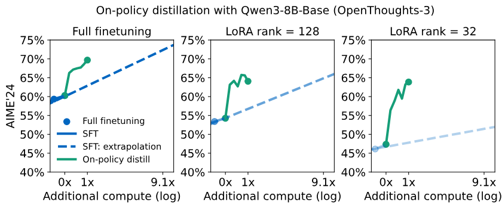
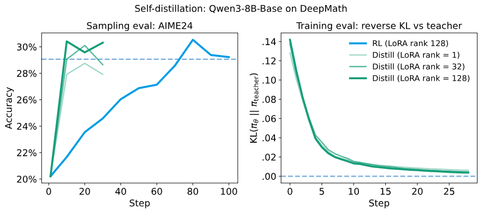

Large model development often looks like a competition over model architectures and training algorithms. In the post-training trenches, however, the harder work is usually about data sources, stage handoff, and capability conflicts.

This is especially true in collaborative post-training. The most straightforward workflow is to let each person own one capability area, prepare their own SFT data, and merge everything into one final training set. A slightly more advanced version is to train adapters or expert models separately, then try weight averaging, adapter stacking, or mixed training.

These methods are simple, and they have been useful for a while. But they often run into a familiar problem:

> A single capability looks good when trained alone. Once it enters the merged release pipeline, the overall result starts squeezing capabilities against each other.

While reading recent technical reports from several model teams, I noticed that many of them have started to place the same technique in a key post-training position.

- Qwen3 uses OPD to train lightweight models, compressing the reasoning ability of flagship models into smaller models.
- GLM-5 uses OPD to repair capability forgetting after multi-stage RL.
- Xiaomi MiMo-V2 uses multi-teacher OPD to integrate expert abilities in math, code, and general dialogue.
- DeepSeek-V4 goes further and directly replaces the traditional mixed RL stage with OPD.

Different teams and different scenarios all point to the same keyword: **OPD, On-Policy Distillation**.

This note mainly covers three things:

1. The post-training problem OPD solves.
2. How Qwen3, GLM-5, MiMo-V2, and DeepSeek-V4 use it.
3. Why OPD is valuable as a capability integration interface.

::: {.callout-note title="One-sentence takeaway"}
OPD matters because it combines on-policy distribution matching, dense distillation supervision, and logit-space capability integration.
:::

In other words, it bypasses many capability interference problems that are hard to handle in parameter space. My core view is: **language model capabilities are easier to merge, transfer, and preserve in logit space than in parameter space.**

## Three layers of large model training

Before discussing OPD, it helps to organize the layers of large model training. Roughly speaking, there are three layers.

The bottom layer is **pre-training**. This is the stage that consumes massive GPU resources and feeds the model trillions of tokens. It gives the model language ability, world knowledge, and basic reasoning patterns. It is like building the general foundation first.

The middle layer is **mid-training**. This layer injects more explicit domain knowledge. Code, medicine, finance, and enterprise knowledge bases can all be reinforced here.

The top layer is **post-training**, which is the focus of this note. It turns the base model into a usable system: instruction following, mathematical reasoning, code generation, dialogue style, tool use, and agent behavior are all calibrated here.

If post-training is done well, a small model can beat a larger general model in a specific specialty. This is why teams are willing to invest in post-training: deployment is cheaper, iteration is faster, and privacy is easier to control.

But the premise is that the post-training method must be chosen well.

## Two old routes in post-training

Post-training has two broad routes: on-policy training and off-policy training.

**On-policy training** lets the model generate trajectories from its current policy, then assigns rewards based on the result. For example, in a math task, the model generates the full reasoning process and answer, and the system returns a reward based on the final answer or the process.

Its advantage is that the training distribution comes from the model itself, so the training state is closer to the real inference state. The problem is also clear: feedback is too sparse.

The model may generate a 1,000-token solution process and only receive one final signal: "wrong." The error might come from early modeling, one algebraic step, or just final arithmetic. But the final reward can hardly point to the responsible position. This is one reason pure RL has low sample efficiency.

**Off-policy training** uses externally prepared answers and asks the model to imitate high-quality samples. The typical example is SFT: reference data is already written, and the model only needs to fit those trajectories.

Its advantage is dense signal and stable training. The problem is that the model learns contexts from reference trajectories, not the contexts it will encounter while generating by itself. Once the model makes an early deviation, later states gradually drift away from the training distribution. This is exposure bias, and it becomes especially visible in long-sequence tasks.

We can translate this into a code review analogy:

- Pure RL is like only checking the final CI status. The tests failed, but it is hard to know which line introduced the issue.
- Off-policy distillation is like reading a standard PR that has already passed review. The example is clean, but it may not cover the intermediate states you actually reach during development.
- OPD is closer to doing line-by-line review on the current PR. The trajectory comes from the current model, and the feedback lands on that trajectory.

This is the core of OPD: **let the model sample from its own distribution, then let a reference model provide dense feedback at every step on that trajectory.**

## The key of OPD: on-policy + dense signal

OPD combines the strengths of the two old routes.

It follows RL's on-policy sampling, letting the model generate trajectories from its current distribution and reducing distribution mismatch. It also keeps the dense supervision of distillation, where the reference model provides probability feedback for each token.

The three methods can be compared directly:

| Method | Sampling distribution | Feedback density | Main issue |
|---|---|---|---|
| SFT / off-policy distillation | Reference data distribution | Dense | Inference may deviate from the training distribution |
| RL | Current model distribution | Sparse | Low sample efficiency, rewards can be exploited |
| OPD | Current model distribution | Dense | Depends on teacher quality and needs extra teacher forward passes |

During training, the current model first generates its own trajectory. The reference model then computes the probability distribution for every token on that trajectory. The current model is updated by minimizing the **reverse KL** against the reference model:

$$
D_{\mathrm{KL}}\left(\pi_{\theta} \parallel \pi_{\mathrm{teacher}}\right)
= \sum_i \pi_{\theta}(x_i)
\log \frac{\pi_{\theta}(x_i)}{\pi_{\mathrm{teacher}}(x_i)}
$$

Here $\pi_{\theta}$ is the current model policy, $\pi_{\mathrm{teacher}}$ is the reference model policy, and $x_i$ denotes candidate tokens. Intuitively, on the tokens the model would generate by itself, it keeps pulling its probability distribution toward directions approved by the reference model.

### Why reverse KL

KL has two directions. Forward KL tends to cover all possible outputs from the reference model, encouraging the current model to learn a bit from many reference modes. This objective is more comprehensive, but not necessarily friendly to small models. With limited capacity, trying to learn everything may leave the model good at nothing.

Reverse KL has a mode-seeking property. The current model focuses more on learning the high-probability modes most endorsed by the reference model.

This is suitable for reasoning tasks. Many math problems do not require the model to average over every possible derivation style. They require it to find one teacher-approved path and follow it steadily.

The MiniLLM paper was an early systematic use of reverse KL for LLM distillation, and its experimental conclusion matches intuition: **the smaller the target model, the more obvious the advantage of reverse KL.**

::: {.callout-tip title="Practical meaning of reverse KL"}
A small model is not just a smaller copy of a large model. Its capacity budget is tighter. Instead of averaging over all possible behaviors from the reference model, it should first learn the most certain, stable, and valuable paths.
:::

Another attractive point of OPD is that it is less prone to reward hacking than ordinary RL. The KL signal comes from the reference model distribution. The current model either moves closer to it or away from it; it is hard to "cheat" with strange strategies.

If an RL framework already exists, connecting OPD is not very costly. The core change can be understood as replacing group-normalized advantage with the log ratio between the reference model and the current model.

```python
# Initialize teacher client.
teacher_client = service_client.create_sampling_client(
    base_model = teacher_config.base_model,
    model_path = teacher_config.load_checkpoint_path,
)

# Sample trajectories.
trajectories = do_group_rollout(student_client, env_group_builder)
sampled_logprobs = trajectories.loss_fn_inputs["logprobs"]

# Compute reverse KL signal.
teacher_logprobs = teacher_client.compute_logprobs(trajectories)
reverse_kl = sampled_logprobs - teacher_logprobs
trajectories["advantages"] = -reverse_kl

# Train with the existing RL path.
training_client.forward_backward(trajectories, loss_fn = "importance_sampling")
```

## Where OPD's efficiency comes from

First, consider a set of numbers that illustrates the point well. On the AIME'24 math reasoning benchmark, starting from the same off-policy distillation checkpoint:



| Method | AIME'24 | Compute |
|---|---:|---:|
| Off-policy distillation | 60.0 | 1x |
| Pure RL | 67.6 | 10x |
| OPD | 74.4 | 1x |

My view is that OPD's efficiency advantage mainly comes from training signal density.



Pure RL may need to generate many trajectories before extracting a useful direction from the final reward. OPD provides teacher probabilities as feedback on every token. A sequence that originally had only one scalar reward can now contribute training signal across hundreds or thousands of tokens.

Qwen3 reduces the GPU time for lightweight model training to about one tenth of the flagship four-stage RL process. The same logic is behind that result. For teams that need to produce small models at scale, this is not a small optimization. It is a cost restructuring at the training-paradigm level.

## Four teams, four usages

The basic idea of OPD is not complicated, but each team makes different implementation choices. These differences show that OPD is not a single recipe, but a set of post-training tools that can be composed.

### Qwen3: compress flagship capability into lightweight models

Qwen3's scenario is pragmatic: the flagship model goes through the full post-training process, while lightweight models no longer repeat the same expensive RL pipeline. Instead, they absorb flagship model capability through OPD.

It uses a two-stage design:

1. First perform off-policy distillation, so the lightweight model obtains basic problem-solving patterns.
2. Then perform on-policy distillation, so the lightweight model is corrected by the reference model on its own trajectories.

This order is important. The quality of the OPD signal depends on trajectories generated by the current model itself. If the model is too weak at the beginning, reference feedback mainly corrects noise instead of transferring capability.

Qwen3's positioning can be summarized as: **OPD is an efficient substitute for lightweight model training.**

### GLM-5: use OPD to repair forgetting after multi-stage RL

GLM-5 faces another kind of problem: different RL stages can conflict with each other.

After Reasoning RL, Agentic RL, and General RL are executed sequentially, later general capability improvement may erode the reasoning capability accumulated earlier. This is catastrophic forgetting in post-training.

GLM-5 places OPD at the final finishing stage. It uses checkpoints from previous stages as reference models, lets the current model sample from its own distribution, and restores the capabilities that were lost.

There is also a neat engineering point here: GRPO usually needs a large group size for within-group comparison. But OPD's advantage comes directly from the teacher log ratio and does not require within-group comparison, so the group size can drop to 1, the batch size can grow, and throughput improves.

GLM-5's positioning can be summarized as: **OPD is a capability repair tool after multi-stage post-training.**

### MiMo-V2: integrate multi-teacher capability in logit space

MiMo-V2 addresses the see-saw effect: math gets stronger and code may get weaker; code gets stronger and general dialogue may suffer.

At its core, this is multiple objectives pulling against one another in the same parameter space. Different tasks have inconsistent gradient directions, so mixed RL can easily improve one side while hurting another.

MiMo-V2 follows this route:

1. Start with general SFT.
2. Train domain experts with independent RL to avoid interference during training.
3. Use multi-teacher OPD to integrate capabilities in logit space.

It also adds ORM, or Outcome Reward Model, on top of the KL signal. KL provides token-level direction, while ORM ensures the final answer aligns with verifiable outcomes.

The most interesting part is that the final model surpasses individual experts on some benchmarks. This is not mysterious: after multi-teacher fusion, the model learns a synthetic capability from several experts rather than the ceiling of a single expert.

MiMo-V2's positioning can be summarized as: **OPD is a multi-expert capability fusion tool.**

### DeepSeek-V4: use full-vocabulary KL for large-scale unification

DeepSeek-V4's scenario is heavier: it needs to integrate more than ten independently trained expert models, and each domain also has variants with different reasoning intensities.

Parameter merging dilutes capabilities, while mixed RL runs into the see-saw effect. DeepSeek-V4 makes a more radical choice and gives the unification stage to OPD.

Its biggest difference from many teams is the use of **full-vocabulary KL**, instead of token-level KL approximation only on sampled tokens.

Token-level KL is cheaper, but has higher variance. When the number of teachers grows, accumulated noise makes the loss less stable. Full-vocabulary KL gives more accurate gradients, but the memory and compute pressure is huge: vocabulary size, sequence length, and teacher count all amplify the cost.

So DeepSeek-V4 pairs this with teacher weight scheduling, hidden-state caching, and specialized kernels. The engineering complexity is clearly higher, but this kind of investment is reasonable in ultra-large-scale multi-teacher distillation.

DeepSeek-V4's positioning can be summarized as: **OPD is a large-scale expert knowledge compressor.**

## Design philosophy behind the differences

Putting the four teams together reveals several key divergences.

| Dimension | Lightweight route | Heavy engineering route | My view |
|---|---|---|---|
| KL granularity | Token-level KL | Full-vocabulary KL | Small-scale use should prioritize efficiency; large-scale multi-teacher use needs stable gradients |
| Reward signal | KL only | KL + ORM | Pure distillation is enough when the teacher is reliable; add reward when external verification is needed |
| Teacher choice | Single teacher / same-architecture checkpoint | Multi-teacher / expert collection | Single teacher is simple and stable; multi-teacher is better for capability fusion |
| Pipeline position | Lightweight model subflow / final repair stage | Main integration stage / unification stage | OPD can be a cost-reduction tool or a capability integration tool |

This is why OPD is worth attention. It is not one team's trick, but a basic capability that can be embedded into different post-training pipelines.

## Logit space as an integration interface

Traditional knowledge integration is often done in parameter space: weight merge, adapter stacking, or mixed RL. The problem is that capabilities are hard to separate in parameter space, and interference between experts is almost unavoidable.

OPD changes the angle. Expert models can remain independent, and knowledge flows into the target model as logit distributions. The target model still only updates its own parameters, but the learning signal comes from reference model judgments on its current trajectories.

This is like having multiple review systems act on a trajectory that is being generated. Each expert does not need to participate in parameter merging. It only needs to provide judgment on the distribution it is good at. The model that completes the actual integration is still the target model itself.

So I think OPD's value is not merely "saving GPU." It points to a broader direction in training design:

::: {.callout-important title="A larger judgment"}
Capability integration in post-training does not always have to happen in parameter space. In many cases, logit space may be the more natural, stable, and scalable interface.
:::

## Boundaries of OPD

Of course, OPD also has clear boundaries.

First, it strongly depends on teacher quality. If the teacher has systematic defects, OPD will faithfully transfer and may even amplify them. Teacher selection, data filtering, and task domain definition remain core work.

Second, it lacks exploration ability. OPD is imitation, not discovery. Pure RL may explore new strategies not covered by the teacher, while OPD is better at stable transfer of existing strong capabilities. In practice, a more reasonable workflow is often: RL explores, OPD compresses and integrates.

Third, long-sequence cost becomes higher. OPD needs the reference model to run forward passes on trajectories from the current model. The longer the sequence, the higher the compute and memory pressure on the reference model. Segmented sampling can help, but it does not solve the root issue.

Fourth, it is sensitive to model initialization. If the model is too weak, on-policy trajectories are low quality, and reference feedback becomes more like noise correction. Qwen3's "off-policy distillation first, then OPD" design is essentially solving this cold-start problem.

## Closing thoughts

The rise of OPD is not accidental.

It hits three post-training pain points at the same time: low signal density, distribution mismatch, and capability interference. More importantly, it provides a reproducible and scalable way to think about capability integration.

I now understand OPD in one sentence:

> The trajectory comes from the current model, and the direction comes from a strong reference model.

This sentence sounds simple, but it is powerful in post-training. It explains OPD's efficiency advantage over pure RL, its mitigation of exposure bias compared with off-policy distillation, and how multi-teacher knowledge can avoid the mess of parameter merging and instead integrate in logit space.

If you are working on model post-training, OPD deserves serious study. It may not fit every scenario, but understanding its tradeoffs will change how you view the goal of post-training: you are not only training a model, but also designing an interface for capabilities to flow.

## References

1. Qwen3 Technical Report (arXiv 2505.09388)
2. GLM-5: from Vibe Coding to Agentic Engineering (arXiv 2602.15763)
3. MiMo-V2-Flash Technical Report (arXiv 2601.02780)
4. DeepSeek-V4 Technical Report
5. On-Policy Distillation, thinkingmachines.ai
6. MiniLLM: Knowledge Distillation of Large Language Models via Reverse KL Divergence (ICML 2024)
7. DAGGER: An Algorithm for Reduction of Expert Failures
8. Process Reward Modeling: Learning to Verify without Multi-Agent Oracles
9. thinkingmachines.ai/blog/on-policy-distillation/
