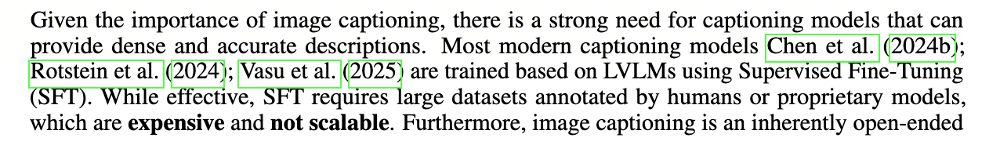
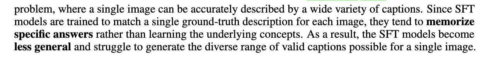
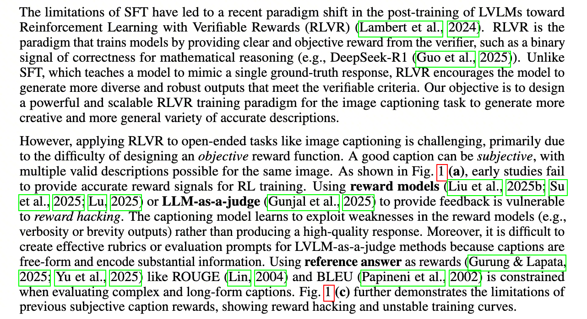
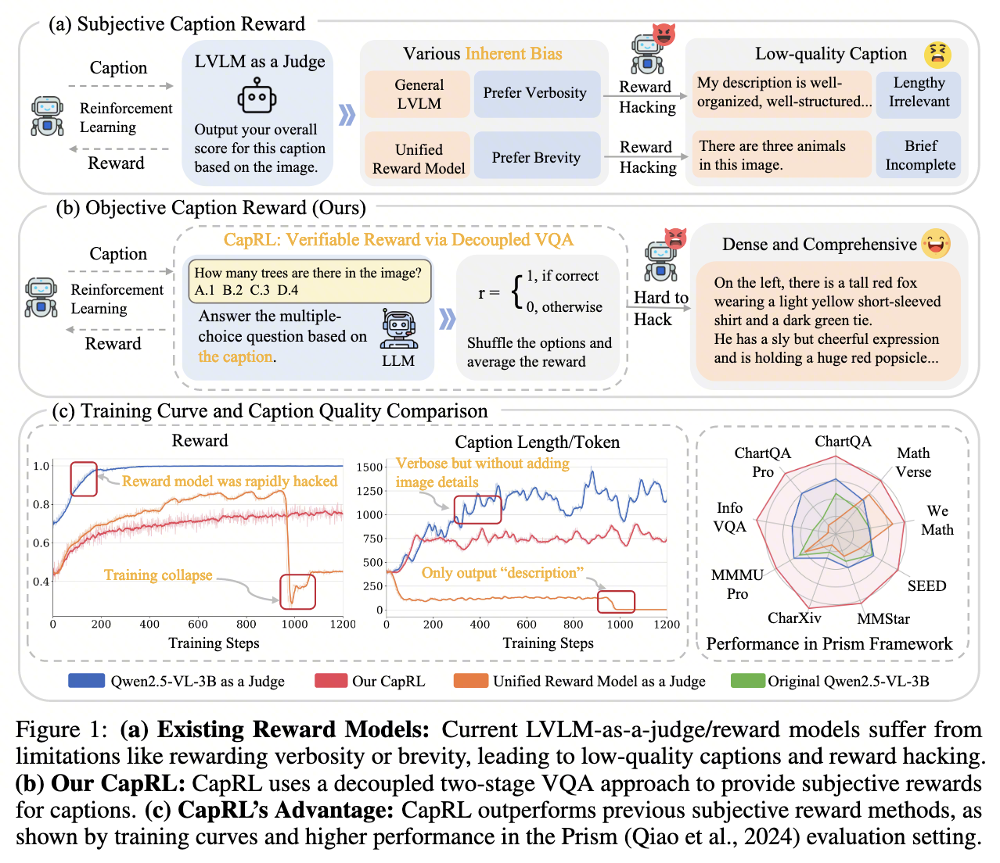
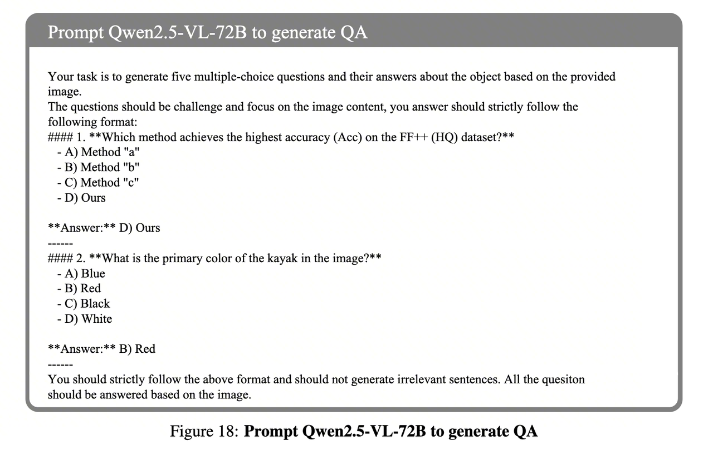
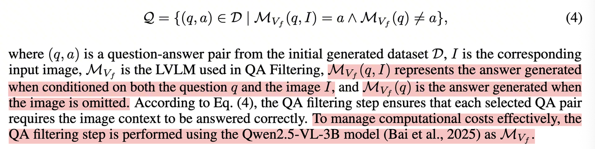
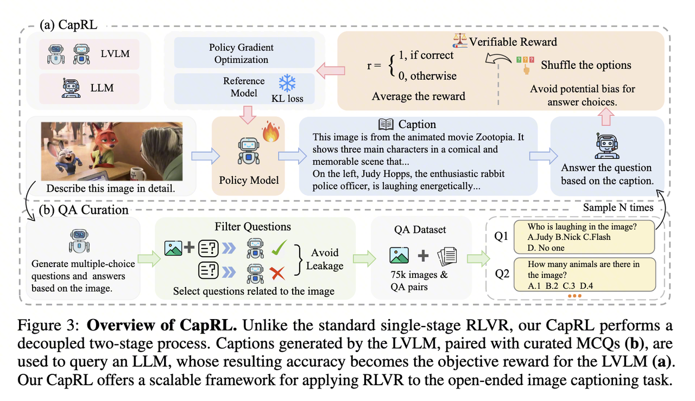
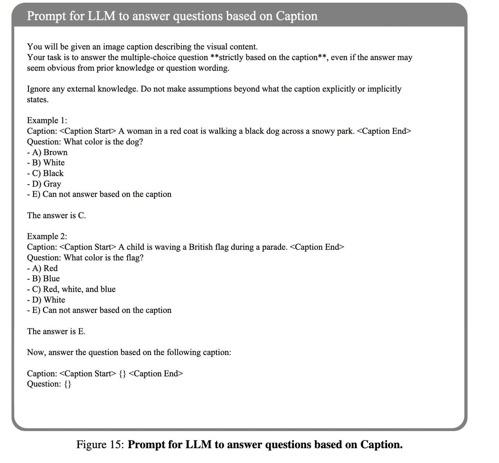

::: {.callout-note title="Paper Information"}
- **Paper**: [CapRL: Stimulating Dense Image Caption Capabilities via Reinforcement Learning](https://arxiv.org/pdf/2509.22647) (CVPR 2025)
- **Authors**: Xing et al.
- **Summary**: CapRL evaluates captions through the MCQ accuracy of a vision-free LLM, turning subjective caption-quality scoring into a verifiable reward for training image-captioning models.
:::

# 1. Introduction: Defining Rewards for Image Captioning

The training objective for image captioning is easy to state, but its evaluation criteria are not. Describing only the main subject yields too little information; adding more details raises the risk of hallucination. Dense captioning therefore requires a balance between information coverage and factual accuracy, not an optimization target based on length or writing style.

Traditional approaches usually begin with supervised fine-tuning (SFT) on human-written captions. High-quality dense captions are expensive to annotate, and a fixed training set covers only a limited range of valid descriptions. Text-overlap metrics such as BLEU and ROUGE also struggle to measure completeness and factual accuracy.





RL lets a model explore descriptions beyond the annotated distribution, but it does not solve the evaluation problem by itself. If the reward still comes from another model's subjective score, the policy model may optimize the evaluator's preferences instead of caption quality. CapRL focuses on redesigning this reward.

# 2. The Problem with Existing RL Methods: Reward Hacking

Existing methods often use another LVLM as a judge and ask it to score the image-caption pair. That score mixes content coverage with length, writing style, and organization. A general-purpose LVLM may favor longer, more detailed answers, while some reward models prefer short and clean outputs. Once the policy model discovers these preferences, it can increase the reward without improving the caption.



## 2.1 Biases of the "Judge"

An LVLM-as-a-Judge reward is not a pure factuality check. It combines content coverage, writing style, length, and organization into a single score. Once that score becomes an RL reward, the model prioritizes whichever features are easiest for the judge to recognize.

The paper compares two biases that point in opposite directions. Qwen2.5-VL-3B used as a judge favors verbose descriptions, while the Unified Reward Model favors concise outputs. The direction differs, but the failure is the same: a composite score does not separate factual coverage from presentation style.

## 2.2 How the Policy Model Exploits the Reward

The policy model can exploit these biases. When facing a judge that rewards verbosity, it may produce text that appears well structured but says little about the image:

```text
# When the judge favors verbosity
Output: "My description is well organized. First, I would like to explain..."
Result: High score, but no meaningful image description

# When the judge favors brevity
Output: "There are three animals in the image."
Result: High score, but very little information
```

These outputs are reward hacking: the reward rises while the target task does not improve. Continued training may collapse, causing caption length to explode or shrink until almost no information remains. CapRL therefore stops judging overall caption quality directly and instead tests whether the caption supports a task with checkable answers.

# 3. CapRL's Reward Design

CapRL gives a functional definition of a good caption:

> A high-quality caption should allow a text-only LLM that cannot see the image to answer questions about that image using only the caption.

MCQs compress open-ended evaluation into checkable answers. Long but irrelevant text does not supply those answers, while missing colors, counts, or spatial relationships causes direct failures. Changing the question distribution can also change which visual information receives reward. The word "verifiable" needs a boundary, however: only information covered by the question set is verified, not every dimension of caption quality.



## 3.1 Subjective Caption Reward

The left side of the figure shows the conventional subjective reward pipeline. After the policy model generates a caption, the caption and image are passed to an LVLM-as-a-Judge, which returns a composite score as the RL reward.

The judge can produce a score, but that score has no single clear meaning. It rewards stylistic properties such as being "detailed," "concise," or "well organized" alongside factual content, and the policy model follows those preferences. The paper's results are direct: a verbosity-seeking judge induces "Lengthy Irrelevant" text, while a brevity-seeking reward model induces "Brief Incomplete" descriptions.

## 3.2 Objective Caption Reward: CapRL's Approach

CapRL computes rewards through decoupled VQA. First, the policy model generates a caption from the image. Then, a text-only LLM that cannot see the image reads the caption and the corresponding MCQs and attempts to answer them. The more questions it answers correctly, the higher the caption reward.

The vision-free constraint makes this design work. The evaluator cannot bypass the caption and answer directly from the image. If the caption omits colors, counts, spatial relationships, or visible text, the LLM loses points on the corresponding questions.

## 3.3 Training Curves and Caption Quality

The reward curve on the left and the caption-length curve in the middle primarily illustrate training stability.

- The blue curve uses Qwen2.5-VL-3B as the judge. Its reward quickly reaches 1.0 while caption length grows rapidly, matching the pattern of attacking the reward with verbose output.
- The orange curve uses a Unified Reward Model as the judge. Training collapses after the reward rises, and caption length falls close to zero.
- The red curve represents CapRL. Its reward changes more smoothly, and caption length neither explodes nor collapses.

The radar chart on the right reports results under the Prism Framework across ChartQA, MathVerse, SEED, and other benchmarks. CapRL outperforms the original model and the other two reward-training approaches on most dimensions. This figure alone does not establish that MCQ rewards generally outperform subjective rewards. It does show that, under the paper's training and evaluation setup, CapRL avoids obvious reward hacking without sacrificing downstream multimodal performance.

# 4. Building a High-Quality MCQ Dataset

The MCQ dataset determines the valid scope of CapRL's reward. If a question can be answered without looking at the image, even a poor caption may receive a reward. If the image itself does not support the answer, the reward becomes noise. The paper therefore constructs image-related MCQs and explicitly filters samples with information leakage.

## 4.1 Stage One: Image Collection

The images come from open datasets such as ShareGPT4V-1M and DenseFusion-1M, as well as web-collected natural photographs, documents, charts, and user interfaces.

After collection, the data undergoes quality and safety filtering. Low-resolution, overly simple, violent, and sexual samples are removed. The researchers also remove images that are highly similar to common evaluation benchmarks to reduce benchmark leakage.

## 4.2 Stage Two: Question-Answer Generation

For each image, Qwen2.5-VL-72B generates multiple image-related MCQs and their correct answers.



## 4.3 Stage Three: Question-Answer Filtering

The filtering stage removes questions that do not depend on visual information. For example, if an image contains a sign reading "Eiffel Tower" and the question asks, "What is the capital of France?", a model can answer "Paris" using common knowledge alone. Such a question cannot test whether the caption preserves image information.

The paper uses a two-sided verification mechanism:

1. **Positive verification:** Give the LVLM the image and question, and require it to answer correctly. To reduce cost, the filtering stage uses Qwen2.5-VL-3B. This condition ensures that the question is related to the image and that the image supports the answer.
2. **Negative verification:** Give the same LVLM only the question, without the image, and require it to answer incorrectly. This condition removes questions that can be solved using language patterns or common knowledge alone.

A question-answer pair `(q, a)` is retained only if it satisfies both conditions. The paper expresses the filtering rule as:



- `Q` is the final filtered dataset.
- `(q, a)` is a question-answer pair.
- `D` is the initially generated dataset.
- `Mv(q, I) = a` means that the model answers `a` correctly when given image `I` and question `q`.
- `Mv(q) ≠ a` means that the model cannot answer `a` correctly when it sees only question `q`.

# 5. Method

CapRL separates caption generation from reward calculation. An LVLM generates a caption from the image, and a vision-free LLM answers questions from that caption. The reward comes from answer correctness rather than a judge's overall impression.



## 5.1 Stage One: The LVLM Generates a Caption

The trainable policy model is Qwen2.5-VL-3B. It receives an image and a captioning instruction, such as "Describe this image in detail," then generates a candidate caption.

## 5.2 Stage Two: A Vision-Free LLM Answers Questions

The candidate caption and the image's corresponding MCQs are passed to an independent text-only LLM, Qwen2.5-3B-Instruct. This model cannot access the image and must rely entirely on the information contained in the caption.



## 5.3 Reward Calculation

The text-only LLM answers each question using the caption. A correct answer receives 1, and an incorrect answer receives 0. The average accuracy across all questions becomes the reward for that caption.

For a generated caption $c$ and a question set $\{q_1, q_2, ..., q_n\}$:

$$
R(c) = \frac{1}{n}\sum_{i=1}^{n}\mathbb{1}\left[\text{LLM}(c, q_i) = a_i\right]
$$

where:

- $c$ is the generated image caption.
- $q_1, q_2, ..., q_n$ is the corresponding question set.
- $a_i$ is the correct answer to the $i$-th question.
- $\mathbb{1}[\cdot]$ is an indicator function that returns 1 when the condition is true and 0 otherwise.

This reward tests whether the caption contains the information required to answer the questions. More accurate descriptions of object counts, spatial relationships, chart content, and visible text usually produce higher answer accuracy.

## 5.4 Model Optimization

After computing the reward, CapRL uses GRPO to update the first-stage LVLM. The model repeatedly generates captions, receives feedback from the second-stage reward mechanism, and updates its parameters accordingly.

The complete loop is:

```text
Generate caption -> Evaluate objectively -> Receive reward -> Optimize model -> Generate a new caption
```

# 6. Method Value and Cost Transfer

The most useful part of CapRL is not the use of GRPO for caption training. It is the construction of an analyzable reward interface for an open-ended description task. Question-answer accuracy is not a complete measure of caption quality, but it makes failures easier to diagnose than a judge's composite score and is harder to exploit with irrelevant rhetoric. In the paper's examples, the CapRL-trained model covers charts and complex scenes more thoroughly, producing descriptions closer to intermediate representations for question answering.

The method reduces SFT's dependence on fixed caption annotations, but it does not eliminate data cost. The cost moves from manually writing dense captions to image collection, MCQ generation, positive and negative verification, and extra inference during training. Question quality and filtering-model capability directly affect the reward, and every caption triggers multiple MCQ inferences. An automated pipeline is not necessarily an inexpensive one.

# 7. Method Analysis

## 7.1 Where the Effectiveness Comes From

CapRL works because its reward better matches the function of a caption, not simply because it applies RL to captioning. Image captioning compresses visual information into text. A traditional judge asks whether the text is "good," mixing style, length, completeness, and accuracy. CapRL asks whether the text supports answering questions about the image, producing a narrower criterion that is easier to use for training.

Open-ended generation is difficult to evaluate directly, while closed-form verification is comparatively easier. MCQ answers are either correct or incorrect, producing a clearer reward signal than subjective scoring. The tradeoff is that the reward covers only what the question set asks about. Visual information not represented by the questions does not naturally enter the optimization objective.

Separating the caption-generating LVLM from the question-answering text LLM forces the evaluator to extract evidence from the caption. Visually irrelevant rhetoric has little direct value, and the reward becomes closer to a test of whether image information was actually written down.

## 7.2 From Caption Rewards to Functional Verification

CapRL's idea can be summarized as follows: when direct quality evaluation is difficult, define the quality of an upstream artifact through its performance on a downstream task.

| Task | Analogous Application |
| :-- | :-- |
| Document summarization | A good summary should support answering questions about the source document |
| Knowledge graph construction | A good knowledge graph should support multi-hop reasoning queries |
| Code documentation generation | Good documentation should help developers use an API correctly |
| Data annotation | Good annotations should support accurate downstream predictions |

This approach suits tasks where the generated artifact is difficult to score directly but can be validated through functional tests. Its risk is equally clear: once the proxy task drifts from the original task, reward hacking remains possible. The attack surface simply moves from the judge's style preferences to the distribution of the question set.

## 7.3 Limitations and Open Questions

MCQ coverage determines what the model learns. If the question set focuses heavily on object recognition, the model may emphasize categories, counts, and positions while neglecting atmosphere, narrative relationships, or fine-grained stylistic information. The question-generation strategy therefore becomes a new inductive bias.

Caption quality is not equivalent to question-answer accuracy. MCQs do not fully capture readability, logical organization, redundancy control, or language fluency. Optimizing only answer correctness may still produce captions that contain the required information but are unpleasant to read.

The evaluator LLM's capability also limits the method. If the text-only LLM has weak reasoning or inconsistent instruction following, the reward becomes noisy. If it can guess answers from patterns in the options, the reward becomes contaminated. Positive and negative verification alleviate some of these problems but cannot eliminate them.

The computational cost is also significant. Every caption triggers inference over multiple MCQs, making training more expensive than standard SFT. Practical use requires a tradeoff among question count, evaluator-model size, and reward stability.

# 8. Conclusion

CapRL replaces a subjective composite caption score with a concrete functional test: can a text-only LLM answer image-related questions using only the caption? Its training curves show that this reward avoids the two forms of length collapse induced by the judges tested in the paper.

Two supporting designs make the method workable. First, MCQs are filtered using the rule "answerable with the image, unanswerable without it" to reduce common-knowledge and language-cue leakage. Second, GRPO trains the VLM to generate dense captions that better support question answering.

My main takeaway is that CapRL is more useful as a reward-design case study than as just another caption-training method. Mathematical rewards are naturally verifiable; caption rewards require a deliberately constructed question set. The resulting interface is clearer than LVLM-as-a-Judge, but its boundary is equally clear: the model reliably optimizes only what the question set covers.

# 9. Further Reading

For more on RLHF and reward-model design:

- **RLAIF**: [Constitutional AI](https://arxiv.org/abs/2212.08073), Anthropic 2023, replaces human feedback with AI feedback.
- **RLVR**: [DeepSeek-R1](https://arxiv.org/abs/2501.12948), reinforcement learning with verifiable rewards.
- **Self-Rewarding LM**: [Meta 2024](https://arxiv.org/abs/2401.10020), uses model self-evaluation for iterative improvement.

*These are personal paper-reading notes; corrections and suggestions are welcome.*
