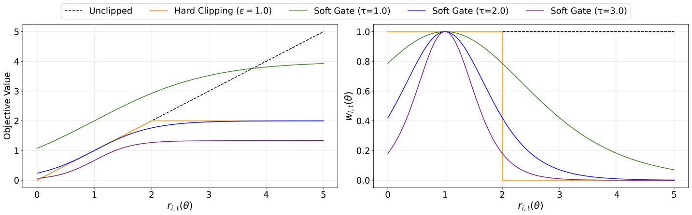
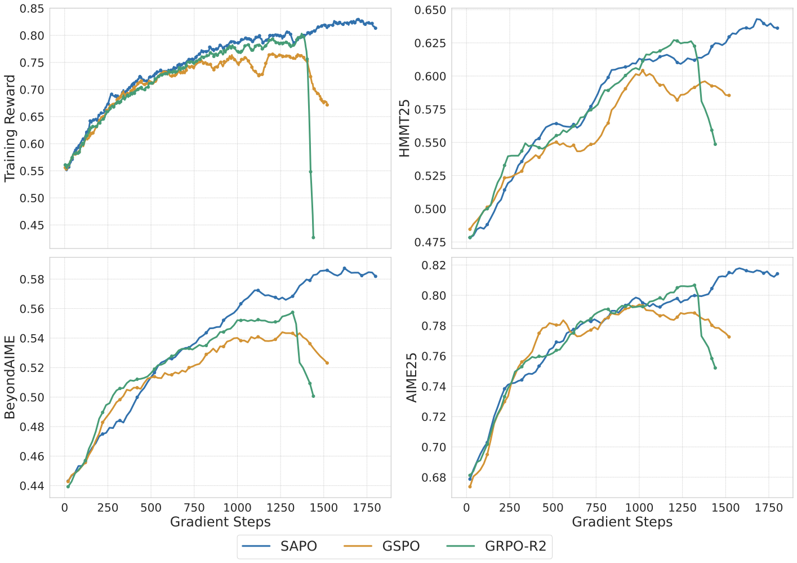
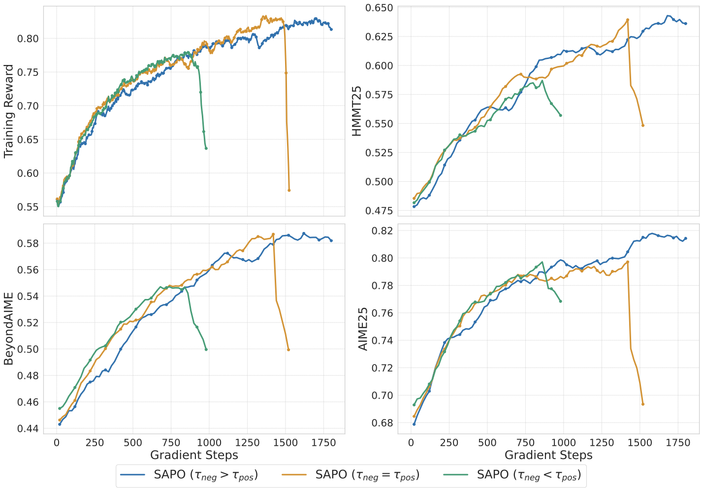
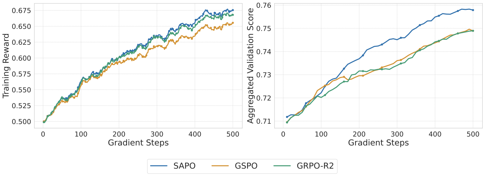

::: {.callout-note title="Paper Information"}
- **Paper**: [Soft Adaptive Policy Optimization](https://arxiv.org/abs/2511.20347)
- **Authors**: Chang Gao, Chujie Zheng, Xiong-Hui Chen, et al., Qwen Team
- **Related report**: [Qwen3-VL Technical Report](https://arxiv.org/abs/2511.21631)
- **Central question**: How can an optimizer suppress high-variance off-policy updates without discarding token-level gradients that still carry useful learning signal?
:::

SAPO, or Soft Adaptive Policy Optimization, addresses a specific optimization problem in group-based reinforcement learning. After a rollout batch is reused for several updates, the current policy drifts away from the behavior policy, and token-level importance ratios move away from 1. GRPO blocks dangerous updates with hard clipping, while GSPO applies a related constraint at the sequence level. In both cases, a fixed boundary can remove the gradient entirely once the ratio crosses it.

SAPO does not redesign the reward or the advantage estimator. It changes the function applied to the importance ratio in the surrogate objective: hard clipping becomes a sigmoid soft gate centered at $r=1$. The gradient sees a smooth bell-shaped weight that decreases with policy deviation. Positive and negative advantages use different temperatures so that negative updates, which spread across the vocabulary, are attenuated more aggressively.

This note focuses on four questions: how the soft gate enters the objective, why its gradient weight equals 1 at the on-policy point, what motivates the asymmetric temperatures, and how far the reported stability evidence supports the paper's claims.

# 1. What Gradients Does Hard Clipping Remove?

## 1.1 Token-Level Clipping in GRPO

For a query $q \sim \mathcal{D}$, the behavior policy $\pi_{\theta_{\mathrm{old}}}$ samples a group of $G$ responses $\{y_i\}_{i=1}^{G}$. GRPO defines the token-level importance ratio as

$$
r_{i,t}(\theta)
=
\frac{
\pi_\theta(y_{i,t}\mid q,y_{i,<t})
}{
\pi_{\theta_{\mathrm{old}}}(y_{i,t}\mid q,y_{i,<t})
},
$$

and obtains a sequence-level advantage by normalizing rewards within the group:

$$
\widehat{A}_{i,t}
=
\widehat{A}_i
=
\frac{
R_i-\operatorname{mean}(\{R_j\}_{j=1}^{G})
}{
\operatorname{std}(\{R_j\}_{j=1}^{G})
}.
$$

Its clipped surrogate objective is

$$
\begin{aligned}
\mathcal{J}_{\mathrm{GRPO}}(\theta)
=
\mathbb{E}
\Bigg[
\frac{1}{G}\sum_{i=1}^{G}
\frac{1}{|y_i|}\sum_{t=1}^{|y_i|}
\min\Big(&
r_{i,t}(\theta)\widehat{A}_i,\\
&\operatorname{clip}
\left(r_{i,t}(\theta),1-\varepsilon,1+\varepsilon\right)
\widehat{A}_i
\Big)
\Bigg].
\end{aligned}
$$

One common simplification is misleading: crossing either boundary does not always zero the gradient. The active boundary depends on the sign of the advantage. Differentiating with respect to $r$ gives the effective GRPO gate

$$
f_{\mathrm{GRPO}}'(r;\widehat{A})
=
\begin{cases}
1, & \widehat{A}>0\ \text{and}\ r\le 1+\varepsilon,\\
0, & \widehat{A}>0\ \text{and}\ r>1+\varepsilon,\\
1, & \widehat{A}\le 0\ \text{and}\ r\ge 1-\varepsilon,\\
0, & \widehat{A}\le 0\ \text{and}\ r<1-\varepsilon.
\end{cases}
$$

This binary gate prevents further movement in a dangerous direction. Its cost is equally concrete: a token that has barely crossed the boundary receives the same zero weight as a severely off-policy token. Tightening $\varepsilon$ discards more samples, while loosening it admits noisier updates.

## 1.2 Sequence-Level Clipping in GSPO

GSPO uses the geometric mean of token ratios as a length-normalized sequence ratio:

$$
s_i(\theta)
=
\left(
\frac{\pi_\theta(y_i\mid q)}
{\pi_{\theta_{\mathrm{old}}}(y_i\mid q)}
\right)^{\frac{1}{|y_i|}}
=
\exp\left(
\frac{1}{|y_i|}
\sum_{t=1}^{|y_i|}\log r_{i,t}(\theta)
\right).
$$

The sequence ratio is better aligned with sequence-level rewards and reduces sensitivity to individual high-variance token ratios. However, if a few outlier tokens push $s_i$ outside the hard-clipping band, near-on-policy tokens in the same sequence lose their gradients as well. SAPO is designed to retain GSPO-like sequence coherence without giving up token-level selectivity.

# 2. SAPO's Surrogate Objective and Gradient Weight

## 2.1 A Temperature-Controlled Soft Gate

SAPO maximizes

$$
\begin{aligned}
\mathcal{J}_{\mathrm{SAPO}}(\theta)
=
\mathbb{E}
\Bigg[
\frac{1}{G}\sum_{i=1}^{G}
\frac{1}{|y_i|}\sum_{t=1}^{|y_i|}
f_{i,t}\!\left(r_{i,t}(\theta)\right)
\widehat{A}_{i,t}
\Bigg],
\end{aligned}
$$

where

$$
f_{i,t}(x)
=
\frac{4}{\tau_{i,t}}
\sigma\!\left(\tau_{i,t}(x-1)\right),
\qquad
\sigma(x)=\frac{1}{1+e^{-x}},
$$

$$
\tau_{i,t}
=
\begin{cases}
\tau_{\mathrm{pos}}, & \widehat{A}_{i,t}>0,\\
\tau_{\mathrm{neg}}, & \widehat{A}_{i,t}\le 0.
\end{cases}
$$

The factor $4/\tau_{i,t}$ is not cosmetic. It makes the derivative of the soft gate equal to 1 at $r=1$, so the on-policy update matches the unclipped policy gradient. The objective value itself does not have to equal $r$ at that point; the derivative determines the optimization direction.

## 2.2 From the Surrogate to a Weighted Policy Gradient

Define

$$
p_{i,t}(\theta)
=
\sigma\!\left(
\tau_{i,t}\left(r_{i,t}(\theta)-1\right)
\right).
$$

Differentiating $f_{i,t}$ gives

$$
\begin{aligned}
f_{i,t}'\!\left(r_{i,t}(\theta)\right)
&=
\frac{4}{\tau_{i,t}}
\cdot
\tau_{i,t}
p_{i,t}(\theta)\left(1-p_{i,t}(\theta)\right)\\
&=
4p_{i,t}(\theta)\left(1-p_{i,t}(\theta)\right).
\end{aligned}
$$

The paper denotes this derivative as the gradient weight:

$$
w_{i,t}(\theta)
=
4p_{i,t}(\theta)\left(1-p_{i,t}(\theta)\right)
=
\operatorname{sech}^{2}\!\left(
\frac{\tau_{i,t}}{2}
\left(r_{i,t}(\theta)-1\right)
\right).
$$

Since

$$
\nabla_\theta r_{i,t}(\theta)
=
r_{i,t}(\theta)
\nabla_\theta
\log\pi_\theta(y_{i,t}\mid q,y_{i,<t}),
$$

the final gradient is

$$
\begin{aligned}
\nabla_\theta\mathcal{J}_{\mathrm{SAPO}}(\theta)
=
\mathbb{E}
\Bigg[
\frac{1}{G}\sum_{i=1}^{G}
\frac{1}{|y_i|}\sum_{t=1}^{|y_i|}
&w_{i,t}(\theta)r_{i,t}(\theta)\\
&\cdot\nabla_\theta\log\pi_\theta(y_{i,t}\mid q,y_{i,<t})
\widehat{A}_{i,t}
\Bigg].
\end{aligned}
$$

The important distinction is between $f$ and $w=f'$: $f$ defines the surrogate objective, while $w$ directly scales the token gradient.

The right panel shows the shape of the soft trust region:

- At $r=1$, $p=1/2$ and therefore $w=1$. The temperature never weakens the gradient at the on-policy point.
- As $r$ moves away from 1, $w$ decays continuously. It does not jump to zero at a finite boundary, although it approaches zero for extreme deviations.
- A larger $\tau$ narrows the bell-shaped curve and attenuates off-policy gradients faster. A smaller $\tau$ preserves gradients over a wider range.

Here, "continuous trust region" means a soft weighting mechanism. It is not an explicit KL constraint of the kind used by TRPO, nor does it provide a monotonic policy-improvement guarantee.

# 3. Why Positive and Negative Advantages Use Different Temperatures

SAPO sets $\tau_{\mathrm{neg}}>\tau_{\mathrm{pos}}$. The paper motivates this choice by tracing token gradients through the softmax logits.

Let $z_v$ be the logit for vocabulary token $v$, and let $y_{i,t}$ be the sampled token. Differentiating the log-policy objective gives

$$
\frac{\partial\left[
\log\pi_\theta(y_{i,t}\mid q,y_{i,<t})
\widehat{A}_{i,t}
\right]}{\partial z_v}
=
\begin{cases}
\left(1-\pi_\theta(y_{i,t}\mid q,y_{i,<t})\right)
\widehat{A}_{i,t},
& v=y_{i,t},\\
-\pi_\theta(v\mid q,y_{i,<t})\widehat{A}_{i,t},
& v\ne y_{i,t}.
\end{cases}
$$

When $\widehat{A}>0$, gradient ascent increases the sampled token's logit and decreases the logits of unsampled tokens. A negative advantage reverses both directions: the sampled token is suppressed, while many unsampled tokens receive positive logit updates. Language-model vocabularies often contain hundreds of thousands of tokens, but only a small subset are sensible actions in a given state. Negative updates can therefore diffuse probability mass toward many irrelevant tokens.

Increasing $\tau_{\mathrm{neg}}$ narrows the soft trust region for negative samples, causing their weights to decay faster once they move off-policy. The controlled experiments use

$$
\tau_{\mathrm{pos}}=1.0,
\qquad
\tau_{\mathrm{neg}}=1.05.
$$

The difference is only 0.05. The reported stability improvement does not require an aggressive asymmetry.

# 4. From Token Gates to a Sequence-Level Soft Trust Region

The SAPO paper goes beyond the shorthand description of "GRPO with soft clipping." Under common small-update conditions, it shows that the average token gate approximates a sequence-level gate.

Define the token log-ratio, its sequence mean, and the within-sequence variance:

$$
z_{i,t}(\theta)=\log r_{i,t}(\theta),
\qquad
\mu_i(\theta)
=
\frac{1}{|y_i|}\sum_t z_{i,t}(\theta)
=
\log s_i(\theta),
$$

$$
\operatorname{Var}_i(\theta)
=
\frac{1}{|y_i|}
\sum_t\left(z_{i,t}(\theta)-\mu_i(\theta)\right)^2.
$$

The derivation assumes small policy steps, so $r_{i,t}\approx1$ and $r_{i,t}-1\approx\log r_{i,t}$, together with low dispersion of token log-ratios within a sequence. Under these conditions,

$$
w_{i,t}(\theta)
\approx
g_{\tau_i}\!\left(z_{i,t}(\theta)\right),
\qquad
g_\tau(z)
=
\operatorname{sech}^{2}\!\left(\frac{\tau}{2}z\right).
$$

A second-order Taylor expansion of $g_\tau$ around $\mu_i=\log s_i$, followed by averaging over tokens, cancels the first-order term. The approximation error is bounded by

$$
\left|
\frac{1}{|y_i|}\sum_t g_{\tau_i}(z_{i,t})
-
g_{\tau_i}(\log s_i)
\right|
\le
\frac{\tau_i^2}{4}
\operatorname{Var}_i(\theta).
$$

For low-variance sequences, the average token gate is therefore close to

$$
g_{\tau_i}(\log s_i)
=
\operatorname{sech}^{2}\!\left(
\frac{\tau_i}{2}\log s_i
\right).
$$

This resembles a GSPO-style sequence update with a continuous gate instead of a hard band. If a sequence contains a few outliers, the low-variance assumption no longer holds. SAPO then falls back to token-level behavior, down-weighting the outliers without discarding the entire sequence. This is the substance behind the paper's "sequence-coherent and token-adaptive" description.

# 5. Controlled Experiments and Temperature Ablations

## 5.1 SAPO versus GSPO and GRPO-R2

The paper starts from a cold-start checkpoint based on Qwen3-30B-A3B-Base and continues RL on mathematical-reasoning queries. Validation is the average Pass@1 over AIME25, HMMT25, and BeyondAIME, with 16 samples per problem. Each rollout batch is split into four mini-batches for updates. GRPO-R2 denotes GRPO with routing replay, which addresses mismatch between rollout-time and training-time MoE routing.

The blue SAPO run continues to roughly 1,800 steps while training reward and all three validation averages remain on an upward trend. GSPO and GRPO-R2 show sharp degradation around 1,400 to 1,500 steps. This supports the narrower claim that SAPO extends the stable training window under this budget and configuration. It does not establish unconditional stability; the paper itself notes that all methods may eventually become unstable.

The figure does not report variance or confidence intervals across repeated runs. It reveals the timing and shape of a failure mode, but cannot estimate the probability of stable training across random seeds on its own.

## 5.2 Asymmetric-Temperature Ablation

The temperature ablation fixes $\tau_{\mathrm{pos}}=1.0$ and compares $\tau_{\mathrm{neg}}=1.05$, $1.0$, and $0.95$.

The green run with $\tau_{\mathrm{neg}}=0.95<\tau_{\mathrm{pos}}$ becomes unstable first. Equal temperatures train longer, but the orange run collapses sharply after roughly 1,500 steps. The blue run with $\tau_{\mathrm{neg}}=1.05$ lasts through the end of the experiment. This ordering agrees with the logit-gradient analysis: widening the gate for negative tokens allows high-variance negative updates to accumulate.

# 6. SAPO's Role in Qwen3-VL Training

The SAPO paper also compares SAPO, GSPO, and GRPO-R2 from a preliminary Qwen3-VL-30B-A3B cold-start checkpoint under equal compute budgets. Training mixes mathematics, coding, logical reasoning, and multimodal tasks. Each batch uses fixed task-sampling ratios, and each rollout batch is divided into two mini-batches for updates. The aggregate validation score combines AIME25 with Pass@1 over 32 samples, LiveCodeBench v6 with Pass@1 over 8 samples, ZebraLogic, and MathVision.

All three methods improve their training reward over 500 gradient steps, while SAPO begins to separate on the aggregate validation score after roughly 150 steps. Unlike the controlled mathematics experiment, this plot does not show a dramatic collapse. It is stronger evidence for a validation-performance difference under a short, equal budget than for collapse prevention.

The [Qwen3-VL Technical Report](https://arxiv.org/abs/2511.21631) divides post-training RL into two stages:

- Reasoning RL covers mathematics, coding, logical reasoning, visual grounding, and visual puzzles. The training set contains about 30K queries. Each query receives 16 sampled responses, and easy queries with pass rates above 90% are removed. Rewards come from rules or code executors. The report explicitly names SAPO in this subsection.
- General RL covers VQA, image captioning, OCR, document parsing, grounding, and clock recognition. Its rewards combine rule-based terms with model-based judges. The latter use Qwen2.5-VL-72B-Instruct or Qwen3 and score outputs against ground-truth references.

One evidence boundary matters here. The technical report names SAPO in the "RL Algorithm" paragraph under Reasoning RL, but does not restate the optimizer in the General RL subsection. The SAPO paper does report mixed training across text and multimodal tasks. Still, the report's section placement alone is not enough to claim that every General RL task used an identical SAPO configuration.

# 7. Comparing the Three Group-Based Optimizers

| Dimension | GRPO | GSPO | SAPO |
|---|---|---|---|
| Constraint granularity | Token | Sequence | Token; approximates a sequence gate under small, low-variance updates |
| Policy ratio | $r_{i,t}$ | Geometric mean $s_i$ | $r_{i,t}$, with an explicit connection to $s_i$ |
| Gate | Fixed-boundary hard clip | Fixed-boundary hard clip | Temperature-controlled sigmoid soft gate |
| Gradient beyond the active boundary | Immediately zero | Zero for the whole sequence | Decays continuously with deviation |
| Outlier token behavior | Clips only that token | May suppress the entire sequence | Selectively down-weights the outlier |
| Positive/negative control | Same $\varepsilon$; active boundary depends on advantage sign | Same $\varepsilon$; active boundary depends on advantage sign | $\tau_{\mathrm{neg}}>\tau_{\mathrm{pos}}$ |

# 8. Method Boundaries and Reproduction Checks

My assessment is that SAPO is a small change aimed at a real failure mode of hard clipping. It adds no Critic, reward model, or additional rollouts. In an existing group-based RL pipeline, the main implementation changes are the surrogate function and two temperature hyperparameters, so the engineering integration cost should be modest.

Four boundaries remain.

First, "adaptive" means that the gate changes with the importance ratio and the sign of the advantage. It does not mean that the temperature is learned online. The reported $\tau_{\mathrm{pos}}$ and $\tau_{\mathrm{neg}}$ are fixed hyperparameters.

Second, retaining gradients for moderate deviations does not imply that every off-policy sample remains useful. As $r$ moves far from 1, $w$ still approaches zero and may underflow numerically.

Third, the sequence-level interpretation depends on $r\approx1$ and low within-sequence log-ratio variance. MoE routing changes, long responses, or repeated mini-batch updates can violate these conditions. In that regime, SAPO should be treated as a token-adaptive optimizer, not a strict sequence-level method.

Fourth, the main stability evidence comes from mathematical RL on Qwen3-30B-A3B-Base, without multi-seed statistics in the figures. A useful reproduction should track the clipped-token fraction, ratio distribution, within-sequence log-ratio variance, policy entropy, and per-benchmark validation curves. Training reward alone can make a deteriorating policy look healthy.

# 9. Conclusion

SAPO's main contribution is not the sigmoid by itself, but the mapping from policy deviation to a continuous gradient weight. At $r=1$, the full policy gradient is preserved. Moderate deviations are attenuated rather than discarded, and only extreme deviations receive near-zero weight. Setting $\tau_{\mathrm{neg}}>\tau_{\mathrm{pos}}$ further narrows the effective update range for negative gradients that diffuse across a large vocabulary.

Relative to GRPO, SAPO reduces the gradient waste caused by a fixed clipping boundary. Relative to GSPO, it avoids sacrificing an entire sequence because of a few outlier tokens. In the reported Qwen3-30B-A3B and Qwen3-VL-30B-A3B settings, this change extends the stable training window and improves validation performance under equal budgets. Stronger claims still require multiple random seeds, more model scales, and public training configurations.

# 10. References

1. Gao, C., Zheng, C., Chen, X.-H., et al. [Soft Adaptive Policy Optimization](https://arxiv.org/abs/2511.20347). 2025.
2. Bai, S., Cai, Y., Chen, R., et al. [Qwen3-VL Technical Report](https://arxiv.org/abs/2511.21631). 2025.
3. Shao, Z., Wang, P., Zhu, Q., et al. [DeepSeekMath: Pushing the Limits of Mathematical Reasoning in Open Language Models](https://arxiv.org/abs/2402.03300). 2024.
4. Zheng, C., Liu, S., Li, M., et al. [Group Sequence Policy Optimization](https://arxiv.org/abs/2507.18071). 2025.
