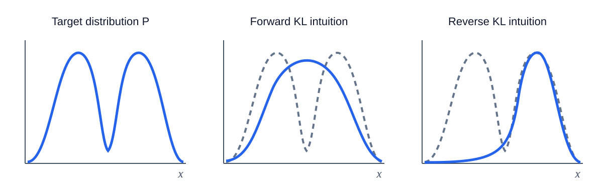
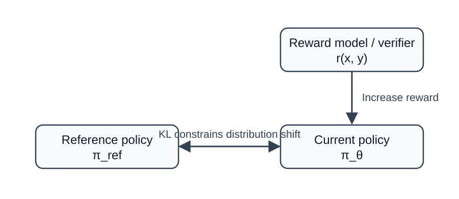
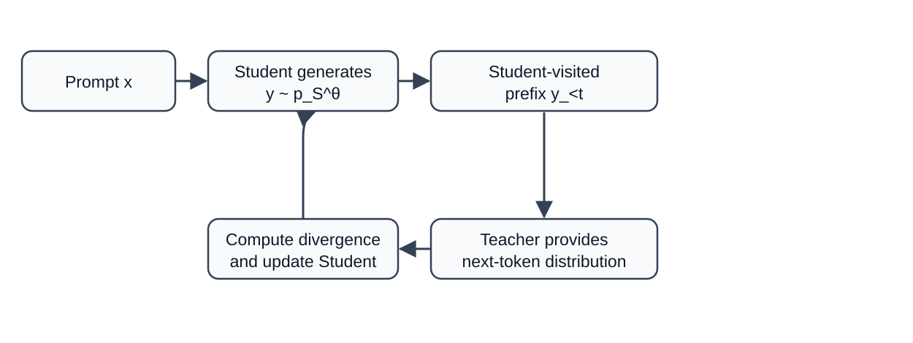

Goal: Understand the mathematical structure of KL divergence and what it controls in PPO, DPO, GRPO, and On-Policy Distillation.

## The Bottom Line First: What KL Does in LLM Training

KL divergence measures how different two probability distributions are. For a large language model, the model outputs a probability distribution at every token, so KL naturally measures the difference between two models.

In LLM reinforcement learning and alignment, the most common role of KL can be summarized in one sentence:

::: {.callout-tip title="Intuition"}
Reward tells the model where to go; KL constrains it from going too far in a single move.
:::

For example, an SFT model can already answer questions normally. If reinforcement learning finds that a certain type of answer receives high reward, optimizing reward alone may quickly concentrate probability on shortcut patterns. Adding a KL penalty to the reference model is equivalent to requiring that:

$$
\text{The new model should obtain higher reward while preserving the original model's language abilities and behavioral distribution as much as possible.}
$$

The most typical objective is

$$
\max_{\pi}
\quad
\mathbb{E}_{y\sim\pi(\cdot|x)}[r(x,y)]
-
\beta D_{\mathrm{KL}}\!\left(\pi(\cdot|x)\,\middle\|\,\pi_{\mathrm{ref}}(\cdot|x)\right).
\tag{1}
$$

Here, $\beta\gt 0$ controls the strength of the KL constraint.

- Small $\beta$: allows the model to deviate more boldly from the reference policy.

- Large $\beta$: makes updates more conservative and keeps the model closer to the reference policy.

Although PPO, DPO, GRPO, and OPD take different forms, all of them reveal the same core idea of controlling distribution shift.

## Definition of KL Divergence

### Discrete Distributions

Let two probability distributions of a discrete random variable $X$ be

$$
P=\{p_1,p_2,\ldots,p_n\},
\qquad
Q=\{q_1,q_2,\ldots,q_n\},
$$

satisfying

$$
p_i\ge 0,\qquad q_i\ge 0,
\qquad
\sum_{i=1}^{n}p_i=1,
\qquad
\sum_{i=1}^{n}q_i=1.
$$

KL divergence is defined as

$$
\boxed{
D_{\mathrm{KL}}\!\left(P\,\middle\|\,Q\right)
=
\sum_{i=1}^{n}
p_i\log\frac{p_i}{q_i}
}
$$

The natural logarithm is typically used, so the unit is the nat.

The sum can also be written as an expectation:

$$
\begin{aligned}
D_{\mathrm{KL}}\!\left(P\,\middle\|\,Q\right)
&=
\sum_i p_i\log\frac{p_i}{q_i}
\\
&=
\mathbb{E}_{x\sim P}
\left[
\log\frac{P(x)}{Q(x)}
\right].

\end{aligned}
$$

The essence of KL is therefore:

$$
\boxed{
\text{On data actually generated by }P\text{, compare the log-probability difference between }P\text{ and }Q\text{ on average.}
}
$$

### Continuous Distributions

If $P,Q$ have probability densities $p(x),q(x)$, then

$$
D_{\mathrm{KL}}\!\left(P\,\middle\|\,Q\right)
=
\int
p(x)\log\frac{p(x)}{q(x)}\,dx.
$$

The sum in the discrete case is replaced by an integral, while the mathematical meaning remains the same.

### Why Use the Log-Probability Ratio

Consider an event $x$:

$$
\log\frac{P(x)}{Q(x)}
=
\log P(x)-\log Q(x).
$$

If $P(x)\gt Q(x)$, then

$$
\log\frac{P(x)}{Q(x)}\gt 0.
$$

This means that $Q$ underestimates an event that is relatively common under $P$.

If $P(x)\lt Q(x)$, the corresponding term is negative.

KL then takes the average using $P(x)$ as the weight:

$$
\sum_x P(x)\log\frac{P(x)}{Q(x)}.
$$

Thus, locations frequently visited by $P$ receive greater weight.

::: {.callout-tip title="Intuition"}
Think of $P$ as the true distribution and $Q$ as the model distribution. KL focuses on whether the model assigns enough probability to situations that occur frequently in the real world.
:::

## Deriving KL Step by Step from Cross-Entropy

Define entropy

$$
H(P)
=
-\sum_i p_i\log p_i.
$$

Define cross-entropy

$$
H(P,Q)
=
-\sum_i p_i\log q_i.
$$

Compute their difference:

$$
\begin{aligned}
H(P,Q)-H(P)
&=
\left(-\sum_i p_i\log q_i\right)
-
\left(-\sum_i p_i\log p_i\right)
\\
&=
-\sum_i p_i\log q_i
+
\sum_i p_i\log p_i
\\
&=
\sum_i p_i
\left(
\log p_i-\log q_i
\right)
\\
&=
\sum_i p_i
\log\frac{p_i}{q_i}
\\
&=
D_{\mathrm{KL}}\!\left(P\,\middle\|\,Q\right).
\end{aligned}
$$

Therefore

$$
\boxed{
H(P,Q)=H(P)+D_{\mathrm{KL}}\!\left(P\,\middle\|\,Q\right)
}
$$

Equivalently

$$
\boxed{
D_{\mathrm{KL}}\!\left(P\,\middle\|\,Q\right)=H(P,Q)-H(P).
}
$$

If $P$ is fixed, then $H(P)$ is constant, so

$$
\min_Q H(P,Q)
\quad\Longleftrightarrow\quad
\min_Q D_{\mathrm{KL}}\!\left(P\,\middle\|\,Q\right).
$$

This is the important connection between maximum-likelihood training and forward KL.

::: {.callout-tip title="Intuition"}
Cross-entropy equals the unavoidable uncertainty in the data itself plus the additional cost caused by an inaccurate model distribution. The latter part is KL.
:::

## Why KL Is Always Nonnegative

KL satisfies

$$
\boxed{
D_{\mathrm{KL}}\!\left(P\,\middle\|\,Q\right)\ge 0.
}
$$

The following proof omits no steps.

Assume $p_i\gt 0,q_i\gt 0$. By Jensen's inequality, since $-\log x$ is convex,

$$
\mathbb{E}[-\log X]
\ge
-\log\mathbb{E}[X].
$$

Let

$$
X=\frac{q_i}{p_i},
$$

and sample the index $i$ according to distribution $P$. Then

$$
\begin{aligned}
D_{\mathrm{KL}}\!\left(P\,\middle\|\,Q\right)
&=
\sum_i p_i\log\frac{p_i}{q_i}
\\
&=
-\sum_i p_i\log\frac{q_i}{p_i}
\\
&=
\mathbb{E}_{i\sim P}
\left[
-\log\frac{q_i}{p_i}
\right]
\\
&\ge
-\log
\mathbb{E}_{i\sim P}
\left[
\frac{q_i}{p_i}
\right].
\end{aligned}
$$

Continuing with the expectation:

$$
\begin{aligned}
\mathbb{E}_{i\sim P}
\left[
\frac{q_i}{p_i}
\right]
&=
\sum_i
p_i\frac{q_i}{p_i}
\\
&=
\sum_i q_i
\\
&=
1.
\end{aligned}
$$

Therefore

$$
\begin{aligned}
D_{\mathrm{KL}}\!\left(P\,\middle\|\,Q\right)
&\ge
-\log 1
\\
&=
0.
\end{aligned}
$$

Thus

$$
\boxed{
D_{\mathrm{KL}}\!\left(P\,\middle\|\,Q\right)\ge0.
}
$$

Equality in Jensen's inequality requires

$$
\frac{q_i}{p_i}=c
$$

to be constant for every $i$. Since

$$
\sum_i p_i=\sum_i q_i=1,
$$

we have $c=1$, and therefore

$$
p_i=q_i,\quad \forall i.
$$

Hence

$$
\boxed{
D_{\mathrm{KL}}\!\left(P\,\middle\|\,Q\right)=0
\iff
P=Q.
}
$$

## Why KL Is Asymmetric

In general,

$$
D_{\mathrm{KL}}\!\left(P\,\middle\|\,Q\right)
\neq
D_{\mathrm{KL}}\!\left(Q\,\middle\|\,P\right).
$$

For example,

$$
P=(0.9,0.1),
\qquad
Q=(0.5,0.5).
$$

First compute $D_{\mathrm{KL}}\!\left(P\,\middle\|\,Q\right)$:

$$
\begin{aligned}
D_{\mathrm{KL}}\!\left(P\,\middle\|\,Q\right)
&=
0.9\log\frac{0.9}{0.5}
+
0.1\log\frac{0.1}{0.5}
\\
&=
0.9\log 1.8
+
0.1\log 0.2
\\
&\approx
0.368.
\end{aligned}
$$

In the reverse direction:

$$
\begin{aligned}
D_{\mathrm{KL}}\!\left(Q\,\middle\|\,P\right)
&=
0.5\log\frac{0.5}{0.9}
+
0.5\log\frac{0.5}{0.1}
\\
&=
0.5\log\frac{5}{9}
+
0.5\log 5
\\
&\approx
0.511.
\end{aligned}
$$

The two are clearly different.

The reason lies in the weighting:

$$
D_{\mathrm{KL}}\!\left(P\,\middle\|\,Q\right)
=
\mathbb{E}_{x\sim P}
\left[
\log\frac{P(x)}{Q(x)}
\right]
$$

mainly concerns locations frequently visited by $P$, whereas

$$
D_{\mathrm{KL}}\!\left(Q\,\middle\|\,P\right)
=
\mathbb{E}_{x\sim Q}
\left[
\log\frac{Q(x)}{P(x)}
\right]
$$

mainly concerns locations frequently visited by $Q$.

## Forward KL and Reverse KL

Assume the target distribution is $P$ and the learnable model is $Q_\theta$.

We usually call

$$
\text{Forward KL}
=
D_{\mathrm{KL}}\!\left(P\,\middle\|\,Q_\theta\right),
$$

$$
\text{Reverse KL}
=
D_{\mathrm{KL}}\!\left(Q_\theta\,\middle\|\,P\right).
$$

Their behavioral difference is very important.

### Tendency of Forward KL

Forward KL is

$$
D_{\mathrm{KL}}\!\left(P\,\middle\|\,Q_\theta\right)
=
\mathbb{E}_{x\sim P}
\left[
\log\frac{P(x)}{Q_\theta(x)}
\right].
$$

If at some location

$$
P(x)\gt 0,\qquad Q_\theta(x)\approx0,
$$

then

$$
\log\frac{P(x)}{Q_\theta(x)}
\rightarrow +\infty.
$$

Thus, forward KL strongly penalizes the model for missing high-probability regions of $P$.

The common intuition is therefore:

$$
\boxed{
\text{Forward KL tends toward mode covering.}
}
$$

### Tendency of Reverse KL

Reverse KL is

$$
D_{\mathrm{KL}}\!\left(Q_\theta\,\middle\|\,P\right)
=
\mathbb{E}_{x\sim Q_\theta}
\left[
\log\frac{Q_\theta(x)}{P(x)}
\right].
$$

It mainly penalizes the model for placing probability where the target distribution $P$ is very small.

If $P$ has multiple modes and $Q_\theta$ has limited capacity, $Q_\theta$ may prefer to concentrate on one high-probability mode.

The common intuition is therefore:

$$
\boxed{
\text{Reverse KL tends toward mode seeking.}
}
$$

{width="95%" fig-align="center"}

Note that mode covering and mode seeking describe typical behavior; they do not necessarily hold for every parameterized distribution.

## From a Single Token to a Complete LLM Sequence

This is the most critical step for KL in LLMs.

Given a prompt $x$, the model generates a sequence

$$
y=(y_1,y_2,\ldots,y_T).
$$

An autoregressive model satisfies

$$
\pi_{\theta}(y|x)
=
\prod_{t=1}^{T}
\pi_{\theta}(y_t|x,y_{\lt t}).
$$

The reference model likewise satisfies

$$
\pi_{\mathrm{ref}}(y|x)
=
\prod_{t=1}^{T}
\pi_{\mathrm{ref}}(y_t|x,y_{\lt t}).
$$

Their sequence probability ratio is therefore

$$
\begin{aligned}
\frac{\pi_{\theta}(y|x)}{\pi_{\mathrm{ref}}(y|x)}
&=
\frac{
\prod_{t=1}^{T}\pi_{\theta}(y_t|x,y_{\lt t})
}{
\prod_{t=1}^{T}\pi_{\mathrm{ref}}(y_t|x,y_{\lt t})
}
\\
&=
\prod_{t=1}^{T}
\frac{
\pi_{\theta}(y_t|x,y_{\lt t})
}{
\pi_{\mathrm{ref}}(y_t|x,y_{\lt t})
}.
\end{aligned}
$$

Taking logarithms:

$$
\begin{aligned}
\log
\frac{\pi_{\theta}(y|x)}{\pi_{\mathrm{ref}}(y|x)}
&=
\log
\prod_{t=1}^{T}
\frac{
\pi_{\theta}(y_t|x,y_{\lt t})
}{
\pi_{\mathrm{ref}}(y_t|x,y_{\lt t})
}
\\
&=
\sum_{t=1}^{T}
\log
\frac{
\pi_{\theta}(y_t|x,y_{\lt t})
}{
\pi_{\mathrm{ref}}(y_t|x,y_{\lt t})
}.

\end{aligned}
$$

Then take the expectation over $y\sim\pi_{\theta}$:

$$
\begin{aligned}
D_{\mathrm{KL}}\!\left(\pi_{\theta}(\cdot|x)\,\middle\|\,\pi_{\mathrm{ref}}(\cdot|x)\right)
&=
\mathbb{E}_{y\sim\pi_{\theta}}
\left[
\log
\frac{\pi_{\theta}(y|x)}{\pi_{\mathrm{ref}}(y|x)}
\right]
\\
&=
\mathbb{E}_{y\sim\pi_{\theta}}
\left[
\sum_{t=1}^{T}
\log
\frac{
\pi_{\theta}(y_t|x,y_{\lt t})
}{
\pi_{\mathrm{ref}}(y_t|x,y_{\lt t})
}
\right].

\end{aligned}
$$

Next, use the chain rule for conditional KL:

$$
\begin{aligned}
D_{\mathrm{KL}}\!\left(\pi_{\theta}(\cdot|x)\,\middle\|\,\pi_{\mathrm{ref}}(\cdot|x)\right)
=
\sum_{t=1}^{T}
\mathbb{E}_{y_{\lt t}\sim\pi_{\theta}}
\left[
D_{\mathrm{KL}}\!\left(
\pi_{\theta}(\cdot|x,y_{\lt t})
\,\middle\|\,
\pi_{\mathrm{ref}}(\cdot|x,y_{\lt t})
\right)
\right].

\end{aligned}
$$

This means:

$$
\boxed{
\text{Sequence-level KL can be understood as the accumulation of token-distribution KL at every generation position.}
}
$$

::: {.callout-tip title="Intuition"}
An answer may contain 500 tokens. At every step, the model may deviate slightly from the reference model. KL accumulates these local shifts, so long answers require particular attention to KL scale and length normalization.
:::

## The Gradient of KL: Why It Resembles a "Negative Reward"

Let the reference distribution $q(x)$ be fixed and the trainable distribution be $p_\theta(x)$:

$$
D(\theta)
=
\sum_x
p_\theta(x)
\log
\frac{p_\theta(x)}{q(x)}.
$$

Taking the gradient with respect to $\theta$:

$$
\begin{aligned}
\nabla_\theta D(\theta)
&=
\sum_x
\nabla_\theta
\left[
p_\theta(x)
\log
\frac{p_\theta(x)}{q(x)}
\right]
\\
&=
\sum_x
\nabla_\theta p_\theta(x)
\log
\frac{p_\theta(x)}{q(x)}
+
\sum_x
p_\theta(x)
\nabla_\theta
\log p_\theta(x).
\end{aligned}
$$

Using

$$
p_\theta(x)\nabla_\theta\log p_\theta(x)
=
\nabla_\theta p_\theta(x),
$$

we obtain

$$
\begin{aligned}
\nabla_\theta D(\theta)
&=
\sum_x
\nabla_\theta p_\theta(x)
\log
\frac{p_\theta(x)}{q(x)}
+
\sum_x
\nabla_\theta p_\theta(x)
\\
&=
\sum_x
\nabla_\theta p_\theta(x)
\log
\frac{p_\theta(x)}{q(x)}
+
\nabla_\theta
\sum_x p_\theta(x).
\end{aligned}
$$

Because

$$
\sum_x p_\theta(x)=1,
$$

Thus

$$
\nabla_\theta
\sum_x p_\theta(x)
=
\nabla_\theta 1
=
0.
$$

Therefore

$$
\begin{aligned}
\nabla_\theta D(\theta)
&=
\sum_x
\nabla_\theta p_\theta(x)
\log
\frac{p_\theta(x)}{q(x)}
\\
&=
\sum_x
p_\theta(x)
\nabla_\theta\log p_\theta(x)
\log
\frac{p_\theta(x)}{q(x)}
\\
&=
\mathbb{E}_{x\sim p_\theta}
\left[
\nabla_\theta\log p_\theta(x)
\log
\frac{p_\theta(x)}{q(x)}
\right].

\end{aligned}
$$

Consider the KL-regularized reinforcement-learning objective

$$
J(\theta)
=
\mathbb{E}_{y\sim\pi_{\theta}}[r(y)]
-
\beta
D_{\mathrm{KL}}\!\left(\pi_{\theta}\,\middle\|\,\pi_{\mathrm{ref}}\right).
$$

Ignoring techniques such as baselines, its policy gradient can be written as

$$
\nabla_\theta J
=
\mathbb{E}_{y\sim\pi_{\theta}}
\left[
\nabla_\theta\log\pi_{\theta}(y)
\left(
r(y)
-
\beta
\log\frac{\pi_{\theta}(y)}{\pi_{\mathrm{ref}}(y)}
\right)
\right].
$$

Thus, we can regard

$$
-\beta
\log\frac{\pi_{\theta}(y)}{\pi_{\mathrm{ref}}(y)}
$$

as an additional reward correction.

::: {.callout-tip title="Intuition"}
If the new model raises the probability of an answer far above that of the reference model, the log ratio grows and the KL correction lowers the answer's effective reward, preventing its probability from growing without bound.
:::

## Optimal Policy for KL-Regularized RL

This section is very important because the DPO formula follows directly from it.

Consider a fixed prompt $x$ and omit $x$ from the notation:

$$
\max_{\pi}
\left[
\sum_y \pi(y)r(y)
-
\beta
\sum_y
\pi(y)
\log
\frac{\pi(y)}{\pi_{\mathrm{ref}}(y)}
\right]
$$

subject to

$$
\sum_y\pi(y)=1.
$$

Introduce a Lagrange multiplier $\lambda$:

$$
\begin{aligned}
\mathcal{L}(\pi,\lambda)
&=
\sum_y\pi(y)r(y)
-
\beta
\sum_y
\pi(y)
\log\frac{\pi(y)}{\pi_{\mathrm{ref}}(y)}
\\
&\quad
+
\lambda
\left(
\sum_y\pi(y)-1
\right).
\end{aligned}
$$

Take the partial derivative with respect to a particular $\pi(y)$:

$$
\begin{aligned}
\frac{\partial\mathcal{L}}{\partial\pi(y)}
&=
r(y)
-
\beta
\frac{\partial}{\partial\pi(y)}
\left[
\pi(y)
\log\frac{\pi(y)}{\pi_{\mathrm{ref}}(y)}
\right]
+
\lambda.
\end{aligned}
$$

Using

$$
\frac{d}{dz}
\left(
z\log z
\right)
=
\log z+1,
$$

we have

$$
\begin{aligned}
\frac{\partial}{\partial\pi(y)}
\left[
\pi(y)
\log\frac{\pi(y)}{\pi_{\mathrm{ref}}(y)}
\right]
&=
\log\frac{\pi(y)}{\pi_{\mathrm{ref}}(y)}
+1.
\end{aligned}
$$

Set the partial derivative to zero:

$$
\begin{aligned}
0
&=
r(y)
-
\beta
\left(
\log\frac{\pi(y)}{\pi_{\mathrm{ref}}(y)}
+1
\right)
+
\lambda.
\end{aligned}
$$

Rearranging:

$$
\begin{aligned}
\beta
\log\frac{\pi(y)}{\pi_{\mathrm{ref}}(y)}
&=
r(y)+\lambda-\beta.
\end{aligned}
$$

Dividing by $\beta$:

$$
\begin{aligned}
\log\frac{\pi(y)}{\pi_{\mathrm{ref}}(y)}
&=
\frac{r(y)}{\beta}
+
\frac{\lambda}{\beta}
-1.
\end{aligned}
$$

Exponentiating both sides:

$$
\begin{aligned}
\frac{\pi(y)}{\pi_{\mathrm{ref}}(y)}
&=
\exp
\left(
\frac{r(y)}{\beta}
\right)
\exp
\left(
\frac{\lambda}{\beta}-1
\right).
\end{aligned}
$$

Therefore

$$
\pi(y)
=
C
\pi_{\mathrm{ref}}(y)
\exp
\left(
\frac{r(y)}{\beta}
\right),
$$

where $C$ is independent of $y$.

Using probability normalization:

$$
\begin{aligned}
1
&=
\sum_y\pi(y)
\\
&=
C
\sum_y
\pi_{\mathrm{ref}}(y)
\exp
\left(
\frac{r(y)}{\beta}
\right).
\end{aligned}
$$

Define the partition function

$$
Z
=
\sum_y
\pi_{\mathrm{ref}}(y)
\exp
\left(
\frac{r(y)}{\beta}
\right),
$$

Therefore

$$
C=\frac{1}{Z}.
$$

Finally, we obtain

$$
\boxed{
\pi^*(y)
=
\frac{1}{Z}
\pi_{\mathrm{ref}}(y)
\exp
\left(
\frac{r(y)}{\beta}
\right)
}
\tag{68}
$$

This expression is very intuitive:

$$
\boxed{
\text{new policy}
=
\text{old-policy prior}
\times
\text{exponential weighting induced by reward}.
}
$$

### A Small Example with Two Answers

Suppose the reference policy assigns probability $0.5$ to both answers $A,B$:

$$
\pi_{\mathrm{ref}}(A)=0.5,
\qquad
\pi_{\mathrm{ref}}(B)=0.5.
$$

The rewards are

$$
r(A)=2,
\qquad
r(B)=0.
$$

From equation (68):

$$
\frac{\pi^*(A)}{\pi^*(B)}
=
\frac{\pi_{\mathrm{ref}}(A)}{\pi_{\mathrm{ref}}(B)}
\exp
\left(
\frac{r(A)-r(B)}{\beta}
\right)
=
\exp\left(\frac{2}{\beta}\right).
$$

Therefore:

| $\beta$ |   $\pi^*(A)$    | Meaning |
|:---------:|:-----------------:|:---------------------:|
|  $0.5$  | $\approx 0.982$ | Reward dominates; aggressive update |
|   $1$   | $\approx 0.881$ | Moderate constraint |
|   $2$   | $\approx 0.731$ | Stronger reference constraint |

## KL in PPO

The core of PPO itself is limiting the magnitude of a single policy update. LLM RLHF also commonly uses KL to a reference model, so two objects must be distinguished:

1.  $\pi_{\mathrm{old}}$: the old policy used to sample rollouts; the PPO ratio and clipping control a single update.

2.  $\pi_{\mathrm{ref}}$: usually a frozen SFT or initial policy; KL prevents long-term drift.

### PPO ratio

At state $s_t$ and action $a_t$ for token $t$, define

$$
\rho_t(\theta)
=
\frac{
\pi_{\theta}(a_t|s_t)
}{
\pi_{\mathrm{old}}(a_t|s_t)
}.
$$

The PPO clipped objective is

$$
L_{\mathrm{clip}}
=
\mathbb{E}_t
\left[
\min
\left(
\rho_t A_t,
\mathrm{clip}
(\rho_t,1-\epsilon,1+\epsilon)A_t
\right)
\right].
$$

Clipping limits a single change of $\pi_{\theta}$ relative to $\pi_{\mathrm{old}}$.

### Reference KL

A common reward in RLHF can be written as

$$
r_{\mathrm{total}}
=
r_{\mathrm{RM}}
-
\beta
\log
\frac{
\pi_{\theta}(y_t|s_t)
}{
\pi_{\mathrm{ref}}(y_t|s_t)
}.
$$

Accumulating over the complete sequence:

$$
R_{\mathrm{KL}}
=
-\beta
\sum_t
\log
\frac{
\pi_{\theta}(y_t|s_t)
}{
\pi_{\mathrm{ref}}(y_t|s_t)
}.
$$

Taking the expectation under the current policy yields sequence-level forward KL.

{width="82%" fig-align="center"}

::: {.callout-tip title="Intuition"}
PPO clipping says not to make this single step too large; reference KL says not to move too far from the starting point after many steps. The two constraints often coexist.
:::

## KL in DPO: Invisible in the Loss, Present Throughout the Derivation

DPO removes explicit reward-model training and the online PPO loop, but it can be derived directly from the optimal policy of KL-regularized RLHF.

From equation (68):

$$
\pi^*(y|x)
=
\frac{1}{Z(x)}
\pi_{\mathrm{ref}}(y|x)
\exp
\left(
\frac{r(x,y)}{\beta}
\right).
$$

Rearranging:

$$
\begin{aligned}
\frac{\pi^*(y|x)}{\pi_{\mathrm{ref}}(y|x)}
&=
\frac{1}{Z(x)}
\exp
\left(
\frac{r(x,y)}{\beta}
\right).
\end{aligned}
$$

Taking logarithms:

$$
\begin{aligned}
\log
\frac{\pi^*(y|x)}{\pi_{\mathrm{ref}}(y|x)}
&=
-\log Z(x)
+
\frac{r(x,y)}{\beta}.
\end{aligned}
$$

Multiplying by $\beta$:

$$
\begin{aligned}
\beta
\log
\frac{\pi^*(y|x)}{\pi_{\mathrm{ref}}(y|x)}
&=
-\beta\log Z(x)
+
r(x,y).
\end{aligned}
$$

The reward can therefore be written as

$$
\boxed{
r(x,y)
=
\beta
\log
\frac{\pi^*(y|x)}{\pi_{\mathrm{ref}}(y|x)}
+
\beta\log Z(x)
}
\tag{77}
$$

Now consider preference data

$$
(x,y_w,y_l),
$$

where $y_w$ is the preferred response and $y_l$ is the rejected response.

The Bradley--Terry preference model is

$$
P(y_w\succ y_l|x)
=
\sigma
\left(
r(x,y_w)-r(x,y_l)
\right),
$$

where

$$
\sigma(z)=\frac{1}{1+e^{-z}}.
$$

Substitute equation (77).

First:

$$
\begin{aligned}
r(x,y_w)
&=
\beta
\log
\frac{\pi_{\theta}(y_w|x)}{\pi_{\mathrm{ref}}(y_w|x)}
+
\beta\log Z(x),
\end{aligned}
$$

$$
\begin{aligned}
r(x,y_l)
&=
\beta
\log
\frac{\pi_{\theta}(y_l|x)}{\pi_{\mathrm{ref}}(y_l|x)}
+
\beta\log Z(x).
\end{aligned}
$$

Subtracting the two expressions:

$$
\begin{aligned}
r(x,y_w)-r(x,y_l)
&=
\beta
\log
\frac{\pi_{\theta}(y_w|x)}{\pi_{\mathrm{ref}}(y_w|x)}
\\
&\quad
-
\beta
\log
\frac{\pi_{\theta}(y_l|x)}{\pi_{\mathrm{ref}}(y_l|x)}
\\
&\quad
+
\beta\log Z(x)
-
\beta\log Z(x)
\\
&=
\beta
\left[
\log
\frac{\pi_{\theta}(y_w|x)}{\pi_{\mathrm{ref}}(y_w|x)}
-
\log
\frac{\pi_{\theta}(y_l|x)}{\pi_{\mathrm{ref}}(y_l|x)}
\right].
\end{aligned}
$$

Therefore

$$
P(y_w\succ y_l|x)
=
\sigma
\left(
\beta
\left[
\log
\frac{\pi_{\theta}(y_w|x)}{\pi_{\mathrm{ref}}(y_w|x)}
-
\log
\frac{\pi_{\theta}(y_l|x)}{\pi_{\mathrm{ref}}(y_l|x)}
\right]
\right).
$$

Maximizing the likelihood of the preference data gives the DPO loss:

$$
\boxed{
\mathcal{L}_{\mathrm{DPO}}
=
-
\mathbb{E}
\left[
\log
\sigma
\left(
\beta
\left[
\log
\frac{\pi_{\theta}(y_w|x)}{\pi_{\mathrm{ref}}(y_w|x)}
-
\log
\frac{\pi_{\theta}(y_l|x)}{\pi_{\mathrm{ref}}(y_l|x)}
\right]
\right)
\right].
}
$$

::: {.callout-tip title="Intuition"}
DPO can be understood as making the model more willing, relative to the reference, to produce the winner and less willing, relative to the reference, to produce the loser. The reference model remains in the probability ratios, so the idea of KL regularization has been absorbed into the objective.
:::

The DPO loss does not separately include

$$
-\beta D_{\mathrm{KL}}\!\left(\pi_{\theta}\,\middle\|\,\pi_{\mathrm{ref}}\right),
$$

However, DPO's closed-form derivation comes from the KL-regularized objective in equation (1). It is therefore inaccurate to say that DPO is completely unrelated to KL.

## KL in GRPO

GRPO can be viewed as PPO-style policy optimization that does not rely on a separate value model to estimate the advantage. For the same prompt $q$, sample a group of answers from the old policy:

$$
o_1,o_2,\ldots,o_G
\sim
\pi_{\mathrm{old}}(\cdot|q).
$$

Obtain rewards:

$$
r_1,r_2,\ldots,r_G.
$$

Normalize within the group to obtain the advantage:

$$
A_i
=
\frac{
r_i-\mathrm{mean}(r_1,\ldots,r_G)
}{
\mathrm{std}(r_1,\ldots,r_G)
}.
$$

Intuitively, answers in the same group are compared with one another:

- If an answer is better than the group mean, $A_i\gt 0$, increase its probability.

- If an answer is worse than the group mean, $A_i\lt 0$, decrease its probability.

The token-level ratio is

$$
\rho_{i,t}
=
\frac{
\pi_{\theta}(o_{i,t}|q,o_{i,\lt t})
}{
\pi_{\mathrm{old}}(o_{i,t}|q,o_{i,\lt t})
}.
$$

A typical GRPO objective is

$$
\begin{aligned}
J_{\mathrm{GRPO}}
=
\mathbb{E}
\Bigg[
\frac{1}{G}
\sum_{i=1}^{G}
\frac{1}{|o_i|}
\sum_t
\Big(
&
\min
[
\rho_{i,t}A_i,
\mathrm{clip}(\rho_{i,t},1-\epsilon,1+\epsilon)A_i
]
\\
&
-
\beta D_{i,t}^{\mathrm{KL}}
\Big)
\Bigg].
\end{aligned}
$$

The following single-sample KL estimator appears in formulas related to DeepSeekMath and DeepSeek R1:

$$
D_{i,t}^{\mathrm{KL}}
=
\frac{\pi_{\mathrm{ref}}(o_{i,t}|s_{i,t})}
{\pi_{\theta}(o_{i,t}|s_{i,t})}
-
\log
\frac{\pi_{\mathrm{ref}}(o_{i,t}|s_{i,t})}
{\pi_{\theta}(o_{i,t}|s_{i,t})}
-1.
\tag{90}
$$

This expression looks different from the standard KL definition, but when $o_{i,t}\sim\pi_{\theta}$, its expectation is exactly forward KL.

Let

$$
R(a)
=
\frac{\pi_{\mathrm{ref}}(a|s)}{\pi_{\theta}(a|s)}.
$$

then

$$
\begin{aligned}
\mathbb{E}_{a\sim\pi_{\theta}}
[
R(a)-\log R(a)-1
]
&=
\mathbb{E}_{\pi_{\theta}}[R(a)]
-
\mathbb{E}_{\pi_{\theta}}[\log R(a)]
-1.
\end{aligned}
$$

The first term:

$$
\begin{aligned}
\mathbb{E}_{\pi_{\theta}}[R(a)]
&=
\sum_a
\pi_{\theta}(a|s)
\frac{\pi_{\mathrm{ref}}(a|s)}{\pi_{\theta}(a|s)}
\\
&=
\sum_a\pi_{\mathrm{ref}}(a|s)
\\
&=
1.
\end{aligned}
$$

The second term:

$$
\begin{aligned}
-\mathbb{E}_{\pi_{\theta}}[\log R(a)]
&=
-\mathbb{E}_{\pi_{\theta}}
\left[
\log
\frac{\pi_{\mathrm{ref}}(a|s)}{\pi_{\theta}(a|s)}
\right]
\\
&=
\mathbb{E}_{\pi_{\theta}}
\left[
\log
\frac{\pi_{\theta}(a|s)}{\pi_{\mathrm{ref}}(a|s)}
\right]
\\
&=
D_{\mathrm{KL}}\!\left(\pi_{\theta}(\cdot|s)\,\middle\|\,\pi_{\mathrm{ref}}(\cdot|s)\right).
\end{aligned}
$$

Thus

$$
\begin{aligned}
\mathbb{E}_{\pi_{\theta}}
[
R-\log R-1
]
&=
1
+
D_{\mathrm{KL}}\!\left(\pi_{\theta}\,\middle\|\,\pi_{\mathrm{ref}}\right)
-
1
\\
&=
D_{\mathrm{KL}}\!\left(\pi_{\theta}\,\middle\|\,\pi_{\mathrm{ref}}\right).
\end{aligned}
$$

Thus, equation (90) still controls the deviation of the current policy from the reference policy.

::: {.callout-tip title="Intuition"}
GRPO mainly changes how the advantage is obtained. PPO relies on critic estimates, whereas GRPO compares a group of answers sampled for the same problem. The role of KL does not change: it still prevents the policy from drifting excessively in pursuit of reward.
:::

## OPD: KL in On-Policy Distillation

Here, OPD refers to On-Policy Distillation.

Let the teacher be

$$
p_T,
$$

and the student be

$$
p_S^\theta.
$$

Traditional offline distillation usually trains the student on fixed teacher data or a fixed training set. The problem is that the student generates its own tokens at inference time; once an earlier token is wrong, later prefixes may deviate completely from the training set.

The key process of On-Policy Distillation is:

1.  Give the student a prompt $x$.

2.  The student generates its own trajectory $y\sim p_S^\theta(\cdot|x)$.

3.  Query the teacher at every prefix $y_{\lt t}$ actually visited by the student.

4.  Compare the teacher's and student's next-token distributions.

5.  Update the student using KL or another divergence.

{width="90%" fig-align="center"}

### Forward-KL Distillation

Using the common convention in which the teacher is the target and the student is the approximation:

$$
D_{\mathrm{FKL}}
=
D_{\mathrm{KL}}\!\left(
p_T(\cdot|s_t)
\,\middle\|\,
p_S^\theta(\cdot|s_t)
\right).
$$

Expanding:

$$
\begin{aligned}
D_{\mathrm{FKL}}
&=
\sum_v
p_T(v|s_t)
\log
\frac{
p_T(v|s_t)
}{
p_S^\theta(v|s_t)
}.
\end{aligned}
$$

Because the teacher is fixed,

$$
\sum_v p_T(v|s_t)\log p_T(v|s_t)
$$

is constant with respect to the student parameters, so minimizing forward KL is equivalent to minimizing

$$
-\sum_v
p_T(v|s_t)
\log p_S^\theta(v|s_t).
$$

This is soft-target cross-entropy.

### Reverse-KL Distillation

Reverse KL is

$$
D_{\mathrm{RKL}}
=
D_{\mathrm{KL}}\!\left(
p_S^\theta(\cdot|s_t)
\,\middle\|\,
p_T(\cdot|s_t)
\right).
$$

Expanding:

$$
D_{\mathrm{RKL}}
=
\sum_v
p_S^\theta(v|s_t)
\log
\frac{
p_S^\theta(v|s_t)
}{
p_T(v|s_t)
}.
$$

It places greater emphasis on whether:

$$
\text{The tokens the student wants to output are also considered reasonable by the teacher.}
$$

If the student assigns a high probability to a token while the teacher assigns it a low probability, then

$$
\log
\frac{p_S^\theta(v|s_t)}{p_T(v|s_t)}
$$

becomes large, producing a strong penalty.

::: {.callout-tip title="Intuition"}
Forward KL is more like learning as many of the teacher's possibilities as possible. Reverse KL is more like checking whether the teacher approves the path the student intends to take. When the student has substantially less capacity than the teacher, the latter can sometimes concentrate limited capacity more easily on the teacher's high-probability modes.
:::

The GKD work combines on-policy sampling with multiple divergences and studies choices including reverse KL and Jensen--Shannon divergence.

### Relationship Between OPD and Reinforcement Learning

OPD looks like distillation, but it shares one important property with RL:

$$
\boxed{
\text{Training data comes from states visited by the current student policy itself.}
}
$$

This is very similar to on-policy data in online RL.

At the same time, the token distribution provided by the teacher is dense feedback:

$$
p_T(\cdot|s_t),
$$

It is richer than a scalar reward provided only after the complete answer

$$
r(x,y)\in\mathbb{R}
$$

in terms of information.

It can therefore be understood roughly as:

- SFT: give the student a demonstration answer.

- RL: tell the student the final score of the complete trajectory.

- OPD: let the student proceed on its own, then have the teacher provide a reference probability distribution at every step the student actually reaches.

One overly strong claim should be avoided: the teacher does not assign an absolutely correct or incorrect label to each token. It provides a probability distribution indicating which next tokens it prefers under the current prefix.

## Comparing the Four Methods

| Method | Data source | Where KL or the reference appears | Main role of KL | One-sentence interpretation |
|:---|:---|:---|:---|:---|
| PPO | Current- or old-policy rollouts | Often explicitly constrains $\pi_{\theta}$ against $\pi_{\mathrm{ref}}$, while ratio clipping constrains $\pi_{\theta}$ against $\pi_{\mathrm{old}}$ | Limit reward-driven policy drift | Obtain reward without making one update too aggressive or drifting too far from SFT over time |
| DPO | Offline preference pairs | Implicitly inherits KL-regularized RLHF through the preference log ratio $\log\pi_{\theta}-\log\pi_{\mathrm{ref}}$ | Preserve the reference anchor while increasing preference for the winner over the loser | Directly learn which answer is preferred, eliminating the explicit PPO loop |
| GRPO | Group rollouts from the current or old policy | Explicit KL to the reference and policy ratio to the old policy | Limit policy drift caused by group-relative reward | Sample several answers to the same problem, compare them within the group, and retain the KL safety line |
| OPD | On-policy trajectories generated by the student | Token-distribution divergence between student and teacher | Correct the distribution in states actually visited by the student | Let the student proceed first, then let the teacher guide it at the states it reaches |

## What Exactly Does the KL Coefficient $\beta$ Control?

Return to

$$
J(\pi)
=
\mathbb{E}_\pi[r]
-
\beta
D_{\mathrm{KL}}\!\left(\pi\,\middle\|\,\pi_{\mathrm{ref}}\right).
$$

$\beta$ is the trade-off coefficient between reward and preserving the original model's behavior.

### $\beta$ Is Too Small

If

$$
\beta\rightarrow0,
$$

the objective approaches

$$
\max_\pi\mathbb{E}_\pi[r].
$$

Possible outcomes include:

- reward hacking；

- the policy rapidly collapses to a small number of high-reward modes;

- language quality or general capabilities deteriorate;

- training becomes unstable;

- exploration disappears prematurely.

### $\beta$ Is Too Large

If $\beta$ is large, the KL penalty dominates:

$$
\pi\approx\pi_{\mathrm{ref}}.
$$

Possible outcomes include:

- the model learns almost nothing from the reward signal;

- reasoning behavior changes very little;

- policy improvement is too slow.

Training therefore often monitors:

$$
\text{reward},
\qquad
\text{KL},
\qquad
\text{entropy},
\qquad
\text{response length},
$$

rather than reward alone.

## A Deeper View: KL as an "Update Budget"

Think of the reference policy as the behavioral distribution the model has already learned.

Reward seeks to increase the probability of certain answers:

$$
\pi_{\theta}(y|x)\uparrow.
$$

But the probabilities must sum to 1:

$$
\sum_y\pi_{\theta}(y|x)=1.
$$

Increasing the probability of some answers must therefore reduce the probability of others.

Without a constraint, the model may redistribute a large amount of probability mass to increase reward quickly.

KL uses

$$
\log
\frac{
\pi_{\theta}(y|x)
}{
\pi_{\mathrm{ref}}(y|x)
}
$$

to measure this redistribution of probability mass directly.

KL can therefore be understood as a distribution-shift budget:

$$
\boxed{
\text{How much budget for deviating from the original model are you willing to spend for higher reward?}
}
$$

This is also why KL is so common in LLM reinforcement learning. The action space is the entire vocabulary and trajectories are long, so small token-probability changes can produce large behavioral changes after many autoregressive steps.

## Common Misconceptions

### Misconception 1: KL Is a Distance

KL is nonnegative, but generally

$$
D_{\mathrm{KL}}\!\left(P\,\middle\|\,Q\right)\neq D_{\mathrm{KL}}\!\left(Q\,\middle\|\,P\right),
$$

so it is not a distance in the strict mathematical sense.

### Misconception 2: PPO Clipping and Reference KL Are the Same

They usually constrain different objects:

$$
\pi_{\theta}
\leftrightarrow
\pi_{\mathrm{old}}
$$

mainly controls a single policy update;

$$
\pi_{\theta}
\leftrightarrow
\pi_{\mathrm{ref}}
$$

mainly controls long-term drift relative to the initial model.

### Misconception 3: DPO Does Not Write KL, So It Is Unrelated to KL

The DPO loss has no separate KL term, but its core reward parameterization comes from the closed-form optimal policy of KL-regularized RLHF.

### Misconception 4: GRPO Removes the Critic, So It Also Removes KL

GRPO's core change is constructing the advantage from group-relative reward, eliminating a separate value model. The GRPO forms associated with the original DeepSeekMath and DeepSeek R1 still contain a reference-KL penalty.

### Misconception 5: The OPD Teacher Judges Every Token as Right or Wrong

More precisely, the teacher provides a next-token probability distribution. It supplies a dense preference signal rather than a binary correctness label for each token.

## Final Memory Framework

If you remember only five statements:

1.  KL measures the difference between two probability distributions:
    $$
    D_{\mathrm{KL}}\!\left(P\,\middle\|\,Q\right)
        =
        \mathbb{E}_{P}
        \left[
        \log\frac{P}{Q}
        \right].
    $$

2.  KL is nonnegative:
    $$
    D_{\mathrm{KL}}\!\left(P\,\middle\|\,Q\right)\ge0,
        \qquad
        D_{\mathrm{KL}}\!\left(P\,\middle\|\,Q\right)=0\iff P=Q.
    $$

3.  For an LLM, autoregressive factorization decomposes sequence KL into an accumulation of token-level log-probability ratios.

4.  In RLHF:
    $$
    \text{Reward drives model change, while KL constrains the model from changing too far.}
    $$

5.  PPO, DPO, GRPO, and OPD follow different implementation paths, but KL addresses the same fundamental problem in all of them:
    $$
    \boxed{
        \text{How can new preferences be learned while controlling how much the probability distribution changes?}
        }
    $$

## References

1. S. Kullback and R. A. Leibler. On Information and Sufficiency. *The Annals of Mathematical Statistics*, 1951.

2. J. Schulman, F. Wolski, P. Dhariwal, A. Radford, and O. Klimov. Proximal Policy Optimization Algorithms. arXiv:1707.06347, 2017. <https://arxiv.org/abs/1707.06347>

3. R. Rafailov, A. Sharma, E. Mitchell, S. Ermon, C. D. Manning, and C. Finn. Direct Preference Optimization: Your Language Model is Secretly a Reward Model. arXiv:2305.18290, 2023. <https://arxiv.org/abs/2305.18290>

4. Z. Shao et al. DeepSeekMath: Pushing the Limits of Mathematical Reasoning in Open Language Models. arXiv:2402.03300, 2024. <https://arxiv.org/abs/2402.03300>

5. DeepSeek AI et al. DeepSeek R1 Incentivizes Reasoning in LLMs through Reinforcement Learning. *Nature*, 2025. <https://www.nature.com/articles/s41586-025-09422-z>

6. R. Agarwal, N. Vieillard, Y. Zhou, P. Stanczyk, S. Ramos, M. Geist, and O. Bachem. On-Policy Distillation of Language Models: Learning from Self Generated Mistakes. arXiv:2306.13649, 2023. <https://arxiv.org/abs/2306.13649>

