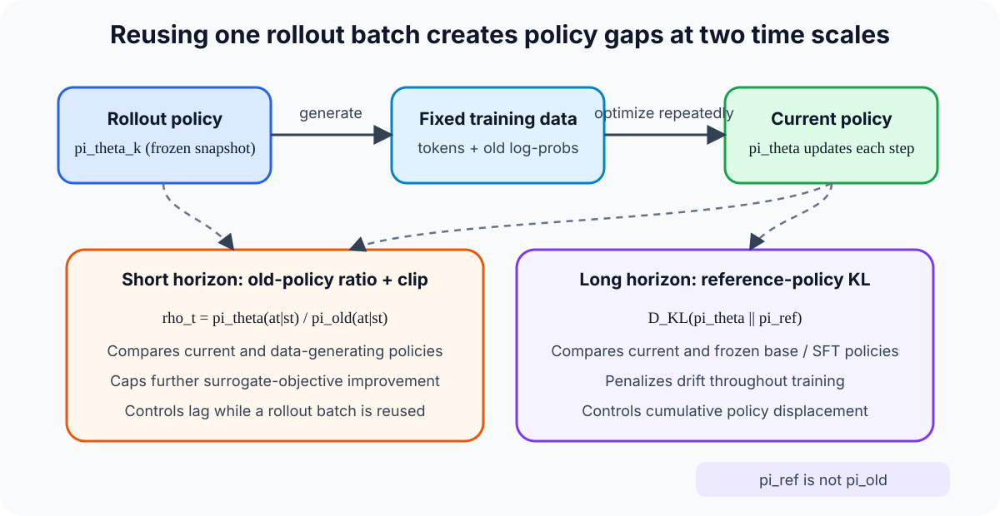
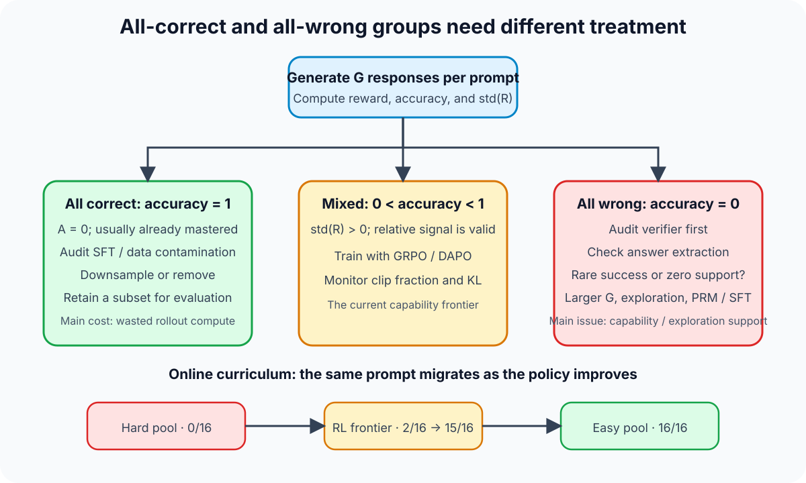
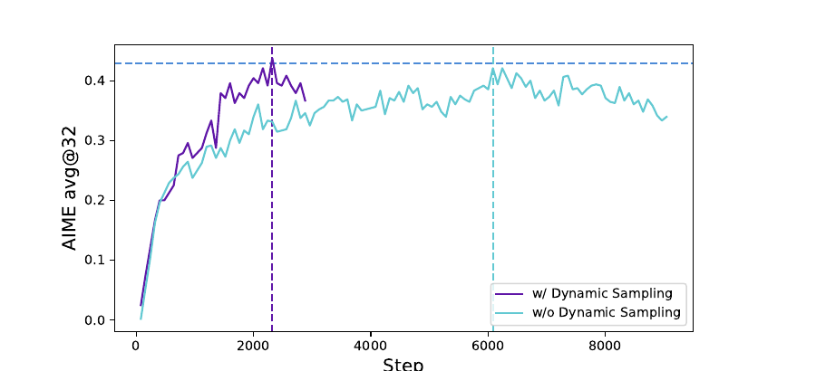
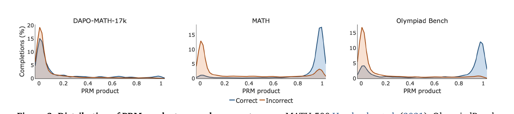
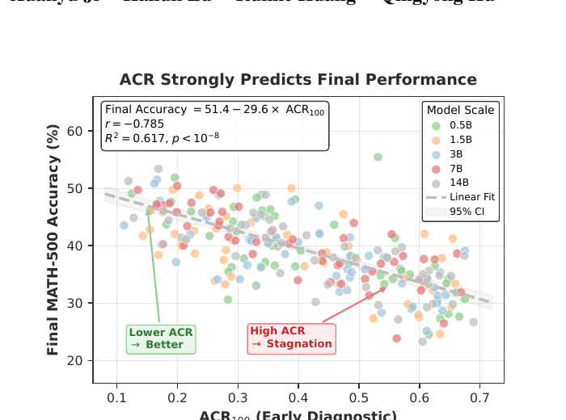

PPO and GRPO are usually classified as on-policy algorithms, yet practical LLM reinforcement learning rarely satisfies the ideal of sampling from the current policy and performing exactly one immediate update. Rollouts are expensive, so one batch is commonly split into mini-batches and reused for several optimization passes. In asynchronous systems, rollout workers can also lag behind the trainer. Training must therefore answer two separate questions: how far the current policy has moved from the data-generating policy, and whether the sampled batch still contains reward differences that can drive learning.

These failures require different remedies. PPO clipping addresses the first. When every GRPO response for a prompt receives the same reward, the second failure occurs: the advantage is already zero, leaving the ratio, clipping, and even a wider upper clip with nothing to act on.

This note follows that causal chain. For a broader derivation of PPO, GRPO, and KL regularization, see [PPO, DPO, and GRPO](PPO-DPO-GRPO.qmd) and [KL Divergence](kl-divergence-llm-rl.qmd). The focus here is when update signals disappear and which layer of the training system should be changed first.

## 1. Three policy objects and near-on-policy training

Three policy objects must be kept separate.

| Policy | Role | Updated within the current step? |
| --- | --- | --- |
| $\pi_{\mathrm{rollout}}$ or $\pi_{\mathrm{old}}$ | Generates the current batch and supplies old log-probabilities | Frozen during sampling |
| $\pi_\theta$ | The current policy being optimized | Updated every optimizer step |
| $\pi_{\mathrm{ref}}$ | KL reference, commonly a frozen base or SFT checkpoint | Usually frozen or refreshed infrequently |

Strict on-policy learning requires data from the policy currently being optimized. If $\pi_{\theta_k}$ generates a rollout and receives one update, the system is close to this condition. If the batch is reused for several epochs, data still come from $\pi_{\theta_k}$ while optimization has reached $\pi_{\theta_{k+2}}$ or $\pi_{\theta_{k+3}}$. Asynchronous rollout widens the lag further.

LLM PPO and GRPO are therefore better described as **near on-policy**: they rely on recent-policy data while permitting bounded reuse and mismatch. Replaying samples generated hours earlier, or retaining a long-lived behavior policy, moves the system toward off-policy learning. This is a continuum determined by the data path, not a binary property implied by an algorithm name.

{#fig-policy-lag-en width="95%" fig-align="center" fig-alt="A rollout policy produces fixed training data while the current policy receives repeated updates; ratio clipping and reference KL control short- and long-horizon policy gaps."}

The essential boundary is that $\pi_{\mathrm{old}}$ is not $\pi_{\mathrm{ref}}$. The former answers which policy sampled a token. The latter answers which policy should remain a long-horizon anchor. Treating both as one “old model” obscures what the ratio, clip, and KL terms constrain.

## 2. What the probability ratio and PPO clip actually mean

For a sampled action $a_t$ at state $s_t$, the importance ratio is

$$
\rho_t(\theta)
=
\frac{\pi_\theta(a_t \mid s_t)}{\pi_{\mathrm{old}}(a_t \mid s_t)}.
$$

$\rho_t=1$ means the action probability is unchanged, $\rho_t=1.2$ means an increase of about 20%, and $\rho_t=0.8$ means the probability has fallen to 80% of its old value. PPO-Clip optimizes

$$
L_{\mathrm{clip}}(\theta)
=
\mathbb{E}_t
\left[
\min\left(
\rho_t A_t,
\mathrm{clip}(\rho_t,1-\epsilon,1+\epsilon)A_t
\right)
\right].
$$

This is not equivalent to clipping every ratio first and then computing the loss. The objective evaluates both unclipped and clipped branches and selects the more conservative value.

- For $A_t \gt 0$, optimization should raise the action probability. Once $\rho_t \gt 1+\epsilon$, further increases no longer improve the surrogate objective.
- For $A_t \lt 0$, optimization should lower the action probability. Once $\rho_t \lt 1-\epsilon$, further decreases provide no additional gain.

Suppose $\pi_{\mathrm{old}}(\text{"cat"}\mid x)=0.05$ and the current policy assigns $0.06$. The ratio is 1.2. Raising the probability to $0.10$ gives a ratio of 2. For a positive-advantage token with $\epsilon=0.2$, the clipped branch has already saturated beyond 1.2.

Clipping therefore limits **how much additional surrogate-objective improvement can be obtained by moving the current policy away from the sampling policy on that action**. It does not clip parameters, rewards, or advantages directly. Other tokens, mini-batches, and loss terms can still move the same parameters. PPO clipping is also not a strict KL trust region and does not guarantee a fixed bound on whole-policy distance.

## 3. Why GRPO loses its gradient on all-correct and all-wrong groups

GRPO samples $G$ responses for the same prompt and constructs relative advantages from the group reward mean and standard deviation. Omitting the later broadcast across tokens,

$$
\hat{A}_i
=
\frac{R_i-\mathrm{mean}(R_1,\ldots,R_G)}
{\mathrm{std}(R_1,\ldots,R_G)+\varepsilon}.
$$

Whenever $R_1=\cdots=R_G$, every numerator is zero. The numerical stabilizer $\varepsilon$ prevents division by zero but cannot restore a learning signal:

$$
\hat{A}_1=\cdots=\hat{A}_G=0
\quad\Longrightarrow\quad
\sum_{i=1}^{G}\hat{A}_i\nabla_\theta\log\pi_\theta(o_i\mid q)=0.
$$

If an implementation retains explicit reference KL, that term may still produce a gradient. It only tells the policy to stay near the reference; it does not explain how to solve the prompt. [DAPO](https://arxiv.org/abs/2503.14476) removes the KL term from its objective, making KL unavailable even as this residual regularizing signal.

Under a simplified binary-reward model with independent samples and a fixed per-sample success probability $p$, the homogeneous-group probability is

$$
P_{\mathrm{homogeneous}}
=
p^G+(1-p)^G.
$$

The first term is all-correct and the second all-wrong. Both extremes become likely as $p$ approaches 1 or 0. This expression is only a mental model: prompts have heterogeneous difficulty, and decoded responses can be correlated. A 2026 [study of Sign advantages](https://arxiv.org/abs/2605.07689) reports a real degeneracy rate substantially above the simple i.i.d. Bernoulli estimate in its setting.

## 4. All-correct and all-wrong groups are not operationally symmetric

Both groups give $A=0$, but they should not be routed in the same way.

| Rollout state | First interpretation | First checks | Treatment |
| --- | --- | --- | --- |
| Nearly all correct | Already mastered or contaminated | Exact/near duplicates, SFT trace overlap, overly permissive verifier | Downsample, remove from the main RL pool, or retain for evaluation |
| Mixed | Prompt lies near the current capability frontier | Reward variance, clip fraction, KL, length and format distributions | Use as primary GRPO/DAPO training data |
| Nearly all wrong | Verifier failure or insufficient exploration support | Answer extraction, formatting, numerical tolerance, tool parser, pass@$G$ | Exploration, larger $G$, SFT bootstrap, process supervision, or curriculum |

{#fig-collapse-routing-en width="95%" fig-align="center" fig-alt="Prompts are routed by group accuracy into all-correct, mixed, and all-wrong paths, with migration from hard pool through the RL frontier into the easy pool."}

I would monitor `all_correct_rate`, `all_wrong_rate`, `nonzero_advantage_rate`, `std(R)`, and an EMA success rate per prompt. Batch mean reward is insufficient: the mean can remain stable while the fraction of samples producing useful gradients keeps falling.

## 5. DAPO Dynamic Sampling controls effective batch size

[DAPO](https://arxiv.org/abs/2503.14476) generates a response group for each prompt, removes groups whose accuracy is 0 or 1, and keeps sampling until the optimizer batch is filled with non-homogeneous groups. Optimizer steps are thereby concentrated on samples satisfying $0\lt\mathrm{accuracy}\lt1$.

{#fig-dapo-dynamic-en width="90%" fig-align="center" fig-alt="DAPO training curves comparing AIME avg@32 with and without Dynamic Sampling."}

*Source: [DAPO, Figure 6](https://arxiv.org/abs/2503.14476). The figure supports a sample-efficiency claim within this training setup; it does not establish lower total rollout cost on every task.*

Dynamic Sampling does not teach a hard prompt. Filtering a persistent $0/16$ group merely keeps it out of the current optimizer batch. If the prompt represents a capability the model must acquire, the training system still needs a hard pool and a mechanism that moves pass@$G$ above zero. Otherwise, filtering consistently removes the target capability from learning.

## 6. Making positive trajectories reachable again

An all-wrong group should first be classified as **rare success** or **zero support**. Rare success means a correct trajectory has low but nonzero probability; zero support means the current policy does not practically sample the required behavior.

Increasing group size helps with rare success because $(1-p)^G$ decreases with $G$. Rollout cost grows roughly linearly, however, and returns diminish. Raising temperature or adjusting top-p can also expose low-probability paths while increasing invalid or unverifiable outputs. These controls should be evaluated with pass@$G$, formatting failure, and verifier precision rather than accuracy alone.

If pass@$G=0$ persists, a small set of high-quality demonstrations can place the required trajectory inside the policy's reachable support before RL resumes. The SFT objective is not to push every training prompt directly to $p\approx1$; it is to move $p\approx0$ into an explorable region. Otherwise the system jumps from all-wrong starvation to all-correct starvation. [DeepSeek-R1](https://arxiv.org/abs/2501.12948) combines cold-start data with later reasoning RL, demonstrating a division of labor between initialization and policy optimization, but the report alone does not establish that its cold start specifically fixes advantage collapse.

## 7. Process rewards address sparsity and credit assignment together

Outcome rewards report final correctness but cannot identify which reasoning step caused success or failure. Every token in a trajectory receives the same sequence-level advantage. Rule-based step checkers, program execution, or verifiable intermediate states can differentiate process quality even when every final answer is wrong.

A learned PRM is not a ground-truth verifier. Aggregating PRM scores into a trajectory reward promotes systematic PRM bias to the sequence level and gives the policy room to exploit the reward model.

{#fig-verigate-prm-en width="92%" fig-align="center" fig-alt="VeriGate compares PRM product distributions for correct and incorrect trajectories on three mathematics datasets."}

*Source: [VeriGate, Figure 2](https://arxiv.org/abs/2605.30451). These results concern a particular PRM and mathematics datasets; they do not imply identical miscalibration for every process reward model.*

[VeriGate](https://arxiv.org/abs/2605.30451) uses a narrower intervention: it preserves outcome-verifier updates whenever they distinguish trajectories, invokes step-level supervision only when outcome rewards degenerate, and converts that supervision into token-level relative advantages. The transferable design principle is supervision priority. A reliable verifier owns final correctness; a PRM supplies local credit only when the verifier lacks resolution.

## 8. 2026 proposals: verified results and immature extrapolations

[Advantage Collapse Rate (ACR)](https://arxiv.org/abs/2605.21125) measures the fraction of groups in a batch whose reward standard deviation falls below a threshold. It is closer to the amount of ineffective training data than loss or mean reward alone. The same work proposes AVSPO, which injects virtual reward samples into normalization to construct nonzero relative signals for homogeneous groups.

{#fig-acr-performance-en width="88%" fig-align="center" fig-alt="A scatter plot relates early Advantage Collapse Rate to final MATH-500 accuracy across model scales and configurations."}

*Source: [Advantage Collapse in GRPO, Figure 1](https://arxiv.org/abs/2605.21125). The reported $R^2=0.617$ is correlational evidence within these configurations, not proof that lowering ACR yields the same accuracy gain under arbitrary training recipes.*

The newer proposals recover different kinds of signal:

| Method | How it restores signal | Current evidence boundary |
| --- | --- | --- |
| ACR + AVSPO | Monitors collapse and alters homogeneous-group normalization with virtual rewards | Mathematics experiments from 0.5B to 14B; task transfer and virtual-sample bias need further validation |
| VeriGate | Uses future-cumulated step rewards when verifier rewards degenerate | Qwen2.5 1.5B/7B and mathematics benchmarks; depends on PRM quality |
| Sign advantage | Replaces group-mean centering with fixed $A=2R-1$ | Main evidence is binary reward on GSM8K; an all-wrong group only says sampled trajectories are bad |
| Critic / global baseline | Breaks within-group zero variance with a value function or cross-prompt baseline | Adds model and systems cost and weakens GRPO's cancellation of prompt-difficulty offsets |

My priority remains to repair the reward pipeline, calibrate difficulty and sampling, restore exploration support and local credit, and only then change the advantage estimator. A new objective can make gradients nonzero. That does not automatically make their direction informative.

## 9. An operational sequence for training audits

The training system can converge on the failure in this order:

1. Audit the verifier on all-wrong groups, manually checking a small sample of answer extraction, formatting, numerical tolerance, and tool results.
2. Track an EMA success rate per prompt and move data dynamically among hard, frontier, and easy pools.
3. Prioritize mixed groups in optimizer batches. Use Dynamic Sampling to stabilize the effective group count while accounting separately for extra rollout cost.
4. For persistent all-wrong prompts, test larger $G$ and moderate exploration. If success remains zero, bootstrap with demonstrations, rejection sampling, or verifiable process supervision.
5. Monitor ACR, nonzero advantage rate, clip fraction, KL, entropy, response length, pass@1, and pass@$G$. Together they distinguish learning from policy contraction and zero-gradient compute waste.
6. Only after these paths are healthy should AVSPO, VeriGate, Sign advantages, or critic baselines be compared, with independent tasks checking generalization and reward hacking.

The governing distinction is simple. PPO clipping can constrain only a policy-gradient signal that already exists. When GRPO rewards contain no within-group difference, the first task is to recover feedback that is both **discriminative and directionally trustworthy**. All-correct data usually belong outside the main training frontier. All-wrong data must be separated into verifier errors, exploration failures, and capabilities that have not yet entered policy support. This routing keeps rollout compute focused on what the current model can actually learn next.

## References

- Schulman et al., [Proximal Policy Optimization Algorithms](https://arxiv.org/abs/1707.06347)
- Shao et al., [DeepSeekMath: Pushing the Limits of Mathematical Reasoning in Open Language Models](https://arxiv.org/abs/2402.03300)
- DeepSeek-AI, [DeepSeek-R1: Incentivizing Reasoning Capability in LLMs via Reinforcement Learning](https://arxiv.org/abs/2501.12948)
- Yu et al., [DAPO: An Open-Source LLM Reinforcement Learning System at Scale](https://arxiv.org/abs/2503.14476)
- He et al., [Advantage Collapse in Group Relative Policy Optimization: Diagnosis and Mitigation](https://arxiv.org/abs/2605.21125)
- Agrawal et al., [VeriGate: Verifier-Gated Step-Level Supervision for GRPO](https://arxiv.org/abs/2605.30451)
- Nie et al., [Gradient Starvation in Binary-Reward GRPO](https://arxiv.org/abs/2605.07689)
