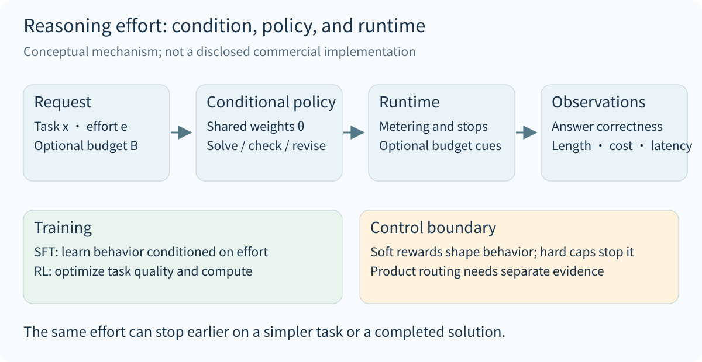
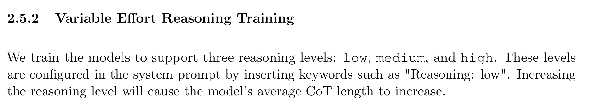
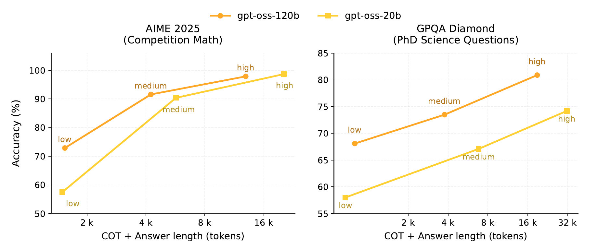
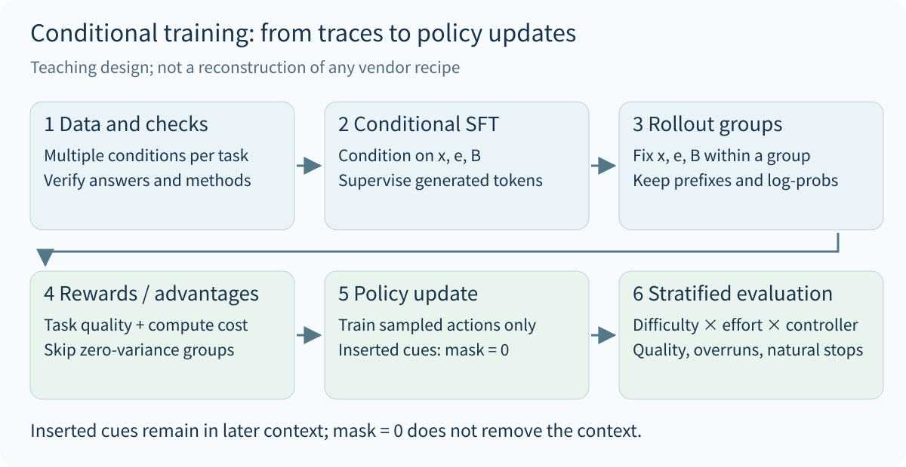
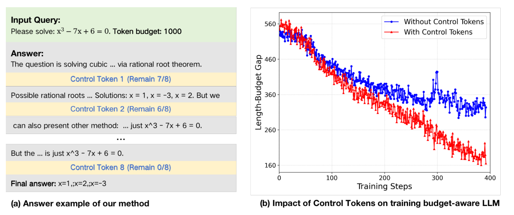
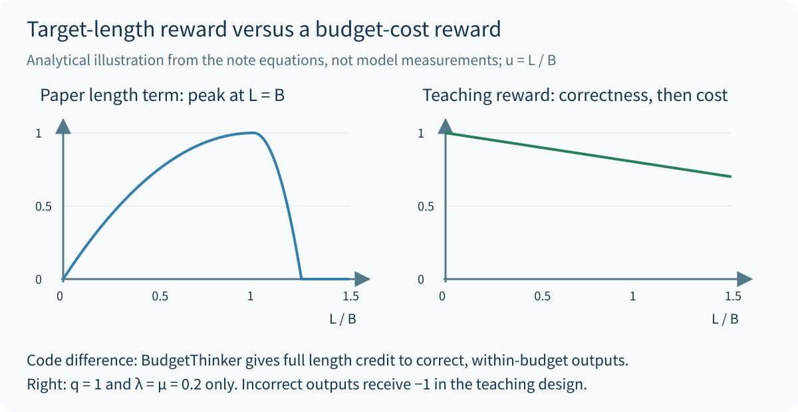
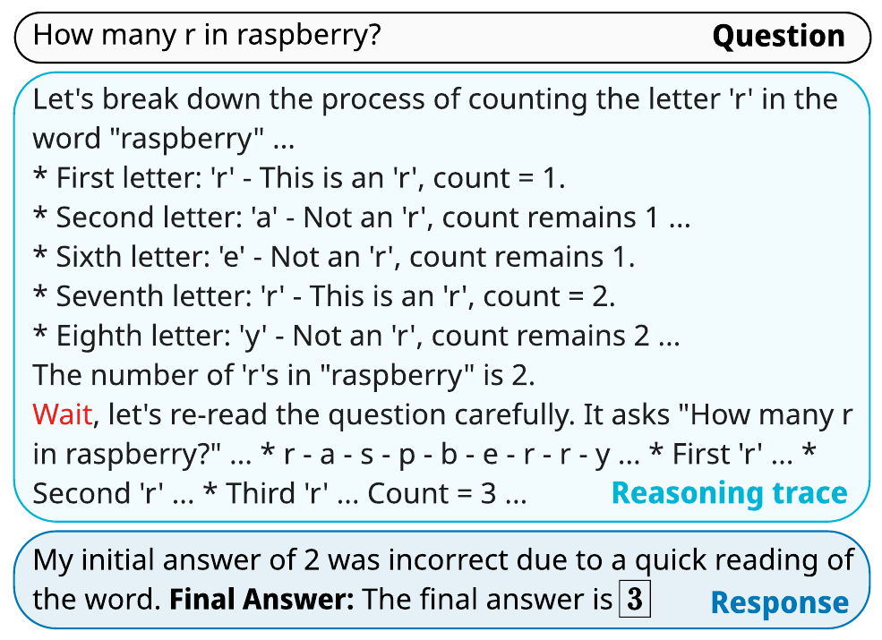

A model can implement `low / medium / high` reasoning effort through a conditional policy with shared weights. After receiving an effort or budget signal, it changes its solution strategy, verification behavior, and stopping decisions. Training determines whether that condition is useful; the inference service determines how the budget is enforced. Understanding the mechanism requires examining the input protocol, training objective, and decoding process together.

This note separates published facts, mathematical abstractions, and a teaching design. gpt-oss supplies evidence about the effort interface and its behavior; BudgetThinker exposes a training method for budget control; s1 demonstrates inference interventions; Qwen3 describes the fusion of reasoning and direct responses. Together they explain a design space, without reconstructing the training recipe of a closed product.

## 1. What reasoning effort controls

Let $x$ be a problem, $e$ an effort condition, $\tau$ a reasoning trajectory, and $a$ the final answer. A conditional autoregressive policy can be written as:

$$
\pi_\theta(\tau,a\mid x,e)
=\prod_{t=1}^{T}\pi_\theta(y_t\mid x,e,y_{\lt t}),
\qquad y=\tau\Vert a.
$$

The weights $\theta$ need not change. The conditioning sequence changes: tokenized effort instructions influence later predictions. The meaning of `Reasoning: high` depends on training. Adding that text to an arbitrary model does not establish reliable budget control.

| Control | What it changes | What it does not establish |
|---|---|---|
| Policy condition $e$ | The conditional output distribution | A separate checkpoint for high effort |
| Budget $B$ | A requested expenditure or upper bound | Exact token counting or compliance by the model |
| Output limit | The service's generation allowance | Sufficient room for both reasoning and the final answer |
| Stopping and continuation rules | Forced transitions, inserted cues, or continued generation | That every control effect resides in the weights |
| Product routing | The selected model, tools, or execution path | That every product uses one model across effort settings |

{width="95%" fig-align="center"}

The cost measure also needs a definition. Reasoning tokens, total output tokens, sequential decoding steps, tool time, and end-to-end latency are different quantities. The teaching design below uses the number of model-generated reasoning tokens $L$ as a cost proxy and tracks answer length separately. The gpt-oss chart uses **CoT plus answer length**. Computation per token may also differ across models.

## 2. gpt-oss: public evidence and disclosure boundaries

Section 2.5.2 of the gpt-oss model card states that the models are trained to support three effort levels, selected through the system prompt, and that higher effort increases average CoT length. Section 2.5 describes post-training with CoT RL techniques similar to those used for o3.[^oss-card]

{width="90%" fig-align="center"}

The reference implementation maps `--reasoning-effort` into Harmony's `SystemContent.with_reasoning_effort(...)`. Checkpoint loading is separate from construction of this system message. This supports the interpretation of effort as an input condition on the same model; it does not disclose the training examples, reward weights, or budget mapping.[^oss-code]

{width="95%" fig-align="center"}

These are aggregate results under particular evaluation settings. They do not show that more tokens improve every problem, or isolate the causal contribution of additional computation from a different conditional policy. Isolating those effects would require fixing the model and problems, controlling actual computation, and then comparing effort conditions.

The release announcement also mentions SFT and high-compute RL, without reconstructing the stage-by-stage order of effort training.[^oss-release] The API documentation describes model-dependent effort values and adaptive reasoning within an effort setting. The interface behavior is documented; the internal budget function is not.[^api]

Thus, `low = 512`, `medium = 2048`, and `high = 8192` can serve as configurations in a custom experiment. They are not official mappings for gpt-oss or the OpenAI API.

## 3. Conditional SFT: giving budget signals behavioral meaning

### 3.1 Samples and supervision

A teaching dataset can be organized as $D=\{(x,e,B,\tau,a)\}$, with optional $B$. Effort expresses relative investment; a numeric budget expresses an explicit constraint. An implementation should define their relationship and avoid conflicting signals.

$$
\mathcal L_{\mathrm{SFT}}
=-\mathbb E_{D}\left[
\frac{1}{\sum_t m_t}
\sum_t m_t\log\pi_\theta(y_t\mid x,e,B,y_{\lt t})
\right].
$$

Here, normalization by the number of supervised tokens prevents a sample from receiving more total weight solely because its trace is longer. The mask $m_t$ selects supervision positions: the problem and condition provide context, while the target solution and answer are supervised. Whether externally injected signals also receive SFT prediction loss is an explicit design choice. This note excludes them; that is not a universal convention across published implementations.

Condition confounding is an important data issue. If every low-effort example is easy and every high-effort example is difficult, the model may rely on problem difficulty and ignore effort. Retaining several verified solution styles for the same problem, while covering difficulty across conditions, makes the condition's contribution easier to learn. It does not require mechanically producing three texts for every problem.

### 3.2 A paired training example

The following manually written teaching example illustrates the connection between a condition and a solution style. It is not a model execution trace, and its texts are not claimed to consume an exact number of tokens.

| Problem: evaluate $\int_0^1 x e^x\,dx$ | Low condition | High condition |
|---|---|---|
| Solution text | Integration by parts gives antiderivative $(x-1)e^x$; evaluating the endpoints gives $1$ | Set $u=x$ and $dv=e^x dx$, then derive the antiderivative; differentiate $(x-1)e^x$ to recover $xe^x$; evaluate the endpoints and check that the result is positive |
| Final answer | $1$ | $1$ |
| Supervision intent | Preserve a sufficient, concise solution | Allow independent verification when useful |

The additional checks have specific targets: the antiderivative and the boundary values. Fabricating a failed substitution or requiring backtracking phrases merely to lengthen the trace would teach the wrong behavior. A sufficient short solution should also be allowed at high effort. For a problem such as $2+2$, every setting can answer briefly. Effort should influence available strategies and willingness to spend computation, without imposing a minimum essay length on each task.

SFT can establish these behavioral associations. It does not guarantee reliable stopping at unseen budgets or improved correctness from longer traces. RL must then determine which generated behaviors are worth retaining under each condition.

## 4. RL: optimizing task quality and computation

### 4.1 A constrained objective and a computation price

A useful mathematical abstraction constrains expected cost for each effort:

$$
\max_\theta\ \mathbb E[R_{\mathrm{task}}]
\quad\text{subject to}\quad
\mathbb E[C(\tau)\mid e]\le B_e.
$$

Its Lagrangian is:

$$
\mathcal J(\theta,\lambda)
=\mathbb E[R_{\mathrm{task}}]
-\sum_e p(e)\lambda_e
\left(\mathbb E[C(\tau)\mid e]-B_e\right),
\qquad \lambda_e\ge0.
$$

For a policy update with fixed $\lambda_e$, the term $\lambda_e B_e$ does not affect the policy gradient, leaving the reward $R_{\mathrm{task}}-\lambda_e C(\tau)$. If the dual variables are also updated to track the budgets, the $B_e$ term remains necessary. Neural optimization does not guarantee a globally optimal feasible solution, and an expectation constraint does not guarantee compliance on every request.

Choosing $\lambda_{\mathrm{low}}\gt\lambda_{\mathrm{medium}}\gt\lambda_{\mathrm{high}}$ is a teaching design in which low effort is more cost-sensitive. The ordering does not follow necessarily from the names, and there is no evidence here that a vendor uses this exact loss. Budget conditioning, training data, and runtime control can produce similar observable behavior.

The schematic expression $R=R_{\mathrm{correct}}+\alpha R_{\mathrm{reason}}+\beta R_{\mathrm{budget}}-\lambda R_{\mathrm{cost}}$ is only a checklist of possible components. Each needs an operational definition. In particular, reflective wording is a poor substitute for reasoning quality. OpenAI's o1 report describes decomposition, error correction, and trying alternative methods after RL; it does not establish that those surface behaviors must receive direct rewards.[^o1]

### 4.2 GRPO groups with fixed conditions

The teaching design fixes $(x,e,B)$ and samples $G$ trajectories from the rollout policy. Advantages are standardized within the group:

$$
A_i=\frac{R_i-\overline R}{s_R+\epsilon},
\qquad
\overline R=\frac1G\sum_{j=1}^{G}R_j.
$$

Reward scales and acceptable costs may differ across effort settings. Comparing trajectories under the same condition, then mixing several groups for updates, avoids confusing a more generous budget with a better trajectory. Equal-reward groups provide no relative learning signal; this design skips them and records their frequency. DeepSeekMath is the original source for GRPO.[^grpo]

Let $h_{i,t}$ contain the actual problem, condition, generation history, and inserted signals. Let $m_{i,t}$ select only model-sampled actions. One illustrative objective with KL regularization is:

$$
\begin{aligned}
\rho_{i,t}(\theta)
&=\frac{\pi_\theta(y_{i,t}\mid h_{i,t})}
{\pi_{\mathrm{old}}(y_{i,t}\mid h_{i,t})},\\
\mathcal J_{\mathrm{clip}}
&=\frac1G\sum_{i=1}^{G}\frac1{M_i}\sum_t m_{i,t}
\left[
\min\left(\rho_{i,t}A_i,
\mathrm{clip}(\rho_{i,t},1-\eta,1+\eta)A_i\right)
-\beta D_{i,t}
\right],\\
M_i&=\sum_t m_{i,t}.
\end{aligned}
$$

Here, $D_{i,t}$ is the current-to-reference KL term or a specified estimator of it, $\eta$ is the clipping range, and $\beta$ controls regularization. This objective explains the mechanism without claiming to match a framework's defaults. Averaging within each trajectory also affects the weighting of short and long traces and should be recorded as an experimental choice.

**An externally inserted budget cue is not a policy-sampled action.** It remains in the attention context, but its policy-loss mask is zero in this design. Log probabilities for subsequent generated tokens must use the actual prefix containing that cue. If the decoder also suppresses stop tokens or otherwise changes the sampling distribution, the behavior distribution and any required correction must match. A mask alone cannot repair arbitrary off-policy mismatch.

{width="95%" fig-align="center"}

## 5. Published methods: training, signals, and runtime intervention

### 5.1 BudgetThinker's paper objective and code differences

BudgetThinker periodically inserts special tokens representing budget progress. SFT assigns budgets using $B=T\lceil |y|/T\rceil$ and mixes long and short solutions, followed by GRPO. The paper uses $K=8$, $T=50$, a budget curriculum of $6000\rightarrow4000\rightarrow3000\rightarrow2000$, and a final mixed-budget phase.[^budget]

{width="95%" fig-align="center"}

Writing the paper's response length as $L=|y|$, its reward is:

$$
\begin{aligned}
R_{\mathrm{paper}}&=0.7q+0.15f+0.15r_{\mathrm{len}},\\
r_{\mathrm{len}}(L,B)&=\max\left(1-\gamma\left(\frac{B-L}{B}\right)^2,0\right),\\
\gamma&=\begin{cases}1,&L\le B,\\16,&L\gt B.\end{cases}
\end{aligned}
$$

The terms $q$ and $f$ denote correctness and format checks. Direct evaluation at $L/B=0.5,1,1.25$ gives length rewards of $0.75,1,0$. Holding other terms fixed, the reward peaks at $L=B$. Taken alone, this length term rewards a short, within-budget output for moving closer to the target length. That differs from stopping as soon as a correct solution is complete. This is an analysis of the objective, not a claim that padding was observed in an experiment.

The code needs separate inspection. At official repository commit `481da904`, `reason_with_in_limit_compute_score` overrides the length reward to $1$ for **correct, within-budget** outputs. Its helper also applies coefficient $16$ to the under-budget branch when $B\lt1500$.[^budget-code] The paper's curve therefore does not describe every branch of this revision. Conversely, current code differences do not establish which recipe produced the paper's experiments.

{width="95%" fig-align="center"}

A further evaluation boundary matters: the paper truncates reasoning at the budget, prompts the final answer, and permits 50 additional answer tokens.[^budget] Reported behavior therefore includes both the model and its runtime. Natural stopping, forced termination, and answer completeness should be measured separately. Length after forced truncation does not demonstrate that the model independently learned budget compliance.

### 5.2 s1: extending or terminating reasoning during decoding

s1 combines SFT with budget forcing. It ends thinking at an upper bound; when a model tries to finish early, the decoder can suppress the end-of-thinking delimiter and append `Wait`. The method does not require an additional budget-RL stage. The paper reports an AIME24 increase from 50% without intervention to 57% with budget expansion for s1-32B. This is a result for a particular model and evaluation setup, not a guarantee that extending reasoning always helps.[^s1]

{width="80%" fig-align="center"}

The example illustrates how runtime intervention can change a trajectory. A single correction does not establish general self-correction ability. Describing sequential reasoning as search in token space is a behavioral analogy; it does not imply an explicit search tree, independent branches, or a tree-search algorithm. Parallel sampling followed by voting is another allocation of computation and should be compared separately from extending one trajectory.

### 5.3 Qwen3: combining reasoning with direct responses

Qwen3's published post-training pipeline comprises long-CoT cold start, reasoning RL, Thinking Mode Fusion, and general RL. Mode fusion uses long-CoT and ordinary instruction data to support both reasoning and direct responses in one model.[^qwen] This shows that mode switching involves behavioral training. It does not establish precise control over arbitrary continuous budgets.

| Method | Main disclosed mechanism | Supported conclusion |
|---|---|---|
| gpt-oss | System-prompt effort and variable-effort training | One model can exhibit stable differences under effort conditions |
| BudgetThinker | Progress tokens, SFT, GRPO, budget curriculum, and inference truncation | Training and runtime can jointly implement budget awareness |
| s1 | SFT and budget forcing | Inference control can change computation and performance on some tasks |
| Qwen3 | Reasoning training and mode fusion | Direct answers and extended reasoning can coexist in one model |

Conditioning on a budget resembles Decision Transformer's conditioning on target returns at the broad level of selecting behavior through an additional signal. But a budget is a resource constraint, while return-to-go is a target return. Their data, objectives, and decision processes differ; the analogy does not establish algorithmic equivalence.[^dt]

## 6. An inspectable teaching design

### 6.1 Data, budgets, and rewards

This design connects the mechanisms above; no model training was performed for this note. Start with an open model that already has basic reasoning ability, fix its tokenizer and template, and use automatically verifiable mathematics or coding tasks. Split by problem into training, validation, and test sets so that different effort versions of one problem cannot cross splits.

A sample records `problem_id`, `question`, `effort`, `budget`, `reasoning`, `answer`, and verification results. A rollout additionally retains exact token sequences, external insertion positions, behavior-policy log probabilities, action masks, stop reasons, and reward components. These are illustrative record fields, not a new API in this repository.

An initial experiment can map the three efforts to $B_e\in\{512,2048,8192\}$ and cover multiple efforts for training problems. If a correct short solution cannot be found, do not fabricate one as an SFT label; the problem can remain a difficult RL or evaluation case. Mixed-budget training helps address condition forgetting, with its proportions selected on validation data.

To avoid rewarding either padding or indiscriminate shortening, the teaching reward first ranks correct outputs above incorrect ones and then applies bounded costs to correct outputs. Let $u=L/B_e$:

$$
R_{\mathrm{teach}}
=q\left[1-\lambda_e\min(u,1)
-\mu\min\bigl(\max(u-1,0),1\bigr)\right]-(1-q).
$$

Choose $\lambda_e\in\{0.20,0.10,0.05\}$ for low, medium, and high, respectively, and $\mu=0.20$. An incomplete or incorrect final answer has $q=0$ and receives $-1$; a correct answer receives at least $0.6$. Saving tokens cannot make an incorrect answer outrank a correct one under this scalar reward. However, an entirely incorrect group has no relative signal, making the data curriculum and initial reasoning ability important.

For example, a correct low-effort trajectory receives $0.9,0.8,0.75$ at $u=0.5,1,1.25$. These are chosen preferences, not optimal hyperparameters. Answer-generation cost is also omitted from this reward. If the model moves reasoning into the final answer, $L$ may fall without reducing total cost. Total output length and answer format must therefore be monitored as well.

### 6.2 Sampling, scoring, and updating

The pseudocode uses full-distribution sampling at temperature 1, without top-k or top-p truncation, to reduce ambiguity between behavior and training probabilities. It samples $G=8$ trajectories per fixed-condition group and uses the SFT checkpoint as the reference. A clipping range of $0.2$ and KL coefficient of $0.01$ are teaching defaults only.

```text
for batch of problems:
    groups = []
    for problem in batch:
        effort = sample_one_of(low, medium, high)
        B = budget_for(effort)
        trajectories = sample_group(
            old_policy, problem, effort, B, G = 8,
            temperature = 1, top_p = 1,
            thinking_safety_cap = 2 * B, answer_cap = 256
        )
        # Keep injected cues in context.
        # Exclude external cues and forced delimiters from policy loss.
        for trajectory in trajectories:
            q = verify_completed_final_answer(trajectory)
            L = count_model_generated_thinking_tokens(trajectory)
            reward = teaching_reward(q, L, B, effort)
            record_tokens_masks_logprobs_and_stop_reason(trajectory, reward)
        if reward_std(trajectories) <= 1e-8:
            record_zero_variance_group()
            continue
        groups.append(normalize_advantages_within_group(trajectories))
    if groups:
        update_clipped_policy(groups, reference = sft_policy,
                              clip = 0.2, kl_coef = 0.01)
    refresh_rollout_policy_after_update()
```

The training safety cap $2B$ leaves room to score trajectories that exceed the target budget; it does not require consuming $2B$. At that cap, the runtime transitions to the final-answer phase using the model's appropriate protocol and reserves answer space. Forced transition tokens are external events. If new vocabulary entries implement control tokens, the tokenizer, embeddings, and decoder must be updated together. Writing a tag in a document is not a complete implementation.

Adaptive stopping can be represented by $p_\theta(\mathrm{stop}\mid h_t,e,B)$, the probability of entering the answer phase at the current position. Existing delimiter generation may implement it without a separate stopping network. Continuing when expected improvement exceeds computation cost is a decision-theoretic interpretation; this note does not claim to have measured such an internal value estimate.

### 6.3 Separating control effects from training gains

| Evaluation question | Controls or strata | Metrics |
|---|---|---|
| Does the model use the effort condition? | Same checkpoint and problems across effort levels, stratified by difficulty | pass@1, median and P90 reasoning length, paired length differences |
| Does the model naturally follow budgets? | Target-budget prompt with a generous safety cap, no forced stop at the target | Natural stopping, target overruns, safety-cap truncation |
| Can it finish under a hard budget? | Equal thinking caps, answer allowances, and stopping rules | Accuracy, answer completeness, actual total output |
| Which component causes the gain? | SFT versus SFT+RL; progress cues on/off; forced stopping on/off | Accuracy versus actual cost, with confidence intervals |
| Is it only optimizing the token proxy? | Fixed hardware, concurrency, cache, and tools | Time to first answer token, P50/P95 total latency, tool time |

Evaluate unseen problems and intermediate budgets first, followed by very tight and generous budgets. Reporting only training settings misses generalization. Plot actual consumption, rather than treating the requested budget as computation already spent. A short high-effort answer to an easy problem is reasonable. High-effort regressions on individual problems also belong in the evaluation.

## 7. Checking common explanations

| Common claim | More precise interpretation |
|---|---|
| High effort selects stronger weights | gpt-oss supports input conditioning on the same checkpoint; product routing needs separate evidence |
| High effort means thousands of extra tokens | Effort changes a distribution; budgets and stopping rules bound execution, and extra text can be unproductive |
| Low is exploitation and high is search | A rough behavioral analogy, not two established algorithms |
| Effort must be trained with RL | SFT, RL, and inference interventions can all contribute; s1 needs no additional budget-RL stage |
| Each effort has a fixed token cap | Illustrative budgets are not vendor settings; average usage differs from per-request limits |
| RL must reward reflection or backtracking phrases | Outcome rewards can support these behaviors; wording does not establish useful verification |
| No direct CoT alignment means no trace supervision | A statement about monitoring and safety alignment does not establish the absence of SFT throughout training |
| A soft reward guarantees budget compliance | Soft objectives shape behavior; per-request hard limits require runtime enforcement |

One easily overextended statement appears in Section 4.4 of the gpt-oss model card: in its discussion of CoT monitorability, the authors say they did not directly optimize the CoT. That passage does not enumerate every training signal. It cannot establish the absence of trajectory learning or prove that all correction behaviors arise exclusively from final rewards.[^oss-card] DeepSeek-R1 also distinguishes the direct-RL R1-Zero route from R1's use of cold-start data, reinforcing the need to avoid generalizing one training route to every reasoning model.[^r1]

The acceptance criterion I would prioritize is whether a model can change its solution strategy under different conditions, preserve correctness at comparable actual cost, and stop when the task is complete. Length control is only part of that capability. Conditional signals, useful training feedback, and reliable runtime boundaries jointly determine whether effort settings work. Public evidence explains these mechanisms without revealing the complete recipe of any closed product.

## References

[^oss-card]: OpenAI. [gpt-oss-120b & gpt-oss-20b Model Card](https://cdn.openai.com/pdf/419b6906-9da6-406c-a19d-1bb078ac7637/oai_gpt-oss_model_card.pdf). August 5, 2025 release PDF; Sections 2.5, 2.5.2, 4.4, and Figure 3.
[^oss-code]: OpenAI. [gpt_oss/chat.py](https://github.com/openai/gpt-oss/blob/7b583341fe16729127f6d5b94a7b09ccae97e1a1/gpt_oss/chat.py#L79-L85). Commit `7b583341`; see also `REASONING_EFFORT` in that file.
[^oss-release]: OpenAI. [Introducing gpt-oss](https://openai.com/index/introducing-gpt-oss/). August 5, 2025.
[^api]: OpenAI. [Reasoning models](https://developers.openai.com/api/docs/guides/reasoning). Interface documentation checked September 24, 2026; not evidence of an internal training recipe.
[^o1]: OpenAI. [Learning to reason with LLMs](https://openai.com/index/learning-to-reason-with-llms/). September 12, 2024.
[^grpo]: Shao et al. [DeepSeekMath: Pushing the Limits of Mathematical Reasoning in Open Language Models](https://arxiv.org/abs/2402.03300). Original source for GRPO.
[^budget]: Wen et al. [BudgetThinker: Empowering Budget-aware LLM Reasoning with Control Tokens](https://arxiv.org/abs/2508.17196v2). August 29, 2025, v2; Sections 2–3 and Figure 1. Notation is normalized here, including removal of a duplicated equals sign in the paper.
[^budget-code]: MobileLLM. [reason_with_in_limit.py](https://github.com/MobileLLM/BudgetThinker/blob/481da9045f761ba34899271db846d659110b7065/easyr1/verl/utils/reward_score/reason_with_in_limit.py#L36-L65). Commit `481da904`; static code inspection, without rerunning the authors' training.
[^s1]: Muennighoff et al. [s1: Simple test-time scaling](https://arxiv.org/abs/2501.19393v3). March 1, 2025, v3; Section 3.1 and Figure 3. The cited results concern s1-32B and are not mixed with s1.1 results.
[^qwen]: Qwen Team. [Qwen3: Think Deeper, Act Faster](https://qwenlm.github.io/blog/qwen3/). April 29, 2025; Post-training.
[^dt]: Chen et al. [Decision Transformer: Reinforcement Learning via Sequence Modeling](https://arxiv.org/abs/2106.01345). Budget and target-return conditioning are compared only conceptually.
[^r1]: DeepSeek-AI. [DeepSeek-R1: Incentivizing Reasoning Capability in LLMs via Reinforcement Learning](https://arxiv.org/abs/2501.12948). Training routes for R1-Zero and R1.
