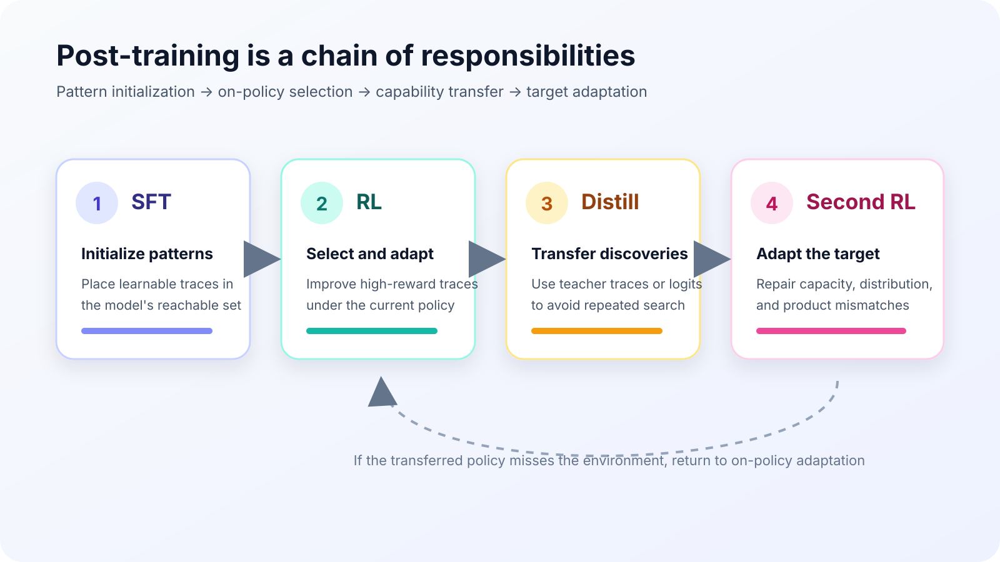
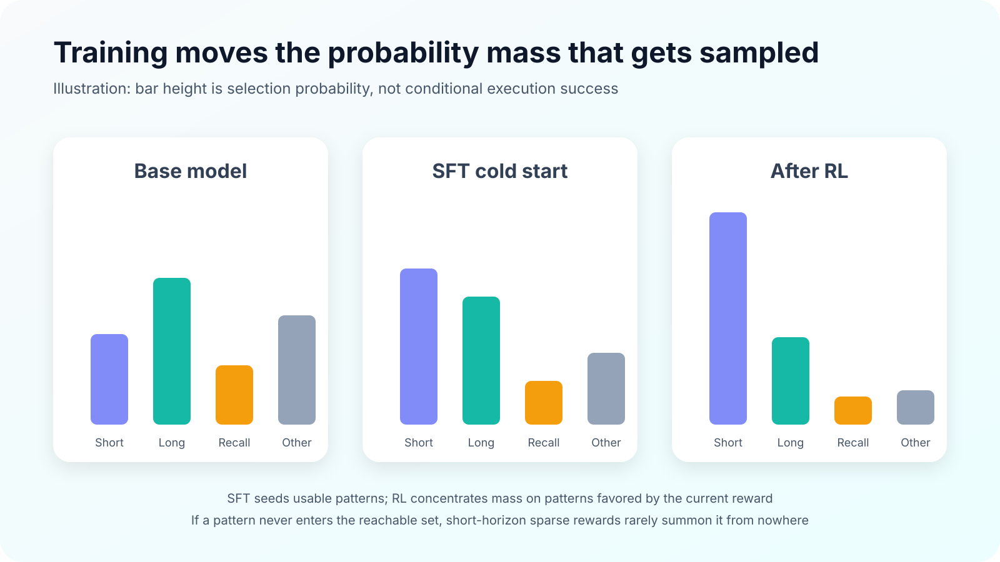
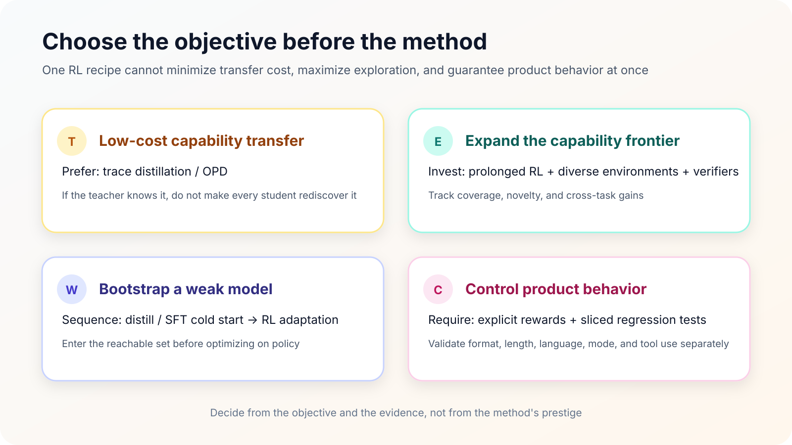

A recurring dispute about RL asks whether it teaches a model genuinely new reasoning or merely makes answers already latent in the base model easier to sample. The question stays muddy if “capability” is treated as one indivisible scalar. A more useful decomposition separates four things: whether a reasoning pattern exists, how likely it is to be selected, whether it can be executed reliably, and whether we can control when it appears.

Under this view, SFT, RL, and distillation are not interchangeable training options. SFT primarily places patterns inside the target model's reachable set. RL selects, reinforces, and adapts patterns under the current policy distribution. Distillation transfers valuable patterns that have already been discovered. If the transferred policy does not fit the new model or environment, a second RL stage performs on-policy correction.

{#fig-role-map-en fig-align="center" width="90%"}

This is not a mandatory pipeline. Sometimes SFT is sufficient; sometimes an RL model ships directly; sometimes there is no reliable teacher to distill. The diagram describes responsibilities, not a required number of stages.

## First define a reasoning pattern

Consider a deliberately simple problem: $997 \times 1003$. A model can produce at least three kinds of correct trajectory.

1. **Short and generalizable:** recognize $(1000-3)(1000+3)=1000^2-3^2$ and obtain $999991$.
2. **Long but executable:** use long multiplication or expand every term. The trace is verbose, but it remains a procedure that transfers to other integer products.
3. **Answer recall:** reproduce $999991$ because the problem or answer pair appeared in training, without being able to explain a nearby case.

All three trajectories may receive a final reward of 1, yet they have different generalization value. “Short” is not automatically superior to “long,” either. For a model with reliable algebraic abstractions, the first route is efficient. For a smaller model that often fails during symbolic transformation, redundant intermediate states may raise conditional success. Training must therefore handle more than correctness: it must choose a pattern and ensure that this particular model can execute it.

## A minimal model for the discussion

Let $\mathcal{R}(x)$ be the reachable set of reasoning patterns for input $x$, $\pi_{\theta}(r\mid x)$ the probability that the current policy selects pattern $r$, and $c_{\theta}(r,x)$ the probability of successful execution once that pattern has been selected. Then:

$$
P_{\theta}(\mathrm{success}\mid x)
=
\sum_{r \in \mathcal{R}(x)}
\pi_{\theta}(r\mid x)\,c_{\theta}(r,x)
$$

This is an analytical abstraction, not an exact decomposition of Transformer internals. Its value is that it separates two quantities that are often conflated:

- **Pattern selection probability** $\pi_{\theta}$: whether the model enters a solution family.
- **Conditional execution success** $c_{\theta}$: whether it completes that family reliably after entering it.

SFT moves probability mass toward demonstrated trajectories and may improve local execution through dense token supervision. RL samples from the current policy and reallocates mass according to reward; sufficiently long and diverse training may also improve execution within some patterns. Distillation uses a teacher to expose trajectories the student rarely visits or to supply denser logit preferences. Each method can improve final accuracy, but it intervenes at a different point.

## SFT initializes; RL selects on the current distribution

Calling SFT a cold start does not mean it merely teaches formatting. Its more consequential role is to make task-relevant patterns sampleable by the current model. For a strong base model, a small demonstration set may only reweight patterns that are already available. For a weak base model, the same data must also build an execution scaffold.

[Reshaping Reasoning in LLMs](https://arxiv.org/abs/2506.04695) interprets RL dynamics as pattern selection: conditional success rates of reasoning patterns remain relatively stable, while training reshapes their probabilities through a small number of critical tokens. Base-model quality affects convergence, and SFT initialization can mitigate slow convergence in weaker models. This supports the view that much of RL's gain comes from distribution reshaping, but it is not a universal theorem over all tasks and training scales.

{#fig-pattern-mass-en fig-align="center" width="90%"}

There is another issue that uniform data recipes tend to hide: **the best trace for a teacher may not be the best trace for a student.** A large model can compress several steps into one reliable transition; a small model may need explicit intermediate states. Conversely, copying every long self-check from a teacher can waste student capacity and create more opportunities for error. Weak models therefore often benefit from “high-quality distillation or SFT cold start → RL adaptation”: neither sparse-reward search from scratch nor permanent dependence on teacher trajectories is ideal.

## Does RL create new capability? The evidence points both ways

[Does Reinforcement Learning Really Incentivize Reasoning Capacity in LLMs Beyond the Base Model?](https://arxiv.org/abs/2504.13837) reports a sharp result. In its mathematical RLVR setting, training improves pass@1 while sometimes reducing pass@k at large sample counts. Correct paths become easier to sample, but some paths covered by the base model recede from the policy distribution. The paper therefore characterizes conventional RLVR as improving sampling efficiency while narrowing reasoning coverage.

{#fig-rlvr-boundary-en fig-align="center" width="90%"}

*Source: [capability-boundary study, Figure 1](https://arxiv.org/abs/2504.13837).*

[ProRL](https://arxiv.org/abs/2505.24864) supplies a different body of evidence. It prolongs RL training, mixes verifiable tasks spanning mathematics, code, logic puzzles, STEM, and instruction following, and maintains exploration with KL control and reference-policy resets. The paper reports continued gains in pass@1 and pass@16, higher solution novelty, and cross-task improvements.

{#fig-prorl-en fig-align="center" width="90%"}

*Source: [ProRL, Figure 1](https://arxiv.org/abs/2505.24864).*

The two papers do not reduce to one “disproving” the other. They alter training duration, task diversity, exploration machinery, and evaluation criteria. A defensible synthesis is: **most observable gains in conventional short-horizon RLVR are distributional reallocation over existing patterns; prolonged training, diverse tasks, or interactive environments may expand the reachable boundary.** The qualifier matters. A boundary-expansion claim needs more than greedy accuracy: it should track large-$k$ coverage, solution novelty, transfer tasks, and whether comparable traces were ever sampled from the pre-RL baseline.

## RL also trains behavioral control

Treating RL purely as mathematical correctness optimization misses another job it performs in product models: controlling output format, language, length, reasoning mode, and tool use. Prompting or context-window tricks do not reliably solve these targets across many conflicting requests; the model must learn a consistent policy.

[The Qwen3 Technical Report](https://arxiv.org/abs/2505.09388) provides a useful stage-wise view in Table 22. Stage 3 brings thinking and non-thinking behavior into one model through thinking-mode fusion, then Stage 4 applies general RL to calibrate broad behavior. Relative to Stage 2, Stage 4 raises IFEval strict prompt in thinking mode from 73.0 to 85.0 and ToolUse from 63.3 to 85.5. Non-thinking LengthCtrl reaches 87.3, while ThinkFollow rises from 88.7 at Stage 3 to 98.9.

{#fig-qwen3-control-en fig-align="center" width="88%"}

*Source: [Qwen3 Technical Report, Table 22](https://arxiv.org/abs/2505.09388).*

The regressions matter as much as the gains. In thinking mode, AIME'24 falls from 83.8 to 81.4 and LiveCodeBench v5 from 68.4 to 65.7. Better control is not a free improvement to every capability. In practice, format, language, length, reasoning mode, and tool use need separate rewards and sliced regression suites, with retention sets for mathematics, code, and knowledge. A single aggregate score can easily relabel a capability tradeoff as universal progress.

## Distillation transfers patterns already discovered

If a strong model already performs a behavior reliably, making every smaller model rediscover it with RL is rarely the cheapest option. Three transfer routes are common:

- **Rejection-sampling SFT:** generate candidates, filter them with a verifier, and train on hard targets. It is stable and inexpensive, but the retained traces remain off policy.
- **Trajectory distillation:** imitate a strong teacher's full reasoning traces. This can import patterns the student rarely samples, but teacher–student capacity gaps and distribution shift remain.
- **On-policy distillation (OPD):** let the student generate from its current policy and ask the teacher for token-level distributions on those states. This combines on-policy states with dense supervision, at the cost of teacher forward passes and dependence on teacher quality.

[DeepSeek-R1](https://arxiv.org/abs/2501.12948) directly shows that distilling R1 traces into Qwen 32B is substantially stronger than applying RL directly to the same Qwen 32B base. The report also treats language mixing and poor readability in pure-RL R1-Zero as reasons for adding a cold start and multi-stage training. Qwen3 makes the cost comparison more explicit: on its 8B model, OPD improves every listed metric while reporting 1,800 GPU hours, versus 17,920 GPU hours for direct RL.

{#fig-qwen3-opd-en fig-align="center" width="88%"}

*Source: [Qwen3 Technical Report, Table 21](https://arxiv.org/abs/2505.09388). Values in parentheses are pass@64.*

This does not establish that distillation always beats RL. The table measures transfer cost when a strong teacher already exists; it does not decide who discovers a policy that the teacher cannot yet perform. A better allocation of responsibility is: **explorers use RL, environments, and verifiers to open the frontier; followers use distillation to reduce transfer cost; students use smaller RL stages to adapt the result to their own distribution.** For OPD objectives, reverse KL, and multi-teacher integration, see the repository's [OPD: Capability Integration Interface in Post-training](../opd/post-training-opd.qmd) rather than repeating the derivation here.

## What I mean by “soft distillation”

I use “soft distillation” for a broader engineering pattern. A team may not copy teacher logits or complete trajectories, yet still use a stronger external model to synthesize boundary cases, cluster failures, draft verifiers, audit reward loopholes, or decompose an agent workflow. This is not the strict knowledge-distillation term from the literature. It is a description of how information flows through model development.

My experience is that this form of soft distillation becomes difficult to avoid whenever an external model is clearly ahead on the target capability. Its value is not merely “more answers.” It helps a team decide what data to sample, where a reward can be exploited, and whether the current model lacks a pattern or only execution stability. A technical report that claims this benefit should record the teacher version, prompts, filtering rules, rate of human intervention, and contamination checks. Without those controls, it remains engineering experience rather than a public comparative experiment.

Capacity differences should shape the recipe as well. I sometimes use an intentionally coarse numerical example: suppose a 1T-scale policy completes an agent task reliably with two sub-agents, while a 100B-scale policy needs five to externalize planning, retrieval, execution, and verification. The values 1T, 100B, two, and five are not published measurements or a scaling law. They only illustrate that **a weaker policy often needs more explicit state and finer decomposition**. Likewise, a short trace optimized for a large model may be insufficient training material for a small one, while a long scaffold designed for the small model may not belong in the large model's final policy.

## A practical decision framework

{#fig-decision-en fig-align="center" width="90%"}

For project decisions, I would choose by objective rather than method name:

1. **Low-cost capability transfer:** prefer trajectory distillation or OPD, then use a small amount of on-policy data to test for distribution mismatch.
2. **Capability-frontier expansion:** invest in prolonged RL, diverse or interactive environments, and reliable verifiers; evaluate large-$k$ coverage, novelty, and transfer.
3. **A substantially weaker target model:** establish reachable patterns with distillation or SFT, then adapt with RL to the student's capacity and error distribution.
4. **Product behavior control:** define separate rewards and regression sets for format, language, length, reasoning mode, and tool use instead of calling them natural by-products of reasoning.

So what does RL actually change? In most conventional RLVR projects, it first changes **which patterns are sampled and how those patterns adapt to the current policy**. With enough duration, diversity, and feedback quality, it may also expand reachable patterns or improve their execution. Distillation transports those discoveries. SFT places weak models where further optimization can begin. Behavioral control needs its own rewards and acceptance criteria.

Separating these responsibilities is more useful than debating whether RL “creates intelligence.” The actionable question is whether the current bottleneck is a missing pattern, a pattern that is rarely selected, a pattern that cannot be completed, or a pattern that cannot be controlled on demand.

## References

- Yue et al., [Reshaping Reasoning in LLMs: A Theoretical Analysis of RL Training Dynamics through Pattern Selection](https://arxiv.org/abs/2506.04695)
- Yue et al., [Does Reinforcement Learning Really Incentivize Reasoning Capacity in LLMs Beyond the Base Model?](https://arxiv.org/abs/2504.13837)
- Gao et al., [ProRL: Prolonged Reinforcement Learning Expands Reasoning Boundaries in Large Language Models](https://arxiv.org/abs/2505.24864)
- Qwen Team, [Qwen3 Technical Report](https://arxiv.org/abs/2505.09388)
- DeepSeek-AI, [DeepSeek-R1: Incentivizing Reasoning Capability in LLMs via Reinforcement Learning](https://arxiv.org/abs/2501.12948)
