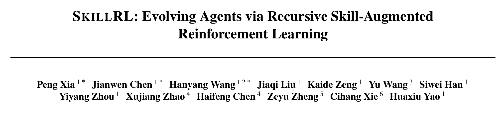

When does a failed run become learning? Keeping the full trace is not enough. A future task will not repeat the same tokens, and the log contains redundant exploration, accidental actions, and environment noise. The reusable part is usually much smaller: where the run went wrong, why the decision was wrong, which action should replace it, and under what conditions that correction applies.

[SkillRL](https://arxiv.org/abs/2602.08234) connects this compression step to policy training. It distills structured experience from successful and failed trajectories, builds a hierarchical SkillBank, uses cold-start SFT to teach the policy how to apply skills, and updates the bank during GRPO training. This note stays on that single method rather than turning into a survey. The running example is `Skipping State Changes` from the paper's ALFWorld failure taxonomy: an agent finds the target object and places it without first satisfying a cleanliness or temperature precondition.

::: {.callout-warning title="Evidence boundary"}
This note separates claims reported by the paper, facts verified in the official repository, and engineering controls proposed here. The paper and code are not identical. Tables 5 and 6 also provide no per-item provenance, so they do not establish that a particular skill was generated directly from a particular listed failure. No training run or experimental reproduction is claimed; all reported numbers come from the paper.
:::

## 1. Why SkillRL Is an Agentic RL Interaction Pattern

SkillRL can look like an Agent Memory method because the SkillBank lives outside the model and is retrieved into context. That label captures storage location but misses the training mechanism. The policy operates in a long-horizon loop that reads skills, acts, observes outcomes, and changes the skill library. Both the policy and its external guidance evolve with experience.

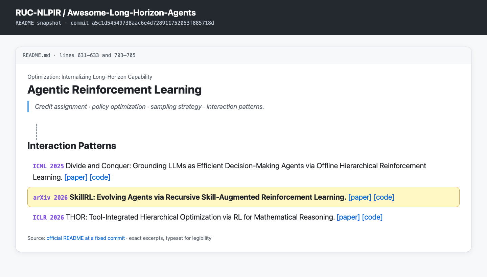

The [Awesome-Long-Horizon-Agents taxonomy](https://github.com/RUC-NLPIR/Awesome-Long-Horizon-Agents/blob/a5c1d54549738aac6e4d728911752053f885718d/README.md#interaction-patterns) places SkillRL under `Agentic Reinforcement Learning → Interaction Patterns`. That classification is more informative than memory alone:

- A skill is not a static prompt. The policy $\pi_\theta$ must choose actions from an environment state conditioned on the task and retrieved guidance.
- A failure changes future rollout context through the SkillBank. The updated policy then reaches states that the earlier policy did not visit, exposing another set of skill gaps.

The bank is therefore part of the agent–environment interaction pattern. Reducing it to “shorter memory” loses the recursive mechanism that motivates the paper.

## 2. Running Example: What `Skipping State Changes` Compresses

Represent a complete trajectory as:

$$
\tau = (o_0,a_0,o_1,a_1,\ldots,o_T,a_T,R),
\qquad R \in \{0,1\},
$$

where $o_t$ is an observation, $a_t$ an action, and $R$ the binary task outcome. For a failed trajectory $\tau^-$, the teacher extracts a failure point, root cause, alternative action, and general prevention principle. Making scope explicit gives the following useful abstraction:

$$
\ell^-
=
f_M(\tau^-,d)
=
(t_{\mathrm{fail}},c_{\mathrm{root}},a_{\mathrm{alt}},\kappa_{\mathrm{scope}}),
$$

where $d$ is the task description and $\kappa_{\mathrm{scope}}$ states when the correction is valid.

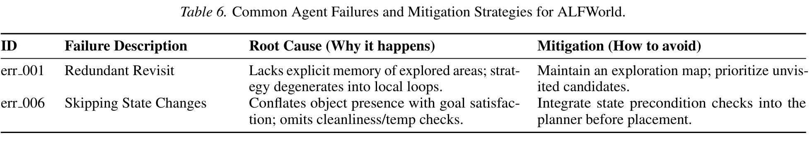

The four fields for `Skipping State Changes` are concrete:

| Field | Information retained from the failure |
| --- | --- |
| Failure point | Placement is attempted before the required state is satisfied |
| Root cause | Object presence is mistaken for goal satisfaction |
| Alternative action | Check cleanliness or temperature, then use clean / heat / cool before placement |
| Scope | Tasks whose goal predicate contains a state constraint |

This is stronger than “remember to check state.” The failure point links the diagnosis back to a trace, the root cause distinguishes a policy error from noise, the alternative is executable, and scope prevents the system from inserting a cleaning operation into every placement task.

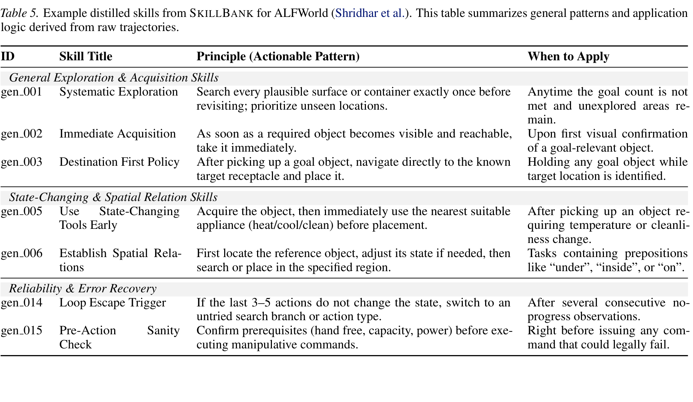

The closest item in Table 5 is `Use State-Changing Tools Early`: after acquiring an object, call the appropriate cleaning, heating, or cooling appliance before placement. The two entries align semantically. The paper, however, presents the two tables as separate examples of distilled skills and common failures. It provides no source trajectory IDs or generation records. The defensible statement is that the skill **covers this failure mode**, not that `err_006` generated `gen_005`.

## 3. A Failure Is Not an SFT Negative Output

Figure 2 summarizes two loops. The upper loop turns trajectories into memory and skills. The lower loop starts from an SFT model, performs RL, and updates the SkillBank.

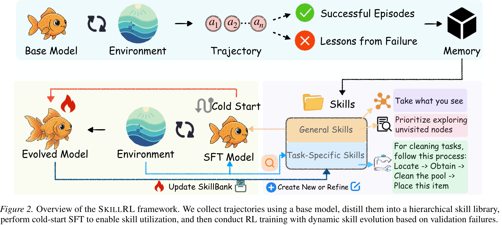

The official repository added SFT data-generation code in May 2026. At commit [`8e66726`](https://github.com/aiming-lab/SkillRL/commit/8e66726ed866a4e0a7f053586a41022798192e6c), its README exposes a four-stage pipeline.

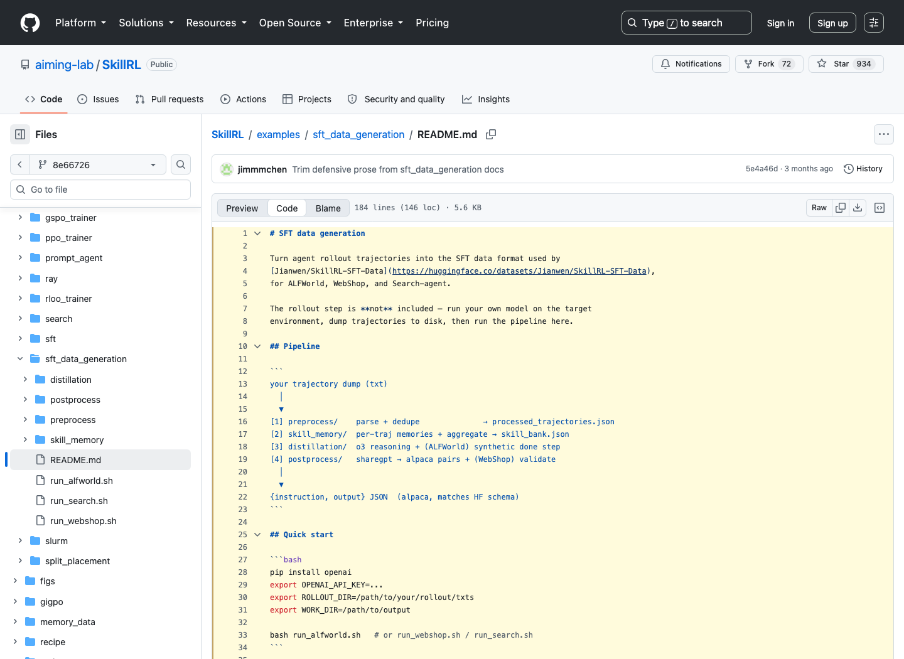

### 3.1 Parsing, deduplication, and outcome-specific memory

Stage one parses rollout text into states, actions, rewards, and terminal markers. ALFWorld and WebShop also remove repeated loops. Stage two produces a memory for each selected trajectory, with different fields for successes and failures:

- A success receives a `refined_trajectory`. The implementation follows backward causal chaining from the final successful action, keeps steps that created necessary preconditions, and prunes intervening actions. It also creates a `planning_pattern` and leaves `mistakes_to_avoid` empty.
- A failure receives no `refined_trajectory`. Its `planning_pattern` is `null`; its main payload is an abstract `mistakes_to_avoid` list containing a `trigger_condition` and `bad_action`.

The failure is not converted directly into an incorrect response paired with a correction. It first contributes to the experience layer as an error pattern and a candidate rule.

### 3.2 Aggregating trajectory memories into a SkillBank

The aggregator generates general and category-specific skills from successful `planning_pattern` values. It separately deduplicates failure-derived `mistakes_to_avoid` entries into `common_mistakes`. The bank can be written as:

$$
\mathcal S
=
\mathcal S_g
\cup
\bigcup_{k=1}^{K}\mathcal S_k,
$$

where $\mathcal S_g$ contains cross-category principles and $\mathcal S_k$ contains knowledge for category $k$. The repository JSON also preserves `common_mistakes`. Each paper-level skill has a `title`, `principle`, and `when_to_apply`; the final field supplies the trigger condition needed to limit transfer.

### 3.3 Distilling successful trajectories into SFT pairs

Stage three reads cleaned successful trajectories, retrieves relevant skills, and asks o3 to add skill-aware reasoning to each step. Actions are copied from the successful trace; ALFWorld adds a synthetic `done` turn. Stage four flattens the ShareGPT conversation into Alpaca-style:

`{instruction, output}`

The instruction contains the task, retrieved skills, recent observations, and action history. The output contains `<think>...</think>` and a valid action. Failure data changes the `Mistakes to Avoid` context and candidate skills. It is not an output the model is trained to imitate.

## 4. Two Training Loops and One Engineering Gate

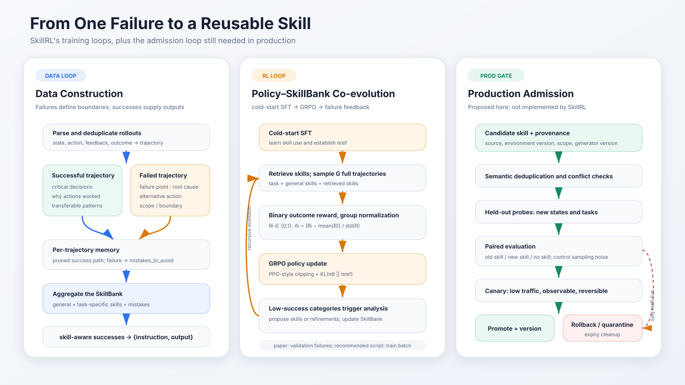

The left column is data construction: rollout logs become trajectory-local memories, then a SkillBank, then skill-augmented successful SFT examples. The center column is RL: the SFT policy samples complete trajectories in skill context, receives an outcome reward, and exposes low-success categories for another update. The right column is not part of SkillRL; it is the production admission process proposed later in this note.

These columns should not be collapsed into one “self-evolution” arrow. Data construction determines what the training target is. RL determines how the policy uses skills. Production admission determines whether a generated skill is safe and useful enough to influence live actions. Each requires a different acceptance test.

## 5. Cold-Start SFT: Learning to Use the Bank

Adding a SkillBank to a base-model prompt does not guarantee that the model reads it, retrieves the right rule, or applies it at the right moment. SkillRL first has the teacher generate skill-augmented successful trajectories $\mathcal D_{\mathrm{SFT}}$ and optimizes cross-entropy:

$$
\theta_{\mathrm{sft}}
=
\underset{\theta}{\arg\min}\;
\mathcal L_{\mathrm{CE}}(\mathcal D_{\mathrm{SFT}};\theta),
\qquad
\pi_{\mathrm{ref}} = \pi_{\theta_{\mathrm{sft}}}.
$$

This stage teaches the mapping from skill context to action and produces both the RL initialization and its KL reference policy. Table 3 is direct evidence that the distinction matters. Removing cold-start SFT lowers ALFWorld from 89.9 to 65.2 and WebShop from 72.7 to 46.5, drops of 24.7 and 26.2 percentage points. Skill content is not the same thing as skill-utilization capability.

## 6. GRPO Rewards Full Trajectories, Not Individual Skills

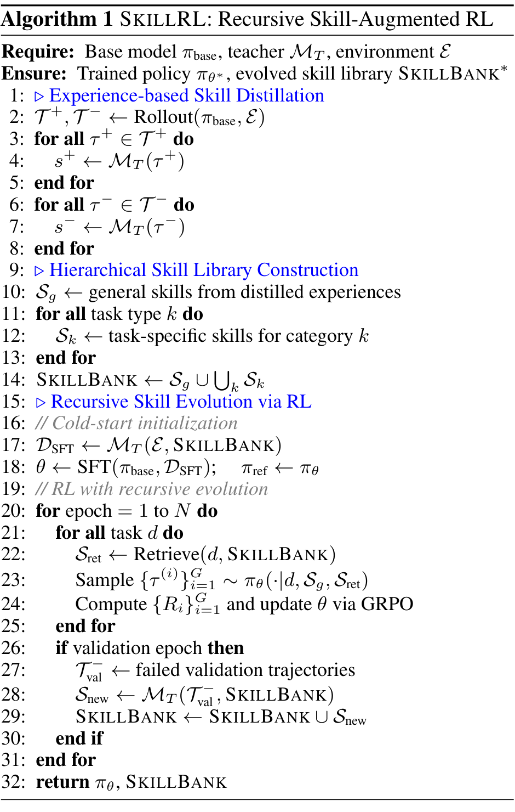

For a task $d$, the policy samples $G$ complete trajectories conditioned on general and retrieved skills. Each receives only a binary task-level reward:

$$
R_i = r(\tau^{(i)}) \in \{0,1\}.
$$

The group-relative advantage is:

$$
A_i
=
\frac{
R_i-\mathrm{mean}(\{R_j\}_{j=1}^{G})
}{
\mathrm{std}(\{R_j\}_{j=1}^{G})
}.
$$

When a group contains both successes and failures, successful trajectories receive positive advantages and failed ones negative advantages. When every reward in the group is identical, the relative signal degenerates. SkillRL does not add a process reward to each intermediate action, nor does it assign separate credit to the use of a particular skill. The optimization target is the complete trajectory in skill-augmented context:

$$
J(\theta)
=
\mathbb E_{d,\{\tau^{(i)}\}_{i=1}^{G}}
\left[
\frac{1}{G}
\sum_{i=1}^{G}
\min\left(
\rho_i A_i,
\mathrm{clip}(\rho_i,1-\epsilon,1+\epsilon)A_i
\right)
-
\beta D_{\mathrm{KL}}(\pi_\theta\,\|\,\pi_{\mathrm{ref}})
\right],
$$

with:

$$
\rho_i
=
\frac{
\pi_\theta(\tau^{(i)}\mid d,\mathcal S_g,\mathcal S_{\mathrm{ret}})
}{
\pi_{\mathrm{old}}(\tau^{(i)}\mid d,\mathcal S_g,\mathcal S_{\mathrm{ret}})
}.
$$

The KL term anchors optimization to the cold-start reference. It does not certify that each skill is correct; it limits how quickly RL can erase the skill-use behavior learned during SFT.

## 7. Algorithm 1 and Commit `8e66726` Are Not the Same System

Algorithm 1 collects failures after validation epochs. The paper describes category grouping, severity prioritization, round-robin sampling, and a teacher that may add a new skill or refine an existing one. The fixed repository retains a validation-update path but also provides a safer training-batch entry point.

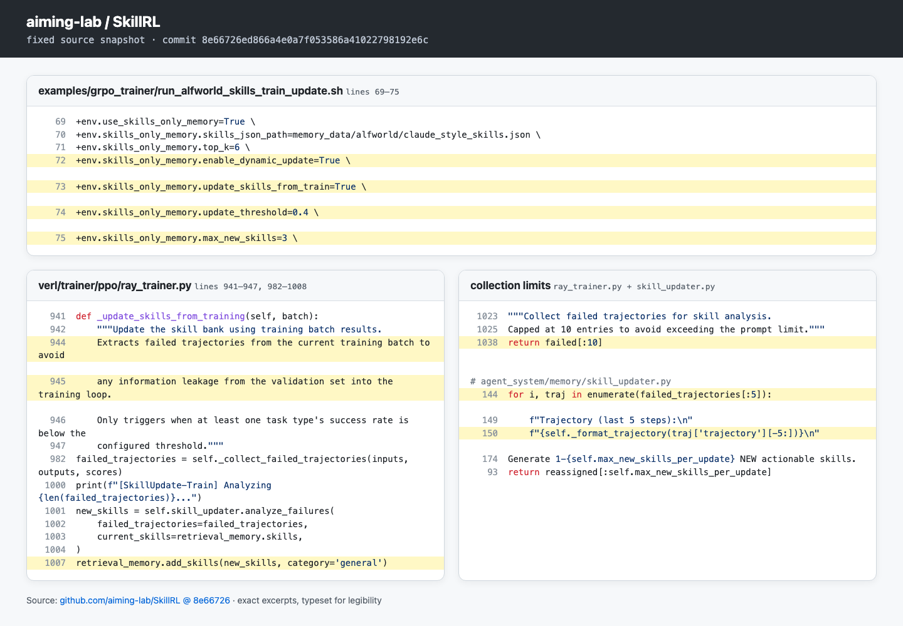

This note recommends the repository's `run_alfworld_skills_train_update.sh` for dynamic updates. It sets `update_skills_from_train=True`; the associated function explicitly says that it extracts failures from the current training batch to avoid validation information leaking into training. Commit `8e66726` itself fixes a separate trajectory-granularity bug in the validation path. Outputs and scores were stored per step while inputs were stored per trajectory, so `zip` could miss real failures. The fix deduplicates by `traj_uid` before filtering.

Several method–implementation differences are directly visible:

| Question | Paper | Behavior at `8e66726` |
| --- | --- | --- |
| Update source | Validation failures | Validation remains available; a dedicated script uses the training batch to reduce leakage |
| Failure sampling | Group by category, prioritize severity, round robin | Keep `score <= 0` in input order, capped at the first 10 |
| Context actually sent to the teacher | Table 4 reports up to 10 / 5 failures | Collector keeps 10; prompt uses the first 5 and only their final 5 steps |
| New skills per update | At most 3 | `max_new_skills=3`, then truncate to 3 |
| Placement in the hierarchy | General and task-specific evolution | Every dynamically generated item is added with `category='general'` |
| Existing-skill refinement | May refine existing skills | Existing titles are a deduplication hint; implementation only appends new entries |

This does not imply that the paper is wrong and the code is right. The paper specifies an intended method; the repository provides one executable realization. Their capability boundaries must be stated separately. In the fixed implementation, recursive evolution is closer to bounded append-only growth than to full versioned editing.

## 8. Which Parts Have Experimental Support

### 8.1 Table 3: the strongest evidence is ablation

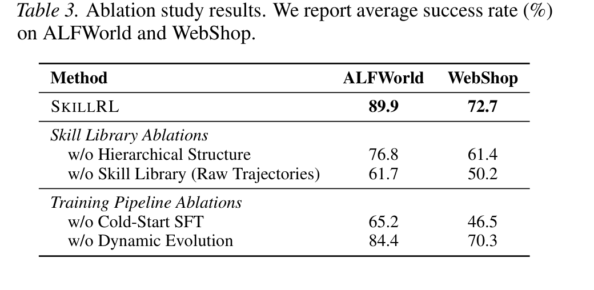

Table 3 supports four focused conclusions:

| Removed component | ALFWorld | WebShop | Supported interpretation |
| --- | ---: | ---: | --- |
| Full SkillRL | 89.9 | 72.7 | Reference result |
| Hierarchical structure | 76.8 | 61.4 | Organizing general and task-specific skills adds value |
| Skill Library, replaced by raw trajectories | 61.7 | 50.2 | Skill abstraction beats raw-trajectory context in this setup |
| Cold-start SFT | 65.2 | 46.5 | The policy must learn how to apply the bank |
| Dynamic evolution | 84.4 | 70.3 | Updating the bank helps, but less than abstraction or SFT |

Dynamic evolution contributes 5.5 percentage points on ALFWorld and 2.4 on WebShop. It has supporting evidence, but it is not the source of the whole gain. The largest degradation comes from replacing the SkillBank with raw trajectories: 28.2 points on ALFWorld and 22.5 on WebShop.

### 8.2 Growth from 55 to 100 does not validate every new skill

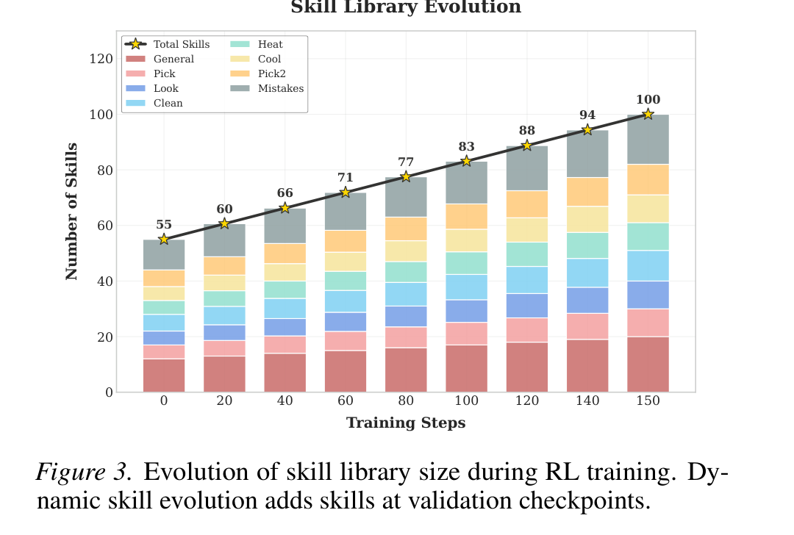

The initial bank contains 55 skills: 12 general and 43 task-specific. By step 150 it contains 100, which the paper breaks down as 20 general and 80 task-specific. Figure 3 demonstrates that the update mechanism continues writing to the bank. It does not report per-skill usage, marginal benefit, or harm rate. The curve is evidence of growth, not evidence that all 100 entries passed an independent validation test.

### 8.3 Token usage and convergence curves answer different questions

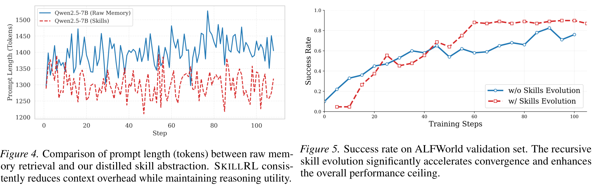

In Figure 4, the raw-memory prompt averages roughly 1,450 tokens while the skill prompt stays below 1,300; the paper reports about a 10.3% context reduction. The method section separately claims 10–20× compression of distilled skills relative to raw trajectories. These are different denominators: one compares final prompts, while the other compares representations. They should not be reported as the same number.

In Figure 5, the dynamically evolving run exceeds 80% success at about 60 training steps. The non-evolving run needs roughly 90 steps to reach a lower peak. This supports faster convergence and a higher ceiling for this ALFWorld validation setup. The figure has no confidence intervals and does not establish that SkillBank updates improve monotonically in every environment.

## 9. Production Needs a Skill Admission Process

At the fixed commit, generated skills pass ID reassignment and basic field checks, then enter the general-skills list. That is enough to exercise a research loop. It is not enough to turn one failure analysis into a durable production rule.

A candidate skill should first become a versioned object with provenance:

| Field | Purpose |
| --- | --- |
| `source_trajectory_ids` | Link the rule to the failures and successes that motivated it |
| `environment_version` | Prevent stale behavior after tools, UI, or task rules change |
| `scope` / `preconditions` | Define valid triggers and prohibited contexts |
| `generator_version` | Record teacher model, prompt, and source commit |
| `paired_metrics` | Store old-skill / new-skill / no-skill comparisons |
| `rollback_target` / `expires_at` | Support rollback and expiry cleanup |

The gate in the diagram can then be applied:

1. Run semantic deduplication and conflict checks. Reject a candidate that merely renames an existing rule.
2. Probe held-out tasks and different environment states so that an accidental property of one trace does not become a universal instruction.
3. Hold the model, tasks, and sampling controls fixed while comparing old, new, and no-skill conditions. For candidate $s$, the most basic marginal effect is:

$$
\Delta(s)
=
\mathbb E[R\mid \pi,\mathcal S\cup\{s\}]
-
\mathbb E[R\mid \pi,\mathcal S].
$$

4. After offline acceptance, expose the candidate only through a small canary. Monitor success, steps, token use, anomalous actions, and fallback frequency.
5. Keep an explicit rollback point. When the environment version changes or a skill remains unused, mark it stale instead of allowing append-only growth.

These gates are recommendations in this note, not features implemented by SkillRL. They address the production question the paper leaves open: when a generated rule may influence real user tasks, and how to identify and undo negative transfer.

## Conclusion

SkillRL gives a concrete answer to learning from failure. A failed trajectory is compressed into a failure point, root cause, alternative action, and applicability condition; it primarily contributes `mistakes_to_avoid` and candidate skills. SFT still distills successful trajectories with valid actions. Cold-start SFT teaches skill use, GRPO updates the policy from binary complete-trajectory outcomes, the KL term anchors the SFT behavior, and low-success categories expose the next gaps in the SkillBank.

Table 3 provides the strongest evidence: skill abstraction, hierarchy, and cold-start SFT all have substantial ablation costs; dynamic evolution helps, but by a smaller margin. The 55→100 growth curve, token comparison, and validation curve demonstrate growth, compression, and faster convergence. They do not establish provenance or independent utility for every skill.

A failure should therefore not be considered a reusable skill merely because a teacher model emitted a new principle. A stronger endpoint is a rule with traceable sources and scope, stable held-out gains over both the old and no-skill conditions, observable canary behavior, and a tested rollback path.

## References

- Peng Xia et al., [*SkillRL: Evolving Agents via Recursive Skill-Augmented Reinforcement Learning*](https://arxiv.org/abs/2602.08234), 2026.
- aiming-lab, [official SkillRL repository at commit `8e66726`](https://github.com/aiming-lab/SkillRL/tree/8e66726ed866a4e0a7f053586a41022798192e6c).
- aiming-lab, [SFT data generation pipeline](https://github.com/aiming-lab/SkillRL/blob/8e66726ed866a4e0a7f053586a41022798192e6c/examples/sft_data_generation/README.md).
- aiming-lab, [train-batch dynamic-update script](https://github.com/aiming-lab/SkillRL/blob/8e66726ed866a4e0a7f053586a41022798192e6c/examples/grpo_trainer/run_alfworld_skills_train_update.sh).
- RUC-NLPIR, [Awesome-Long-Horizon-Agents: Interaction Patterns](https://github.com/RUC-NLPIR/Awesome-Long-Horizon-Agents/blob/a5c1d54549738aac6e4d728911752053f885718d/README.md#interaction-patterns).
