## Abstract

This note studies the implementation in [BrenchCC/DPO_Trainer_with_SFT_Loss](https://github.com/BrenchCC/DPO_Trainer_with_SFT_Loss), which adds a chosen-response SFT loss to standard DPO. The motivating issue is precise: DPO only requires the reference-adjusted margin between chosen and rejected responses to grow. It does not require the absolute log probability of the chosen response to increase. When chosen responses are reliable demonstrations, a response-only NLL term supplies an absolute anchoring gradient.

The motivation is reasonable, but its boundary matters. DPO-Positive, Iterative Reasoning Preference Optimization, Regularized Preference Optimization, and likelihood-displacement experiments all show that a larger preference margin and a higher chosen likelihood are different outcomes. None establishes that SFT improves generation on arbitrary preference data. If chosen means merely “better of two” rather than “safe to imitate,” NLL also copies factual errors, formatting artifacts, and verbosity.

My conclusion is that `sft_loss_weight` should be treated as a falsifiable engineering hypothesis, not a default patch for DPO. The repository implements the main computation path required to test that hypothesis. What remains missing is a controlled ablation with absolute-likelihood diagnostics and held-out generation evaluation.

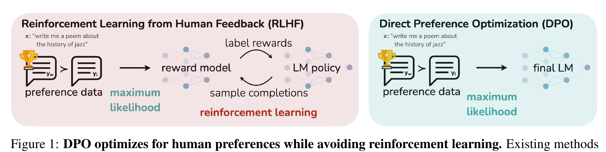{fig-alt="Figure from the DPO paper comparing the RLHF and DPO training pipelines"}

*Figure 1: DPO removes the explicit reward model and online RL, but its classification objective is still relative. Source: [Rafailov et al., 2023, Figure 1](https://arxiv.org/abs/2305.18290).*

## 1. Object of analysis and evidence boundary

The code baseline is repository commit [`948f3da`](https://github.com/BrenchCC/DPO_Trainer_with_SFT_Loss/tree/948f3da28a9ed850ced66db9d15431035851a474). The project is a lightweight Hugging Face `Trainer` implementation supporting standard SFT, sigmoid DPO, chosen-response SFT regularization, LoRA, and optional QLoRA. It is not yet a benchmarked new algorithm.

Three levels of evidence need to remain separate:

1. **Code facts** are directly checkable in the current commit, such as chosen-logit reuse, prompt sharing, and label coverage.
2. **Paper evidence** reports chosen-likelihood decline, length bias, or safety drift under specific models, data, and evaluation protocols.
3. **Project hypotheses** concern whether SFT helps this repository's actual training setup. Without ablations, these remain hypotheses.

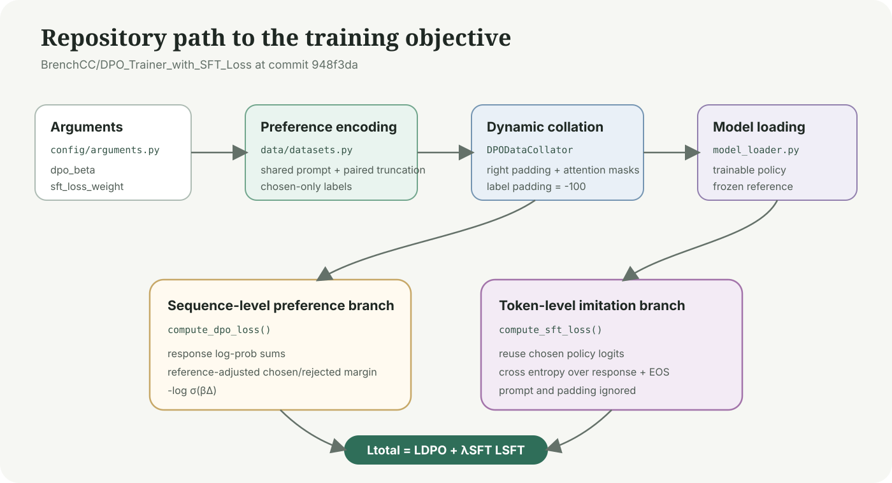{fig-alt="Map from repository arguments and data preparation to the joint DPO and SFT objective"}

*Figure 2: Parameters flow through preference encoding and model loading before `DPOTrainer` computes sequence-level DPO and token-level SFT.*

The repository includes 13 offline tests covering data validation, truncation, collation, differentiable loss, and a one-step training path. These tests answer whether the implementation is connected as intended. They do not answer whether generations improve.

## 2. Standard DPO constrains only a relative difference

Let $x$ be a prompt, $y^+$ the chosen response, and $y^-$ the rejected response. The policy and reference models are $\pi_\theta$ and $\pi_{\mathrm{ref}}$. Sequence log probability is the sum of conditional token log probabilities:

$$
\log \pi_\theta(y\mid x)
=
\sum_{t=1}^{|y|}
\log \pi_\theta(y_t\mid x,y_{\lt t})
$$

Define a reference-adjusted score:

$$
s_\theta(x,y)
=
\log \pi_\theta(y\mid x)
-
\log \pi_{\mathrm{ref}}(y\mid x)
$$

The repository's sigmoid DPO margin and loss are:

$$
\Delta_\theta
=
s_\theta(x,y^+)-s_\theta(x,y^-)
$$

$$
\mathcal{L}_{\mathrm{DPO}}
=
-\log \sigma(\beta\Delta_\theta)
$$

This matches the binary-classification objective derived from KL-regularized RLHF in the DPO paper.[^dpo] The implementation is in [`compute_dpo_loss()`](https://github.com/BrenchCC/DPO_Trainer_with_SFT_Loss/blob/948f3da28a9ed850ced66db9d15431035851a474/trainers/dpo_trainer.py#L129-L175).

The critical property is that $\Delta_\theta$ only observes a difference. If the chosen score moves from $-1$ to $-2$ while the rejected score moves from $-2$ to $-5$, the margin grows from $1$ to $3$. DPO loss falls even though the chosen score also falls. This is valid for ranking; it becomes a problem when chosen is intended as a high-quality demonstration.

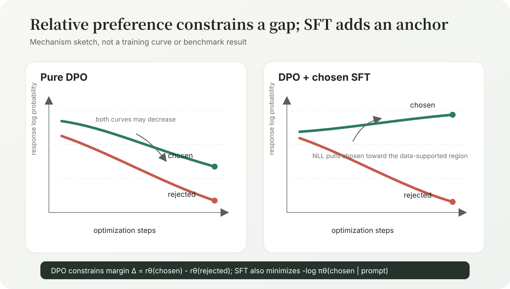{fig-alt="Likelihood geometry of pure DPO and DPO with chosen-response SFT"}

*Figure 3: This is a mechanism sketch, not a training curve. $\beta$ rescales the pairwise margin and cannot independently constrain chosen likelihood.*

### 2.1 Likelihood displacement extends the problem beyond the pair

When chosen and rejected probabilities both fall, mass must move to responses outside the observed pair. Razin et al. call this likelihood displacement and distinguish two cases: transfer to responses as desirable as chosen can be benign, while transfer to semantically opposed or unsafe responses can undermine alignment.[^likelihood-displacement]

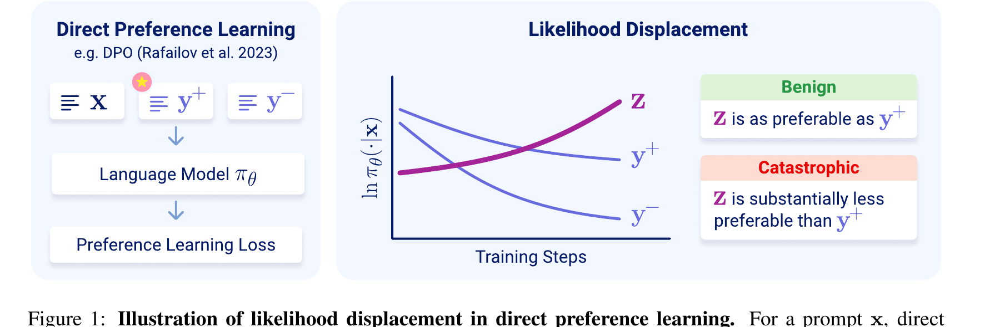{fig-alt="Likelihood displacement sketch where chosen and rejected probabilities decrease while a third response increases"}

*Figure 4: Likelihood displacement tracks which outputs outside the pair absorb probability mass. Source: [Razin et al., 2024, Figure 1](https://arxiv.org/abs/2410.08847).*

Neither `dpo_accuracy` nor the preference margin reveals that destination. A chosen response can increasingly outrank rejected while fixed-prompt generations still deteriorate.

## 3. Joint objective: SFT changes the gradient direction

Chosen-response SFT supervises chosen tokens and EOS, excluding prompt and padding:

$$
\mathcal{L}_{\mathrm{SFT}}
=
-\frac{1}{T_+}
\sum_{t=1}^{T_+}
\log \pi_\theta(y_t^+\mid x,y_{\lt t}^+)
$$

The joint objective is:

$$
\mathcal{L}_{\mathrm{total}}
=
\mathcal{L}_{\mathrm{DPO}}
+
\lambda_{\mathrm{SFT}}\mathcal{L}_{\mathrm{SFT}}
$$

The two terms do not duplicate one another:

$$
\nabla_\theta \mathcal{L}_{\mathrm{total}}
=
\nabla_\theta \mathcal{L}_{\mathrm{DPO}}
+
\lambda_{\mathrm{SFT}}
\nabla_\theta \mathcal{L}_{\mathrm{SFT}}
$$

DPO depends on a chosen-rejected difference; SFT directly raises the conditional probability of observed chosen tokens. Equal numerical defaults such as `dpo_beta = 0.1` and `sft_loss_weight = 0.1` do not give the coefficients equal scale or interpretation. One enters a sigmoid margin, while the other multiplies token-mean cross entropy.

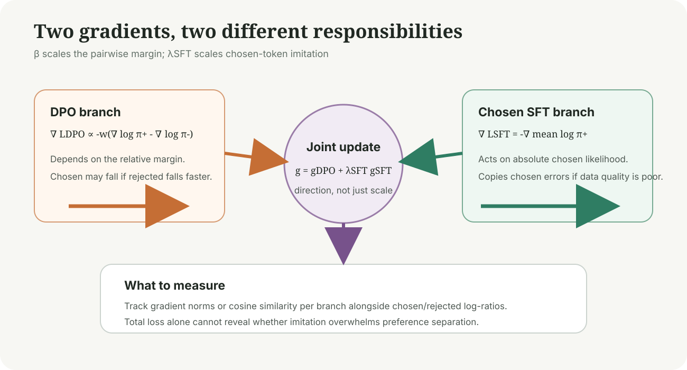{fig-alt="Weighted combination of the pairwise DPO gradient and chosen-response SFT gradient"}

*Figure 5: The joint objective changes direction, not merely magnitude. Branch gradient norms or cosine similarity are more informative than total loss alone.*

### 3.1 RPO supplies a regularization interpretation, not a reproduced theorem

Regularized Preference Optimization begins from distribution shift and reward overoptimization in offline RLHF. It combines preference optimization with imitation of a baseline policy. If the baseline distribution is the chosen-response distribution, the imitation term becomes chosen NLL.[^rpo]

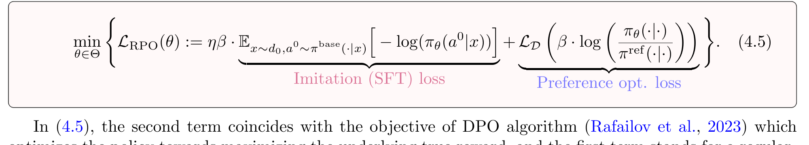{fig-alt="Regularized Preference Optimization Equation 4.5 with SFT and preference losses"}

*Figure 6: RPO interprets imitation as explicit regularization. Source: [Liu et al., 2024, Equation 4.5](https://arxiv.org/abs/2405.16436). The project has a similar structure but does not reproduce the paper's assumptions or protocol.*

That qualification matters. RPO's guarantees rely on its maximin derivation, baseline distribution, and coverage assumptions. Writing a similar expression in a trainer does not inherit those guarantees.

### 3.2 Iterative RPO provides direct DPO+NLL evidence in a narrower setting

Pang et al. add length-normalized NLL on winning reasoning responses. Their GSM8K experiments make an observation closely related to this project: chosen-only SFT raises both chosen and rejected likelihoods, whereas DPO+NLL can raise chosen while lowering rejected.[^iterative-rpo]

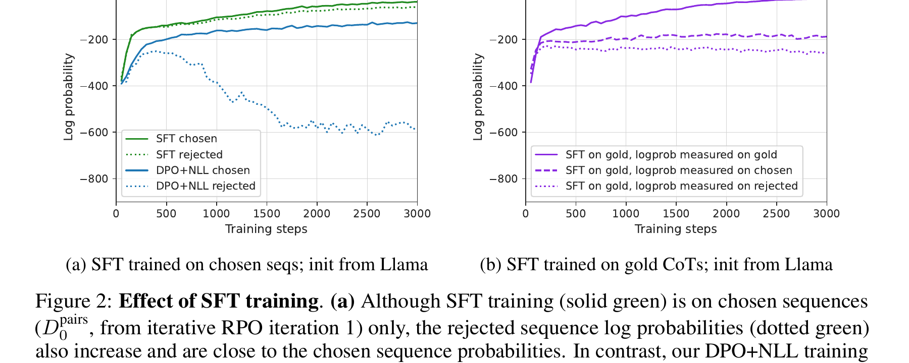{fig-alt="Response log-probability curves for chosen-only SFT and DPO plus NLL in Iterative RPO"}

*Figure 7: SFT-only and DPO+NLL behave differently. Source: [Pang et al., 2024, Figure 2](https://arxiv.org/abs/2404.19733).*

The same paper's ablation is even more direct: chosen likelihood falls under standard DPO and rises under DPO+NLL, while both methods continue widening the chosen-rejected margin. Margin and absolute likelihood therefore need separate monitoring.

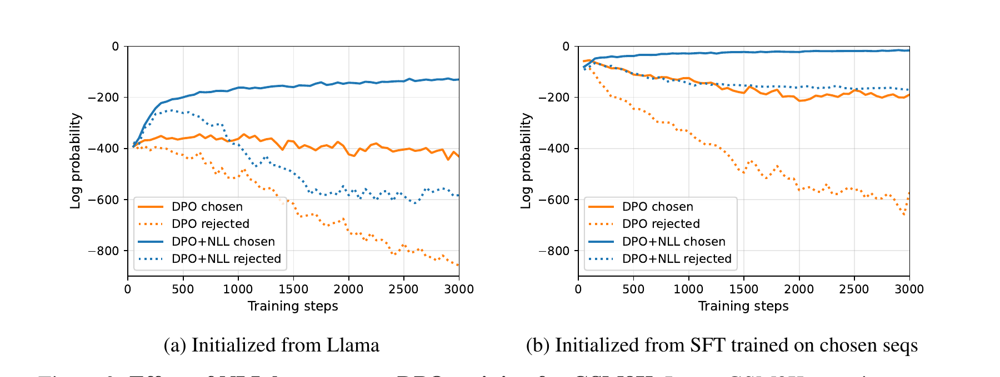{fig-alt="Chosen and rejected log-probability curves for DPO and DPO plus NLL on GSM8K"}

*Figure 8: GSM8K NLL ablation. Source: [Pang et al., 2024, Figure 3](https://arxiv.org/abs/2404.19733). The 70B model, iterative CoT data, and decoding protocol limit direct transfer to general instruction preferences.*

## 4. Neighboring methods: shared motivation, different objectives

### 4.1 DPO-Positive activates a penalty below the reference

DPO-Positive addresses a token-level failure mode when preference pairs have small edit distance. Standard DPO may receive positive signal only at the differing token while lowering the probability of shared subsequent tokens. DPOP adds a penalty when chosen falls below the reference, rather than applying unconditional chosen NLL.[^dpop]

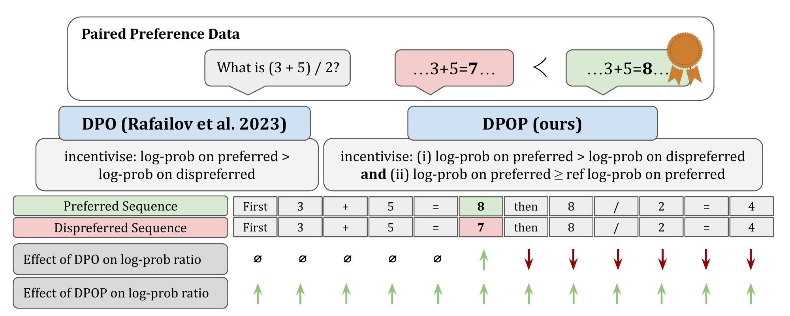{fig-alt="Token-level gradient difference between DPO and DPO-Positive for low-edit-distance pairs"}

*Figure 9: DPOP conditionally anchors chosen, making it more targeted than an always-on SFT term. Source: [Pal et al., 2024, Figure 1](https://arxiv.org/abs/2402.13228).*

On 900 MetaMath preferred completions, average log probability declines during DPO training, while DPOP avoids the pronounced post-edit-token decline. This supports absolute-likelihood monitoring but does not establish fixed-weight SFT as the best remedy.

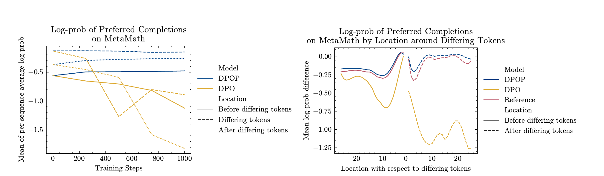{fig-alt="Preferred-completion log-probability comparison between DPO and DPOP on MetaMath"}

*Figure 10: Evidence on low-edit-distance pairs. Source: [Pal et al., 2024, Figure 4](https://arxiv.org/abs/2402.13228).*

### 4.2 ORPO is a reference-free joint objective

ORPO combines SFT with an odds-ratio preference loss and keeps no reference model. It shares the single-stage combination of imitation and preference signals, but not this project's computation graph or probability ratio. Calling the project ORPO would hide the reference model's memory and forward cost.[^orpo]

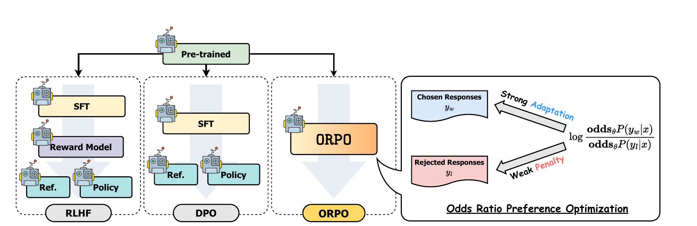{fig-alt="ORPO paper comparison of the RLHF DPO and ORPO training structures"}

*Figure 11: ORPO is reference-free. Source: [Hong et al., 2024, Figure 2](https://arxiv.org/abs/2403.07691).*

### 4.3 χPO shows why SFT is not a complete repair

χPO studies the regularizer and coverage assumptions, including constructions where DPO+SFT can still fail. On TL;DR summarization, it reports better robustness than DPO to training duration and $\beta$.[^chipo] This does not invalidate chosen NLL; it shows that anchoring addresses only part of the failure surface.

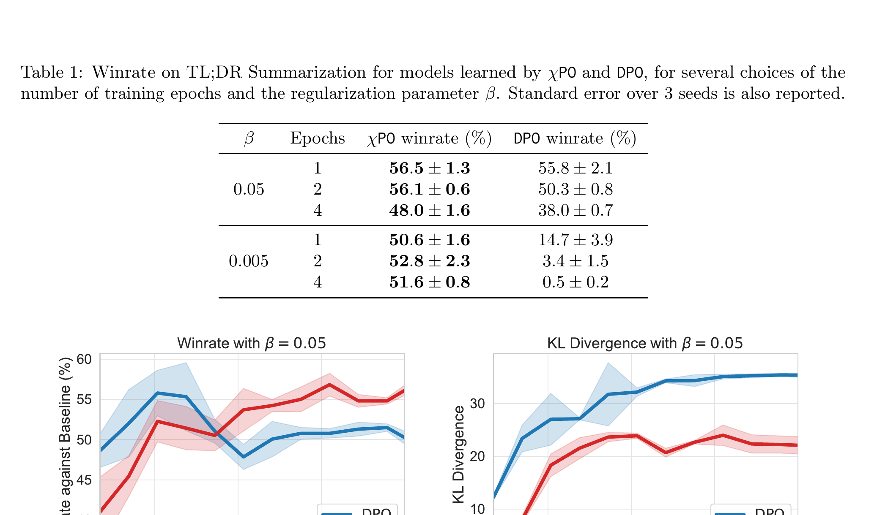{fig-alt="Win rate and KL divergence curves for χPO and DPO over training epochs"}

*Figure 12: DPO performance and KL can drift under a fixed $\beta$. Source: [Huang et al., 2024, Figure 4](https://arxiv.org/abs/2407.13399).*

| Method | Preference term | Absolute chosen constraint | Reference model | Relation to this project |
| --- | --- | --- | --- | --- |
| Standard DPO | Reference-adjusted log ratio | None | Required | Recovered when `sft_loss_weight = 0` |
| This project | Sigmoid DPO | Response-only SFT | Required | Fixed-weight joint objective |
| Regularized Preference Optimization | DPO-style | Baseline imitation | Required | Closest structure, different assumptions |
| Iterative RPO | Modified DPO | Winning-reasoning NLL | Required | Same NLL idea on iterative CoT data |
| DPO-Positive | DPO plus positive penalty | Triggered below reference | Required | Similar motivation, different penalty |
| ORPO | Odds-ratio loss | SFT loss | Not required | Joint objective, but not DPO+SFT |
| χPO | $\chi^2$-regularized preference loss | Not chosen NLL | Required | Addresses broader overoptimization |

## 5. Repository implementation: from formulas to tokens and tensors

### 5.1 Records and the shared prompt

Each preference record contains at least `instruction`, `chosen`, and `rejected`, with optional `input` and multi-turn `history`:

```json
{
  "instruction": "Explain the DPO training objective.",
  "input": "Distinguish the policy and reference models.",
  "chosen": "DPO compares policy-reference log-probability changes for a preference pair.",
  "rejected": "DPO is ordinary language-model pretraining.",
  "history": [
    ["What is preference data?", "It provides better and worse responses to one input."]
  ]
}
```

In [`DPODataset._encode_record()`](https://github.com/BrenchCC/DPO_Trainer_with_SFT_Loss/blob/948f3da28a9ed850ced66db9d15431035851a474/data/datasets.py#L309-L375), the prompt passes through the chat template once and is then concatenated with chosen and rejected. This prevents generation markers, special tokens, or truncation boundaries from contaminating the pairwise margin.

Truncation follows a fixed order:

1. Encode chosen and rejected separately and append EOS.
2. Right-truncate overlong responses while retaining EOS.
3. Set the prompt budget using the longer response in the pair.
4. Left-truncate the prompt and reuse the identical result on both sides.

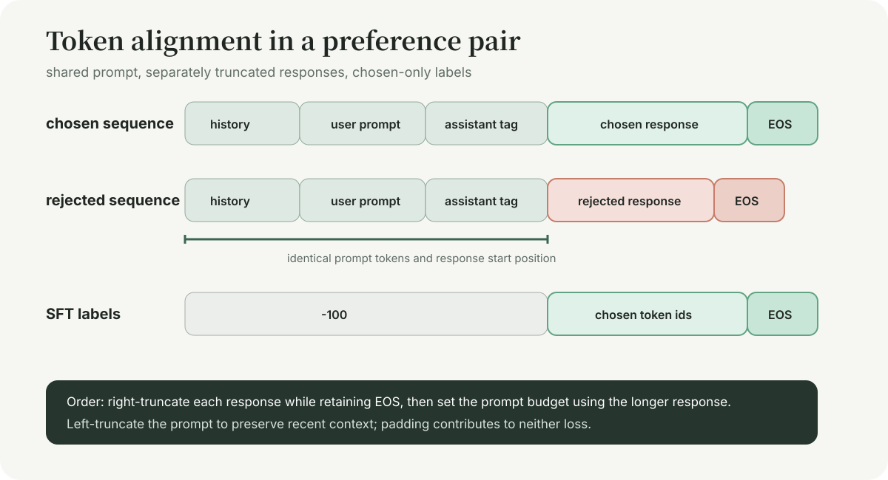{fig-alt="Preference pair with a shared prompt separately truncated responses and chosen-only SFT labels"}

*Figure 13: Data boundaries are easier to get wrong than the objective. Both sides need an identical response start, and SFT labels cover only chosen plus EOS.*

The strategy preserves context closest to the current answer, but can remove early system or history messages. Tasks with long system prompts should measure field-specific retention, not only aggregate truncation.

### 5.2 The causal-shift off-by-one

For a prompt of length $P$, the first response token sits at `input_ids[P]`, while its predicting logit sits at shifted index $P-1$. The repository therefore sets `response_start_position` to `len(prompt_ids) - 1`.

```python
import torch
import torch.nn.functional as F


def response_logps(
    logits: torch.Tensor,
    input_ids: torch.Tensor,
    attention_mask: torch.Tensor,
    response_start_positions: torch.Tensor
) -> torch.Tensor:
    """Sum response-token log probabilities.

    Args:
        logits: Causal LM logits with batch, sequence, and vocabulary axes.
        input_ids: Token IDs with batch and sequence axes.
        attention_mask: Mask selecting non-padding tokens.
        response_start_positions: First response index after causal shift.

    Returns:
        Summed response log probability for every sequence.
    """
    shifted_logps = F.log_softmax(logits, dim = -1)[:, :-1, :]
    shifted_labels = input_ids[:, 1:]
    shifted_attention = attention_mask[:, 1:].bool()
    token_logps = torch.gather(
        shifted_logps,
        dim = -1,
        index = shifted_labels.unsqueeze(-1)
    ).squeeze(-1)

    positions = torch.arange(token_logps.shape[1], device = token_logps.device)
    response_mask = positions.unsqueeze(0) >= response_start_positions.unsqueeze(1)
    return (token_logps * shifted_attention * response_mask).sum(dim = -1)
```

This mistake need not raise a shape error; it can silently omit the first response token. Explicit tests for response start, EOS, and padding are therefore necessary.

### 5.3 The chosen forward pass feeds both branches

[`DPOTrainer.compute_loss()`](https://github.com/BrenchCC/DPO_Trainer_with_SFT_Loss/blob/948f3da28a9ed850ced66db9d15431035851a474/trainers/dpo_trainer.py#L196-L279) first runs the chosen policy forward pass. One path sums its logits into a chosen sequence score for DPO; the other computes cross entropy against chosen labels. SFT adds no model forward pass.

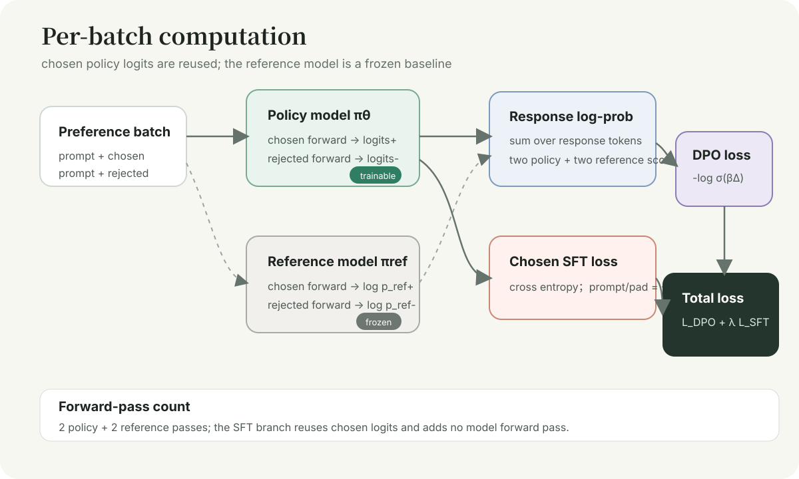{fig-alt="Chosen and rejected through policy and reference models with chosen logits feeding both DPO and SFT"}

*Figure 14: Each batch uses four model forwards: policy chosen/rejected and reference chosen/rejected. The SFT branch reuses chosen policy logits.*

The reference model is frozen and set to evaluation mode, yet its full weights remain in memory. For a fixed dataset, precomputing reference log probabilities trades preprocessing and storage for training memory and throughput. TRL exposes the same idea through [`precompute_ref_log_probs`](https://huggingface.co/docs/trl/dpo_trainer).

## 6. SFT does not automatically remove length bias

The repository sums response-token log probabilities without length normalization:

$$
\log \pi_\theta(y\mid x)
=
\sum_t \log p_t
$$

Because token log probabilities are normally negative, longer responses naturally receive lower sequence scores. Reference adjustment removes part of the effect, but preference labels correlated with length can still create a verbosity shortcut.

LD-DPO models this length sensitivity explicitly and shows a systematic relation between chosen/rejected length combinations and DPO's optimization direction.[^lddpo]

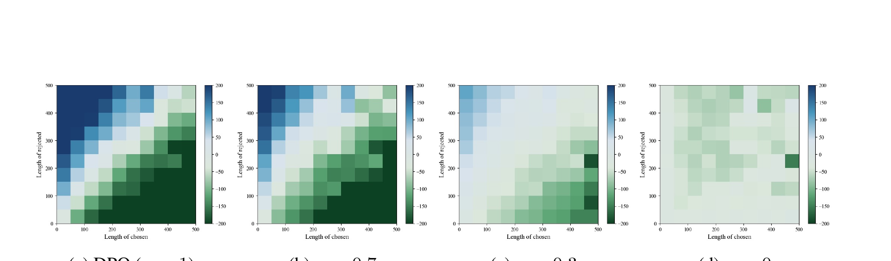{fig-alt="Heatmaps of chosen and rejected lengths under DPO and several LD-DPO alpha values"}

*Figure 15: Smaller LD-DPO $\alpha$ reduces the systematic length effect. Source: [Liu et al., 2024, Figure 2](https://arxiv.org/abs/2409.06411).*

A minimum audit includes chosen/rejected token distributions, length differences, correlation between preference and length, DPO accuracy by length-difference bucket, mean generation length, and length-controlled win rate. `sft_loss_weight` cannot replace that audit.

## 7. Metrics: training loss alone cannot validate generation

| Metric | Definition | What it answers | What it does not answer |
| --- | --- | --- | --- |
| `dpo_loss` | $-\log\sigma(\beta\Delta)$ | Whether the pair margin is optimized | Whether generation improved |
| `dpo_accuracy` | Fraction with $s_\theta(y^+)\gt s_\theta(y^-)$ | Ranking on observed pairs | Held-out win rate |
| `sft_loss` | Chosen-token CE | Fit to chosen tokens | Preference discrimination |
| `policy_diff_mean` | $\log\pi_\theta(y^+)-\log\pi_\theta(y^-)$ | Raw policy pair gap | Change relative to reference |
| `chosen_logratio_mean` | $\log\pi_\theta(y^+)-\log\pi_{\mathrm{ref}}(y^+)$ | Chosen movement | A strict KL divergence |
| `rejected_logratio_mean` | Rejected counterpart | Whether rejected is suppressed | A strict KL divergence |

The repository currently names the final two values `kl_chosen_mean` and `kl_rejected_mean`. A log ratio on one observed response is not a KL divergence, which requires an expectation over an output distribution. If the names remain, analysis should state the estimator precisely.

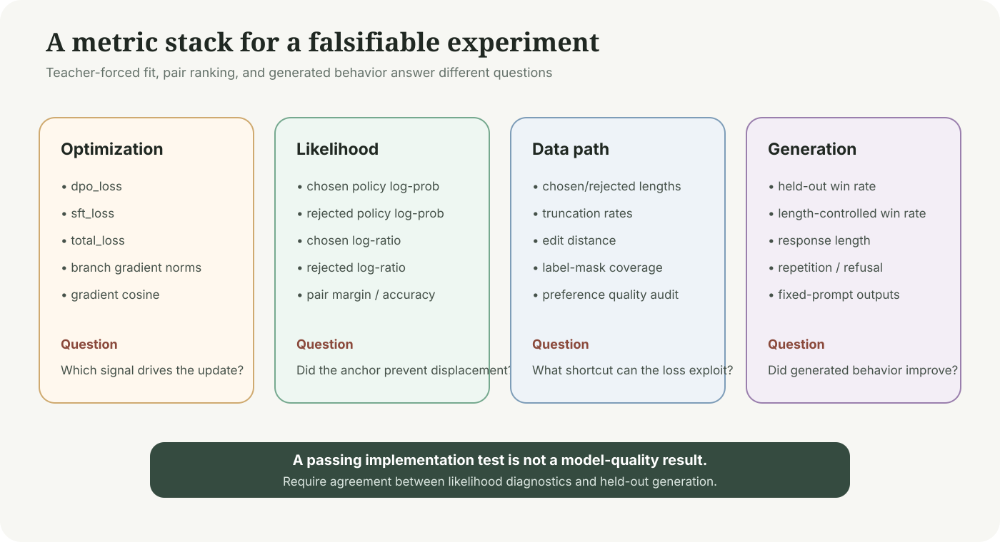{fig-alt="Optimization likelihood data and generation metrics required for DPO plus SFT evaluation"}

*Figure 16: A credible conclusion requires likelihood diagnostics and held-out generations to agree. Implementation tests cover only part of the optimization layer.*

The likelihood-displacement safety experiment sharpens the data-quality point. Adding SFT mitigates refusal-rate decline, but filtering high-risk pairs by CHES helps more. Data quality here is not a generic caveat; it can dominate loss-level repair.

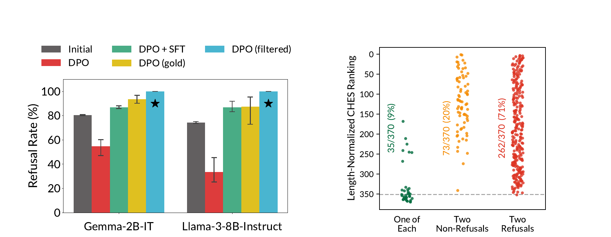{fig-alt="Safety refusal rates for DPO DPO plus SFT gold and CHES-filtered data"}

*Figure 17: DPO+SFT recovers some refusal behavior, while filtered data recovers more. Source: [Razin et al., 2024, Figures 3–4](https://arxiv.org/abs/2410.08847). Chosen NLL is a mitigation, not a substitute for coverage.*

## 8. Ablating $\lambda_{\mathrm{SFT}}$: making the hypothesis falsifiable

A useful initial sweep compares more than $0$ and $0.1$:

$$
\lambda_{\mathrm{SFT}}
\in
\{0, 0.01, 0.05, 0.1, 0.25, 0.5\}
$$

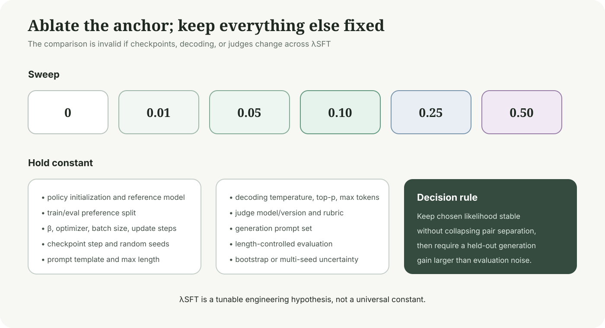{fig-alt="Ablation matrix with six SFT weights and fixed model data optimization and evaluation settings"}

*Figure 18: All settings need the same initialization, preference split, $\beta$, update budget, checkpoint step, seeds, decoding, and judge.*

I would retain the SFT branch only if:

1. chosen log ratio stops declining while rejected retains separation;
2. held-out preference accuracy and generation win rate improve together;
3. length, repetition, factual errors, and refusal do not drift unexpectedly;
4. multi-seed changes exceed judge and sampling noise;
5. low/high edit-distance and short/long-pair buckets do not show opposite conclusions.

If larger $\lambda_{\mathrm{SFT}}$ lowers SFT loss while pair accuracy stalls, imitation may be overwhelming preference separation. If the margin grows while chosen log ratio keeps falling, the anchor is too weak. Total loss cannot distinguish these cases.

## 9. Engineering boundaries of the current implementation

First, the reference model stays resident in memory. LoRA reduces trainable policy parameters but not reference weights. In the current loading path, QLoRA quantizes the policy base, not necessarily the reference. Memory reports should separate policy base, adapters, optimizer state, activations, and reference.

Second, the policy runs chosen and rejected separately in training mode. Enabled model or LoRA dropout gives the two sides different random masks and adds variance to the margin. TRL disables policy and reference dropout by default for DPO; a project retaining `lora_dropout = 0.1` should ablate it.

Third, SFT cross entropy is averaged over valid tokens, while DPO sums sequence log probability and averages over the batch. Changing response-length distribution changes their relative scale. A $\lambda_{\mathrm{SFT}}$ tuned on one dataset should not be transferred blindly.

Fourth, chosen must deserve imitation. When a pair only says that A is slightly better than B, chosen can still contain errors or style defects. DPO only asks for relative ranking; NLL turns chosen into an absolute token target.

Fifth, the repository does not yet provide real training curves, checkpoints, or generation benchmarks. The paper figures in this note establish questions to test; they are not evidence that the project has reproduced those outcomes.

## 10. Conclusion

The most accurate description of chosen-response SFT on top of DPO is **an imitation gradient added to a relative preference objective**. It leaves the pair structure intact and adds no policy forward pass, but it changes the absolute direction for chosen and retains the reference model's memory and compute cost.

Related work establishes two phenomena worth testing: standard DPO permits chosen likelihood to fall, and probability mass moving outside the pair can affect generation, safety, and length. It also establishes limits: SFT only mitigates some displacement, while data filtering, alternative regularizers, and preference coverage can matter more.

The next step is therefore not another loss component. Run the $\lambda_{\mathrm{SFT}}$ ablation and report chosen/rejected absolute log probabilities, branch gradients, length distributions, fixed-prompt generations, and held-out win rates together. Only converging evidence turns `DPO + SFT` from a plausible implementation into a project result.

## References

[^dpo]: Rafael Rafailov et al. [Direct Preference Optimization: Your Language Model is Secretly a Reward Model](https://arxiv.org/abs/2305.18290), 2023.

[^rpo]: Zhihan Liu et al. [Provably Mitigating Overoptimization in RLHF: Your SFT Loss is Implicitly an Adversarial Regularizer](https://arxiv.org/abs/2405.16436), 2024.

[^iterative-rpo]: Richard Yuanzhe Pang et al. [Iterative Reasoning Preference Optimization](https://arxiv.org/abs/2404.19733), 2024.

[^dpop]: Arka Pal et al. [Smaug: Fixing Failure Modes of Preference Optimisation with DPO-Positive](https://arxiv.org/abs/2402.13228), 2024.

[^likelihood-displacement]: Noam Razin et al. [Unintentional Unalignment: Likelihood Displacement in Direct Preference Optimization](https://arxiv.org/abs/2410.08847), 2024; ICLR 2025.

[^orpo]: Jiwoo Hong et al. [ORPO: Monolithic Preference Optimization without Reference Model](https://arxiv.org/abs/2403.07691), 2024.

[^lddpo]: Wei Liu et al. [Length Desensitization in Direct Preference Optimization](https://arxiv.org/abs/2409.06411), 2024.

[^chipo]: Audrey Huang et al. [Correcting the Mythos of KL-Regularization: Direct Alignment without Overoptimization via χ²-Preference Optimization](https://arxiv.org/abs/2407.13399), 2024.
