## 1. What the DINO series learns

The DINO series maps images to transferable visual features. During training, different views of the same image provide the learning signal. At inference, a backbone can support a classifier, image retrieval, or a larger segmentation or depth-estimation system. **Self-supervision describes the source of the pretraining signal; it does not mean every downstream task needs no labels.**

The progression is straightforward. DINO matches image-level predictions across views. DINOv2 trains both image and patch representations while scaling data and training. DINOv3 scales further and addresses the degradation of local features during prolonged training. Understanding each generation requires looking at architecture, objectives, and data together, rather than comparing parameter counts alone.[^dino][^dinov2][^dinov3]

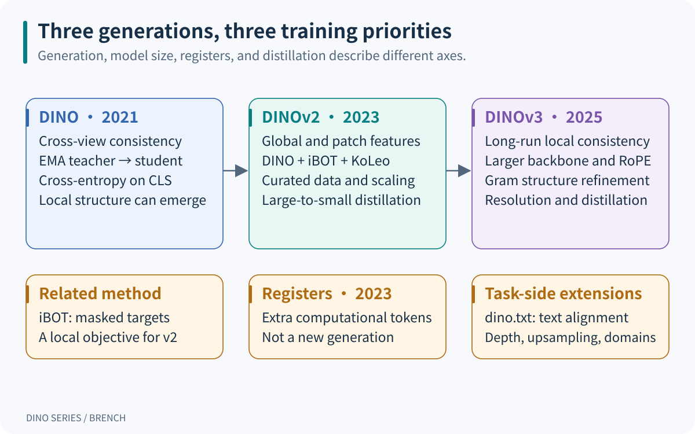{width="100%" fig-align="center"}

::: {.table-responsive}

| Generation | Main learning signal | Representative backbone and data | Main usable outputs |
|---|---|---|---|
| DINO, 2021 | Cross-view cross-entropy on CLS distributions | ViT-S/B with patch size 16 or 8; mainly unlabeled ImageNet-1k in the paper; ResNet also studied | Image features; attention or patches can expose local structure |
| DINOv2, 2023 | DINO + iBOT + KoLeo | Approximately 1.1B ViT-g/14; LVD-142M; smaller models obtained by distillation | Image-level CLS and local patch features |
| DINOv3, 2025 | The three objectives initially, followed by Gram anchoring | ViT-7B/16 has approximately 6.7B parameters; web-image models use LVD-1689M | Features suited to dense prediction and high-resolution use |

:::

S, B, L, and g/7B describe model scale; `/14` and `/16` give the patch side length; `reg4` indicates four register tokens. These are not new generations. DINOv2 has original and later register-equipped variants. DINOv3 also includes distilled ViT-S/S+/B/L/H+ and ConvNeXt models, as well as models trained on satellite imagery. Checkpoints trained on different data cannot be ranked by size alone.[^dinov2-code][^dinov3-code]

The similarly named detectors belong to a different line of work. Here DINO means **self-distillation with no labels**, not “denoising self-distillation.” *DINO: DETR with Improved DeNoising Anchor Boxes for End-to-End Object Detection* belongs to the DETR detection family. Grounding DINO studies open-set detection and language grounding; it is not the next generation of the visual DINOv2/v3 series.[^detector][^grounding]

This note revisits questions from the earlier [DINO series analysis](https://github.com/BrenchCC/DINO_Series_Model_Analysis), checking mechanisms against official papers and code. Numerical examples below are constructed for teaching. The project case study describes code and documentation, without presenting structural deductions as measured gains.

## 2. Shared architecture: from an image to a training target

### 2.1 Backbone features, training heads, and task heads

Let a batch contain $B$ images of size $H\times W$, with patch side length $p$. For clarity, assume both image dimensions are divisible by $p$:

$$
N = \frac{H}{p}\frac{W}{p},\qquad
X_{\mathrm{patch}}\in\mathbb{R}^{B\times N\times D}.
$$

A linear projection maps each patch to a $D$-dimensional token. The ViT adds one CLS token and, in register-equipped variants, $R$ learned tokens. The sequence length is $1+R+N$. For example, DINOv2 with a $224\times224$ input and patch size 14 has $16\times16=256$ patches. Adding CLS and four registers gives 261 tokens. DINOv3 with a $256\times256$ input and patch size 16 also has 256 patches.

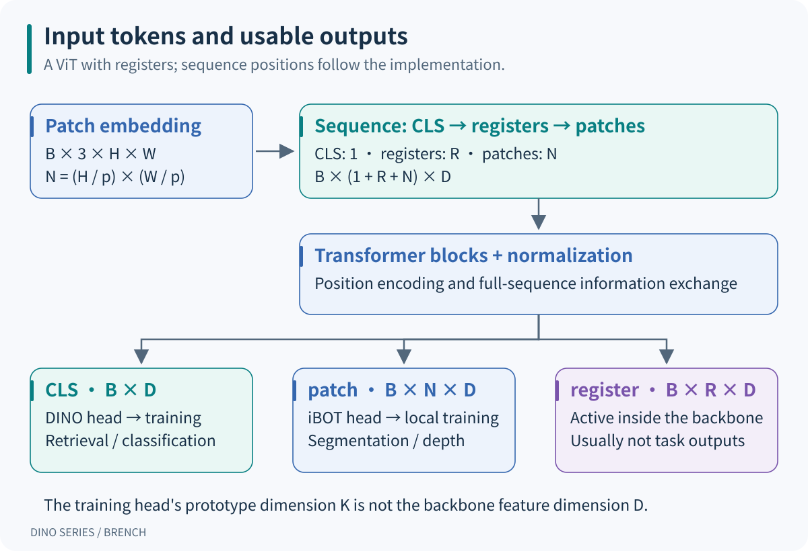{width="100%" fig-align="center"}

::: {.table-responsive}

| Object | Typical shape | Role |
|---|---|---|
| CLS output | $B\times D$ | Aggregates image information for classification or retrieval |
| Patch output | $B\times N\times D$ | Retains location-dependent information and can form a spatial grid |
| Register output | $B\times R\times D$ | Provides additional computation space, usually omitted from task heads |
| DINO head output | $B\times K_D$ | Maps CLS to training-time prototype logits |
| iBOT head output | $M\times K_I$ | Produces local logits for $M$ selected patches |

:::

$D$ is the backbone feature dimension; $K_D/K_I$ are target dimensions. Hundreds of thousands of prototype logits do not require a retrieval system to store vectors of that size. Prototypes also have no predefined association with human categories such as “cat” or “car.”

The DINO training head uses an MLP, a normalized bottleneck, and a final projection. Later variants change head width, prototype counts, and normalization. These heads support representation learning. A downstream linear classifier, DPT depth head, or segmentation decoder serves a particular task and is a separate component.

**The official DINOv2 implementation places CLS first.** With registers, the order is `[CLS, registers, patches]`. The earlier explanation that moving CLS to the end reduces interference has no implementation basis. A paper diagram's visual arrangement does not establish the sequence order in code.[^vit-code]

### 2.2 Why two networks can teach one another

The student $g_s=h_s\circ f_s$ contains a backbone and a head; the teacher $g_t=h_t\circ f_t$ supplies targets. Self-distillation pretraining typically initializes them with the same parameters. Gradient descent updates the student, while an exponential moving average updates the teacher:

$$
\theta_t \leftarrow m\theta_t+(1-m)\theta_s.
$$

The teacher is not a pretrained classifier that already knows the correct category. It supplies a relatively stable target that the student predicts from another view. Shared structure, augmentation, cross-view constraints, and collapse-prevention mechanisms jointly shape the representation. EMA alone does not guarantee semantic features.

`stop-gradient` prevents the cross-entropy gradient from flowing through the teacher. EMA updates parameters; centering updates output statistics. Both involve moving averages, but of different quantities. Large-to-small distillation is different again: a fixed large teacher is not generated by averaging the smaller student's parameters.

Inference usually retains one trained backbone, without running both networks. With a register-equipped checkpoint, registers still participate in the backbone forward pass. Their final outputs are usually discarded; the input tokens cannot simply be removed.

## 3. DINO: matching distributions across views

### 3.1 What augmentation supplies

An image produces two global crops covering relatively large regions and several local crops. The teacher sees only global crops, while the student sees all crops. Predicting a larger-view target from a smaller view encourages local-to-global consistency. Global crops also undergo random cropping and color transformations; they are not necessarily the full original image.

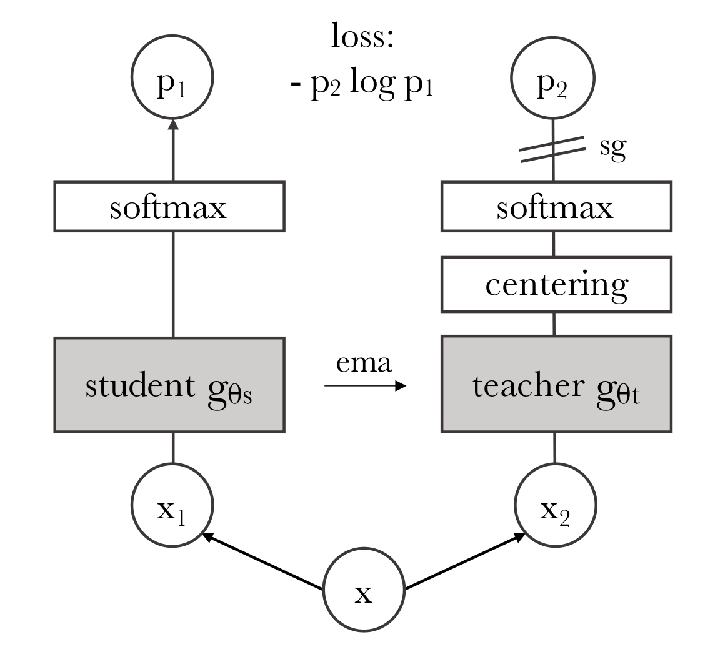{width="72%" fig-align="center"}

For global crops $g_1,g_2$ and $L$ local crops, the teacher's $g_1$ supervises the student's $g_2$ and every local crop; teacher $g_2$ supervises student $g_1$ and every local crop. Matching the identical global view is excluded, leaving $2(L+1)$ directed view pairs. Augmentations should preserve task-relevant information. A crop containing only background can make the consistency target inappropriate.

### 3.2 Cross-entropy, temperature, and centering

Let $z_t$ and $z_s$ denote teacher and student logits, and $c$ the center:

$$
q_k =
\frac{\exp((z_{t,k}-c_k)/\tau_t)}
{\sum_j\exp((z_{t,j}-c_j)/\tau_t)},\qquad
p_k =
\frac{\exp(z_{s,k}/\tau_s)}
{\sum_j\exp(z_{s,j}/\tau_s)}.
$$

The teacher distribution $q$ is detached. For one view pair:

$$
H(q,p)=-\sum_{k=1}^{K}q_k\log p_k.
$$

Writing the valid view-pair set as $\mathcal P$, DINO averages over images and pairs:

$$
\mathcal L_{\mathrm{DINO}}
=\frac{1}{B|\mathcal P|}
\sum_{b=1}^{B}\sum_{(u,v)\in\mathcal P}
H\!\left(q_t(u_b),p_s(v_b)\right).
$$

This is classification with soft targets. Unlike SimCLR, it does not explicitly put other images into a negative-sample denominator. The softmax normalizes over prototypes, not over images to be matched.

The center is updated using raw teacher logits, with the corresponding statistics aggregated in distributed training:

$$
c\leftarrow \mu c+(1-\mu)
\frac{1}{2B}\sum_{b=1}^{B}\sum_{u\in\{g_1,g_2\}}z_t(u_b).
$$

::: {.table-responsive}

| Mechanism | Applied to | Main role and limitation |
|---|---|---|
| Centering | Teacher logit dimensions | Discourages one dimension from dominating; alone, it can favor overly uniform outputs |
| Sharpening | Teacher temperature $\tau_t$ | Concentrates each target; excessive sharpening can favor one dimension for all images |
| Stop-gradient | Teacher targets | Prevents the current loss from jointly moving both branches toward an easy solution |
| EMA teacher | Teacher parameters | Supplies targets that evolve gradually |
| Multiple views | Different crops of the same image | Retains information shared across augmentations |

:::

Collapse prevention depends on the combination and appropriate parameters. Neither EMA nor stop-gradient alone is a mathematical guarantee against collapse. The DINO paper studies the complementary effects of centering and sharpening through ablations.[^dino]

For a three-dimensional example, take teacher $q=(0.8,0.1,0.1)$ and student $p=(0.6,0.3,0.1)$. Their cross-entropy is approximately $0.7593$. Even when the student exactly matches the teacher, the loss remains the teacher entropy, $H(q)\approx0.6390$, rather than zero:

$$
H(q,p)=H(q)+D_{\mathrm{KL}}(q\parallel p).
$$

For a fixed teacher target, reducing cross-entropy reduces KL divergence. During training the teacher changes, however, so loss values from different stages do not directly rank feature quality.

### 3.3 One DINO training step

Use a teaching setup with $B=2,L=2$, giving six view pairs. With ViT-S/16, global size 224 and local size 96 produce 196 and 36 patch tokens respectively. Both yield 384-dimensional CLS features. Different resolutions require separate forward groups; the two image sizes cannot simply be concatenated along the batch axis.

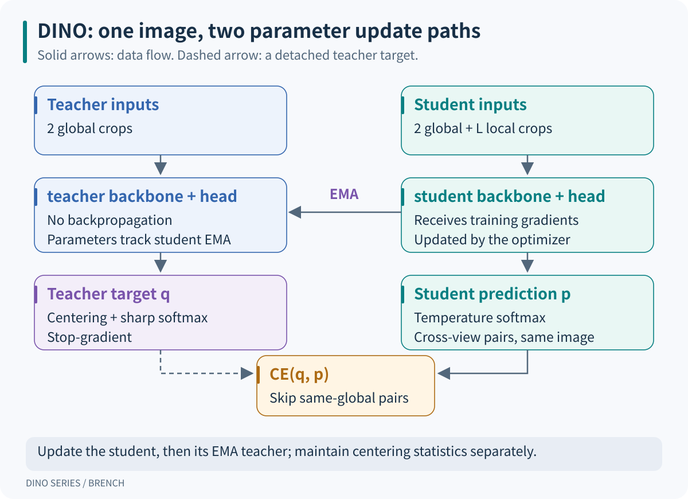{width="100%" fig-align="center"}

This is mechanism-level pseudocode. Helper names stand for mathematical operations, not a directly executable training program:

```python
# 同图多视图 / Multiple views of the same images
global_views, local_views = augment(images)
student_views = global_views + local_views

# 教师只看全局视图 / Teacher sees global views only
with no_grad():
    teacher_logits = [teacher(view) for view in global_views]
    targets = [centered_softmax(z, center, tau_t) for z in teacher_logits]

student_logits = [student(view) for view in student_views]
pair_losses = []
for teacher_index, target in enumerate(targets):
    for student_index, logits in enumerate(student_logits):
        if student_index == teacher_index:
            continue
        pair_losses.append(soft_target_ce(target, logits, tau_s))

loss = mean(pair_losses)  # 每项先对图片平均 / Each item averages over images
optimizer.zero_grad()
loss.backward()
optimizer.step()
ema_update(teacher, student, momentum)
center = update_center(center, teacher_logits, center_momentum)
```

The teacher produces two $B\times K$ arrays, and the student four. The center update uses teacher logits from the current forward pass. An implementation may perform that update inside the loss or apply it later, provided the timing semantics agree. EMA uses student parameters after the optimizer step.

### 3.4 The paper's recipe and limits of the observed behavior

The ViT-S/16 recipe in §3.2 uses AdamW and total batch size 1024. The learning rate scales as $0.0005\times B/256$, warms up for ten epochs, then decays with a cosine schedule. Weight decay moves from 0.04 to 0.4. Student temperature is 0.1; the described teacher temperature rises from 0.04 to 0.07 over the first 30 epochs. Teacher momentum moves from 0.996 toward 1. The paper includes experiments lasting 300 and 800 epochs, among others; they should not all receive one training-duration label. CLI defaults need not match a particular results table.[^dino][^dino-code]

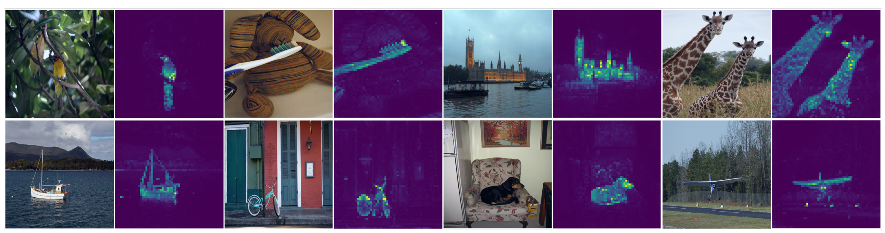{width="95%" fig-align="center"}

Object outlines in attention maps are an observation, not a class-labeled semantic segmentation output. Pretraining has no pixel-class cross-entropy. A reliable segmentation application still needs an appropriate extraction method or a trained task head.

## 4. DINOv2: usable global and local features

### 4.1 Changes to data, objectives, and implementation

DINOv2 asks whether features can transfer beyond a single classification dataset to fine-grained recognition, retrieval, segmentation, and depth. It combines data curation, a local objective, and training at scale. LVD-142M is organized through visual features, deduplication, and similarity-based retrieval around curated data. Training without labels still involves deliberate data selection.[^dinov2]

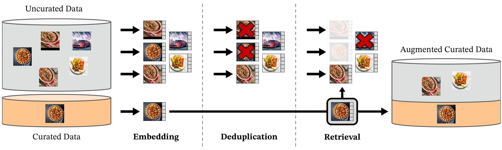{width="95%" fig-align="center"}

The paper does not release a complete dataset sufficient to reconstruct LVD-142M image by image. A public ImageNet-22k training configuration is a usable recipe, not a reproduction of the full official LVD-142M pretraining run.

### 4.2 The roles of the three losses

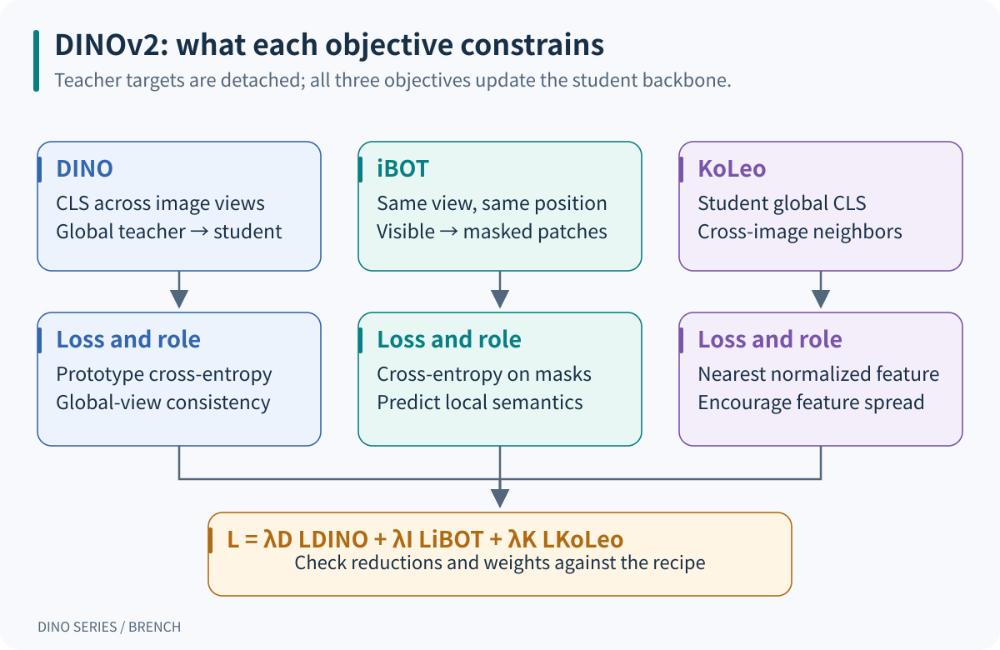{width="100%" fig-align="center"}

DINO continues to constrain CLS across views. iBOT asks the student to predict the teacher's semantic distribution at a masked position. The student sees a mask token where the teacher sees the original content of the same global crop. **Local matching requires the same view and position. Patch 17 in two independent crops does not necessarily refer to the same image region.**

For $2B$ global crops, let $\mathcal M_a$ be the masked positions in crop $a$:

$$
\mathcal L_{\mathrm{iBOT}}
=\frac{1}{2B}\sum_{a=1}^{2B}
\frac{1}{\max(1,|\mathcal M_a|)}
\sum_{i\in\mathcal M_a}
H\!\left(q_{t,a,i},p_{s,a,i}\right).
$$

Averaging over masked positions within each crop, then over crops, avoids giving a crop extra weight merely because it has more masks. A crop with no masks contributes zero. The implementation packs selected positions into $M\times K_I$, preserves the weighting with `masks_weight`, and handles multi-crop scaling in the caller. iBOT predicts a teacher latent-prototype distribution, not RGB pixels. Teacher targets are detached; gradients pass through the student iBOT head into the shared backbone.[^v2-loss]

KoLeo constrains normalized student CLS features. Write $u_b=f_s(x_b)/\|f_s(x_b)\|_2$:

$$
\mathcal L_{\mathrm{KoLeo}}
=-\frac{1}{B}\sum_{b=1}^{B}
\log\!\left(\min_{j\ne b}\|u_b-u_j\|_2+\epsilon\right).
$$

Each sample finds its nearest neighbor, and the loss discourages features from crowding together. It depends only on student features; gradients can flow through both endpoints of a selected distance. The discrete nearest-neighbor selection itself is not continuously differentiated. DINOv2 computes this in separate groups for the two global views, avoiding repulsion between the two views of the same image. KoLeo can be negative because distances on the unit sphere can exceed 1.

For comparison, write the total objective as:

$$
\mathcal L
=\lambda_D\mathcal L_{\mathrm{DINO}}
+\lambda_I\mathcal L_{\mathrm{iBOT}}
+\lambda_K\mathcal L_{\mathrm{KoLeo}}.
$$

A common official configuration uses weights $1,1,0.1$. This equation identifies the objectives' roles. Reproducing the implementation also requires checking global/local pair counts, mask weights, and caller-level scale factors. A quantity divided by 2 for logging may not be the quantity used for backpropagation.[^v2-loss][^v2-config]

### 4.3 Sinkhorn-Knopp and separate heads

The main DINOv2 recipe uses three Sinkhorn-Knopp iterations in place of the original EMA-centering target transformation. Alternating normalizations of a batch of teacher prototype scores balance total prototype use while producing a distribution summing to one for each sample. The student still uses temperature-scaled softmax.

Balancing refers to prototype use across samples. It neither makes every individual target uniform nor balances human-labeled classes. Distributed implementations must synchronize the relevant statistics; normalizing on each GPU separately can change the target. The public code supports both centering and Sinkhorn-Knopp, so a description of a particular run should follow its selected configuration.

The original iBOT work studied sharing a head between CLS and patches. DINOv2 uses separate DINO and iBOT heads at scale, allowing distinct mappings for global and local targets. The backbone remains shared, so their gradients can still interact there.

### 4.4 One DINOv2 training step

Keep the teaching batch at $B=2$, with two global and two local crops. For patch size 14, a 224 global crop has 256 patches and a 98 local crop has 49. Teacher global patch outputs have shape $4\times256\times D$; corresponding student inputs are masked. If $M$ positions are selected, the iBOT head need only process those $M$ outputs.

```python
# 教师目标：可见的全局图像 / Teacher targets from visible global crops
with no_grad():
    teacher_cls, teacher_patch = teacher(global_views)
    cls_targets = sinkhorn(dino_teacher_head(teacher_cls))
    patch_targets = sinkhorn(ibot_teacher_head(teacher_patch[mask]))

# 学生全局视图被遮挡，局部视图不变 / Mask only student global views
student_cls, student_patch = student(global_views, masks = mask)
local_cls = student(local_views).cls
global_logits = dino_student_head(student_cls)
local_logits = dino_student_head(local_cls)
loss_dino = cross_view_dino(global_logits, local_logits, cls_targets)
loss_ibot = masked_patch_ce(
    ibot_student_head(student_patch[mask]),
    patch_targets,
    masks_weight
)
loss_koleo = koleo_per_global_view(student_cls)
loss = weighted_sum(loss_dino, loss_ibot, loss_koleo)

optimizer.zero_grad()
loss.backward()
clip_student_gradients()
optimizer.step()
ema_update(teacher, student, momentum)
```

The pseudocode omits mixed precision, distributed reductions, and schedules while retaining target and gradient relationships. The mask must select both the input replacements and the matching loss targets. Patch targets exclude CLS and registers. A tiny teaching batch also does not reproduce KoLeo or Sinkhorn behavior at the actual training batch size.

### 4.5 Training scale, resolution, and smaller-model distillation

::: {.table-responsive}

| Setting | Recipe described in the paper | Necessary distinction |
|---|---|---|
| ViT-g/14 main pretraining | 40 blocks, dimension 1536, 24 attention heads; total batch 3072; 625k iterations | Representative large-model settings, not settings for every size |
| Optimization | AdamW; Table 16 LR $3.5\times10^{-4}$; 100k-step warmup; weight decay 0.04→0.2; EMA 0.994→1 | Separate from the public ImageNet-22k example configuration |
| Resolution adaptation | Another 10k steps at resolution 518 after pretraining | Primarily benefits dense tasks and costs more than a low-resolution forward pass |
| Smaller-model distillation | Fixed ViT-g teacher and a separate student EMA; no masking or stochastic depth, but patch targets remain | An iBOT objective does not imply masked inputs in every stage |
| Implementation | Memory-efficient attention, sequence packing, FSDP, mixed precision | Reduces memory and communication costs without redefining the objectives |

:::

These settings come from §5, Appendix B, and Tables 16–17. Sequence packing uses a block-diagonal attention mask to prevent images from attending to one another; it does not give all images a shared context.[^dinov2]

### 4.6 What registers do and do not fix

*Vision Transformers Need Registers* finds that some models use low-information background patches as computation space, producing high-norm outlier tokens. Those tokens hold considerable global information but pollute local feature maps. Learned registers provide workspace independent of image positions and alleviate this behavior.[^registers]

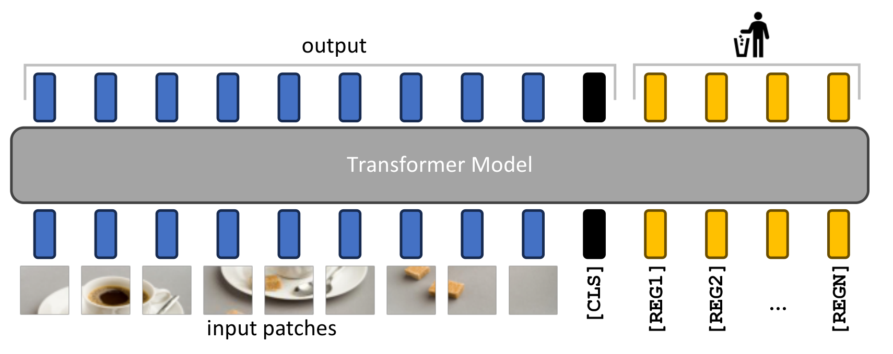{width="92%" fig-align="center"}

Registers participate in attention and training but normally receive no direct classification or patch target. They receive gradients through interactions with other tokens. Four registers are a common setting in that work, not evidence that more is always better. They must match the trained checkpoint; inserting them into an arbitrary old model at inference does not reproduce the result.

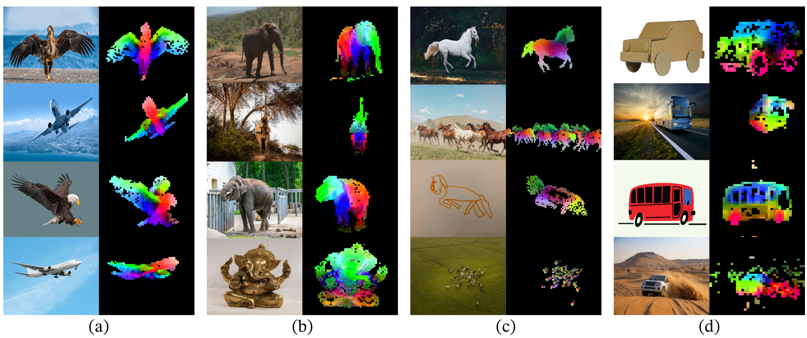{width="95%" fig-align="center"}

PCA colors are not class labels. The figure thresholds away background, and its colors depend on the features used to fit PCA. It demonstrates exploitable structure, not automatic segmentation or semantic matching for arbitrary images.

## 5. DINOv3: preserving local structure at scale

### 5.1 Architecture and training changes

DINOv3's large teacher widens DINOv2 ViT-g from dimension 1536 to 4096, retaining 40 blocks while increasing attention heads from 24 to 32. Patch size changes from 14 to 16. It uses RoPE and four storage/register tokens, with a SwiGLU hidden dimension of 8192. DINO and iBOT use separate heads; the paper specifies 256k and 96k prototypes respectively.[^dinov3]

RoPE operates on attention queries and keys. DINOv3 uses normalized two-dimensional patch coordinates and varies their range through RoPE-box jittering: the paper scales $[-1,1]$ to $[-s,s]$, with $s\in[0.5,2]$. This helps accommodate scale and resolution changes, but does not guarantee unchanged performance at arbitrary resolutions or remove the computational cost of additional tokens.

The initial objectives remain DINO, iBOT, and distributed KoLeo. The latter computes neighbor distances in groups of 16 samples. Appendix C specifies CLS from the student's first global crop, which differs from simply reusing DINOv2's two global-view groups. The backbone also uses separate global/local CLS normalization to reduce the effect of different crop statistics.[^dinov3][^v3-code]

::: {.table-responsive}

| Stage | Settings documented in the paper | Teacher and objectives |
|---|---|---|
| Main pretraining | LVD-1689M; total batch 4096; 1M steps; 2 global + 8 local; sizes 256/112 | EMA teacher; DINO + iBOT + $0.1\,\mathrm{DKoLeo}$ |
| Optimization | AdamW; LR $4\times10^{-4}$, constant after 100k warmup steps; weight decay 0.04; EMA 0.999; layerwise decay 0.98 | Does not reuse DINOv2's full cosine schedule |
| Gram refinement | Add Gram after 1M main-training steps; paper weight $w_{\mathrm{Gram}}=2$ | Initialize the Gram teacher from an early checkpoint and refresh periodically |
| High-resolution adaptation | Another 10k steps; global sizes 512/768, local sizes 112/168/224/336 | Retain Gram; sample configured groups of global/local/Gram resolutions |
| Smaller-model distillation | Fixed large teacher; 1M steps, then 250k cooldown steps and high-resolution adaptation | Maintain a student EMA; no Gram anchoring |

:::

This table records stage-specific paper settings, rather than assembling them into an executable configuration. The main pretraining LR cannot simply be copied into Gram refinement. Reproduction requires the relevant stage YAML and restored checkpoint and scheduler states. Official code provides separate pretraining, Gram, high-resolution, and distillation configurations.[^v3-code]

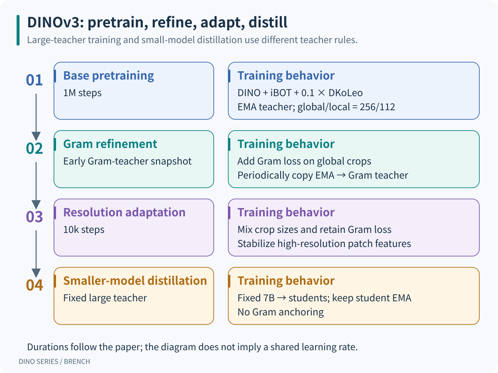{width="100%" fig-align="center"}

### 5.2 Classification can improve while local features deteriorate

During prolonged training, CLS classification can keep improving while patch-level consistency worsens. In the DINOv3 paper, VOC segmentation begins declining around 200k steps. Patch-to-CLS similarity increases, and patch-similarity maps show more irrelevant responses.[^dinov3]

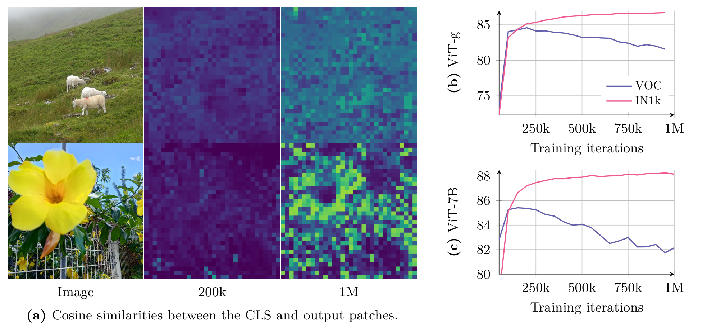{width="95%" fig-align="center"}

This differs from the high-norm artifacts studied in the Registers paper. Local similarity relationships can deteriorate even with registers and without conspicuously abnormal norms. The presence of registers therefore does not establish that dense features are adequately protected.

### 5.3 Why Gram anchoring constrains pairwise relationships

Let corresponding student and Gram-teacher patch features be L2-normalized, giving $\hat X_s,\hat X_g\in\mathbb R^{B\times N\times D}$. Each image has a Gram matrix:

$$
G_s=\hat X_s\hat X_s^\mathsf T,\qquad
G_g=\hat X_g\hat X_g^\mathsf T.
$$

Its shape is $B\times N\times N$. Entry $(i,j)$ is the cosine similarity between two patches of the same image. The paper expresses the discrepancy as a squared Frobenius norm; official `GramLoss` averages all entries through `MSELoss`, which can be written explicitly as:

$$
\mathcal L_{\mathrm{Gram}}
=\frac{1}{BN^2}\sum_{b=1}^{B}
\sum_{i=1}^{N}\sum_{j=1}^{N}
\left(G_{s,b,i,j}-\mathrm{sg}(G_{g,b,i,j})\right)^2.
$$

`sg` means stop-gradient. Only student patch features receive gradients. The paper's sum notation and the implementation's mean differ by a size-dependent factor, so a reproduced weight must follow the actual reduction. Also check whether the selected configuration retains negative similarities. The Gram-refinement configuration examined here uses normalized features and image-level Gram matrices without clipping negative values.[^v3-code]

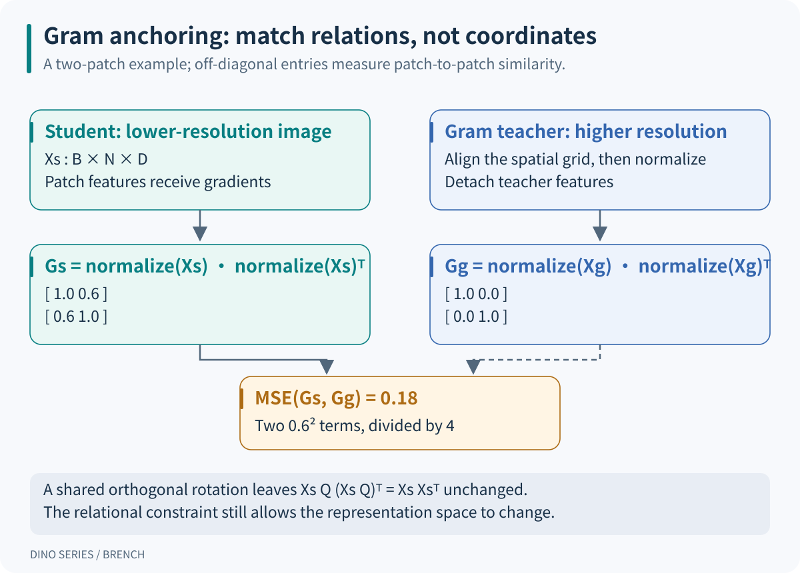{width="100%" fig-align="center"}

For example, consider:

$$
G_s=
\begin{bmatrix}1&0.6\\0.6&1\end{bmatrix},
\qquad
G_g=
\begin{bmatrix}1&0\\0&1\end{bmatrix}.
$$

The MSE is $(0.6^2+0.6^2)/4=0.18$, while the unnormalized squared Frobenius norm is 0.72. The target asks the two patches to become less similar without requiring any particular feature-channel value.

For an orthogonal matrix $Q$, with $QQ^\mathsf T=I$:

$$
(\hat X_sQ)(\hat X_sQ)^\mathsf T
=\hat X_s\hat X_s^\mathsf T.
$$

Rotating every patch feature together can therefore preserve the constraint. Compared with matching early features channel by channel, Gram anchoring leaves more freedom for representations to change. This is a mathematical property of the objective, not evidence that global capabilities are unaffected; experiments must establish that tradeoff.

### 5.4 Two teachers and high-resolution targets

The EMA teacher updates from the student every step and supplies DINO/iBOT targets. The Gram teacher is a separate reference snapshot. It starts from an early teacher with useful local structure, then copies the current EMA teacher every 10k steps, with at most three refreshes in the paper. It stays fixed between refreshes. Calling it merely a “slower EMA” misses this update rule.

Gram refinement also gives the Gram teacher an image with twice the side length: for example, 512 for the teacher versus 256 for the student. Its spatial feature grid is bicubically downsampled to the student's grid, then normalized before computing Gram. Both branches must describe the same image region. Gram matrices built from different token counts cannot be subtracted without alignment. Later mixed-resolution adaptation uses other grouped sizes, rather than maintaining this twofold ratio throughout.

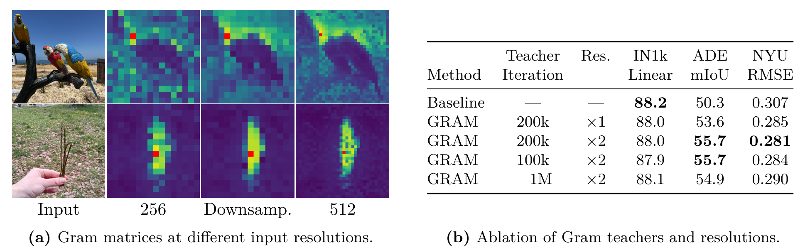{width="95%" fig-align="center"}

In this ablation, the 200k-step teacher at twice the resolution changes ADE20k mIoU from the baseline's 50.3 to 55.7, while ImageNet linear accuracy changes from 88.2 to 88.0. This supports local-feature repair, not improvement on every metric. Early teachers at 100k and 200k perform similarly; the later 1M-step teacher is less effective.[^dinov3]

### 5.5 One DINOv3 Gram-refinement step

With $B=2$, global size 256, and patch size 16, concatenating two global views produces $4\times256$ patches. The Gram teacher's 512 input produces a $32\times32$ grid. After alignment to $16\times16$, both Gram tensors have shape $4\times256\times256$.

```python
# 基础目标仍由 EMA teacher 提供 / EMA teacher supplies the base targets
base_loss, student_global_patch = dino_v3_base_objectives(batch)

# Gram teacher 是单独快照 / The Gram teacher is a separate snapshot
with no_grad():
    gram_patch = gram_teacher(batch.gram_global_views).patch
    gram_patch = resize_patch_grid(gram_patch, batch.student_grid)
    gram_patch = normalize(gram_patch, dim = -1)

student_patch = normalize(student_global_patch, dim = -1)
student_gram = student_patch @ student_patch.transpose(-1, -2)
target_gram = gram_patch @ gram_patch.transpose(-1, -2)
loss_gram = mean((student_gram - target_gram) ** 2)
loss = base_loss + gram_weight * loss_gram

optimizer.zero_grad()
loss.backward()
clip_student_gradients()
optimizer.step()
ema_update(teacher, student, momentum)
if gram_refresh_due(step):
    copy_parameters(gram_teacher, teacher)
```

Here `base_loss` uses the refinement stage's actual DINO/iBOT/KoLeo weights. `gram_refresh_due` includes the stage start, 10k-step interval, and maximum of three refreshes. The paper and official configuration also specify masking, augmentation, and teacher resolutions; this pseudocode does not reconstruct the full recipe.

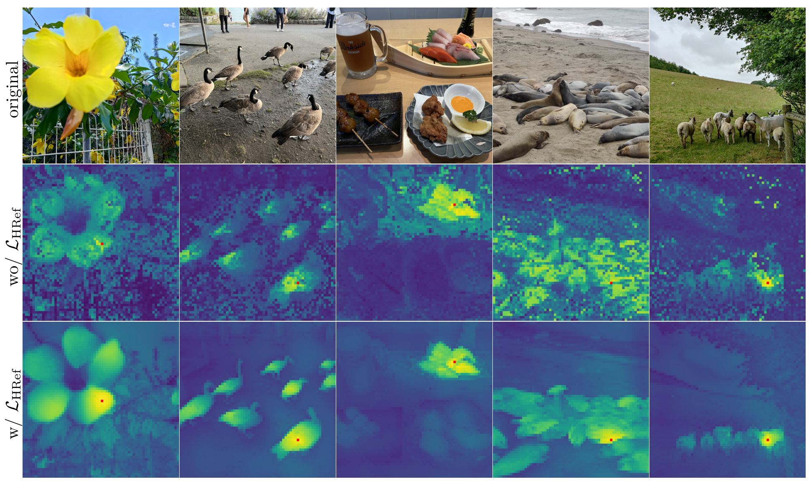{width="95%" fig-align="center"}

Smaller-model distillation does not directly reuse this Gram-refinement step. A fixed 7B teacher guides the smaller student, while a separate student EMA provides the output model. The paper reports no comparable local degradation in this setting, so neither distillation nor its high-resolution adaptation uses Gram anchoring. A regularizer that helps one training stage need not be added to every stage.

## 6. Tasks and adaptation choices

### 6.1 Choose the interface from the required representation

::: {.table-responsive}

| Task | Common representation and interface | Additional requirements | Evaluation focus |
|---|---|---|---|
| Image classification | CLS; sometimes concatenated multi-layer CLS or pooled patches | Labeled reference set for k-NN, or a trained linear classifier | Top-1/Top-5; consistent class splits |
| Image, instance, or resource retrieval | Normalized CLS or task projection; optional patch reranking | Feature database, resource-ID mapping, consistent query/database encoding | Recall@K, mAP, accuracy and coverage |
| Semantic segmentation | Patch grids and multi-layer features | Pixel labels; linear head or segmentation decoder | mIoU; input resolution and inference protocol |
| Monocular depth | Patch and multi-layer features | A depth-trained head; appropriate supervision for metric scale | RMSE, AbsRel; distinguish relative from metric depth |
| Local/semantic correspondence | Patch similarities | Grid alignment, match filtering, possibly geometric constraints | PCK, match accuracy, and occlusion conditions |
| Video segmentation/tracking | Per-frame patches and neighboring-frame matches | Initial annotations or task-defined reference information; temporal propagation | Measures such as DAVIS J&F; state initial supervision |
| Video classification/title identification | Frame CLS or projections, aggregated over time | Temporal sampling, voting, or a temporal head | Video-level metrics, beyond frame-level Top-1 |
| Vision-language tasks | Visual features plus an alignment module | Text encoder or language model, paired data, and alignment training | Relevant retrieval, classification, or generation metrics |

:::

A raw visual DINO checkpoint does not naturally share an embedding space with text. Comparing arbitrary text vectors with CLS does not produce CLIP-style zero-shot classification. dino.txt and DINOv3's text-alignment modules add the training needed for this interface.[^dinotxt][^dinov3]

A “frozen backbone” also does not imply an entirely untrained downstream system. Strong DINOv3 system results can combine a frozen backbone with a trained detector, ViT-Adapter/Mask2Former, or depth model. Linear probes and complex task systems need separate comparisons.

### 6.2 Freeze, project, or fine-tune

Start with a frozen-backbone baseline to verify preprocessing and evaluation. If CLS already distinguishes the targets and the remaining need is vector dimensionality or distance adaptation, train a small projection. For local tasks, first examine patches, multi-layer features, and the task head. Compressing CLS cannot be expected to restore spatial detail that is already absent.

When domain shift is substantial and frozen features do not separate task samples, compare partial unfreezing, full fine-tuning, and domain self-supervision. Unfreezing increases memory and training costs, creates forgetting risks, and changes the retrieval space. Changes to the backbone, projection, or preprocessing usually require re-encoding the index; old and new vectors cannot simply be mixed.

For resource recognition, I would first establish whether the representation suits the retrieval objective. Larger backbones, additional losses, and higher resolutions should be compared under the same resource split and latency budget so that the source of any gain remains identifiable.

## 7. Project case study: DINOv2 + SimCLR for screenshot-based title identification

### 7.1 Implementation scope and training stages

This section follows the [latest project analysis](https://github.com/BrenchCC/dinov2_with_simclr/blob/cab5828c7c80d59f2b3d7b02c3e04131b7daa290/docs/project-analysis-and-improvements.md) and code at the same commit, `cab5828c7c80d59f2b3d7b02c3e04131b7daa290`. That document uses `c215a89` as its implementation baseline. The intervening commits add explanations and diagrams without changing training code.

The business input is a screenshot from a short drama: encode it, retrieve similar resource frames, map them to a title entity, and combine that candidate with content and title clues from a vision model. Upload handling, business routing, and frontend display belong to the integrating application; this repository mainly supplies the recognition components after routing.

::: {.table-responsive}

| Stage | Implemented behavior | Trainable components or outputs |
|---|---|---|
| Data and weight loading | Unlabeled resource frames; local/HDFS/TOS access; chunked key and positional-embedding adaptation | Data interfaces and backbone initialization |
| DINOv2 domain training | Retains student–teacher, multi-crop, and DINO/iBOT/KoLeo | Domain backbone checkpoint |
| SimCLR projection training | Loads a backbone checkpoint, freezes it, and trains the added MLP | Projection parameters and combined checkpoint |
| Feature export and indexing | Supports `dinov2` and `dinov2_mlp` representations | Vector shards, FAISS index, frame-to-entity mapping |
| Online recognition | Image retrieval, title mapping, rule-based fusion; voting for multiple frames | Entity, entity ID, and decision-strategy source |

:::

The project does not add InfoNCE to the DINOv2 total loss in `SSLMetaArch.forward_backward()`. The two training entry points connect through checkpoints. Domain training and SimCLR projection training are independently manageable stages. Their presence in code does not establish that training or gains were reproduced for this note.[^project-train][^project-ssl]

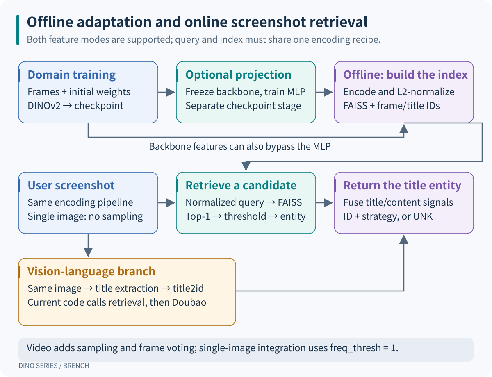{width="100%" fig-align="center"}

### 7.2 What trains after freezing the backbone

`DinoVisionTransformerWithMLP` sets backbone parameters to `requires_grad = False`, and the training entry point restricts Adam to `model.mlp.parameters()`. The default structure is:

```text
image → ViT-g CLS 1536 → Linear 1536→1536 → ReLU → Linear 1536→128
```

Both linear layers include biases, giving:

$$
(1536\times1536+1536)+(1536\times128+128)=2{,}557{,}568.
$$

The approximately 2.56M trainable parameters are calculated from the architecture. Freezing removes backbone gradients and optimizer states, but still requires backbone forward passes. Memory and speed effects need measurement. Reducing vectors from 1536 to 128 dimensions uses $1/12$ as many elements at the same dtype, a reduction of approximately 91.7%. That excludes model, index, and label overhead and is not a latency-reduction estimate.[^project-model]

In this backbone, `is_training=False` selects the return format; it is not PyTorch's `eval()`. Freezing parameters, disabling gradient recording, and disabling dropout/stochastic depth are distinct operations. Deterministic frozen features during projection training require checking module mode, beyond inspecting `requires_grad`.

### 7.3 Positive and negative samples in InfoNCE

The dataset creates two random augmentations of each image. Concatenating the two view batches gives $2B$ projected vectors, which are then normalized. For anchor $z_i$, the other view of the same image, $z_{p(i)}$, is positive; the $2B-2$ views from other images are negatives:

$$
\ell_i=-\log
\frac{\exp(z_i^\mathsf T z_{p(i)}/\tau)}
{\sum_{k\ne i}\exp(z_i^\mathsf T z_k/\tau)},\qquad
\mathcal L_{\mathrm{InfoNCE}}=\frac{1}{2B}\sum_{i=1}^{2B}\ell_i.
$$

The denominator includes the positive and excludes the anchor itself. Every view serves as an anchor, making the objective symmetric. Gradients pass through the normalized vectors into the MLP; backbone parameters remain fixed. Title IDs do not define positives in the current code, so two different frames from the same title can become negatives.[^project-simclr]

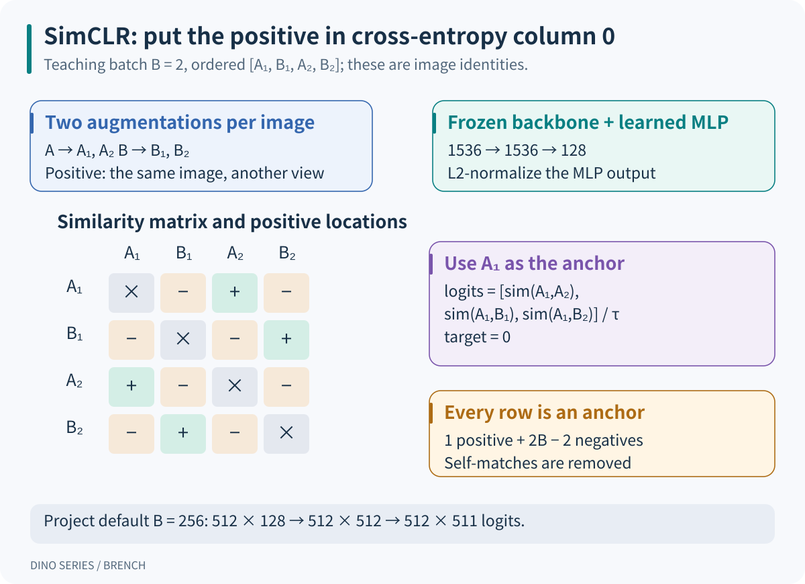{width="100%" fig-align="center"}

For a teaching example, take $B=2$ with order `[A1, B1, A2, B2]`. For `A1`, `A2` is positive and `B1/B2` are negative. If positive cosine similarity is 1, both negative similarities are 0, and $\tau=0.5$:

$$
\ell_{A1}
=-\log\frac{e^2}{e^2+1+1}
\approx0.2395.
$$

The code places each row's positive in column 0, so all cross-entropy targets are 0. That means “the correct candidate is in column 0,” not that all images belong to one business category.

### 7.4 One projection-training step and configuration checks

At the default $B=256$, the training path is:

```text
Two image batches, 256 images each
  → concatenate into 512 images
  → frozen backbone: 512 × 1536
  → MLP: 512 × 128
  → normalization and similarities: 512 × 512
  → remove self, put positive first: logits 512 × 511
  → 512 targets = 0, mean cross-entropy
  → update the MLP only
```

A simplified version of the current trainer is:

```python
images = cat(two_view_batches, dim = 0)
image_ids = cat([arange(batch_size), arange(batch_size)])
features = model(images)  # 冻结 backbone，训练 MLP / Frozen backbone, trainable MLP
features = normalize(features, dim = 1)
similarities = features @ features.T
logits = positive_first_without_diagonal(similarities, image_ids)
targets = zeros(2 * batch_size, dtype = long)
loss = cross_entropy(logits / temperature, targets)
optimizer.zero_grad()
loss.backward()
optimizer.step()
```

The actual implementation can enable autocast and GradScaler. Entry-point defaults are 200 epochs, Adam LR 0.0003, weight decay 0.0001, temperature 0.07, and projection dimension 128. These are defaults, not settings established by a reported best-performing experiment.[^project-train]

Two configuration details deserve verification first. SimCLR augmentation ends in `ToTensor()` without ImageNet mean/std normalization, while online encoding uses a normalized evaluation transform. Random augmentation is expected during training, but matching the numerical input distribution should be tested. The cosine scheduler sets `T_max` to `len(train_loader)` but calls `step()` once per epoch after the first ten epochs. This is not linear warmup, and the scheduling units need checking. These are static code observations; their practical effects require controlled experiments.[^project-transforms][^project-train][^project-simclr]

### 7.5 Offline vectors and online entity decisions

Resource frames are encoded in advance with a path-to-title-ID mapping. Online queries must use the same backbone, projection choice, and compatible preprocessing. With `dinov2_mlp`, the database and queries must use the same MLP. A 128-dimensional projection query cannot search a 1536-dimensional backbone index.

For normalized vectors, FAISS `FlatIP` scores equal cosine similarities. The service takes each image's Top-1 result, applies a score threshold and entity extraction, and obtains a visual candidate. Doubao supplies content judgments and title text; `title2id` maps that title to entities before rule-based fusion. The current orchestration calls retrieval first and Doubao second, rather than executing the branches in parallel.[^project-service]

Single-image integration uses `freq_thresh = 1`. The component default of 5 is more suitable for multiple frames: one image cannot provide five frame-level votes. Video extensions need frame sampling, similar-frame filtering, and entity-frequency voting. A single-image pipeline should not be described as majority voting over video frames.

A uniquely mapped title can provide the text candidate. If a title maps to multiple IDs, the visual candidate is used; if no title can be mapped, the visual result is used. Content flags filter cases that fail the required conditions. Outputs preserve entity, entity ID, and strategy source, with `UNK` for unrecognized inputs. Retrieval Top-1, title mapping, and fusion carry different evidence and should not be collapsed into an uncalibrated model-confidence number.

## 8. Extensions: which component changes

::: {.table-responsive}

| Work | Relation to DINO | Problem addressed and scope |
|---|---|---|
| iBOT | A major source of DINOv2's local objective | An online teacher supplies semantic masked-token targets; it is not a pixel autoencoder.[^ibot] |
| Vision Transformers Need Registers | Additional learned backbone tokens | Reduces high-norm patch artifacts, without solving every form of local degradation.[^registers] |
| dino.txt | Image- and pixel-level vision-language alignment on DINOv2 | Adds the text side and alignment training absent from a raw visual checkpoint.[^dinotxt] |
| Channel-Adaptive DINO | Adapts self-supervised backbones to microscopy with variable channel counts | The related official implementation supports Bag of Channels; its documentation explicitly excludes the Hierarchical Attention approach.[^channel] |
| Depth Anything V2 | Builds a depth system using DINOv2 representations | Learns depth through specialized teachers, synthetic data, and pseudo-labels; raw DINO features are not distances.[^depth] |
| FeatUp | Increases feature-grid resolution outside the backbone | Learns image-guided upsampling and supplies models for different encoders; it does not re-pretrain DINO.[^featup] |
| AnyUp | A subsequent feature-upsampling approach | Handles features from different encoders at inference; avoiding retraining per encoder does not mean the upsampler itself is untrained.[^anyup] |
| DINOv3 metadata-guided adaptation, FINO branch | An official subsequent domain-adaptation implementation | Uses existing metadata to guide or adversarially debias CLS; public examples include FMoW and microscopy. It is not DINOv4.[^fino] |

:::

At the verification date, the FINO branch implements *Who Needs Labels? Adapting Vision Foundation Models With the Metadata You Already Have*. Its FMoW example uses region metadata for an auxiliary objective and year for an adversarial objective, with designs including gradient-norm balancing of guide losses. This suggests a domain-adaptation approach: identify metadata carrying useful signals and metadata carrying nuisance biases before deciding what to encourage or suppress. Title IDs, production years, and source platforms should not automatically receive the same objective.[^fino]

These works modify objectives, backbones, spatial outputs, or task interfaces. Their inputs, outputs, and supervision requirements determine whether they can be combined.

## 9. Turning project improvements into testable experiments

### 9.1 Establish comparable baselines

Keep at least three representations under one evaluation split: public DINOv2, domain-trained DINOv2, and the domain backbone with SimCLR projection. To isolate the second stage, add “public backbone + the same projection training.” Comparing checkpoints that simultaneously change the backbone, augmentation, and dimension cannot isolate the cause of a difference.

Resource-recognition validation should reflect actual use. When the same title may appear in the database and queries, remove near-duplicate leakage by video, clip, or source. For generalization to new titles, additionally split training and evaluation by title. Even when retrieval requires the target entity to exist in the database, the query/database frame-construction protocol must be explicit. Randomly splitting adjacent video frames inflates apparent generalization.

### 9.2 Change one interpretable factor at a time

The following are proposed experiments. The project does not provide controlled results sufficient to establish that these changes already improve its metrics.

::: {.table-responsive}

| Problem | Proposed change | Control and measurements |
|---|---|---|
| Different frames of one title become false negatives | With reliable identity, try multiple positives, masking same-entity negatives, or limiting repeated clip sampling | Keep the original two-view baseline; report same-title and visually similar-title confusion |
| Augmentation destroys recognition clues | Adjust crop ranges, color perturbation, and flips while preserving useful text/layout information | Change one augmentation family at a time; stratify occlusion, subtitles, and screenshot compression |
| Inconsistent input distributions or modes | Align necessary normalization, fix frozen-backbone evaluation mode, and unify offline/online encoding | Record transforms, sizes, and mode; rebuild the corresponding index |
| Projection loses useful detail | Compare raw 1536 dimensions with 128/256/512-dimensional projections | Same backbone and data budget; report accuracy, coverage, index size, and latency |
| Frozen features cannot adapt to the domain | Compare MLP-only training, unfreezing the last blocks, and domain self-supervision | Same evaluation set; inspect in-domain gains and out-of-domain degradation |
| Global features confuse similar scenes | Rerank retrieved candidates with patch correspondences or a local head | Fix the candidate set; measure accuracy changes and added cost |
| A high threshold rejects too many queries | Sweep similarity thresholds on validation data to select the coverage/error operating point | Evaluate the test set once; report false acceptance of unknown titles separately |
| Repeated frames dominate voting | Limit near-duplicate votes and compare sampling with broader temporal coverage | Video-level controls; do not treat correlated frames as independent evidence |

:::

A frozen projection has clear engineering benefits: fewer trainable parameters, smaller vectors, and straightforward comparisons. Better business accuracy remains a separate claim requiring these evaluations.

### 9.3 Training metrics and business metrics

Current SimCLR Top-1/Top-5 logs measure the positive view's rank among contrastive candidates. Business frame-level metrics instead filter by similarity threshold and compute Top-1 accuracy among accepted samples and coverage across all samples:

$$
\mathrm{Accuracy}_{\mathrm{accepted}}
=\frac{N_{\mathrm{accepted\ and\ correct}}}{N_{\mathrm{accepted}}},
\qquad
\mathrm{Coverage}
=\frac{N_{\mathrm{accepted}}}{N_{\mathrm{all}}}.
$$

When no samples are accepted, accuracy needs an explicit evaluation convention; that outcome cannot count as success. Raising the threshold can increase accepted-sample accuracy while reducing coverage. A lower projection loss may only mean easier augmentation matching. The project supplies frame-level, video-level, and vision-model evaluation entry points, but their existence does not establish that the experiments have run.[^project-metrics]

## 10. Common questions and diagnostic order

### 10.1 If the teacher initially knows nothing, why is supervision useful?

Initial targets have no guaranteed human semantics. Learning relies on repeatable view relationships, shared parameters, and training constraints; teacher EMA stabilizes the evolving targets. Experiments validate the combined method. Incorrect augmentations, temperatures, or update rules can still make it fail.

### 10.2 Without negatives, why not output the same feature for every image?

Consistency alone permits this trivial solution. Original DINO combines centering, sharpening, stop-gradient, and EMA to address it; later versions add batch-balanced targets, local prediction, and feature-distribution regularization. Monitor target entropy, prototype usage, feature variance, and downstream metrics alongside the loss.

### 10.3 Both DINO and SimCLR use cross-entropy. What differs?

Cross-entropy is the computation, not the full learning problem. DINO's class axis contains teacher-defined prototypes with soft targets. SimCLR's class axis contains batch candidate views, and the target identifies the same-image positive. Inputs, denominators, and supervision relationships determine what the loss learns.

### 10.4 Does masking make iBOT equivalent to MAE?

iBOT targets teacher-generated latent distributions; typical MAE reconstructs pixels. Their targets, teacher involvement, and computation paths differ. Masked inputs do not make their objectives interchangeable.

### 10.5 Is CLS better or worse than patches?

They serve different granularities. Try CLS first for whole-image classification or resource recall, and patches for local positions, boundaries, and correspondence. Mean-pooled patches are a useful control, but their advantage over CLS requires measurement.

### 10.6 Are registers and Gram anchoring redundant?

Registers provide additional computation tokens, primarily addressing high-norm artifacts. Gram anchoring directly constrains similarity between spatial positions. DINOv3 observes local degradation despite registers, showing that the two mechanisms address different problems.

### 10.7 Must the projection head be discarded after training?

Original SimCLR commonly evaluates pre-projection features under its downstream protocol. This project explicitly supports retrieval that retains the MLP. Compare both representations and keep database/query encoding consistent; a rule from another interface does not decide the choice here.

### 10.8 Why is higher resolution not always better?

Higher resolution increases patch count, but can introduce position and scale distributions absent from training. Attention and Gram costs also grow with the number of token pairs: doubling image side length at fixed patch size gives roughly four times as many patches and sixteen times as many matrix entries. Accuracy and value depend on the task, adaptation, and budget.

### 10.9 How can an unsupervised system use title IDs or metadata?

Specify the stage. The original visual self-supervised objective needs no class labels, while a retrieval index needs resource identities to return titles. Using title IDs to define multiple positives introduces identity supervision; metadata-guided training should also state its signal source. These choices can be useful, but change the comparison protocol.

### 10.10 What should be checked first when retrieval worsens?

Follow the path from data to decisions: decoding and RGB, size and normalization, checkpoint and register configuration, model mode, CLS/patch/MLP output choice, vector normalization, index/query versions, entity mapping, thresholds, and evaluation split. Verify these interfaces before deciding to change the backbone or loss.

Target granularity is a practical way to navigate the series: DINO establishes cross-view consistency, DINOv2 adds local semantics and broader data, and DINOv3 protects local relationships during prolonged training. In a project, connect each objective to the task metric that should benefit before choosing the next training change.

## References

[^dino]: Caron et al. [Emerging Properties in Self-Supervised Vision Transformers](https://arxiv.org/abs/2104.14294), 2021. See §§3, 5, the appendix, and Figures 1–2.
[^dino-code]: [Official DINO training implementation](https://github.com/facebookresearch/dino/blob/main/main_dino.py): augmentation, DINOLoss, and teacher updates.
[^dinov2]: Oquab et al. [DINOv2: Learning Robust Visual Features without Supervision](https://arxiv.org/abs/2304.07193), 2023 / TMLR 2024. See §§3–5, Appendix B, and Tables 16–17.
[^dinov2-code]: [Official DINOv2 models and usage](https://github.com/facebookresearch/dinov2), including registers and dino.txt.
[^vit-code]: [DINOv2 ViT source](https://github.com/facebookresearch/dinov2/blob/7764ea0f912e53c92e82eb78a2a1631e92725fc8/dinov2/models/vision_transformer.py): `prepare_tokens_with_masks` and output slicing.
[^v2-loss]: [DINOv2 training architecture](https://github.com/facebookresearch/dinov2/blob/7764ea0f912e53c92e82eb78a2a1631e92725fc8/dinov2/train/ssl_meta_arch.py) and [loss implementations](https://github.com/facebookresearch/dinov2/tree/7764ea0f912e53c92e82eb78a2a1631e92725fc8/dinov2/loss): crop scaling, mask weights, and KoLeo.
[^v2-config]: [DINOv2 default configuration](https://github.com/facebookresearch/dinov2/blob/7764ea0f912e53c92e82eb78a2a1631e92725fc8/dinov2/configs/ssl_default_config.yaml) and [ViT-g/14 example recipe](https://github.com/facebookresearch/dinov2/blob/7764ea0f912e53c92e82eb78a2a1631e92725fc8/dinov2/configs/train/vitg14.yaml).
[^registers]: Darcet et al. [Vision Transformers Need Registers](https://arxiv.org/abs/2309.16588), 2023 / ICLR 2024.
[^dinov3]: Siméoni et al. [DINOv3](https://arxiv.org/abs/2508.10104), 2025. See §§3–5, Appendix C, Table 2, and Figures 5, 9, 10.
[^dinov3-code]: [Official DINOv3 model family and training release](https://github.com/facebookresearch/dinov3). Verified September 12, 2026.
[^v3-code]: [DINOv3 stage-specific configurations](https://github.com/facebookresearch/dinov3/tree/main/dinov3/configs/train), [GramLoss](https://github.com/facebookresearch/dinov3/blob/main/dinov3/loss/gram_loss.py) and [SSLMetaArch](https://github.com/facebookresearch/dinov3/blob/main/dinov3/train/ssl_meta_arch.py). Verified September 12, 2026.
[^detector]: Zhang et al. [DINO: DETR with Improved DeNoising Anchor Boxes for End-to-End Object Detection](https://arxiv.org/abs/2203.03605).
[^grounding]: Liu et al. [Grounding DINO: Marrying DINO with Grounded Pre-Training for Open-Set Object Detection](https://arxiv.org/abs/2303.05499).
[^ibot]: Zhou et al. [iBOT: Image BERT Pre-Training with Online Tokenizer](https://arxiv.org/abs/2111.07832).
[^dinotxt]: Jose et al. [DINOv2 Meets Text: A Unified Framework for Image- and Pixel-Level Vision-Language Alignment](https://arxiv.org/abs/2412.16334).
[^channel]: [Scaling Channel-Adaptive Self-Supervised Learning](https://openreview.net/forum?id=pT8sgtRVAf) and [implementation notes](https://github.com/facebookresearch/dinov2/blob/main/docs/README_CHANNEL_ADAPTIVE_DINO.md).
[^depth]: Yang et al. [Depth Anything V2](https://arxiv.org/abs/2406.09414) and [official code](https://github.com/DepthAnything/Depth-Anything-V2).
[^featup]: Fu et al. [FeatUp: A Model-Agnostic Framework for Features at Any Resolution](https://arxiv.org/abs/2403.10516) and [official code](https://github.com/mhamilton723/FeatUp).
[^anyup]: Wimmer et al. [AnyUp: Universal Feature Upsampling](https://arxiv.org/abs/2510.12764) and [official code](https://github.com/wimmerth/anyup).
[^fino]: Gardès et al. [Who Needs Labels? Adapting Vision Foundation Models With the Metadata You Already Have](https://arxiv.org/abs/2606.05107) and [DINOv3 FINO branch](https://github.com/facebookresearch/dinov3/tree/FINO). Verified September 12, 2026.
[^project-train]: [Project SimCLR training entry point](https://github.com/BrenchCC/dinov2_with_simclr/blob/cab5828c7c80d59f2b3d7b02c3e04131b7daa290/dinov2/train/train_simclr.py).
[^project-ssl]: [Project SSLMetaArch](https://github.com/BrenchCC/dinov2_with_simclr/blob/cab5828c7c80d59f2b3d7b02c3e04131b7daa290/dinov2/train/ssl_meta_arch.py).
[^project-model]: [Project backbone and MLP wrapper](https://github.com/BrenchCC/dinov2_with_simclr/blob/cab5828c7c80d59f2b3d7b02c3e04131b7daa290/dinov2/models/vision_transformer.py).
[^project-simclr]: [Project InfoNCE and training loop](https://github.com/BrenchCC/dinov2_with_simclr/blob/cab5828c7c80d59f2b3d7b02c3e04131b7daa290/dinov2/train/simclr.py).
[^project-transforms]: [Project training transforms](https://github.com/BrenchCC/dinov2_with_simclr/blob/cab5828c7c80d59f2b3d7b02c3e04131b7daa290/dinov2/data/transforms.py) and [online encoder](https://github.com/BrenchCC/dinov2_with_simclr/blob/cab5828c7c80d59f2b3d7b02c3e04131b7daa290/services/ai_resource_recognition/dinov2_resource_recognition.py).
[^project-service]: [Project recognition orchestration and fusion](https://github.com/BrenchCC/dinov2_with_simclr/blob/cab5828c7c80d59f2b3d7b02c3e04131b7daa290/services/ai_resource_recognition/main.py) and [project analysis](https://github.com/BrenchCC/dinov2_with_simclr/blob/cab5828c7c80d59f2b3d7b02c3e04131b7daa290/docs/project-analysis-and-improvements.md).
[^project-metrics]: [Project retrieval and business metrics](https://github.com/BrenchCC/dinov2_with_simclr/blob/cab5828c7c80d59f2b3d7b02c3e04131b7daa290/dinov2/infer/metrics.py).
