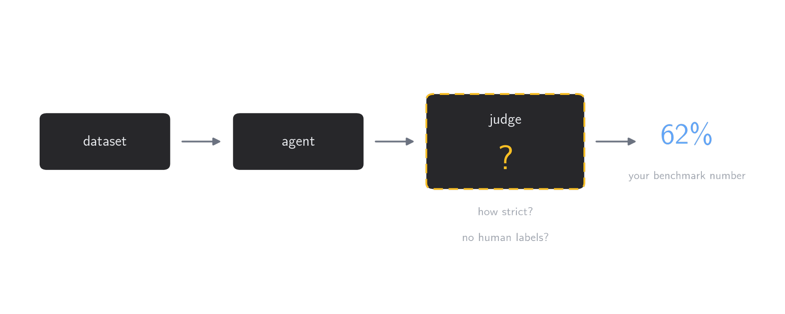

模型榜单经常把差几个百分点解释成明确的能力差距，但这个数字至少经过两层随机过程：Agent 要先完成任务，裁判再判断完成得怎样。原作者团队在 [The Benchmark Behind the Benchmark](https://browser-use.com/posts/benchmark-behind-the-benchmark) 中冻结 Agent 轨迹、只替换裁判模型后，同一批结果得到的总分从 **62.5% 变到 83.7%**。21.2 个百分点已经大于许多榜单相邻模型之间的差距。

这组实验最有价值的地方，不是给出了一个新的 Agent 排名，而是把「裁判模型」从评测流水线里的实现细节变成了待测对象。本文先完整复述其证据链，再讨论一个更严格的问题：裁判变稳定之后，分数是否就可信了？我的判断是否定的。降低方差解决的是重复一致性，正确性还取决于证据覆盖、任务定义、人工校准和比较协议。

## 1. 观测分数由哪些噪声构成

原文将 benchmark 概括为任务集和裁判。对开放式 Web Agent 而言，这个简化很有用：同一份任务数据并不会自动产生分数，必须有一套判断成功程度的逻辑。

原文先把观测分数的方差拆成两项：

$$
\mathrm{Var}(\text{score})
=
\underbrace{\sigma^2_{\text{agent}}}_{\text{只能测量}}
+
\underbrace{\sigma^2_{\text{judge}}}_{\text{可以压低}}
$$

`agent noise` 来自模型采样和真实网页环境。弹窗晚加载 100 ms、IP 被封、按钮位置变化、一次误读或提前结束，都可能让相同配置产生不同轨迹。`judge noise` 则发生在任务已经跑完之后：同一条轨迹重复评分，却得到不同结论。

### 1.1 同一个 Agent 并没有固定成功率

原作者团队用相同模型、harness 和配置，让 GPT-5.5 在同一组 106 个任务上运行 5 次。每轮大约完成 89 个任务，但从来不是同样的 89 个。

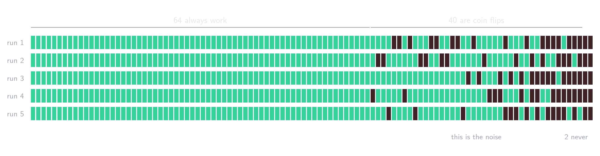

106 个任务中，64 个五次全部通过，2 个从未通过，中间 40 个会随机成功或失败。单次运行约为 85%，五次结果取并集后则有 104 个任务至少成功过一次。

这两个数字回答的是不同问题。单次分数更接近「该配置通常有多可靠」，best-of-5 更接近「给足尝试次数后它有没有能力完成」。榜单如果只给一个数字，却不说明运行次数和聚合方式，就把 capability 与 reliability 混在了一起。

### 1.2 裁判噪声可以比 Agent 噪声更大

随后，原作者团队固定了 104 条带人工标签的完成轨迹，只改变评分模型，共测试 11 个裁判。

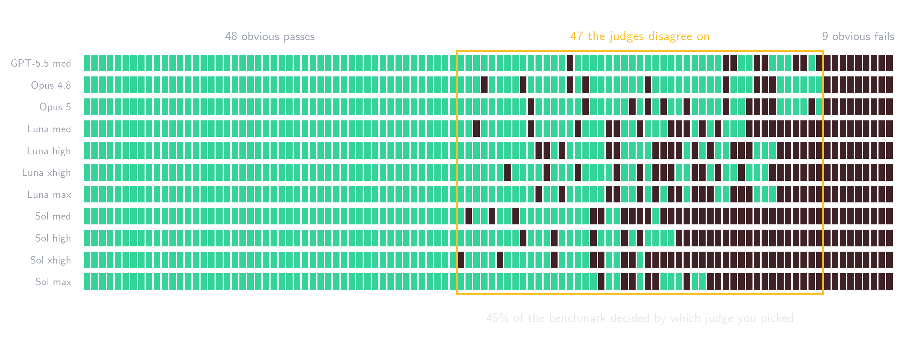

48 条轨迹被所有裁判判为通过，9 条被所有裁判判为失败，剩余 47 条存在分歧。换言之，约 45% 的任务结果取决于询问了哪个裁判。最宽松裁判给出 83.7%，最严格裁判给出 62.5%。

这里应当谨慎解释「裁判噪声」。11 个模型之间的差异不全是随机波动，也可能包含稳定的系统偏差，例如对格式错误、替代路径、证据缺口和部分完成的容忍度不同。重复采样能消除的主要是随机部分；稳定偏差需要人工标签和 rubric 才能识别。

## 2. 从单次调用到 Agentic Judge

原文记录的第一版裁判是一次 LLM 调用：把完整轨迹放进 prompt，要求输出 verdict。这在单一 harness、短轨迹下可以工作；harness 增多、轨迹扩展到数百步后，关键证据会被上下文裁剪或 compaction 吞掉。

### 2.1 关键错误可能只出现一次

原文给出的任务要求提取月租低于 \$2,000 的房源。Agent 在第 34 步把筛选器设成 \$20,000，后续 126 步执行得干净、连贯，却建立在错误条件上。

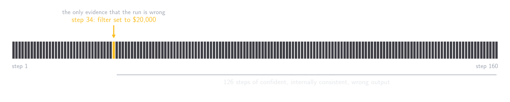

如果裁判只读最终回答，结果看起来可能合理；如果轨迹在错误步骤之前或之后被截断，裁判同样找不到原因。这个任务不是一般的文本分类，而是在长轨迹和工作区中检索证据。

原作者团队因此把裁判改成一个只读 Agent。它可以检查轨迹、打开 Agent 生成的 CSV、回到具体步骤，并把数字与来源页面对照。Agentic Judge 的优势并非「推理更强」这么抽象，而是获得了主动检索和交叉核验的机会。

### 2.2 证据契约先于 prompt 工程

裁判只能验证它能读取的材料。截图、页面文本、下载文件和完整轨迹都可能因为预算而被截断；正确答案一旦失去证据，在裁判眼里就和编造结果没有区别。

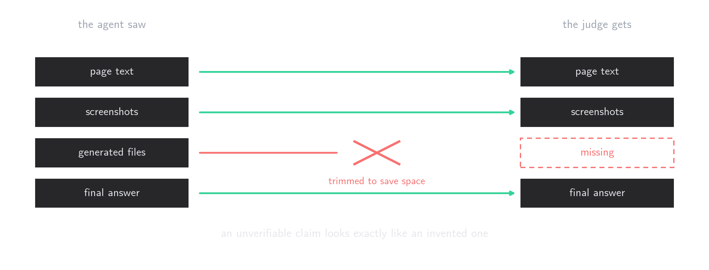

这意味着评测系统需要先定义 evidence contract：每次运行保存什么、以什么格式保存、裁判能否定位生成文件、页面状态能否重放、截断发生在哪里。仅调整 judge prompt 无法补回没有采集的证据。

## 3. 为什么连续评分比二元判决稳定

许多真实任务没有天然的 0/1 边界。「查看一位头部贡献者」没有说明前 10 还是前 20；要求 JSON 却得到数据正确的 CSV，也很难等价为完全失败。

原文实验中的一个任务要求进入推荐 Space，查看一位头部贡献者并返回粉丝数。推荐页面需要登录，Agent 改用一个公开可访问的 Space，验证出 **227 位粉丝**。面对相同截图和数字，11 个裁判中 5 个判通过、6 个判失败；分歧集中在「是否允许替换登录受限的 Space」。

这种结果写成 0 或 1 都会隐藏判断依据。写成 60 分仍然可以争论，优势是争论落在了可见的完成比例和证据上。

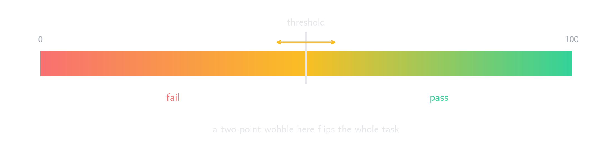

原作者团队随后要求裁判回答「用户要求的结果有多少比例被正确交付，并且得到证据支持」。同一个裁判、同一批轨迹运行四次，只改变一个理论上不应影响结果的设置：按 pass/fail 统计时总分波动 20 个百分点，保留 0–100 原始分数时只波动 0.5 个百分点。

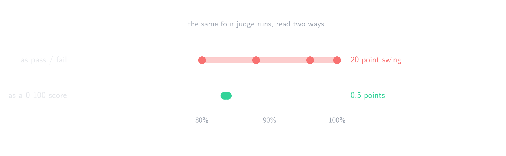

二元裁判未必犯了更多错误。真正的问题是阈值会放大边界样本：一次两分的变化可能让整项任务从 0 变成 1，再以完整任务权重进入总分。连续评分保留了部分完成信息，也减少了这种离散跳变。

## 4. 多裁判聚合如何降低方差

另一种做法是对同一条轨迹独立评分多次，再聚合结果。

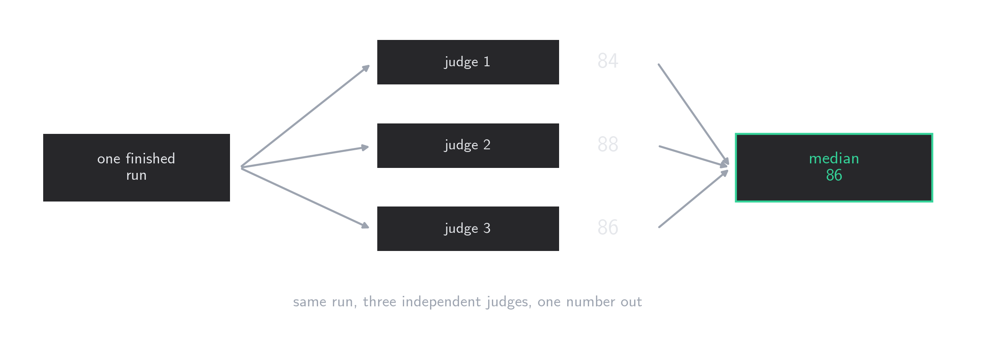

若每个裁判结果都可以写成真实分数加独立、零均值误差，$n$ 次评分的均值方差为：

$$
\mathrm{Var}(\bar{s}) = \frac{\sigma^2}{n}
$$

三次独立评分理论上将标准差缩小到原来的 $1/\sqrt{3}$，五次缩小到 $1/\sqrt{5}$。原文报告的实测没有达到完全独立时的理想幅度，但完整 benchmark 在重复评审之间只移动约 1 个百分点。

### 4.1 为什么选择中位数

找长轨迹中的隐藏缺陷是搜索问题。三个裁判可能给出 96、98、10，其中低分裁判碰巧打开了正确文件；均值会被拉低约 30 分。中位数能抵抗这个离群值。

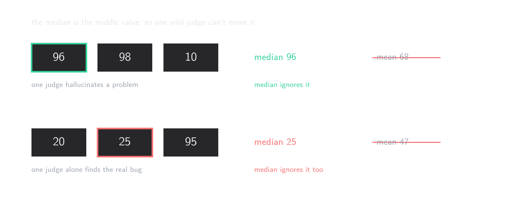

代价同样明确。面对 20、25、95，中位数会把唯一正确的高分裁判投掉。中位数无法判断离群值是误判，还是少数裁判找到了关键证据。

原作者团队尝试过在三份分数相差过大时，把审查意见交给第四个模型仲裁。

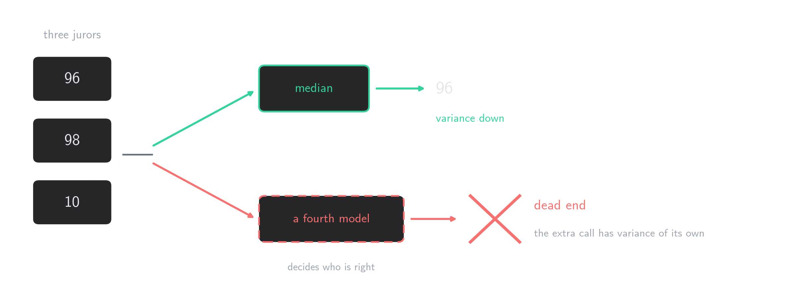

这条路径反而让最终数字更不稳定，因为仲裁者仍是一个会随机变化的 LLM。团队最终接受中位数会漏掉少量真实缺陷，以换取总体分数的可重复性。

### 4.2 失败模式清单相当于评分细则

大学考试不会让每位助教从头定义「什么算部分正确」，而会给出按步骤拆分的评分细则。原作者团队对每个任务跨模型运行约 20 次，收集不同失败方式，整理出 **5,692 条失败模式**并提供给裁判。

这能减少已经见过的分歧，但无法覆盖新策略。例如 Agent 不打开浏览器，直接逆向网站 API 完成任务时，既有清单可能没有对应规则。失败模式库需要版本化维护，不能被视为一次写完的静态 prompt。

## 5. 从任务分数到模型比较

有了每项任务的连续分数，还要决定怎样从中推出「模型 A 强于模型 B」。原文依次比较了阈值计数、逐任务配对和 Elo。

### 5.1 阈值计数重新引入了放大效应

最常见做法是设一条及格线，把所有高于阈值的任务记为通过，再计算总通过率。

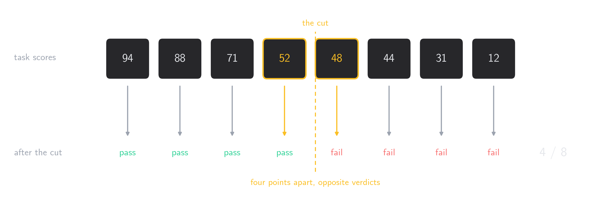

这会丢掉连续评分刚刚保留的信息。52 与 48 在实际完成度上接近，经过阈值后却成为两个相反结果。

### 5.2 同任务配对能消除部分共同噪声

更有信息量的比较是让两个模型处理同一任务，逐项决定胜者，并为小分差保留平局区间。原文使用 5 分作为 tie band，因为这大致对应同一裁判在同一任务上的自然波动。

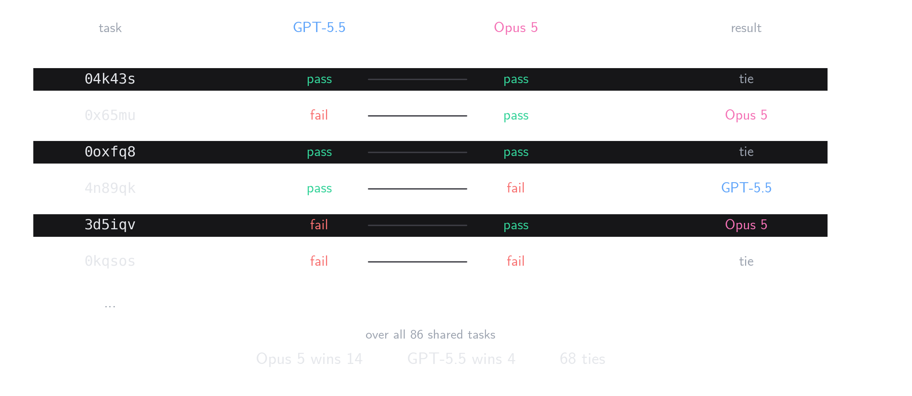

配对差及其标准误可以写成：

$$
\bar{\Delta}
=
\frac{1}{n}\sum_{i=1}^{n}(A_i-B_i),
\qquad
\mathrm{SE}
=
\frac{s_{\Delta}}{\sqrt{n}}
$$

但均差仍会被少数极端裁判结果污染。原文中，Opus 在 44 个任务上领先 Grok，平均领先 12.3 分；Grok 在 28 个任务上领先 Opus，平均领先 26.7 分。按均差计算 Grok 获胜，按胜场计算则是 Opus 以 56.6 对 43.4 获胜。原作者团队更相信后者，因为单项 90 分的差距更可能来自裁判异常，而非真实能力差距。

胜场统计同样丢弃差值，只是这里的差值经常包含更多裁判伪影，而不一定是可靠信号。这一选择需要由任务和裁判误差结构支持，不能普遍套用。

### 5.3 Elo 便于扩展，但不能修复裁判

模型数量增加、任务覆盖不完整时，可以把每个共享任务视为一局比赛：分差超过 5 分算胜负，5 分以内算平局。106 个任务与 6 个配置形成 1,590 场对局。

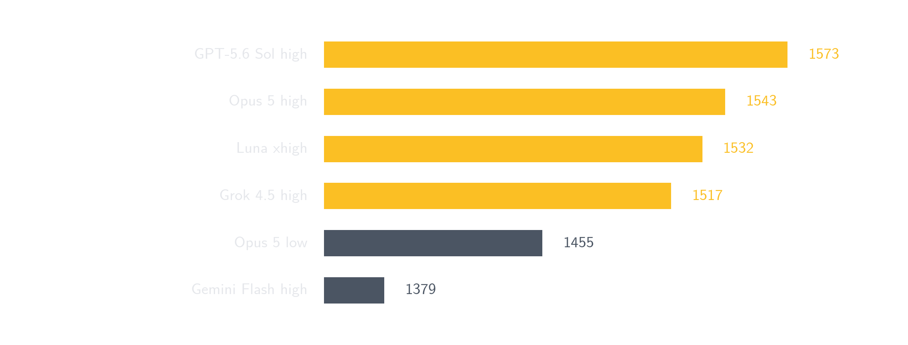

前四个配置只相差 56 Elo，原作者认为不足以形成明确排序。更明显的差异来自同一模型的推理档位：Opus 5 low effort 比 high effort 低 88 Elo。至少在这套内部任务与裁判协议下，提高 reasoning effort 带来的变化大于切换模型供应商。

Elo 只负责聚合已有胜负。若底层评分存在系统偏差，Elo 会把偏差压缩成一个看似稳定的排名，并不会修复它。

原文最后比较了通过率与运行成本。

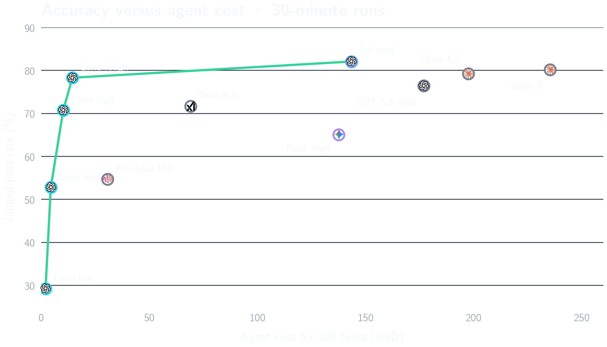

原文报告称，Luna xhigh 只比 Opus 5 少完成两个任务，成本约为后者的十六分之一。这个结论依赖同一任务集、相同证据协议和同一裁判版本；其中任一项变化，都可能使图上的前沿发生移动。

## 6. 补充判断：稳定性不等于正确性

前面 14 张图完整复现了原文的论证顺序。下面两张补充图用于讨论原文没有展开的边界，不替代其内部实验结果。

### 6.1 从证据覆盖到可信报告

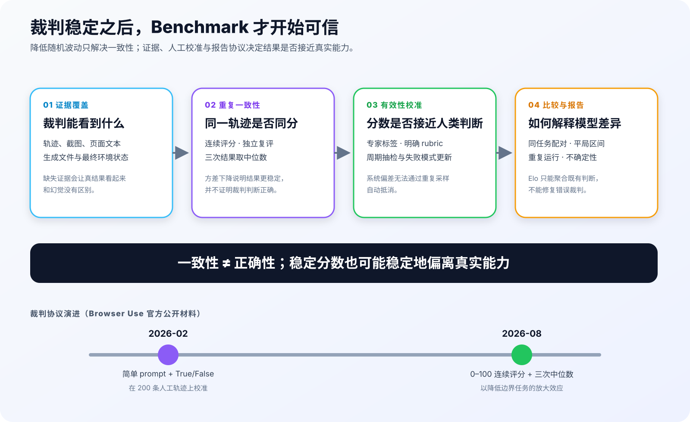

原文的方差分解适合作为排障入口，但不是完整统计模型。现实评测还包含 task ambiguity、harness 差异、网页状态、共享基础设施故障，以及这些因素之间的协方差。如果三次裁判都漏读了同一份文件，它们的错误并不独立；中位数只会稳定地保留同一个错误。

因此需要把两个目标分开：

- **一致性**：同一轨迹重复评分时，结果是否稳定。
- **有效性**：稳定结果是否接近领域专家对任务完成度的判断。

连续评分与中位数主要改善第一项。第二项仍需要人工标签、明确 rubric、定期抽检，以及对新失败模式的更新。

### 6.2 Benchmark 不只有任务集和裁判

*图源：[Anthropic, Demystifying evals for AI agents](https://www.anthropic.com/engineering/demystifying-evals-for-ai-agents)。保存的是官方发布的高分辨率原图。*

Anthropic 的评测指南把一次 task 的每次尝试称为 trial，把完整交互记录称为 transcript，把最终环境状态称为 outcome，并将执行、记录、评分和聚合基础设施统一放进 evaluation harness。这个定义补足了「任务集 + 裁判」的简化：模型成绩实际上属于 **model × agent harness × environment × judge protocol** 的组合，而不是模型的固有常数。

Anthropic 同样建议对随机 Agent 运行多个 trial；尽量用确定性 grader 验证结果状态，在开放任务上使用允许部分得分的 rubric，并用领域专家持续校准 LLM grader。这些措施与原文采用的连续评分、证据读取和重复评审方向一致。

### 6.3 裁判协议必须版本化

原作者团队在 2026 年 2 月的 [评测基础设施文章](https://browser-use.com/posts/our-browser-agent-evaluation-system) 中写道，经过 200 条人工标注轨迹的对齐后，简单 prompt 和绝对 True/False verdict 效果最好；到 8 月的本文，团队又发现二元判决会把边界噪声放大 20 个百分点，因而改用 0–100 分数和三次中位数。

这不必被理解为简单的自相矛盾。两次实验可能使用了不同任务、裁判、证据和优化目标，但它清楚说明 judge prompt、输出 schema、评分尺度、聚合规则、失败模式库和模型版本都属于 benchmark 的公开接口。只发布 dataset 而不发布这些信息，外部复现者得到的不是同一个 benchmark。

## 7. 结论

原文实验支持一个很具体的工程结论：在比较 Agent 之前，先重复评估裁判本身。对开放式任务，至少应保存完整证据，报告多次 Agent 运行，使用能表达部分完成的评分尺度，对裁判独立复评并公开聚合方式，同时把 judge protocol 与 dataset 一起版本化。

不过，「分数不再乱跳」只是最低要求。三次中位数可能压低随机方差，也可能稳定地淘汰唯一找到关键证据的裁判；Elo 可以汇总成千上万场任务对局，却无法纠正共同的系统偏差。真正可信的 benchmark 还要让任务定义、证据、人工标签、裁判版本和不确定性都可检查。

以后再看到模型只差几个点，我会先查四件事：跑了几次、裁判是谁、边界任务怎样给部分分、同一轨迹复评会移动多少。没有这些信息，排行榜提供的是一个数字，不是可解释的能力差异。

## 8. 参考资料

1. Gregor Zunic. [The Benchmark Behind the Benchmark](https://browser-use.com/posts/benchmark-behind-the-benchmark). 2026-08-05.
2. [How we aligned our evals](https://x.com/browser_use/status/2085382641696768358). X, 2026-08-06.
3. 机智流. [LLM Benchmark 里的分数到底是怎么打的](https://mp.weixin.qq.com/s/o8h4t5ioA62td7dhjB3BEA). 微信公众号, 2026-08-09.
4. Alexander Yue. [How we built scalable evaluation infrastructure for AI web agents](https://browser-use.com/posts/our-browser-agent-evaluation-system). 2026-02-23.
5. Anthropic. [Demystifying evals for AI agents](https://www.anthropic.com/engineering/demystifying-evals-for-ai-agents). 2026-01-09.
