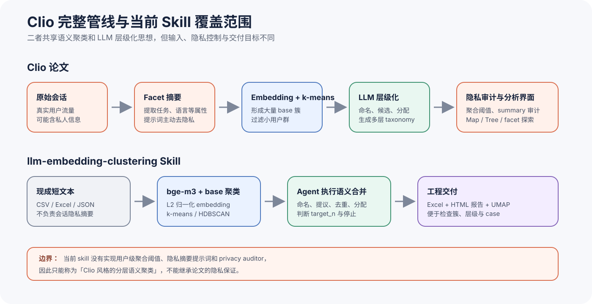
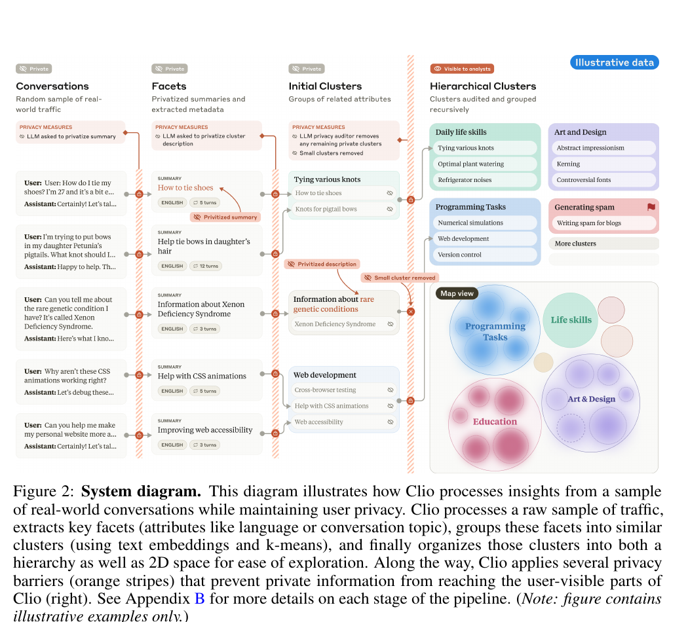
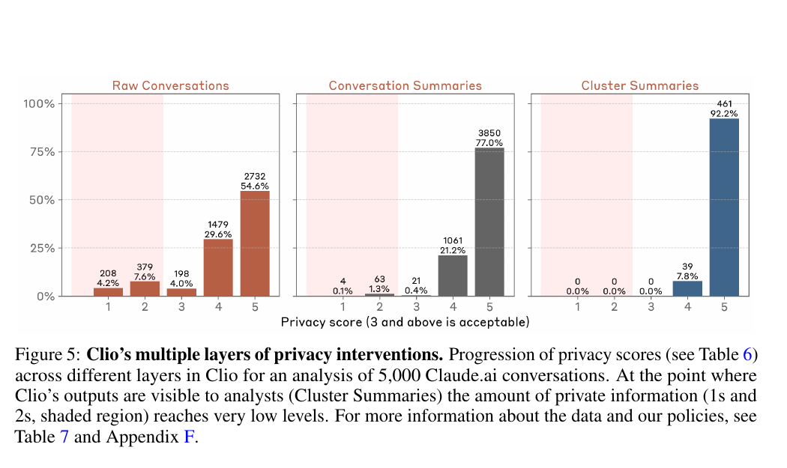
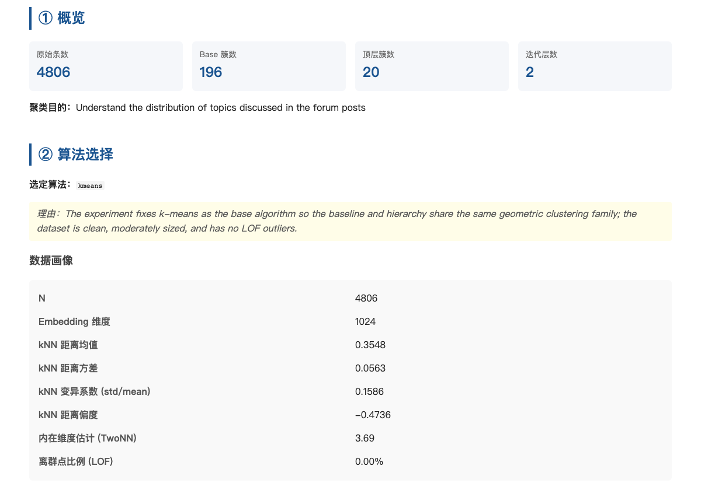
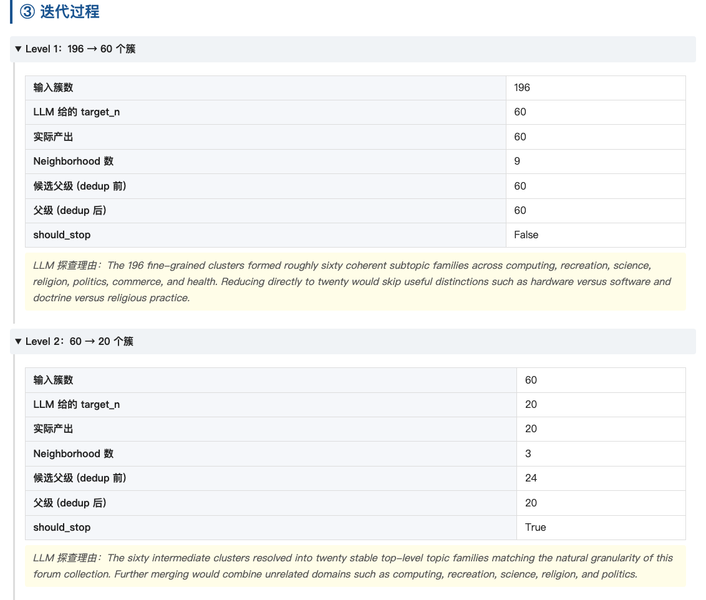
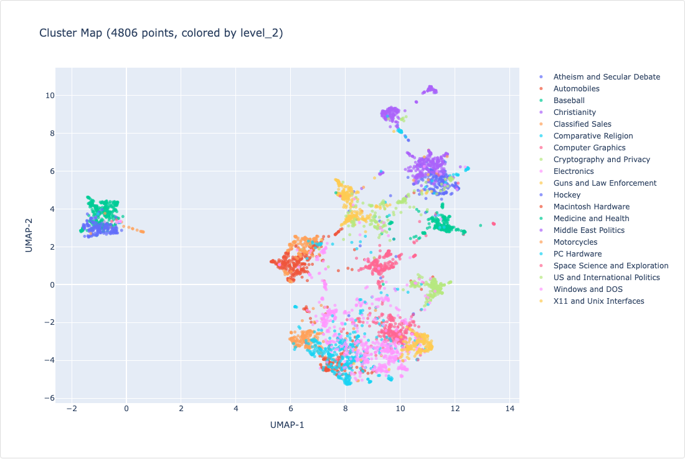
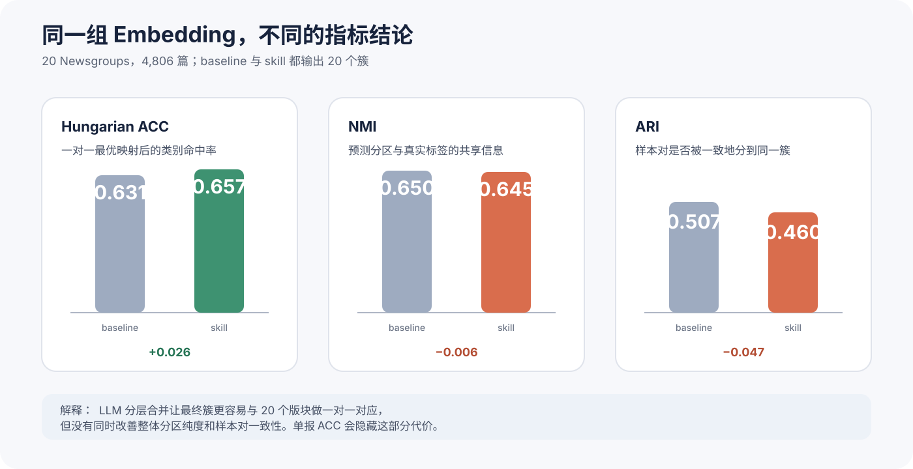
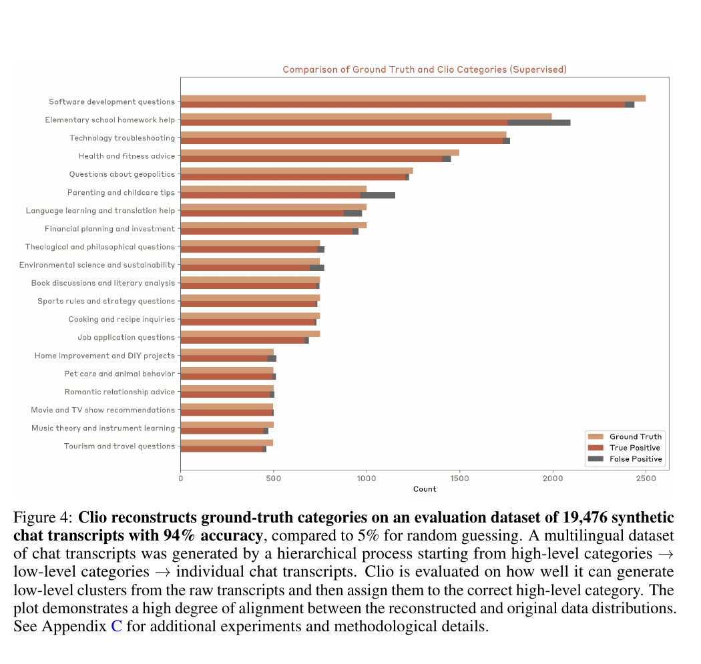

短文本聚类很容易做成半成品：embedding 跑完，k-means 给出 `cluster_0`、`cluster_1`，真正费人的工作却刚开始。$K$ 取多少？每个簇在谈什么？细粒度主题怎样合并？什么时候停？结果又怎样交给人检查？

一个自然的想法，是把全部文本一次性交给 LLM，让它直接分组、起名、画出 taxonomy。几十条数据时，这条路看起来更省事；到几千条以后，上下文长度、调用成本、顺序敏感和覆盖率会一起变成问题。模型可能把前半段分得很细，后半段却塞进几个宽泛父类；长尾样本是否被遗漏，也缺少一张明确的 assignment 表可以追查。

我最终采用的分工很简单：embedding 负责大规模、可缓存的局部相似度，LLM 只在数量受控的簇表示上处理命名、边界和父级合并。[*Clio: Privacy-Preserving Insights into Real-World AI Use*](https://arxiv.org/abs/2412.13678) 给出了这套分工的完整系统版本。我的工作则更窄：把论文的聚类子系统整理成 [llm-embedding-clustering](https://github.com/BrenchCC/cilo-llm-embedding-clustering) Agent Skill，再用 20 Newsgroups 做一次有标签复现。

先把结论说清楚。这次复现得到的不是「LLM 分层聚类全面优于 k-means」。同一组 bge-m3 embedding 上，skill 的 Hungarian ACC 从 0.631 升到 0.657，但 NMI 从 0.650 降到 0.645，ARI 从 0.507 降到 0.460。LLM 合并让最终 20 个簇更容易与 20 个论坛版块一一对应，同时损失了一部分整体分区信息和样本对一致性。这两个方向都是真的。

还有一条更重要的边界：我复现的是 **Clio 的语义聚类子系统**，不是完整 Clio。当前 skill 没有实现用户级聚合阈值、隐私摘要提示词和 privacy auditor，输出报告还允许浏览原始 case。把它称为「Clio 风格分层聚类」是准确的；宣称它继承了论文的隐私保证则没有依据。



## 1. Clio 把这套分工放进隐私分析系统

能接触真实使用数据，不等于可以随意分析。对话可能包含身份、健康、工作和商业信息，人工审阅会反复暴露这些内容；每天产生的消息也远超人工归纳能力。

Clio 的目标是从海量对话中提取聚合模式，同时阻止单条会话和小群体信息进入分析结果。论文把过程拆成几段：抽取 facet，将摘要变成 embedding，用 k-means 形成大量初始簇，让 Claude 生成簇名与描述，再递归构建 hierarchy，最后通过 Map View 和 Tree View 探索结果。



*图源：Clio 论文 Figure 2。截图保留原始 Figure 编号和 caption。*

这里有两个容易被简化掉的设计。

第一，Clio 聚类的不是任意原始文本，而是 facet summary。摘要提示词决定 embedding 空间保留什么信息。询问「用户请求完成什么任务」会得到任务 taxonomy；询问「对话采用什么语言」会得到另一种分布。同一份会话可以拥有多个 facet，因此分析者能够查看任务与语言、轮数或时间的交叉分布。聚类目标并不是运行前的一句装饰性说明，它决定输入表示。

第二，论文并未把 k-means 当作对现实的离散本体论。作者明确指出，conversation types 更像连续流形，k-means 只是高效找到局部 neighborhood 的工具。$k$ 可以达到数千，base cluster 负责提供可管理的细粒度单元，最终的可读 taxonomy 由后续 LLM 层级化完成。

论文 Appendix G.7 的 hierarchizer 也比「让 LLM 把簇归类」更具体。每一层先对 cluster name 和 description 做 embedding，再按平均约 40 个簇切 neighborhood；Claude 结合邻域内簇与边界外近邻提出父级候选，随后统一去重，把每个子簇分配给最合适的父簇，并根据实际 children 重新命名。父级不是一次生成后就冻结的标签，它要在 assignment 完成后接受内容校正。

## 2. 隐私不是聚类自然附带的性质

Clio 的 Figure 2 容易让人把隐私措施看成几条橙色装饰线，Figure 5 才显示它们各自承担什么工作。论文在 5,000 条 Claude.ai 对话上用自动 auditor 比较原始会话、会话摘要和簇摘要的 privacy score。原始数据约 10% 落在不可接受的 1–2 分；分析者可见的 cluster summaries 中，1–3 分均为 0，92.2% 得到 5 分。



*图源：Clio 论文 Figure 5。截图保留原始 Figure 编号和 caption。*

这个结果来自四层干预共同作用：

1. 会话摘要提示词要求只回答 facet 问题并省略私人信息。
2. 一个簇必须同时满足最小独立账号数和最小会话数，否则被删除。
3. 生成 cluster summary 时再次要求排除私人信息。
4. privacy auditor 检查 name 和 description，移除仍可能指向个人或小组织的簇。

这些措施属于 Clio 的系统定义，不是 embedding、k-means 或 LLM 命名自动产生的效果。当前 skill 接受现成短文本，既不知道一条数据来自哪个用户，也没有独立用户计数。HTML 报告为了调试还会在每个顶层簇下显示原始 case，UMAP hover 同样包含原文。这种设计适合公开数据、已脱敏数据或数据所有者授权的内部分析；面对真实私密会话时，它恰好缺少 Clio 最核心的保护层。

聚类完成后再删人名也补不上这层缺口。一个没有显式姓名的稀有描述，仍可能通过地点、职业、疾病和时间组合指向少数人；一个规模很大的簇，也可能由同一个账号反复提交相似内容形成。Clio 同时约束 unique accounts 和 conversations，正是为了区分「很多记录」与「很多独立用户」。因此隐私评估必须读取数据来源与聚合过程，而不能只对最终簇名做正则脱敏。

因此我只保留论文的聚类思想，没有把尚未实现的隐私性质写成默认能力。

## 3. 把论文方法改造成可执行 Skill

论文提供了方法，但没有提供一个面向任意本地文件的开箱工作流。我希望用户在 coding agent 中提出「把这批 query 做分层主题聚类」后，Agent 能把数据读取、脚本运行、语义判断和结果交付串起来。skill 将过程拆成确定性脚本与 Agent 决策两部分，并用 `state/` 下的 JSON 文件接力。

复现实验运行在 commit `683cdf4`；写作时远端 `main` 已更新到 `890b66a`。两版的聚类算法与语义决策流程相同，因此本文的指标、耗时和 `196 → 60 → 20` 层级仍对应当前方法；后续提交调整的是运行约束，不应被解释为算法效果变化。

### 3.1 输入表示与 base clustering

skill 输入 CSV、Excel 或 JSON 中的一列短文本，默认使用 `BAAI/bge-m3`。所有向量做 L2 归一化，因为后续 kNN profile、cosine silhouette 和层级 neighborhood 都依赖方向相似度；如果在线 API 返回未归一化向量，向量长度会污染距离。

数据准备阶段除了保存 embedding，还计算 10-NN 距离统计、TwoNN 内在维度和 LOF 离群比例。Agent 根据这些画像与用户给出的聚类目标选择 base 算法。常规、规模适中的稠密数据优先 k-means；存在明显噪声和不规则密度时可以选择 HDBSCAN。对 k-means，流程围绕经验值 $\sqrt{8N}$ 测试 0.7、1.0 和 1.3 三档 $K$，以 cosine silhouette 选 base 数量。

该策略并不保证找到全局最优 $K$。它的作用是避免 Agent 凭感觉随手填一个数，同时保留足够多的 base 簇给上层语义合并。如果一开始就直接设为目标顶层数，整个流程会退化成「一次 k-means + LLM 起名」，hierarchizer 没有发挥空间。

### 3.2 Agent 接管无法写死的语义决策

base clustering 完成后，每个簇最多抽取 50 条样本交给 Agent 生成 name 和 description。后续每层先对这些描述重新做 embedding，再把簇切成平均约 20 个一组的 neighborhood，并加入 10 个外部近邻。论文采用约 40 个内部簇；skill 将上下文规模减半，以控制 coding agent 的 token 消耗。

Agent 依次处理五类判断：

- 根据当前簇样本、目标顶层粒度和用户目标决定 `target_n` 与 `should_stop`。
- 为每个 neighborhood 提出父级候选。
- 跨 neighborhood 去重，同时保持覆盖率。
- 将每个子簇分配给打乱顺序后的父级列表，降低位置偏差。
- 根据真实收到的 children 重写父簇名称和描述。

skill 强制至少完成两层，最多六层。下限防止第一次 probe 就草率停止，上限避免不稳定的语义循环无限延长。用户的聚类目的必须在运行前明确，因为「看内容主题」「发现风险行为」「做推荐标签」会让同一批文本形成不同命名和合并方向。

### 3.3 JSON 状态比一段超长提示词更可复核

整个过程并不要求 Agent 在上下文里记住所有簇。运行状态按阶段保存：第一份记录数据画像和算法选择，第二份记录初始簇，后续每层分别记录 neighborhood、candidate、parent、assignment 和 final。确定性计算负责向量与数据转换，Agent 只写回当前语义决策。

这种拆分没有消除模型随机性，但它留下了检查点。某个父簇命名异常时，我可以回到该层的 children 与 assignment，而不是重新阅读整段对话日志。相同 embedding 还能被缓存，调 prompt 或重跑层级时不必再次支付最昂贵的向量计算。

最终阶段输出 `result.xlsx` 和六部分 `report.html`。Excel 保存层级表、原始项到叶簇的映射及统计；HTML 展示数据画像、算法理由、每层决策、最终树、UMAP 和 case 浏览。这里的「可解释」不是给每次 k-means assignment 生成因果理由，而是让主题名称、父子关系、规模和代表 case 可以被人工核查。

### 3.4 Base clustering 压缩了什么，也丢掉了什么

这套分工能够扩展，关键不在 LLM 读得更快，而在 base clustering 先改变了问题规模。4,806 篇原文被压成 196 个局部单元，Agent 看到的是每簇样本、名称和描述；进入上层后，它只处理 196 个 cluster representation，不再从头阅读全部帖子。每条原文仍有明确的 base assignment，因此长尾主题和异常归属可以沿状态链追查。

压缩也会丢信息。base assignment 一旦错误，上层只能在已有单元之间重新组合，不能把某条文档从 base cluster 中拆出来。换句话说，LLM 可以重新解释簇与簇的关系，却不能撤销底层已经绑定的样本。这个限制后来直接出现在指标中：层级合并修复了若干类别级对应，却没有全面修复 NMI 和 ARI。

## 4. Skill 调用

安装使用通用 Agent Skills CLI：

```bash
npx skills add brenchcc/cilo-llm-embedding-clustering
```

安装后不需要记内部命令。我通常只向 coding agent 说明文件、文本列、聚类目的和 embedding 模型：

> 使用 `llm-embedding-clustering` skill，对 `data.xlsx` 的 `text` 列做分层主题聚类。目的是看内容主题分布，embedding 使用 `BAAI/bge-m3`。

如果只说「帮我把这批 query 做主题聚类」，Agent 仍需确认数据位置和聚类目的。目的不能省略：同一批客服 query，以内容分布、风险发现或推荐标签为目标，会得到不同的命名与合并边界。其余运行细节交给 Skill 处理即可。

## 5. 用 20 Newsgroups 跑一遍

实验数据来自本地 20 Newsgroups 文件。解析得到 37,656 条带边界记录，去重后剩 18,828 篇，说明源文件包含一份完整重复副本。随后按类别分层，以 seed 42 抽取 4,806 篇，覆盖全部 20 个版块。样本 SHA-256 为 `014abaeb1606f18fec3caea58b010463a79f00a0251f2d06619aae34a4894cf2`。

数据准备时，11 篇文档含 21 个 Excel 禁止控制字符。清理前后 bge-m3 token 序列完全一致，因此修复只保证表格可写，没有改变 embedding 输入。



实验目标是识别论坛帖子讨论的内容主题。baseline 与 skill 复用完全相同的 1024 维 bge-m3 embedding，避免把表示模型差异误算成层级算法收益：

| 设置 | Baseline | Skill |
| --- | --- | --- |
| Base 算法 | k-means | k-means |
| 顶层簇数 | 20 | 20 |
| 层级 | 单层 | 196 → 60 → 20 |
| 随机设置 | `random_state = 42`, `n_init = 10` | base k-means 固定 seed，语义步骤保留本次 Agent 决策 |
| 输入向量 | 同一份 L2-normalized bge-m3 embedding | 同左 |

base 候选数分别为 137、196 和 254，对应 cosine silhouette 为 0.0423、0.0449 和 0.0383，因此选择 196。三个分数都不高，这与论文对连续语义流形的描述一致：数据没有天然分成 196 个彼此隔绝的球状簇。此处 silhouette 用于三档候选间选择，不能被读成「聚类结构很强」。

embedding 用时 39 分 11 秒，分层聚类用时 11 分 27 秒，端到端 50 分 38 秒。约 77% 的时间花在 embedding 上，所以调整层级 prompt 时复用向量缓存很重要。

## 6. 两轮合并：`196 → 60 → 20`

这三个数字看起来像一组预先写好的超参数，实际只有 196 来自 silhouette 候选比较；60 和 20 都是 Agent 根据当前层的语义覆盖、目标粒度和停止条件给出的决策。逐层状态之所以重要，就在于它能把“模型觉得应该这样合并”还原成候选数、assignment 和停止理由。

Level 1 把 196 个 base cluster 分为 9 个 neighborhood。Agent 判断这些细粒度簇可以整理为约 60 个子主题家族，理由是计算机、娱乐、科学、宗教、政治、交易和健康内部仍存在有用区分，直接压到 20 会过早合并。60 个候选跨 neighborhood 去重后仍为 60 个，`should_stop` 为 false。

Level 2 面对 60 个中间簇，切出 3 个 neighborhood，提出 24 个候选，统一去重为 20 个父簇。Agent 此时返回 `should_stop = true`，认为继续合并会把 computing、recreation、science、religion 和 politics 等不同领域放到一起。



最终名称包括 `PC Hardware`、`Windows and DOS`、`Computer Graphics`、`Motorcycles`、`Baseball`、`Medicine and Health`、`Space Science and Exploration`、`Christianity` 和 `Middle East Politics`。它们确实接近 20 Newsgroups 的人工版块，但不是逐字恢复标签。比如 `Guns and Law Enforcement` 同时接收 gun policy、crime enforcement 和 Waco 相关子簇；`US and International Politics` 又容纳美国社会政策与战争、人权内容。语义上说得通，不代表与 benchmark 标签边界完全一致。



UMAP 能帮助发现局部混合和孤立区域，但不能替代聚类指标。skill 使用 `n_neighbors = 15`、`min_dist = 0.1` 和 cosine metric，把 1024 维向量压成二维；论文 projector 的 `min_dist` 为 0。不同投影参数会改变点云外观，二维图上看起来分开的岛也不等于高维空间中存在可靠决策边界。

## 7. 结果没有全面变好

读到这里，很容易期待 LLM 层级化会在各项指标上同时获胜。实际结果没有这么整齐：ACC 上升，NMI 和 ARI 却下降。这个不一致恰好是本次复现最值得保留的结果。



| 方法 | NMI | ARI | Hungarian ACC | 簇数 |
| --- | ---: | ---: | ---: | ---: |
| k-means baseline | 0.650 | 0.507 | 0.631 | 20 |
| 分层 skill | 0.645 | 0.460 | 0.657 | 20 |
| skill − baseline | −0.006 | −0.047 | +0.026 | — |

Hungarian ACC 先在预测簇和真实类别之间寻找一对一最优映射，再统计命中。skill 在语义合并时主动追求可读、互异的顶层主题，容易形成能够与 20 个版块配对的簇，因此该指标上升并不意外。

NMI 关注预测分区与真实标签共享多少信息，不要求一对一命名；ARI 则从样本对出发，检查真实同类和异类是否仍被一致地放在一起。两项下降说明：为了得到更清晰的 20 个父级标签，某些原本在 embedding 空间中相对纯净的局部簇被语义父类重新组合，增加了跨真实类别的合并或同类拆散。

类别 recall 能看到变化发生在哪里。`comp.os.ms-windows.misc` 从 0.131 升到 0.709，`talk.politics.guns` 从 0.418 升到 0.828，`alt.atheism` 从 0.137 升到 0.534，`comp.sys.ibm.pc.hardware` 从 0.271 升到 0.602。对这些类别，细粒度 base 簇经过命名和合并后更容易落进稳定父级。

代价同样集中。`rec.sport.hockey` 从 0.929 降到 0.643，`soc.religion.christian` 从 0.902 降到 0.624，`rec.motorcycles` 从 0.748 降到 0.504，`misc.forsale` 从 0.802 降到 0.657。baseline 已经能依靠词汇和局部几何很好地分出 hockey 与 Christianity；LLM 层级化把部分边界重新解释后，反而破坏了这些强簇。

`talk.religion.misc` 在两种方法下 recall 都是 0。它的 support 只有 160，内容又与 atheism、Christianity 和 politics 交叠，一对一 Hungarian matching 也可能把对应位置让给规模更大、边界更清晰的类别。这个 0 不等于所有帖子都毫无语义关联，而是说明 20 个无监督簇中没有一个被最优匹配为该版块。

所以我不会把 +0.026 ACC 单独写成「效果提升」。更准确的表述是：LLM 层级合并改变了误差分布，修复若干弱类别的一对一对应，同时损伤若干原本强类别，最终在 ACC 上获益、在 NMI 与 ARI 上付出代价。实际项目需要先确定目标究竟是 taxonomy 可读性、标签对齐，还是稳定的几何分区。

这组对比还需要一条公平性说明。baseline 只运行一次 $K=20$ k-means，skill 则从 196 个 base 簇开始并消耗多轮 Agent 推理；两者共享表示和顶层簇数，却不共享计算预算。实验隔离的是「直接几何分区」与「细粒度几何分区后再做语义合并」的差异，不是同成本算法竞赛。若部署目标把时延和 LLM token 纳入约束，+0.026 ACC 是否值得约 11 分钟额外层级处理，需要单独做效用评估。

## 8. 为什么不能拿本次 0.657 对比论文的 94%

Clio Figure 4 报告在 19,476 条 synthetic regular conversations、20 个高层类别上的 94% reconstruction accuracy。数字比本实验高很多，但任务设置并不相同。



*图源：Clio 论文 Figure 4。截图保留原始 Figure 编号和 caption。*

论文的 quantitative reconstruction 先无监督生成 base clusters，然后 **固定已知的 20 个顶层 ground-truth categories**，让 Clio 执行 hierarchizer 中的 assignment step，把 base cluster 分配给这些现成类别。换句话说，顶层标签集合已经提供给系统，评估的是摘要、base clustering 与 assignment 能否恢复原始类别分布。

本次实验没有把 20 Newsgroups 标签交给 Agent。`PC Hardware`、`Windows and DOS` 等 20 个父级由 Agent 根据 base cluster 自己提出、去重和重命名，最后才用 Hungarian algorithm 对齐真实标签。这更接近论文后面的 unsupervised reconstruction，而论文对该部分主要给出 confusion matrix 和定性分析，没有报告一个可直接比较的总体 accuracy。

数据也不同。论文 synthetic set 由预先定义的高层类别逐级生成子类别和会话，类别分布与层级结构具有生成时的先验；20 Newsgroups 是自然论坛文本，单篇帖子经常同时包含引用、政治立场、宗教争论和技术细节。把 94% 与 0.657 并排得出「复现失败」或「模型能力下降」都不成立。

## 9. 什么时候值得用

这组负结果反而让使用边界更清楚。层级化首先优化的是可浏览、可命名、可复核的 taxonomy；它可能改善外部标签对齐，却没有承诺保留每一个几何邻域。是否值得增加 LLM 阶段，取决于使用者真正需要哪一种结果。

我会在以下条件下使用该 skill：输入已经是短文本；目标是发现主题并交给人浏览；几何聚类只能给出分堆，业务需要多级 taxonomy；数据规模允许多轮 LLM 命名和 assignment；数据公开、已脱敏，或运行环境与访问权限经过数据所有者确认。

有几类任务不适合直接套用。长文档应先设计摘要 facet，否则 embedding 会把结构和细节混在一起。只需要稳定的向量分组时，直接使用 k-means 或 HDBSCAN 更便宜，也更容易重复。要求严格标签分类时，应构造监督训练和 held-out evaluation，而不是把无监督 taxonomy 当分类器。涉及真实私密会话时，必须补齐用户级聚合、隐私摘要、输出审计、访问控制和数据保留策略；隐藏报告中的 case 列表远远不够。

本次实验也只覆盖一个固定样本、一个 seed 和一组 Agent 决策。层级 prompt、Agent 模型或候选顺序变化，都可能改变父级集合。下一轮我会优先做六项检查：

停止判断尤其需要单独审计。本次在 20 个父簇停止，恰好与已知 benchmark 类别数一致；这让结果便于评估，也可能让目标数量成为 Agent 的锚点。在未知真实数据上，我不能预先假设 taxonomy 应有多少顶层主题。更稳妥的做法是保存每轮候选数、合并理由和未被采用的父簇，让不知道真实标签的复评者独立判断是否继续，并同时检查父簇内部语义一致性。否则，`196 → 60 → 20` 可能只是很好地服从了目标，而未必是数据自然支持的唯一层级。

1. 对数据抽样和 k-means 使用多个 seed，报告均值、标准差和类别级波动。
2. 用不同 Agent 模型重复 propose、dedup、assign 与 rename，测量 taxonomy 稳定性。
3. 固定 20 个顶层类别，增加与论文 supervised reconstruction 更接近的受控实验。
4. 对 `196 → 60 → 20` 做层数与中间簇数消融，确认收益来自哪一步。
5. 改写聚类目标，比较内容主题、风险发现和推荐标签对同一 embedding 的影响。
6. 若进入私有数据，先实现 unique-user threshold、privacy-aware summary 与独立 auditor，再讨论隐私效果。

## 10. 结论：先看分工，再看指标

这次工程化最有用的认识不是「LLM 可以做聚类」，而是 embedding 和 LLM 应该承担不同职责。embedding 适合大规模、可缓存的局部相似度计算；LLM 适合读取有限数量的簇描述，提出可读父级并处理难以写成固定规则的语义边界。JSON 状态把两者接成一条可以暂停、检查和重跑的流程。

20 Newsgroups 实验也给了一个克制的结果。`196 → 60 → 20` 的层级确实生成了可读 taxonomy，并把 Hungarian ACC 提高 2.6 个百分点；但 NMI 和 ARI 的下降表明，可读父级不是免费的。LLM 修正了一些 k-means 的几何边界，也重新解释坏了另一些已经很纯的簇。

这套交换只在分析者需要可浏览主题地图时值得；若目标是最大化分区一致性，不能只看名称是否合理。可靠性要靠可检查的中间状态、跨运行稳定性和完整指标证明。隐私边界更明确：处理用户数据前，必须补齐用户级聚合阈值、隐私摘要和独立审计，当前实现不能借用 Clio 的隐私结论。

## 参考资料

1. Alex Tamkin et al. [Clio: Privacy-Preserving Insights into Real-World AI Use](https://arxiv.org/abs/2412.13678). 2024.
2. BrenchCC. [cilo-llm-embedding-clustering](https://github.com/BrenchCC/cilo-llm-embedding-clustering), experiment commit `683cdf4` and usage-documentation commit `890b66a`. 2026-08-13.
3. BAAI. [BAAI/bge-m3](https://huggingface.co/BAAI/bge-m3).
