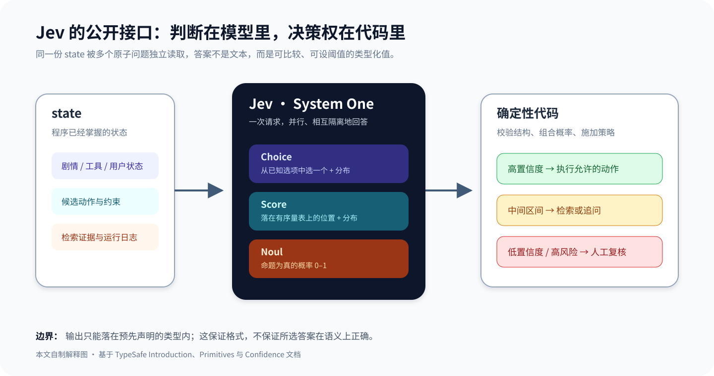
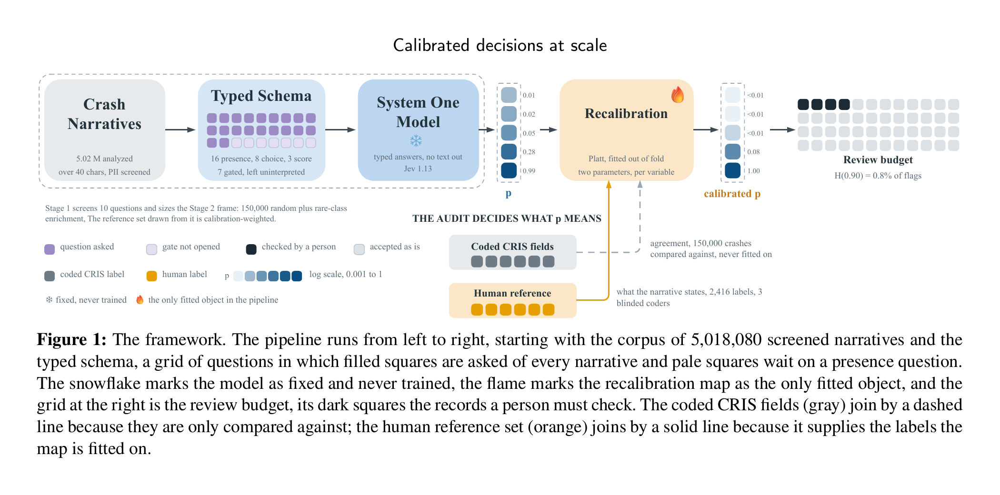
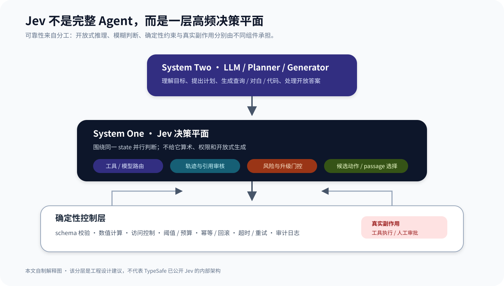
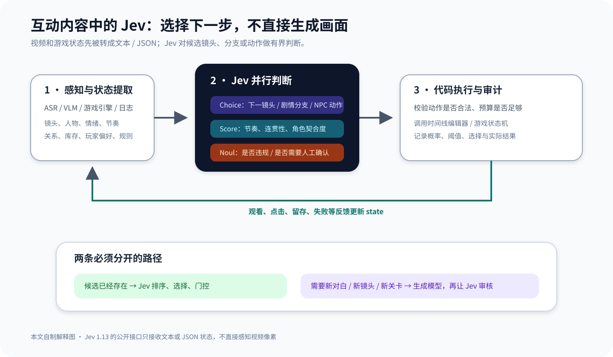
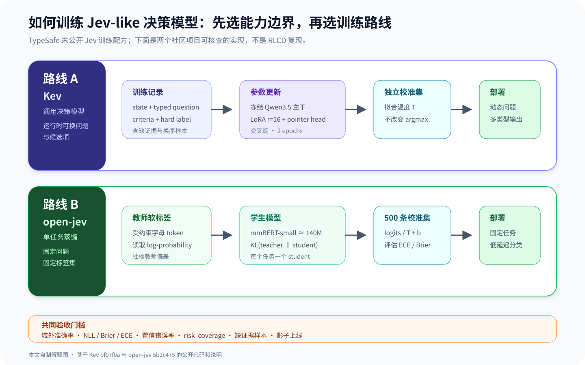
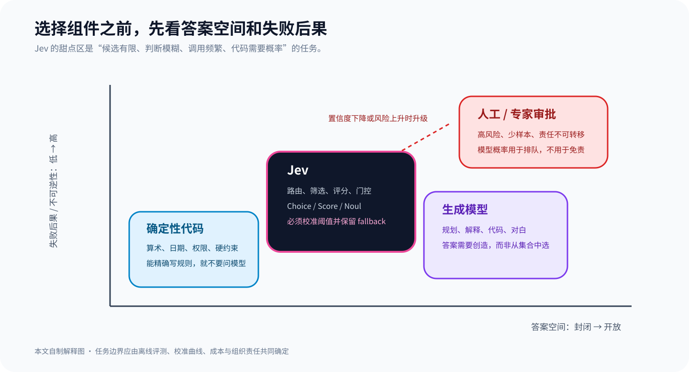

Jev 可以用一句话概括：**给它程序状态和一组答案范围预先确定的问题，它返回概率化的类型值，不返回一段文字。**

这句话看起来只是把 LLM 的结构化输出做得更彻底，实际变化发生在软件边界。调用方不再要求模型先写 JSON，再解析、校验和修复；它直接收到 Choice、Score 或 Noul，可以在普通代码里比较概率、设置阈值、排序候选并决定是否交给人工。TypeSafe 因此把 Jev 称为第一个公开的 System One model，强调快速、有边界的判断，而不是慢速、开放式的推理与生成。

这也是 Jev 在发布后迅速引起 Agent 开发者关注的原因。Agent 每次运行都要做大量细碎决定：该调用哪个工具，哪条检索结果值得进入上下文，这次工具轨迹是否异常，下一步应执行、追问还是升级。用通用推理模型处理每个判断，能力足够，但延迟和成本很难支撑高频循环。Jev 给出的答案很窄，却正好落在这批「智能 if 语句」上。

::: {.callout-warning title="证据范围"}
TypeSafe 于 2026 年 9 月 15 日发布 Jev，当前公开文档对应 `jev-1.13`。公司说明它采用新架构、parallel sampler 和 Reinforcement Learning for Calibrated Decisions（RLCD），但没有公开权重、参数量、网络结构、训练数据或 RLCD 的算法细节。本文能解释的是公开接口、系统分工和已披露评测，不能从产品接口反推出模型内部实现。本文也没有调用付费 API；文中的性能数字来自注明的官方评测或独立研究。
:::

## 1. Jev 改变的不是 JSON 格式，而是模型承担的任务

通用 LLM 的基本动作是预测下一个 token。即使调用 JSON Schema 或 function calling，模型仍在生成一个字符串序列，只是服务端约束了可接受的形状。Jev 的公开接口不提供文本生成：输入是 `state` 与 `questions`，输出直接是问题对应的类型值和概率分布。[官方 Introduction](https://docs.typesafe.ai/introduction) 把它描述成「unstructured state in, typed probabilistic decisions out」。

这里的 `state` 是程序已经掌握的上下文，可以是一段文本，也可以是 JSON：用户请求、账户状态、工具日志、候选动作、策略约束都能放进去。问题必须足够原子化，让了解上下文的人能快速作出判断。复杂目标要拆成多个独立问题，权重、依赖、阈值和副作用继续留在代码里。

{width="94%" fig-align="center"}

_图 1：本文自制解释图。Jev 对同一份 state 并行回答类型化问题，确定性代码负责组合概率、施加业务策略并决定自动执行或人工复核。该图解释公开接口，不表示 Jev 的内部神经网络结构。_

### 1.1 三种原语

[Primitives 文档](https://docs.typesafe.ai/primitives)定义了三类问题：

| 原语 | 要回答的问题 | 主要返回值 | 典型用途 |
| --- | --- | --- | --- |
| Choice | 已知选项中哪个最合适 | `choice`、各选项 `probabilities`、`confidence` | 工具、路由、候选动作选择 |
| Score | 状态落在有序量表的什么位置 | 连续 `score`、量表 `legend`、分布与 `confidence` | 严重性、质量、节奏、匹配度 |
| Noul | 某个命题是否成立 | 命题为真的概率 `noul` | 风险门控、是否升级、是否相关 |

Choice 的概率分布回答相对选择：几个候选里谁最合适。Noul 回答绝对命题：某件事成立的概率是多少。这两种写法不能随意互换。官方的 [Jev 1.13 jaggedness](https://docs.typesafe.ai/model-jaggedness/jev-1.13) 给出过一个反例：同一语义分别写成 Noul 和 yes/no Choice，概率并不保持简单对应；一个命题与其否定分别提问，两个概率也不保证相加等于 1。代码不能把一种原语上调好的阈值直接搬到另一种原语。

对于 Choice 和 Score，`confidence` 是从完整概率分布压缩出的集中程度，不是「答案正确率」的同义词。Noul 没有单独的 confidence，因为它自身已经是一维概率。一个常见门控可以写成：

$$
a^* = \arg\max_{a \in \mathcal{A}} p(a \mid s, q),
$$

$$
\mathrm{route}(c) =
\begin{cases}
\text{execute}, & c \ge \tau_{\mathrm{high}}, \\
\text{retrieve or clarify}, & \tau_{\mathrm{low}} \le c \lt \tau_{\mathrm{high}}, \\
\text{human review}, & c \lt \tau_{\mathrm{low}}.
\end{cases}
$$

阈值不是模型替业务决定的常数。它要根据误判成本、离线标注、概率校准和人工处理能力设定；高风险动作还应单独加入权限与审批规则。

### 1.2 多个问题为什么适合并行

同一次请求中的问题共享 state，但官方文档规定它们相互隔离，一个问题的答案不会成为另一个问题的隐藏上下文。这样可以把一项复合判断拆成若干原子判断，再由代码组合。例如 Agent 处理工具轨迹时，可以同时询问「是否偏离目标」「引用是否支持结论」「是否包含敏感信息」「是否需要人工查看」，而不是让模型写一篇总评。

当后一个问题真正依赖前一个答案时，仍需要第二次请求。例如第一轮从 182 个技能中选出候选，代码读取候选详情后，第二轮才能判断是否真的应该建议其中一个。这里的顺序由可用信息决定，不是把所有控制流重新塞回 prompt。

{width="98%" fig-align="center"}

_图 2：TypeSafe 公布的安全事件 workflow。模型先读取告警、证据强度和环境状态，代码再把多个 Bool、Score、Choice 结果组合成关闭、排队、隔离或紧急升级动作。来源：[Introducing System One Models & Jev](https://typesafe.ai/blog/introducing-system-one-models-and-jev)。这是厂商示例，不是本文复现。_

## 2. 它与结构化输出、小模型和分类器有什么区别

Jev 不是「所有分类器的替代品」，也不能因为不写文字就自动获得可靠性。更合适的比较对象有四类：

| 方案 | 答案空间 | 推理方式与接口 | 适合场景 | 主要边界 |
| --- | --- | --- | --- | --- |
| 通用 LLM + JSON Schema | 每次调用可声明结构，内容仍可开放 | 自回归生成，服务端或客户端校验 | 需要解释、抽取与生成混合的任务 | 输出 token、延迟、拒答与语义漂移仍存在 |
| 小型 LLM / 蒸馏模型 | 由 prompt 与 schema 约束 | 仍是文本生成，可私有部署 | 可容忍生成开销、需要领域适配 | 概率未必可比较，格式和语义都要评测 |
| 传统分类器 | 训练时固定标签 | 一次前向得到 logits / 概率 | 稳定任务、标签和数据充足 | 换问题通常需要新数据与训练 |
| Jev | 调用时声明 Choice、Score、Noul | 托管的类型化概率接口，不生成文本 | 高频路由、评分、筛选和门控 | 闭源；只适合有界判断；校准仍需审计 |

Jev 最实质的产品选择是放弃字符串。它因此可以保证答案落在声明的结构中，避免未知工具名、缺字段或非法枚举值一类格式错误。但「零格式越界」不等于「零幻觉」。如果 state 缺少证据、问题写错、候选集合漏项，模型仍可能非常自信地选错。TypeSafe 发布文中的 “zero hallucinations” 更准确地应理解为**不会生成 schema 之外的值**，不能解释成对世界事实永不判断错误。

{width="96%" fig-align="center"}

_图 3：TypeSafe 发布页给出的结构化输出和工具调用错误率。官方同时说明，Jev 的 0% 来自 schema matching guarantee，并非经验统计；LLM 数字取自 OpenRouter，存在路由偏差。来源：[官方发布文，Hallucination and Type-safety](https://typesafe.ai/blog/introducing-system-one-models-and-jev)。_

## 3. 热门的原因：它击中了 Agent 的调用密度

TypeSafe 公布的定价是每百万输入 token 0.042 美元，输出免费；端到端延迟声称为 70–500 ms。在其四个 workflow 平均评测上，官网进一步给出 193.6× 更快、444.6× 更便宜的标题数字。官方也写明，这些增益处在真实工作负载预期的高端：workflow 由公司能力团队制作，参考答案取 GPT-6 Astra 与 Claude Fable 5.1 的平均概率，LLM 还要通过兼容 System One 接口的 wrapper 输出概率。因此，这组结果适合证明产品设计的潜力，不足以证明 Jev 在任意分类任务上都达到同样倍率。

{width="88%" fig-align="center"}

_图 4：TypeSafe 官方四个 workflow 的平均准确率与成本图。菱形代表结构化 workflow，圆形代表把整套策略交给单个 prompt；Jev 位于厂商测试的低成本端。模型版本、标签构造和评测 harness 由 TypeSafe 控制，本文不把该图视为独立 benchmark。来源：[官方发布文](https://typesafe.ai/blog/introducing-system-one-models-and-jev)与[workflow evals](https://evals.typesafe.ai/)。_

真正值得关注的不是「又一个模型更便宜」，而是 Agent 的成本结构发生了变化。一轮任务里，开放式规划可能只调用几次，高频判断却可能出现几十到几千次：rerank 每个 passage、检查每条工具调用、为每个候选动作评分、在每个交互帧选择下一步。生成模型的输出能力在这里经常被浪费；传统规则又无法覆盖自然语言和模糊语义。Jev 正好占据二者之间的空档。

这个卖点成立还需要两个条件。第一，任务真的能写成封闭问题；如果答案必须创造出来，Jev 只能先依赖别的系统产生候选。第二，概率必须在业务分布上可用。便宜地得到一亿个未经校准的分数，并不会自动得到可控的自动化。

## 4. 独立研究给出的提醒：概率必须经过审计

发布六天后出现的预印本 [Calibrated Decisions at Scale](https://arxiv.org/abs/2609.24052) 把 Jev 1.13 用于德州交通事故叙事编码。研究从约 502 万条可用叙事构造总体，在第一阶段筛查 499,500 条，并对其中 195,857 条运行 27 个问题；校准与准确性审计使用 2,416 个人工盲评标签。作者报告对人工标签的总体 F1 为 0.908。

这个结果不能当作 Jev 的通用排行榜。任务、schema、样本设计和标签都针对事故叙事。不过它提供了比发布 demo 更重要的工程事实：模型给出的概率并非天然校准。论文的 pooled expected calibration error 从原始 0.0231 经 Platt scaling 降到 0.0069，约缩小 3.3 倍。模型权重没有调整，拟合的是每个变量的一维再校准映射。

{width="96%" fig-align="center"}

_图 5：事故叙事研究 Figure 1。Jev 先按类型化 schema 输出概率，人工标签拟合再校准映射，校准后的概率再换算为复核预算。来源：[论文 PDF，第 8 页](https://arxiv.org/pdf/2609.24052)。这是作者报告的研究流程，本文未复现。_

这项研究还把 confidence threshold 改写成 review budget：在目标 precision 下，一年需要人工查看多少条被标记记录。这个转换比笼统说「低置信度交给人」更接近生产系统。阈值同时决定自动化比例和错判成本；基础发生率很低时，输出概率的离散分辨率甚至会形成校准下限。

因此，Jev 的概率接口只是测量工具，不是质量证书。上线前至少要回答：概率是否随正确率单调变化；不同 question type 能否共用阈值；数据漂移后校准是否保持；选择性自动化减少了多少人工，又漏掉了多少高风险案例。

## 5. 放进 Agent：让它做决策平面，而不是总指挥

我更认可一种分层用法：生成模型负责理解目标、制定开放计划和生成内容；Jev 负责频繁、有限、能清楚列出候选的判断；确定性代码负责算术、权限、预算、审计和真实副作用。三层之间的接口应该比 prompt 更硬。

{width="94%" fig-align="center"}

_图 6：本文自制解释图。Jev 可以承接工具路由、轨迹审核、风险门控和 passage 选择，但权限、回滚与工具执行仍由代码控制。该图是工程架构建议，不是官方内部架构。_

几类 Agent 场景尤其匹配：

- **工具与模型路由**：Choice 从当前合法工具中选择一个，Noul 再判断是否根本不该调用工具。候选集合必须由权限系统生成，不能把无权调用的动作交给模型后再寄希望于它自律。
- **RAG 筛选**：对每个 passage 判断是否支持问题、是否包含答案、是否相互冲突；代码负责 top-k、去重和 token 预算。Jev 不应负责字符串切分或计数。
- **轨迹审核**：从工具调用、返回值和最终回答中判断是否偏离目标、证据是否支持结论、是否需要重试或人工介入。这里适合并行问题，也适合保留完整概率供事后分析。
- **上下文压缩**：先由规则和检索缩小范围，再让 Jev 判断哪些事件与当前目标相关。官方明确指出无关长状态会降低 Jev 1.13 的准确率，因此不能把它当成无限上下文过滤器。

## 6. 视频剪辑与互动叙事：先把像素变成可判断的状态

Jev 1.13 不是视觉模型。官方 Doom demo 使用的是文本化结构状态，不是图像输入。因此，视频剪辑的正确接法不是把视频文件直接交给 Jev，而是先让 ASR、镜头切分、VLM、OCR、音频分析和传统程序生成时间轴元数据，例如：

```json
{
  "current_sequence": {
    "duration_s": 18.4,
    "emotion": "tense",
    "speaker": "A",
    "unresolved_beat": "door knock"
  },
  "candidates": [
    {"id": "shot_12", "type": "reaction", "duration_s": 2.1},
    {"id": "shot_18", "type": "wide", "duration_s": 3.8},
    {"id": "shot_27", "type": "insert", "duration_s": 1.4}
  ],
  "constraints": ["preserve dialogue continuity", "no duplicate frame"]
}
```

Choice 可以选择下一镜头，Score 可以分别评价节奏、连贯性和情绪匹配，Noul 可以判断是否存在违规风险或是否需要编辑确认。代码再检查时长、轨道冲突、素材许可和编辑器状态，最后调用时间线 API。Jev 不做帧级解码，不计算精确时长，也不渲染转场。

短剧与游戏的结构类似。state 放入当前章节、角色关系、已揭示信息、玩家历史选择、库存、冷却时间和合法动作；Choice 从允许的剧情分支或 NPC 动作中选择，Score 判断节奏与角色一致性，Noul 判断是否触发安全门或人工运营策略。观众的停留、点击、跳出和后续选择再写回状态，形成低延迟反馈回路。

{width="95%" fig-align="center"}

_图 7：本文自制解释图。感知模型负责把音视频和游戏环境转成状态，Jev 选择有限候选，代码执行并记录结果。需要新对白、新镜头或新关卡时，仍要调用生成模型，再把候选交给 Jev 或规则系统审核。_

这里最容易犯的错误是混淆「选择」与「生成」。如果候选镜头、剧情节点或技能动作已经存在，Jev 的类型化概率非常合适；如果故事需要临场创造新角色、新对白或新的视觉资产，答案空间并未封闭，应先由生成模型提出候选。Jev 可以做第二阶段评审，却不能靠连续枚举 Choice 高效写出一段剧本。

一个更具体的互动短剧回路可以这样划分：

1. 生成模型根据章节目标提出 4–8 个候选事件，并给出结构化前置条件。
2. 规则引擎删除违反世界观、权限、预算和内容政策的候选。
3. Jev 针对保留候选并行判断人物一致性、悬念延续、用户偏好和重复风险。
4. 代码根据概率、运营目标和探索预算选择分支；低置信度或高影响节点进入编剧审核。
5. 播放与交互日志回流，但阈值更新必须通过离线评测，不能直接把点击率当正确性。

这样的系统不会让 Jev 接管创作。它把 Jev 放在「候选已经形成、规则无法轻易排序、调用又足够频繁」的位置。

## 7. 如何训练一个 Jev-like 决策模型：公开案例给出的两条路线

先说结论：**外部开发者目前不能复现或微调官方 Jev**。TypeSafe 只披露了新架构、parallel sampler 与 Reinforcement Learning for Calibrated Decisions（RLCD）这几个名称，没有发布权重、训练代码、数据构成、目标函数或 RLCD 细节。因此，「怎么训练 Jev」现阶段只能拆成两个问题：怎样训练一个遵守 System One 接口的通用决策模型；或者怎样把某条固定决策链蒸馏成更小的专用模型。

两个公开项目恰好代表这两条路线。以下数字均来自项目作者在固定代码版本中的报告，本文没有重新训练，也不能据此推断 Jev 的内部实现。

- **[Kev](https://github.com/jaredpalmer/kev/tree/bf07f0ac7beb0e92db1d8372785ebbc4e23ba552)：通用路线。** 它在调用时接收新的 state、问题和候选项；训练冻结 Qwen3.5 主干，联合更新 rank-16 LoRA 与 pointer head，使用硬标签交叉熵并在训练后做温度缩放。这条路线适合保留 Choice、Score、Noul 的通用接口并继续做领域微调，但它是社区重建，不代表 Jev 权重、RLCD 或官方架构。
- **[open-jev](https://github.com/Shalimov04/open-jev/tree/5b2c475c9dd588bd6297b6aaa3e6faa8c0e27e61)：专用路线。** 它固定一个问题与标签集，让大模型教师输出受约束字母 token 的 log-probability，再用约 140M 的 mmBERT-small 学习软标签 KL 并单独校准。这适合长期稳定的路由或风控任务；代价是每个 student 只服务一个已训练任务，不能在运行时任意换选项。

### 7.1 案例一：Kev 如何保留「运行时定义问题」

Kev 把 state 和问题编码进同一套输入格式。每个选项末尾的隐藏状态与问题末尾的 `<decide>` 隐藏状态经过 pointer head 得到 logits，再由 softmax 变成候选概率。训练时冻结基础模型权重，只更新 LoRA adapter 与这个读出头。对第 $i$ 个问题，最小的硬标签目标仍是普通交叉熵：

$$
\mathcal{L}_{\mathrm{hard}}
= -\sum_{k=1}^{K_i} y_{ik}\log p_\theta(k \mid s, q_i, \mathcal{A}_i).
$$

Kev 当前公开的 `decision-v7` 配方包含 10,000 条来自十个公开数据集的样本、896 条生成的策略样本，以及来自 60 种生成规则结构的 1,680 条样本。0.8B、4B、9B 三个版本均训练两轮，LoRA rank 为 16；0.8B 学习率为 `1e-4`，4B 与 9B 为 `5e-5`。作者还加入「证据被移除」的不可判断样本，并把目标设为均匀分布，抑制模型在信息不足时仍给出尖锐概率。

这条路线的关键不在参数表，而在数据单元必须与线上契约一致：一条记录同时保存 state、typed question、criteria 与 label。Choice 标签是选项名，Noul 是布尔值，Score 是有序档位。来自同一原始任务、模板或实体的样本应按 group 切分，避免改写版本跨入训练集和评测集。若业务只有几百条标注，Kev 的建议是从已发布 adapter 与 pointer head 继续微调，而不是从基础 Qwen 重新开始；这是项目经验，不是适用于所有领域的定律。

### 7.2 案例二：open-jev 如何把一条决策蒸馏成专用模型

open-jev 选择了更窄的目标。开发者先用 YAML 固定问题、选项和数据源；教师 LLM 每条样本只输出一个受约束的字母 token，系统读取各字母的 log-probability 并归一化成软标签。student 不学习教师的解释文字，而是最小化概率分布之间的 KL：

$$
\mathcal{L}_{\mathrm{soft}}
= T^2\,D_{\mathrm{KL}}\!\left(
p_{\mathrm{teacher}}^{(T)} \;\|\; p_\theta^{(T)}
\right).
$$

训练结束后，项目在独立的 500 条校准集上拟合 `logits / T + b`，再到评测集报告准确率、F1、ECE、Brier score 和延迟。其 AG News 案例使用 4,000 条训练样本；作者报告 student 准确率为 0.888，ECE 从 0.075 降至 0.030。这个结果说明蒸馏加校准能够形成可部署基线，但只是该仓库、该数据和该教师上的测量，不能外推成 Jev 的训练效果。

两条路线的取舍很直接：问题和候选会在运行时变化，使用 Kev 式通用读出；问题长期固定且调用量极大，使用 open-jev 式任务蒸馏。后者本质上更接近一批由自然语言配置的专用分类器，不能靠一个 student 同时接管所有 Agent 决策。

{width="96%" fig-align="center"}

_图 8：本文自制解释图。上路是 Kev 公开的通用决策模型路线，下路是 open-jev 的单任务蒸馏路线；两者都需要把校准集与训练集分离，并用业务阈值决定自动化范围。它们是社区案例，不是 TypeSafe 的 RLCD 实现。_

### 7.3 面向 Agent、剪辑与互动叙事的训练清单

如果要为自己的业务训练，顺序应从决策契约开始，而不是先下载模型：

1. **固定责任边界。** 写清 state 里有哪些可验证字段、每个问题允许哪些答案、错误由谁承担，以及低置信度流向哪里。开放式生成任务不应伪装成分类数据。
2. **从真实轨迹构造 group-disjoint 数据。** Agent 可取工具调用、检索 passage 和人工升级记录；剪辑可取候选镜头与编辑最终选择；互动短剧可取合法分支、编剧审核和玩家后续反馈。按剧集、用户、事件或来源分组切分，避免相邻片段泄漏。
3. **同时收集困难反例。** 除普通正确标签外，还要有候选缺失、证据不足、选项换序、否定改写、无关长上下文和注入文本。对于没有足够证据的样本，应增加 `unknown` / 人工升级选项，或训练成接近均匀的目标分布；不要强迫模型猜一个看似完整的标签。
4. **选择硬标签微调或软标签蒸馏。** 人工标签可靠且问题可动态变化时，可用 Kev 式交叉熵；标签昂贵、任务固定时，可让强模型产生软标签再人工抽检。教师概率会把教师偏差带进 student，不能用「蒸馏」替代标签审计。
5. **单独做概率校准。** 温度缩放或 Platt scaling 只能在未参与梯度更新的校准集上拟合。它能调整概率尖锐程度，不能改变 argmax，也修不好错误的类别边界。
6. **按自动化风险验收。** 除 accuracy / F1，还要看 NLL、Brier、ECE、置信错误率，以及 risk–coverage 曲线：在允许 1% 或 5% 错误时，到底能自动处理多少请求。再分别测试问题隔离、选项换序、域外数据和缺证据样本。
7. **影子上线后再开阈值。** 先只记录模型判断，不触发工具、剪辑时间线或剧情分支；用线上人工结果重新校准。权限、预算和不可逆动作始终由代码与审批控制。

训练一个决策模型最难的部分通常不是把 loss 降下来，而是定义「无法判断」与「必须交给人」。如果训练集只包含可回答样本，模型会学会在每次请求上下注；这恰好违背概率接口用于选择性自动化的价值。

## 8. 已知失败模式决定工程边界

TypeSafe 主动列出的 [Jev 1.13 jaggedness](https://docs.typesafe.ai/model-jaggedness/jev-1.13) 比发布口号更值得细读：

- **字面理解**：模型回答写下来的条件，不会自动补齐产品经理心里的真实意图。边界案例必须进入 criteria。
- **数值、计数与日期**：Jev 不是计算器。计数、比较日期、预算求和与单位换算应由代码完成，模型只判断语义类别。
- **多跳与间接指代**：双重否定、属性的属性和多层引用会降低可靠性。先在代码或检索层找到相关字段，再问直接问题。
- **无关长状态**：大 state 不是免费保险。无关信息会产生 context rot，也让错误难以归因。
- **对抗内容**：state 被当作数据，但模型不会天然把其中的注入文本视为敌对输入。来自用户、网页和工具返回的内容都需要威胁建模。
- **结构不变量不成立**：相反问题的概率不保证互补，Choice 与 Noul 不保证数值一致。需要的恒等式必须由一次统一提问或代码强制实现。
- **不生成文本**：需要解释、摘要、代码或对白时，使用生成模型。把词表拆成连续 Choice 来「逼它写字」既慢又差。

{width="92%" fig-align="center"}

_图 9：本文自制解释图。Jev 适合答案空间封闭但语义判断难以手写的区域；精确规则交给代码，开放生成交给生成模型，高风险与责任不可转移的判断保留人工审批。_

## 9. 我的判断：Jev 的价值在接口纪律，不在神秘架构

目前没有足够公开材料讨论 Jev 的 attention、参数规模或训练配方。把它称作「BERT 回归」或「非自回归 LLM」都缺少一手证据。能够确认的是产品接口做了强约束：问题必须原子化，答案空间必须声明，概率必须暴露，组合逻辑必须回到代码。这种纪律本身就能改善 Agent 工程，因为它迫使团队把模糊需求拆成可测试的判断与可审计的策略。

Jev 是否会形成新的模型类别，要看三个更朴素的问题。第一，独立任务上的准确率与概率校准能否稳定复现。第二，低价格和低延迟在更大规模、更复杂 state 下能否维持。第三，开发者是否愿意为每条业务链路维护 question schema、阈值、标签集和漂移监控。模型调用便宜以后，主要成本可能从推理转向决策工程。

我会把 Jev 放进架构，但只放在有清晰候选集合和 fallback 的位置。一个实用判据是：如果团队能先写出「允许哪些答案、错误时谁负责、低置信度走哪里」，这个任务值得试 Jev；如果连答案空间都无法定义，先解决任务建模，不要急着换模型。

## 参考资料

- TypeSafe AI, [Introducing System One Models & Jev](https://typesafe.ai/blog/introducing-system-one-models-and-jev), 2026-09-15.
- TypeSafe AI Docs, [Introduction](https://docs.typesafe.ai/introduction), [Primitives](https://docs.typesafe.ai/primitives), [Confidence](https://docs.typesafe.ai/confidence), [Jev 1.13 jaggedness](https://docs.typesafe.ai/model-jaggedness/jev-1.13).
- TypeSafe AI, [Python SDK at fixed revision `0ffd094`](https://github.com/typesafe-ai/typesafe-sdk-python/tree/0ffd094c72ed9445223060b24ffd7a56aa781fb4).
- Amir Rafe and Subasish Das, [Calibrated Decisions at Scale: Converting Police Crash Narratives into Probabilistic Crash Variables with a System One Model (Jev)](https://arxiv.org/abs/2609.24052), 2026.
- Jared Palmer, [Kev at fixed revision `bf07f0a`](https://github.com/jaredpalmer/kev/tree/bf07f0ac7beb0e92db1d8372785ebbc4e23ba552), 2026.
- Sergey Shalimov, [open-jev at fixed revision `5b2c475`](https://github.com/Shalimov04/open-jev/tree/5b2c475c9dd588bd6297b6aaa3e6faa8c0e27e61), 2026.
