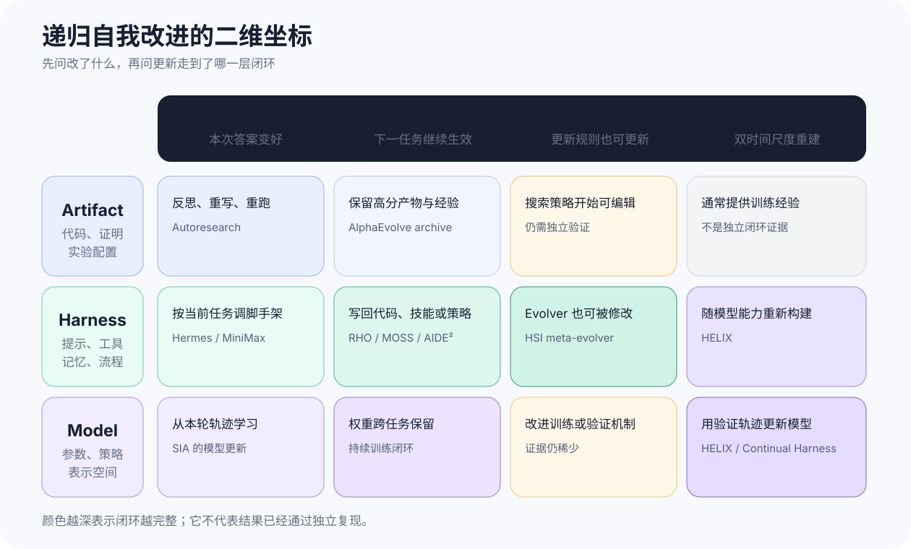
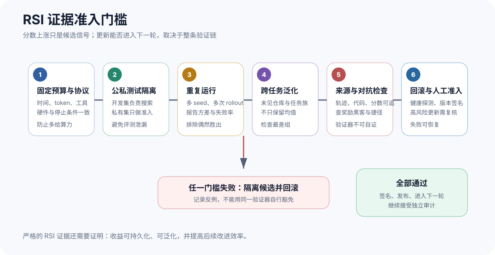

「self-evolving」「self-improving」和「recursive self-improvement」经常被混用。一次回答经过反思后变好，部署后的 Agent 自动写入一条 skill，模型用自己生成的数据继续训练，甚至 AI 系统参与下一代模型研发，这些过程都含有「自己改自己」的成分，却对应完全不同的技术难度和证据强度。

本文采用一个更严格的判断：Artifact、Harness 和 Model 都可以进入自我改进循环；只有更新能够持久化、跨任务泛化，并进一步提升系统的「改进能力本身」，才接近递归自我改进的严格含义。一次 benchmark 上涨不能单独完成这项证明。

# 概念边界与证据范围

[2026 年 RSI 综述](https://arxiv.org/abs/2607.07663)梳理了 2024—2026 年的 1,250 篇 arXiv 论文。它把有限、自洽、可验收的 self-refinement 与开放式 RSI 分开，并指出每个自我改进循环都隐含一个判断：某种自动信号能否替代人的判断。形式验证器通常比单模型自评可靠；研究方向选择仍是闭环中最难移交给机器的环节。

这也决定了本文的证据规则：论文实验和开源实现用于支持技术结论；公司发布页只说明该机构公开声称做过什么；融资、组织口号和产品演示只作为方向信号，不外推成普遍能力。数字若没有公开任务集、预算和对照，就保留其「官方自述」属性。

## 前沿机构公开到了哪一步

[OpenAI 的 GPT‑5.6 发布页](https://openai.com/index/gpt-5-6/)把 Internal Research Debugging、KernelGen 1P、NanoGPT 和 PostTrainBench Lite 汇总为 RSI Index。官方结果中 GPT‑5.6 Sol 为 57.9%，GPT‑5.5 为 41.7%，即高 16.2 个百分点；这些任务覆盖研究代码调试、内核优化、小模型预训练和后训练配方。这个指标测的是「帮助 AI 研发的能力」，还不是模型自主设计并交付后继模型的证明。OpenAI 的[系统卡](https://deploymentsafety.openai.com/gpt-5-6/)也把 GPT‑5.6 的 AI Self-Improvement 能力评为未达到其 High 阈值。

{width="92%" fig-align="center"}

[Anthropic Institute](https://www.anthropic.com/institute/recursive-self-improvement)则用五阶段时间线描述组织内部的变化：人工编写第一版 Claude、聊天机器人辅助、coding agent、能运行代码并委派工作的 autonomous agent，以及尚未发生的 closing the loop。页面还报告 Anthropic 工程师当前每季度交付的代码量约为 2021—2025 年平均水平的 8 倍。后一个数字同时受模型、工具、流程和组织扩张影响，不宜当作模型能力的纯测量。

{width="62%" fig-align="center"}

其余公开动向更适合放在「方向」层，而不是和受控论文实验混在一起：

::: {.table-responsive}
| 机构或系统 | 公开进展 | 证据边界 |
|---|---|---|
| 腾讯混元 Hyra‑1.0 | [腾讯云转载的发布信息](https://cloud.tencent.com/developer/news/4291366)称系统会按探索、提案、反馈和修订循环更新策略或产物 | 暂无可复核技术报告，按产品自述处理 |
| MiniMax M2.7 | [官方页面](https://www.minimax.io/news/minimax-m27-en)称内部 harness 自主运行 100 多轮并把内部编程评测提升 30% | 任务集和完整轨迹未公开，不能与公共 benchmark 横比 |
| Recursive | [团队文章](https://www.recursive.com/articles/first-steps-toward-automated-ai-research)把自动化 AI 研究和潜在表示作为研发主线 | 团队、融资与研究目标是组织信号，不是 RSI 实验结果 |
| Sakana AI | [RSI Lab](https://sakana.ai/rsi-lab/)聚焦进化算法、自动科研和 model–harness co-evolution | 后文只用其 RHI 论文支撑量化结论 |
| Apodex‑1.0 | [官方介绍](https://www.apodex.com/blog/apodex-1.0)将最多 150 个子 Agent、共享报告池和独立验证团队组合为 research harness | 属于验证中心的多 Agent 设计，不等于系统持久更新自己 |
| Weco AI | [AIDE²](https://www.weco.ai/blog/first-evidence-of-recursive-self-improvement)让外层科研 Agent 修改内层 Agent 源码 | 结果来自团队公开实验，协议设计比「RSI」标签更值得检查 |
:::

# 两个维度比三类标签更有用

按优化对象划分，Artifact 是代码、证明、算法和实验配置；Harness 是 prompt、memory、tool、skill、hook、路由与控制流；Model 是参数、策略和内部表示。原有三分法能回答「改了什么」，却没有回答「更新是否留下来」和「优化器是否也被改进」。

{width="72%" fig-align="center"}

我更倾向于加入第二条轴：

1. 单次自我修订，只让当前产出变好；
2. 跨任务持久更新，新 prompt、skill、代码或权重会进入后续任务；
3. 改进优化器本身，生成、筛选和提交更新的规则也能变化；
4. 模型—Harness 共进化，较快的 harness 搜索产生训练经验，较慢的模型更新又改变最优 harness。

{width="95%" fig-align="center"}

这张图也解释了为什么「三者都能自我改进」和「三者都算严格 RSI」不是同一句话。Artifact 循环可以非常有价值，却常在任务结束后停止；Harness 更新容易持久化，但可能只过拟合开发任务；模型更新能跨任务保留，也可能只是普通的自训练。递归性来自更新规则和研发过程逐步进入可验证的闭环，而不是来自修改对象的名字。

# Artifact 路线：先把目标变成可执行实验

Artifact 路线已经最接近稳定工程实践。原因并不神秘：目标函数清楚，候选产物容易隔离，失败也容易回退。

## Autoresearch：固定五分钟，只改一个文件

[Karpathy 的 Autoresearch](https://github.com/karpathy/autoresearch)把小型语言模型训练压缩成一个受控循环：Agent 只能修改 `train.py`，每个候选固定训练五分钟，用越低越好的 `val_bpb` 选择是否保留。架构、优化器、batch size 和超参数都能改，但预算与验收规则不动。一次长跑约尝试 700 个改动，只留下约 20 个有效版本，并把达到目标水平的训练时间从 2.02 小时降到 1.80 小时。这里被改进的是训练程序和配置，不是执行该搜索的模型权重。

{width="92%" fig-align="center"}

## AlphaEvolve：程序种群与自动评估器

[Google DeepMind 的 AlphaEvolve](https://deepmind.google/blog/alphaevolve-a-gemini-powered-coding-agent-for-designing-advanced-algorithms/)由 LLM 生成候选程序，自动评估器运行并打分，进化搜索保留有用个体。DeepMind 报告它在数据中心调度、硬件电路、矩阵乘法和训练内核上产生了已部署改进，包括 Gemini 训练中的 1% 计算节省，以及某个 FlashAttention kernel 的 32.5% 加速。这里最强的证据来自可执行 artifact 和客观 evaluator；「这些改进反哺模型研发」说明它进入了研发链，却不自动等同于开放式 RSI。

{width="92%" fig-align="center"}

# Harness 路线：更新更便宜，验证更困难

Harness 位于模型与环境之间。它决定上下文如何压缩、工具怎样暴露、多个 Agent 如何交换信息、何时重试以及何时停止。修改这层不需要重训模型，部署和回滚也更快，因此 2026 年的公开工作主要集中在这里。

[Harness Engineering for Self-Improvement](https://lilianweng.github.io/posts/2026-07-04-harness/)讨论了一个重要的不对称：提出 harness 修改的能力在一段模型能力区间内变化不大，但从修改中获益的能力呈非单调关系。弱模型可能无法正确执行复杂脚手架，强模型又接近任务上限，中间档模型反而有更大收益空间。这说明 harness 不是免费能力；它会把推理成本换成上下文、编排和执行负担。

{width="92%" fig-align="center"}

## 从经验文件到多 Agent 验证

[Hermes Agent](https://github.com/NousResearch/hermes-agent)会把较长工具调用任务整理成新的 `SKILL.md`，并由 Curator 统计使用、合并近似技能、归档长期不用的条目。它完成了「经验写回」和「生命周期管理」，但新技能是否跨任务稳定增益，仍需要独立回归集。

MiniMax M2.7 的公开案例更接近源码级 harness 搜索。官方称系统循环分析失败轨迹、修改 scaffold、运行评测并决定保留或回退，100 多轮后内部性能提升 30%；在 RL 团队工作流中，Agent 还能续跑实验。由于任务集与完整预算未公开，我把它视为工程可行性信号，不把 30% 当作可迁移的效果量。

{width="90%" fig-align="center"}

Apodex‑1.0 把验证结构化为独立角色：orchestrator 向最多 150 个子 Agent 分派检索，结果进入共享 report pool；冲突事实、关键主张和最终草稿分别交给 reviewer、fact checker 与 global verifier。它主要改善当前 research artifact，没有显示跨任务改写自身代码，因此在二维框架里更接近「复杂 Harness 支撑单次修订」，而不是闭环末端。

{width="88%" fig-align="center"}

## RHI：让工作流规范成为搜索对象

[Recursive Harness Self-Improvement（RHI）](https://arxiv.org/abs/2607.15524)把 harness 写成 Agent loop 的 prompt 级规范。Agent 用当前 $H^{(i)}$ 解任务，LLM evaluator 比较相邻版本输出，偏好进入历史，optimizer 再生成 $H^{(i+1)}$。论文自己把贡献限定为 model–harness co-evolution 的「前半段」：它改进 traces 的生产器，但没有训练下一代模型。

{width="90%" fig-align="center"}

给定任务 $x$ 和 harness 空间 $\mathcal H$，RHI 的理想目标可写为

$$
H_x^\star \in \mathop{\mathrm{arg\,max}}_{H \in \mathcal H} f_x(H),
$$

其中

$$
\begin{aligned}
f_x(H)
&= \mathbb E\!\left[\mathbf 1\!\left\{y \succ y'\right\}\right],\\
H' &\sim \mu(\cdot \mid H' \ne H),\\
y &\sim \mathcal A(H,x),\\
y' &\sim \mathcal A(H',x).
\end{aligned}
$$

$f_x(H)$ 是 $H$ 相对参考分布 $\mu$ 中其他 harness 的期望成对胜率；事件 $y \succ y'$ 表示 evaluator 在评测任务上判定 $H$ 的输出胜过 $H'$ 的输出。高维离散空间无法穷举，实际算法用有限种群 $S_i$ 近似：

$$
\begin{aligned}
\widehat f_x(H;S_i)
&=\frac{1}{|S_i|-1}
s_x(H;S_i),\\
s_x(H;S_i)
&=\sum_{H' \in S_i \setminus \{H\}}
p_x(H,H'),\\
p_x(H,H')
&=\mathbb E\!\left[\mathbf 1\!\left\{y \succ y'\right\}\right].
\end{aligned}
$$

因此，报告最优 $\widehat f_x$ 时必须同时报告种群规模、rollout 次数和 evaluator 调用量。否则更大的搜索预算会被误认成更好的 harness。

RHI 将结构拆成 Agent Design 与 Agent Workflow，后者又含 contract 和 hop。优先修改 contract/hop 的理由很实际：只传下游真正需要的信息，能减少重复上下文、提高 KV-cache 复用，并降低多 Agent 协作成本。论文在 30 个合成机器学习研究任务上报告，少量迭代可让低 reasoning-effort 配置超过同模型的最高 reasoning-effort 配置，并最多降低 60% 推理成本；任务为量化金融、机器人和制药场景的合成问题，结论不应外推到所有长程 Agent。

{width="84%" fig-align="center"}

## Ai2 的反证：预算对等后，进化未必占优

[Rethinking the Evaluation of Harness Evolution for Agents](https://arxiv.org/abs/2607.12227)要求把 harness evolution 与同预算的 parallel sampling、sequential refinement 和 harness scaling 比较，并把搜索任务与 held-out 评测任务分开。在 Terminal‑Bench 2.1 的实验中，Harness Evolution 得分 67.4，低于初始 harness 的 68.2；Parallel Sampling 为 72.3。论文的结论不是「Harness 不值得改」，而是当前自动进化方法没有稳定胜过简单 test-time scaling，迁移也有限。

{width="42%" fig-align="center"}

## AIDE²：让外层 Agent 修改内层科研 Agent

Weco AI 的 AIDE² 用一个双层循环回应上述问题。外层 AIDEhuman 提出源码修改，内层 Agent 在 harness engineering、algorithm 与 ML engineering 任务上运行；候选只有通过固定预算和隐藏分数才被接受。团队报告连续运行 8 天、100 步，约 90% 提案被拒。AIDE85 在 MLE‑Bench Lite、ALE‑Bench Lite 和分布外 WeatherBench 2 上优于 AIDE0，并把检测到的 reward hacking 率从 63% 降到 34%。这些数字仍来自团队自报，但公开协议至少把私有测试、固定成本和外部基准纳入了闭环。

{width="92%" fig-align="center"}

## 今年新增的三条 Harness 路线

[RHO](https://arxiv.org/abs/2606.05922)不依赖标注验证集。它从历史轨迹中选取难度多样的 coreset，对同一任务做并行重跑，再用轨迹内 self-validation 和轨迹间 self-consistency 诊断失败，最后通过成对 self-preference 选择候选 harness。论文报告一轮优化把 SWE‑Bench Pro pass rate 从 59% 提到 78%，但「无外部评分」同时也是风险：自偏好若与真实正确性偏离，会形成自证循环。

{width="94%" fig-align="center"}

[MOSS](https://arxiv.org/abs/2605.22794)把编辑面从文本配置推进到源码。系统根据生产失败批次定位、规划、实现和构建候选，在临时 trial worker 中重放任务，再由用户同意的容器热交换发布；host-daemon 对新容器做健康探测，失败就回滚到 last-known-good image。OpenClaw 的四任务均值在一轮中从 0.25 升到 0.61。相比只写 skill，源码改写覆盖路由、hook 顺序和状态不变量，也把权限和供应链风险推高了一层。

{width="86%" fig-align="center"}

[Hierarchical Self-Improvement（HSI）](https://arxiv.org/abs/2608.08466)继续向递归方向走了一步。冻结的同一 LLM 分别运行 task harness $H$、重写 $H$ 的 Evolver $\Sigma$，以及重写 $\Sigma$ 策略代码的 Meta-Evolver；最外层执行逻辑保持冻结，给自修改设定边界。BALROG 结果显示中等难度任务有明显增益，NLE 等超出 backbone 能力的任务没有改善。这个负结果很关键：Harness 可以组织已有能力，不能凭空创造 backbone 没有的能力。

{width="94%" fig-align="center"}

# Model 与模型—Harness 共进化

模型参数更新比 Harness 更新更慢、更贵，也更难回滚。当前较可信的路线不是让模型直接任意改写权重，而是由受控 Harness 产生轨迹、验证器筛选经验，再通过 SFT、preference learning 或 RL 更新模型。

## SIA：由 Feedback-Agent 选择更新哪个旋钮

[SIA](https://arxiv.org/abs/2605.27276)含 Meta-Agent、Task-Specific Agent 和 Feedback-Agent。后者阅读轨迹，决定下一步修改 scaffold，还是触发 LoRA 权重更新。论文覆盖中文法律罪名分类、H100 上的 Triton kernel 优化与单细胞 RNA 去噪；作者报告联合更新在三项任务上都超过只改 scaffold 的版本，并相对既有 SOTA 分别取得 25.1 个百分点、12.4% kernel 加速和 20.4% 去噪增益。这是三种窄域实验的结果，不能直接推导成通用模型会自主研发下一代模型。

{width="90%" fig-align="center"}

{width="90%" fig-align="center"}

## Continual Harness：快循环改流程，慢循环蒸馏模型

[Continual Harness](https://arxiv.org/abs/2605.09998)在 Pokémon 长程游戏中使用两个时间尺度。单局内，Refiner 定期更新 prompt、子 Agent、skill 和 memory；跨迭代，过程奖励模型筛出低质量片段，由更强教师重标，再用 soft SFT 更新开源策略模型，而且环境不重置。论文报告强模型配置从零构建 harness 时，以约 130 美元中位成本完成目标里程碑，而极简 baseline 约 215 美元达到 98%；在较弱模型上，自动 harness 反而可能更贵且完成度更低。收益受 backbone 能力约束，这与 HSI 的 NLE 负结果一致。

{width="94%" fig-align="center"}

## HELIX：把共进化变成可审计的数据系统

8 月发布的 [HELIX](https://arxiv.org/abs/2608.13951)明确分开两个时间尺度。固定模型下先生成 harness portfolio；同任务、同模型的 sibling trajectories 经验证后，形成 SFT、critic、filter 与 preference records；模型更新后，由于错误恢复、schema adherence 和工具偏好已经变化，系统重新搜索 harness。代码修复的一轮实验中，65 个候选找到的固定 harness 比 Pi 多覆盖 4.0% 任务，完整 portfolio 的互补行为最多多暴露 58.0% verified coverage；200 个 sibling slot 产生 438 条验证记录。

这些数字证明了「可追踪的数据生产链」能运作，还没有展示多轮模型更新后的持续加速。HELIX 的价值恰在于没有跳过中间层：每个 intervention、轨迹、测试结果和来源都可审计，后续才可能判断增益来自模型、Harness 还是候选数量。

{width="94%" fig-align="center"}

# 模型层自我改进的机制前提

下面三项工作研究训练信号、内部表示和潜在推理。它们能帮助设计更好的模型更新与验证方法，但本身都不是 RSI 证据。

## On-Policy Distillation：监督关键分叉 token

[Thinking Machines 的 On-Policy Distillation](https://thinkingmachines.ai/blog/on-policy-distillation/)让学生从当前策略采样轨迹，教师逐 token 给分。教师与学生分歧集中的 forking token 往往对应推理即将分叉的决定点。官方实验在 Qwen3 上报告，相近精度的 RL 需 17,920 GPU 小时，蒸馏约 1,800 GPU 小时；它还用于恢复持续学习中被冲掉的指令遵循能力。这说明密集监督可以更精确地修正策略，不说明模型已能自己定义训练目标、验证后继版本并重开一轮。

{width="72%" fig-align="center"}

## J-space 与 Reasoning by Superposition：看见内部状态

[Anthropic 的 J-space 工作](https://www.anthropic.com/research/global-workspace)用 Jacobian lens 找到会提高未来词概率的内部活动方向，并用干预测试它们与评测意识、操纵和隐蔽行为的关系。它提供了一种审计模型「准备说什么」的方法；若未来模型自己生成训练数据，这类观测可用于检测自我确认和隐藏策略，但它不是更新循环。

[Reasoning by Superposition](https://arxiv.org/abs/2505.12514)分析 Coconut 的连续潜在推理，发现单个连续向量可以叠加表示多条搜索前沿。在图可达性实验中，Coconut 准确率为 0.98，CoT 为 0.76，延长 CoT 为 0.83。潜在空间可能提高搜索密度，也会让来源追踪和人类审查更困难。它回答的是「模型怎样表示并行搜索」，并未回答「谁设目标、谁验证、失败后怎样回滚」。

{width="38%" fig-align="center"}

# 评测与工程准入

我判断一个系统是否接近严格 RSI，不先看它迭代了多少轮，而先看失败候选如何被拒绝。一个可上线的闭环至少需要以下条件：

- 固定时间、token、硬件、工具与停止条件，避免把更多搜索预算包装成算法进步；
- 开发集负责生成更新，私有测试集负责准入，并保留真正未见的任务族；
- 多 seed、重复 rollout，报告方差、最差组和退化任务，而不是只报最好一次；
- 对轨迹、代码、数据、验证器版本和分数建立来源链，专门测试 reward hacking、数据泄漏与 benchmark shortcut；
- 候选在隔离环境试运行，具备版本签名、健康探测、自动回滚与高风险人工审批。

{width="95%" fig-align="center"}

最终还要测「改进速度的改进」。设第 $k$ 轮在固定预算下的 held-out 效用为 $J_k$，只证明 $J_{k+1} \gt J_k$ 仍是普通改进；更强的 RSI 证据需要显示，在多个任务族和多轮重复中，达到同等增益所需的成本下降，或单位预算增益持续上升，同时没有扩大安全与质量回归。

我对 2026 年公开证据的判断是：Artifact 自优化已经实用；Harness 持久更新开始出现可运行系统；改进 Evolver 的 HSI 和生产验证数据的 HELIX 向递归性迈近了一层。模型—Harness 多轮共进化、跨代泛化和独立复现仍然稀缺。现在最值得建设的不是更响亮的 RSI 标签，而是能让每次自修改被定位、复现、拒绝和回滚的基础设施。没有这层，循环越快，错误也只会积累得越快。

# 主要来源

- [Recursive Self-Improvement in AI: From Bounded Self-Refinement to Autonomous Research Loops](https://arxiv.org/abs/2607.07663)
- [GPT‑5.6](https://openai.com/index/gpt-5-6/) 与 [GPT‑5.6 System Card](https://deploymentsafety.openai.com/gpt-5-6/)
- [When AI builds itself](https://www.anthropic.com/institute/recursive-self-improvement)
- [Autoresearch](https://github.com/karpathy/autoresearch) 与 [AlphaEvolve](https://deepmind.google/blog/alphaevolve-a-gemini-powered-coding-agent-for-designing-advanced-algorithms/)
- [Recursive Harness Self-Improvement](https://arxiv.org/abs/2607.15524)、[RHO](https://arxiv.org/abs/2606.05922)、[MOSS](https://arxiv.org/abs/2605.22794)、[HSI](https://arxiv.org/abs/2608.08466)
- [Rethinking the Evaluation of Harness Evolution for Agents](https://arxiv.org/abs/2607.12227) 与 [AIDE²](https://www.weco.ai/blog/first-evidence-of-recursive-self-improvement)
- [SIA](https://arxiv.org/abs/2605.27276)、[Continual Harness](https://arxiv.org/abs/2605.09998)、[HELIX](https://arxiv.org/abs/2608.13951)
- [On-Policy Distillation](https://thinkingmachines.ai/blog/on-policy-distillation/)、[J-space](https://www.anthropic.com/research/global-workspace)、[Reasoning by Superposition](https://arxiv.org/abs/2505.12514)
