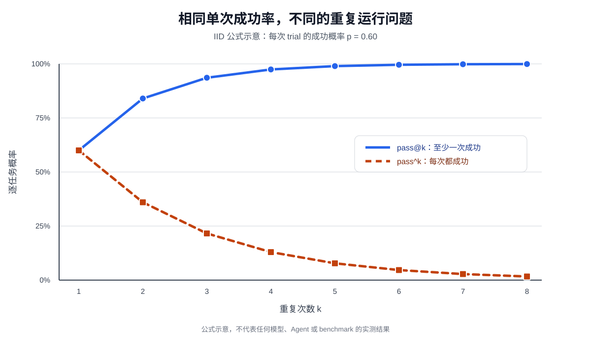
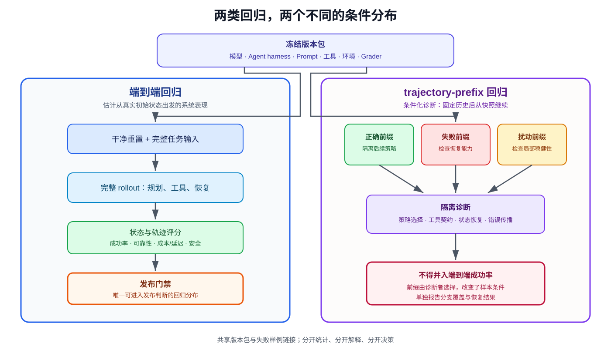

Agent 的输出由模型、运行脚手架、提示词、工具和外部状态共同产生，最后经过评分器解释。只写一个平均成功率，会把这些变量压成一个无法复核的数字。本文梳理评测流水线的五个环节：测什么、怎么搭环境、怎么设计任务、什么时候用 LLM-as-a-Judge、以及怎么用回归测试收尾。

若项目尚未上线，需要先从业务材料、人工金种子和受控合成开始，可参见[《没有线上数据，如何为 Agent 构建冷启动评测集》](cold-start-agent-evaluation-dataset.qmd)。本文接着讨论评测集建成以后如何运行、判分和回归。

```{mermaid}
%%| fig-width: 10
%%| fig-align: center
flowchart TB
    accTitle: 如何科学评测 AI Agent 的闭环
    accDescr: 任务设计依次进入隔离环境、重复运行、状态与轨迹评分、百分之九十五置信区间、安全门禁、失败归因和双层回归，回归样例再反馈给任务设计

    task["任务设计"] --> environment["隔离环境"]
    environment --> trials["重复运行"]
    trials --> grading["状态 / 轨迹评分"]
    grading --> ci["95% CI"]
    ci --> safety{"安全门禁"}
    safety --> attribution["失败归因"]
    attribution --> regression["双层回归"]
    regression -. "版本化样例" .-> task

    classDef design fill:#dbeafe,stroke:#2563eb,color:#172554,stroke-width:2px;
    classDef analysis fill:#ede9fe,stroke:#7c3aed,color:#3b0764,stroke-width:2px;
    classDef gate fill:#fff7ed,stroke:#ea580c,color:#7c2d12,stroke-width:3px;
    classDef regression_style fill:#dcfce7,stroke:#16a34a,color:#14532d,stroke-width:2px;

    class task,environment,trials design;
    class grading,ci,attribution analysis;
    class safety gate;
    class regression regression_style;
```

_图 1：评测闭环把任务、运行、评分、统计、安全与回归连接起来。安全门禁可以阻止发布，失败样例则进入两类职责不同的回归测试。_

## 1. 评测指标设计

### 结果指标

结果指标从最终交付物角度衡量 Agent 的表现。四个统计量回答不同问题：

- **`Pass@1`**：单次尝试的成功概率。日常运营监控的基线。
- **`Pass@k`**：`k` 次尝试至少一次成功的概率。模型选型时用来摸底能力上限——给足候选后能否找到解。
- **`Best@k`**：`k` 次中取最高分。Prompt 调优时用来找最优配置。报告 `Best@k` 时必须说明选择函数和评价函数分别是什么，以及选择器是否接触了隐藏真值（若接触，结果只是 oracle-assisted 上界，不是可部署策略）。
- **`Pass^k`**：`k` 次全部成功的概率。生产部署前的可靠性验证——确保系统每次都能稳定交付。

在独立同分布假设下，若任务 $i$ 的单次成功概率稳定为 $p_i$，总体量可简化为：

$$
\begin{aligned}
\mathrm{pass}@k_i &= 1-(1-p_i)^k, \\
\mathrm{pass}^{k}_i &= p_i^k.
\end{aligned}
$$

`pass@1` 是二者在 $k=1$ 时的共同特例。`pass@k` 随尝试次数上升而 `pass^k` 随尝试次数下降，两条曲线从 $k=1$ 开始分化。

{width="88%" fig-align="center" fig-alt="公式示意图，蓝色 pass@k 从 60% 上升并趋近 100%，橙色 pass^k 从 60% 下降并趋近 0%"}

_图 2：在 IID 且单次成功率 $p=0.60$ 的示意条件下，两个指标从 $k=1$ 开始分化。该图由公式计算，仅用于解释指标，不是任何模型或 benchmark 的实验结果。_

::: {.callout-important title="共享缓存、残留文件、共同限流、跨 trial 记忆和资源耗尽都会破坏 IID 假设"}
当 trial 不独立时，上述曲线只能作为描述统计，不能把独立 Bernoulli 解释强加给相关样本。这些违反条件应在评测报告中注明。
:::

### 过程指标

过程指标关注 Agent 如何到达结果——整个交互过程中发生了什么：

- **行为合法性**：执行过程中是否存在无效操作和越权操作。这检查的是政策违规，与任务最终是否成功无关。
- **工具调用正确率**：Agent 是否用了正确的工具和正确的参数。对搜索工具，检查查询词是否准确表达了需求；对文件操作，检查路径是否指向正确目标。
- **路径效率**：分别记录总步数（think-act-observe 循环）、冗余动作（重复搜索相同关键词、反复读取同一文件）和回退次数（意识到错误并纠正的频率）。效率只在任务成功且安全合规的 trial 内解释——快速失败、跳过确认或省略必要验证反而会得到好看数字。
- **检索覆盖率**：信息收集的全面程度。该指标只在预先定义了必要证据集合时才有意义；没有已知分母，覆盖率没有可信基线。

对需要澄清的会话任务，分别记录：缺失信息询问率、信息不充分时的过早行动率、有效澄清轮次和重复提问。这些指标评价信息获取策略，不与最终工具行动正确率混成一个分数。

### 其他指标

1. **成本与延迟**：请求次数、token 消耗、工具费用、墙钟时间、P50/P95 延迟。同时报告成功 trial 和全部 trial 的分布——快速失败会让平均延迟看起来更好。
2. **鲁棒性**：面对扰动时的稳定性。测量不同初始化下的表现差异、API 超时或格式变化的容忍度、长上下文干扰的抵抗能力。按部署风险预先登记扰动族，各切片分别报告，不混入固定条件下的指标。
3. **安全与幻觉**：一票否决类指标。任何敏感操作、数据泄漏、政策违规或编造不存在的信息都应触发门禁。高成功率与一次严重越权不是可交换的量。

### 小结

1. 轨迹与结果必须双重覆盖——任务可能通过一条侥幸路径成功，也可能因合理策略受阻而失败。
2. 安全指标拥有一票否决权，平均分不能抵消安全事故。
3. 保留人工抽检与对抗式评审：主动构造利用评判模型已知偏见骗高分的回答，观察评分器是否被误导。

## 2. 评测环境设置

一个可复现的评测环境包含五个要素：

- **数据集**：定义任务集合，包含初始状态、目标描述和可选的参考解决方案。
- **环境状态**：任务执行中的可变信息。要在真实性（状态变化符合业务逻辑）与可控性（每次测试可重置到相同初始条件）间平衡。
- **工具接口**：Agent 可执行的操作集合。工具应暴露可审计的业务原语——查订单、改预订、发消息——并明确前置条件、副作用、错误码和幂等性。`solve_task` 这类宏操作会把待测规划藏进工具实现。若生产系统本来就提供高层工具，评测应遵循现实性原则保持生产等价，不能为增加难度而任意拆碎。
- **评分标准与执行协议**：定义交互模式、终止条件、预算、超时、重试规则和权限边界。

五要素合起来构成一个可重复的评测循环。

### 工具调用型与人机交互型环境

**工具调用型环境**通过可执行标准验证行动正确性——Agent 调用预定义工具完成任务，验证基于确定性断言，不依赖人工标注或模型评判。适用于有明确可验证结果的任务。

**人机交互型环境**在自动化环境中模拟真实用户。核心挑战是渐进式信息透露：普通用户不会一开始就想到全部要点，Agent 需要主动提问引导澄清需求。

τ-bench 的做法是用另一个 LLM 扮演用户，按预定义指令逐步透露信息、回应询问、完成后发终止信号。提示词明确要求「不要一次性透露所有信息」，且常需设置有限耐心——Agent 沟通效率太低就直接终止，任务失败。

{width="92%" fig-align="center" fig-alt="τ-bench Figure 1，模拟用户与 Agent 多轮对话，Agent 调用工具读写数据库，并依据领域政策完成或拒绝请求"}

_图 3：τ-bench 的 User–Agent–Tool–Database 交互。不同对话路径可以到达同一合法 outcome，因此 trajectory 与 outcome 必须分别记录。来源：[τ-bench 论文](https://arxiv.org/abs/2406.12045)，Figure 1。_

验证是结果和过程双重的，但任务层面仍汇总为二元奖励——全部通过才得 1 分，便于统计 `Pass^k`。从总体评测视角看，工具调用型环境考察 Agent 的行动正确性，人机交互型环境考察其沟通策略的合理性。

## 3. 评测任务集设计

### 精确性设计

构造精确、可验证任务的五条原则：

1. **用答案唯一性反推描述**：通过信息源、时间窗、实体和查询目标四重限定，锁死唯一答案。若允许多个合法结果，oracle 应编码最终状态不变量和等价结果集合，而非把参考轨迹当成标准答案。
2. **用信息分层承载真实语境**：每个任务包含四层——表面问题、性能期望、约束条件、隐含信号（如语气或紧迫感）。并非所有层都要机械验证，但每层都应记录在案。
3. **用结构化字段与机械可验证元素**：问题描述、复现步骤、预期行为、实际行为应使用结构化字段。描述中的每个元素必须映射到可检查证据——路径、权限、参数、状态、日期或 rubric 叶节点。
4. **用参数化模板替代静态文本**：任务应是可以动态实例化的模板，每次随机生成参数（实体、金额、文件、时间、权限），防止过拟合到固定测试实例。
5. **从中间状态启动并显式消歧**：真实任务常从部分完成的状态开始——排队工单、半填表单、已有分支。只在干净初始页上测试，可能漏掉部署系统中的常见中间状态。

### 层次化设计

综合两个维度：

- **技术难度分级**：Level 1 需要多个工具，Level 2 需要多步思考，Level 3 需要复杂组合。
- **业务难度分级**：Level 1 为简单信息查询，Level 2 需要诊断故障，Level 3 是整体策略判断。

同样是 20 步，一条全是只读查询，另一条包含权限判断和不可逆写入，风险完全不同。覆盖矩阵应至少交叉业务频率与后果等级，再叠加所需工具数、状态分支、信息不完整度和恢复窗口。

{width="92%" fig-align="center" fig-alt="PaperBench Figure 2，一棵层级 rubric 树将研究复现任务拆成细粒度要求，并从叶节点得分计算 55% 的最终复现分数"}

_图 4：层级 rubric 让部分完成落到明确要求，而不是由裁判凭整体印象给分。来源：[PaperBench 论文](https://arxiv.org/abs/2504.01848)，Figure 2。_

公开集适合开发。最终发布门禁需要冻结的 held-out 任务和轮换批次。测试任务一旦反复参与 Prompt 调优，就已经转为开发数据。

## 4. 自动化评测方案：LLM-as-a-Judge

### 适用场景

- 无标准答案，无法构造工具调用型环境
- 人工评估难以规模化

### 已知局限

1. **长度偏见**：裁判倾向给更长的回答更高分，与质量无关。
2. **波动性**：多次相同输入评测结果不同。
3. **同源模型问题**：Agent 与评判模型同家族时，Agent 会学会利用评判者的偏好和盲点，避开评判模型不擅长检测的错误类型。
4. **配对比较的位置偏差**：评判模型系统性偏向先出现的候选。

### Rubric 四准则

1. **基于专家指导**：Rubric 必须反映领域知识。缺乏专业基础的 rubric 只能捕捉语言流畅度等表面特征。
2. **全面覆盖**：涵盖事实准确性、逻辑连贯性、完整性和安全性。不只定义正面标准，还要明确已知陷阱。
3. **标准重要性权重**：区分必要项、重要项、可选项与否决项。安全相关的否决项支持一票否决。
4. **自包含评估**：每条准则应能只凭提供给 Judge 的证据独立判定。权重和否决条件必须在看测试结果前冻结。

### 失败归因

失败样例来自三类渠道：用户明确纠正、用户点踩/负面反馈、事后通过状态检查、规则验证器或 LLM 评审发现。

归因记录必须结构化：引用具体步骤号、工具名和观察证据；区分根因与后果；判断是否可恢复；给出置信度。多类别同时出现时，按「最早且能解释后续失败」选主因，其余留作次因。

LLM 可以批量提出归因候选，但根因可能在 task、产品、环境或 grader，而不只在模型。证据引用、置信度和高风险归因仍需独立复核。

每条失败记录至少保存：版本包（模型、harness、prompt、工具、环境、grader）、任务和 trial 身份、发现渠道、最早有证据的偏离点、推定最早因果步骤（与偏离点分开记录）、多标签根因、证据引用、可恢复性、置信度和回归链接。

最后一次报错通常只是症状。写数据库失败可能源于更早的身份解析错误。记录最早可观察的偏离——它保持可复核性——而推定因果步骤则保留尚未证实的诊断。

## 5. 双层回归

### 端到端回归

从初始状态和用户请求跑完整流程，检查最终状态、必要输出与安全条件。最接近生产结果，但失败时难定位出在哪一步。端到端回归负责发布门禁。

### 轨迹前缀回归

冻结首个错误之前的上下文、对话、工具返回和环境状态，只要求 Agent 执行下一步或几步可观察动作。这一层有三个用途：

- 从正确前缀继续时，验证当前策略能否完成后半程。
- 从失败前缀继续时，检查 Agent 或工具能否识别并恢复。
- 从扰动前缀继续时，测试局部状态变化是否导致错误放大。

{width="95%" fig-align="center" fig-alt="DIVERT Figure 1，左侧多次从头运行完整对话，右侧保存中间状态并从关键节点生成多条定向分支"}

_图 5：完整 rollout 与快照分支的区别。DIVERT 将对话、Agent、工具环境、模拟器和原始随机种子保存在快照中，以复用共享前缀并探索欠覆盖的后续路径。来源：[DIVERT 论文](https://arxiv.org/abs/2604.21480)，Figure 1。_

轨迹前缀回归成本低、能隔离单个策略或工具问题。对生产级高可靠 Agent，这一层往往比端到端更重要——它告诉你哪里出了问题，而不只是告诉你出了问题。但 prefix 结果不能与端到端 trial 合成一个成功率，它们使用不同的样本条件和统计口径。

{width="94%" fig-align="center" fig-alt="双层回归职责图，左侧端到端完整运行进入发布门禁，右侧三种 trajectory prefix 进入策略、工具和恢复诊断，并明确禁止合并成功率"}

_图 6：端到端回归与 trajectory-prefix 回归共享版本包和失败样例链接，但使用不同的样本条件、统计口径和决策职责。本文整理；prefix 分支思路参考 DIVERT。_

---

一次可审计的评测报告应冻结完整配置（模型、harness、prompt、工具、环境、grader），给出 task 数量和 trial 分布，分离 outcome 与过程指标，提供置信区间，并为每条失败记录配套证据链。这条闭环以可追踪证据为输入，单一总成功率不足以支撑发布判断。

## 参考资料

1. Anthropic. [Demystifying evals for AI agents](https://www.anthropic.com/engineering/demystifying-evals-for-ai-agents). 2026.
2. Shunyu Yao et al. [τ-bench: A Benchmark for Tool-Agent-User Interaction in Real-World Domains](https://arxiv.org/abs/2406.12045). 2024.
3. Giulio Starace et al. [PaperBench: Evaluating AI's Ability to Replicate AI Research](https://arxiv.org/abs/2504.01848). 2025.
4. Lianmin Zheng et al. [Judging LLM-as-a-Judge with MT-Bench and Chatbot Arena](https://arxiv.org/abs/2306.05685). 2023.
5. Itay Nakash et al. [Efficient Agent Evaluation via Diversity-Guided User Simulation](https://arxiv.org/abs/2604.21480). 2026 年预印本（DIVERT）。
