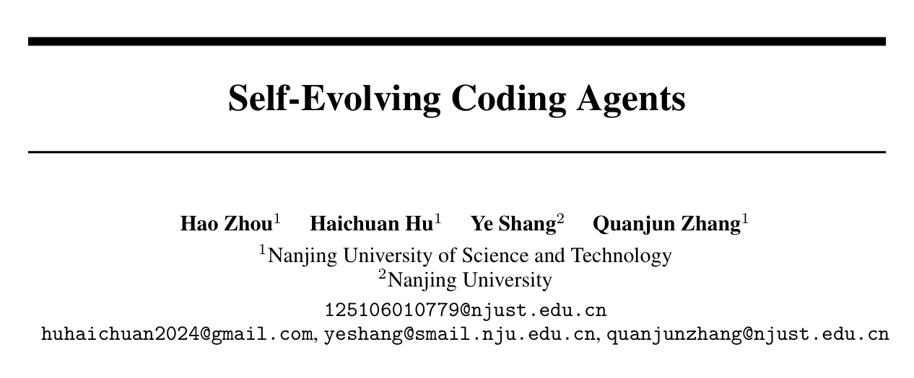{width="78%" fig-align="center"}

*论文信息：Hao Zhou、Haichuan Hu、Ye Shang、Quanjun Zhang；南京理工大学、南京大学；arXiv:2608.03392v1，2026 年 8 月 4 日。来源：[v1 PDF](https://arxiv.org/pdf/2608.03392v1)。*

这篇综述讨论的不是“让 Coding Agent 多试几次”，而是一个更严格的问题：**一次编码经历能否改变智能体在未来任务中的持久状态，并带来可验证的改进？** 如果失败只触发同一任务内的重试，任务结束后所有经验随上下文一起消失，那么系统仍是静态智能体；只有当框架、记忆、技能与工具、模型，或工作流与拓扑发生可复用的更新，才进入自进化的讨论范围。

> 论文：*[Self-Evolving Coding Agents](https://arxiv.org/abs/2608.03392v1)*  
> 资源：[Awesome Self-Evolving Coding Agents](https://github.com/zhouhao1024/Awesome-Self-Evolving-Coding-Agents) · [DOI](https://doi.org/10.48550/arXiv.2608.03392)

::: {.callout-warning title="证据边界"}
这是一篇处于快速演进领域的**引导式综述**，不是提出统一算法和统一实验协议的实证论文。文中的分类与表格用于组织已有系统；不同工作使用的数据、基础模型、工具预算和成功判据不同，数字不宜横向直比。下文把“论文归纳”与“本文扩展”明确分开；用户提供的微信文章仅作选题提示，技术归因均以论文 v1 和原始论文为准。
:::

## 1. 概念边界：持久适应，而不是一次性重试

论文从三个相邻概念切入：

- **Coding Agent**：在软件工程闭环中理解需求、浏览仓库、编辑多文件、调用 Shell/编译器/测试工具、定位失败并提交补丁。
- **Self-Evolving Agent**：从过往交互中更新自身组件，使未来行为发生持久变化，但任务域不一定是软件工程。
- **Self-Evolving Coding Agent**：以仓库、可执行产物和编码轨迹为环境，利用先前编码尝试与软件特有反馈，持续更新自身组件。

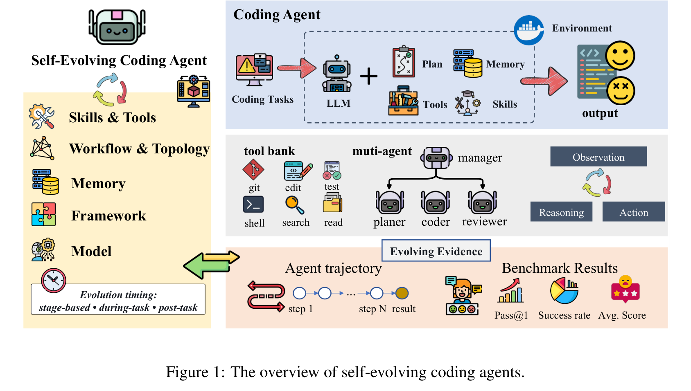{width="95%" fig-align="center"}

*论文 Figure 1：自进化编码智能体由框架、记忆、技能与工具、模型、工作流与拓扑等可变对象构成，并从代码环境中获得反馈。来源：[v1 PDF](https://arxiv.org/pdf/2608.03392v1)。*

软件工程尤其适合研究这一问题，因为反馈往往是**可执行、可定位、可重复**的：单元测试、编译错误、运行轨迹、Lint、CI 结果和代码评审都能给出比自然语言偏好更具体的证据。但“反馈丰富”不等于“反馈正确”。测试可能不完整，环境可能偶发失败，评审也可能有偏差；一旦这些信号被写入长期状态，错误会从一次失败升级为系统性偏差。

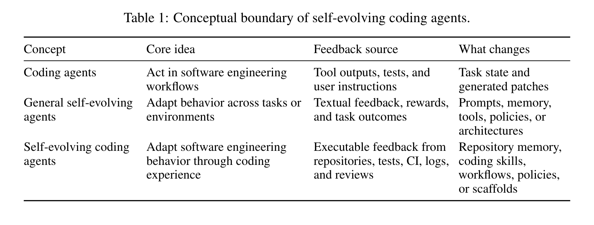{width="92%" fig-align="center"}

*论文 Table 1：三类智能体在目标、环境、反馈与更新对象上的概念边界。来源：[v1 PDF](https://arxiv.org/pdf/2608.03392v1)。*

一个实用判据是：

1. **是否跨任务保留？** 经验能否在当前上下文结束后继续存在；
2. **是否改变未来策略？** 后续任务中的检索、工具调用、协作或生成策略是否因此不同；
3. **是否经过独立验证？** 改变带来的收益是否能在留出任务上复现，而非只记住原题。

## 2. 三维分类：演化什么、何时演化、凭什么演化

综述的主轴是一个以**演化对象**为中心的五类分类，同时以“演化时机”和“演化证据”作为两条正交维度。三条轴共同回答：系统改了什么、什么时候改，以及依据何种软件证据决定改动。

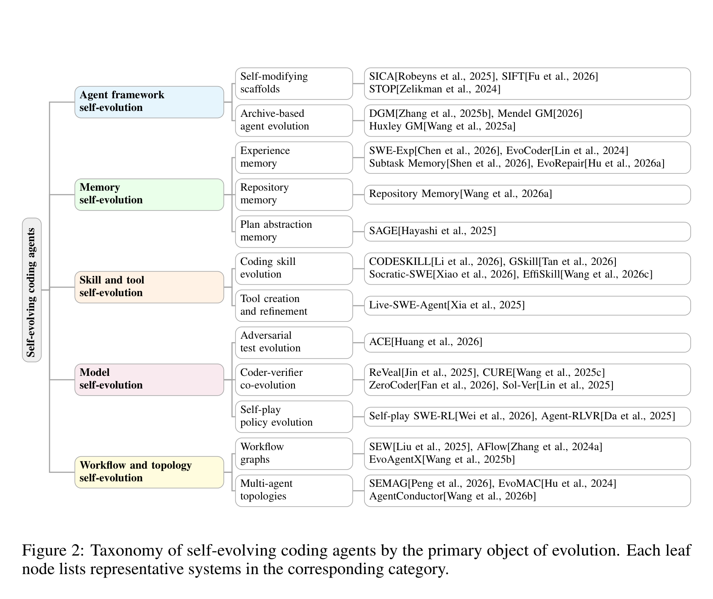{width="95%" fig-align="center"}

*论文 Figure 2：五类主要演化对象及代表机制。它们是分析视角而非互斥分区，一个系统可以同时更新多类对象。来源：[v1 PDF](https://arxiv.org/pdf/2608.03392v1)。*

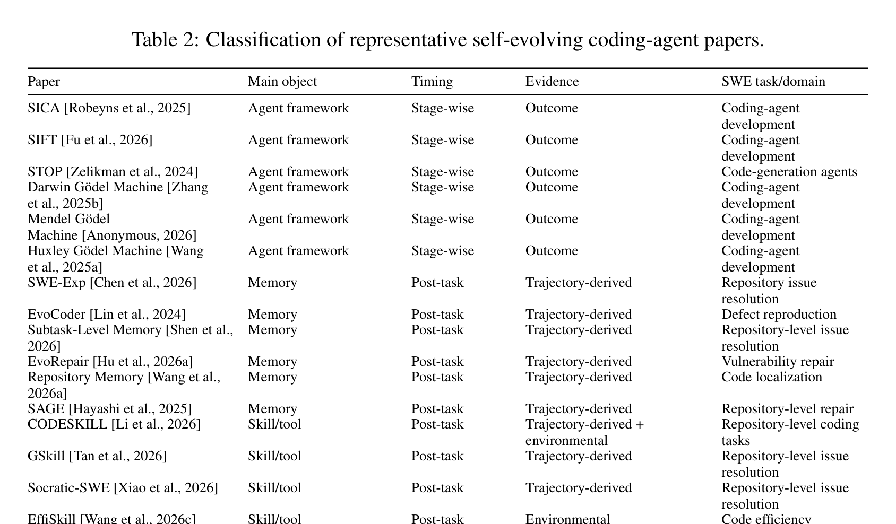{width="95%" fig-align="center"}

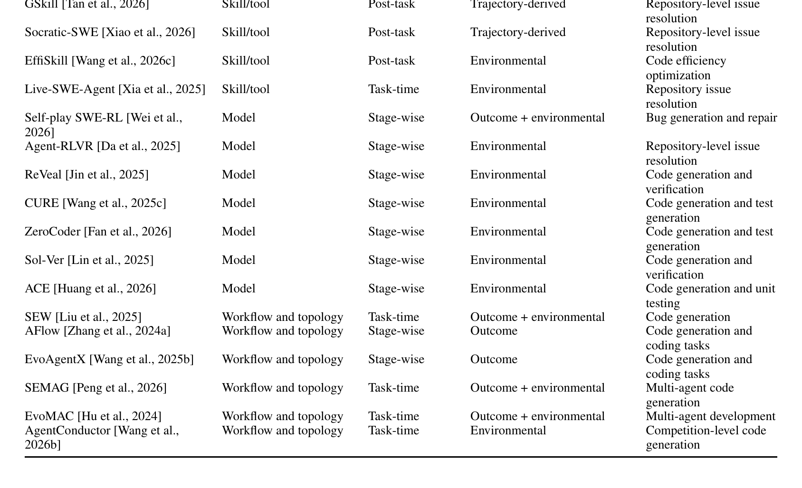{width="95%" fig-align="center"}

*论文 Table 2：代表性系统在演化对象、时机、证据、机制与评测上的映射。来源：[v1 PDF](https://arxiv.org/pdf/2608.03392v1)。*

这套分类最有价值的地方，不是给论文贴标签，而是揭示**状态的作用域与风险半径**：记忆条目通常是局部状态，技能会跨任务复用，工作流会改变多个角色的控制路径，模型更新则可能影响所有仓库与用户。对象越全局，更新前所需的证据强度、回归覆盖和观察窗口就应越高。

## 3. 五类演化对象

### 3.1 框架：让 Agent 改写自己的控制逻辑

框架层包含提示词、控制流、工具接口和运行时结构。SICA、SIFT、Darwin Gödel Machine（DGM）等工作让智能体提出并验证对自身实现的修改。这是最直接的“系统改系统”，优点是可以改变搜索、反思、工具使用等底层策略；代价是一次错误修改可能破坏整个执行器。

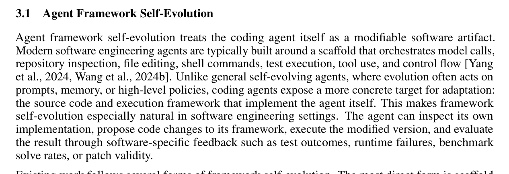{width="86%" fig-align="center"}

*论文对 framework self-evolution 的定义。来源：[v1 PDF](https://arxiv.org/pdf/2608.03392v1)。*

关键工程约束不是“能否自动改代码”，而是**新旧版本是否隔离、候选版本是否在沙箱中评测、失败时能否原子回滚**。没有这些边界，自修改很容易把局部基准增益变成生产事故。

### 3.2 记忆：把轨迹压缩为可检索经验

记忆演化把成功补丁、失败轨迹、仓库结构和项目约定写入长期存储，再在相似任务中检索。SWE-Exp 等系统体现了从经验抽取到未来复用的路线。与简单保存对话不同，真正困难的是选择什么值得保留：原始轨迹信息丰富但冗长，摘要节省上下文却可能丢失失败条件。

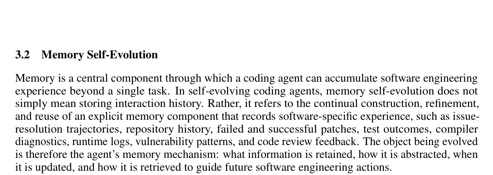{width="86%" fig-align="center"}

*论文对 memory self-evolution 的定义。来源：[v1 PDF](https://arxiv.org/pdf/2608.03392v1)。*

高质量记忆至少应带有来源仓库、提交版本、依赖环境、证据类型、置信度和有效期。否则“曾经正确”会在 API、依赖或代码结构变化后变成陈旧经验。因而记忆系统需要去重、冲突处理、过期与再验证，而不只是无限追加。

### 3.3 技能与工具：从知道经验到执行程序

技能是可调用、可组合的操作单元，通常比记忆更程序化：它不仅记录“发生了什么”，还编码“遇到某类问题时如何诊断和操作”。CODESKILL、GSkill、Socratic-SWE、Live-SWE-Agent 等工作展示了技能抽取、重写、合并与工具生成。

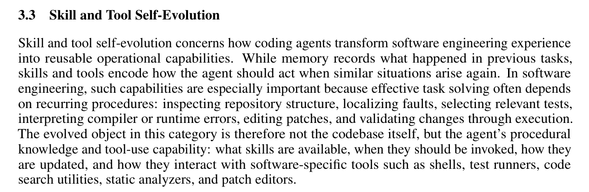{width="86%" fig-align="center"}

*论文对 skill/tool self-evolution 的定义。来源：[v1 PDF](https://arxiv.org/pdf/2608.03392v1)。*

记忆与技能的区别可以概括为：**记忆提供上下文，技能提供可执行政策**。技能的复用收益更高，但错误也会被稳定重复，因此技能发布需要输入前置条件、适用范围、反例、版本和回归用例。工具生成还应额外限制权限、文件作用域和网络边界。

### 3.4 模型：把交互经验写入参数

模型演化通过自生成任务、自博弈、强化学习或验证器反馈更新策略参数，代表方向包括 Self-Play SWE-RL、Agent-RLVR、ReVeal 和 CURE。它能减少对外部记忆的依赖，但更新成本和风险半径最大，也最容易把基准特征或有缺陷的奖励函数固化进参数。

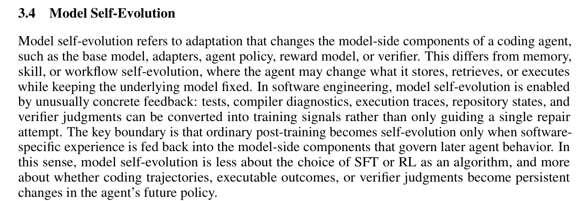{width="86%" fig-align="center"}

*论文对 model self-evolution 的定义。来源：[v1 PDF](https://arxiv.org/pdf/2608.03392v1)。*

并非所有软件工程后训练都属于自进化。若训练数据由外部固定构造，部署后的智能体没有“交互—反馈—更新—再交互”的闭环，它更接近普通微调。自进化强调的是系统利用自身经历持续地产生训练信号，并让更新后的策略回到后续交互中。

### 3.5 工作流与拓扑：改变角色、边与协作协议

多智能体系统还可以演化任务分解、角色定义、消息流、边连接与调度顺序。SEW、AFlow、EvoAgentX、SEMAG、EvoMAC、AgentConductor 等工作把协作结构本身视为搜索和优化对象。

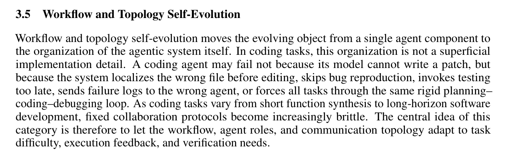{width="86%" fig-align="center"}

*论文对 workflow/topology self-evolution 的定义。来源：[v1 PDF](https://arxiv.org/pdf/2608.03392v1)。*

这类方法的收益来自“把正确问题交给正确角色”，但结构变复杂后，性能提升究竟来自更多调用、更强模型还是更好拓扑，往往难以归因。评测应同时报告调用次数、并行度、通信量、端到端延迟和失败恢复，而不能只看解决率。

## 4. 演化时机与软件证据

### 4.1 三种演化时机

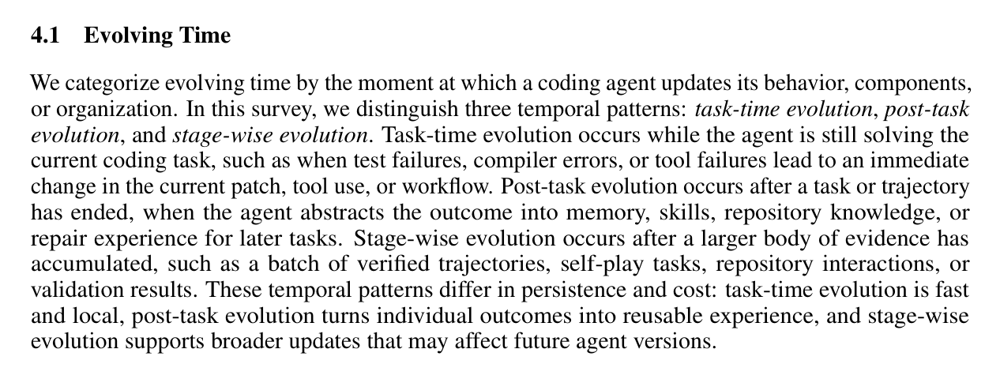{width="88%" fig-align="center"}

*论文对 evolving time 的归纳。来源：[v1 PDF](https://arxiv.org/pdf/2608.03392v1)。*

- **Task-time**：在一次任务执行中即时反思和重组，反馈快，但最容易被单次偶然性牵引。
- **Post-task**：任务完成后聚合轨迹再更新，便于过滤和复盘，也更适合写入长期记忆或技能库。
- **Stage-wise**：积累一批任务后集中训练或搜索，成本较高，却能利用更稳定的统计证据，适合模型和全局工作流更新。

时机与对象并非任意组合。局部记忆可高频更新；技能宜在任务后验证；模型与全局拓扑通常应采用分阶段、离线、版本化更新。越难撤销的变化，越不应由单次在线信号直接触发。

### 4.2 三类演化证据

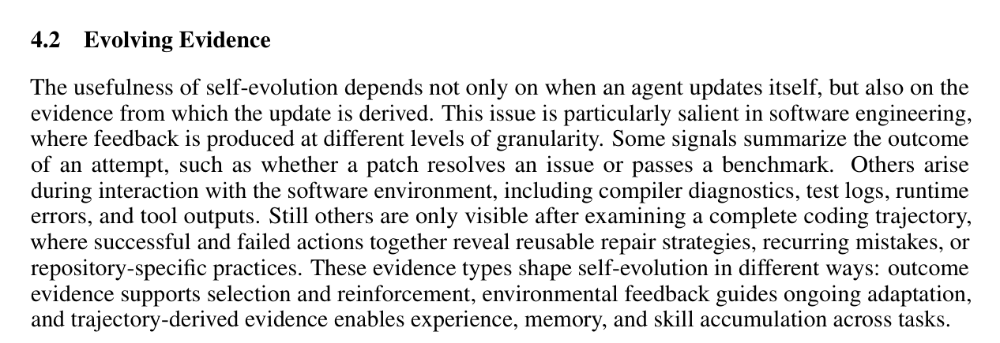{width="88%" fig-align="center"}

*论文对 evolving evidence 的归纳。来源：[v1 PDF](https://arxiv.org/pdf/2608.03392v1)。*

| 证据 | 典型信号 | 优点 | 主要盲点 |
|---|---|---|---|
| Outcome-based | 测试通过、任务解决、补丁被接受 | 明确、便于自动化 | 只能说明结果，难以解释原因；测试可能不完整 |
| Environmental | 编译错误、运行日志、CI、依赖状态、代码评审 | 软件语义具体，可用于定位 | 环境噪声、工具版本和权限会改变信号 |
| Trajectory-derived | 工具调用序列、失败分支、反思、搜索路径 | 能抽取过程策略与反例 | 轨迹很长，归因不稳，易把偶然步骤当规律 |

可靠的演化不应只依赖单一信号。例如“测试通过”最好与静态检查、增量回归、代码差异审查和轨迹归因共同使用；否则智能体可能通过删测试、硬编码或绕开约束获得表面成功。

## 5. 如何评测“真的在进化”

现有工作常以 SWE-bench 一类仓库级基准上的 resolved rate 或 pass rate 报告能力，但综述指出，自进化评测还要回答过程、成本、泛化和长期质量问题。

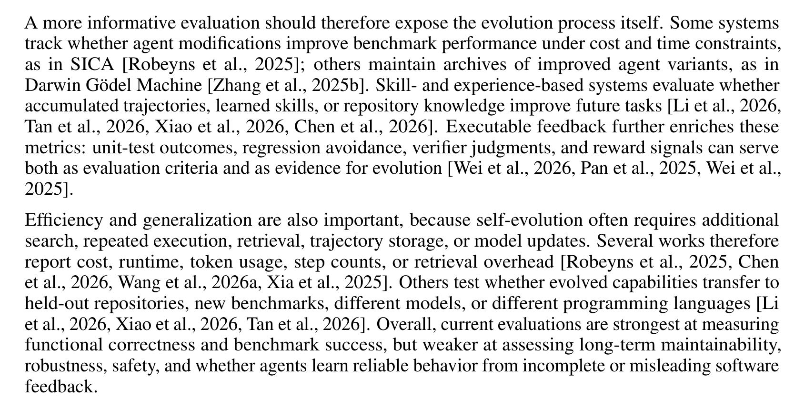{width="88%" fig-align="center"}

*论文对演化过程、成本效率与泛化评测的讨论。来源：[v1 PDF](https://arxiv.org/pdf/2608.03392v1)。*

一个最小的“演化增益”可以写成：

$$
\Delta_{\mathrm{evo}}
=
S(A_{t+1}; \mathcal{D}_{\mathrm{holdout}})
-
S(A_t; \mathcal{D}_{\mathrm{holdout}})
$$

这里必须使用未参与更新的留出仓库或未来时间切片。更完整的评测至少同时报告：

- **能力增益**：解决率、补丁正确性、代码质量和可维护性；
- **演化效率**：额外 token、工具调用、墙钟时间、训练算力和人工审核；
- **保持与回归**：旧任务能力是否退化，收益能维持多久；
- **跨域泛化**：跨仓库、语言、依赖版本和任务类型是否有效；
- **安全与治理**：越权操作、测试投机、反馈投毒和回滚成功率。

最容易被忽略的对照组是**“同等预算但不持久更新”**。如果进化系统只是调用了更多次模型，就不能把全部提升归因于演化机制。还应比较静态强提示、检索增强、更多推理采样和真正的跨任务持久更新。

## 6. 本文扩展：从自进化走向可信演化

下面两张图是基于综述分类所作的工程化推演，不是论文原图。核心观点是：生产系统中不能让“学习闭环”直接覆盖“运行闭环”，而应把每次持久变更当作一次受控软件发布。

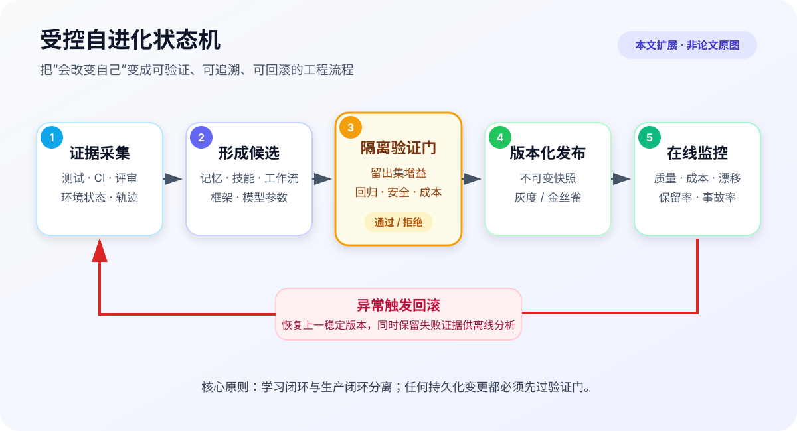{width="94%" fig-align="center"}

*本文扩展：候选变化只有通过留出集、回归、安全和成本验证后，才进入版本化灰度发布；异常触发回滚。*

建议为每个可演化对象维护统一的变更记录：父版本、证据来源、适用作用域、生成者、验证集、收益与回归、发布时间、失效条件和回滚目标。这样才能回答“智能体为何学会了这件事”“哪次反馈造成退化”“哪些任务受影响”。

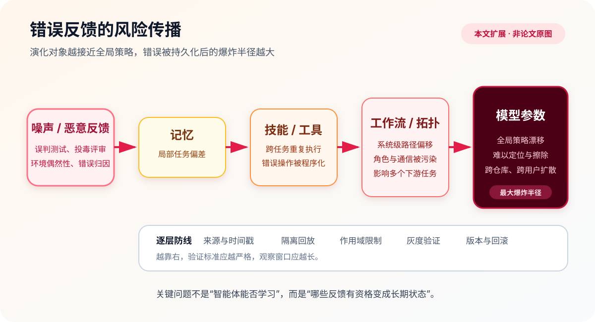{width="94%" fig-align="center"}

*本文扩展：同一条错误反馈写入不同对象时，潜在影响范围不同；越靠近工作流和模型，验证门应越严格。*

可信演化可以落到六条设计原则：

1. **证据可追溯**：每条记忆、技能和训练样本保留来源、时间与环境版本；
2. **更新有准入**：在隔离环境中复放，至少通过功能、回归、安全和成本四类门槛；
3. **状态可版本化**：可变对象使用不可变快照和明确父子关系，不做无法审计的原地覆盖；
4. **发布分阶段**：先影子评测，再小流量灰度，最后扩大作用域；
5. **失败可回滚**：监控阈值与回滚目标在发布前确定，而不是事故后临时推断；
6. **知识会过期**：记忆和技能设置有效期，在仓库、依赖或工具变化后重新验证。

## 7. 开放问题与研究建议

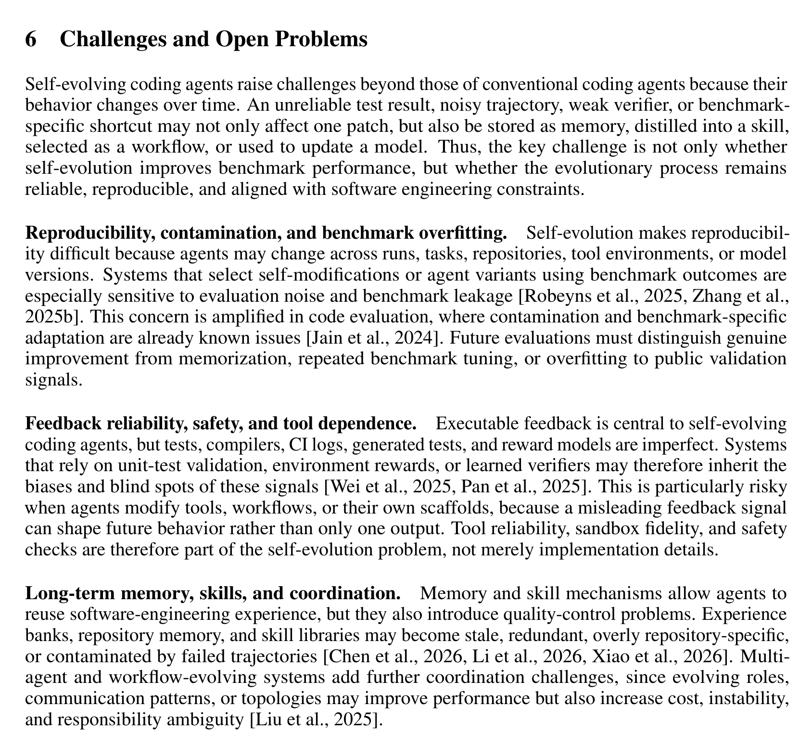{width="92%" fig-align="center"}

*论文对可复现性与污染、反馈可靠性与安全、长期记忆维护等挑战的讨论。来源：[v1 PDF](https://arxiv.org/pdf/2608.03392v1)。*

接下来最值得推进的不是再增加一种“反思提示”，而是建立可复现的演化协议：固定初始智能体，公开任务到达顺序，分离更新集与时间外留出集，记录每次状态变化，并在相同总预算下比较静态与进化系统。对于在线系统，还需要处理恶意反馈、共享技能库投毒、用户间信息泄露和不可逆参数更新。

三类读者可以从不同层次切入：

1. **入门者｜难度：低**：先用“是否跨任务保留、是否改变未来策略、是否独立验证”三问辨别自进化与普通重试，再沿五类演化对象阅读代表工作。
2. **硕博研究者｜难度：中高**：设计跨仓库、按时间切分的留出协议，把演化增益、额外成本、遗忘和安全回归放在同一张结果表中，并公开完整状态变更日志。
3. **导师与课题负责人｜难度：中**：把性能目标与演化治理作为双目标；优先建设可追溯证据、版本化状态、灰度与回滚基础设施，再扩大模型或多智能体拓扑的自修改权限。

## 8. 总结

这篇综述给出的关键转变，是把 Coding Agent 从“每次任务都从近似零状态开始”的工具，改写为能从软件交互中累积经验的长期系统。五类演化对象回答**什么会变**，三类时机回答**何时改变**，三类证据回答**凭什么改变**。

但自进化的上限并不只由学习能力决定，也由治理能力决定。测试、CI 和轨迹让软件工程成为天然的学习环境，也让错误反馈能够被自动、快速、永久地放大。真正可信的 Self-Evolving Coding Agent，不是最频繁改写自己的系统，而是能证明每次改变为何发生、带来什么收益、影响哪些范围，并在判断错误时安全退回去。

## 参考资料

- Hao Zhou, Haichuan Hu, Ye Shang, Quanjun Zhang. *[Self-Evolving Coding Agents](https://arxiv.org/abs/2608.03392v1)*, 2026.
- 论文配套资源：*[Awesome Self-Evolving Coding Agents](https://github.com/zhouhao1024/Awesome-Self-Evolving-Coding-Agents)*。
- 辅助阅读：[微信公众号文章](https://mp.weixin.qq.com/s/hSrJLcZN3j7J7X02N2HIMg)（不作为本文技术事实的证据来源）。
