我想解决的并不是「如何写出更强的提示词」，而是一个更具体的工程问题：怎样让 Agent 在多工具、多步骤、可能中断的任务中稳定执行，同时把上下文消耗和错误定位成本控制在可接受范围内。

最后形成的方案由三部分组成：Skill 负责描述入口和行为边界，CLI 接管确定性操作，Workflow 保存流程顺序与运行状态。Agent 仍然负责理解自然语言、判断选项和组织回复，但不再直接维护 API 参数、步骤依赖或跨会话记忆。

这套设计不能把概率模型变成数学意义上的确定性函数。它能做的是缩小随机性发挥作用的范围：相同输入经过 schema 校验、状态机和原子工具后，执行路径更容易复现，失败也能定位到具体步骤。

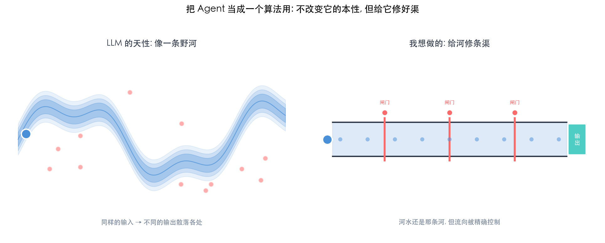

## 一、问题边界：长提示词没有变成可靠的执行系统

最初的实现很直接：把业务规则、工具参数和操作顺序都写进一份 `SKILL.md`。规则增长到约 200 行后，失败模式开始重复出现：Agent 会跳过确认，把一个接口的字段带到另一个接口，或者在缺少参数时直接执行。

当时的提示词大致如下：

> 你是某业务平台助手。使用 CLI 操作；先向用户收集参数；执行前确认；某字段必须先做白名单校验……

继续补充「必须」「不要」「务必先」只能短期覆盖某个案例。规则越多，单条规则能获得的注意力越少；上下文顺序或模型版本变化后，同样的问题还会以别的形式出现。

错误的成本不只是一条失败请求。以「创建权限集」为例，若 Agent 先猜工具、再补字段、出错后重新选择路径，可能消耗约五轮交互；流程预先编排后，目标是把用户输入集中在一次信息收集里，后续步骤由 CLI 连续完成。这个数字来自流程拆解，不是正式 benchmark，但它说明了为什么对话轮次和 token 应进入工程指标。

128K context window 说明模型可以接收多长的输入，不等于其中每条规则都能获得稳定、等量的关注。本文没有用这一点解释所有错误，但它足以说明：把完整操作手册一次性放进上下文，并不能替代流程控制。

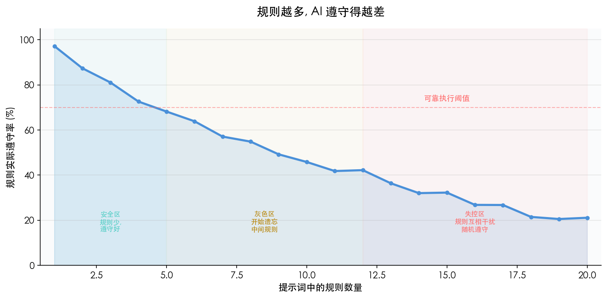

复盘出错样例后，问题可以分成两类：

| 任务类型 | 典型表现 | 更合适的承担者 |
| --- | --- | --- |
| 语义任务 | 理解「创建项目」的意图、判断选项、向用户解释结果 | Agent |
| 确定性任务 | 拼接 HTTP 请求、校验字段、写 YAML、保存状态 | 程序 |

我据此调整了目标：不再要求 Agent 记住完整流程，而是让它在每个时刻只处理当前决策所需的信息。

## 二、职责切分：Agent 做判断，CLI 做执行

CLI 最初只是一个 Bash 脚本，后来逐步承担了 API 调用、数据校验、文件读写和状态管理。Agent 与 CLI 之间只交换结构化数据。

| 角色 | Agent | CLI |
| --- | --- | --- |
| 输入 | 用户自然语言、当前步骤说明 | JSON 参数、流程状态 |
| 职责 | 意图理解、信息收集、选项判断、结果表达 | API 调用、schema 校验、文件与状态管理 |
| 输出 | 面向 CLI 的参数或面向用户的回复 | 结构化结果与下一步指令 |
| 主要不确定性 | 语义理解与判断 | 由代码路径、协议和退出码约束 |

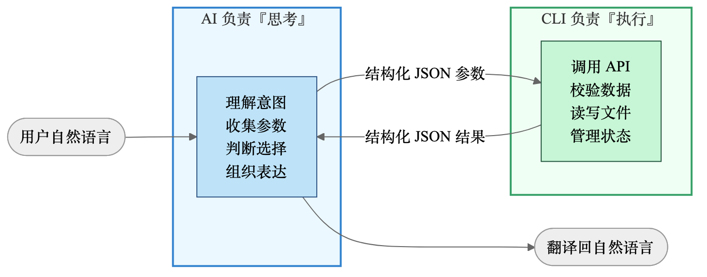

以「创建项目」为例，旧路径要求 Agent 自己构造请求，常见错误包括漏写 header、字段名拼错和认证格式不一致。新路径只让 Agent 提交工具名与字段值：

```text
tool: create_project
name: foo
host: bar.com
```

CLI 再完成参数校验、认证和请求发送。这里的重点不在于 Bash 比 Agent 更聪明，而在于字段映射和协议实现本来就不需要语义推理。

这次拆分带来两个直接变化：

1. Agent 的上下文不再常驻所有调用细节。
2. 执行失败可以通过命令、退出码和结构化结果复现，不必回放整段自然语言推理。

## 三、上下文管理：从全量 schema 改为按需披露

工具数量较少时，把 schema 写进 `SKILL.md` 并无明显问题。数量增加后，完整 schema 会挤占任务本身的上下文。几种常见做法各有代价：

| 方案 | 实现方式 | 主要问题 |
| --- | --- | --- |
| 全量写入 `SKILL.md` | 工具说明与参数平铺 | schema 长期占用上下文，规则容易互相干扰 |
| 每个工具一份 reference | Agent 自行选择并读取文件 | 文件选择和版本判断仍由 Agent 承担 |
| 暴露全部 MCP schema | 由宿主注入工具定义 | 工具多时 token 成本明显，裁剪空间有限 |
| 单独维护工具索引 | 先查目录，再读详情 | 索引可能与真实 schema 不同步 |

我的实现把工具信息拆为三层：

| 层级 | 内容 | 进入 Agent 上下文的时机 | 存储位置 |
| --- | --- | --- | --- |
| 索引层 | 工具名与一句话描述 | 激活后可见 | `tools-index.md` |
| 元数据层 | 字段、类型、必填项、枚举 | 匹配到具体工具后加载 | `tools/<name>.meta` |
| 规则层 | `IGNORE`、`NOTE`、`ENUM` | 由 CLI 合并进元数据输出 | `tools/<name>.rules` |

典型链路如下：

```text
Skill 激活
  → CLI discover 同步工具与工作流
  → Agent 获得精简索引
  → 用户提出「创建项目」
  → Agent 请求 create_project 的必填元数据
  → CLI 返回过滤后的字段 JSON
  → Agent 收集字段并提交执行
```

Agent 不需要自行猜测应读取哪个 schema 文件。索引会随工具数量线性增长，但完整参数说明只在命中工具时进入上下文。相比全量注入，这个增长更慢，也更容易统计和控制。

## 四、Discover：同步工具、规则与工作流

每次 Skill 激活时，CLI 首先执行：

```bash
bash pangu-cli.sh discover
```

命令通过 MCP 的 `tools/list` 获取后端工具，与本地缓存比较后更新索引。stdout 只保留一份变更摘要：

```json
{"status":"ok","total":5,"added_count":2,"removed_count":0,"added":["tool_a","tool_b"],"removed":[],"workflow_count":1}
```

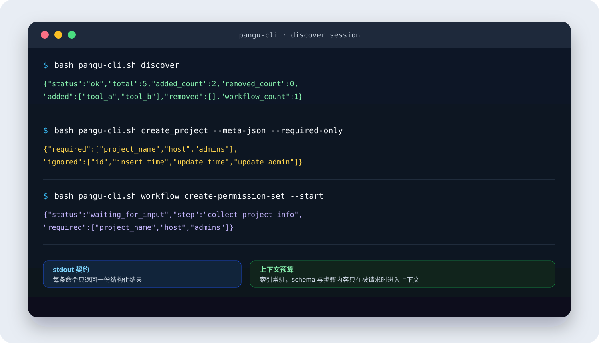

CLI 内部完成的工作更多：

1. 获取当前工具列表并计算新增、移除项。
2. 为新工具生成独立的 `.meta` 文件。
3. 从参数描述中提取枚举，写入 `ENUM` 规则。
4. 识别 `id`、`update_time` 等系统字段，生成 `IGNORE` 规则。
5. 扫描 `workflows/` 并重建统一索引。

例如 `create_project` 的规则文件可以是：

```text
IGNORE:id
IGNORE:insert_time
IGNORE:update_time
IGNORE:update_admin
NOTE:host 必须是已加入白名单的有效域名
ENUM:auth_mode:0-预鉴权,1-SDK接入,2-openapi接入,3-未接入  #auto
```

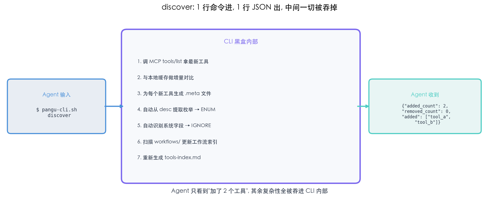

这部分设计的价值很具体：后端新增工具后，Skill 不必同步修改一大段提示词；Agent 也不必在尚未使用工具时读取其全部参数。自动识别规则只能处理模式明确的字段，业务语义仍需要人工补充 `NOTE` 或校验逻辑，这一点不能省略。

## 五、Workflow：把多工具调用变成可恢复流程

单个工具稳定后，剩下的问题是组合。用户通常不会说「依次调用 `create_project` 和 `create_role`」，而会说「帮我搭一套权限体系」。后者涉及步骤顺序、前后数据依赖、用户确认和中断恢复。

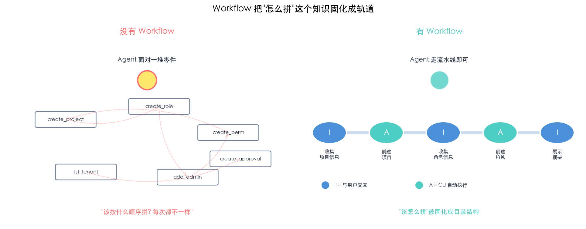

Workflow 负责把高层意图映射到一条已经定义的执行路径：

```text
创建权限集
  → 收集项目信息
  → 创建项目
  → 收集角色信息
  → 创建角色
  → 展示执行摘要
```

discover 生成的索引把 Workflow 放在原子工具之前。匹配逻辑也遵循这一优先级：先查是否存在覆盖完整需求的 Workflow，没有命中时再退回单个工具。这样能避免 Agent 临时拼装一条未经验证的多工具路径。

### 5.1 文件系统是流程定义的一部分

Workflow 不写死在 CLI 代码里，而是一组 Markdown 文件：

```text
workflows/create-permission-set/
├── WorkFlow.md
└── references/
    ├── 01-collect-project-info.md
    ├── 02-create-project.md
    ├── 03-collect-role-info.md
    ├── 04-create-role.md
    └── 05-summary.md
```

`WorkFlow.md` 保存名称与描述；步骤文件通过 YAML front matter 声明类型、Gate 和 automation，正文则保存该步骤需要给 Agent 的说明。文件名前缀决定执行顺序。

新增 Workflow 时，不需要修改 `SKILL.md` 或 CLI 的核心逻辑。把目录放入 `workflows/` 后，下一次 discover 会把它加入索引。业务人员仍要理解字段和依赖关系，但不必进入状态机实现内部。

### 5.2 Workflow 与 Skill 的结构同构

| Skill | Workflow |
| --- | --- |
| `SKILL.md` 描述能力入口 | `WorkFlow.md` 描述流程入口 |
| `references/` 保存分步说明 | `references/` 保存步骤定义 |
| 由 CLI 触发 | 由 CLI 启动和推进 |
| 激活时进入发现流程 | discover 时进入工作流索引 |

这种同构让已有资产可以迁移。一个稳定的 `permission-set-skill` 可以把步骤文档转为另一个 Skill 的 Workflow；成熟 Workflow 也可以独立为单独的 Skill。迁移并非完全零成本，至少需要复核工具名、模板路径、Gate 字段和权限边界，但不必重写全部业务说明。

### 5.3 三类约束决定 Workflow 是否可靠

| 约束 | 未显式建模时的结果 | 对应机制 |
| --- | --- | --- |
| 流程顺序 | 跳步、乱序或遗漏 | 步骤文件与状态机 |
| 步间数据 | 字段遗失、串值或手工转抄错误 | state 与模板变量 |
| 中断恢复 | 会话结束后只能重头开始 | 持久化状态与 `--current` |

这三类问题无法靠一句「请严格按顺序执行」可靠解决。它们需要进入可验证的数据结构。

### 5.4 步进式披露：上下文只保留当前任务

流程一次性暴露五个步骤时，Agent 需要同时理解当前动作、未来动作和此前结果。我的实现把每一步拆成独立文件，并只保留两个推进命令：

- `--start`：创建运行实例，返回第一步。
- `--advance`：提交当前步骤数据，CLI 校验并返回下一步。

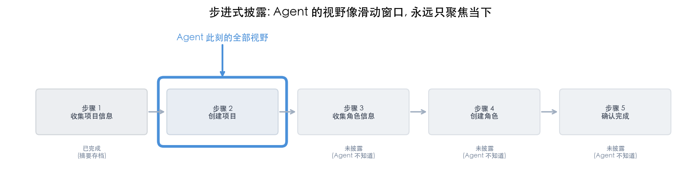

已完成步骤的数据写入 state，尚未执行的步骤不进入当前上下文。全局顺序由 CLI 状态机掌握，Agent 只需要完成眼前的交互或判断。修改流程也变成局部文件操作：添加一步就新增文件，调整顺序就修改文件名前缀。

### 5.5 Gate：把完成条件写成 schema

「收集基础信息」对 Agent 来说是开放指令。它可能漏问必填项，也可能加入后端不接受的字段。每个 interactive 步骤因此需要声明 Gate：

```yaml
---
id: collect-project-info
type: interactive
gate:
  schema:
    project_name: { type: string, required: true, desc: "项目名称" }
    host: { type: string, required: true, desc: "服务域名" }
    admins: { type: string, required: true, desc: "管理员 RTX" }
---
```

Agent 通过 `--advance --gate-data '{...}'` 提交字段，CLI 按顺序执行三项检查：

1. 缺少 required 字段时拒绝推进，并返回缺失项。
2. 丢弃 schema 未声明的字段。
3. 验证通过后写入 state，再进入下一步。

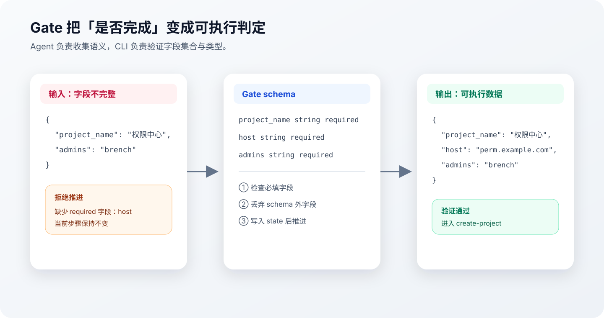

Gate 的作用不是让 Agent 变得更聪明，而是让「完成」拥有程序可判定的定义。Agent 可以用不同措辞向用户提问，但最终提交的数据必须满足同一份 schema。

### 5.6 状态持久化：恢复点不依赖会话上下文

IDE 关闭、网络中断或模型切换后，新的 Agent 会话不应依赖旧对话猜测进度。CLI 将运行状态写入 `.state` 文件，至少保存：

- 当前步骤与整体状态。
- 各 interactive 步骤提交的 Gate 数据。
- 各 automated 步骤的执行结果。
- 已完成、进行中或已中止等状态标记。

再次进入时，`--current` 直接返回恢复信息。新会话只需要知道当前步骤、已完成结果摘要和仍待收集的字段。

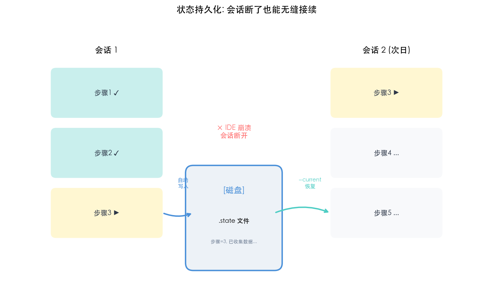

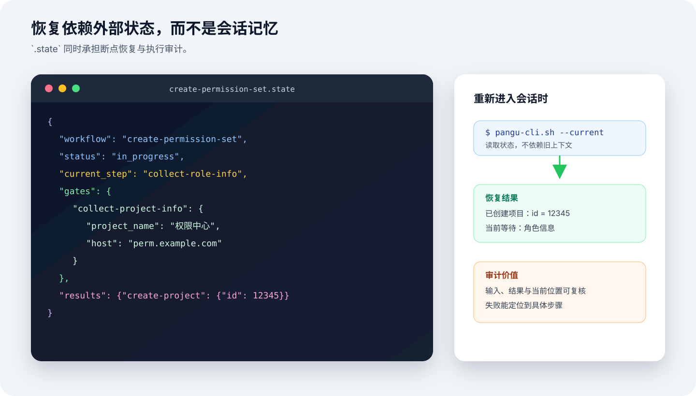

state 同时提供基础审计能力：某次执行用了什么输入、工具返回了什么、失败发生在哪一步，都可以直接检查。若状态文件包含敏感字段，还需要额外考虑脱敏、访问控制和保留周期；持久化本身不会自动解决安全问题。

### 5.7 模板变量：步间数据由 CLI 接力

`create-project` 需要使用前一步收集的 `project_name` 和 `host`。这类数据不应让 Agent 从对话中复制，而应在 automated 步骤中声明映射：

```yaml
---
id: create-project
type: automated
automation:
  tool: create_project
  input_mapping:
    name: "{{gate.collect-project-info.project_name}}"
    host: "{{gate.collect-project-info.host}}"
---
```

目前使用两类引用：

- `{{gate.<step-id>.<field>}}` 读取前序交互步骤的输入。
- `{{result.<step-id>.<path>}}` 读取前序自动步骤的工具结果。

CLI 从 state 取值、解析模板并调用工具。Agent 不需要记住字段来源，也不接触自动步骤的中间参数。模板路径错误应在 Workflow 发布前由 validator 检出，否则错误只会推迟到运行期出现。

### 5.8 步骤类型与控制权切换

Workflow 使用三种步骤类型：

| 类型 | 用途 | 执行者 |
| --- | --- | --- |
| `interactive` | 收集信息、选择或确认 | Agent 与用户 |
| `automated` | 调用工具完成原子操作 | CLI |
| `notification` | 展示阶段结果或最终摘要 | Agent |

Agent 提交 Gate 数据后，CLI 可以连续执行多个 automated 步骤，直到遇到下一个 interactive 或 notification 步骤才交还控制权：

```text
Agent 提交 project_name 与 host
  → CLI 校验 Gate
  → 解析 create_project 参数
  → 调用工具并写入结果
  → 若下一步仍为 automated，则继续
  → 遇到 interactive 后返回新步骤说明
```

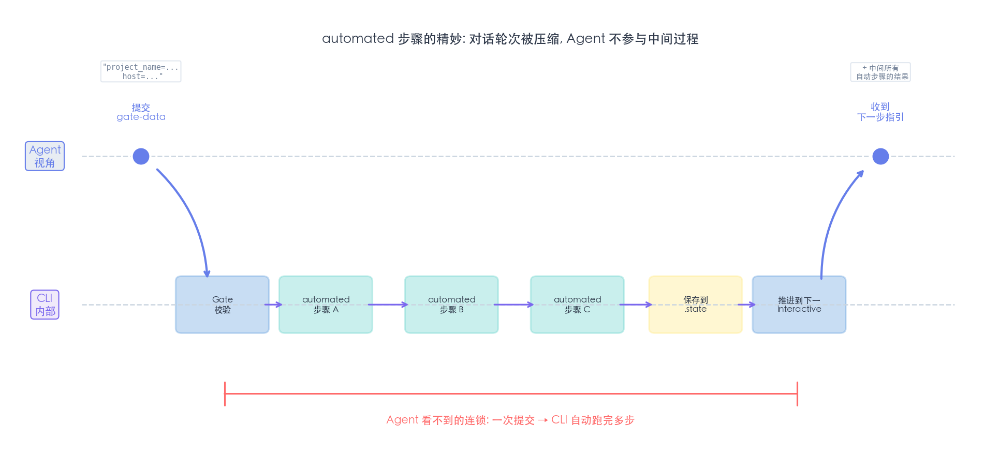

这样可以减少无意义的对话往返。需要注意，连续自动执行会扩大单次操作的影响范围；涉及删除、付费、发消息或权限变更时，应在 Workflow 中插入明确确认点，而不是依赖统一的连锁执行策略。

### 5.9 为什么流程定义选择 Markdown 文件

文件化定义带来的收益主要有四项：

- 业务说明、Gate 和 automation 可以在同一份步骤文件中审阅。
- Git diff 能显示具体哪个步骤发生变化。
- 步骤可以复制到其他 Workflow，再复核字段映射。
- 排序规则清晰，目录本身就能表达流程骨架。

代价也存在。文件命名承担逻辑后，重命名可能改变执行顺序；跨步骤引用增多后，静态校验器就不再是可选项。Markdown 适合承载流程定义，不代表它天然正确。

## 六、自举：用 workflow-creator 生成流程定义

运行时稳定后，手工创建 Workflow 成了新的重复劳动：建立目录、编写 front matter、设计 Gate、配置 automation、检查模板引用。这个过程同样具备固定步骤和明确格式，因此我又实现了 `workflow-creator`。

职责仍按相同原则拆分：

- Agent 分析业务描述，拆分步骤，决定类型并设计数据流。
- 配套 CLI 通过 `init`、`add-step` 和 `validate` 生成及检查文件。

```text
需求描述
  → Agent 设计步骤与字段
  → workflow-creator CLI 生成文件
  → validator 检查结构与引用
  → 运行时 CLI 执行 Workflow
```

这形成了一条自举链路，但「生成成功」不等于「业务正确」。权限边界、危险操作确认、字段语义和回滚策略仍应由熟悉业务的人审阅。

## 七、系统全景：不确定性被限制在哪一层

整套系统可以按职责划成三层：

1. 表现层由 Agent 承担，处理意图、信息收集、判断和表达。
2. 控制层位于 CLI 内部，负责 discover、Gate、步骤推进、模板解析和状态机。
3. 执行层负责 MCP、HTTP、文件读写、认证、重试和退出码。

MCP 后端是外部服务，不属于三层内部。Agent 与 CLI 使用 JSON 通信，CLI 再通过 JSON-RPC 或具体协议访问后端。

当前实现把控制层与执行层放在同一个 `pangu-cli.sh` 中：前者管理 discover、状态机和数据流，后者负责原子工具调用。它们在部署上共用一个入口，在职责上仍然需要分开，否则流程编排和协议细节会再次耦合。

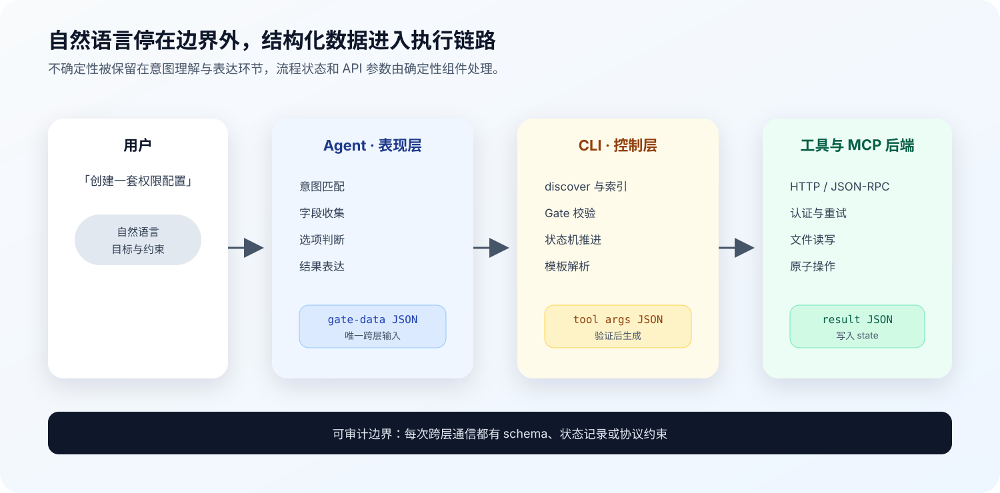

关键边界不在于「有没有 Agent」，而在于自然语言在哪里结束。进入控制层的数据应当已经结构化，并经过 schema 验证；工具结果在返回用户前可以由 Agent 解释，但原始结果和运行状态需要保留。

## 八、适用条件与尚未解决的问题

这套架构有明显成本。下面几类任务通常不需要完整 Workflow：

| 场景 | 更简单的实现 |
| --- | --- |
| 一问一答的单次查询 | 简短 `SKILL.md` 或直接工具调用 |
| 不超过两步且无需恢复 | 在 Skill 中写清顺序即可 |
| 原型验证 | 先证明工具和需求成立，再决定是否引入状态机 |
| 纯知识问答 | 不增加执行层 |

工程化的信号也很容易识别：当提示词开始反复出现「务必先」「不要跳过」「必须在某步骤之前」，自然语言已经在模拟状态机。这时应考虑把顺序、完成条件和状态迁移到代码或结构化定义中。

当前方案仍有几项需要单独验证：

- discover 自动生成的 `IGNORE` 与 `ENUM` 是否存在误判，人工规则如何覆盖自动规则。
- automated 步骤失败后的重试幂等性、补偿操作和人工接管路径。
- `.state` 中敏感字段的加密、脱敏、权限和生命周期。
- Workflow 版本变化后，运行中的旧 state 如何迁移。
- 工具数量继续增长时，索引检索质量和 token 成本如何量化。

我更看重这些问题，因为它们决定该设计能否离开 demo。下一步如果要评估效果，应记录任务完成率、平均对话轮次、工具调用失败率、恢复成功率和上下文 token，而不是只比较「感觉更稳定」。

## 结论

这套 Skill 工程化方案的核心，是把提示词中的操作性约束逐项迁移出去：字段要求变成 Gate，步骤顺序变成状态机，跨步依赖变成模板引用，跨会话记忆变成 state，工具发现变成 CLI 的同步过程。

Agent 仍然是系统里处理语义的部分。它没有被替换，也没有因此获得确定性；变化发生在执行边界。只要流程可以校验、状态可以恢复、结果可以追踪，模型偶尔出现不同表达或不同判断路径就不再等于整个任务失控。

这比继续扩写一份 200 行提示词更接近我需要的「把 Agent 当作算法使用」。
