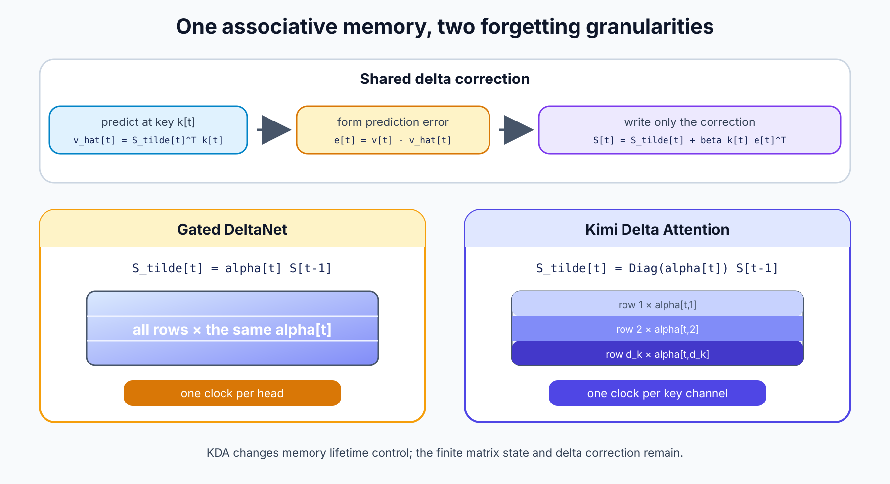
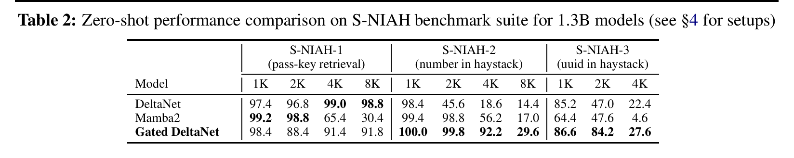
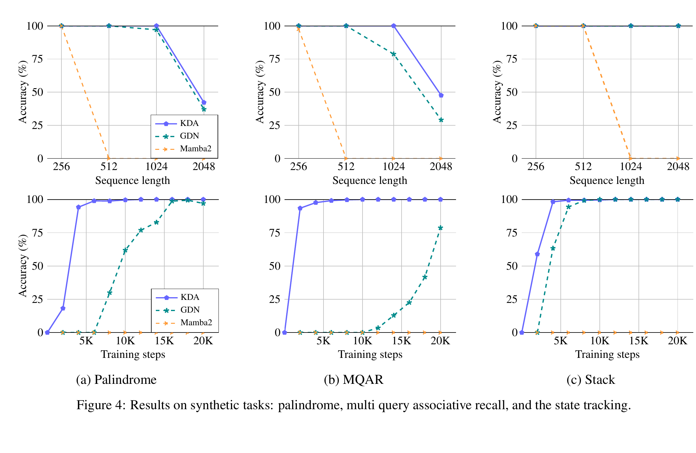
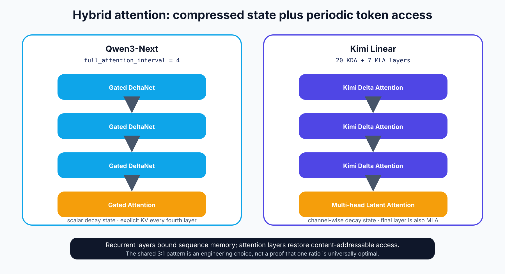
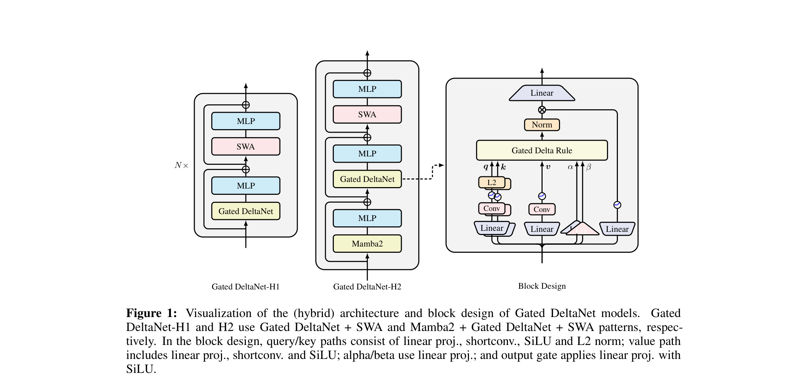
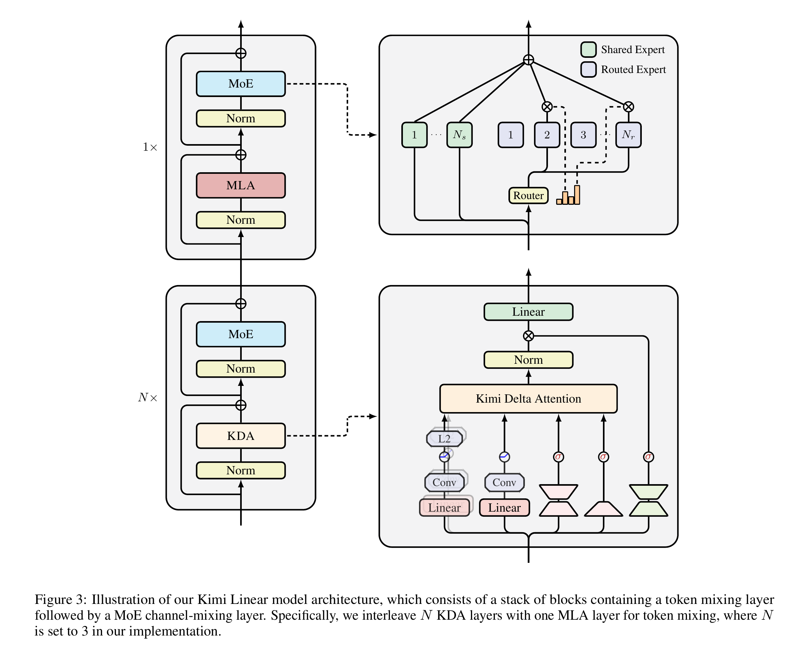

## 核心判断

理解 Qwen 的 Gated DeltaNet（GDN）与 Kimi Delta Attention（KDA），不必先从 kernel 展开。两者都把历史压进固定形状的关联记忆矩阵 $S_t$，用当前 key 检查旧记忆的预测，再把 prediction error 写回。真正的分界只有一处：GDN 为每个 head 使用一个标量遗忘门，KDA 把它扩展为每个 key 通道一个衰减系数。

这个改动提高了有限状态的管理粒度，却没有把有限状态变成无限容量。Qwen3-Next 和 Kimi Linear 因此都没有完全移除 Softmax 注意力，而是采用约 3:1 的混合层：递推层承担大部分长序列传播，完整注意力层周期性恢复逐 token 的内容寻址。更准确的说法不是“全局语义不会丢失”，而是模型保留了一条重新访问显式历史位置的路径。

本文只讨论机制、模型配置与公开推理实现。两份对话 JSON 用来确定问题顺序，不作为事实来源。更完整的实验与 kernel 推导见 [Kimi Linear 与 KDA](kimi-linear-kda.qmd)，Qwen 版本演进见 [从 Qwen 到 Qwen3.6](../llms/from-qwen-to-qwen3-6.qmd)。

## 1. 共同起点：Delta Rule 是一次在线纠错

令 $k_t,q_t\in\mathbb{R}^{d_k}$、$v_t\in\mathbb{R}^{d_v}$，状态矩阵 $S_t\in\mathbb{R}^{d_k\times d_v}$。最简单的线性注意力把每个键值外积累加进状态：

$$
S_t=S_{t-1}+k_tv_t^{\top},
\qquad
o_t=S_t^{\top}q_t.
$$

问题在于相近的 key 会反复写入同一方向。DeltaNet 先计算旧状态在当前 key 上的预测，再只写入残差：

$$
\hat v_t=S_{t-1}^{\top}k_t,
\qquad
S_t=S_{t-1}+\beta_tk_t\left(v_t-\hat v_t\right)^{\top}.
$$

$\beta_t$ 可以理解为本次在线更新的学习率。更新不是把 $k_tv_t^{\top}$ 盲目叠加到旧状态，而是沿 $k_t$ 指向的地址修正已有映射。不过，Delta Rule 只处理“怎样覆盖”，没有回答“哪些长期未命中的内容应该衰减”。GDN 与 KDA 都在更新前加入遗忘。

{width="95%" fig-align="center" fig-alt="自制状态更新对照图：Gated DeltaNet 对整个 head 使用同一个 alpha，KDA 对每个 key 通道使用独立 alpha"}

*自制示意图。公式依据 [Gated DeltaNet](https://arxiv.org/abs/2412.06464) §3 与 [Kimi Linear](https://arxiv.org/abs/2510.26692) §2–§3。*

## 2. GDN 与 KDA：差别在遗忘门的形状

Gated DeltaNet 先用标量 $\alpha_t\in(0,1)$ 衰减整个 head 的状态，再执行 Delta Rule：

$$
\widetilde S_t=\alpha_tS_{t-1},
\qquad
S_t=\widetilde S_t+\beta_tk_t
\left(v_t-\widetilde S_t^{\top}k_t\right)^{\top}.
$$

同一 head 内的所有 key 通道共享一个时间尺度。门变小会同时清理旧信息，也可能伤害仍需保留的关联；门接近 1 有利于长期保持，却更容易积累冲突。Gated DeltaNet 论文的 S-NIAH 对照把这个矛盾展示得很清楚：无衰减的 DeltaNet 在简单 pass-key 长期保持上更强，带门模型在需要过滤干扰内容的 number/UUID 设置上更稳。

{width="95%" fig-align="center" fig-alt="Gated DeltaNet 论文 Table 2，对比 DeltaNet、Mamba2 和 Gated DeltaNet 在 pass-key、number 与 UUID needle-in-a-haystack 任务上的准确率"}

*来源：[Gated DeltaNet](https://arxiv.org/abs/2412.06464)，Table 2，第 5 页。该表是 1.3B 模型的论文结果，不是本文复现。*

KDA 把标量改成 $\alpha_t\in(0,1)^{d_k}$，沿状态的 key 维逐行衰减：

$$
\widetilde S_t=\mathrm{Diag}(\alpha_t)S_{t-1},
\qquad
S_t=\left(I-\beta_tk_tk_t^{\top}\right)\widetilde S_t
+\beta_tk_tv_t^{\top}.
$$

因此，一个 head 可以让部分地址快速遗忘、部分地址缓慢衰减。KDA 增加的是遗忘分辨率，不是状态矩阵的秩或尺寸。若大量相似 key 竞争同一子空间，通道级门只能更精细地分配容量，不能消除压缩造成的信息冲突。

Kimi Linear 的小模型实验显示，KDA 在 Palindrome、MQAR 与 Stack 三个合成任务上比 GDN 更快收敛，并在较长序列上保持更高准确率。该结果支持“细粒度衰减更容易学习”这一解释，但不能推出任意长文本都可无损压入固定状态。

{width="95%" fig-align="center" fig-alt="Kimi Linear 论文 Figure 4，比较 KDA、GDN 和 Mamba2 在 Palindrome、MQAR 与 Stack 任务上的准确率和收敛速度"}

*来源：[Kimi Linear](https://arxiv.org/abs/2510.26692)，Figure 4，第 7 页。实验使用 2 层、2 个 head、head dimension 128 的受控小模型。*

## 3. 为什么两种模型都保留完整注意力

递推状态的优势是解码时不必在每个线性注意力层保存随上下文增长的 KV Cache。代价也很直接：$S_t$ 的形状固定，历史必须在线压缩。完整注意力保留逐 token 的 key/value，当前 query 可以重新访问很早以前的具体位置，但计算和缓存随序列长度增长。

{width="95%" fig-align="center" fig-alt="自制混合结构对照图：Qwen3-Next 重复三层 Gated DeltaNet 和一层 Gated Attention，Kimi Linear 主要重复三层 KDA 和一层 MLA"}

*自制示意图。层配置依据固定版本的官方模型配置。*

[Qwen3-Next-80B-A3B-Instruct 配置](https://huggingface.co/Qwen/Qwen3-Next-80B-A3B-Instruct/blob/9c7f2fbe84465e40164a94cc16cd30b6999b0cc7/config.json)包含 48 层与 `full_attention_interval = 4`。Transformers 据此生成三层 `linear_attention` 加一层 `full_attention` 的周期，即 36 层 GDN 与 12 层 Gated Attention。这里的 Gated Attention 仍是 token-to-token Softmax attention，只是在输出路径增加门控。

[Kimi-Linear-48B-A3B-Instruct 配置](https://huggingface.co/moonshotai/Kimi-Linear-48B-A3B-Instruct/blob/e1df551a447157d4658b573f9a695d57658590e9/config.json)明确列出 20 个 KDA 层与 7 个 MLA 层：MLA 位于第 4、8、12、16、20、24、27 层。前 24 层遵循 3:1 周期，末层再次使用 MLA，所以精确计数是 20:7。两者都把完整注意力当作内容寻址通道，而不是声称递推状态已替代全部历史。

{width="92%" fig-align="center" fig-alt="Gated DeltaNet 论文 Figure 1，展示 GDN 与滑窗注意力的混合结构，以及包含 q、k、v、alpha、beta 和 output gate 的 GDN block"}

*来源：[Gated DeltaNet](https://arxiv.org/abs/2412.06464)，Figure 1，第 7 页。论文原始混合模型使用 SWA；Qwen3-Next 后来采用三比一的 GDN/Gated Attention 周期。*

{width="90%" fig-align="center" fig-alt="Kimi Linear 论文 Figure 3，展示三层 KDA 加一层 MLA 的混合骨干、MoE 与 KDA block"}

*来源：[Kimi Linear](https://arxiv.org/abs/2510.26692)，Figure 3，第 6 页。*

## 4. 源码怎样对应公式

公开实现可以压缩成下面几行伪代码。`decay` 的广播维度决定它是 GDN 还是 KDA：

```python
decayed_state = exp(decay_t) * state
prediction = key_t @ decayed_state
delta = beta_t * (value_t - prediction)
state = decayed_state + outer(key_t, delta)
output_t = query_t @ state
```

在 [Transformers Qwen3-Next 实现](https://github.com/huggingface/transformers/blob/c587bc884db2c2e31fc2b8102314656b17aa07b1/src/transformers/models/qwen3_next/modeling_qwen3_next.py#L377-L574)中，GDN 的 `decay` 输入形状是 `[batch, sequence, heads]`，进入 kernel 前转为 `[batch, heads, sequence]`，再对状态最后两个维度广播；recurrent 路径逐 token 执行上述更新，chunk 路径把块内依赖整理成三角系统，再按 chunk 传递状态。[配置实现](https://github.com/huggingface/transformers/blob/c587bc884db2c2e31fc2b8102314656b17aa07b1/src/transformers/models/qwen3_next/configuration_qwen3_next.py#L123-L138)负责生成 3:1 层类型。

FLA 的 [GatedDeltaNet layer](https://github.com/fla-org/flash-linear-attention/blob/864a87f6ce5be8828bef81eb22baafd41937cdf2/fla/layers/gated_deltanet.py)同样在训练时选择 chunk kernel，在短序列推理时选择 fused recurrent kernel。它还包含 ShortConv、Q/K L2Norm、$\beta_t$ 与 output gate；递推式不是完整 block 的全部计算。

FLA 的 [KimiDeltaAttention layer](https://github.com/fla-org/flash-linear-attention/blob/864a87f6ce5be8828bef81eb22baafd41937cdf2/fla/layers/kda.py)把门宽度设为 `num_value_heads * head_k_dim`，对应 `[batch, sequence, heads, d_k]` 的通道级 log-decay。其 chunk/recurrent 两条执行路径与 GDN 相似，差异集中在门的生成、广播方式和专用 KDA kernel。源码能证明张量形状与执行流，不能证明训练质量或官方吞吐数字在其他硬件上仍成立。

## 5. 效果与性能边界

两种结构共享四个限制。

第一，固定状态存在容量上限。它适合累积主题、近期依赖和可压缩统计，但精确复制、多个相似 key、很早以前的 UUID 或代码标识符仍可能发生冲突。混入完整注意力只能提供额外检索路径，不能保证任意信息都被后续层恢复。

第二，$O(T)$ 不等于低延迟。训练需要 chunkwise 算法和定制 kernel 才能利用 GPU；短序列下，成熟的 FlashAttention 可能比包含卷积、门控、归一化和状态更新的递推层更快。完整模型还受 MoE、通信、batch 和调度限制。

第三，混合模型并非完全摆脱 KV Cache。Qwen 的 Gated Attention 层和 Kimi 的 MLA 层仍保存长度相关缓存，只是需要缓存的层数减少。3:1 是两套模型各自验证过的工程点，不是线性注意力的普遍最优比例。

第四，遗忘门承担真实取舍。GDN 的标量门更便宜，却让整个 head 共用时间尺度；KDA 的通道门更灵活，也增加投影、带宽和优化复杂度。KDA 的优势应落在受控对比上，而不是从公式维度直接推导为端到端收益。

## 结论

GDN 与 KDA 都可看成 inference-time 的小型在线回归器：状态根据当前 key 对 value 的预测误差持续修正。GDN 给每个 head 一个遗忘时钟，KDA 给每个 key 通道独立时钟。后者提高了有限状态的使用效率，但没有取消容量边界。

Qwen3-Next 与 Kimi Linear 最有参考价值的共同选择，是承认这条边界。大多数层用递推状态控制长上下文成本，少数完整注意力层保留显式历史访问。评估这类架构时，应把状态容量、完整注意力比例、kernel 成熟度和实际服务 batch 放在一起，而不是只比较 $O(T)$ 与 $O(T^2)$。

## 参考资料

- Yang et al. [Gated DeltaNet: Improving Mamba2 with Delta Rule](https://arxiv.org/abs/2412.06464), 2024.
- Kimi Team. [Kimi Linear: An Expressive, Efficient Attention Architecture](https://arxiv.org/abs/2510.26692), 2025.
- Qwen Team. [Qwen3-Next: Towards Ultimate Training & Inference Efficiency](https://qwen.ai/blog?from=research.latest-&id=4074cca80393150c248e508aa62983f9cb7d27cd).
- [Hugging Face Transformers Qwen3-Next implementation](https://github.com/huggingface/transformers/tree/c587bc884db2c2e31fc2b8102314656b17aa07b1/src/transformers/models/qwen3_next).
- [Flash Linear Attention Gated DeltaNet and KDA layers](https://github.com/fla-org/flash-linear-attention/tree/864a87f6ce5be8828bef81eb22baafd41937cdf2/fla/layers).
