## 摘要与核心判断

[Kimi Linear](https://arxiv.org/abs/2510.26692) 想解决的不是“怎样把 Softmax 近似得更便宜”，而是一个更具体的问题：固定大小的线性注意力状态该怎样有选择地忘记，又怎样在 GPU 上并行训练。论文给出的 Kimi Delta Attention（KDA）把 Gated DeltaNet 的单个衰减系数改成通道向量，让状态矩阵每一行拥有不同的时间尺度；同时把更新限制在一种特殊的对角加低秩（DPLR）形式，从而省掉通用算法里的二次分块和若干矩阵乘法。Kimi Linear 再把三层 KDA 与一层 MLA 交错，让大部分层承担固定状态的压缩记忆，少数完整注意力层保留逐 token 检索能力。

这篇论文容易被几个醒目的数字带偏。1.4T token 是三种架构的公平对照口径；5.7T token 是发布模型的训练量；1M token 是后续长上下文阶段给出的最大窗口。它们不是同一个实验。效率数字也分三类：论文 Figure 7 的单请求、batch size 1 解码在 1M 上下文约为 2.2 倍；Figure 1 在允许更大批量后给出 6.3 倍 TPOT；最多 75% KV cache 节省说的是缓存容量。延迟、批处理吞吐和显存占用不能互相替换。

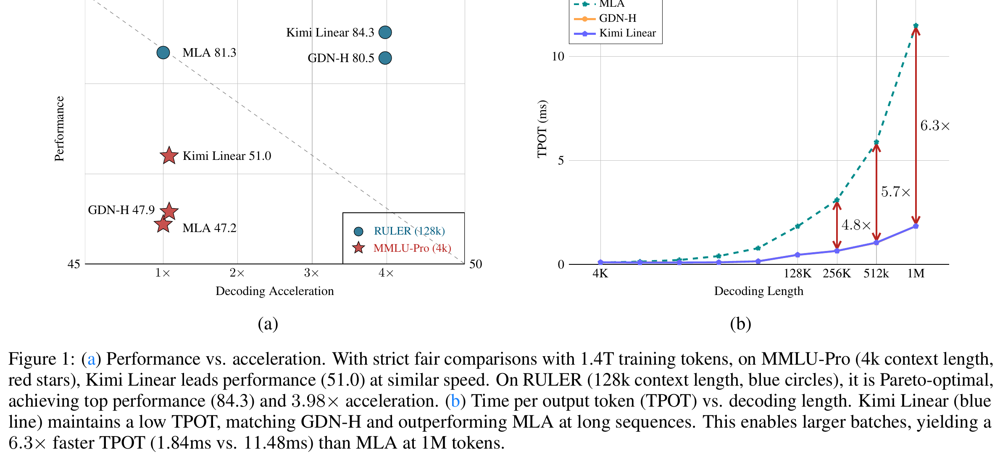{fig-alt="Kimi Linear 论文 Figure 1，左图比较 MLA、GDN-H 与 Kimi Linear 的性能和解码加速，右图比较不同上下文长度的 TPOT"}

*来源：[Kimi Linear](https://arxiv.org/abs/2510.26692)，Figure 1，第 1 页；PDF 矢量页按约 5×、360 DPI 裁切。*

我的核心判断有五点。第一，KDA 真正新增的是“遗忘分辨率”，不是无限记忆容量；固定矩阵仍会发生压缩和干扰。第二，3:1 混合不是退让，而是用少量 MLA 纠正纯线性状态难以精确回看的结构性弱点。第三，1.16 倍 scaling efficiency 是可信但克制的训练收益，不能改写成 6 倍训练加速。第四，论文的系统收益依赖 kernel、层比例、并行策略和批处理条件，单看递推式无法复现。第五，后续 FlashKDA、Gated DeltaNet-2 与 Preconditioned DeltaNet 恰好暴露了 KDA 的三个边界：kernel 仍可深挖，擦除与写入共用一个标量门，delta rule 仍是忽略回归曲率的一阶更新。

## 1. 先划证据边界：同一名称下有三套模型口径

论文主实验把 Kimi Linear、混合 Gated DeltaNet（GDN-H）和 MLA 做严格对照：架构规模、参数量、训练设置一致，每个模型训练 1.4T token。Figure 1、Table 5 和强化学习比较主要属于这个口径。因此，“Kimi Linear 在 RULER 得到 84.3”“平均长上下文分数 54.5”“RL 曲线优于 MLA”首先是 1.4T 对照模型的结论，不应自动转移到任意规模或任意实现。

发布的 [Kimi-Linear-48B-A3B-Instruct](https://huggingface.co/moonshotai/Kimi-Linear-48B-A3B-Instruct) 是另一套口径。模型卡写明 5.7T token 预训练、48B 总参数、约 3B 激活参数，并提供 1M 上下文配置。5.7T 说明训练数据量，1M 说明窗口上限，两者都没有把 1.4T 实验作废；相反，公平消融仍要回到较小、控制变量更严格的版本。发布权重适合验证推理与代码路径，却不能替代论文中的因果对照。

第三套口径是后论文工程。官方仓库最初把训练算子建立在 [Flash Linear Attention（FLA）](https://github.com/fla-org/flash-linear-attention) 上，2026 年又发布 [FlashKDA](https://github.com/MoonshotAI/FlashKDA)。后者改变了分块大小、状态精度与 kernel 组织。它回答“同一 KDA 算子还能跑多快”，并不重新证明模型质量。把 FlashKDA 的 2 倍左右 kernel 加速与论文的模型级 TPOT 相乘，也得不到可靠的端到端数字，因为调度、MoE、MLA 层、通信和显存带宽都会成为新的瓶颈。

本文证据优先级是：论文与官方配置用于确认事实；官方 FLA/FlashKDA 代码用于确认实现路径；[知乎解读](https://zhuanlan.zhihu.com/p/1967632780847474121)、[科学空间的线性注意力简史](https://kexue.fm/archives/11033)、[MZeroMiko 的 KDA 推导](https://mzeromiko.github.io/blogs/Linear_Attention/5.%20kimi_linear/kda/)和[仿射变换推导](https://zhiyuan1i.github.io/en/posts/kda-mathematics/)只帮助比较解释方式。二手文章里出现的数字和因果说法，仍回查论文或代码。本文没有复现 1.4T 训练，也不把公开曲线写成独立实验结果。

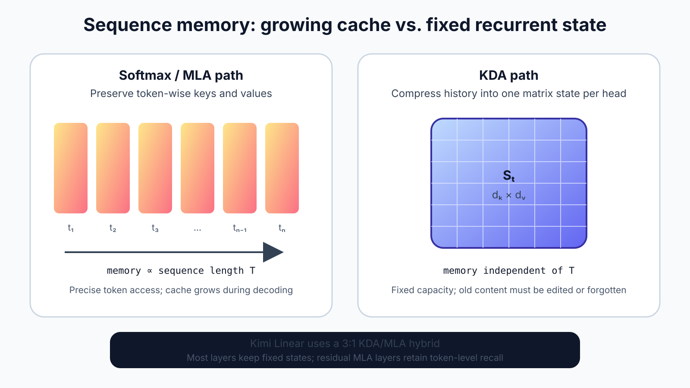{fig-alt="自制图，对比 Softmax 或 MLA 按 token 增长的 KV 缓存、KDA 固定矩阵状态，以及 Kimi Linear 的三比一混合结构"}

*自制图；依据 [Kimi Linear](https://arxiv.org/abs/2510.26692) §3–§4 与发布模型配置整理。*

图中“固定”只指状态尺寸不随序列长度增长，不表示信息无损。Softmax 注意力保存每个历史 token 的键值，可以重新分配注意力；KDA 把过去压缩进每头一个矩阵，解码显存不再线性增长，却必须在线决定什么保留、什么覆盖。线性注意力的核心矛盾正由此产生：省掉 token 级缓存后，模型要自己学会内存管理。

## 2. 从相关性累加到定向改写

先看最朴素的线性注意力。令查询、键、值分别为 $q_t\in\mathbb{R}^{d_k}$、$k_t\in\mathbb{R}^{d_k}$、$v_t\in\mathbb{R}^{d_v}$，状态 $S_t\in\mathbb{R}^{d_k\times d_v}$。忽略特征映射记号后，递推为：

$$
S_t = S_{t-1} + k_t v_t^{\top},
\qquad
o_t = S_t^{\top} q_t.
$$

把递推展开可得 $S_t=\sum_{i=1}^{t}k_iv_i^{\top}$。它把每个键—值关联直接相加，计算复杂度对序列长度是线性的，解码状态也是固定大小。但相似键会写入同一方向，新关联没有显式办法覆盖旧关联。状态容量有限时，“一直加”会积累串扰。

DeltaNet 引入 Widrow–Hoff delta rule。先用当前键从旧状态读出预测值 $\hat v_t=S_{t-1}^{\top}k_t$，再只写入目标与预测之间的残差：

$$
S_t
= S_{t-1}
+ \beta_t k_t\left(v_t-S_{t-1}^{\top}k_t\right)^{\top}.
$$

整理后得到：

$$
S_t
= \left(I-\beta_t k_tk_t^{\top}\right)S_{t-1}
+ \beta_t k_tv_t^{\top}.
$$

$\beta_t$ 控制一次编辑的强度。第一项沿当前键方向擦除旧预测，第二项写入新值。与盲目累加相比，它像一个按地址改写的关联记忆。不过，不被当前 $k_t$ 命中的旧方向依然长期滞留。Gated DeltaNet 因此再乘一个标量衰减 $\alpha_t$，使整个状态可以随 token 忘记：

$$
S_t
= \alpha_t\left(I-\beta_t k_tk_t^{\top}\right)S_{t-1}
+ \beta_t k_tv_t^{\top}.
$$

问题在于同一注意力头的所有键通道共享 $\alpha_t$。若一部分通道记录局部语法，另一部分通道记录跨段实体，它们仍被同一个时钟缩放。KDA 的改动是把标量变成向量 $\alpha_t\in(0,1)^{d_k}$，并让它作用在状态的键维：

$$
S_t
= \left(I-\beta_t k_tk_t^{\top}\right)
  \mathrm{Diag}(\alpha_t)S_{t-1}
+ \beta_t k_tv_t^{\top},
\qquad
o_t=S_t^{\top}q_t.
$$

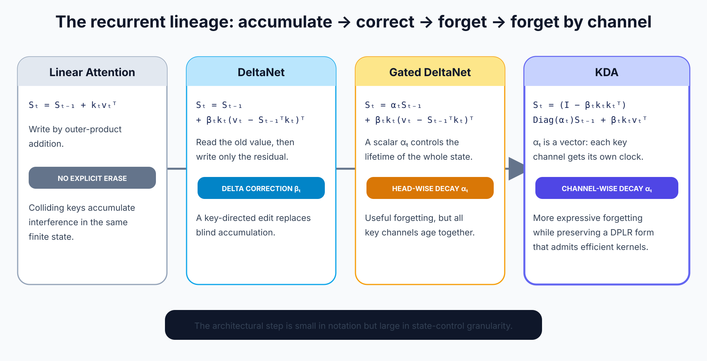{fig-alt="自制递推谱系图，从线性注意力累加、DeltaNet 残差改写、Gated DeltaNet 标量衰减到 KDA 通道级衰减"}

*自制图；公式依据 [Kimi Linear](https://arxiv.org/abs/2510.26692) §2–§3 与 [Gated DeltaNet](https://arxiv.org/abs/2412.06464)。*

这个写法有一个容易忽略的顺序：先用 $\mathrm{Diag}(\alpha_t)$ 衰减旧状态，再用 $I-\beta_tk_tk_t^{\top}$ 沿当前键擦除，最后写入 $\beta_tk_tv_t^{\top}$。衰减向量位于左侧，所以它缩放的是键通道对应的行，不是值维对应的列。将 $\alpha_t$ 说成“每个神经元一个遗忘门”过于含混，更准确的说法是“每个注意力头、每个键通道一个衰减系数”。

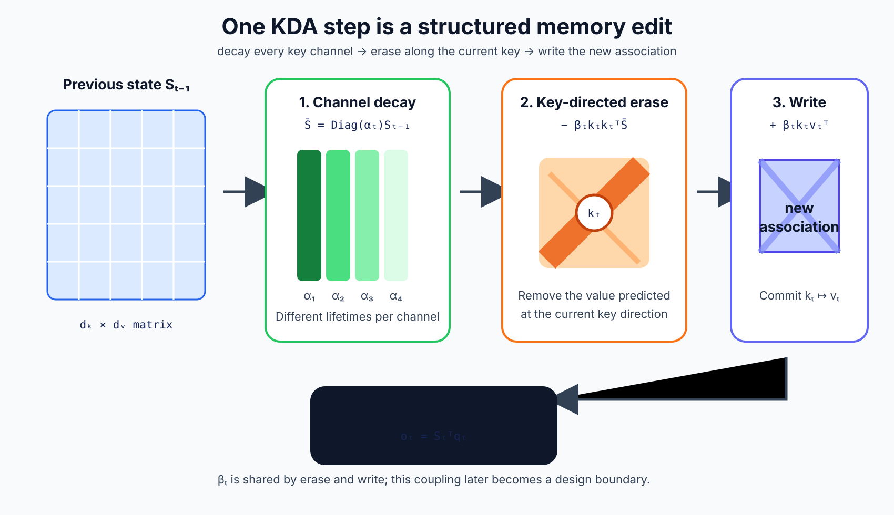{fig-alt="自制 KDA 状态编辑图，依次展示通道级 alpha 衰减、beta 与键方向控制的擦除、键值外积写入和查询读出"}

*自制图；依据论文 Equation 10 重绘。*

把更新写成“衰减—擦除—写入”有助于理解，但不要把三步当成三个独立可学习门。KDA 中 $\alpha_t$ 是通道向量，$\beta_t$ 仍是标量，而且同一个 $\beta_t$ 同时控制擦除与写入。如果模型想强烈清除旧值、谨慎写入新值，原始参数化无法直接表达。这个耦合后来正是 Gated DeltaNet-2 的出发点。

## 3. 从逐 token 递推到 WY/UT 分块并行

递推式适合解码，却不适合长序列训练。若严格按 $t=1,2,\ldots,T$ 更新状态，GPU 每一步只能做很小的矩阵操作，前一步结束后下一步才能开始。线性复杂度不等于硬件高效；一个串行的 $O(T)$ 算法可能比高度并行的注意力更慢。

KDA 属于 DPLR 状态转移：

$$
S_t = \left(D_t-a_tb_t^{\top}\right)S_{t-1}+u_tv_t^{\top},
$$

其中 KDA 对应

$$
D_t=\mathrm{Diag}(\alpha_t),
\qquad
a_t=\beta_tk_t,
\qquad
b_t=k_t\odot\alpha_t,
\qquad
u_t=\beta_tk_t.
$$

一般 DPLR 算法把一个 chunk 内多次“对角减秩一”变换合并为紧凑的 WY 表示。设块内状态转移乘积为 $P_{[l:r]}$，算法不逐项显式构造所有乘积，而是把对角累计项与低秩校正项整理为三角系统，再用矩阵乘法同时计算一块 token 的输出。UT 表示可看成同一思想的转置/上三角组织，用于把依赖关系映射到 GPU 擅长的 GEMM 与三角求解。

关键不是背下某一版展开式，而是看 KDA 施加了什么约束。通用 DPLR 的 $D_t$、$a_t$、$b_t$ 相互独立，计算块内乘积时需要再次把若干中间量分成更小的 secondary chunks，以控制中间矩阵和依赖。KDA 里 $b_t=k_t\odot\alpha_t$ 与 $D_t$、$k_t$ 共享结构，论文据此消除两次 secondary chunking，并减少大约三次矩阵乘法。它没有取消递推，而是把递推压缩成“块内并行、块间传状态”。

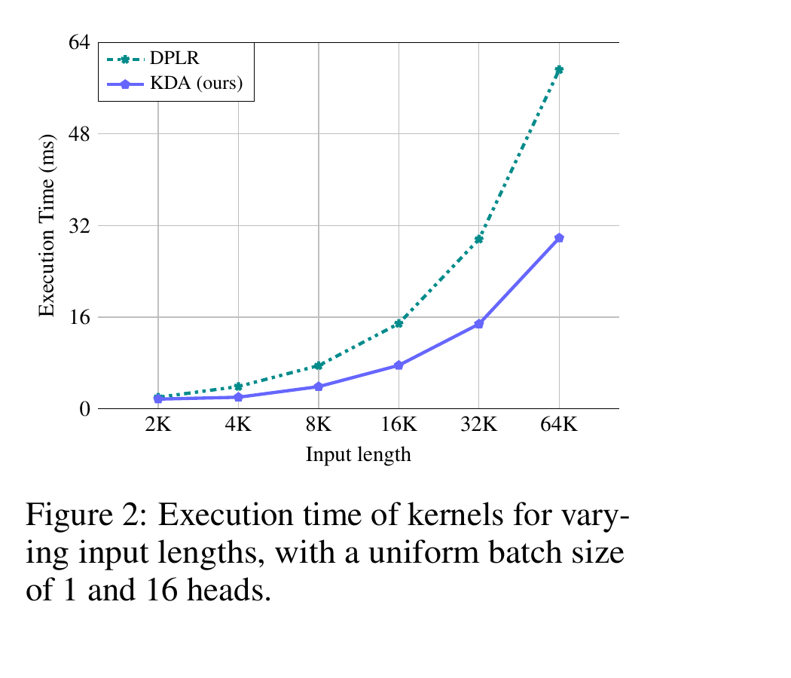{fig-alt="Kimi Linear 论文 Figure 2，KDA 专用 kernel 与通用 DPLR kernel 在 2K 到 64K 输入长度下的执行时间曲线"}

*来源：[Kimi Linear](https://arxiv.org/abs/2510.26692)，Figure 2，第 5 页；PDF 矢量页按约 5×、360 DPI 裁切。*

Figure 2 的设置是 batch size 1、16 个头，比较的是 kernel 执行时间，不是完整 48B MoE。64K 时 KDA 曲线约为通用 DPLR 的一半，能说明结构化参数带来的算子收益，但不能直接推出端到端模型快两倍。完整模型还包含投影、卷积、归一化、门控、MoE、MLA 层与通信。

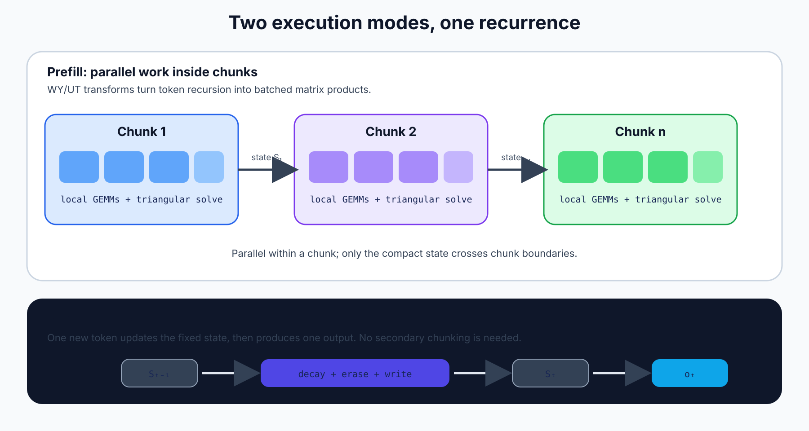{fig-alt="自制 KDA chunkwise 数据流，prefill 在每个块内以矩阵乘法并行并跨块传递固定状态，decode 使用融合递推 kernel 逐 token 更新"}

*自制图；依据论文 §3.2、附录算法与 FLA 的 KDA kernel 路径整理。*

这里还有一个工程上的精度问题。块算法改变了运算结合顺序，低精度下不一定与逐 token recurrence 位级一致。验证不能只测速度，至少要比较前向输出、最终状态和反向梯度，并覆盖长序列、极端衰减、可变长度批次。FlashKDA 后来选择 BF16 存储状态、FP32 执行 FMA，正是在显存带宽和累计误差之间取折中。

## 4. KDA 不是单独一条公式：完整 block 怎样组装

论文的 KDA block 先从隐藏状态投影出 $q,k,v$。三条路径都经过短深度卷积（ShortConv）和 Swish/SiLU，使当前 token 在进入递推前获得很小的局部感受野。$q$、$k$ 再做 L2 归一化，避免键范数同时承担“地址方向”和“写入强度”两个角色。$\beta_t$ 由单独投影和 sigmoid 产生；$\alpha_t$ 采用低秩 decay projection，先投影到较小维度，再映射到每头每个键通道，以免直接生成 $H\times d_k$ 个门带来过多参数和带宽。

衰减通常在对数域参数化，使 $\alpha_t$ 落在 $(0,1)$ 且能表示接近 1 的长时间尺度。概念上可写为：

$$
g_t=-\exp(A)\odot\mathrm{softplus}(z_t+b),
\qquad
\alpha_t=\exp(g_t).
$$

这里 $g_t$ 非正，因而衰减不会把旧状态放大。当前 FLA 实现的符号和张量布局会随版本变化，阅读代码时应确认最终传给 kernel 的是对数衰减还是已经指数化的 $\alpha_t$，不要仅凭变量名判断。

递推输出先做 head-wise RMSNorm，再乘 sigmoid output gate，最后线性投影回模型维度。output gate 负责选择哪些递推结果送回残差流；它不同于 $\alpha_t$ 的记忆寿命，也不同于 $\beta_t$ 的擦写强度。Table 1 中移除 output gate 的验证 PPL 从 5.65 变成 5.67，改成 Swish gate 则变成 5.81，说明门的形式在该设置下不是随意可换。

{fig-alt="Kimi Linear 论文 Figure 3，左侧为三层 KDA 加一层 MLA 的混合骨干，右侧为 MoE 和 KDA block 的投影卷积归一化门控路径"}

*来源：[Kimi Linear](https://arxiv.org/abs/2510.26692)，Figure 3，第 6 页；PDF 矢量页按约 5×、360 DPI 裁切。*

模型不把所有注意力都替换成 KDA，而是按 3:1 插入 MLA。发布配置有 27 个 token mixer：20 个 KDA 层位于 1–3、5–7，依此类推；7 个 MLA 层位于 4、8、12、16、20、24、27。最后一层使用 MLA，所以严格计数是 20:7，而不是把 27 简化为整数 3:1。配置还给出 2304 隐藏维、KDA 32 个头、每头 128 维、256 个路由专家且每 token 选择 8 个，并加入共享专家。论文 1.4T 对照与发布 checkpoint 的细节不完全相同，层数事实应注明来自当前配置。

Kimi Linear 采用 NoPE。对 KDA 而言，递推本身具有时间方向，状态更新顺序已经编码因果关系；对 MLA 而言，移除 RoPE 使长上下文扩展不再依赖频率基数或 YaRN 一类重标定，并可在推理时转向更简单的 MQA 形式。代价是模型失去显式相对位置旋转，必须从层次、卷积和内容中学习距离。Table 5 中 NoPE 版本平均 54.5，高于 RoPE 版本 51.8，但单项并非全赢，不能由这张表得出“NoPE 普遍优于 RoPE”。

## 5. 实验一：合成任务证明了什么，又没有证明什么

回文、Multi-Query Associative Recall（MQAR）和栈状态跟踪分别测试精确复制、键值召回与状态机更新。论文用 2 层、2 头、头维 128 的小模型，训练最多 20K step，并对学习率网格搜索。上排改变序列长度并报告最佳训练精度，下排固定长度 1024 看收敛速度。

{fig-alt="Kimi Linear 论文 Figure 4，KDA、GDN 和 Mamba2 在 Palindrome、MQAR、Stack 三个合成任务上的序列长度泛化与训练收敛曲线"}

*来源：[Kimi Linear](https://arxiv.org/abs/2510.26692)，Figure 4，第 7 页；PDF 矢量页按约 5×、360 DPI 裁切。*

KDA 在三个任务上都比 GDN 更快达到高精度；MQAR 尤其明显，KDA 约 5K step 已接近满分，GDN 到 20K 仍未达到同一水平。上排在 2048 长度时，KDA 对回文和 MQAR 的准确率也高于 GDN。这个结果与通道级时间尺度的动机一致：一个头可把不同地址方向按不同速度遗忘。

不过，合成任务只证明“小模型在受控记忆问题上更容易学”。它没有证明固定状态可以无损容纳任意长文本，也没有排除学习率搜索对不同架构的偏好。回文和栈是规则清晰的离散任务，真实语言包含别名、噪声、跨文档冲突和模糊查询。把这组曲线写成“KDA 解决了线性注意力记忆容量问题”会超出证据。

## 6. 实验二：3:1、卷积和 output gate 的消融

Table 1 同时回答混合比例与 block 组件。仅 MLA（0:1）的训练/验证 PPL 为 9.45/5.77；1:1 是 9.29/5.66；3:1 是 9.23/5.65；7:1 虽有相同训练 PPL 9.23，验证升到 5.70；15:1 进一步变为 9.34/5.82。结果不是“KDA 越多越好”，而是少量 MLA 对泛化仍重要。3:1 是这组候选中的最佳折中，差距却不大，换数据、规模或 kernel 后最优比例可能变化。

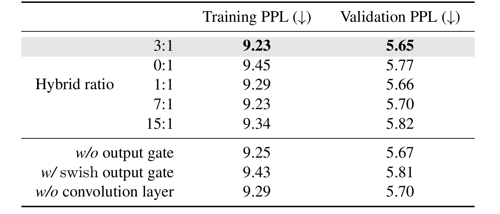{fig-alt="Kimi Linear 论文 Table 1，比较 3 比 1、0 比 1、1 比 1、7 比 1、15 比 1 混合比例，以及移除或替换 output gate 和卷积的 PPL"}

*来源：[Kimi Linear](https://arxiv.org/abs/2510.26692)，Table 1，第 8 页；PDF 矢量页按约 5×、360 DPI 裁切。*

移除短卷积得到 9.29/5.70，说明局部混合对递推层有帮助；但幅度不足以支持“卷积是性能核心”。去掉 output gate 得到 9.25/5.67，略差于基线；换为 Swish gate 的 9.43/5.81 明显更差。更稳妥的结论是：论文选定的 sigmoid output gate 与其余归一化、残差尺度更匹配。消融没有分别移除 Q/K L2Norm、低秩 decay projection 或 NoPE，也没有给出这些组件在发布模型上的独立收益。

## 7. 实验三：1.16 倍 scaling efficiency 的正确读法

论文在 653M 到 1.7B 激活参数的一系列 MoE 上拟合 loss—compute 曲线。MLA 拟合为 $2.3092C^{-0.0536}$，Kimi Linear 为 $2.2879C^{-0.0527}$。在相同目标损失附近，水平距离约 1.16 倍，因此作者称 Kimi Linear 具有约 1.16 倍 computational efficiency。

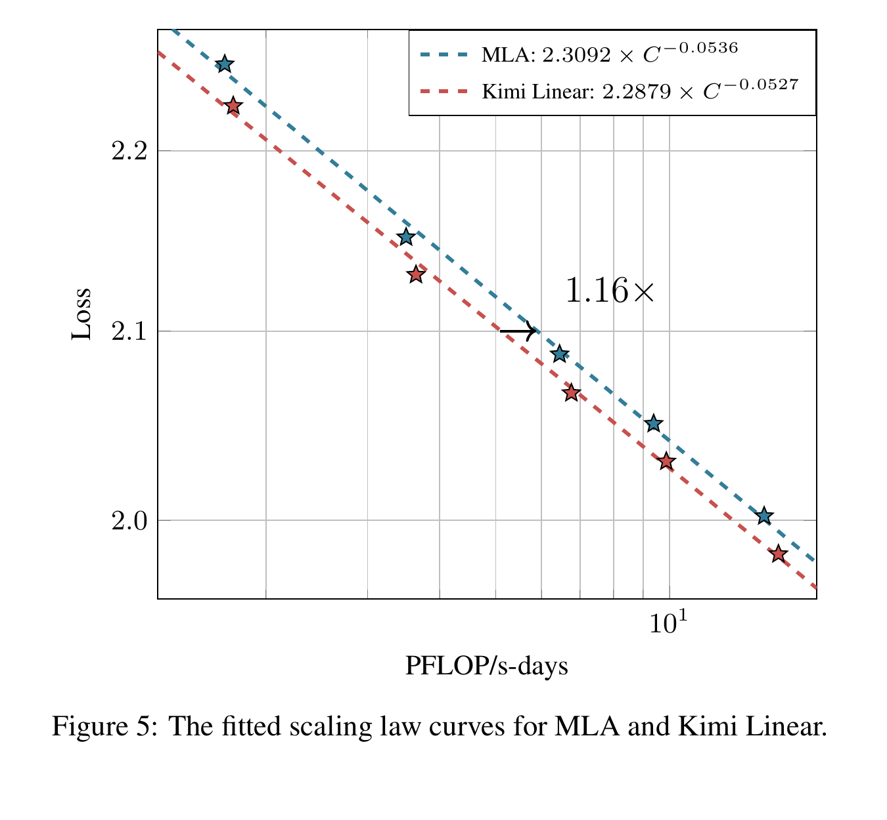{fig-alt="Kimi Linear 论文 Figure 5，MLA 与 Kimi Linear 的 loss 对 PFLOP 每秒天拟合曲线，标注约 1.16 倍计算效率"}

*来源：[Kimi Linear](https://arxiv.org/abs/2510.26692)，Figure 5，第 9 页；PDF 矢量页按约 5×、360 DPI 裁切。*

1.16 倍是达到相同 loss 所需训练计算的拟合差，不是 wall-clock 训练速度，也不是推理吞吐。两条曲线指数非常接近，主要差异是截距；观测范围也只覆盖五个规模点。论文承认 KDA 沿用 MLA 调参，进一步调优可能改变曲线，但这只是合理假设，不是已经测得的收益。我的看法是，这个数字比“数量级提升”更有参考价值：它显示线性混合架构至少没有用明显质量损失换效率，同时给出一个有限、可审计的优势。

## 8. 长上下文与 RL：平均领先不等于逐项领先

Table 5 的四个模型都训练 1.4T token，并在 128K 上下文评测。Kimi Linear 在 RULER、MRCR、HELMET-ICL、RepoQA 和 Long Code Arena Lib 上最佳，平均 54.5；MLA 平均 52.2，GDN-H 51.2，RoPE 版 Kimi Linear 51.8。最重要的反例也在表里：LongBench V2 上 MLA 为 36.1，Kimi Linear 为 35.0；Frames 上 MLA 60.5，Kimi Linear 58.8；Long Code Arena Commit 也是 MLA 33.2 高于 Kimi Linear 32.7。

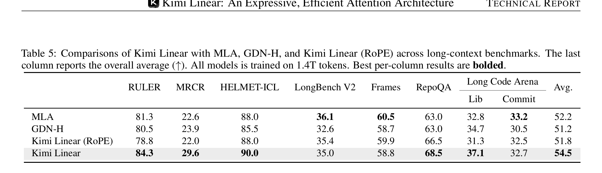{fig-alt="Kimi Linear 论文 Table 5，比较 MLA、GDN-H、Kimi Linear RoPE 与 Kimi Linear 在 RULER、MRCR、HELMET、LongBench V2、Frames、RepoQA 和长代码任务上的分数"}

*来源：[Kimi Linear](https://arxiv.org/abs/2510.26692)，Table 5，第 12 页；PDF 矢量页按约 5×、360 DPI 裁切。*

因此，准确说法是“Kimi Linear 在这组长上下文任务的平均分最高，并在若干检索与代码库任务领先”，不是“全面超过完整注意力”。不同任务依赖不同形式的记忆：RULER 偏受控检索，Frames 要整合分散证据，LongBench V2 的题型更混杂。少数 MLA 层保留的 token 级访问仍可能是后两类任务的关键。

论文还从相同 1.4T checkpoint 启动数学强化学习。初始 MATH500 与 AIME 2025 水平接近，训练过程中 Kimi Linear 的训练准确率和两项测试准确率大多高于 MLA。曲线支持“该架构能承受并受益于 RL 后训练”，但没有识别原因：可能来自预训练表征、状态更新的归纳偏置，也可能来自采样吞吐、优化噪声或超参数交互。只有一套数学 RL 配置，不能推广为线性注意力普遍更适合 RL。

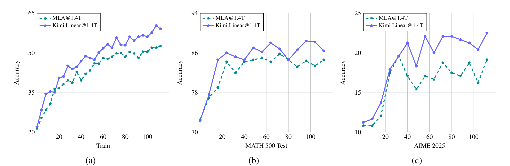{fig-alt="Kimi Linear 论文 Figure 6，Kimi Linear 1.4T 与 MLA 1.4T 在数学强化学习中的训练准确率、MATH500 和 AIME 2025 测试曲线"}

*来源：[Kimi Linear](https://arxiv.org/abs/2510.26692)，Figure 6，第 12 页；PDF 矢量页按约 5×、360 DPI 裁切。*

## 9. 效率：把单请求、批处理吞吐与缓存分开

Figure 7 明确写着 batch size 1。到 512K，Kimi Linear prefill 延迟约比 MLA 低 2.3 倍，TPOT 低 1.8 倍；到 1M，prefill 约 2.9 倍，TPOT 约 2.2 倍。GDN-H 与 Kimi Linear 的曲线很接近，说明此处主要收益来自混合线性层减少长序列注意力工作量，KDA 相对 GDN 的表达力优势不会自动变成同等幅度的端到端延迟差。

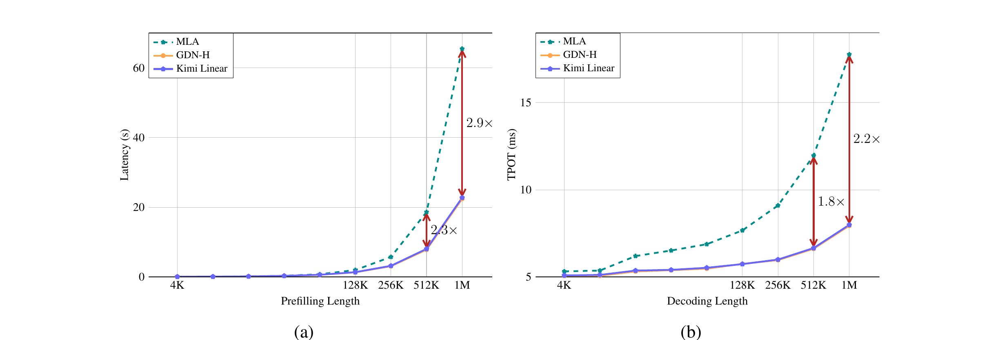{fig-alt="Kimi Linear 论文 Figure 7，batch size 1 下三种模型随 4K 到 1M 长度变化的 prefill latency 与 time per output token"}

*来源：[Kimi Linear](https://arxiv.org/abs/2510.26692)，Figure 7，第 13 页；PDF 矢量页按约 5×、360 DPI 裁切。*

Figure 1(b) 的 6.3 倍来自另一个服务条件：Kimi Linear 的较小缓存允许更大 batch，在 1M 时 TPOT 为 1.84 ms，对 MLA 的 11.48 ms。它是批处理容量带来的吞吐/TPOT收益，不是 batch size 1 的单请求延迟。论文“最多节省 75% KV cache”则来自 3:1 混合直觉：约四分之三层以固定状态替代随长度增长的 KV，剩余 MLA 仍需缓存。真实比例还受每层 KV 维度、状态矩阵、卷积缓存、数据类型和实现对齐影响。

可以用一条简单的报告规则避免混写：问“一个请求多久返回”时引用 batch size 1 的 2.2–2.3 倍；问“同一设备同时服务多少请求”时引用给定批处理条件下最高 6.3 倍；问“缓存占多少显存”时引用最多 75% 节省。三者都必须带长度、硬件和批量条件。

## 10. 代码对照：论文算法怎样进入 FLA 与 Hugging Face

当前 [FLA KDA layer](https://github.com/fla-org/flash-linear-attention/blob/main/fla/layers/kda.py) 将训练/长 prefill 交给 chunk kernel；推理短序列在查询长度不超过实现阈值时切到 fused recurrent kernel。投影后会融合 ShortConv、Swish、Q/K L2Norm、$\beta$ 与 output gate，减少中间张量读写。代码还支持变长批次的 cumulative sequence lengths、初始/最终状态，并为 context parallel 暴露分片路径。这些能力比论文伪代码更接近真正可部署的算子合同。

Hugging Face 配置确认发布模型 27 层中有 20 个 KDA、7 个 MLA，最大位置长度 1,048,576。实现细节应以具体 commit 为准：FLA 的默认 chunk size、短序列阈值、门的张量布局和状态 dtype 都可能更新。论文说“支持 recurrent 与 chunkwise”不等于任意框架已覆盖 continuous batching、prefix caching、量化、张量并行和容错恢复；这些仍需要推理引擎逐项接入。

FlashKDA 把 kernel 优化继续往下推进。官方说明采用 CUTLASS、较小的 chunk 16、两个主 kernel，并用 BF16 保存状态、FP32 FMA 累加。下面的图按官方 H20 表格重绘，六个 $T=8192,d=128$ 工作负载相对 FLA KDA 为 1.85–2.31 倍。它是算子延迟，不含整个 Transformer 层。

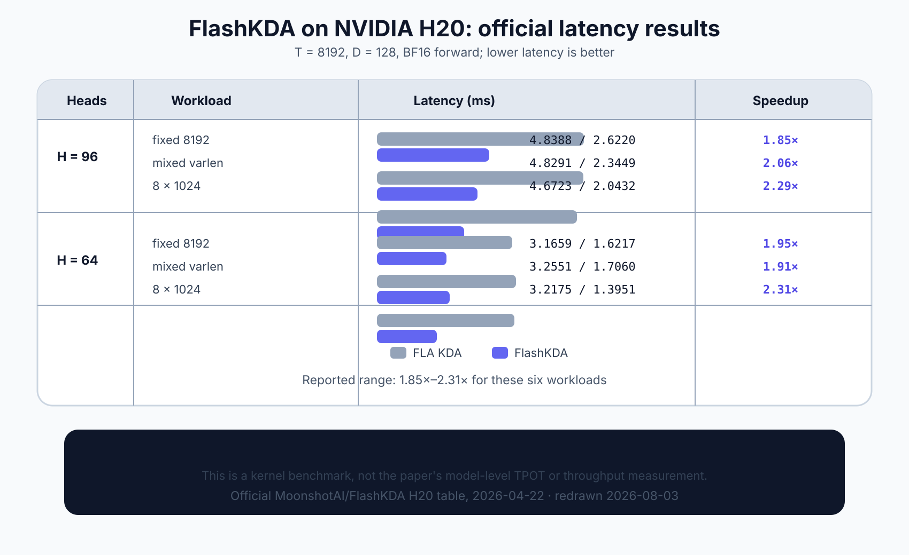{fig-alt="依据 FlashKDA 官方仓库重绘的 H20 benchmark，列出 96 头与 64 头下固定长度、混合变长和八乘 1024 工作负载的 FLA 与 FlashKDA 延迟及加速比"}

*数据来源：[MoonshotAI/FlashKDA](https://github.com/MoonshotAI/FlashKDA)，官方 H20 benchmark（2026-04-22）；访问并重绘于 2026-08-03。原网页截图工具当次无可用浏览器实例，因此保留精确表值并明确标作重绘。*

这组数据也说明“算法复杂度”与“kernel 常数”必须分层讨论。KDA 相对 MLA 改变了随长度增长的工作量；KDA 专用 WY/UT 相对通用 DPLR 利用了代数结构；FlashKDA 相对 FLA 又在 tile、状态搬运和指令级累加上压缩常数。三层优化可以叠加，却不能用一个不带条件的倍数概括。

## 11. KDA 的边界，以及论文之后的三条研究线

第一条是 gate 解耦。[Gated DeltaNet-2](https://arxiv.org/abs/2605.22791) 指出，KDA 的标量 $\beta_t$ 同时决定 erase 与 write，并把它扩展为通道级擦除门 $b_t$ 和写入门 $w_t$。概念形式为：

$$
S_t
= \left(I-k_t b_t^{\top}\right)\mathrm{Diag}(\alpha_t)S_{t-1}
+ k_t\left(w_t\odot v_t\right)^{\top}.
$$

当 $b_t$、$w_t$ 都退化为同一个标量控制时，可恢复 KDA 的耦合情形。更细的门提高表达力，也增加投影、带宽和优化难度；它不是无代价替换。

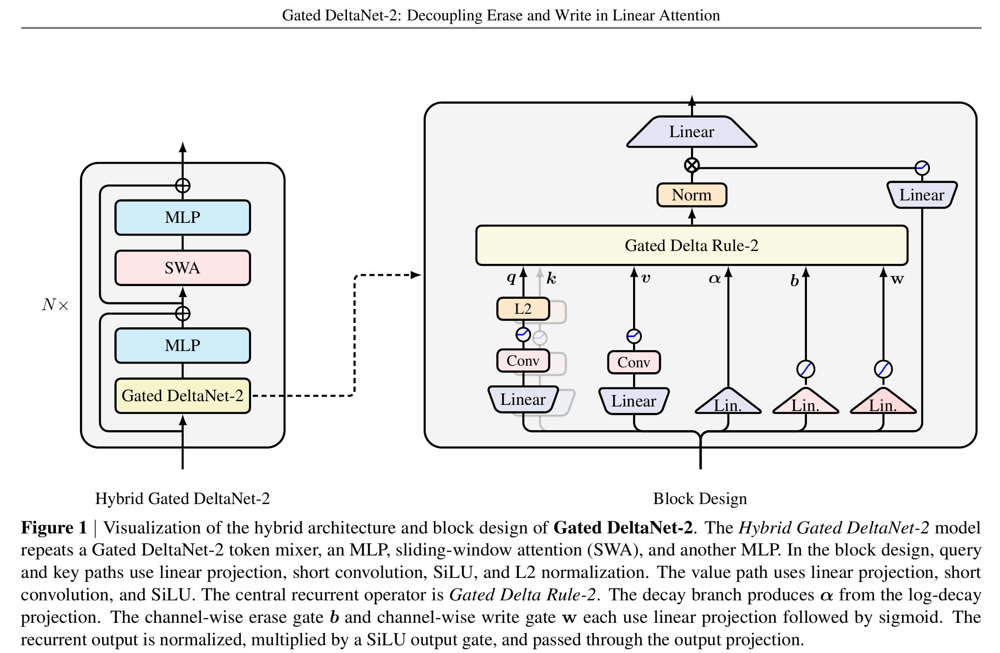{fig-alt="Gated DeltaNet-2 论文 Figure 1，展示混合滑窗注意力架构，以及分别生成 alpha 衰减、b 擦除和 w 写入门的 Gated Delta Rule 2 block"}

*来源：[Gated DeltaNet-2](https://arxiv.org/abs/2605.22791)，Figure 1，第 6 页；PDF 矢量页按约 5×、360 DPI 裁切。*

第二条是优化视角。[Preconditioned DeltaNet](https://arxiv.org/abs/2604.21100) 把状态更新解释为在线最小二乘。DeltaNet、Gated DeltaNet 与 KDA 类似对单步损失做一阶梯度下降，却没有用键协方差形成的回归曲率；当键高度相关时，同一标量步长会在不同方向上过快或过慢。预条件方法近似逆曲率，在 340M/1B 实验和合成召回上改善结果。这个分析提醒我们：KDA 改进“遗忘坐标”，并未解决在线回归的条件数问题。

第三条是系统视角。FlashKDA 证明初版高效 kernel 仍有明显优化空间，也带来新的复现问题：chunk 16 与 FLA 的 chunk 64 会改变并行度和数值路径；BF16 状态节省带宽，却可能在超长序列累计误差；可变长批次收益依赖长度分布。未来报告需要同时给出 kernel microbenchmark、单层端到端、完整模型 prefill/decode 与服务吞吐，而不是只挑最大加速比。

还有四个尚未被论文充分回答的问题。固定状态的有效容量怎样随头数、$d_k$、$d_v$ 和任务熵变化？通道级 $\alpha_t$ 是否学出可解释的时间尺度分工，还是只是更灵活的数值补偿？3:1 在密集模型、不同 MoE 稀疏度和多模态输入下是否仍最优？NoPE 的外推优势在需要精确相对位置的任务上何时反转？这些问题都可以通过状态探针、门分布统计、受控容量曲线和跨规模比例消融来回答。

### 11.1 稳定性：为什么归一化不是装饰

从最小二乘角度看，delta rule 很直接。若希望状态满足 $S_t^{\top}k_t\approx v_t$，可定义单步误差 $\frac12\lVert S^{\top}k_t-v_t\rVert_2^2$。对 $S$ 求梯度会得到 $k_t(S^{\top}k_t-v_t)^{\top}$；沿负梯度走一步，正好是 DeltaNet 的残差写入。因此，$\beta_t$ 既是门，也可解释为在线学习率。KDA 在更新前加入通道衰减，相当于先对旧参数做各向异性收缩，再拟合当前样本。

这也解释了 Q/K L2Norm 的位置。若 $k_t$ 范数变化很大，有效步长会随 $\lVert k_t\rVert_2^2$ 放大，$\beta_t$ 就无法单独表示更新强度。归一化把键主要约束在方向上。当 $\lVert k_t\rVert_2=1$ 且 $\beta_t\in(0,1)$ 时，擦除矩阵在 $k_t$ 方向的特征值为 $1-\beta_t$，其余正交方向为 1，执行的是收缩而非放大。再乘 $\alpha_t\in(0,1)^{d_k}$ 后，旧状态整体不会因门本身指数增长。

通道衰减的乘法顺序也不能随意交换。$\left(I-\beta kk^{\top}\right)\mathrm{Diag}(\alpha)$ 一般不等于 $\mathrm{Diag}(\alpha)\left(I-\beta kk^{\top}\right)$。前者先给旧状态各行设定寿命，再按衰减后的地址擦除；后者先在原始坐标上擦除，再缩放结果。论文采用前者，并由此得到 $b_t=k_t\odot\alpha_t$ 的特殊关系。换序不仅改变记忆语义，也会破坏专用 DPLR 算法利用的结构。

状态矩阵可看成从键空间到值空间的线性映射。每次外积写入都增加一个秩一关联。若键近似正交，多组关联能相对和平地共存；若键高度相关，它们会竞争同一子空间。通道级衰减能回收长期占用的行，却不能凭空增加矩阵秩或把相关键变成正交键。所以 KDA 改善的是有限容量的使用效率，不是取消容量上限。百万 token 代表计算路径可达，并不证明百万条事实可以无损保留。

### 11.2 分块算法：结合律不等于免费并行

仿射状态更新可以写成 $S_t=A_tS_{t-1}+B_t$。两个连续步骤组合后为 $S_t=A_tA_{t-1}S_{t-2}+A_tB_{t-1}+B_t$。这种组合满足结合律，可以用并行扫描构造块前缀；难点是直接保存 $A_tA_{t-1}\cdots$ 会形成稠密矩阵，失去计算优势。WY/UT 的作用正是让对角项与低秩修正保持紧凑，不显式构造完整转移。

对长度为 $C$ 的 chunk，工作可分成三类：先由块内 $q,k,v,\alpha,\beta$ 并行生成三角系数；再把块起始状态映射到所有 token 的读出；最后汇总块内写入并产生块末状态。块内大计算交给 GEMM，块间只按 chunk 数递推。增大 $C$ 会减少块间交接，却扩大三角中间量和共享内存压力；减小 $C$ 会增加交接，却可能改善缓存驻留。chunk size 因而由硬件、头维和长度分布共同决定，不是固定的数学常数。

论文所谓减少约三次矩阵乘法，是相对通用 DPLR chunk 算法少做若干块级 GEMM，不表示 KDA 层只剩三次矩阵乘法，也不代表完整模型 FLOPs 固定下降某个百分比。QKV 投影、输出投影和 MoE 仍占大量计算；长上下文下，注意力与中间状态搬运逐渐主导，专用结构的收益才会放大。

反向比前向更难。梯度既要沿块内三角依赖传播，也要穿过块间最终状态；保存全部中间量增加显存，重算又增加算力。实现需要在保存状态、重算局部量和融合投影之间取舍。Figure 2 只测前向 kernel，不能单独证明训练 wall-clock 同幅改善；scaling law 又只按总计算量拟合质量。两类证据互补，但回答的不是同一个问题。

### 11.3 容量评测：长度只是横轴之一

长上下文接口与有效状态容量必须分开。Softmax 每增加一个 token 就增加一份可寻址键值；KDA 的矩阵形状不变，能否回忆很早的信息取决于它是否被编码进低冲突方向。只把一根“针”藏进重复文本，主要测地址能否在噪声中幸存；要求比较多个版本、恢复原文细节或合并分散证据的任务，才更直接测压缩损失。RULER、MRCR、Frames 和 RepoQA 都是长任务，却不测同一种记忆。

三个合成任务也应分别解释。回文要求反序重放近乎全部输入，接近固定状态最不友好的复制；MQAR 需要按键取值，直接对应外积关联记忆；栈要求按 push/pop 维护动态状态，更接近算法执行。KDA 在三者都更快收敛，说明收益不只来自一种查询模板。但到 2048 时回文与 MQAR 精度明显下降，同样直观展示容量边界。

Figure 4 下排比较固定 1024 长度上的收敛速度，主要测可学习性；上排取不同长度的最佳训练精度，更接近容量随长度的变化。一个架构可以学得快，却更早饱和；也可能收敛较慢，最终容量相近。把“更快收敛”直接写成“更强长度外推”会混淆两个问题。

更有判别力的实验应固定总参数，改变 $d_k,d_v$ 与头数，画准确率对可存关联数的容量曲线；再人为控制键相关性，观察通道衰减在高冲突区是否更有帮助。训练长度和测试长度也要分离，以区分插值容量与外推。同步记录键协方差谱、状态有效秩和 $\alpha_t$ 分布，才能判断门是否学到短期/长期分工，而不是仅仅提供更自由的优化参数。

### 11.4 组件交互：NoPE、ShortConv 与混合层

ShortConv 与 NoPE 具有互补关系。没有位置旋转时，纯内容地址难以区分相邻 token 次序；因果短卷积在小范围内注入顺序和邻域模式，递推状态再承担更长时间尺度。它不是显式位置编码，却让 $q,k,v$ 带有不同局部历史。Table 1 移除卷积后 PPL 变差，与这种功能一致；不过该消融没有区分“局部顺序信息”和“增加了一层非线性容量”。

低秩 decay projection 在表达力与带宽间折中。直接从隐藏维生成每个头、每个键通道的门，输出宽度随头数和头维增长；低秩路径先抽取较少的时间尺度因子，再组合成细粒度衰减。它隐含大量通道寿命由少数共享因素控制的假设。秩太小，门仍高度相关；秩太大，投影流量会侵蚀线性层节省。论文没有展示 decay rank 曲线，这是理解门实际自由度的一处缺口。

3:1 还可视为周期性信息整理。连续 KDA 层反复压缩和改写表示，随后 MLA 直接访问 token 级历史，把已从固定状态淡出的细节重新带回残差流；下一组 KDA 再压缩校正后的表示。MLA 不只是兜底检索，也可能重塑后续更易压缩的键值。最后一层使用 MLA，或许有助于输出前精确选择内容，但论文没有单独移动末层做消融，所以这只是结构解释。

混合比例的“公平”也有多种口径。固定层数、固定参数、固定理论 FLOPs、固定训练时间和固定服务显存，得到的最优点可能不同。Table 1 适合回答相同总体配方下的质量，却不能覆盖全部部署预算。5.65 对 5.66 的差距又很小，缺少多随机种子时，不宜断言 3:1 本质优于 1:1；把它称为论文候选中的最佳配置更准确。

### 11.5 系统核算：显存空出来以后发生了什么

MLA 虽压缩每个 token 的 KV 维度，缓存仍与层数、长度和并发数成正比；KDA 主要保存每头 $d_k\times d_v$ 状态以及 ShortConv 的少量最近 token。序列很短时，固定矩阵未必比少量 KV 小；超过交叉点后，线性增长项才主导。最多 75% 描述的是长上下文高占用区间，不是每个请求的恒定节省。

batch size 1 时，GPU 可能没有完全占满，约 2.2 倍主要反映单请求算子路径。增加 batch 后，MLA 因 KV cache 过大无法容纳同样多序列，Kimi Linear 把空出的显存转化为并发，6.3 倍因而同时包含计算与容量收益。若流量不足以形成大 batch，或延迟 SLA 不允许等待拼批，最高吞吐不会自然出现。

prefill 与 decode 也受不同瓶颈控制。prefill 一次处理大量 token，适合 chunkwise GEMM，通常更受算力与中间激活影响；decode 每步只有一个新 token，却反复访问历史状态，通常更受内存带宽、批处理和调度影响。KDA 前者依赖高效 WY/UT，后者依赖低开销 recurrent kernel。只优化一条路径，真实对话服务会被另一阶段限制。

公平系统报告至少要列出 GPU 型号与数量、dtype、并行策略、输入/输出长度、batch 上限、通信是否计时、预热、缓存分配器和延迟分位数。论文曲线足以支持方向，却不足以预测任意框架。在 1M 测试中，内存碎片、跨卡状态传递和调度策略都可能改变结果，这也是为什么本文不把官方最大倍数写成普遍承诺。

### 11.6 实现验证：四个容易被短测试漏掉的错误

第一是状态边界。chunk kernel 返回每个序列的 final state，recurrent kernel 接收上一步 state；变长 packed batch 必须按 cumulative sequence lengths 重置。这里的长度数组不只是性能元数据，也是因果边界。若状态跨样本泄漏，短的等长测试可能通过，混合长批次才会出现隐蔽污染。

第二是融合等价性。把 gate、RMSNorm、L2Norm 与 recurrence 融合能减少大张量读写，但反向公式、epsilon、计算 dtype 和广播维度必须与参考实现一致。工程上应保留一个慢速 PyTorch recurrence，用随机短序列逐项对齐输出、状态和梯度，再覆盖 chunk/recurrent 切换阈值两侧。只拿两个融合 kernel 互比，可能让它们共享同一错误。

第三是低精度累计。普通随机输入上的误差很小，不代表衰减接近 1、序列极长时仍稳定。测试应覆盖长寿命门、重复相关键、大状态范数和块边界，并分别比较 BF16 状态、FP32 累加与全 FP32 参考。FlashKDA 的 BF16 存储加 FP32 FMA 是务实折中，应用侧仍要按最大工作长度设误差阈值。

第四是 context parallel。序列沿设备切分后，本地块可并行计算，状态却必须按因果顺序跨 rank 传递，反向还要传状态梯度。它与张量并行分头和 MoE expert parallel 的通信可能重叠，也可能争用链路。配置写着“支持”不等于每种集群拓扑都高效，端到端 profiling 不能由单卡 kernel benchmark替代。

### 11.7 一套可复核的后续实验

下一轮研究可以用一个小而完整的矩阵。模型侧固定参数和数据，交叉比较标量/通道 decay、共享/分离 erase-write、普通/预条件更新；系统侧固定模型，比较 recurrent、FLA chunk 与 FlashKDA 在不同长度分布和 dtype 下的误差、显存与吞吐。每个点同时记录 PPL、合成容量、长任务分项、状态范数、门统计、训练 token/s、峰值显存和 decode 分位延迟。质量和系统指标成对出现，才能判断新增表达力是否值得 kernel 成本。

可解释性不能只画平均 $\alpha$。应按层、头、通道和 token 类型统计衰减半衰期，观察段落边界、代码缩进、实体重提及时门是否稳定变化；再冻结、交换或置零特定时间尺度通道做因果干预。若破坏长寿命通道后远程检索下降、破坏短寿命通道后局部语法下降，才更有把握声称 KDA 学到了时间尺度分工。

容量研究还要纳入真实键分布。随机正交键的理论上限往往过于乐观，语言键会聚簇并随层变化。报告有效秩、键协方差谱和查询误差，并比较 MLA 插入前后的 KDA 状态，可以判断混合层究竟是在恢复具体 token，还是在重塑更容易压缩的表示。Preconditioned DeltaNet 的曲率视角也可由此与 KDA 的遗忘视角连接起来。

NoPE 需要独立控制。可构造内容相同、相对距离不同的成对样本，测试模型能否区分“出现过”和“在某个距离出现过”；再改变 ShortConv 宽度，观察局部顺序与长程外推如何交换。当前 Table 5 只能说明 NoPE、卷积和混合 MLA 的最终组合有效，不能给三者分配独立贡献。

## 12. 结论：KDA 的价值在可执行的结构约束

KDA 的公式改动看似只把 $\alpha_t$ 从标量换成向量，实际同时连接了三个层面。建模上，它允许一个头的不同键通道以不同速度忘记；优化上，它保留 delta rule 的定向擦写；系统上，它把转移限制为可被专用 WY/UT 算法利用的 DPLR 子类。Kimi Linear 再用 3:1 KDA/MLA 混合承认固定状态的容量边界，而不是声称线性注意力可以完全替代 token 级检索。

论文最有分量的结果也不是某一个最大倍数，而是证据链能闭合：合成任务展示更细遗忘的可学习性；消融给出混合比例；scaling law 显示相同 loss 下约 1.16 倍计算效率；长上下文与 RL 说明质量没有因线性化而整体塌陷；kernel 与系统曲线解释部署收益来自哪里。反例同样明确：LongBench V2 与 Frames 没有领先，batch size 1 只有约 2.2 倍 TPOT，固定状态仍会丢信息。

我的最终判断是：Kimi Linear 不是“Softmax 终结者”，而是一套把压缩记忆、精确回看和硬件执行共同设计的方案。KDA 最值得复用的经验也不是照抄一条 recurrence，而是先选择能表达任务所需状态编辑的结构，再检查这种结构能否被稳定地分块、融合和验证。后续三条研究线已经说明，这个设计仍在演进：kernel 可以更快，gate 可以更独立，更新可以感知曲率。真正开放的问题不是线性注意力能否跑到一百万 token，而是有限状态在什么任务上保留了哪些信息，又以什么代价遗忘了其余部分。

## 参考资料

- Moonshot AI. [Kimi Linear: An Expressive, Efficient Attention Architecture](https://arxiv.org/abs/2510.26692), 2025.
- Moonshot AI. [Kimi-Linear official repository](https://github.com/MoonshotAI/Kimi-Linear).
- FLA contributors. [Flash Linear Attention](https://github.com/fla-org/flash-linear-attention).
- Moonshot AI. [FlashKDA](https://github.com/MoonshotAI/FlashKDA), 2026.
- Yang et al. [Gated DeltaNet: Improving Mamba2 with Delta Rule](https://arxiv.org/abs/2412.06464), 2024.
- Yang et al. [Gated DeltaNet-2: Decoupling Erase and Write in Linear Attention](https://arxiv.org/abs/2605.22791), 2026.
- [Preconditioned DeltaNet](https://arxiv.org/abs/2604.21100), 2026.
- [知乎：Kimi Linear 技术解读](https://zhuanlan.zhihu.com/p/1967632780847474121)、[科学空间：线性注意力简史](https://kexue.fm/archives/11033)、[MZeroMiko：KDA 推导](https://mzeromiko.github.io/blogs/Linear_Attention/5.%20kimi_linear/kda/)、[Zhiyuan Li：KDA 仿射变换推导](https://zhiyuan1i.github.io/en/posts/kda-mathematics/)；仅用于解释对照，技术结论回查原论文与代码。
