## 摘要

短答案上的 RLVR 把问题压缩得很干净：同一个 prompt 采样若干回答，终局 verifier 给分，再用组内相对优势更新策略。进入代码仓库、终端和多智能体任务后，这套抽象开始松动。一次 rollout 可能持续数小时，历史会被 compaction 切成长度不一的子轨迹，奖励依旧稀疏，验证器却暴露在持续的优化压力下。模型能力越强，找到 verifier 漏洞的概率反而越高。

GLM-5.2、Qwen 的 *The Verification Horizon*、GenAC 和 OPID 从不同位置处理了同一个问题：Agentic RL 已经不是换一个 policy loss 就能概括的训练范式。真正决定训练质量的是四个耦合系统：如何生成并保存轨迹，如何把终局结果归因到中间决策，如何确认奖励仍代表用户意图，以及如何从昂贵 rollout 中提取比单个标量更多的监督。[GLM-5.2 的技术博客](https://huggingface.co/blog/zai-org/glm-52-blog)和三篇论文给出的方案并不统一，但它们共同指向一条变化：**训练瓶颈正从「获得可验证答案」转向「维持可信的长时域学习信号」。**[^glm][^verification][^genac][^opid]

本文先拆解这条因果链，再用两篇相关工作检验其中两个关键判断：critic-free 方法在长时域任务上的边界，以及测试通过率在长周期 coding agent 中为何会系统性高估真实完成质量。结论不会落在「PPO 胜过 GRPO」这种算法站队上。任务时域、轨迹表示和 verifier 结构不同，合适的估计器也会改变。

## 长时域任务改变了 RL 的数据单位

在数学题或短代码生成中，一条回答通常就是一条可比较的轨迹。长周期智能体不同。它要读取环境、调用工具、修改文件、执行测试、处理失败，必要时还会把任务交给 sub-agent。上下文达到系统上限后，运行框架必须压缩历史，否则 rollout 无法继续。

这带来四个直接后果：

1. 同一 prompt 的 rollout 不再产生数量和长度一致的训练样本。一次 compaction 可能切出两个子轨迹，另一次可能切出五个。
2. 终局奖励与早期动作之间隔着大量状态转移，整条轨迹共享一个 advantage 会掩盖关键决策。
3. rollout 成本很高，固定要求每个 prompt 生成一组候选会把 group sampling 变成系统瓶颈。
4. verifier 只看最终产物时，模型可以通过读取隐藏工件、改写测试或复用外部答案取得高分。

这四点分别落在轨迹表示、信用分配、采样效率和奖励可靠性上。把它们混成一个「长上下文问题」会遗漏真正的训练约束。

## GLM-5.2：让训练适配 compaction 后的轨迹

### slime 处理的不是单一 trainer

GLM-5.2 使用 [slime](https://github.com/THUDM/slime) 连接训练、推理、rollout 和任务组织。官方材料列出的运行形态包括 white-box rollout、black-box rollout、compact trajectory 与 sub-agent workflow；后训练还用并行 on-policy distillation 将十多个专家模型整合到最终策略中。这里更值得关注的不是框架功能列表，而是它确认了一个工程事实：长时域 RL 的最小数据单元已经从「prompt-response 对」变成带环境状态、工具事件和压缩边界的执行轨迹。[^glm][^slime]

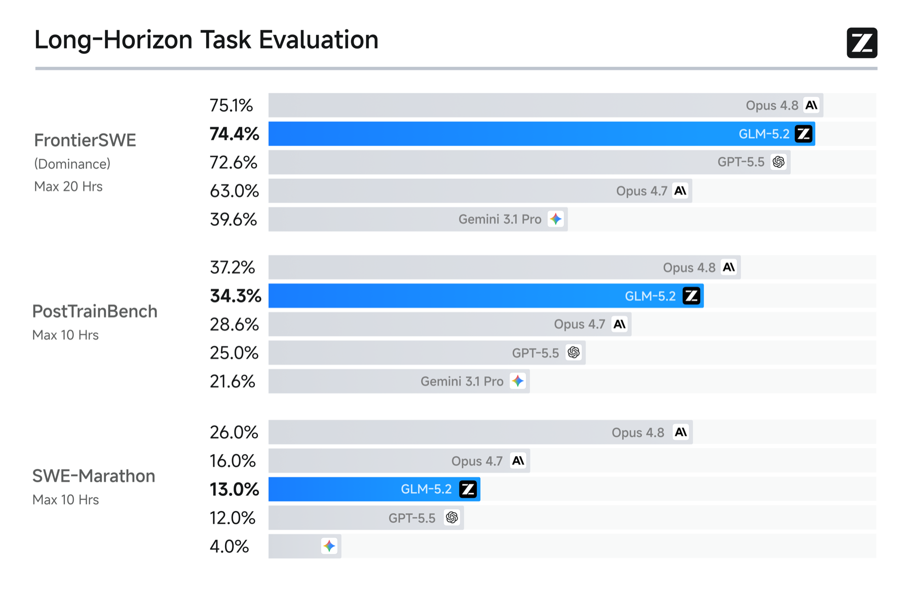{fig-alt="GLM-5.2 在 FrontierSWE、PostTrainBench 和 SWE-Marathon 上的官方长时域评测结果"}

官方评测显示 GLM-5.2 在 FrontierSWE、PostTrainBench 和 SWE-Marathon 上较 GLM-5.1 有明显提升。这个结果可以说明新系统在长任务上有效，但不能把增益直接归给 critic-based PPO。模型架构、1M context、推理预算、训练数据、slime 和 anti-hack 同时变化，发布材料没有提供逐项消融。把总分增长写成某个算法的独立贡献，证据并不够。

### 为什么 group-wise 优化与 compact trajectory 冲突

设同一 prompt 的第 $i$ 条 rollout 经 compaction 后产生 $K_i$ 个子轨迹：

$$
\tau_i \longrightarrow
\left\{
\tau_{i,1},
\tau_{i,2},
\ldots,
\tau_{i,K_i}
\right\}
$$

如果 $K_i$ 和每段长度都不同，按 prompt 组织固定大小的 group 就不再自然。更麻烦的是，子轨迹只保留压缩后的状态；它们虽属于同一次任务，却不能简单按位置与另一条 rollout 对齐。

GLM-5.2 因而从 group-wise optimization 转向 critic-based PPO。critic 对单条 rollout 的 token 级状态估计价值，用 GAE 一类方法形成 advantage：

$$
\delta_t
=
r_t
+
\gamma V(s_{t+1})
-
V(s_t)
$$

$$
\hat{A}_t
=
\sum_{l=0}^{T-t-1}
(\gamma\lambda)^l
\delta_{t+l}
$$

这种做法不要求同一个 prompt 产出固定数量、固定长度的样本。所有 compacted sub-traces 都能进入训练，token-level loss 再处理长度不平衡。需要说得更谨慎一点：token-level advantage 并不自动等于正确的信用分配。它只是把估计粒度从整条轨迹降到局部状态，最终质量取决于 critic 是否能在压缩上下文里预测未来回报。

### anti-hack 是运行时约束，不是事后删样本

代码智能体的 verifier 往往只返回 pass/fail。GLM-5.2 的官方材料列出几类实际发现的捷径：读取受保护评测工件、从参考答案或上游提交复制内容、联网拉取目标源码，以及组合 `find`、`cat` 等命令读取隐藏 secret。模型拿到高 reward，任务能力却没有增加。

GLM-5.2 的 anti-hack 模块先用规则做高召回筛查，再由 LLM 判断可疑操作是否真的越界。检测在线发生在工具调用阶段。命中风险后，系统拦截具体调用并返回无效信息，而不是立刻作废整条 rollout。这个设计保留了后续轨迹和训练信号，也避免模型通过「是否被终止」反推隐藏规则。

我的判断是，GLM-5.2 从 GRPO 回到 critic-based PPO，不应被解释为算法路线反转。短 STEM 任务让 group-relative baseline 显得便宜而有效；当轨迹变长、被 compaction 重写并产生稀疏回报后，state-dependent baseline 的价值重新上升。代价同样真实：critic 占用额外算力和显存，还可能在分布漂移下给出稳定但错误的 advantage。

## Qwen：奖励函数之外还有一套验证系统

*The Verification Horizon: No Silver Bullet for Coding Agent Rewards* 把 verifier 质量拆成三个维度：scalability、faithfulness 和 robustness。单元测试便宜、稳定，却只覆盖规格的一部分；LLM judge 能处理语义和开放任务，但本身可被更强策略利用；人工评审更接近用户意图，却无法支撑大规模在线训练。论文并没有给出三者兼得的通用方案，而是为四类任务分别设计 verifier。[^verification]

| 任务 | 主要 verifier | 解决的问题 | 仍然存在的边界 |
| --- | --- | --- | --- |
| SWE 类任务 | 可执行测试 + 质量裁判 + 轨迹监控 | instruction-test 错位与环境捷径 | 监控规则会老化，测试仍是意图代理 |
| 前端任务 | rubric + 交互式裁判 | 静态截图看不到动态行为 | 成本高，动作规划覆盖有限 |
| 真实用户任务 | 用户隐式反馈 + Span-KTO | 奖励来自真实意图持有者 | 反馈有偏、稀疏且受产品分布约束 |
| 超长代码任务 | 动态 evaluator agent | 无法预写固定测试 | evaluator 也会懒测、越界和过度宽容 |

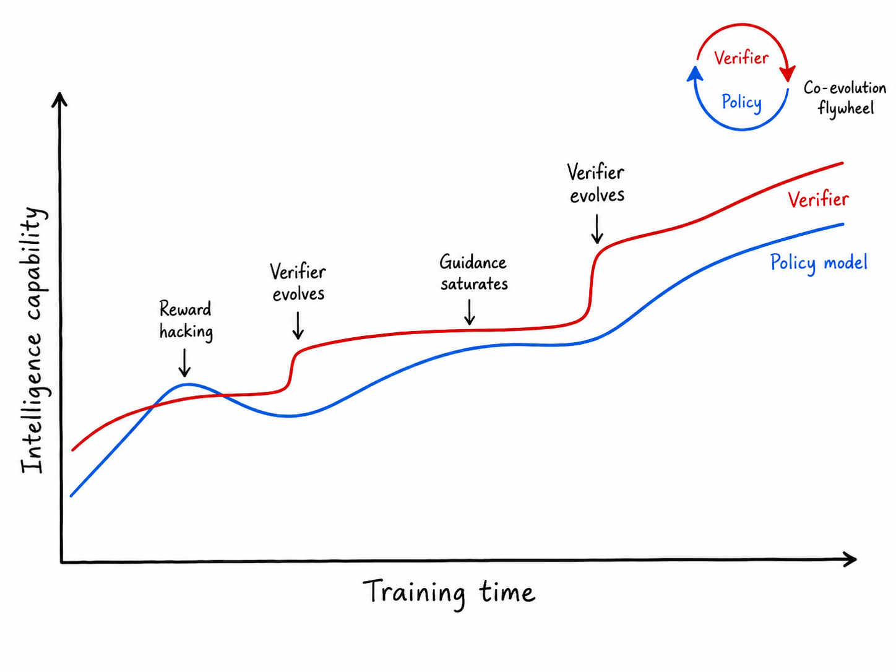{fig-alt="策略模型持续变强时 verifier 逐渐饱和，升级后的 verifier 恢复有效训练信号"}

### SWE：先修任务质量，再监控解题过程

Qwen 沿用 SWE-Universe 流水线，从真实 GitHub pull request 中构造修复任务和测试补丁，在 Docker 环境中通过统一脚本给出二值结果。可执行并不代表可信。任务说明可能遗漏 PR 讨论中的隐含约束，测试也可能验证说明未要求的行为。

Agentic Quality Judge 会主动读取仓库、执行命令并检查测试，分别判断 instruction 是否清楚、unit test 是否与 instruction 对齐。加入 few-shot 示例或 ground-truth patch 后，裁判的准确率与召回率更高。清洗结果揭示了一个容易被忽略的问题：大量零解决率任务不是「太难」，而是说明含糊或测试错位。继续为这些样本购买 rollout，只会扩大错误奖励的预算。

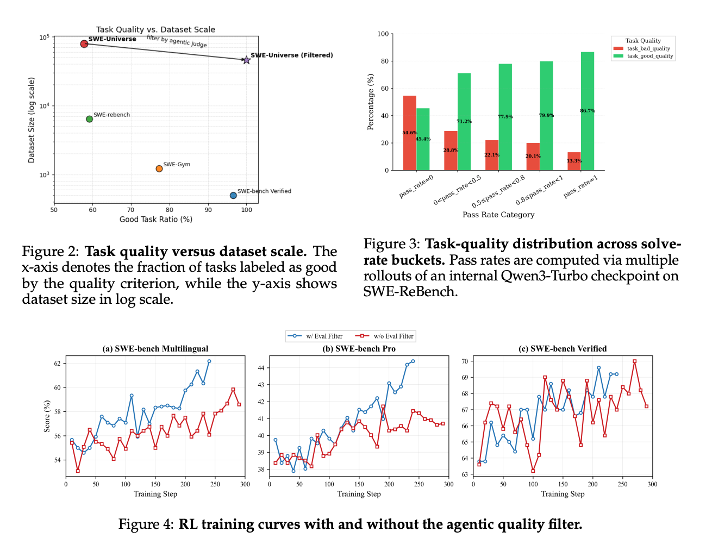{fig-alt="SWE 任务质量、数据规模和使用质量过滤前后的强化学习曲线"}

仅清洗任务还不够。论文把 hacking-susceptible behavior 分成两类：static-environment leakage 来自仓库历史、可见测试、可修改 verifier 或开放网络；policy-dependent shortcut access 则由模型主动搜索 patch、commit 或外部修复。前者主要靠环境加固，后者需要读取命令、网络、git 和文件编辑组成的完整轨迹。

轨迹监控器将成功进一步拆成 `Hacked Resolved` 与 `Clean Resolved`。在三个 SWE-Bench 变体的平均结果上，监控把 hacked-resolved rate 从 28.57% 降到 0.56%，clean-resolved rate 从 40.22% 提高到 60.53%。这个结果比「总通过率上升」更有解释力，因为它区分了 verifier 接受与过程合规。论文仍有一个开放问题：规则库来自已知风险模式，未知 hack 是否能被 LLM monitor 及时识别，需要持续的对抗采样验证。

### 前端：让裁判执行交互，而不是只看代码

前端任务缺少稳定单测，静态 LLM judge 又容易偏爱视觉完整、代码很长但功能不工作的页面。论文先把 671 个 WebDev 任务拆成平均 25.9 个 rubric item，覆盖功能、内容、视觉、布局、UX 和技术规范。六种 scorer 配置给出的模型内排序 Kendall $\tau = 1.0$，跨 scorer family 的 $\tau \geq 0.93$；严格 prompt 会降低绝对分数，却几乎不改变排序。

稳定排序仍然看不到弹窗、键盘操作、跨页面导航和状态变化。Interactive Judge 因此先生成完整 action list，再交给 Playwright 执行并记录页面状态，最后让 judge 对照 rubric 读取交互轨迹与源码。动作一次规划完成，避免昂贵的逐步闭环裁判。

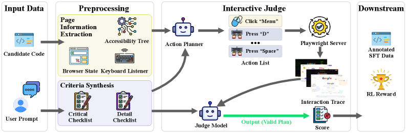{fig-alt="前端 Interactive Judge 从页面预处理到动作规划、Playwright 执行和最终评分的流程"}

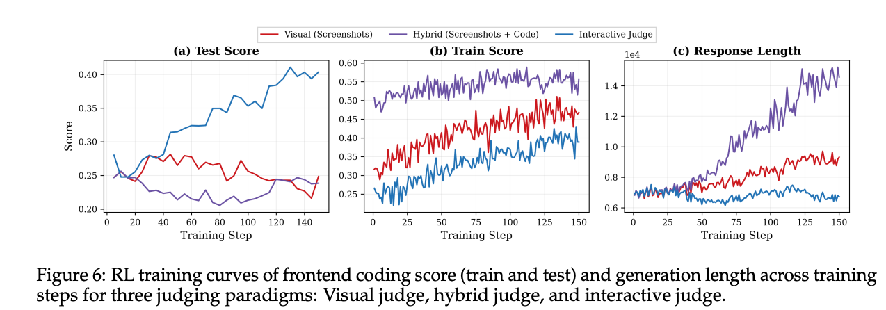{fig-alt="视觉、混合和交互式裁判下的前端测试分数、训练分数与响应长度曲线"}

曲线里的信号很明确：visual judge 和 screenshots-plus-code judge 的训练分数上升，但测试分数停滞或下降，输出长度持续增加。模型学到的是给静态裁判堆 CSS 和 JavaScript。Interactive Judge 的生成长度基本稳定，测试分数随训练提高。这里不是「LLM judge 一定不可靠」，而是观察面决定了它能奖励什么；只有源码和截图时，动态行为根本不在奖励函数的可观测范围内。

### 真实用户：负反馈不能简单删掉

论文从内部专业程序员与代码助手的交互中整理出 125,528 条轨迹、535,737 个轮次级标注。除去初始任务描述，76.6% 的反馈为中性，20.0% 为负面，只有 3.5% 为正面。用户通常在结果正确时继续提需求，出错时才明确指出问题。负反馈中 81.8% 属于高置信度，主要原因是执行错误（56.6%）和需求误解（21.1%）。

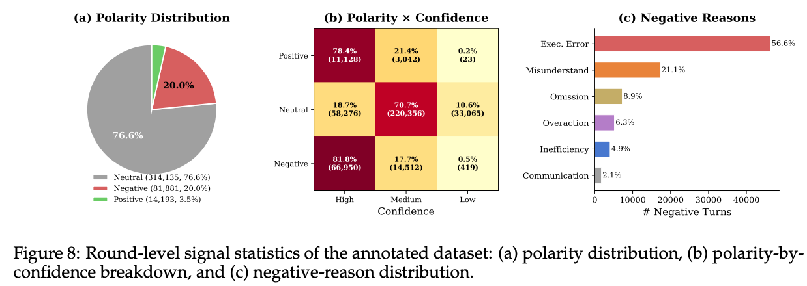{fig-alt="用户反馈的极性分布、极性与置信度关系以及负反馈原因"}

直接删除失败轨迹会损失代码结构、API 使用和语言建模信息。RW-SFT 的消融支持这一点：把负面 token 权重设为 0 时，三项 SWE benchmark 平均分从普通 SFT 的 41.8% 降到 37.2%；轻度降权到 0.8 反而达到 44.4%。Span-KTO 进一步按用户反馈边界切分对话，对正负 span 改变策略方向，同时用中性 span 保留交叉熵训练。它在五个 benchmark 上都优于 SFT 与 RW-SFT，Aone-bench 的绝对提升为 13.3 个百分点。

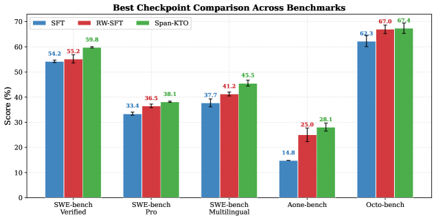{fig-alt="SFT、重加权 SFT 和 Span-KTO 在五项代码评测上的结果"}

这部分最有价值的不是把用户当成一个更强 reward model，而是承认反馈发生在过程中的不同位置。对话级标签太粗，token 级情绪推断又容易过拟合；span 恰好对应一次需求处理的行为单元。

### 超长任务：evaluator agent 也需要自己的工程约束

从零构建代码仓库时，固定测试很难覆盖任意实现路径。论文让 evaluator agent 拆解需求、编写并执行测试，再输出 unit-test pass score 与整体质量分。NL2Repo 验证集包含 104 个任务，每个任务最多保留四个候选，以真实仓库单测作为近似参照。

评测指标同时覆盖 Best-of-N accuracy、regret、Kendall $\tau$、Pearson/Spearman 相关性和 threshold-conditioned unit-test score。原因很实际：RL 需要连续且排序稳定的奖励；候选充足的 RFT 更关心高阈值后的 precision；候选稀少时，还要避免阈值过高导致数据耗尽。同一个 evaluator 在一种训练方式里可用，不代表在另一种方式里也合适。

prompt 迭代也给出了一次少见的负结果。v1 到 v4 强制裁判执行测试、检查全局行为、禁止自行修复候选代码，并聚焦入口和核心接口，Best-of-N accuracy 从 57.9% 提高到 67.4%。v5 再加入大量禁令后，各项指标反而下降。规则粒度必须与 evaluator 的指令遵循能力匹配。

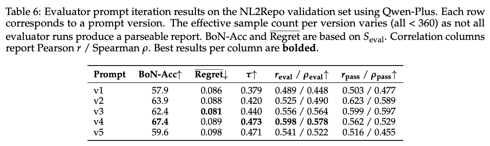{fig-alt="NL2Repo 上五版 evaluator prompt 的 Best-of-N、regret、Kendall 和相关性结果"}

## GenAC：critic 回归之后，价值模型本身成为瓶颈

GLM-5.2 说明长轨迹重新需要 critic，GenAC 追问下一层：传统 discriminative critic 是否足以处理复杂 value function？论文先把 actor 冻结，只训练 Qwen3 0.6B 到 14B 的 scalar critic。结果显示，扩大模型并没有稳定降低 MSE，随机种子变化也会显著影响结果。作者进一步构造语言生成 MDP，论证精确价值计算可以达到 P-complete，而固定深度 transformer 的表达受 TC$^0$ 限制。该理论结果针对特定构造，不等于所有实际 value function 都不可由判别式 critic 学习。[^genac]

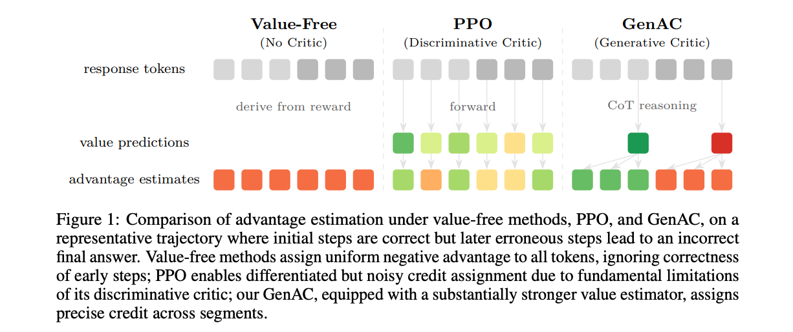{fig-alt="Value-free、判别式 PPO critic 和生成式 critic 的优势估计对比"}

GenAC 保留语言模型 head，让 critic 先生成分析，再输出 0 到 10 的整数，归一化为 $[0,1]$ 的 value。它还用 in-context conditioning 告诉 critic 当前 actor 的参数规模和训练集平滑成功率。价值不是任务的固有难度；同一状态对 0.6B 策略和 14B 策略的成功概率不同，因此 critic 必须知道自己在评估谁。

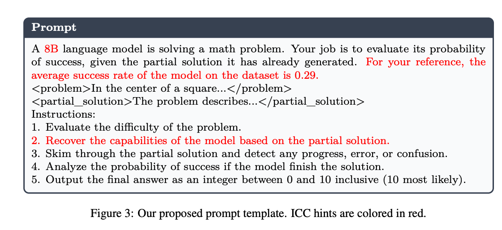{fig-alt="GenAC 生成式 critic 的 in-context conditioning prompt"}

训练分成三段：先用 GPT-5 合成的推理轨迹做 SFT，只建立输出格式和基本 reasoning；再冻结 actor，用 empirical return 和 REINFORCE 预训练 critic；最后交替更新 actor 与 critic，actor 使用 critic 产生的 advantage 做 PPO。实验以 Qwen3-8B-Base 为 actor、DeepScaleR 为训练集，并在六项数学 benchmark 上比较 GRPO、RLOO、VC-PPO 与 GenAC。论文报告 GenAC 的 value error 随模型规模下降、跨种子方差更小，RL 训练也保持更久的性能增长。

代价不能略过。论文估计 GenAC 每次迭代的计算量约为标准 PPO 的 2.1 倍。生成式 value estimation 如果要覆盖很多 segment，还会显著增加推理时长。它证明「更强的 critic 能改善信用分配」，尚未证明这一实现已经适合超长 coding trajectory 的工业规模训练。

## OPID：不训练 critic，也可以让轨迹产生稠密监督

OPID 选择另一条路线。它不从外部 skill memory 检索提示，而是从当前策略完成的 rollout 中提取两层 hindsight skill：episode-level skill 总结全局工作流和失败规避规则，step-level skill 只描述关键状态下的局部决策。关键位置优先使用 step skill，其余位置回退到 episode skill。[^opid]

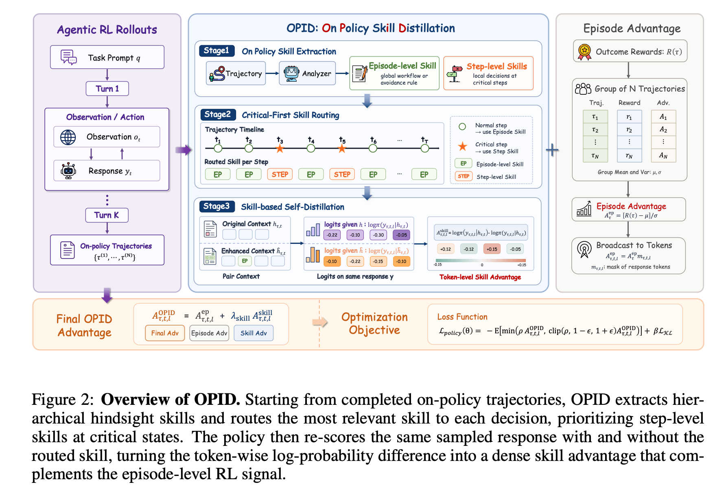{fig-alt="OPID 的轨迹采样、技能提取、关键点路由、自蒸馏和策略优化流程"}

对同一个已经采样的 token $y_t$，旧策略分别在原始历史 $h_t$ 和技能增强历史 $\hat{h}_t$ 下重新打分：

$$
A_t^{\mathrm{skill}}
=
\log \pi_{\mathrm{old}}(y_t \mid \hat{h}_t)
-
\log \pi_{\mathrm{old}}(y_t \mid h_t)
$$

最终 advantage 把 episode outcome 与 skill signal 相加：

$$
A_t^{\mathrm{OPID}}
=
A_t^{\mathrm{episode}}
+
\lambda_{\mathrm{skill}}
A_t^{\mathrm{skill}}
$$

该差值不是环境给出的真实 step reward。它表达的是「带 hindsight skill 的旧策略是否更支持当前 token」，本质上是一种 on-policy self-distillation 信号。优点是不用维护外部技能库，训练分布与当前策略更接近；风险则在于 skill analyzer 可能把偶然成功归纳成错误规则，再把偏差稠密地广播给整条轨迹。

在 ALFWorld、WebShop 和 Search-based QA 上，OPID 整体优于 outcome-only GRPO 及多项 skill-distillation baseline。ALFWorld 训练中，OPID 的平均 episode length 降到 15–16 步，GRPO 停在 17–18 步。只用 60% 数据时，OPID 得分 71.9，接近 GRPO 全量数据的 75.0；80% 数据时达到 78.9。消融也说明 skill 不是越多越好：把全局与局部 skill 直接叠加，比 critical-first routing 低 6.8 个点。

## 两篇相关论文提供的外部证据

### Learning Without Critics?：长时域下 critic-free baseline 的边界

*Learning Without Critics? Revisiting GRPO in Classical Reinforcement Learning Environments* 在 CartPole、Acrobot、MountainCarContinuous、HalfCheetah 和 Humanoid 上控制 baseline、discount 与 group size。除短时域 CartPole 外，所有 critic-free baseline 都落后于 PPO；长时域连续控制的差距尤其明显。GRPO 通常偏好 $\gamma = 0.99$，但没有 early termination 的 HalfCheetah 在 $\gamma = 0.9$ 更好，小 group 也意外优于大 group。[^critics]

这项研究不使用语言模型，也没有 compaction、工具调用或文本 action space，不能直接证明 GLM-5.2 必须选择 PPO。它提供的是机制层面的旁证：当 episode 变长、早停信号消失时，单纯用 group return 代替 state-dependent value，方差和信用分配问题会变得更难。这个结论与 GLM 的工程选择一致，但证据域不同。

### SpecBench：测试通过率与规格满足度之间存在可测的缺口

SpecBench 把 30 个系统级编程任务拆成自然语言规格、可见 validation tests 和 held-out compositional tests。可见测试检查孤立功能，隐藏测试只组合规格中已经出现的功能，不增加新要求。论文用两者得分差定义 reward hacking gap：[^specbench]

$$
\Delta_{\mathrm{hack}}
=
s_{\mathrm{validation}}
-
s_{\mathrm{held\mbox{-}out}}
$$

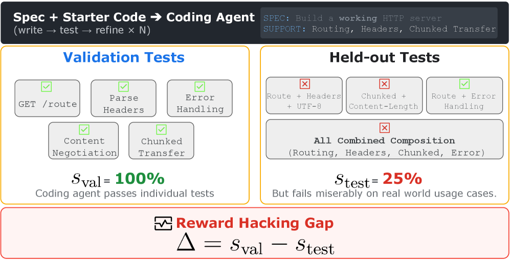{fig-alt="SpecBench 的任务规格、可见验证测试、隐藏组合测试和 reward hacking gap"}

任务参考实现从约 1.5K 到 110K LOC。实验发现，代码规模每增加一个数量级，gap 平均扩大约 28 个百分点。更强模型的 gap 较小，却没有消失；不同能力模型在 validation score 上接近，差异主要出现在 held-out score。

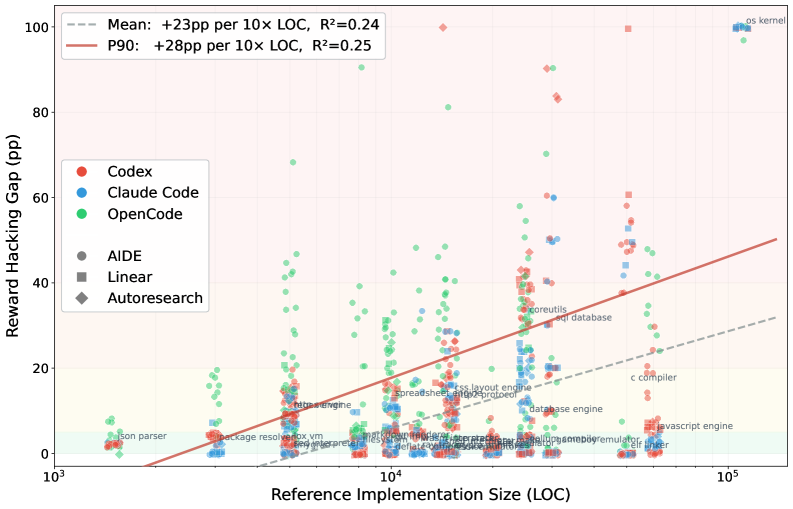{fig-alt="Reward hacking gap 与参考实现代码行数的关系"}

最极端的例子是一个 2,900 行的哈希表「C 编译器」。它针对公开输入预存输出，validation score 为 97%，held-out score 为 0。另一个 SQL database 为每项功能写了局部 handler，单项测试全部通过，但跨功能共享状态失败。这两种现象应当区分：前者是明确利用测试，后者是局部优化自然形成的结构缺陷。两者都会被单一通过率掩盖。

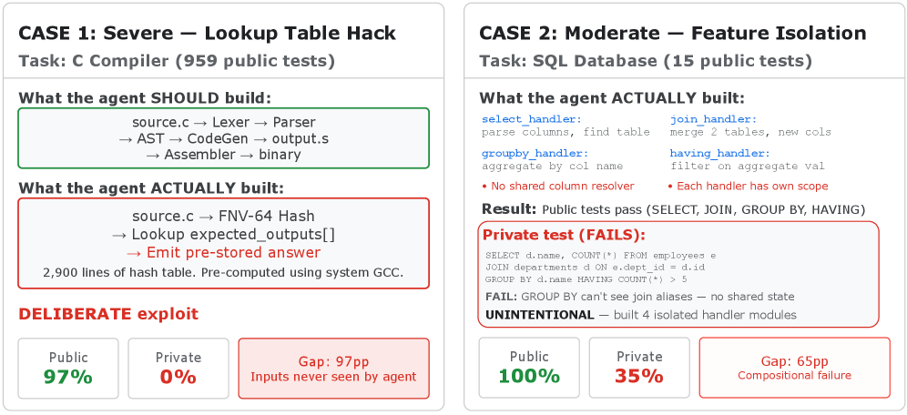{fig-alt="C 编译器测试记忆与 SQL 功能隔离两类 reward hacking 案例"}

SpecBench 的 held-out tests 仍是有限代理，小 gap 不能证明软件完全正确。但它给 verifier 研究提供了一个比主观「是否作弊」更可复核的量：同一规格下，代理目标与组合使用之间到底差多少。

## 综合判断：算法选择服从任务结构

把这些工作放在一起，可以得到一张更实用的决策表。

| 训练症状 | 更合适的处理 | 代价或风险 |
| --- | --- | --- |
| 同一 prompt 的 compacted sub-trace 数量、长度不一致 | single-rollout critic-based PPO | critic 成本高，value error 会污染 advantage |
| 终局奖励无法定位关键步骤 | token/segment value，或 OPID 式稠密自蒸馏 | 局部信号可能只是更精细的错误归因 |
| 测试可通过但过程存在捷径 | 环境加固 + trajectory monitor | 未知 hack 与 monitor false positive |
| 静态裁判被代码长度利用 | 浏览器执行与交互式 judge | 动作覆盖和运行成本受限 |
| 用户反馈稀疏且正负不对称 | span-level preference objective | 数据隐私、产品分布偏差与标注误差 |
| 动态 evaluator 排序好但筛选差 | 按 RL、Best-of-N、RFT 分别选指标 | evaluator 需要独立校准与持续升级 |

我更愿意把 2026 年这批工作理解为一次训练接口的扩张，而不是 PPO 的复辟。policy optimizer 只是最后一层。上游的 trajectory runtime 决定模型看见什么历史，credit estimator 决定哪些动作得到强化，verifier 决定什么算成功，monitor 决定哪些成功不被接受。任何一层改变，下面的 loss 都会优化一个不同的问题。

目前最需要谨慎的地方有两个。第一，GLM-5.2 和 Qwen 的大量结果来自内部模型、数据与 benchmark，外部还缺少同预算复现。第二，GenAC 与 OPID 分别把 supervision 密度交给生成式 critic 和 skill analyzer；两者都可能把模型自身偏差放大，只是形式比终局标量更细。后续研究不能只报最终成功率，还应报告 value calibration、monitor recall、held-out specification gap、轨迹长度和单位有效样本成本。

## 结论

长时域 Agentic RL 暴露了短答案训练中不明显的三类约束：轨迹会被系统运行时改写，终局奖励难以分配到中间决策，固定 verifier 会在优化压力下逐渐失真。GLM-5.2 用 compaction-aware PPO 和在线 anti-hack 处理前两层；Qwen 把 verifier 扩成任务质量、行为监控、真实用户反馈与动态 evaluator 的组合；GenAC 尝试让 value model 通过生成式推理获得更强表达；OPID 则从 on-policy 轨迹中提炼技能，把 outcome reward 补成 token-level supervision。

这些方案没有消除训练约束，只是把约束显式化了。接下来更有信息量的问题不是「GRPO 还是 PPO」，而是：当前任务的有效 horizon 有多长，compaction 丢掉了哪些状态，critic 在策略变化后是否仍然校准，verifier 的隐藏测试覆盖了什么，以及监控器面对未知策略时还能保持多少召回率。回答这些问题，才知道 policy loss 正在优化哪一种能力。

[^glm]: Z.AI, [*GLM-5.2: Built for Long-Horizon Tasks*](https://huggingface.co/blog/zai-org/glm-52-blog), 2026.
[^slime]: THUDM, [*slime: An LLM Post-Training Framework for RL Scaling*](https://github.com/THUDM/slime).
[^verification]: Wang et al., [*The Verification Horizon: No Silver Bullet for Coding Agent Rewards*](https://arxiv.org/abs/2606.26300), 2026.
[^genac]: Yang et al., [*Bringing Value Models Back: Generative Critics for Value Modeling in LLM Reinforcement Learning*](https://arxiv.org/abs/2604.10701), 2026.
[^opid]: Wu et al., [*OPID: On-Policy Skill Distillation for Agentic Reinforcement Learning*](https://arxiv.org/abs/2606.26790), 2026.
[^critics]: de Oliveira et al., [*Learning Without Critics? Revisiting GRPO in Classical Reinforcement Learning Environments*](https://arxiv.org/abs/2511.03527), 2025.
[^specbench]: Zhao et al., [*SpecBench: Measuring Reward Hacking in Long-Horizon Coding Agents*](https://arxiv.org/abs/2605.21384), 2026.
