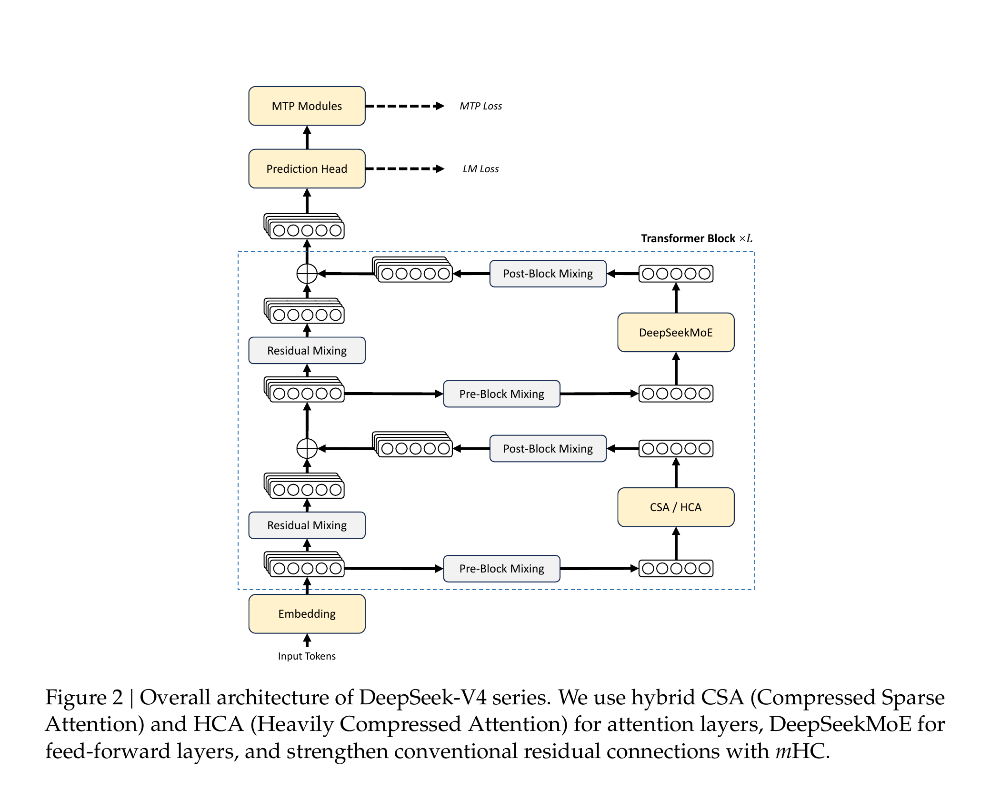
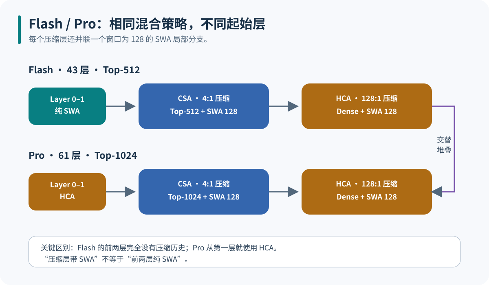
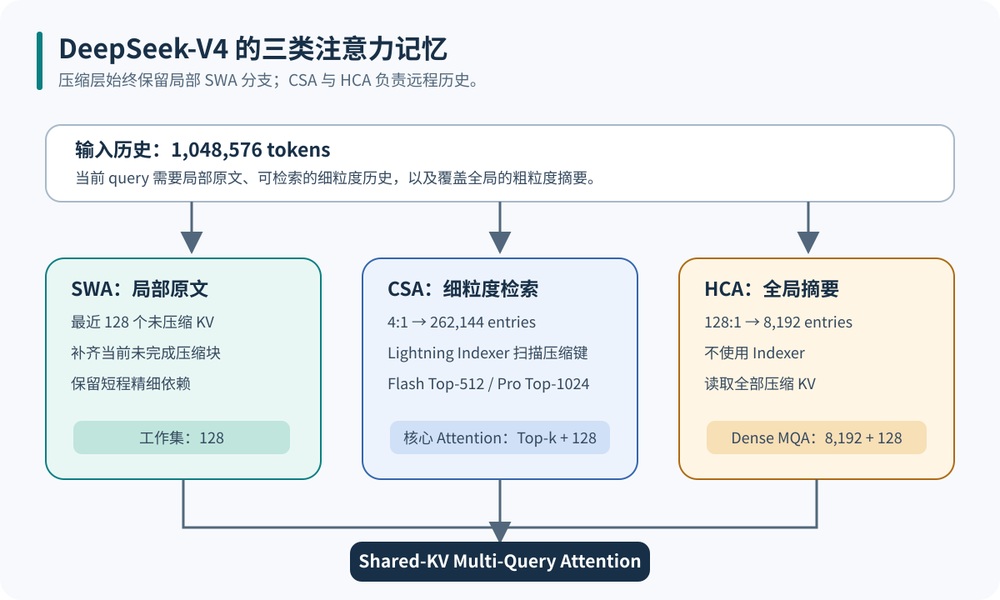
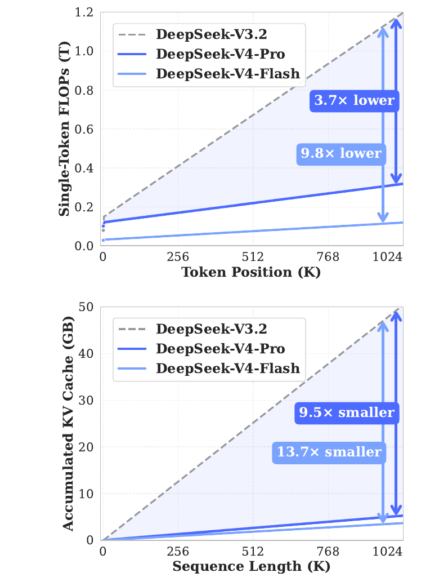
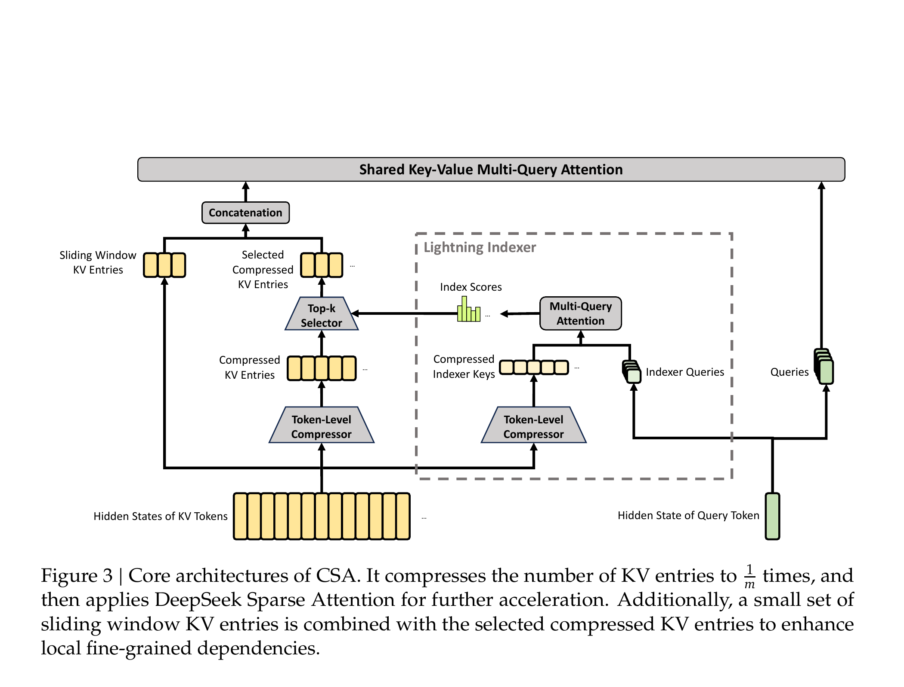
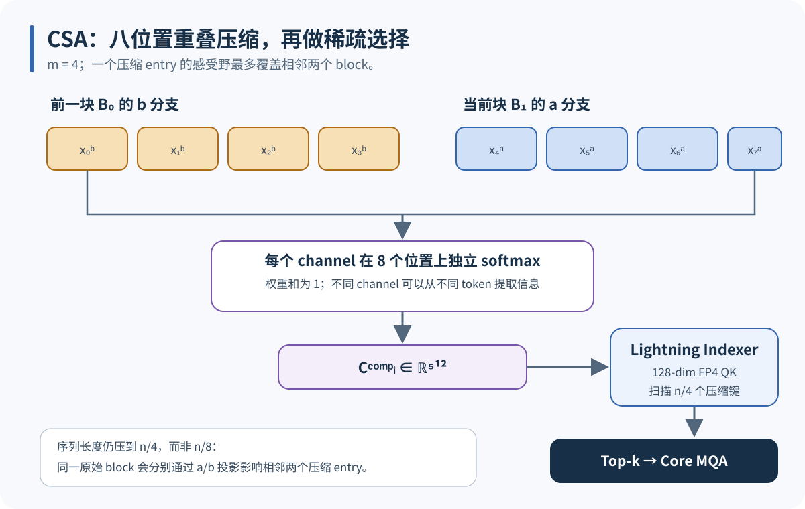
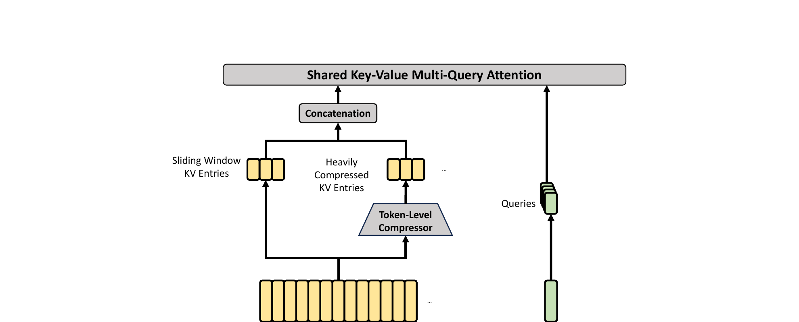
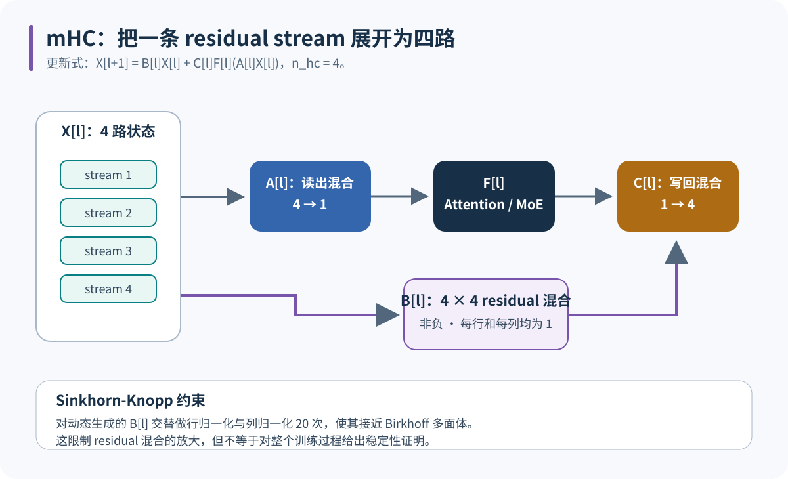
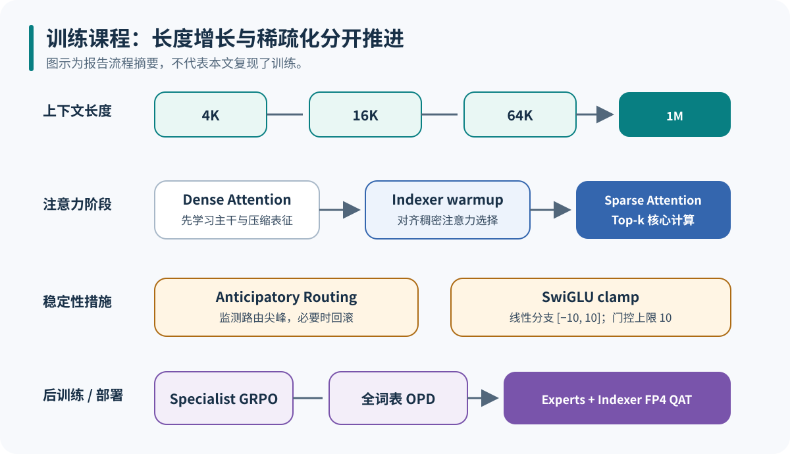

<style>
@media (max-width: 480px) {
  html,
  body {
    max-width: 100vw;
    overflow-x: clip;
  }

  #quarto-content,
  #quarto-document-content {
    min-width: 0;
    max-width: 100%;
  }

  mjx-container[display="true"] {
    display: block;
    max-width: 100%;
    overflow-x: auto;
    overflow-y: hidden;
  }
}
</style>

{fig-alt="DeepSeek-V4 技术报告标题 Towards Highly Efficient Million-Token Context Intelligence 与作者 DeepSeek-AI" width="82%"}

## 摘要与核心判断

DeepSeek-V4 处理长上下文的关键，不是把同一种稀疏注意力复制到所有层，而是让三种记忆粒度协作：SWA 保存最近 128 个未压缩 token；CSA 把历史压到四分之一，再由低成本 Indexer 选择少量条目；HCA 把历史压到一百二十八分之一，对全部摘要执行稠密注意力。局部原文、可检索历史与全局摘要因此同时存在。

这套设计有一个清楚的计算边界。CSA 的 Indexer 仍要扫描 $n/4$ 个压缩键，但它使用 128 维、64 个头的低精度路径；昂贵的核心 Attention 只读取 Top-k 历史与 128 个局部 KV。HCA 不做检索，却只面对 $n/128$ 个摘要。所谓“百万 token 注意力”，实际依靠的是不同精度、不同压缩率和不同访问方式的分层工作集。

::: {.callout-note title="证据范围"}
本文以 [DeepSeek-V4 Technical Report](https://arxiv.org/abs/2606.19348) 和固定提交 `b5968e9` 的 [DeepSeek-V4-Pro 官方推理实现](https://huggingface.co/deepseek-ai/DeepSeek-V4-Pro/blob/b5968e9190ef611bbf34a7229255be88a0e937c1/inference/model.py) 为事实来源。公式后的数量推导属于本文计算。本文没有复现预训练、后训练或论文内部评测；官方推理代码也不是完整训练实现。
:::

## 整体架构与配置

V4-Flash 与 V4-Pro 使用相同的主干组件：混合 CSA/HCA、DeepSeekMoE、四路 mHC residual stream，以及一个 MTP 模块。两者主要区别是规模、Top-k 和最前面的注意力层。

| 配置 | DeepSeek-V4-Flash | DeepSeek-V4-Pro |
| --- | ---: | ---: |
| 总参数 / 每 token 激活参数 | 284B / 13B | 1.6T / 49B |
| Transformer 层数 | 43 | 61 |
| 隐藏维度 | 4,096 | 7,168 |
| 注意力头数 | 64 | 128 |
| 前两层 | 纯 SWA | HCA |
| 后续注意力排布 | CSA / HCA 交替 | CSA / HCA 交替 |
| CSA 压缩率 / Top-k | 4:1 / 512 | 4:1 / 1,024 |
| HCA 压缩率 | 128:1 | 128:1 |
| Indexer | 64 heads × 128 dim，FP4 QK | 64 heads × 128 dim，FP4 QK |
| SWA 窗口 | 128 | 128 |
| Routed / Shared Experts | 256 / 1 | 384 / 1 |
| 每 token 激活 Routed Experts | 6 | 6 |
| mHC 宽度 / Sinkhorn 迭代 | 4 / 20 | 4 / 20 |
| MTP 深度 | 1 | 1 |

{fig-alt="DeepSeek-V4 总体架构，包括 mHC mixing、CSA 或 HCA、DeepSeekMoE、预测头与 MTP 模块" width="90%"}

{fig-alt="Flash 前两层为纯 SWA，Pro 前两层为 HCA，后续均交替堆叠 CSA 与 HCA" width="96%"}

这里容易混淆两句话：**压缩层都带 SWA 局部分支**，但只有 Flash 的前两层是**纯 SWA 层**。Pro 从第 0 层开始就是 HCA，只是在 HCA 旁边并联 128-token SWA。

## 为什么要压缩 KV Cache

标准单头自注意力写成：

$$
Q = HW_Q,
\qquad
K = HW_K,
\qquad
V = HW_V
$$

$$
\mathrm{Attention}(Q,K,V)
=
\mathrm{softmax}\left(\frac{QK^\top}{\sqrt{d_h}}\right)V
$$

长度为 $n$ 的预填充需要构造 $n \times n$ 的相关性；自回归解码每生成一个 token，都要读取此前的 $n$ 个 KV。若所有层、所有 KV 头都保存未压缩历史，KV Cache 与单步读取量均随 $n$ 线性增长，1M 上下文会把显存带宽推到主导位置。

V4 没有要求一种压缩同时负责所有信息。它把工作集拆成三层：

{fig-alt="一百万 token 历史被拆为 SWA 的 128 个局部 KV、CSA 的 262144 个可检索压缩条目和 HCA 的 8192 个稠密摘要" width="96%"}

若把 1M 具体取为 $2^{20}=1{,}048{,}576$，则：

$$
n/4 = 262{,}144,
\qquad
n/128 = 8{,}192
$$

CSA 的核心 Attention 实际读取 Flash 的 $512+128=640$ 或 Pro 的 $1{,}024+128=1{,}152$ 个条目；HCA 读取 $8{,}192+128=8{,}320$ 个条目。CSA 之前还有一次对 262,144 个低维压缩键的全量扫描，不能把 Top-k 误写成整层复杂度与序列长度无关。

{fig-alt="DeepSeek-V4 Pro 和 Flash 与 DeepSeek-V3.2 的单 token FLOPs 和 KV Cache 论文对比曲线" width="62%"}

Figure 1 报告：在 1M token 处，Pro 和 Flash 相对 V3.2 的单 token FLOPs 分别低 3.7 倍和 9.8 倍，累计 KV Cache 分别小 9.5 倍和 13.7 倍。这是论文口径下的模型内部对比，不是本文独立基准。

## CSA：先重叠压缩，再稀疏检索

{fig-alt="CSA 由 token-level compressor、Lightning Indexer、Top-k selector、SWA 条目和 Shared Key-Value Multi-Query Attention 组成" width="96%"}

### 双分支重叠压缩

令输入隐藏状态为 $H\in\mathbb{R}^{n\times d}$。Compressor 生成两组内容与权重 logits：

$$
C^a,C^b,Z^a,Z^b
\in
\mathbb{R}^{n\times c}
$$

对第 $i$ 个压缩条目，CSA 取前一块的 $b$ 分支与当前块的 $a$ 分支。每块长度为 $m=4$，所以每个 channel $j$ 在 $2m=8$ 个位置上单独归一化：

$$
\alpha_{i,:,j}
=
\mathrm{softmax}\left(
\left[
Z^b_{(i-1)m:im,j};
Z^a_{im:(i+1)m,j}
\right]
\right)
\in
\mathbb{R}^{8}
$$

$$
C^{\mathrm{comp}}_{i,j}
=
\sum_{r=1}^{m}
\alpha_{i,r,j}C^b_{(i-1)m+r,j}
+
\sum_{r=1}^{m}
\alpha_{i,m+r,j}C^a_{im+r,j}
$$

输出形状为 $C^{\mathrm{comp}}\in\mathbb{R}^{(n/m)\times c}$。八个位置只是一个压缩 entry 的感受野，输出长度仍是 $n/4$，不是 $n/8$。同一个原始 block 的 $a/b$ 投影会分别影响相邻的压缩 entry，这就是“重叠”。

取某个 channel 的未归一化正权重为 $[1,2,1,2,4,2,1,3]$。归一化后是：

$$
\alpha
=
\frac{1}{16}
[1,2,1,2,4,2,1,3]
$$

这个 channel 更偏向第五个位置；另一个 channel 会得到另一组八维权重。CSA 不是用一套 token 权重压缩整个向量，而是让每个 channel 从八个位置中提取不同信息。

{fig-alt="前一块 b 分支和当前块 a 分支形成八位置感受野，每个 channel 独立归一化后生成压缩条目，再由 Indexer 选 Top-k" width="96%"}

### Lightning Indexer：便宜扫描，昂贵计算只留给 Top-k

Indexer 为当前 query 生成 64 个 128 维低维头，并为压缩历史生成对应索引键。报告中的评分可概括为：

$$
s_{t,i}
=
\sum_{h=1}^{64}
w_{t,h}
\mathrm{ReLU}\left(
\left\langle q^I_{t,h},k^I_{i,h}\right\rangle
\right)
$$

其中 $i$ 遍历 $n/4$ 个压缩历史条目，$w_{t,h}$ 是 query 相关的头权重。索引 QK 路径使用 FP4，先以较低成本算出全部 $s_{t,i}$，再选出 Top-k。Flash 取 512，Pro 取 1,024。

真正的核心 Attention 使用高维 query，并把选中的压缩条目与最近 128 个未压缩 KV 拼接。这里采用 Shared-KV MQA：同一个压缩表示同时充当共享 K 和 V，多组 query head 读取同一份历史。输出端再按组聚合并投影回模型维度。这样，低维 Indexer 负责“去哪里找”，高维 Attention 负责“取回什么”。

压缩存储也分精度：报告保留 RoPE 相关维度为 BF16，其余压缩表示用 FP8；FP4 用在 Indexer 的 QK 路径。不要把“FP4 Indexer”扩写成整个 Attention 都是 FP4。

## HCA：重压缩后全量读取

{fig-alt="HCA 将 128 个 token 压成一个 KV 条目，并与 SWA 条目拼接后执行 Shared Key-Value Multi-Query Attention" width="96%"}

HCA 复用 Compressor 思路，但使用不重叠的 $m'=128$ 分块。对第 $i$ 块、channel $j$：

$$
\beta_{i,:,j}
=
\mathrm{softmax}\left(
Z_{im':(i+1)m',j}
\right)
\in
\mathbb{R}^{128}
$$

$$
C^{\mathrm{hca}}_{i,j}
=
\sum_{r=1}^{m'}
\beta_{i,r,j}C_{im'+r,j},
\qquad
C^{\mathrm{hca}}
\in
\mathbb{R}^{(n/128)\times c}
$$

因为压缩条目只有 $n/128$ 个，HCA 不需要 Indexer，直接对所有摘要做 Dense MQA，再与 128-token SWA 拼接。它牺牲 token 级粒度，换取稳定的全局覆盖。

| 维度 | CSA | HCA |
| --- | --- | --- |
| 压缩方式 | 相邻双分支重叠压缩 | 单块非重叠压缩 |
| 压缩率 | 4:1 | 128:1 |
| 1M 时历史条目 | 262,144 | 8,192 |
| 远程历史访问 | Indexer 全扫后 Top-k | 全部压缩条目 |
| 核心 Attention 工作集 | Top-k + 128 SWA | 8,192 + 128 SWA |
| 信息粒度 | 较细，适合精确检索 | 较粗，持续覆盖全局 |
| 主要额外开销 | 低维 Indexer 扫描与 Top-k | 对摘要的 Dense MQA |

CSA 与 HCA 不是谁替代谁。前者保留细粒度但只读取少量候选，后者降低粒度却避免检索漏选。交替堆叠让模型在不同层重新交换这两类信息。

## SWA、RoPE、RMSNorm 与 Attention Sink

所有 CSA/HCA 层都并联窗口为 128 的 SWA。局部分支还有两个职责：保留邻近依赖；接住尚未凑满压缩块的最新 token。因而压缩历史与局部原文不是二选一。

V4 只对每个注意力头末尾 64 维应用 RoPE，剩余维度保持非旋转内容。核心注意力之后，代码还对这部分输出施加 inverse RoPE，再进入 grouped output projection。部分 RoPE 减少位置旋转对内容通道的占用，而 inverse 路径把已旋转的输出搬回投影所需的表示坐标。

Q、压缩表示和若干投影前后使用 RMSNorm：

$$
\mathrm{RMSNorm}(x)
=
\frac{x}{\sqrt{\mathrm{mean}(x^2)+\epsilon}}
\odot g
$$

注意力还加入一个不可写入 KV Cache 的 sink logit。若普通 logits 为 $z_1,\ldots,z_L$，sink 为 $z_s$，则真实 token 权重为：

$$
p_i
=
\frac{\exp(z_i)}
{\exp(z_s)+\sum_{j=1}^{L}\exp(z_j)}
$$

sink 吸收模型不想分给任何历史 token 的概率质量，不需要伪造一个长期缓存 token。

## 官方源码调用链

下面是依据固定版本 `model.py` 整理的非可运行伪代码。它省略并行通信、缓存布局、量化 kernel 和形状变换，只保留 `Compressor → Indexer → Attention → Block` 的关系：

```python
class Compressor:
    def forward(hidden, ratio):
        content_a, logits_a = project_a(hidden)
        if ratio == 4:                         # CSA overlap
            content_b, logits_b = project_b(hidden)
            values = concat(previous_b, current_a, axis = "token")
            weights = softmax(concat(logits_b, logits_a), axis = "2m")
        else:                                  # HCA, ratio = 128
            values = reshape_blocks(content_a, block = ratio)
            weights = softmax(reshape_blocks(logits_a), axis = "m")
        return sum(weights * values, axis = "block")

class Indexer:
    def forward(query_hidden, history_hidden):
        index_keys = compressor(history_hidden, ratio = 4)
        scores = weighted_sum(relu(fp4_qk(query_hidden, index_keys)), heads = 64)
        return topk(scores, k = 1024)           # Pro; Flash uses 512

class Attention:
    def forward(hidden, cache):
        local_kv = cache.last(128)
        compressed_kv = compressor(cache.hidden, ratio = layer_ratio)
        if layer_ratio == 4:
            selected_kv = gather(compressed_kv, indexer(hidden, cache.hidden))
        else:
            selected_kv = compressed_kv        # HCA reads all summaries
        memory = concat(local_kv, selected_kv, axis = "sequence")
        output = shared_kv_mqa(partial_rope(query(hidden)), memory, attention_sink)
        return grouped_output_projection(inverse_rope(output))

class Block:
    def forward(x):
        x, residual = hc_pre(x, sublayer = "attention")
        x = attention(x)
        x = hc_post(x, residual, sublayer = "attention")
        x, residual = hc_pre(x, sublayer = "moe")
        x = moe(x)
        return hc_post(x, residual, sublayer = "moe")
```

代码中的 `Compressor` 同时服务注意力压缩和 Indexer 压缩；`Attention` 根据层配置决定 ratio 为 4、128 或 0；`Block.hc_pre/hc_post` 在 Attention 与 MoE 两侧各执行一次。固定代码能证明推理时的数据流和配置，不能回答训练损失、warmup 调度或分布式训练器如何实现。

## mHC：四路残差与双随机约束

普通 residual block 是：

$$
x_{l+1}=x_l+F_l(x_l)
$$

mHC 把一条状态扩展成 $n_{hc}=4$ 条 residual stream，更新为：

$$
X_{l+1}
=
B_lX_l
+
C_lF_l(A_lX_l)
$$

$A_l$ 把四路状态混成子层输入，$C_l$ 把子层输出写回四路，$B_l$ 决定旧 residual 如何跨路流动。V4 约束 $B_l$ 为非负双随机矩阵：

$$
B_{l,ij}\geq 0,
\qquad
B_l\mathbf{1}=\mathbf{1},
\qquad
B_l^\top\mathbf{1}=\mathbf{1}
$$

双随机矩阵位于 Birkhoff 多面体内，可写成置换矩阵的凸组合，因此其谱范数满足 $\lVert B_l\rVert_2\leq 1$。$A_l$ 与 $C_l$ 也受到非负和幅值约束。代码通过 20 次 Sinkhorn-Knopp 行列归一化构造 $B_l$，而且混合参数随当前隐藏状态动态生成。

{fig-alt="四路 residual stream 经 A 读出混合进入 Attention 或 MoE，C 把输出写回，B 以双随机矩阵混合旧 residual" width="96%"}

这个约束限制了 residual 混合自身的放大，并不构成整个训练过程稳定的数学证明。Attention、MoE、优化器和低精度误差仍在更新式之外产生影响。

## 训练方案：只保留理解架构所需的部分

{fig-alt="上下文由 4K 扩到 16K、64K 和 1M，注意力从 Dense 经 Indexer warmup 转入 Sparse，后训练经过 Specialist GRPO、OPD 和 FP4 QAT" width="96%"}

预训练中，大部分参数使用 Muon；embedding、预测头与 RMSNorm 参数使用 AdamW。上下文按 $4\mathrm{K}\rightarrow16\mathrm{K}\rightarrow64\mathrm{K}\rightarrow1\mathrm{M}$ 扩展。Flash 前 1T token 保持 Dense Attention，Indexer 先对齐稠密注意力的选择，再在 64K 阶段切到 Sparse Attention；Pro 保留更长的 dense 阶段。这个顺序把“学会表示”和“学会删减候选”拆开，避免随机 Indexer 一开始就切断梯度所需的历史。

训练稳定性主要依赖两项工程措施。Anticipatory Routing 监测 MoE 路由尖峰并在异常前后回滚；SwiGLU 将线性分支截断到 $[-10,10]$，门控分支上限设为 10。这些是报告采用的控制手段，不等于单独的因果消融结论。

后训练先针对不同领域训练 specialist，并使用 GRPO 强化，再通过十多个教师进行 full-vocabulary on-policy distillation（OPD），以反向 KL 在全部词表上合并能力。部署前对 experts 和 Indexer QK 做 FP4 QAT。Indexer 以两倍 Top-k 构造候选，报告其目标 Top-k 召回率为 99.7%；该数值仍是论文报告结果。

## 阅读判断与证据边界

V4 的核心取舍可以压缩成三句话：用 CSA 保存“可定位的细节”，用 HCA 保存“始终可见的概貌”，用 SWA 保存“不能等压缩的眼前信息”。mHC 则处理另一条轴：当模型规模和低精度路径增加后，限制 residual stream 的跨层放大。

仍需保留四条边界：

1. 官方 `model.py` 是推理参考实现，不是完整训练 pipeline。Muon 调度、Indexer warmup、Anticipatory Routing、GRPO 与 OPD 只能依据技术报告解读。
2. 本文没有复现论文的 FLOPs、KV Cache、长上下文能力或 99.7% Indexer 召回率，相关数字均保持“论文报告”口径。
3. 标称 1M 上下文说明模型和推理系统允许该窗口，不自动等于任意任务都能有效利用 1M token。信息压缩、位置分布和评测构造仍会影响有效上下文。
4. CSA 把昂贵核心 Attention 限制到 Top-k，但 Indexer 依然对 $n/4$ 个键做低成本全量扫描。它降低常数和高维计算，不把端到端读取变成严格常数复杂度。

## 参考资料

- DeepSeek-AI. [DeepSeek-V4 Technical Report](https://arxiv.org/abs/2606.19348), 2026.
- DeepSeek-AI. [DeepSeek-V4-Pro `inference/model.py`, revision `b5968e9`](https://huggingface.co/deepseek-ai/DeepSeek-V4-Pro/blob/b5968e9190ef611bbf34a7229255be88a0e937c1/inference/model.py).
- DeepSeek-AI. [DeepSeek-V4-Pro `inference/config.json`, revision `b5968e9`](https://huggingface.co/deepseek-ai/DeepSeek-V4-Pro/blob/b5968e9190ef611bbf34a7229255be88a0e937c1/inference/config.json).
- DeepSeek-AI. [DeepSeek-V4-Flash-0731 configuration, revision `7872f01`](https://huggingface.co/deepseek-ai/DeepSeek-V4-Flash-0731/blob/7872f01b1d1fe23eabc4c98b48bffcef5a386062/config.json).
