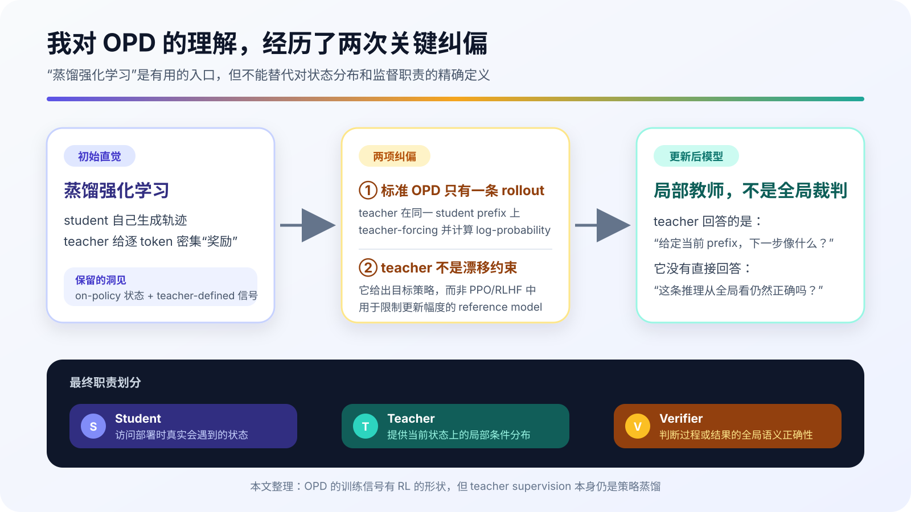
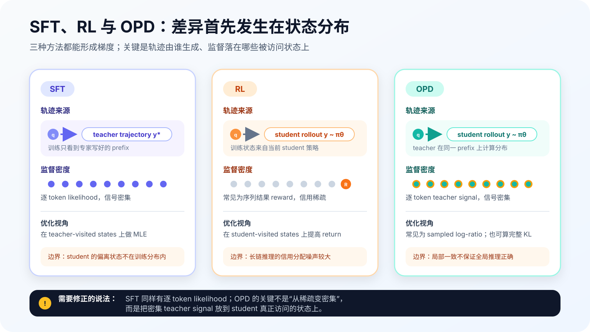
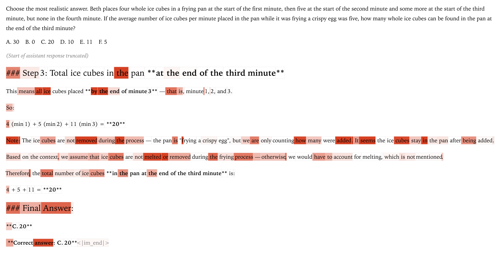
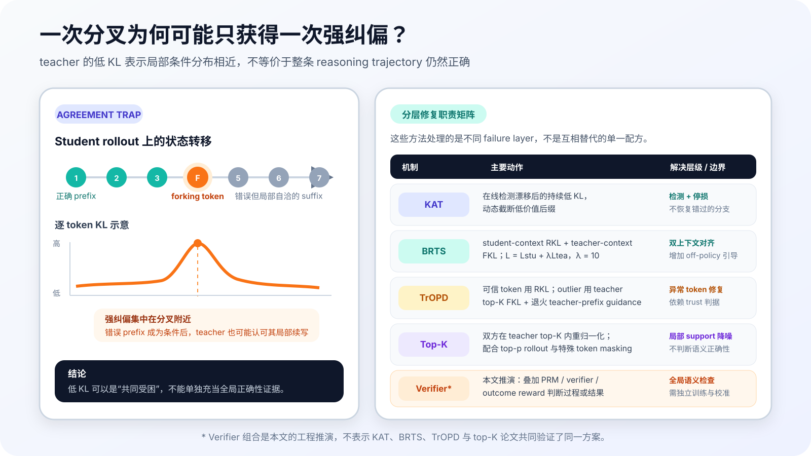

我最初对 OPD 的理解很直接：它本质上像一种「蒸馏强化学习」。Student 先生成轨迹，teacher 对每个 token 给出密集反馈，再把 teacher 与 student 的 log-probability ratio 当成隐式 reward。与只有最终分数的 RL 相比，这种训练把 credit assignment 从整条序列拆到了 token；与 SFT 相比，它似乎还能告诉 student 哪一步走偏了。

这个直觉抓住了 OPD 最有价值的工程特征，但也混进了两处容易误导实现的假设。标准 OPD 不是 student 和 teacher 各自 rollout 一条轨迹后逐 token 对齐；只有 student rollout，teacher 在同一条 student prefix 上做 teacher-forcing。teacher 也不是 PPO/RLHF 里用于限制策略漂移的 reference model，而是 student 要逼近的 target policy。

更重要的修正出现在我继续追问「错误分支之后怎么办」时。Teacher 给出的条件概率只能回答：**既然已经处于当前 prefix，下一 token 哪些更合理？** 它没有直接回答：**当前 prefix 所代表的推理状态在全局上是否正确？** 这条边界解释了 OPD 为什么能准确抓住部分 forking token，也解释了错误轨迹后半段为什么可能重新出现低 KL。

{#fig-opd-mental-model-journey-zh fig-align="center" width="94%"}

本文保留「蒸馏强化学习」这个初始直觉，但把它拆成可以核对的目标函数、状态分布和失败模式。我的结论是：OPD 提供的是 student-visited states 上的局部策略监督；如果任务要求验证一条推理链是否仍然通向正确答案，还需要额外的 state 或 outcome signal。

## 1. 「蒸馏强化学习」为什么是一个有用但不完整的直觉

把 OPD 看成 RL-like training 有充分理由。轨迹由当前 student policy 采样，训练框架可以直接复用 rollout、old log probability、importance ratio 与 policy-gradient 更新路径；Thinking Machines 的工程化 recipe 也把负的 student/teacher log-ratio 写入 advantage。Teacher 因而很像一个随状态变化的 dense reward provider。

但「像 RL」不等于「OPD 的目标来自环境奖励」。标准 OPD 的优化方向已经由 teacher distribution 定义。它并不先学习一个 reward model，再让策略寻找能获得高分的任意行为；它要求 student 在自己访问的状态上靠近 teacher。只要 teacher 固定，这个目标的自由度比 outcome-only RL 小得多。

这里的 teacher 也不应与 RLHF 的 reference model 混用。PPO/RLHF 常见的抽象是：

$$
\max_{\theta}
\mathbb{E}_{y \sim \pi_{\theta}}[R(q,y)]
-
\beta
D_{\mathrm{KL}}
\left(
\pi_{\theta}
\,\|\,
\pi_{\mathrm{ref}}
\right)
$$

$R$ 决定任务方向，$\pi_{\mathrm{ref}}$ 主要约束策略不要偏离初始行为太远。OPD 没有这两个角色的拆分：$\pi_T$ 本身就是目标分布，最小化 student-to-teacher divergence 就是任务。把 teacher 叫作 reference distribution 在数学上没有问题，但若沿用 RLHF 语境，就容易误以为还有一个独立 reward 决定「做什么」、teacher KL 只负责「别走太远」。标准 OPD 中并非如此。

我原来还设想 teacher 会针对同一个问题生成另一条轨迹，再与 student 轨迹对齐。若两条推理链长度不同、分叉位置不同，这种逐 token 对齐本身就没有稳定语义。标准流程更简单：

1. 从问题 $q$ 出发，由 student 生成 $y$。
2. 固定已经生成的 student prefix，让 student 与 teacher 分别计算下一个 token 的分布。
3. 在相同条件状态上比较两个分布，并只更新 student。

也就是说，teacher 不需要替这道题重新「做一遍」。它被放到 student 已经走到的位置，然后回答「从这里继续，我会怎样分配下一 token 的概率」。

这一步也给出一个很实用的实现自检：同一位置的两组 logits 必须对应完全相同的 prompt、student prefix、attention mask 与 token 边界。只要 teacher 读取的是自己生成的前缀，或者两边因为 chat template、特殊 token、截断位置不同而错开，计算出来的 KL 就不再表示「同一状态下的策略差异」。它可能仍然产生一个数，甚至 loss 也能下降，但监督对象已经悄悄改变。对 OPD 而言，prefix 对齐不是数据清洗细节，而是目标函数成立的前提。

{#fig-opd-reverse-kl-training-flow-zh fig-align="center" width="92%"}

这个区别决定了 on-policy 的含义：训练状态来自 student 当前真正会访问的分布，而不是 teacher 预先写好的答案分布。它也埋下后文的限制，因为 teacher 必须在自己可能很少访问的 student prefix 上给出条件概率。

## 2. 从完整 reverse KL 到 sampled-token signal

给定问题 $q$，student rollout 与第 $t$ 步状态写成：

$$
y \sim \pi_{\theta}(\cdot \mid q),
\qquad
s_t = (q, y_{\lt t})
$$

在同一个 $s_t$ 上，student 与 teacher 的完整 next-token reverse KL 是：

$$
d_t
=
D_{\mathrm{KL}}
\left(
\pi_{\theta}(\cdot \mid s_t)
\,\|\,
\pi_T(\cdot \mid s_t)
\right)
=
\sum_{v \in \mathcal{V}}
\pi_{\theta}(v \mid s_t)
\log
\frac{\pi_{\theta}(v \mid s_t)}{\pi_T(v \mid s_t)}
$$

如果保存每个位置的完整词表分布，序列长度、词表大小和 batch size 会共同放大显存开销。长思维链训练中常见的实现只使用 student 实际采样出的 $y_t$：

$$
\hat{d}_t
=
\log \pi_{\theta}(y_t \mid s_t)
-
\log \pi_T(y_t \mid s_t),
\qquad
y_t \sim \pi_{\theta}(\cdot \mid s_t)
$$

把该 log-ratio 取负，就得到可塞入 RL 训练路径的局部 signal：

$$
A_t = -\hat{d}_t
=
\log \pi_T(y_t \mid s_t)
-
\log \pi_{\theta}(y_t \mid s_t)
$$

若 student 给已采样 token 很高概率、teacher 给它很低概率，$\hat{d}_t$ 会很大，更新会压低 student 对该选择的偏好。双方接近时，更新较小。因此，把 $A_t$ 称作「teacher-defined dense reward」是有用的工程语言；更严格的说法是，它是 sampled-token reverse-KL 的 log-ratio signal，而不是 teacher 输出的二元对错标签。

「Teacher-defined」也不能理解为 teacher 单独吐出一个 reward 标量。$A_t$ 同时含有 teacher log probability 与 student 自己的 log probability：teacher 决定目标侧的相对偏好，student 项则说明当前策略把多少概率压在了已采样动作上。因为 $y_t$ 来自 student，单样本 log-ratio 是该状态完整 RKL 的 Monte Carlo 估计；把它放入 policy-gradient 路径时，还必须明确哪些 log probability 来自 rollout policy、哪些由 learner 重算，以及 importance correction 在哪里生效。否则，一个看似简单的负 log-ratio 可能同时混入 policy staleness 与估计器偏差，训练曲线却未必会立刻暴露问题。

完整 OPD 目标还包含两层期望：问题来自训练集，轨迹来自当前 student。写出来更容易看见它与固定离线蒸馏的差别：

$$
\mathcal{L}_{\mathrm{OPD}}(\theta)
=
\mathbb{E}_{q \sim \mathcal{D},\,y \sim \pi_{\theta}(\cdot \mid q)}
\left[
\sum_{t=1}^{T}
D_{\mathrm{KL}}
\left(
\pi_{\theta}(\cdot \mid s_t)
\,\|\,
\pi_T(\cdot \mid s_t)
\right)
\right]
$$

参数更新后，$y$ 的分布也会变化，所以同一批 prompt 在不同 step 上对应不同训练状态。严格的 on-policy 实现需要持续刷新 rollout；若把旧 trajectory 反复训练很多 epoch，方法会逐渐变成带 stale policy data 的近似。RL infrastructure 在这里的价值不只是一套 loss API，也包括 generation 与 learner 之间的版本管理。

这里还要区分两个经常被都叫作「token-level OPD」的对象。完整序列 reverse-KL 的 policy gradient 会把当前动作与后续 log-ratio 关联；常见的 immediate-token 更新只保留本位置的 $\hat{d}_t$。后者相对 sequence-level objective 有偏，但切断 future-reward coupling 后方差更低。[Revisiting OPD](https://arxiv.org/abs/2603.25562) 给出的最坏方差上界分别随序列长度按 $O(T^2)$ 与 $O(T^4)$ 缩放。工程上选择 sampled-token estimator，不只是为了少存 logits，也是在偏差与长序列方差之间做取舍。

这里的对应关系需要说清：$O(T^2)$ 是 immediate-token estimator 的最坏方差上界，$O(T^4)$ 对应带 future-reward coupling 的 sequence-level estimator。它们是有界 reward 与有界 score-gradient 假设下的保守上界，不是任意真实训练的精确方差。这个结果支持的结论是「长 horizon 下局部估计更容易控制」，而不是「局部估计天然无偏」或「sequence-level 目标一定不可用」。当任务确实需要跨步因果归因时，删掉所有 future coupling 也会删掉一部分本来想要的学习信号。

Reverse KL 的 mode-seeking 还带来 support 问题。因为期望由 student 分布取样，student 从不生成的 teacher mode 很少获得直接梯度。Student 已经「大概会」某类推理时，RKL 可以集中其概率质量；student 完全不会时，正确 mode 连训练状态都难以进入。由此看，SFT/FKL 与 OPD 不是简单的替代关系：前者可先把正确行为放进 student support，后者再在 student 自己的 state distribution 上修正。BRTS 的 teacher-context FKL 与 TrOPD 的 teacher-prefix guidance，都是针对这个缺口的不同实现。

## 3. SFT、RL 与 OPD 的差异不在「有没有 token loss」

我原来的表达是「SFT 只告诉 student 什么是对的，OPD 才逐 token 告诉它哪一步对、哪一步错」。这句话直观，却不够准确。SFT 同样在每个目标 token 上计算 likelihood，监督也是逐 token 的。真正的差异是：**这些 token 属于谁的轨迹，以及模型在哪些状态上接受监督。**

在 teacher trajectory $y^T$ 上，SFT 的典型目标是：

$$
\mathcal{L}_{\mathrm{SFT}}
=
-\sum_t
\log \pi_{\theta}
\left(y_t^T \mid q, y_{\lt t}^T\right)
$$

Student 看到的是 teacher 能走到的 prefix。推理时一旦 student 在早期偏离，后续状态可能从未在 SFT 数据中出现。OPD 则让 $s_t$ 来自 student rollout，所以 supervision 落在 deployment policy 真实访问的状态上。GKD 把这种 student-generated output 与 generalized divergence 结合，MiniLLM 则系统研究了 reverse KL 在生成式语言模型蒸馏中的作用；二者都比「SFT 没有 token-level signal」更准确地解释了 OPD 的来源。

Outcome RL 的状态也来自 student，但一条长轨迹往往先得到 sequence-level reward。算法可以通过 return、advantage 或 verifier 把信号传播回动作，然而「哪一步造成最终成败」仍需要估计。OPD 直接在每个 student prefix 上比较策略分布，局部 credit 更密；代价是它优化 teacher matching，而非直接优化任务成功。

{#fig-opd-sft-rl-opd-contrast-zh fig-align="center" width="96%"}

| 方法 | 训练状态来自 | 反馈粒度 | 直接优化的对象 | 主要缺口 |
|---|---|---|---|---|
| SFT / off-policy KD | teacher 或离线数据轨迹 | token | 固定目标 token 的 likelihood | student 偏离后缺少覆盖 |
| Outcome RL | student rollout | 常为 sequence / episode | 环境、规则或 reward model 的得分 | 长序列 credit assignment 方差大 |
| OPD | student rollout | token / local distribution | teacher–student policy matching | teacher 的局部概率不等于全局正确性 |

因此，我仍愿意保留「蒸馏强化学习」作为 mental shortcut，但会附上限定：它是**以 student state visitation 组织数据、以 teacher policy 定义密集局部信号的策略蒸馏**。这比把 teacher 称为 reference critic 更准确。

## 4. Forking token 之后：局部自洽不等于全局正确

考虑一条数学推理轨迹。Student 前几步正确，在某个 token 把符号写反，后续计算严格遵循这个错误前提，最后得到错误答案。Teacher 在分叉位置可能强烈反对该 token，于是出现高 KL；但 teacher-forcing 继续把 teacher 放在已经损坏的 prefix 上。给定错误前提，后面的代数变换仍可能是局部合理的，teacher 与 student 又会趋于一致。

可以把这个过程理解成一次条件化后的「反事实续写」。假设题目要求解一个方程，student 本应得到 $x=3$，却在移项时写成 $x=-3$。分叉处 teacher 可能把负号视为低概率动作；可一旦 prefix 已明确声明 $x=-3$，后续写出「因此 $x^2=9$」在这个局部上下文里完全成立。Teacher-forcing 要求 teacher 尊重已经给定的文本条件，它不会自动删除负号并从正确分支重算。于是训练信号最强的位置可能只集中在分叉附近，后面的每一步即使服务于错误结论，也不必持续产生高 KL。

这不是 teacher「没看懂题」，而是两个问题被混在了一起：语言模型条件分布评估的是给定历史后的合理续写，轨迹判定器评估的是这段历史是否仍满足原问题的约束。前者可以在错误世界里保持一致，后者需要回看题目、检查不变量，甚至执行外部计算。OPD 的局部信用分配在这里仍然有价值——它至少可能把强纠偏集中到真正改变分支的动作上——但不能据此推断后缀中的低 KL 已经为整条路径背书。

Thinking Machines 的可视化正好呈现了这种模式：把推理引向错误分支的 forking token 受到明显惩罚，最终答案虽然错误，却因为对完整错误前缀而言高度可预测，没有得到同样强的惩罚。

{#fig-tml-forking-token-kl-zh fig-align="center" width="92%"}

用概率语言说，teacher 提供的是：

$$
\pi_T(a_t \mid s_t)
$$

若用 $C(s_t)=1$ 表示当前状态仍在一条可到达正确结论的路径上，我们真正关心的另一个量却是：

$$
P\left(C(s_t)=1\right)
$$

两者不是同一个问题。前者是 local continuation probability；后者要求评价 state correctness、可恢复性或最终 outcome。一个强 language model 可以在错误设定下给出语法与逻辑都连贯的续写，这种能力反而会让错误 suffix 的 KL 下降。

这也提醒我不要把 per-token KL heatmap 直接解释成「错误定位图」。高 KL 可能标记真正的 reasoning fork，也可能只是格式、tokenizer 或表达风格差异；低 KL 可能表示 student 已经学会，也可能表示双方被困在同一个低价值局部状态。KL 测量的是分布差异，不自带语义判决。

把 KL 与 outcome 放在一起，至少会出现四种需要不同处置的观测：

| 局部 KL | 轨迹 / 状态结果 | 更合理的解释 | 不应直接做的事 |
|---|---|---|---|
| 低 | 正确 | student 已接近 teacher，监督可能趋于饱和 | 因梯度小就判定数据无价值 |
| 高 | 错误 | 可能是 forking token，也可能是分布 outlier | 不经检查就把全部高 KL 当语义错误 |
| 低 | 错误 | 局部自洽、agreement trap 或 teacher 同样失效 | 把 agreement 当作正确性证据 |
| 高 | 正确 | 多解、措辞、tokenizer 或特殊 token 差异 | 盲目压制 student 的有效替代路径 |

这张表也说明，仅凭一个 KL threshold 无法完成通用 error detection。KAT 的成立依赖「持续窗口、足够深度、动态阈值」和论文中的梯度证据；TrOPD 则把极端 mismatch 当作 estimator reliability 问题。两者都比「KL 大就是错、KL 小就是对」更克制。

## 5. Agreement trap：持续低 KL 何时意味着监督失效

[KAT](https://arxiv.org/abs/2606.09471) 把后一种情况称为 low-KL agreement trap。论文对 rollout 划分出 pre-agreement、agreement 与 post-agreement 三段，并检查各段梯度与训练主更新子空间的对齐。其 Figure 2 显示，agreement 与 post-agreement 段的更新对主方向贡献更弱；在分析的早期与后期 checkpoint 中，超过 60% 的 rollout 至少出现一段持续低 KL 区域。

{#fig-kat-low-kl-evidence-zh fig-align="center" width="96%"}

KAT 没有改写 OPD loss，而是改变「继续生成哪些 token」。它先对最近 $W$ 个位置的 reverse KL 求滑动平均：

$$
z_t
=
\frac{1}{W}
\sum_{i=t-W+1}^{t} d_i
$$

训练 warmup 期间记录每条完整 rollout 的最小窗口分数，并把近期统计放入 FIFO buffer。后续阈值取该 buffer 的动态分位数，而不是手写一个固定 KL 常数。超过初始豁免长度后，只有连续 $T$ 个窗口都满足低 KL 条件才触发终止，避免被标点或局部措辞造成的单点下降误导。

其价值很具体：一旦检测到持续 agreement，剩余 suffix 不再生成，也不参与 OPD 更新。论文以 Qwen3-8B 为 teacher、Qwen3-1.7B-Base 与 Qwen3-4B-Base 为 students，在 AMC、MATH500、MinervaMath、AIME24 四个 benchmark 上与标准 OPD 对比。按两个 student scale 汇总，avg@$k$ 从 30.27 升到 31.08，相对提升 2.66%；pass@$k$ 从 54.74 升到 56.62，相对提升 3.43%；平均 rollout 长度从 1480 token 降到 596，减少 59.73%。这些数字支持的是「过滤低价值后缀」这一策略，不能推出所有低 KL token 都应被 mask。

{#fig-opd-agreement-trap-recovery-zh fig-align="center" width="96%"}

## 6. 四类修正分别解决什么问题

这些后续工作常被并列成「改进 OPD 的方法」，但它们针对的故障并不相同。KAT 处理已经缺乏训练价值的 suffix；BRTS 给 student 补充正确 teacher context；TrOPD 处理 teacher–student mismatch 造成的 outlier gradient；local support matching 修正单 sampled token 的脆弱估计。分开看，才能知道它们能否组合。

| 方法 | 主要诊断量 | 采取的动作 | 保留的 OPD 部分 | 仍未直接解决 |
|---|---|---|---|---|
| KAT | 持续低 KL 窗口 | 在线终止 suffix | 原 loss 与 student prefix | 正确轨迹如何恢复 |
| BRTS | teacher rollout 正确性与 student overlap | 加 teacher-context FKL | student-context RKL | verifier 本身的可靠性 |
| TrOPD | teacher/student 接受率与 outlier | 分区使用 RKL、top-$K$ FKL，并退火 teacher prefix | 训练末期完全 on-policy | 全局语义正确性 |
| Local support matching | teacher top-$K$ support | support 内重归一化后做 truncated RKL | student rollout 与局部更新 | 错误 prefix 的真值判断 |

如果按 failure layer 排列，这四种方法落在四条不同轴上：KAT 管计算预算与 token 选择，BRTS 管训练状态覆盖，TrOPD 管大分布差距下的梯度可靠性，local support matching 管局部分布估计。它们之间可能互补，但「可以组合」不等于「叠加必然增益」。例如，KAT 太早终止会减少 BRTS 或 verifier 观察恢复行为的机会；teacher-prefix guidance 改变了 rollout state distribution，也会改变原有 KAT 阈值的统计尺度；top-$p$ sampling 降低 outlier 后，TrOPD trust region 的命中率又会随之变化。

所以组合实验应先写出故障假设，再选择最小干预。若主要现象是错误后缀长而 KL 持续低，先测 KAT；若正确轨迹几乎从未进入 student support，先补 teacher context；若 loss spike 集中在少量极端 ratio，先处理 estimator；若 KL 与正确率持续背离，再引入独立 verifier。这样每个组件都有可证伪的职责，训练收益也不至于被一个总分掩盖。

### 6.1 KAT：停止为低价值后缀付费

KAT 的判断较为克制。它不声称能找到第一个语义错误，也不要求额外 PRM。它只利用 OPD 本来就计算的 reverse KL，检测在足够深的位置上是否出现持续低 KL。命中后直接停止生成。

这是一种 rollout allocation 方法。它节省的既有 teacher/student forward，也有后续反向传播；但被截断的 suffix 不会因此变成正确轨迹。如果目标是教会 student 如何从错误状态恢复，仅终止还不够。KAT 更适合回答「这一段还值得继续训练吗」，而非「正确路径在哪里」。

### 6.2 BRTS：同时覆盖 student context 与 teacher context

[BRTS](https://arxiv.org/abs/2605.09725) 保留标准 student-context branch，并增加 teacher-context branch。前者在 student prefix 上做 reverse KL，仍覆盖 student 实际访问的状态；后者先生成多条 teacher rollout，优先选择答案正确的轨迹，在多个正确候选中再选与 student top-$K$ 行为最接近的一条。若无条件 teacher samples 都失败，方法会用 ground-truth-conditioned recovery 再尝试获得自然推导。

两个 loss 的方向也不同：

$$
\mathcal{L}_{\mathrm{stu}}
=
\mathbb{E}
\left[
D_{\mathrm{KL}}
\left(
\pi_S(\cdot \mid s^S_t)
\,\|\,
\pi_T(\cdot \mid s^S_t)
\right)
\right]
$$

$$
\mathcal{L}_{\mathrm{tea}}
=
\mathbb{E}
\left[
D_{\mathrm{KL}}
\left(
\pi_T(\cdot \mid s^T_t)
\,\|\,
\pi_S(\cdot \mid s^T_t)
\right)
\right]
$$

$$
\mathcal{L}_{\mathrm{BRTS}}
=
\mathcal{L}_{\mathrm{stu}}
+
\lambda \mathcal{L}_{\mathrm{tea}},
\qquad
\lambda = 10
$$

Student-context RKL 负责「在我会到达的地方纠偏」，teacher-context FKL 负责「让我看到当前策略可能到不了的正确 support」。论文实验使用 $\lambda = 10$；该值依赖两项 loss 的归一化口径，不应当作跨实现通用常数。BRTS 的 Best-of-N 选择还意味着额外 teacher generation 成本，它交换的是更可靠的正确轨迹，而不是免费修复。

### 6.3 TrOPD：在可信区使用 RKL，在 outlier 区换估计器

[TrOPD](https://arxiv.org/abs/2606.01249) 关注另一类不稳定：teacher 与 student 分布差距较大时，sampled token 的 log-ratio 可能形成极端 policy-gradient outlier。方法借鉴 speculative decoding 的接受率，用下面的概率判断 student token 是否处于 teacher-verifiable trust region：

$$
P_{\mathrm{trust}}(x)
=
\min
\left(
\frac{\pi_T(x)}{\pi_S(x)},
1
\right)
$$

可信 token 继续使用 sampled-token RKL；outlier token 不再盲目沿用同一信号，而是使用 teacher top-$K$ 上的 FKL 近似。论文也比较了 clipping 与 masking，但完整 TrOPD 选择保留 outlier 中仍可能有用的 teacher support，而不是全部丢弃。

它还增加 teacher-prefix guidance：轨迹前半段由 teacher prefix 提供，student 从该 prefix 继续生成，并在 teacher 段使用 FKL。最大 teacher-prefix 长度随训练按 cosine schedule 逐步退火到 0，所以训练末期恢复为完全 on-policy generation。这不是把 standard OPD 偷换成永久 off-policy SFT，而是用逐渐撤除的支架把 student 引回 teacher 能可靠监督的区域。

### 6.4 Teacher top-$K$ local support matching：别让一个 sampled token 代表整个分布

[Revisiting OPD](https://arxiv.org/abs/2603.25562) 从 estimator 与实现细节出发，指出 one-token signal 失衡、student prefix 上 teacher guidance 不可靠，以及 tokenizer/special-token mismatch 三类问题。其方案先在每个 prefix 上取得 teacher top-$K$ support：

$$
S(s_t) = \mathrm{TopK}_{\pi_T}(s_t)
$$

然后在这个 support 内分别重归一化 teacher 与 student：

$$
\hat{\pi}_S(v \mid s_t)
=
\frac{\pi_S(v \mid s_t)}
{\sum_{u \in S(s_t)} \pi_S(u \mid s_t)},
\qquad
\hat{\pi}_T(v \mid s_t)
=
\frac{\pi_T(v \mid s_t)}
{\sum_{u \in S(s_t)} \pi_T(u \mid s_t)}
$$

最后在局部 support 上计算 truncated RKL。这里的「双方重归一化」不能省：Figure 6 的消融显示，去掉 renormalization 会迅速 collapse；$K$ 太小或 rollout 完全不做截断也会破坏稳定性。论文因此把该目标与 top-$p$ rollout sampling、special-token masking 一起使用。Top-$p$ 降低采到极低概率 token、进入不可靠 prefix 的频率；mask 则减少不同 tokenizer 或控制 token 约定造成的假性冲突。

{#fig-revisiting-opd-ablation-zh fig-align="center" width="94%"}

这项工作的 single-task math 设置使用 Qwen2.5-7B-Instruct student、OpenThinker3-7B teacher 与 DAPO-Math-17K 英文训练集。在相同 top-$p$ rollout 条件下，标准 sampled-token OPD 的 AIME24 avg@32 为 21.6，teacher top-$K$ local support matching 为 23.6。多任务实验仍使用 Qwen2.5-7B-Instruct student，在 math 与 ALFWorld batch 间交替；math teacher 为 OpenThinker3-7B，agent teacher 为 GiGPO-Qwen2.5-7B-Instruct-ALFWorld。相对标准 sampled-token OPD，不加 mask 的 local support matching 将五个数学 benchmark 的 pass@1 平均分从 34.8 提高到 41.7，即相对提升 19.8%，同时 ALFWorld success rate 从 90.6 升到 95.3。这些数字不能脱离对应模型、任务混合与评测口径单独使用。

## 7. OPD 加 verifier：本文推演的工程组合

前四类方法都没有让 teacher next-token probability 变成全局真值判定器。要直接处理「当前 reasoning state 是否仍然正确」，自然会想到叠加 PRM、规则 verifier 或 outcome reward。不过下面这一组合是我基于信号职责做的工程推演，不是 KAT、BRTS、TrOPD 与 Revisiting OPD 共同验证过的统一算法。

可以把训练信号拆成：

$$
r_t^{\mathrm{total}}
=
\alpha r_t^{\mathrm{OPD}}
+
\beta r_t^{\mathrm{state}}
+
\gamma R^{\mathrm{outcome}}
$$

$r_t^{\mathrm{OPD}}$ 负责局部 action distribution：在当前 prefix 下，下一个 token 是否接近 teacher；$r_t^{\mathrm{state}}$ 由 PRM 或可执行检查判断中间状态是否满足约束；$R^{\mathrm{outcome}}$ 检查最终答案、代码测试或环境任务是否成功。三者的 label granularity 和失效方式不同，不应未经校准直接相加。

这里的 state signal 还需要比「这一句看起来对不对」更严格的定义。一个中间状态至少可以区分三类：仍在正确路径上、已经错误但可以恢复、已经进入不可恢复区域。二元 PRM 往往把后两类压成同一个负标签，可能教会模型放弃，而不是回退或修正。若训练目标包含恢复能力，verifier 最好能输出违反了哪条约束、从哪一步开始失效，或至少给出可恢复性分层；对应评测也应观察首次失败后的恢复概率，而不只是最终 pass/fail。

Teacher 与 verifier 的冲突尤其值得保留为显式事件。Teacher 高概率、verifier 判错，可能是 teacher 也被错误 prefix 带偏；teacher 低概率、verifier 判对，则可能是 student 找到了另一条有效路径，或 verifier 漏检了细节。若实现直接把两项 reward 加总，这些冲突会在平均值中消失。更稳妥的做法是先记录冲突矩阵，分别检查各象限的最终 outcome，再决定是 gating、分阶段训练，还是只把 verifier 用于数据选择。

在数学任务中，我会优先使用可执行 verifier 标记方程等价、约束满足与最终答案，而不是让另一个 language model 对每一步给模糊分数。在代码任务中，编译、单元测试和静态约束可以提供 state/outcome signal。只有不存在可执行判据时，才考虑训练 PRM，并单独审计其 reward hacking 与分布外判断。

组合后仍需回答四个实验问题：加入 verifier 是否只是在修复错误 prefix，还是压过了 teacher distribution；局部 KL 下降时真实 pass rate 是否同步上升；截断是否误删可恢复轨迹；teacher 与 verifier 冲突时由谁决定更新方向。没有这些消融，复杂 loss 只能说明组件变多，不能说明 global credit assignment 已经解决。

## 8. 我会怎样实现与观察这条训练链路

如果现在把 OPD 放进后训练系统，我不会只记录 total loss。至少需要保留四组分布：每个位置的 sampled log-ratio 或 local-support KL、rollout 深度与 termination 原因、teacher/student entropy 与 top-$K$ overlap、最终 verifier/outcome。训练报告应按 correct/incorrect、pre-agreement/agreement/post-agreement 和普通/outlier token 分桶，否则均值会把 agreement trap 与少量极端梯度混在一起。

一条可审计的训练记录还应能还原单个 token 的条件状态：prompt id、rollout policy version、learner version、prefix hash、token id、两侧 log probability、mask 原因、是否命中 trust/termination 规则，以及最终 outcome。没有这些字段，出现「KL 很低但正确率下降」时，很难判断是模型真的共同受困、teacher/student tokenization 没对齐，还是 rollout 被旧策略生成。为控制存储量，可以只全量保留聚合统计，再对高 ratio、低 KL 错误轨迹和 teacher–verifier 冲突样本做分层抽样。

实现顺序上，我会先跑最小 baseline，而不是一次接入全部修正。第一阶段用 SFT 或 FKL 建立任务 support，并冻结一套 prompt、decoding 与 evaluator 配置。第二阶段接 sampled-token OPD，只增加位置级 log-ratio、entropy、gradient norm 和 outcome 联合日志。第三阶段根据实际失败选择一个修正：主要成本来自低价值长后缀时试 KAT；高 KL outlier 造成训练尖峰时试 TrOPD；student 几乎到不了正确状态时试 BRTS；单 token signal 对 tokenizer 和采样过于敏感时试 local support matching。每次只改变一个主要机制，才知道收益来自哪里。

如果进入 verifier 实验，我会保持 teacher、rollout policy 与训练 token budget 不变，单独比较纯 OPD、OPD 加 state signal、OPD 加 outcome signal，以及三者组合。报告除了 pass@$k$，还要给 recovery rate：轨迹首次进入 verifier 判定的错误状态后，有多少能回到可解状态；以及 false-intervention rate：原本能得到正确答案的轨迹，有多少被 verifier 或 truncation 提前破坏。前者衡量全局信号是否真的修复，后者衡量修复的代价。

初始化也要单独处理。Reverse KL 偏向 student 已经覆盖的 mode；若 student 对目标 reasoning support 几乎没有概率质量，仅靠 student rollout 很难凭空访问正确轨迹。先用 SFT、FKL 或 teacher-context branch 建立 support，再进入 OPD，通常比从很弱的 checkpoint 直接做 sampled-token RKL 更合理。Thinking Machines 的实验同样建立在已经具有相关 pre-/mid-training 能力的模型上，而非宣称 OPD 能从零创造能力。

我还会设置三个明确的停止条件。第一，KL 继续下降但 held-out task success 不升，说明 teacher matching 与任务目标可能脱钩。第二，outlier 比例或 gradient clipping 命中率持续升高，说明 teacher–student gap 超过当前 estimator 的可靠范围。第三，rollout 长度缩短但 pass@$k$ 同时下降，说明截断规则可能把「暂时一致、之后可恢复」误判为低价值 suffix。

这些指标比「OPD loss 收敛」更接近真正的问题。Loss 只能确认 student 与 teacher 在被观察的局部分布上更接近；部署关心的是 student 能否独立维持正确状态，并在发生偏差后恢复。

## 9. 更新后的 mental model

我现在会把最初的理解改写成下面这段：

> OPD 是一种介于策略蒸馏与 RL 训练基础设施之间的 on-policy post-training 方法。Student 用当前 policy 生成 rollout；teacher 不另生成一条标准答案来逐 token 对齐，而是在 student 实际访问的同一 prefix 上给出 next-token distribution。Student 通过完整或近似的 reverse KL 学习，因此得到 dense、局部、teacher-defined 的监督。该信号能改善 token 级 credit assignment，却不能单独证明当前 reasoning state 在全局上正确。

一句更短的版本是：

> **Student 负责访问真实状态，teacher 提供局部条件分布，verifier 才承担全局语义正确性判断。**

这不是说每个 OPD 系统都必须配一个 verifier。Teacher 与 student 足够接近、任务又主要关心行为模仿时，纯 OPD 可能已经够用。边界只在于：不要从「teacher 在错误 prefix 下也能给出合理续写」推出「teacher 已经验证了这个 prefix」。当二者被区分开，KAT 的截断、BRTS 的 teacher-context support、TrOPD 的 trust region 与 local support matching 的 estimator 修正就能各自回到正确位置。

我接下来最想验证的不是再叠一个 loss，而是画出同一批 rollout 的 KL、state verifier 与最终 outcome 三条时间序列。若 forking token 附近三者一致、agreement suffix 中只有 KL 保持低位，这个 mental model 才算得到一条可以复核的实验链。

## 参考文献

1. [On-Policy Distillation](https://thinkingmachines.ai/blog/on-policy-distillation/), Thinking Machines Lab, 2025.
2. [GKD: Generalized Knowledge Distillation for Auto-regressive Sequence Models](https://arxiv.org/abs/2306.13649), Agarwal et al., 2023.
3. [MiniLLM: Knowledge Distillation of Large Language Models](https://arxiv.org/abs/2306.08543), Gu et al., 2023.
4. [Escaping the KL Agreement Trap in On-Policy Distillation](https://arxiv.org/abs/2606.09471), Xin et al., 2026.
5. [On-Policy Distillation with Best-of-N Teacher Rollout Selection](https://arxiv.org/abs/2605.09725), Zhang et al., 2026.
6. [Trust Region On-Policy Distillation](https://arxiv.org/abs/2606.01249), Xing et al., 2026.
7. [Revisiting On-Policy Distillation: Empirical Failure Modes and Simple Fixes](https://arxiv.org/abs/2603.25562), Fu et al., 2026.
