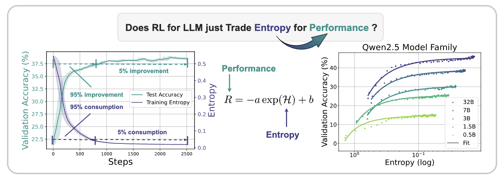
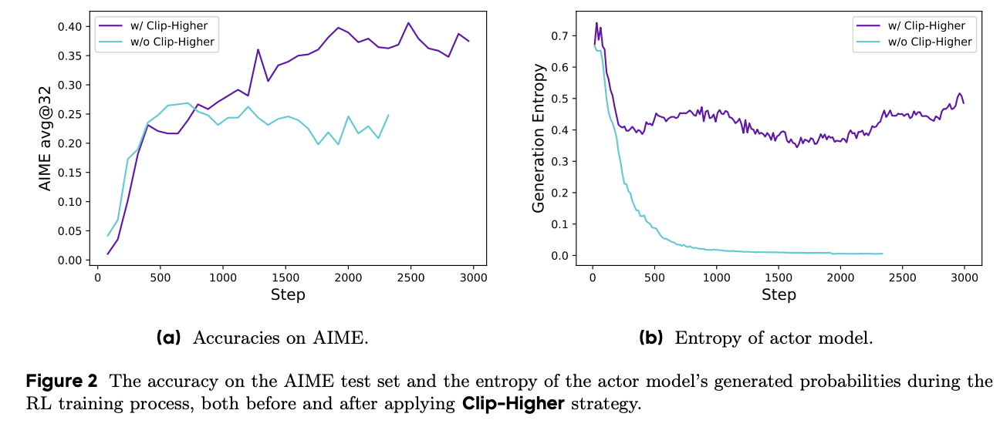
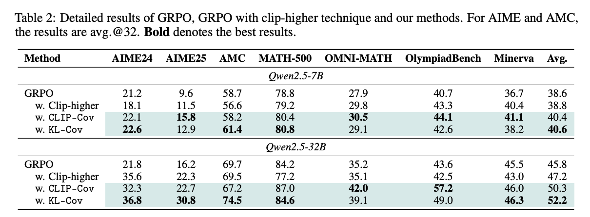

::: {.callout-note title="论文信息"}
- **论文**：[The Entropy Mechanism of Reinforcement Learning for Reasoning Language Models](https://arxiv.org/abs/2505.22617)
- **主题**：大模型 RL 训练中的策略熵消耗、性能饱和与熵控制方法
- **核心结论**：RL 训练早期会快速消耗策略熵，性能增益也主要集中在这一阶段；后续如果策略熵继续单调下降，模型更容易进入过度确定的局部最优。
:::

在大语言模型的 RL 训练中，熵坍塌（Entropy Collapse）指策略熵（policy entropy）在训练早期快速下降，并在后续训练中持续接近零的现象。换句话说，模型很快变得过度确定（overly confident）：面对同一类状态，它倾向于反复选择少数高概率 token，输出多样性随之下降，策略也更容易停在局部最优。

这一现象通常伴随两个可观察信号：

- 策略熵持续单调下降，最后接近零。
- 验证集性能在达到某个水平后进入平台期。

[The Entropy Mechanism of Reinforcement Learning for Reasoning Language Models](https://arxiv.org/abs/2505.22617) 报告了一个很直接的经验结果：在 RL 训练初期，即前 200 个训练 step，策略已经消耗 73% 的熵，同时完成 76% 的性能增益。随后训练继续推进，策略熵仍然下降，但验证性能不再同步增长。

论文还给出策略熵与性能（acc）之间的经验关系。更大参数模型，例如图中的 32B 模型，其系数 $a$ 和 $b$ 随规模呈对数线性增长。这说明大模型能更高效地把熵消耗转化为性能增益，但代价是更快触及性能上限。熵在这里不是越低越好；它更像训练过程中的探索预算，一旦预算过早耗尽，后续 RL 更新就很难再发现新的高回报轨迹。

# 1. 策略熵的定义

策略熵衡量策略选择动作的随机性。在语言模型中，策略就是 LLM，动作通常对应 next token。给定训练数据 $D$ 和策略 $\pi_\theta$，策略熵可以写成：

$$
H(\pi_\theta, D) = -\mathbb{E}_{D,\pi_\theta}\left[\log \pi_\theta(y_t \mid y_{<t})\right]
$$

实际计算时，通常对训练数据 $D$ 中每个 batch、每个 prompt 下生成 token 的熵取平均。

最大熵 RL 会把熵作为正则项，用来平衡探索与利用。高熵意味着策略仍在保留多个候选动作；低熵意味着概率质量集中到少数动作上。后者并不一定错误，但如果发生得太早，策略还没有充分探索可行轨迹，就会提前收缩到局部模式。

# 2. 熵坍塌为什么主要限制 RL，而不是 SFT

SFT 和 RL 都可能降低 token 级熵，但二者受影响的方式不同。关键差异在于：SFT 有固定监督标签，RL 则依赖当前策略自己采样轨迹。

SFT（Supervised Fine-Tuning）本质上是监督学习。它要学习一个参数为 $\theta$ 的模型，使输出分布 $Q_0$ 最小化训练损失：

$$
C_{\text{SFT}}(\theta)
=
-\mathbb{E}_{(x,y)\sim P_{\text{data}}}
\left[
\log Q_0(y|x)
\right]
$$

该目标符合经验风险最小化（empirical risk minimization）：训练数据给出目标答案，模型只需要提高这些答案的似然。因此，SFT 会让模型对监督标签分配更高概率，单步生成时的 token 级策略熵往往会下降。更大、训练更充分的模型通常更确定，这也是后续 RL 更容易遇到低熵初始状态的原因之一。

RL 的目标不同。策略 LLM $\theta$ 的解码过程可以看作随机策略分布 $\pi(a|s)$，它会生成轨迹分布 $q_\pi(\tau)$。理想情况下，我们想逼近一个假想的最优轨迹分布 $P_{\text{opt}}(\tau)$；但和 SFT 不同，训练过程无法直接从 $P_{\text{opt}}(\tau)$ 中采样，只能从当前策略诱导的 $q_\pi(\tau)$ 中采样，再用奖励信号筛选和更新。

这就解释了熵坍塌为什么对 RL 更敏感：一旦当前策略生成的轨迹过于确定，采样空间会快速变窄。奖励模型或 verifier 仍然可以给分，但它只能评价已经采到的轨迹；没有被采到的高回报解法不会进入梯度更新。此时 RL 优化不是完全停止，而是被限制在低熵策略还能覆盖的区域内，性能很容易出现平台期。

# 3. 熵坍塌的缓解方法

## 3.1 DAPO 的 Clip-Higher 策略

[DAPO](https://arxiv.org/abs/2503.14476) 的目标函数如下：

$$
\begin{aligned}
\mathcal{J}_{\mathrm{DAPO}}(\theta)
&=
\mathbb{E}_{\substack{
(q,a)\sim D \\
\{o_i\}_{i=1}^{G}\sim \pi_{\theta_{\mathrm{old}}}(\cdot \mid q)
}}
\Bigg[
\frac{1}{\sum_{i=1}^{G}|o_i|}
\sum_{i=1}^{G}
\sum_{t=1}^{|o_i|}
\min\left(
r_{i,t}(\theta)\hat{A}_{i,t},
\bar{r}_{i,t}(\theta)
\hat{A}_{i,t}
\right)
\Bigg]
\end{aligned}
$$

$$
\mathrm{s.t.}\quad
0
<
\left|
\left\{
o_i
\mid
\mathrm{is\_equivalent}(a,o_i)
\right\}
\right|
<
G
$$

其中，

$$
r_{i,t}(\theta)
=
\frac{
\pi_{\theta}(o_{i,t}\mid q,o_{i,<t})
}{
\pi_{\theta_{\mathrm{old}}}(o_{i,t}\mid q,o_{i,<t})
}
$$

$$
\hat{A}_{i,t}
=
\frac{
R_i-\mathrm{mean}\left(\{R_i\}_{i=1}^{G}\right)
}{
\mathrm{std}\left(\{R_i\}_{i=1}^{G}\right)
}
$$

其中，$\bar{r}_{i,t}(\theta)$ 是经过 Clip-Higher 截断后的重要性采样比率：

$$
\bar{r}_{i,t}(\theta)
=
\mathrm{clip}
\left(
r_{i,t}(\theta),
1-\varepsilon_{\mathrm{low}},
1+\varepsilon_{\mathrm{high}}
\right)
$$

作为参照，GRPO 使用对称 clip：

$$
\begin{aligned}
\mathcal{J}_{\mathrm{GRPO}}(\theta)
&=
\mathbb{E}_{\substack{
(q,a)\sim D \\
\{o_i\}_{i=1}^{G}\sim \pi_{\theta_{\mathrm{old}}}(\cdot \mid q)
}}
\Bigg[
\frac{1}{G}
\sum_{i=1}^{G}
\frac{1}{|o_i|}
\sum_{t=1}^{|o_i|}
\left(
\min\left(
r_{i,t}(\theta)\hat{A}_{i,t},
\tilde{r}_{i,t}(\theta)
\hat{A}_{i,t}
\right)
-
\beta D_{\mathrm{KL}}
\left(
\pi_{\theta}
\Vert
\pi_{\mathrm{ref}}
\right)
\right)
\Bigg]
\end{aligned}
$$

其中：

$$
r_{i,t}(\theta)
=
\frac{
\pi_{\theta}(o_{i,t}\mid q,o_{i,<t})
}{
\pi_{\theta_{\mathrm{old}}}(o_{i,t}\mid q,o_{i,<t})
}
$$

$$
\tilde{r}_{i,t}(\theta)
=
\mathrm{clip}
\left(
r_{i,t}(\theta),
1-\varepsilon,
1+\varepsilon
\right)
$$

Clip-Higher 的作用可以从某个 token 在新旧策略下的概率比值 $r_{i,t}(\theta)$ 理解。它放宽上界，允许高优势 token 获得更大的概率提升；同时保留下界约束，避免概率下降过猛导致训练不稳定。

这类不对称设计针对的是熵坍塌中的一个具体问题：低概率但高优势的 token 如果被对称 clip 过早压住，策略就更容易只强化已经高概率的动作。Clip-Higher 给这些 token 留出更大的上升空间，因此可以缓解训练早期策略过快收缩。

## 3.2 协方差正则化

论文还从策略更新对熵变化的影响出发，给出如下关系：

$$
\Delta H \propto -\mathbb{E}_{s,a}
\left[
\mathrm{Cov}
\left(
\log \pi_\theta(a \mid s),
\Delta z_{s,a}
\right)
\right]
$$

其中，$\Delta z_{s,a}$ 表示 logit 的变化量。

在 Policy Gradient 中，logit 变化与动作优势（advantage）成比例，因此上式中的协方差可以进一步近似为：

$$
\mathrm{Cov}
\left(
\log \pi_\theta(a \mid s),
A(a)
\right)
$$

高协方差 token 指的是 $\log \pi_\theta(a \mid s)$ 与 $A(a)$ 强正相关的 token。也就是说，该 token 原本概率已经较高，同时又获得较高优势。继续强化这类 token 会把概率质量进一步推向少数动作，策略熵下降也会更快。

因此，熵控制可以转化为对高协方差 token 的梯度约束。论文讨论了两种做法。

**Clip-Cov** 在策略梯度更新时随机裁剪部分高协方差 token 的梯度。裁剪依据是协方差阈值范围：

$$
\omega_{\mathrm{low}} < \mathrm{Cov} < \omega_{\mathrm{high}}
$$

通过裁剪比例 $r$ 和阈值区间 $(\omega_{\mathrm{low}}, \omega_{\mathrm{high}})$ 控制熵水平。

**KL-Cov** 对协方差排名前 $\mathrm{top}^k$ 的 token 施加 KL 散度惩罚，并通过惩罚系数 $\beta$ 调节熵：

$$
L_{\mathrm{policy}}
=
-\mathbb{E}
\left[
\frac{\pi_\theta(y_i)}{\pi_{\mathrm{old}}(y_i)}
A(y_i)
\right]
+
\beta \cdot
D_{\mathrm{KL}}
\left(
\pi_\theta
\Vert
\pi_{\mathrm{old}}
\right)_{\mathrm{top}\text{-}k}
$$

从实验曲线看，KL-Cov 相比 Clip-Cov 给出的熵轨迹更稳定。这一结果也符合直觉：随机裁剪能阻止一部分高协方差 token 继续被强化，但 KL 惩罚直接约束这些 token 相对旧策略的偏移，控制方式更连续。

# 4. 小结

Entropy Collapse 不是单纯的「模型变得自信」问题，而是 RL 训练中的探索预算被过早消耗。SFT 可以接受低熵结果，因为监督标签已经给出优化方向；RL 依赖当前策略采样轨迹，一旦策略熵坍塌，训练就只能在狭窄的轨迹集合里继续优化。

DAPO 的 Clip-Higher 和论文中的协方差正则化都在处理同一件事：不要让训练早期的高概率、高优势 token 过快垄断更新。前者通过不对称 clip 给低概率高优势 token 留空间；后者直接识别并约束高协方差 token。两类方法的共同目标不是让熵保持高位，而是让熵下降得更可控，使性能增益不要过早被耗尽。
