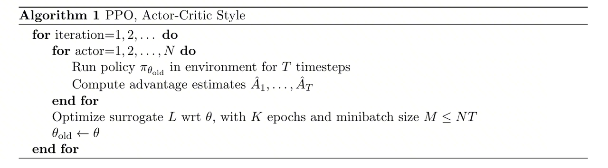
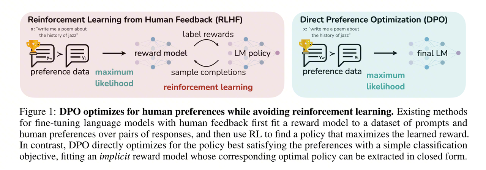
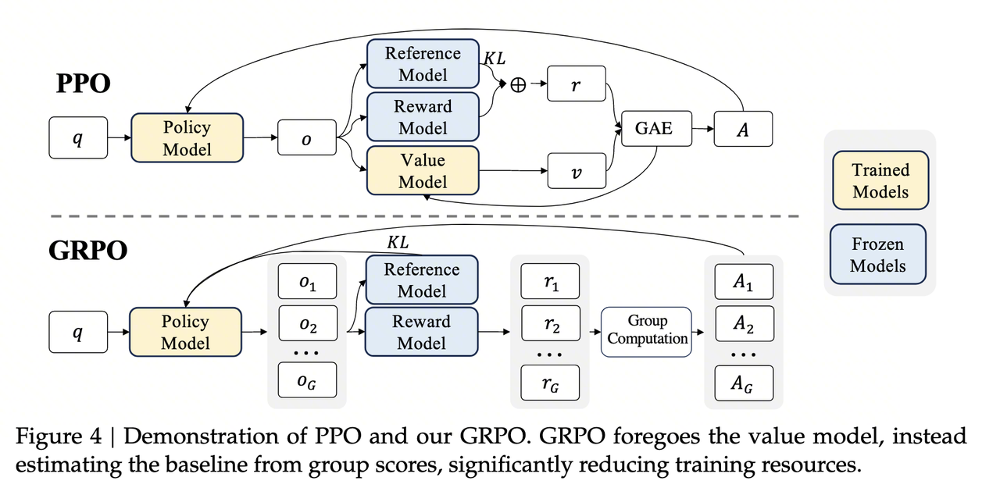
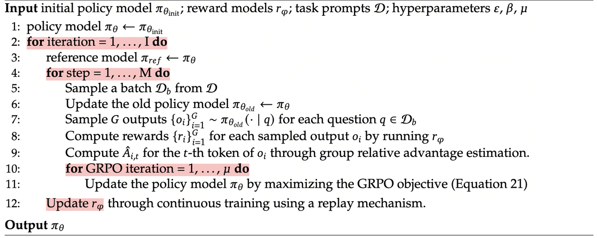

::: {.callout-note title="阅读范围"}
PPO、DPO 与 GRPO 经常被放在同一条「算法演进」线上讨论，但它们解决的问题并不完全相同。PPO 使用 Critic 和 GAE 估计优势；DPO 将 KL 正则化的偏好学习改写为离线分类损失；GRPO 保留在线策略优化，同时用组内相对奖励替代 Critic。本文从目标函数、优势或偏好信号、训练循环和工程成本四个角度比较三者，并说明各自的适用边界。
:::

---

# 1 PPO：带价值基线的受约束策略优化

## 1.1 背景与动机

[Proximal Policy Optimization（PPO）](https://arxiv.org/abs/1707.06347)由 Schulman 等人于 2017 年提出。它用一阶的 clipped surrogate objective 近似 TRPO 对策略更新幅度的约束，降低了二阶优化的实现成本，并允许同一批 rollout 数据进行多轮更新。在 LLM 对齐中，PPO 常用于 RLHF 的强化学习阶段：策略模型先经过 SFT，奖励模型再从偏好数据中学习评分函数，最后由 PPO 优化该奖励。

PPO 的核心约束很直接：提高奖励时，不能让新策略在一次更新中偏离采样策略太远。

## 1.2 PPO 目标函数

先从目标函数明确 PPO 优化的量，再回到各个符号和训练步骤。

PPO 的目标函数如下：

$$
\mathcal{J}_{PPO}(\theta) = \mathbb{E}[q \sim P(Q), o \sim \pi_{\theta_{old}}(O|q)] \frac{1}{|o|} \sum_{t=1}^{|o|} \min \left[ \frac{\pi_\theta(o_t | q, o_{<t})}{\pi_{\theta_{old}}(o_t | q, o_{<t})} A_t, \text{clip}\left(\frac{\pi_\theta(o_t | q, o_{<t})}{\pi_{\theta_{old}}(o_t | q, o_{<t})}, 1-\varepsilon, 1+\varepsilon\right) A_t \right]
$$

各项含义如下：

| 符号                                              | 含义                                                                                                                                                         |
| ------------------------------------------------- | ------------------------------------------------------------------------------------------------------------------------------------------------------------ |
| $q \sim P(Q)$                                   | 从问题分布里采样一个问题/提示（prompt），例如一句用户指令。                                                                                                  |
| $o \sim \pi_{\theta_{old}}(O \mid q)$           | 用旧策略生成一个完整输出序列$o = (o_1, \dots, o_{\vert o\vert})$                                                                                           |
| $\vert o\vert$                                  | 输出序列长度；前面的$\frac{1}{\vert o\vert} \sum_{t=1}^{\vert o\vert}$ 是对**所有 token 取平均**，避免长回答在 loss 上权重更大。                     |
| $\pi_\theta(o_t \mid q, o_{<t})$                | 当前待更新策略$\pi_\theta$ 在前缀 $(q, o_{<t})$ 下生成第 $t$ 个 token 是 $o_t$ 的概率。                                                              |
| $\pi_{\theta_{\text{old}}}(o_t \mid q, o_{<t})$ | 旧策略下的对应概率，用来构造**重要性采样比率**：$r_t(\theta) = \frac{\pi_\theta(o_t \mid q, o_{<t})}{\pi_{\theta_{\text{old}}}(o_t \mid q, o_{<t})}$ |
| $A_t$                                           | 第$t$ 个 token 的 **advantage（优势函数）**，一般由 GAE 计算：$A_t \approx (\text{当前路径未来回报}) - (\text{价值网络给出的 baseline})$           |
| $\varepsilon$                                   | PPO 的 clip 超参数，典型值$0.1 \sim 0.2$                                                                                                                   |

直觉上，它在所有采样 token 上计算「新策略相比旧策略的概率变化」与「优势值」的乘积，再用 clip 机制限制单次更新幅度。

该目标函数包含三个必要组件：

1. **重要性采样比率** $r_t(\theta) = \frac{\pi_\theta}{\pi_{\theta_{old}}}$：衡量新旧策略的差异
2. **优势函数** $A_t$：衡量这一步动作比「平均水平」好了多少

   - $A_t > 0$：这一步比平均表现更好，应该增加对应动作概率
   - $A_t < 0$：这一步比平均表现差，应该减小该动作概率
3. **Clip 机制**：$\text{clip}(r_t, 1 - \varepsilon, 1 + \varepsilon)$ 把比率 $r_t(\theta)$ 截断在区间 $[1 - \varepsilon, 1 + \varepsilon]$ 内，限制单步更新幅度，避免策略离旧策略太远。

   - 当 $A_t > 0$（想鼓励这一动作）时，$r_t$ 不允许大于 $1 + \varepsilon$，否则取被截断的版本
   - 当 $A_t < 0$（想惩罚这一动作）时，$r_t$ 不允许小于 $1 - \varepsilon$
PPO 和下文的 GRPO 都用重要性采样比率调整采样 token 的梯度贡献，再通过 clipping 限制更新幅度。

其中，$A_t$（优势函数）决定每个 token 的更新方向和力度。下面先看数据如何采样，再推导 $A_t$ 的计算过程。

## 1.3 数据采样与 $A_t$ 计算

### 1.3.1 从旧策略采样轨迹

先用旧策略 $\pi_{\theta_{old}}$ 采样一条完整输出：

$$
o = (o_1, \cdots, o_T) \sim \pi_{\theta_{old}}(O|q)
$$

随后用 Reward Model 对整条输出打分，并结合策略与参考模型之间的 KL 惩罚构造 token 级奖励：

$$
r_{t}=r_{\varphi}(q,o_{\leq t})-\beta\log\frac{\pi_{\theta_{\text{old}}}(o_{t}|q,o_{<t})}{\pi_{\text{ref}}(o_{t}|q,o_{<t})}
$$

这里的 KL 惩罚项用来约束策略不要为了追求高奖励而偏离参考模型太远。

### 1.3.2 用 GAE 估计优势 $A_t$

有了每一步的奖励 $r_t$，还需要知道这一步动作相对基线好多少。这就是优势函数 $A_t$ 要衡量的量。

计算 $A_t$ 还需要一个表示「平均水平」的参照物，即状态价值函数 $V(s_t)$。它由 Critic 网络，也称 Value Network，负责输出：

- **Reward Model**：给完整回答打分，提供即时奖励信号 $r_t$（在 RL 阶段冻结不更新）
- **Critic 网络**：预测从当前位置到序列结束的**期望累积回报** $V(s_t) = \mathbb{E}[G_t \mid s_t]$，作为计算 Advantage 的 baseline（与 Actor 同步训练）

> 这里先假设 Critic 能给出合理的 $V(s_t)$，以便说明 $A_t$ 的计算逻辑。Critic 的训练目标见 1.4 节。

在强化学习中，状态价值 $V(s_t)$ 的直观含义是：**从当前状态开始，到序列结束时的期望折扣回报**。

$$
V(s_t) \approx r_t + \gamma r_{t+1} + \gamma^2 r_{t+2} + \dots
$$

利用数学上的递归关系，我们可以把它写成：

$$
V(s_t) \approx \underbrace{r_t}_{\text{即时奖励}} + \underbrace{\gamma V(s_{t+1})}_{\text{后续价值}}
$$

**第一步：计算 TD Error（时序差分误差）$\delta_t$**

$$
\delta_t = r_t + \gamma V(s_{t+1}) - V(s_t)
$$

各项含义：

- $r_t$：当前这一步获得的即时奖励（通常是 KL 惩罚，最后一步才有大分）
- $V(s_t)$：**Critic 认为**当前状态值多少分
- $V(s_{t+1})$：走到下一步后，**Critic 认为**那个新状态值多少分
- $\gamma$：折扣因子（比如 0.99），控制未来奖励在当前估值里的权重

如果 $\delta_t > 0$，说明 $r_t + \gamma V(s_{t+1})$ 高于 $V(s_t)$，该动作后的结果好于 Critic 原来的估计。

**第二步：计算 GAE 优势 $\hat{A}_t$**

TD Error 只看一步。GAE 会把当前误差和后续误差按折扣累加起来：

$$
\hat{A}_t = \delta_t + (\gamma \lambda)\delta_{t+1} + (\gamma \lambda)^2 \delta_{t+2} + \cdots + (\gamma \lambda)^{T-t} \delta_T
$$

$\lambda$ 是 GAE 用于平衡方差和偏差的参数，常见取值为 0.95。当前动作的优势由本步 TD Error 和后续 TD Error 的折扣和共同决定。

因此，PPO 的 Advantage 可以写成：

$$
\text{Advantage} = \text{加权累加的（现实回报 - 价值预期）}
$$

### 1.3.3 构造每个位置的回报目标

目标公式为：

$$
\text{Target}_t = V(s_t) + \hat{A}_t
$$

这个公式看起来简单，但它和 n-step return 的关系需要展开看。

回顾两个定义：

- TD Error（$\delta_t$）： $\delta_t = r_t + \gamma V(s_{t+1}) - V(s_t)$
- GAE（$\hat{A}_t$）： $\hat{A}_t = \sum_{k=0}^{\infty} (\gamma \lambda)^k \delta_{t+k} = \delta_t + (\gamma\lambda)\delta_{t+1} + (\gamma\lambda)^2\delta_{t+2} + \dots$

把 $\text{Target}_t = V(s_t) + \hat{A}_t$ 展开。先写前两项，看 $V$ 项如何抵消，以及剩余项如何留下来。

$$
\begin{aligned} \text{Target}_t &= \mathbf{V(s_t)} \\ &+ \underbrace{(r_t + \gamma V(s_{t+1}) - \mathbf{V(s_t)})}_{\delta_t} \\ &+ (\gamma\lambda) \underbrace{(r_{t+1} + \gamma V(s_{t+2}) - V(s_{t+1}))}_{\delta_{t+1}} \\ &+ (\gamma\lambda)^2 \delta_{t+2} + \dots \end{aligned}
$$

第一行的 $V(s_t)$ 和第二行的 $-V(s_t)$ 抵消，剩下：

$$
\text{Target}_t = r_t + \gamma V(s_{t+1}) + (\gamma\lambda)(r_{t+1} + \gamma V(s_{t+2}) - V(s_{t+1})) + \dots
$$

再提取包含 $V(s_{t+1})$ 的两项，即 $\gamma V(s_{t+1})$ 和 $-(\gamma\lambda) V(s_{t+1})$：

$$
\gamma V(s_{t+1}) - \gamma\lambda V(s_{t+1}) = \gamma (1-\lambda) V(s_{t+1})
$$

于是公式变成了：

$$
\begin{aligned} \text{Target}_t &= r_t + \gamma (1-\lambda)V_{t+1} \\ &+ \gamma\lambda r_{t+1} + (\gamma\lambda) \gamma (1-\lambda)V_{t+2} \\ &+ (\gamma\lambda)^2 \left[ r_{t+2} + \gamma (1-\lambda)V_{t+3} + \dots \right] \end{aligned}
$$

继续递推，可以得到一般形式：

$$
G_t^\lambda = (1-\lambda) \sum_{n=1}^{\infty} \lambda^{n-1} G_t^{(n)}
$$

这里的 $G_t^{(n)}$ 代表 n-step Return（看 $n$ 步真实奖励，后面用预测）：

- $n=1$： $G_t^{(1)} = r_t + \gamma V(s_{t+1})$（只看 1 步）
- $n=2$： $G_t^{(2)} = r_t + \gamma r_{t+1} + \gamma^2 V(s_{t+2})$（看 2 步）
- $n=\infty$： $G_t^{(\infty)} = G_t$（Monte Carlo，全看真实）

利用 $V_{old} + A$ 构造的 Target，本质上是多个 n-step return 的加权平均。$\lambda$ 越大，目标越依赖长跨度的真实奖励；$\lambda$ 越小，目标越依赖短期 bootstrap 预测。

> **$\lambda = 0.95$ 的作用**
> 构造 $\text{Target} = V_{old} + A$ 是为了在真实采样回报和 Critic 预测之间折中。$\lambda = 0.95$ 时，后续真实奖励占较大权重，Critic 的预测仍参与平滑噪声。
>
> - 通过引入 $V$（预测）：我们削减了 $G_t$ 中因为环境随机性带来的巨大方差
> - 通过引入 $r$（现实）：我们修正了 $V$ 可能会有的偏差

其中 $\gamma$ 是折扣因子（通常接近 1）， $r_t$ 是第 $t$ 步获得的奖励。

$G_t = V_{old} + A$ 构造的是 $\lambda$-Return：

- 如果 $\lambda = 1$，由于数学上的抵消，它就退化为蒙特卡洛回报 $G_t$
- 如果 $\lambda < 1$，它是 $G_t$ 的一个低方差近似版。我们故意用这个公式，是为了让 Critic 学得更稳，而不是完全照搬某一次采样的 $G_t$

这一节的计算链条可以概括为：

$$
\text{RM 打分} \xrightarrow{r_t} \text{结合 Critic 的 } V(s_t) \xrightarrow{\text{GAE}} \hat{A}_t
$$

在这个链条中，Critic 给出的 $V(s_t)$ 会直接影响 $A_t$ 的信噪比。如果 Critic 预测偏差很大，Actor 的更新方向也会变差。因此还需要看 Critic 本身的训练目标。

## 1.4 训练 Critic 网络

在 1.3 节中，Critic 提供的 $V(s_t)$ 贯穿整个 Advantage 计算过程。下面讨论它自身的训练目标。

在 LLM-RLHF 的典型实现中，Critic 通常从 Actor 或 Reward Model 的权重初始化，并在 Transformer backbone 后接一个将 hidden state 映射到标量的 value head。Actor 与 Critic 可以共享部分参数，也可以作为两个独立模型训练。每个时间步 $t$，Critic 根据状态 $s_t$ 输出 $V(s_t)$，训练目标是回归从该位置出发的期望累积回报。

Value Network 的训练目标是：

$$
\min_{V} \mathbb{E}_{s_t, R} \left[ (V(s_t) - R)^2 \right]
$$

这是一个标准的 MSE 回归问题，我们想找到最优函数 $V^*(s_t)$。

设模型在某一状态 $s_t$ 上预测为 $v$，真实未来回报是随机变量 $R$，则目标变成：

$$
\min_{v} \mathbb{E}[(v - R)^2]
$$

对 $v$ 求导：

$$
\frac{d}{dv} \mathbb{E}[(v - R)^2] = 2\mathbb{E}[v - R] = 0
$$

解得：

$$
v = \mathbb{E}[R]
$$

因此，MSE 意义下的最优预测为：

$$
V(s_t) = \mathbb{E}[R \mid s_t]
$$

> **这里容易混淆的一点**：$V(s_t)$ 是对未来累积回报的**条件期望**，也就是一个预测基线，而不是 reward 的逐步逼近值。它不是要拟合某一次具体采样的 reward，而是根据当前 state 估计「平均而言，后面还能拿多少回报」。这也是它能作为 1.3 节中 Advantage 基线的原因。

## 1.5 PPO 训练流程

PPO 的一次 rollout-update 周期可以分为三个阶段：

**第一步：采样与打分（Rollout）**

此时我们有旧的策略网络（Actor）和旧的价值网络（Critic）。

1. 让 Actor 去环境里跑（比如生成文本），拿到状态 $s$、动作 $a$、奖励 $r$
2. 用旧的 Critic 对这些状态打分，得到 $V_{old}(s)$

**第二步：计算优势和回报目标**

在这个阶段，网络是**不更新**的。我们利用刚才收集的数据计算出两个**固定的张量**：

1. **计算 Advantage（$\hat{A}$）**：利用 $r$ 和 $V_{old}$，套用 GAE 公式算出优势
2. **计算 Returns（Target）**：直接用公式 $\text{Returns} = V_{old} + \hat{A}$

> 这一步完成后，$\hat{A}$ 和 $\text{Returns}$ 会从计算图中分离，作为后续多轮更新中的固定训练目标。

**第三步：训练更新（Optimization）**

现在的输入数据是：$(s, a, \hat{A}, \text{Returns})$。

进入 PPO 的 Update Loop（通常会循环几次）：

- **Actor 的任务**：利用第二步算好的 $\hat{A}$ 来计算 PPO 的 Policy Loss（那个截断的 CLIP 公式），更新 Actor 参数 $L^{CLIP}(\theta) \approx \min(\dots) \cdot \hat{A}$
- **Critic 的任务**：利用第二步算好的 $\text{Returns}$ 作为真值（GT），更新 Critic 参数 $L^{Value}(\phi) = (V_\phi(s) - \text{Returns})^2$

PPO 属于 on-policy 策略优化方法，但会依靠 importance ratio 和 clipping 对同一批近似 on-policy 的数据进行有限次复用。Advantage 的基线应对应采样时的价值估计；如果在每个 policy update 中重新计算并反向传播 Advantage，目标会随 Critic 更新而漂移，破坏固定 surrogate objective 的训练条件。

**总结流程图**：

1. 旧 Critic → 算出 Advantage 和 Returns
2. 锁定这两个值（当作固定数字）
3. Advantage → 用来训练 Actor
4. Returns → 用来训练新 Critic

---

# 2 DPO：将偏好学习改写为分类损失

## 2.1 基本思路与主要发现

在 PPO 的框架中，需要先训练 Reward Model 对回复打分，再用 RL 算法（配合 Critic 网络）去最大化这个打分。整个链条较长：训练 RM → RM 打分 → 计算 Advantage → 更新 Actor → 同步更新 Critic。DPO（Direct Preference Optimization）要问的是：

> 能否跳过显式 Reward Model 和在线 RL 过程，直接从人类偏好数据中优化策略？

[DPO（Direct Preference Optimization）](https://arxiv.org/abs/2305.18290)由 Rafailov 等人于 2023 年提出。它利用一个关键关系：在 KL 正则化的 RLHF 最优解下，奖励函数可以用策略模型与参考模型的对数概率比表示。因此，偏好学习可以直接转化为策略模型上的分类损失。推导分两步：

1. **KL 约束下的最优策略存在闭式解**：从 RLHF 的优化目标出发，可以推导出一个显式的 $\pi^*(y \mid x)$ 表达式；
2. **将这个闭式解代入 Bradley-Terry 偏好模型**，就能把"学习 Reward → 再做 RL"的两阶段流程，简化为一个直接在偏好数据上训练策略的分类损失。

下面沿着这两步推导 DPO 的训练目标。

### 2.1.1 从 KL 约束优化到最优策略的闭式解

RLHF 的优化目标是：在最大化期望奖励的同时，不让策略偏离参考策略 $\pi_{\text{ref}}$ 太远（用 KL 散度约束）：

$$
\max_{\pi_\theta} \; \mathbb{E}_{x \sim \mathcal{D},\, y \sim \pi_\theta(\cdot|x)} \left[ r(x, y) \right] - \beta \, \text{KL}\!\left[\pi_\theta(\cdot|x) \;\Vert \; \pi_{\text{ref}}(\cdot|x)\right]
$$

其中 $r(x, y)$ 是 Reward Model 给出的奖励， $\beta$ 控制 KL 惩罚强度。

对于这个 KL 约束优化问题，可以用变分法推导出其最优策略的闭式解：

$$
\pi^*(y|x) = \frac{1}{Z(x)} \, \pi_{\text{ref}}(y|x) \, \exp\!\left(\frac{r(x,y)}{\beta}\right)
$$

其中 $Z(x) = \sum_y \pi_{\text{ref}}(y \mid x) \exp\!\left(\frac{r(x,y)}{\beta}\right)$ 是归一化常数（配分函数），确保 $\pi^*$ 仍然是合法的概率分布。

最优策略在参考策略的基础上，按奖励大小进行指数重加权。奖励越高的回复获得越大的概率；$\beta$ 越大，重加权越保守。

### 2.1.2 反解出隐式奖励函数

上面的闭式解建立了"奖励 → 最优策略"的映射，但 DPO 需要的是反方向：**从策略反推出奖励**。对闭式解取对数并移项，可以得到：

$$
r(x, y) = \beta \log \frac{\pi^*(y|x)}{\pi_{\text{ref}}(y|x)} + \beta \log Z(x)
$$

这就是 DPO 的关键等式：**奖励可以写成策略与参考策略的对数概率比，再加上只依赖 prompt 的常数项**。注意 $\beta \log Z(x)$ 只依赖于 prompt $x$，与具体回复 $y$ 无关。

### 2.1.3 代入 Bradley-Terry 模型，消去配分函数

人类偏好通常建模为 Bradley-Terry 模型：给定 prompt $x$ 和一对回复 $(y_w, y_l)$，人类更偏好 $y_w$ 的概率为：

$$
p(y_w \succ y_l | x) = \sigma\!\left(r(x, y_w) - r(x, y_l)\right)
$$

其中 $\sigma$ 是 sigmoid 函数。将 2.1.2 中的隐式奖励代入：

$$
p(y_w \succ y_l | x) = \sigma\!\left(\beta \log \frac{\pi^*(y_w|x)}{\pi_{\text{ref}}(y_w|x)} - \beta \log \frac{\pi^*(y_l|x)}{\pi_{\text{ref}}(y_l|x)}\right)
$$

注意这里的变化：$\beta \log Z(x)$ **在做差时消去了**。因此不需要计算配分函数，偏好概率只由策略与参考策略的对数概率比决定。

配分函数被消去后，DPO 就可以绕过 Reward Model 的显式训练，直接在偏好数据上优化策略。基于这个结果，可以写出 DPO 的训练损失函数。

## 2.2 DPO 损失函数

将 2.1.3 中的偏好概率取负对数似然，就得到 DPO 的训练目标：

$$
\mathcal{L}_{\text{DPO}}(\theta) = -\mathbb{E}_{(x, y_w, y_l) \sim \mathcal{D}} \left[ \log \sigma\!\left( \beta \log \frac{\pi_\theta(y_w|x)}{\pi_{\text{ref}}(y_w|x)} - \beta \log \frac{\pi_\theta(y_l|x)}{\pi_{\text{ref}}(y_l|x)} \right) \right]
$$

这个损失函数可以从三点理解：

**1. 隐式奖励差驱动优化**

定义隐式奖励为 $\hat{r}_\theta(x, y) = \beta \log \frac{\pi_\theta(y \mid x)}{\pi_{\text{ref}}(y \mid x)}$，则损失可以简写为：

$$
\mathcal{L}_{\text{DPO}} = -\mathbb{E}\left[\log \sigma\!\left(\hat{r}_\theta(x, y_w) - \hat{r}_\theta(x, y_l)\right)\right]
$$

优化方向很直接：**拉大好回复与坏回复之间的隐式奖励差**。

**2. 梯度自带难度感知**

对 $\mathcal{L}_{\text{DPO}}$ 求梯度，可以得到：

$$
\nabla_\theta \mathcal{L}_{\text{DPO}} = -\beta \, \mathbb{E}\!\left[\underbrace{\sigma\!\left(\hat{r}_\theta(x, y_l) - \hat{r}_\theta(x, y_w)\right)}_{\text{隐式权重}} \left[\nabla_\theta \log \pi_\theta(y_w|x) - \nabla_\theta \log \pi_\theta(y_l|x)\right]\right]
$$

其中的隐式权重 $\sigma(\hat{r}_\theta(x, y_l) - \hat{r}_\theta(x, y_w))$ 起到了难度加权的作用：当模型**已经能正确区分好坏回复**（隐式奖励差大），这个权重趋近于 0，梯度很小；当模型**判断错误**（给坏回复的隐式奖励更高），权重趋近于 1，纠正力度更大。DPO 因此会更关注当前仍分不清的偏好对。

**3. 仅依赖策略概率，无需额外模型**

整个损失只涉及 $\pi_\theta$ 和 $\pi_{\text{ref}}$ 对 chosen/rejected 回复的对数概率，不需要 Reward Model 打分、Critic 网络或 GAE。工程实现仍需计算策略模型和参考模型在两条回复上的 log-prob，但训练链路与常规监督微调接近。

DPO 损失函数里没有显式 KL 项，但推导本身来自 KL 约束优化问题。因此还需要看这个约束是如何进入损失的。

## 2.3 参考策略与 $\beta$ 的约束作用

DPO 损失中没有逐样本计算的显式 KL 惩罚项。KL 正则化出现在理论推导的起点，并通过参考策略与 $\beta$ 影响训练目标；但实际训练中的策略并不因此自动满足某个固定 KL 上限。

### 2.3.1 对数概率比定义隐式奖励

回顾隐式奖励的定义：

$$
\hat{r}_\theta(x, y) = \beta \log \frac{\pi_\theta(y|x)}{\pi_{\text{ref}}(y|x)}
$$

该对数概率比衡量策略相对参考模型提高或降低某条回复概率的程度。DPO 真正优化的是 chosen 与 rejected 回复之间的隐式奖励差：

$$
\hat{r}_\theta(x, y_w) - \hat{r}_\theta(x, y_l)
$$

当模型已经给 chosen 回复更高的相对概率时，sigmoid 权重下降；当排序错误时，梯度增大。损失关注的是两条回复的差值，而不是策略与参考模型之间的绝对 KL，因此训练时仍应监控 KL、长度和生成质量。

### 2.3.2 约束来源与实际边界

更根本地说，DPO 损失的推导起点是 KL 正则化的 RLHF 目标。参考策略和 $\beta$ 由此进入损失：

- $\beta$ 缩放 chosen/rejected 之间的相对 log-ratio margin，并改变优化强度；
- 参考策略 $\pi_{\text{ref}}$ 提供相对概率锚点，使训练目标关注策略相对初始模型的偏好变化。

> **小结**：DPO 的理论来源包含 KL 正则化，但实际损失并不等价于每步显式施加 KL 惩罚。$\beta$ 和参考策略会影响偏离程度，却不能替代训练过程中的 KL 与生成质量监控。

## 2.4 DPO 相对于 PPO 的改进与效果

理解 DPO 的推导后，可以比较它与 PPO 在训练流程、模型需求和优化特性上的差异：

| 对比维度 | PPO | DPO | 实际影响 |
| -------- | --- | --- | -------- |
| 训练流程 | SFT → Reward Model → 在线 PPO | SFT → 离线偏好优化 | DPO 省去独立 RM 训练和在线 rollout，工程链路更短。 |
| 奖励信号 | 独立 RM 给生成回复打分 | 策略与参考模型的 log-ratio 定义隐式奖励 | DPO 避免 RM 与策略分离训练，但仍可能过拟合偏好数据。 |
| 优化方式 | Actor-Critic、GAE、clipping | chosen/rejected 上的分类损失 | DPO 更接近监督学习，不需要价值函数估计。 |
| 训练采样 | 持续从当前策略采样 | 使用静态离线偏好对 | DPO 训练成本较低，但不能在训练中主动探索新回复。 |
| 模型与状态 | Actor、Critic、RM、Reference | Policy、Reference | DPO 的显存和分布式状态管理更简单。 |
| 主要超参数 | Actor/Critic 学习率、$\gamma$、$\lambda$、$\varepsilon$、KL 系数等 | 学习率、$\beta$ 等 | DPO 的调参面较小，但 $\beta$、数据质量和长度偏差仍会显著影响结果。 |

DPO 的边界同样清楚：它依赖离线偏好数据的质量和覆盖度，无法像 PPO 那样通过在线采样持续探索回复空间。Online DPO、IPO 等后续方法分别尝试补充在线数据或修正偏好优化目标。

 

GRPO 则从另一个角度简化 PPO：**保留 RL 框架但去掉 Critic 网络**，用组内归一化的方式直接估计优势函数。

# 3 GRPO：用组内相对奖励替代 Critic

## 3.1 移除 Critic 后的优势估计问题

前两章对应两种训练路径：

- **PPO**：完整的 RL 框架，链条较长：需要 RM 打分、Critic 估值、GAE 计算、重要性采样与 Clip，同时维护 4 个模型；
- **DPO**：绕过 RL，用偏好数据直接优化策略，流程更短，但放弃了在线采样的探索能力。

GRPO 选择保留 RL 的在线采样，同时去掉 Critic 网络。

[Group Relative Policy Optimization（GRPO）](https://arxiv.org/abs/2402.03300)由 DeepSeek 团队在 2024 年的 DeepSeekMath 论文中提出，其核心做法是：

> 用同一道题的多个回答之间的相对奖励，替代 Critic 网络的价值估计。

这样做直接改变了训练资源和误差来源：

1. **减少 Critic 相关资源**：不再维护 Critic 的参数、梯度、优化器状态和分布式通信；实际节省比例取决于 Actor、Reference、Reward Model 的部署方式。
2. **减少训练组件**：省去 Critic 的训练、更新和同步维护，也少了 Critic 估值偏差带来的不稳定来源。

问题随之变成：PPO 中 Critic 的作用是提供基线（baseline）来降低梯度方差，去掉它之后，GRPO 如何计算优势函数 $\hat{A}_{i,t}$？

## 3.2 Advantage 计算：用组内比较替代 Critic

回顾 PPO 中优势函数的计算链条：**RM 打分 →** $r_t$ **→ 结合 Critic 的** $V(s_t)$ **→ TD Error → GAE →** $\hat{A}_t$。GRPO 把中间涉及 Critic 的部分替换掉，不再问"这个回答比 Critic 预测的好多少"，而是问"**这个回答在同一组回答中排第几**"。

具体来说，GRPO 对同一个问题 $q$ 从旧策略 $\pi_{\theta_{\text{old}}}$ 采样 $G$ 个完整回答 $o_1, o_2, \dots, o_G$（例如同一道数学题生成 16 种解法），然后根据监督信号的粒度，分为两种计算方式。

### 3.2.1 结果监督（Outcome Supervision）：整条序列共享一个优势

当使用 Reward Model 对每个回答给出一个整体标量分数时，计算分两步：

**第一步：组内标准化**

用 RM 分别对 $G$ 个回答打分，得到 $r_1, r_2, \dots, r_G$，然后做标准化处理：

$$
\tilde{r}_i = \frac{r_i - \text{mean}(\mathbf{r})}{\text{std}(\mathbf{r})}
$$

标准化之后， $\tilde{r}_i > 0$ 意味着"比组内平均水平好"， $\tilde{r}_i < 0$ 意味着"比平均水平差"。奖励信号不再只看绝对值，而是看它相对于同组其他回答的位置。

**第二步：广播优势**

由于 RM 只给出整条回答的最终得分，没有逐 token 的细粒度信号，GRPO 采用最直接的广播方式：序列中每个 token 的优势值都等于该序列的归一化得分：

$$
\hat{A}_{i,t} = \tilde{r}_i \quad (\text{对于序列 } i \text{ 中的所有位置 } t)
$$

如果一道题的某个解法最终答对了（$\tilde{r}_i$ 大），该解法中的每个 token 都会得到相同的正向优势。这是粗粒度近似，适合只有最终答案对错信号的任务，但不能定位具体哪一步推理有效或出错。

### 3.2.2 过程监督（Process Supervision）：逐步累积优势

当使用 Process Reward Model（PRM）对每个推理步骤分别打分时，优势的计算可以更加精细：

**第一步：步骤级标准化**

GRPO 收集组内所有回答的所有步骤奖励，计算全局均值和标准差进行标准化：

$$
\tilde{r}_{i,j} = \frac{r_{i,j} - \text{mean}(\text{GroupRewards})}{\text{std}(\text{GroupRewards})}
$$

其中 $r_{i,j}$ 是第 $i$ 个回答中第 $j$ 个步骤的奖励。

**第二步：计算累积优势**

与结果监督不同，过程监督下每一步都有独立评分。GRPO 借鉴强化学习中回报的定义，让当前步骤的优势由自身与后续步骤的表现共同决定。

$$
\hat{A}_{i,t} = \sum_{k=j}^{K_i} \tilde{r}_{i,k} \quad (\text{其中 token } t \text{ 属于第 } j \text{ 个步骤})
$$

这意味着：早期的推理步骤（如"设 $x$ 为…"）承担了更大的优势权重，因为它们影响了后续所有步骤的方向。如果后续推理全部正确，早期步骤会获得最高的正向激励；反之，如果在某一步开始出错，该步骤及之前的步骤都会受到惩罚。

无论使用结果监督还是过程监督，GRPO 都以组内统计量替代 Critic 的价值估计。组均值近似承担基线作用，标准差负责尺度归一化。有了优势函数 $\hat{A}_{i,t}$，就可以写出 GRPO 的目标函数。

---

## 3.3 GRPO 目标函数

GRPO 的目标函数在形式上与 PPO 很接近：同样使用重要性采样比率和 Clip 机制，但有两个结构变化：

$$
\mathcal{J}_{GRPO}(\theta) = \mathbb{E}[q \sim P(Q), \{o_i\}_{i=1}^{G} \sim \pi_{\theta_{old}}(O|q)] \frac{1}{G} \sum_{i=1}^{G} \frac{1}{|o_i|} \sum_{t=1}^{|o_i|} \left\{ \min \left[ \rho_{i,t} \hat{A}_{i,t}, \; \text{clip}(\rho_{i,t}, 1-\varepsilon, 1+\varepsilon) \hat{A}_{i,t} \right] - \beta \, \text{KL}[\pi_\theta \Vert \pi_{\text{ref}}] \right\}
$$

其中 $\rho_{i,t} = \frac{\pi_\theta(o_{i,t} \mid q, o_{i,<t})}{\pi_{\theta_{old}}(o_{i,t} \mid q, o_{i,<t})}$ 是重要性采样比率。

与 PPO 对比，可以看到 GRPO 的两处结构性变化：

### 3.3.1 变化一：多样本"组"采样与双层平均

PPO 对单个 prompt 生成**一条**回复，在 token 维度计算优势并更新；GRPO 则对同一个问题生成 $G$ 条回复，形成一个"组"：

- **外层** $\frac{1}{G}\sum_{i=1}^{G}$：对 $G$ 个回答求平均。GRPO 需要这一层来聚合组内样本；
- **内层** $\frac{1}{\vert o_i \vert}\sum_{t=1}^{\vert o_i \vert}$：对单条回答中的 token 求平均，与 PPO 一样用于长度归一化。

多样本采样不仅是优势计算的基础（需要组内统计量），也会降低梯度估计方差：$G$ 个样本的平均梯度通常比单样本梯度更稳定。

### 3.3.2 变化二：优势函数来源完全不同

|                        | PPO                                | GRPO                                     |
| ---------------------- | ---------------------------------- | ---------------------------------------- |
| **优势来源**     | Critic 网络$V(s_t)$ + GAE        | 组内奖励标准化                           |
| **所需额外模型** | Critic（与 Actor 同规模）          | 无                                       |
| **粒度**         | 逐 token（通过 TD Error 链式传播） | 结果监督：全序列统一；过程监督：逐步累积 |

其余结构，包括重要性采样比率 $\rho_{i,t}$、Clip 机制、KL 散度惩罚，与 PPO 保持一致。直觉上，GRPO 的优化方向是：

- 组内表现高于平均的回答（$\hat{A}_{i,t} > 0$）→ 整条序列的生成概率被**放大**；
- 组内表现低于平均的回答（$\hat{A}_{i,t} < 0$）→ 整条序列的生成概率被**压制**。

这样就可以在不依赖 Critic 网络的情况下做策略优化。下面看这个目标函数在训练循环中如何执行。

---

## 3.4 GRPO 训练流程

### 3.4.1 三层训练循环

GRPO 的训练由三层嵌套循环构成，每层负责不同的节奏：

**第一层：大周期（Iteration Loop），共 $T$ 轮**

这是迭代式强化学习的宏观周期。每轮开始时执行两个操作：

- **更新参考模型**：将当前策略 $\pi_\theta$ 复制为 $\pi_{\text{ref}}$。此后在整个大周期内， $\pi_{\text{ref}}$ 保持冻结，用于计算 KL 散度惩罚；
- **更新 RM**（可选）：DeepSeekMath 中会边训练策略边优化奖励模型 $r_\phi$，让奖励模型随策略迭代更新。

**第二层：采样周期（Step Loop），共 $N$ 步**

这是数据收集阶段，每步执行以下操作：

1. **抽题**：从题库中采样一批问题 $\mathcal{D}_b$；
2. **快照**：将当前 $\pi_\theta$ 复制给 $\pi_{\theta_{\text{old}}}$，作为本轮采样的冻结副本；
3. **组采样**：用 $\pi_{\theta_{\text{old}}}$ 对每个问题生成 $G$ 个回答；
4. **打分与计算优势**：用 RM/PRM 打分，按 3.2 节的方法计算 $\hat{A}_{i,t}$；
5. **产出**：得到一批固定的训练数据，包括问题、回答、优势值和旧策略概率 $\pi_{\theta_{\text{old}}}(o_{i,t} \mid q, o_{i,<t})$。

**第三层：学习周期（GRPO Loop），共 $\mu$ 轮**

拿着第二层采好的固定数据，对策略模型进行 $\mu$ 轮参数更新。数据会被切成 mini-batch，逐批计算 3.3 节的目标函数并执行梯度下降。

三层循环分别控制参考策略的刷新频率、数据采集节奏和同一批数据的复用次数，使训练稳定性与数据效率可以分别调整。

### 3.4.2 重要性采样比率的作用

在第三层循环中，有一个必须处理的问题：**数据是用** $\pi_{\theta_{\text{old}}}$ **生成的，但模型** $\pi_\theta$ **在每次梯度更新后都会变化**。从第一个 mini-batch 更新后， $\pi_\theta$ 就已经不等于 $\pi_{\theta_{\text{old}}}$ 了；到第 $\mu$ 轮结束时，两者可能相差很大。

重要性采样比率 $\rho_{i,t} = \frac{\pi_\theta(o_{i,t} \mid q, o_{i,<t})}{\pi_{\theta_{old}}(o_{i,t} \mid q, o_{i,<t})}$ 正是为了修正这个"分布错位"：

| Ratio 取值         | 含义                                 | 对训练的影响                                      |
| ------------------ | ------------------------------------ | ------------------------------------------------- |
| $\rho > 1$       | 新策略比旧策略更倾向于生成这个 token | 若$\hat{A} > 0$（好回答），放大梯度，强化该行为 |
| $\rho < 1$       | 新策略认为这个 token 不太可能出现    | 降低该数据点的权重，减少其对更新的影响            |
| $\rho \approx 1$ | 新旧策略一致                         | 无修正，正常更新                                  |

Clip 机制在 Ratio 的基础上继续限制更新：将 $\rho_{i,t}$ 截断在 $[1{-}\varepsilon, 1{+}\varepsilon]$ 范围内，防止单个 token 的梯度贡献过大，让策略更新尽量留在旧策略附近。

Ratio 修正当前策略与采样策略之间的分布差异，Clip 则限制单次更新幅度。两者共同支撑同一批数据的有限次复用，这也是 GRPO 从 PPO 保留的核心机制。

## 3.5 三类算法对比总览

PPO、DPO、GRPO 分别采用 Actor-Critic 在线 RL、离线偏好优化和无 Critic 在线 RL。下表汇总三者的设计选择与工程特性：

 

| 对比维度 | PPO | DPO | GRPO |
| -------- | --- | --- | ---- |
| 训练方式 | 在线 Actor-Critic RL | 离线偏好优化 | 在线 group-relative RL |
| 奖励或偏好信号 | 显式 RM 奖励 + Critic 基线 | chosen/rejected 偏好对 | 显式奖励或可验证奖励 + 组内基线 |
| 优势估计 | Critic + GAE | 不使用策略梯度优势 | 组内奖励标准化 |
| 在线采样 | 需要 | 标准 DPO 不需要 | 需要，且每个 prompt 采样 $G$ 个回答 |
| 主要模型组件 | Actor、Critic、RM、Reference | Policy、Reference | Actor、奖励函数或 RM、Reference |
| 主要风险 | RM 偏差、Critic 偏差、训练链路复杂 | 偏好数据覆盖不足、长度偏差、分布外泛化 | 组内奖励方差、稀疏奖励、序列级信用分配粗糙 |
| 适用场景 | 需要在线探索和细粒度价值估计的 RLHF | 离线偏好数据充足、强调训练效率的场景 | 数学、代码等可验证奖励较可靠的推理任务 |
| 代表工作 | InstructGPT | DPO、Zephyr、Tulu 2 | DeepSeekMath、DeepSeek-R1 |

 

# 4 延伸阅读

以下论文覆盖本文使用的主要推导与训练流程：

**原始论文**

- [Proximal Policy Optimization Algorithms (Schulman et al., 2017)](https://arxiv.org/abs/1707.06347) —— PPO 原始论文，提出 clipped surrogate objective，并与 TRPO 等方法进行比较。
- [Training language models to follow instructions with human feedback (Ouyang et al., 2022)](https://arxiv.org/abs/2203.02155) —— InstructGPT 论文，给出 SFT → RM → PPO 的 LLM-RLHF 训练流程。
- [Direct Preference Optimization: Your Language Model is Secretly a Reward Model (Rafailov et al., 2023)](https://arxiv.org/abs/2305.18290) —— DPO 原始论文，推导从 KL 正则化最优策略到偏好分类损失的数学链条。
- [DeepSeekMath: Pushing the Limits of Mathematical Reasoning in Open Language Models (Shao et al., 2024)](https://arxiv.org/abs/2402.03300) —— GRPO 的提出论文，在数学推理任务上验证了用组内相对比较替代 Critic 网络的有效性。
- [DeepSeek-R1: Incentivizing Reasoning Capability in LLMs via Reinforcement Learning (DeepSeek-AI, 2025)](https://arxiv.org/abs/2501.12948) —— DeepSeek-R1 技术报告，记录 GRPO 在大规模推理模型训练中的使用方式。

**进一步阅读**

- [A General Theoretical Paradigm to Understand Learning from Human Feedback (Azar et al., 2023)](https://arxiv.org/abs/2310.12036) —— 提出 IPO（Identity Preference Optimization），从理论上修正了 DPO 在有限偏好数据下的过拟合问题。
- [Self-Play Fine-Tuning Converts Weak Language Models to Strong Language Models (Chen et al., 2024)](https://arxiv.org/abs/2401.01335) —— SPIN 方法，探索了无需人类偏好标注、通过自博弈实现对齐的新路径。
- [RLHF Workflow: From Reward Modeling to Online RLHF (Dong et al., 2024)](https://arxiv.org/abs/2405.07863) —— 梳理了从离线 DPO 到在线 RLHF 的工程流程。
- [Is DPO Superior to PPO for LLM Alignment? A Comprehensive Study (Xu et al., 2024)](https://arxiv.org/abs/2404.10719) —— 对 PPO 与 DPO 在多个基准上的系统对比实验，揭示了两者在不同任务类型下的互补优势。
