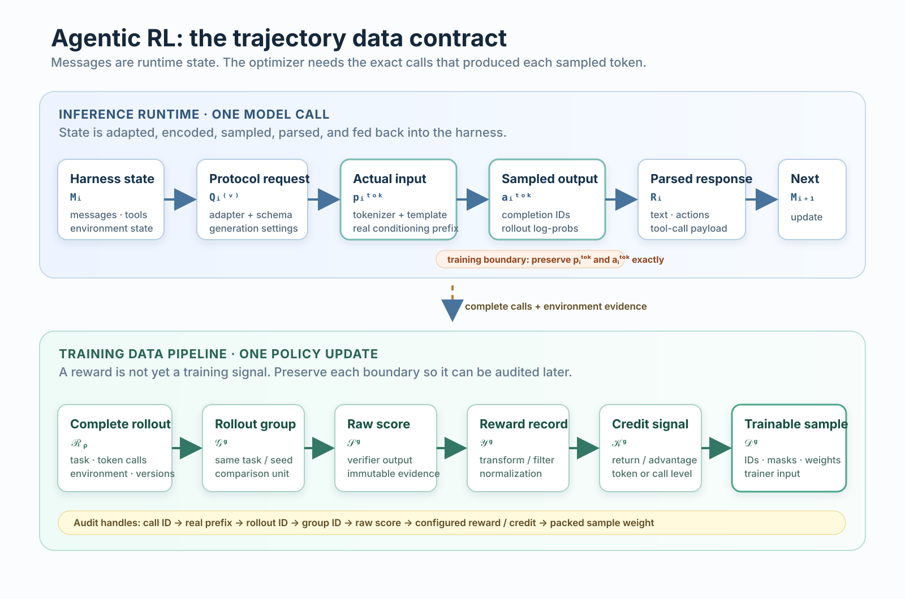

Agentic RL 最容易被简化成「让 Agent 跑任务，再根据结果做 RL」。这个描述遗漏了训练中最脆弱的一层：训练器更新的不是对话记录，也不是终局 reward，而是特定策略在特定 token 前缀下采样出的动作。只要 harness 在下一轮改变了上下文，或采样服务与训练器对 token 化的理解不一致，表面上完整的轨迹就不能直接构成可靠样本。

本文沿一条数据链展开：harness 维护状态，协议适配器组织请求，推理服务生成真实 token；完成的调用被聚合为 rollout，随后才经历评分、奖励变换、信用分配和样本打包。重点不是规定唯一的训练框架，而是标出每个系统都应明确保存的边界。

{width="95%" fig-align="center" fig-alt="双语版 Agentic RL 轨迹数据契约：推理运行时链与训练数据链由精确的 token 级模型调用相连。"}

## 1. 结构化 messages 不是训练输入

一次调用至少有四种表示：harness 内部状态 $M_i$、协议请求 $Q_i^{(v)}$、模型真正看到的输入 token $p_i^{\mathrm{tok}}$，以及采样输出 $a_i^{\mathrm{tok}}$。它们相关，却不能互换。

$$
\begin{aligned}
Q_i^{(v)} &= \mathrm{Adapt}_v(M_i), \\
p_i^{\mathrm{tok}} &= \mathrm{Encode}_{m,v}(Q_i^{(v)}), \\
a_i^{\mathrm{tok}} &\sim \pi_\theta(\cdot \mid p_i^{\mathrm{tok}}).
\end{aligned}
$$

$M_i$ 可以包含 system prompt、历史消息、工具定义、工具结果和环境状态。`Adapt` 决定这些对象如何映射到 OpenAI、Anthropic 或其他协议。`Encode` 再由模型 tokenizer 与 chat template 把请求变成 token。vLLM 的文档明确把 chat template 定义为角色、消息和聊天控制 token 的编码规则；因此「请求 JSON 相同」并不足以证明输入 token 相同。[^vllm]

模型输出还会被反 token 化、解析为文本或 tool call，并写回下一轮状态：

$$
M_i \xrightarrow{\mathrm{Adapt}_v} Q_i^{(v)}
\xrightarrow{\mathrm{Encode}_{m,v}} p_i^{\mathrm{tok}}
\xrightarrow{\pi_\theta} a_i^{\mathrm{tok}}
\xrightarrow{\mathrm{Detok}_m,\,P_v,\,U} M_{i+1}.
$$

这里最需要保留的是 $p_i^{\mathrm{tok}}$ 和 $a_i^{\mathrm{tok}}$。前者是模型做出动作时实际条件化的前缀，后者才是可计算 policy loss 的采样动作。消息记录仍然重要，但它更适合解释 runtime 状态，而不是替代训练边界。

## 2. 多轮 rollout 通常不满足 token 前缀关系

把 session 以 append-only 方式存盘，不意味着每一轮输入都在上一轮输入后直接追加。摘要压缩、分支恢复、工具输出截断、动态 system prompt 和协议转换都会改写下一轮的有效上下文。

Pi 的 compaction 文档给出一个具体实现：旧消息被总结，后续调用使用 summary 与保留消息重建上下文。它说明 compaction 如何改变模型可见的历史，但不代表所有 harness 都采用同一策略。[^pi]

。](../../assets/agentic-rl-trajectory-data-contract/pi-compaction-context.png){width="90%" fig-align="center" fig-alt="Pi documentation screenshot introducing compaction and branch summarization."}

在非常严格的条件下，文本可能满足：

$$
p_i^{\mathrm{text}} \Vert a_i^{\mathrm{text}}
\preceq_{\mathrm{text}}
p_{i+1}^{\mathrm{text}}.
$$

这仍不能推出 token 层同样成立。chat template 会在消息边界插入控制 token；反 token 化后再编码也可能改变切分；parser 还可能规范化输出。因此，只有直接保存每次调用真实输入与输出 token，才能安全地把调用拆分为独立样本。若要线性拼接相邻调用，必须先验证每个生成 token 的条件序列没有被改写。

## 3. rollout 的最小数据契约

训练系统在模型边界观察到的轨迹可以写成：

$$
\mathcal{C}^{\mathrm{tok}}(\rho)
= \left(
(p_1^{\mathrm{tok}}, a_1^{\mathrm{tok}}),
(p_2^{\mathrm{tok}}, a_2^{\mathrm{tok}}),
\ldots
\right).
$$

对会使用 importance correction、PPO 或 GRPO 类目标的训练，还需要 rollout 时策略的 token-level log probability：

$$
\ell_{i,t}^{\mathrm{roll}}
= \log \pi_{\mathrm{roll}}\left(
a_{i,t}^{\mathrm{tok}}
\mid
p_i^{\mathrm{tok}}, a_{i,1:t-1}^{\mathrm{tok}}
\right).
$$

最小契约不复杂，但字段缺失后通常无法靠日志补回：

| 字段 | 作用 | 不能用什么替代 |
| --- | --- | --- |
| 实际 input / output token IDs | 还原 rollout 时的条件与动作 | 结构化 messages 或最终文本 |
| response / action mask | 标记参与损失的位置 | 根据字符长度猜测边界 |
| rollout log probability | 支持旧策略相关目标 | 当前模型的重新计算结果 |
| rollout policy 与编码组件版本 | 判断样本是否陈旧、能否重放 | 模型名称 |
| call、rollout 与环境记录 ID | 追踪工具结果和最终产物 | 仅有一个 batch ID |

verl 的 Agentic RL 文档将 inference client 与 server 分开，并特别说明 token 与文本往返转换可能不可逆，因此训练阶段应使用推理服务实际生成的 token。这是上述契约的一种实现理由，不是对框架 API 的要求。[^verl]

。](../../assets/agentic-rl-trajectory-data-contract/verl-token-generate.png){width="88%" fig-align="center" fig-alt="verl documentation screenshot introducing asynchronous rollouts, multi-turn conversations, and tool calls."}

对于黑盒 harness，可以把兼容协议的 serving gateway 放在 harness 与 rollout service 之间，让 gateway 记录 call ID、实际 token、log probability 和版本；对于白盒 loop，同样的信息可以在自定义 rollout 函数中直接记录。gateway 是接入方式，不是 Agentic RL 的定义。

## 4. 从完整 rollout 到训练样本

单次调用记录还不能评分。首先要把同一任务运行期间的调用、环境证据与版本聚合为完整 rollout：

$$
\mathcal{R}_\rho
= \left(
x_\rho,
\mathcal{C}^{\mathrm{tok}}(\rho),
e_\rho,
v_\rho
\right).
$$

其中 $x_\rho$ 是任务输入，$e_\rho$ 是工具结果、环境状态和最终产物，$v_\rho$ 记录 rollout policy 与编码组件版本。随后，按任务、初始状态或预先定义的采样键形成 group：

$$
\mathcal{G}_g
= \left\{
\mathcal{R}_\rho
\mid
g(\rho) = g
\right\}.
$$

group 定义哪些轨迹可以共同归一化、排序或批处理，不规定 verifier 必须做组内相对比较。以 ART 为例，它把已完成的 trajectories 聚合为 groups 后交给训练端；这是一个易读的实现实例，具体 reward 和训练策略仍取决于应用。[^art]

关键是不要把 verifier 的观察、reward 配置和 credit estimator 混为同一个函数：

$$
\mathcal{S}_g = \mathrm{Score}(\mathcal{G}_g)
\quad\longrightarrow\quad
\mathcal{Y}_g = \mathrm{Reward}(\mathcal{G}_g, \mathcal{S}_g)
\quad\longrightarrow\quad
\mathcal{K}_g = \mathrm{Credit}(\mathcal{G}_g, \mathcal{Y}_g).
$$

$\mathcal{S}_g$ 保存原始 verifier 输出，可以是标量、多个指标或结构化判定；$\mathcal{Y}_g$ 负责组合、过滤和归一化；$\mathcal{K}_g$ 才把结果分配为 rollout、call 或 token 级权重、return 或 advantage。原始评分独立保存后，才能在不重跑环境的前提下比较不同 reward shaping 或 credit assignment。

样本构造器最后生成训练输入：

$$
\mathcal{D}_g
= \mathrm{Build}\left(
\mathcal{G}_g,
\mathcal{S}_g,
\mathcal{Y}_g,
\mathcal{K}_g
\right).
$$

`Build` 可以按调用拆分，或在条件序列保持一致时合并并打包。它是数据布局决策，不应悄悄改变某条 rollout 在 batch 中的权重，也不应重新解释 verifier 评分。

## 5. 四项可审计性检查

这套抽象的价值不在于增加更多中间对象，而在于让训练异常可以被定位。

| 检查条件 | 需要能回答的问题 |
| --- | --- |
| Token 可回溯 | 每个参与 loss 的 token 来自哪次调用？它当时的真实前缀是什么？ |
| Rollout 可回溯 | 一条轨迹属于哪个 group，使用了哪版策略，环境最终留下了什么证据？ |
| 评分可复查 | 原始 verifier 输出是什么？reward 与 credit 的配置如何从它得到？ |
| 打包不改权重 | 拆分、合并或 packing 后，某条 rollout 的训练权重是否发生了未定义变化？ |

这四项不能保证 reward 正确，也不能解决长时域信用分配或 verifier hacking。它们解决的是更靠前的问题：当成功率下降、KL 异常或 reward 分布漂移时，团队至少能判断问题来自 policy、环境、编码、评分、信用分配还是样本构造。

## 结语

Agentic RL 的训练数据不是一段可读对话加一个终局分数。它是一组带有真实条件 token、策略版本、环境证据和训练信号来源的调用记录。先把这条数据链保存完整，再讨论 PPO、GRPO、reward shaping 或更密集的信用分配，训练结果才有可复查的基础。

[^pi]: [Pi: Compaction & Branch Summarization](https://github.com/earendil-works/pi/blob/main/packages/coding-agent/docs/compaction.md).
[^vllm]: [vLLM: OpenAI-Compatible Server — Chat Template](https://github.com/vllm-project/vllm/blob/main/docs/serving/online_serving/README.md).
[^verl]: [verl: Agentic RL Training](https://github.com/verl-project/verl/blob/main/docs/start/agentic_rl.rst).
[^art]: [OpenPipe ART: Training Loop Overview](https://github.com/openpipe/art).
