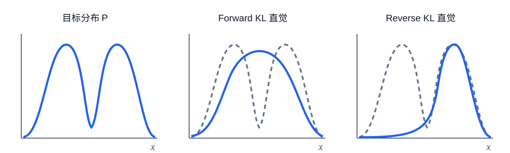
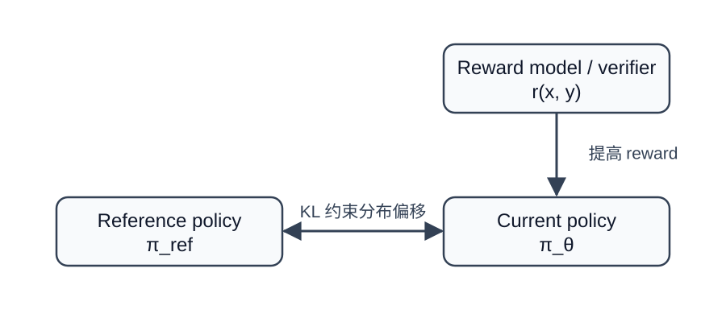
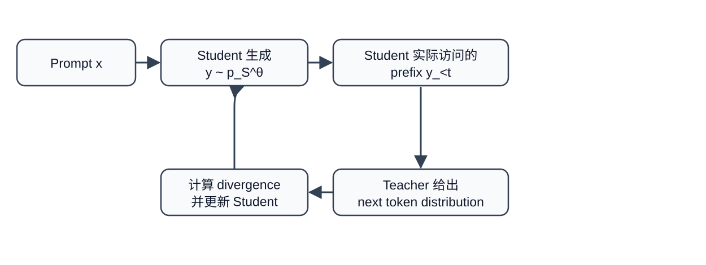

目标：看懂 KL 散度的数学结构，并理解它在 PPO、DPO、GRPO、On Policy Distillation 中究竟控制了什么。

## 先给结论：KL 在 LLM 训练里做什么

KL 散度衡量两个概率分布有多不一样。对大语言模型而言，一个模型在每个 token 上都会输出一个概率分布，所以两个模型之间的差异天然可以用 KL 来衡量。

在 LLM 强化学习与对齐中，KL 最常见的作用可以概括为一句话：

::: {.callout-tip title="直觉"}
奖励负责告诉模型“往哪里走”，KL 负责限制“不要一次走得太远”。
:::

例如，一个 SFT 模型已经会正常回答问题。强化学习发现某类答案 reward 很高，如果完全只追 reward，模型可能快速把概率集中到一些取巧模式上。加入对 reference model 的 KL 惩罚，相当于要求：

$$
\text{新模型既要拿更高 reward，也要尽量保留原模型已有的语言能力与行为分布。}
$$

最典型的目标写成

$$
\max_{\pi}
\quad
\mathbb{E}_{y\sim\pi(\cdot|x)}[r(x,y)]
-
\beta D_{\mathrm{KL}}\!\left(\pi(\cdot|x)\,\middle\|\,\pi_{\mathrm{ref}}(\cdot|x)\right).
\tag{1}
$$

其中 $\beta\gt 0$ 控制 KL 约束强度。

- $\beta$ 小：允许模型更大胆地偏离 reference policy。

- $\beta$ 大：模型更新更保守，更接近 reference policy。

后面的 PPO、DPO、GRPO、OPD，虽然形式不同，但都能看到“控制分布偏移”这个核心思想。

## KL 散度的定义

### 离散分布

设离散随机变量 $X$ 的两个概率分布为

$$
P=\{p_1,p_2,\ldots,p_n\},
\qquad
Q=\{q_1,q_2,\ldots,q_n\},
$$

满足

$$
p_i\ge 0,\qquad q_i\ge 0,
\qquad
\sum_{i=1}^{n}p_i=1,
\qquad
\sum_{i=1}^{n}q_i=1.
$$

KL 散度定义为

$$
\boxed{
D_{\mathrm{KL}}\!\left(P\,\middle\|\,Q\right)
=
\sum_{i=1}^{n}
p_i\log\frac{p_i}{q_i}
}
$$

其中通常使用自然对数，因此单位是 nat。

也可以把求和写成期望：

$$
\begin{aligned}
D_{\mathrm{KL}}\!\left(P\,\middle\|\,Q\right)
&=
\sum_i p_i\log\frac{p_i}{q_i}
\\
&=
\mathbb{E}_{x\sim P}
\left[
\log\frac{P(x)}{Q(x)}
\right].

\end{aligned}
$$

因此 KL 的本质就是：

$$
\boxed{
\text{在 }P\text{ 真正会产生的数据上，平均比较 }P\text{ 与 }Q\text{ 的 log probability 差异。}
}
$$

### 连续分布

若 $P,Q$ 有概率密度 $p(x),q(x)$，则

$$
D_{\mathrm{KL}}\!\left(P\,\middle\|\,Q\right)
=
\int
p(x)\log\frac{p(x)}{q(x)}\,dx.
$$

离散情形中的求和被积分替代，数学含义保持一致。

### 为什么是 log probability ratio

考虑某个事件 $x$：

$$
\log\frac{P(x)}{Q(x)}
=
\log P(x)-\log Q(x).
$$

若 $P(x)\gt Q(x)$，则

$$
\log\frac{P(x)}{Q(x)}\gt 0.
$$

说明 $Q$ 低估了这个在 $P$ 中较常见的事件。

若 $P(x)\lt Q(x)$，则对应项为负。

KL 再用 $P(x)$ 作为权重求平均：

$$
\sum_x P(x)\log\frac{P(x)}{Q(x)}.
$$

所以，$P$ 经常出现的位置会得到更大的权重。

::: {.callout-tip title="直觉"}
把 $P$ 想成“真实分布”，把 $Q$ 想成“模型分布”。KL 会重点检查真实世界经常出现的情况，模型有没有给出足够概率。
:::

## 从交叉熵一步一步推导 KL

定义熵

$$
H(P)
=
-\sum_i p_i\log p_i.
$$

定义交叉熵

$$
H(P,Q)
=
-\sum_i p_i\log q_i.
$$

计算两者之差：

$$
\begin{aligned}
H(P,Q)-H(P)
&=
\left(-\sum_i p_i\log q_i\right)
-
\left(-\sum_i p_i\log p_i\right)
\\
&=
-\sum_i p_i\log q_i
+
\sum_i p_i\log p_i
\\
&=
\sum_i p_i
\left(
\log p_i-\log q_i
\right)
\\
&=
\sum_i p_i
\log\frac{p_i}{q_i}
\\
&=
D_{\mathrm{KL}}\!\left(P\,\middle\|\,Q\right).
\end{aligned}
$$

因此

$$
\boxed{
H(P,Q)=H(P)+D_{\mathrm{KL}}\!\left(P\,\middle\|\,Q\right)
}
$$

或者

$$
\boxed{
D_{\mathrm{KL}}\!\left(P\,\middle\|\,Q\right)=H(P,Q)-H(P).
}
$$

如果 $P$ 固定，则 $H(P)$ 是常数，所以

$$
\min_Q H(P,Q)
\quad\Longleftrightarrow\quad
\min_Q D_{\mathrm{KL}}\!\left(P\,\middle\|\,Q\right).
$$

这就是最大似然训练和 forward KL 之间的重要联系。

::: {.callout-tip title="直觉"}
交叉熵等于“数据本身 unavoidable 的不确定性”加上“模型分布不准确额外付出的代价”。后面这部分就是 KL。
:::

## KL 为什么一定非负

KL 满足

$$
\boxed{
D_{\mathrm{KL}}\!\left(P\,\middle\|\,Q\right)\ge 0.
}
$$

下面不跳步证明。

假设 $p_i\gt 0,q_i\gt 0$。由 Jensen 不等式，因为 $-\log x$ 是凸函数，

$$
\mathbb{E}[-\log X]
\ge
-\log\mathbb{E}[X].
$$

令

$$
X=\frac{q_i}{p_i},
$$

并让下标 $i$ 按照分布 $P$ 采样，则

$$
\begin{aligned}
D_{\mathrm{KL}}\!\left(P\,\middle\|\,Q\right)
&=
\sum_i p_i\log\frac{p_i}{q_i}
\\
&=
-\sum_i p_i\log\frac{q_i}{p_i}
\\
&=
\mathbb{E}_{i\sim P}
\left[
-\log\frac{q_i}{p_i}
\right]
\\
&\ge
-\log
\mathbb{E}_{i\sim P}
\left[
\frac{q_i}{p_i}
\right].
\end{aligned}
$$

继续计算期望：

$$
\begin{aligned}
\mathbb{E}_{i\sim P}
\left[
\frac{q_i}{p_i}
\right]
&=
\sum_i
p_i\frac{q_i}{p_i}
\\
&=
\sum_i q_i
\\
&=
1.
\end{aligned}
$$

因此

$$
\begin{aligned}
D_{\mathrm{KL}}\!\left(P\,\middle\|\,Q\right)
&\ge
-\log 1
\\
&=
0.
\end{aligned}
$$

所以

$$
\boxed{
D_{\mathrm{KL}}\!\left(P\,\middle\|\,Q\right)\ge0.
}
$$

Jensen 取等号要求

$$
\frac{q_i}{p_i}=c
$$

对所有 $i$ 为常数。又因为

$$
\sum_i p_i=\sum_i q_i=1,
$$

所以 $c=1$，于是

$$
p_i=q_i,\quad \forall i.
$$

故

$$
\boxed{
D_{\mathrm{KL}}\!\left(P\,\middle\|\,Q\right)=0
\iff
P=Q.
}
$$

## KL 为什么不对称

一般有

$$
D_{\mathrm{KL}}\!\left(P\,\middle\|\,Q\right)
\neq
D_{\mathrm{KL}}\!\left(Q\,\middle\|\,P\right).
$$

例如

$$
P=(0.9,0.1),
\qquad
Q=(0.5,0.5).
$$

先算 $D_{\mathrm{KL}}\!\left(P\,\middle\|\,Q\right)$：

$$
\begin{aligned}
D_{\mathrm{KL}}\!\left(P\,\middle\|\,Q\right)
&=
0.9\log\frac{0.9}{0.5}
+
0.1\log\frac{0.1}{0.5}
\\
&=
0.9\log 1.8
+
0.1\log 0.2
\\
&\approx
0.368.
\end{aligned}
$$

反过来：

$$
\begin{aligned}
D_{\mathrm{KL}}\!\left(Q\,\middle\|\,P\right)
&=
0.5\log\frac{0.5}{0.9}
+
0.5\log\frac{0.5}{0.1}
\\
&=
0.5\log\frac{5}{9}
+
0.5\log 5
\\
&\approx
0.511.
\end{aligned}
$$

两者明显不同。

原因来自权重：

$$
D_{\mathrm{KL}}\!\left(P\,\middle\|\,Q\right)
=
\mathbb{E}_{x\sim P}
\left[
\log\frac{P(x)}{Q(x)}
\right]
$$

主要关心 $P$ 经常访问的位置，而

$$
D_{\mathrm{KL}}\!\left(Q\,\middle\|\,P\right)
=
\mathbb{E}_{x\sim Q}
\left[
\log\frac{Q(x)}{P(x)}
\right]
$$

主要关心 $Q$ 经常访问的位置。

## Forward KL 与 Reverse KL

假设目标分布是 $P$，可学习模型是 $Q_\theta$。

通常称

$$
\text{Forward KL}
=
D_{\mathrm{KL}}\!\left(P\,\middle\|\,Q_\theta\right),
$$

$$
\text{Reverse KL}
=
D_{\mathrm{KL}}\!\left(Q_\theta\,\middle\|\,P\right).
$$

它们的行为差异非常重要。

### Forward KL 的倾向

Forward KL 为

$$
D_{\mathrm{KL}}\!\left(P\,\middle\|\,Q_\theta\right)
=
\mathbb{E}_{x\sim P}
\left[
\log\frac{P(x)}{Q_\theta(x)}
\right].
$$

如果某处

$$
P(x)\gt 0,\qquad Q_\theta(x)\approx0,
$$

则

$$
\log\frac{P(x)}{Q_\theta(x)}
\rightarrow +\infty.
$$

所以 forward KL 很怕模型漏掉 $P$ 的高概率区域。

因此常见直觉是：

$$
\boxed{
\text{Forward KL 更偏向 mode covering。}
}
$$

### Reverse KL 的倾向

Reverse KL 为

$$
D_{\mathrm{KL}}\!\left(Q_\theta\,\middle\|\,P\right)
=
\mathbb{E}_{x\sim Q_\theta}
\left[
\log\frac{Q_\theta(x)}{P(x)}
\right].
$$

它主要惩罚模型把概率放到目标分布 $P$ 很低的位置。

如果 $P$ 有多个模式，而 $Q_\theta$ 的容量有限，$Q_\theta$ 可能更愿意集中到其中一个高概率模式。

因此常见直觉是：

$$
\boxed{
\text{Reverse KL 更偏向 mode seeking。}
}
$$

{width="95%" fig-align="center"}

这里需要注意，“mode covering”和“mode seeking”是典型行为描述，并非对所有参数化分布都必然成立。

## 从单个 token 推到整个 LLM 序列

这是 KL 在 LLM 中最关键的一步。

给定 prompt $x$，模型生成序列

$$
y=(y_1,y_2,\ldots,y_T).
$$

自回归模型满足

$$
\pi_{\theta}(y|x)
=
\prod_{t=1}^{T}
\pi_{\theta}(y_t|x,y_{\lt t}).
$$

reference model 同样满足

$$
\pi_{\mathrm{ref}}(y|x)
=
\prod_{t=1}^{T}
\pi_{\mathrm{ref}}(y_t|x,y_{\lt t}).
$$

于是两者 sequence probability ratio 为

$$
\begin{aligned}
\frac{\pi_{\theta}(y|x)}{\pi_{\mathrm{ref}}(y|x)}
&=
\frac{
\prod_{t=1}^{T}\pi_{\theta}(y_t|x,y_{\lt t})
}{
\prod_{t=1}^{T}\pi_{\mathrm{ref}}(y_t|x,y_{\lt t})
}
\\
&=
\prod_{t=1}^{T}
\frac{
\pi_{\theta}(y_t|x,y_{\lt t})
}{
\pi_{\mathrm{ref}}(y_t|x,y_{\lt t})
}.
\end{aligned}
$$

取对数：

$$
\begin{aligned}
\log
\frac{\pi_{\theta}(y|x)}{\pi_{\mathrm{ref}}(y|x)}
&=
\log
\prod_{t=1}^{T}
\frac{
\pi_{\theta}(y_t|x,y_{\lt t})
}{
\pi_{\mathrm{ref}}(y_t|x,y_{\lt t})
}
\\
&=
\sum_{t=1}^{T}
\log
\frac{
\pi_{\theta}(y_t|x,y_{\lt t})
}{
\pi_{\mathrm{ref}}(y_t|x,y_{\lt t})
}.

\end{aligned}
$$

再对 $y\sim\pi_{\theta}$ 取期望：

$$
\begin{aligned}
D_{\mathrm{KL}}\!\left(\pi_{\theta}(\cdot|x)\,\middle\|\,\pi_{\mathrm{ref}}(\cdot|x)\right)
&=
\mathbb{E}_{y\sim\pi_{\theta}}
\left[
\log
\frac{\pi_{\theta}(y|x)}{\pi_{\mathrm{ref}}(y|x)}
\right]
\\
&=
\mathbb{E}_{y\sim\pi_{\theta}}
\left[
\sum_{t=1}^{T}
\log
\frac{
\pi_{\theta}(y_t|x,y_{\lt t})
}{
\pi_{\mathrm{ref}}(y_t|x,y_{\lt t})
}
\right].

\end{aligned}
$$

进一步使用条件 KL 的 chain rule：

$$
\begin{aligned}
D_{\mathrm{KL}}\!\left(\pi_{\theta}(\cdot|x)\,\middle\|\,\pi_{\mathrm{ref}}(\cdot|x)\right)
=
\sum_{t=1}^{T}
\mathbb{E}_{y_{\lt t}\sim\pi_{\theta}}
\left[
D_{\mathrm{KL}}\!\left(
\pi_{\theta}(\cdot|x,y_{\lt t})
\,\middle\|\,
\pi_{\mathrm{ref}}(\cdot|x,y_{\lt t})
\right)
\right].

\end{aligned}
$$

这意味着：

$$
\boxed{
\text{序列级 KL 可以理解为每一个生成位置上的 token 分布 KL 累积。}
}
$$

::: {.callout-tip title="直觉"}
一句回答有 500 个 token。模型每一步都可能比 reference model 偏一点。KL 会把这些局部偏移累积起来，因此长回答也需要特别注意 KL 的尺度与长度归一化。
:::

## KL 的梯度：为什么它像一个“反向奖励”

令 reference distribution $q(x)$ 固定，可训练分布为 $p_\theta(x)$：

$$
D(\theta)
=
\sum_x
p_\theta(x)
\log
\frac{p_\theta(x)}{q(x)}.
$$

对 $\theta$ 求梯度：

$$
\begin{aligned}
\nabla_\theta D(\theta)
&=
\sum_x
\nabla_\theta
\left[
p_\theta(x)
\log
\frac{p_\theta(x)}{q(x)}
\right]
\\
&=
\sum_x
\nabla_\theta p_\theta(x)
\log
\frac{p_\theta(x)}{q(x)}
+
\sum_x
p_\theta(x)
\nabla_\theta
\log p_\theta(x).
\end{aligned}
$$

利用

$$
p_\theta(x)\nabla_\theta\log p_\theta(x)
=
\nabla_\theta p_\theta(x),
$$

得到

$$
\begin{aligned}
\nabla_\theta D(\theta)
&=
\sum_x
\nabla_\theta p_\theta(x)
\log
\frac{p_\theta(x)}{q(x)}
+
\sum_x
\nabla_\theta p_\theta(x)
\\
&=
\sum_x
\nabla_\theta p_\theta(x)
\log
\frac{p_\theta(x)}{q(x)}
+
\nabla_\theta
\sum_x p_\theta(x).
\end{aligned}
$$

因为

$$
\sum_x p_\theta(x)=1,
$$

所以

$$
\nabla_\theta
\sum_x p_\theta(x)
=
\nabla_\theta 1
=
0.
$$

因此

$$
\begin{aligned}
\nabla_\theta D(\theta)
&=
\sum_x
\nabla_\theta p_\theta(x)
\log
\frac{p_\theta(x)}{q(x)}
\\
&=
\sum_x
p_\theta(x)
\nabla_\theta\log p_\theta(x)
\log
\frac{p_\theta(x)}{q(x)}
\\
&=
\mathbb{E}_{x\sim p_\theta}
\left[
\nabla_\theta\log p_\theta(x)
\log
\frac{p_\theta(x)}{q(x)}
\right].

\end{aligned}
$$

考虑 KL 正则化强化学习目标

$$
J(\theta)
=
\mathbb{E}_{y\sim\pi_{\theta}}[r(y)]
-
\beta
D_{\mathrm{KL}}\!\left(\pi_{\theta}\,\middle\|\,\pi_{\mathrm{ref}}\right).
$$

忽略 baseline 等技巧，其 policy gradient 可以写成

$$
\nabla_\theta J
=
\mathbb{E}_{y\sim\pi_{\theta}}
\left[
\nabla_\theta\log\pi_{\theta}(y)
\left(
r(y)
-
\beta
\log\frac{\pi_{\theta}(y)}{\pi_{\mathrm{ref}}(y)}
\right)
\right].
$$

因此可以把

$$
-\beta
\log\frac{\pi_{\theta}(y)}{\pi_{\mathrm{ref}}(y)}
$$

看成一种额外的 reward correction。

::: {.callout-tip title="直觉"}
如果新模型把某条回答的概率抬得远高于 reference model，那么 log ratio 变大，KL correction 就会降低这条回答的有效奖励，从而阻止概率无限膨胀。
:::

## KL 正则化 RL 的最优策略

这一节非常重要，因为 DPO 的公式直接从这里来。

考虑固定 prompt $x$，省略 $x$：

$$
\max_{\pi}
\left[
\sum_y \pi(y)r(y)
-
\beta
\sum_y
\pi(y)
\log
\frac{\pi(y)}{\pi_{\mathrm{ref}}(y)}
\right]
$$

约束为

$$
\sum_y\pi(y)=1.
$$

加入拉格朗日乘子 $\lambda$：

$$
\begin{aligned}
\mathcal{L}(\pi,\lambda)
&=
\sum_y\pi(y)r(y)
-
\beta
\sum_y
\pi(y)
\log\frac{\pi(y)}{\pi_{\mathrm{ref}}(y)}
\\
&\quad
+
\lambda
\left(
\sum_y\pi(y)-1
\right).
\end{aligned}
$$

对某个 $\pi(y)$ 求偏导：

$$
\begin{aligned}
\frac{\partial\mathcal{L}}{\partial\pi(y)}
&=
r(y)
-
\beta
\frac{\partial}{\partial\pi(y)}
\left[
\pi(y)
\log\frac{\pi(y)}{\pi_{\mathrm{ref}}(y)}
\right]
+
\lambda.
\end{aligned}
$$

使用

$$
\frac{d}{dz}
\left(
z\log z
\right)
=
\log z+1,
$$

有

$$
\begin{aligned}
\frac{\partial}{\partial\pi(y)}
\left[
\pi(y)
\log\frac{\pi(y)}{\pi_{\mathrm{ref}}(y)}
\right]
&=
\log\frac{\pi(y)}{\pi_{\mathrm{ref}}(y)}
+1.
\end{aligned}
$$

令偏导为零：

$$
\begin{aligned}
0
&=
r(y)
-
\beta
\left(
\log\frac{\pi(y)}{\pi_{\mathrm{ref}}(y)}
+1
\right)
+
\lambda.
\end{aligned}
$$

移项：

$$
\begin{aligned}
\beta
\log\frac{\pi(y)}{\pi_{\mathrm{ref}}(y)}
&=
r(y)+\lambda-\beta.
\end{aligned}
$$

除以 $\beta$：

$$
\begin{aligned}
\log\frac{\pi(y)}{\pi_{\mathrm{ref}}(y)}
&=
\frac{r(y)}{\beta}
+
\frac{\lambda}{\beta}
-1.
\end{aligned}
$$

两边取指数：

$$
\begin{aligned}
\frac{\pi(y)}{\pi_{\mathrm{ref}}(y)}
&=
\exp
\left(
\frac{r(y)}{\beta}
\right)
\exp
\left(
\frac{\lambda}{\beta}-1
\right).
\end{aligned}
$$

因此

$$
\pi(y)
=
C
\pi_{\mathrm{ref}}(y)
\exp
\left(
\frac{r(y)}{\beta}
\right),
$$

其中 $C$ 与 $y$ 无关。

利用概率归一化：

$$
\begin{aligned}
1
&=
\sum_y\pi(y)
\\
&=
C
\sum_y
\pi_{\mathrm{ref}}(y)
\exp
\left(
\frac{r(y)}{\beta}
\right).
\end{aligned}
$$

定义 partition function

$$
Z
=
\sum_y
\pi_{\mathrm{ref}}(y)
\exp
\left(
\frac{r(y)}{\beta}
\right),
$$

于是

$$
C=\frac{1}{Z}.
$$

最终得到

$$
\boxed{
\pi^*(y)
=
\frac{1}{Z}
\pi_{\mathrm{ref}}(y)
\exp
\left(
\frac{r(y)}{\beta}
\right)
}
\tag{68}
$$

这条式子非常直观：

$$
\boxed{
\text{新策略}
=
\text{旧策略先验}
\times
\text{reward 带来的指数加权}.
}
$$

### 一个两答案的小例子

设 reference policy 对两个回答 $A,B$ 的概率都是 $0.5$：

$$
\pi_{\mathrm{ref}}(A)=0.5,
\qquad
\pi_{\mathrm{ref}}(B)=0.5.
$$

奖励为

$$
r(A)=2,
\qquad
r(B)=0.
$$

由式 (68)：

$$
\frac{\pi^*(A)}{\pi^*(B)}
=
\frac{\pi_{\mathrm{ref}}(A)}{\pi_{\mathrm{ref}}(B)}
\exp
\left(
\frac{r(A)-r(B)}{\beta}
\right)
=
\exp\left(\frac{2}{\beta}\right).
$$

因此：

| $\beta$ |   $\pi^*(A)$    |         含义          |
|:---------:|:-----------------:|:---------------------:|
|  $0.5$  | $\approx 0.982$ | reward 主导，更新激进 |
|   $1$   | $\approx 0.881$ |       中等约束        |
|   $2$   | $\approx 0.731$ |  reference 约束更强   |

## PPO 中的 KL

PPO 本身的核心是限制一次 policy update 的幅度。LLM RLHF 中又经常额外使用 reference model KL。因此需要区分两个对象：

1.  $\pi_{\mathrm{old}}$：采样 rollout 时的旧策略，用 PPO ratio 与 clipping 控制单次更新。

2.  $\pi_{\mathrm{ref}}$：通常是冻结的 SFT 或初始策略，用 KL 防止长期漂移。

### PPO ratio

在 token $t$ 的状态 $s_t$ 和动作 $a_t$ 上定义

$$
\rho_t(\theta)
=
\frac{
\pi_{\theta}(a_t|s_t)
}{
\pi_{\mathrm{old}}(a_t|s_t)
}.
$$

PPO clipped objective 为

$$
L_{\mathrm{clip}}
=
\mathbb{E}_t
\left[
\min
\left(
\rho_t A_t,
\mathrm{clip}
(\rho_t,1-\epsilon,1+\epsilon)A_t
\right)
\right].
$$

clipping 的作用是限制 $\pi_{\theta}$ 相对 $\pi_{\mathrm{old}}$ 的单次变化。

### Reference KL

RLHF 中常见的 reward 可以写成

$$
r_{\mathrm{total}}
=
r_{\mathrm{RM}}
-
\beta
\log
\frac{
\pi_{\theta}(y_t|s_t)
}{
\pi_{\mathrm{ref}}(y_t|s_t)
}.
$$

沿整个序列累积：

$$
R_{\mathrm{KL}}
=
-\beta
\sum_t
\log
\frac{
\pi_{\theta}(y_t|s_t)
}{
\pi_{\mathrm{ref}}(y_t|s_t)
}.
$$

在当前 policy 下取期望，就对应 sequence level forward KL。

{width="82%" fig-align="center"}

::: {.callout-tip title="直觉"}
PPO clipping 像“这一小步别跨太大”，reference KL 像“走很多步之后也别离出发点太远”。两种约束经常同时存在。
:::

## DPO 中的 KL：损失里看不见，推导里一直存在

DPO 省去了显式 reward model 训练与在线 PPO 循环，但它可以从 KL 正则化 RLHF 的最优策略直接推导出来。

由式 (68)：

$$
\pi^*(y|x)
=
\frac{1}{Z(x)}
\pi_{\mathrm{ref}}(y|x)
\exp
\left(
\frac{r(x,y)}{\beta}
\right).
$$

移项：

$$
\begin{aligned}
\frac{\pi^*(y|x)}{\pi_{\mathrm{ref}}(y|x)}
&=
\frac{1}{Z(x)}
\exp
\left(
\frac{r(x,y)}{\beta}
\right).
\end{aligned}
$$

取对数：

$$
\begin{aligned}
\log
\frac{\pi^*(y|x)}{\pi_{\mathrm{ref}}(y|x)}
&=
-\log Z(x)
+
\frac{r(x,y)}{\beta}.
\end{aligned}
$$

乘以 $\beta$：

$$
\begin{aligned}
\beta
\log
\frac{\pi^*(y|x)}{\pi_{\mathrm{ref}}(y|x)}
&=
-\beta\log Z(x)
+
r(x,y).
\end{aligned}
$$

因此 reward 可以写成

$$
\boxed{
r(x,y)
=
\beta
\log
\frac{\pi^*(y|x)}{\pi_{\mathrm{ref}}(y|x)}
+
\beta\log Z(x)
}
\tag{77}
$$

现在给定偏好数据

$$
(x,y_w,y_l),
$$

其中 $y_w$ 是 preferred response，$y_l$ 是 rejected response。

Bradley Terry 偏好模型写成

$$
P(y_w\succ y_l|x)
=
\sigma
\left(
r(x,y_w)-r(x,y_l)
\right),
$$

其中

$$
\sigma(z)=\frac{1}{1+e^{-z}}.
$$

将式 (77) 代入。

首先：

$$
\begin{aligned}
r(x,y_w)
&=
\beta
\log
\frac{\pi_{\theta}(y_w|x)}{\pi_{\mathrm{ref}}(y_w|x)}
+
\beta\log Z(x),
\end{aligned}
$$

$$
\begin{aligned}
r(x,y_l)
&=
\beta
\log
\frac{\pi_{\theta}(y_l|x)}{\pi_{\mathrm{ref}}(y_l|x)}
+
\beta\log Z(x).
\end{aligned}
$$

两式相减：

$$
\begin{aligned}
r(x,y_w)-r(x,y_l)
&=
\beta
\log
\frac{\pi_{\theta}(y_w|x)}{\pi_{\mathrm{ref}}(y_w|x)}
\\
&\quad
-
\beta
\log
\frac{\pi_{\theta}(y_l|x)}{\pi_{\mathrm{ref}}(y_l|x)}
\\
&\quad
+
\beta\log Z(x)
-
\beta\log Z(x)
\\
&=
\beta
\left[
\log
\frac{\pi_{\theta}(y_w|x)}{\pi_{\mathrm{ref}}(y_w|x)}
-
\log
\frac{\pi_{\theta}(y_l|x)}{\pi_{\mathrm{ref}}(y_l|x)}
\right].
\end{aligned}
$$

于是

$$
P(y_w\succ y_l|x)
=
\sigma
\left(
\beta
\left[
\log
\frac{\pi_{\theta}(y_w|x)}{\pi_{\mathrm{ref}}(y_w|x)}
-
\log
\frac{\pi_{\theta}(y_l|x)}{\pi_{\mathrm{ref}}(y_l|x)}
\right]
\right).
$$

最大化偏好数据似然，就得到 DPO loss：

$$
\boxed{
\mathcal{L}_{\mathrm{DPO}}
=
-
\mathbb{E}
\left[
\log
\sigma
\left(
\beta
\left[
\log
\frac{\pi_{\theta}(y_w|x)}{\pi_{\mathrm{ref}}(y_w|x)}
-
\log
\frac{\pi_{\theta}(y_l|x)}{\pi_{\mathrm{ref}}(y_l|x)}
\right]
\right)
\right].
}
$$

::: {.callout-tip title="直觉"}
DPO 在做的事情可以理解为：让模型相对 reference 更愿意产生 winner，同时相对 reference 更不愿意产生 loser。reference model 一直存在于概率比值中，所以 KL 正则化的思想已经被吸收到目标函数里。
:::

DPO loss 中没有单独写

$$
-\beta D_{\mathrm{KL}}\!\left(\pi_{\theta}\,\middle\|\,\pi_{\mathrm{ref}}\right),
$$

但 DPO 的闭式推导来自式 (1) 的 KL 正则化目标。因此说 DPO “完全与 KL 无关”是不准确的。

## GRPO 中的 KL

GRPO 可以看成 PPO 风格的 policy optimization，但不依赖单独的 value model 来估计 advantage。对于同一个 prompt $q$，从旧策略采样一组回答：

$$
o_1,o_2,\ldots,o_G
\sim
\pi_{\mathrm{old}}(\cdot|q).
$$

获得 rewards：

$$
r_1,r_2,\ldots,r_G.
$$

组内标准化得到 advantage：

$$
A_i
=
\frac{
r_i-\mathrm{mean}(r_1,\ldots,r_G)
}{
\mathrm{std}(r_1,\ldots,r_G)
}.
$$

直觉上，同组里的回答彼此比较：

- 比组平均好，$A_i\gt 0$，提高其概率。

- 比组平均差，$A_i\lt 0$，降低其概率。

token level ratio 为

$$
\rho_{i,t}
=
\frac{
\pi_{\theta}(o_{i,t}|q,o_{i,\lt t})
}{
\pi_{\mathrm{old}}(o_{i,t}|q,o_{i,\lt t})
}.
$$

一个典型 GRPO 目标写成

$$
\begin{aligned}
J_{\mathrm{GRPO}}
=
\mathbb{E}
\Bigg[
\frac{1}{G}
\sum_{i=1}^{G}
\frac{1}{|o_i|}
\sum_t
\Big(
&
\min
[
\rho_{i,t}A_i,
\mathrm{clip}(\rho_{i,t},1-\epsilon,1+\epsilon)A_i
]
\\
&
-
\beta D_{i,t}^{\mathrm{KL}}
\Big)
\Bigg].
\end{aligned}
$$

DeepSeekMath 与 DeepSeek R1 相关公式中使用过如下单样本 KL estimator：

$$
D_{i,t}^{\mathrm{KL}}
=
\frac{\pi_{\mathrm{ref}}(o_{i,t}|s_{i,t})}
{\pi_{\theta}(o_{i,t}|s_{i,t})}
-
\log
\frac{\pi_{\mathrm{ref}}(o_{i,t}|s_{i,t})}
{\pi_{\theta}(o_{i,t}|s_{i,t})}
-1.
\tag{90}
$$

这个式子看起来和标准 KL 定义不同，但在 $o_{i,t}\sim\pi_{\theta}$ 时，它的期望正好对应 forward KL。

令

$$
R(a)
=
\frac{\pi_{\mathrm{ref}}(a|s)}{\pi_{\theta}(a|s)}.
$$

则

$$
\begin{aligned}
\mathbb{E}_{a\sim\pi_{\theta}}
[
R(a)-\log R(a)-1
]
&=
\mathbb{E}_{\pi_{\theta}}[R(a)]
-
\mathbb{E}_{\pi_{\theta}}[\log R(a)]
-1.
\end{aligned}
$$

第一项：

$$
\begin{aligned}
\mathbb{E}_{\pi_{\theta}}[R(a)]
&=
\sum_a
\pi_{\theta}(a|s)
\frac{\pi_{\mathrm{ref}}(a|s)}{\pi_{\theta}(a|s)}
\\
&=
\sum_a\pi_{\mathrm{ref}}(a|s)
\\
&=
1.
\end{aligned}
$$

第二项：

$$
\begin{aligned}
-\mathbb{E}_{\pi_{\theta}}[\log R(a)]
&=
-\mathbb{E}_{\pi_{\theta}}
\left[
\log
\frac{\pi_{\mathrm{ref}}(a|s)}{\pi_{\theta}(a|s)}
\right]
\\
&=
\mathbb{E}_{\pi_{\theta}}
\left[
\log
\frac{\pi_{\theta}(a|s)}{\pi_{\mathrm{ref}}(a|s)}
\right]
\\
&=
D_{\mathrm{KL}}\!\left(\pi_{\theta}(\cdot|s)\,\middle\|\,\pi_{\mathrm{ref}}(\cdot|s)\right).
\end{aligned}
$$

所以

$$
\begin{aligned}
\mathbb{E}_{\pi_{\theta}}
[
R-\log R-1
]
&=
1
+
D_{\mathrm{KL}}\!\left(\pi_{\theta}\,\middle\|\,\pi_{\mathrm{ref}}\right)
-
1
\\
&=
D_{\mathrm{KL}}\!\left(\pi_{\theta}\,\middle\|\,\pi_{\mathrm{ref}}\right).
\end{aligned}
$$

因此式 (90) 仍然是在控制 current policy 与 reference policy 的偏离。

::: {.callout-tip title="直觉"}
GRPO 的主要变化在 advantage 怎么来。PPO 依赖 critic 估值，GRPO 让同一道题采样出来的一组回答互相比较。KL 的职责没有变，仍然负责防止 policy 为追求 reward 过度漂移。
:::

## OPD：On Policy Distillation 中的 KL

本文把 OPD 指 On Policy Distillation。

设 teacher 为

$$
p_T,
$$

student 为

$$
p_S^\theta.
$$

传统离线蒸馏通常在固定 teacher data 或固定训练数据上训练 student。问题是推理时 student 会生成自己的 token，一旦前面生成错，后续看到的 prefix 可能完全偏离训练集。

On Policy Distillation 的关键流程是：

1.  给 student 一个 prompt $x$。

2.  student 自己生成轨迹 $y\sim p_S^\theta(\cdot|x)$。

3.  在 student 真正访问到的每个 prefix $y_{\lt t}$ 上查询 teacher。

4.  比较 teacher 与 student 的 next token distribution。

5.  用 KL 或其他 divergence 更新 student。

{width="90%" fig-align="center"}

### Forward KL 蒸馏

按 teacher 为目标、student 为近似的常用记法：

$$
D_{\mathrm{FKL}}
=
D_{\mathrm{KL}}\!\left(
p_T(\cdot|s_t)
\,\middle\|\,
p_S^\theta(\cdot|s_t)
\right).
$$

展开：

$$
\begin{aligned}
D_{\mathrm{FKL}}
&=
\sum_v
p_T(v|s_t)
\log
\frac{
p_T(v|s_t)
}{
p_S^\theta(v|s_t)
}.
\end{aligned}
$$

因为 teacher 固定，

$$
\sum_v p_T(v|s_t)\log p_T(v|s_t)
$$

对 student 参数是常数，所以最小化 forward KL 等价于最小化

$$
-\sum_v
p_T(v|s_t)
\log p_S^\theta(v|s_t).
$$

这就是 soft target cross entropy。

### Reverse KL 蒸馏

Reverse KL 为

$$
D_{\mathrm{RKL}}
=
D_{\mathrm{KL}}\!\left(
p_S^\theta(\cdot|s_t)
\,\middle\|\,
p_T(\cdot|s_t)
\right).
$$

展开：

$$
D_{\mathrm{RKL}}
=
\sum_v
p_S^\theta(v|s_t)
\log
\frac{
p_S^\theta(v|s_t)
}{
p_T(v|s_t)
}.
$$

它更强调：

$$
\text{Student 自己想输出的 token，Teacher 是否也认为合理。}
$$

如果 student 给某个 token 很高概率，而 teacher 给它很低概率，则

$$
\log
\frac{p_S^\theta(v|s_t)}{p_T(v|s_t)}
$$

会很大，从而产生强惩罚。

::: {.callout-tip title="直觉"}
Forward KL 更像“尽量把 teacher 会的各种可能性都学下来”。Reverse KL 更像“student 既然准备走这条路，就检查 teacher 是否认可这条路”。当 student 容量明显小于 teacher 时，后者有时更容易把有限容量集中到 teacher 的高概率模式。
:::

GKD 工作把 on policy sampling 与多种 divergence 结合，并研究了 reverse KL 与 Jensen Shannon divergence 等选择。

### OPD 和强化学习的关系

OPD 看起来像蒸馏，但和 RL 有一个很重要的共同点：

$$
\boxed{
\text{训练数据来自当前 student policy 自己访问到的状态。}
}
$$

这和 online RL 的 on policy 数据非常相似。

同时 teacher 给出的 token distribution 是稠密反馈：

$$
p_T(\cdot|s_t),
$$

它比一个只在整条回答结束后给出的 scalar reward

$$
r(x,y)\in\mathbb{R}
$$

信息更丰富。

因此可以粗略理解为：

- SFT：给 student 一个示范答案。

- RL：告诉 student 整条轨迹最终得多少分。

- OPD：student 先自己走，然后 teacher 在 student 真正走到的每一步给出概率分布参考。

需要避免一个过强的说法：teacher 并没有逐 token 给出“绝对正确或错误”的标签。teacher 给的是一个概率分布，表示它在当前 prefix 下更倾向哪些 next token。

## 四种方法放在一起比较

| 方法 | 数据来源 | KL 或 reference 出现位置 | KL 主要作用 | 一句话理解 |
|:---|:---|:---|:---|:---|
| PPO | 当前或旧 policy rollout | 常显式约束 $\pi_{\theta}$ 与 $\pi_{\mathrm{ref}}$，同时 ratio clipping 约束 $\pi_{\theta}$ 与 $\pi_{\mathrm{old}}$ | 限制 reward 驱动下的策略漂移 | 拿 reward，但别一步更新过猛，也别长期偏离 SFT 太远 |
| DPO | 离线 preference pairs | 通过 $\log\pi_{\theta}-\log\pi_{\mathrm{ref}}$ 的偏好 log ratio 隐式继承 KL regularized RLHF | 保持 reference 锚点，同时增大 winner 相对 loser 的偏好 | 直接学“更喜欢哪个回答”，省掉显式 PPO 循环 |
| GRPO | 当前或旧 policy 的 group rollout | 显式 KL 到 reference，policy ratio 到 old policy | 限制 group relative reward 导致的策略漂移 | 同一道题多采样几份，组内比高低，再保留 KL 安全绳 |
| OPD | Student 自己生成的 on policy trajectories | Student 与 Teacher 的 token distribution divergence | 在 student 真正访问的状态上纠正分布 | 先让 student 自己走，再让 teacher 在它走到的位置指导 |

## KL 系数 $\beta$ 到底控制什么

回到

$$
J(\pi)
=
\mathbb{E}_\pi[r]
-
\beta
D_{\mathrm{KL}}\!\left(\pi\,\middle\|\,\pi_{\mathrm{ref}}\right).
$$

$\beta$ 是 reward 与“保持原模型行为”之间的交换系数。

### $\beta$ 太小

如果

$$
\beta\rightarrow0,
$$

目标越来越接近

$$
\max_\pi\mathbb{E}_\pi[r].
$$

可能出现：

- reward hacking；

- policy 快速塌到少量高 reward 模式；

- 语言质量或通用能力下降；

- 训练不稳定；

- exploration 过早消失。

### $\beta$ 太大

如果 $\beta$ 很大，KL penalty 主导：

$$
\pi\approx\pi_{\mathrm{ref}}.
$$

可能出现：

- 模型几乎学不到 reward 信号；

- reasoning 行为难以发生明显变化；

- policy improvement 过慢。

因此训练中经常关注：

$$
\text{reward},
\qquad
\text{KL},
\qquad
\text{entropy},
\qquad
\text{response length},
$$

而不是只看 reward。

## 一个更深的理解：KL 是“更新预算”

把 reference policy 想成模型已经掌握的行为分布。

reward 想把某些回答概率提高：

$$
\pi_{\theta}(y|x)\uparrow.
$$

但概率总和必须为 1：

$$
\sum_y\pi_{\theta}(y|x)=1.
$$

所以提高某些回答的概率，必然会压低另一些回答。

如果没有约束，模型为了快速提高 reward，可能重新分配大量概率质量。

KL 通过

$$
\log
\frac{
\pi_{\theta}(y|x)
}{
\pi_{\mathrm{ref}}(y|x)
}
$$

直接衡量这种概率质量重新分配。

因此可以把 KL 理解为一种 distribution shift budget：

$$
\boxed{
\text{为了得到更高 reward，你愿意花多少“偏离原模型”的预算？}
}
$$

这也是为什么 KL 在 LLM 强化学习里如此常见。LLM 的 action space 是整个词表，trajectory 又很长，轻微的 token probability 改动经过多步自回归之后就可能产生很大的行为变化。

## 常见误区

### 误区一：KL 是距离

KL 满足非负性，但通常

$$
D_{\mathrm{KL}}\!\left(P\,\middle\|\,Q\right)\neq D_{\mathrm{KL}}\!\left(Q\,\middle\|\,P\right),
$$

因此它不是严格数学意义上的距离。

### 误区二：PPO clipping 和 reference KL 是同一件事

它们约束的对象通常不同：

$$
\pi_{\theta}
\leftrightarrow
\pi_{\mathrm{old}}
$$

主要控制单次 policy update；

$$
\pi_{\theta}
\leftrightarrow
\pi_{\mathrm{ref}}
$$

主要控制长期相对初始模型的漂移。

### 误区三：DPO 没写 KL，所以和 KL 没关系

DPO loss 没有单独的 KL 项，但其核心 reward parameterization 来自 KL regularized RLHF 的闭式最优策略。

### 误区四：GRPO 去掉 critic，所以也去掉 KL

GRPO 的核心改动是使用 group relative reward 构造 advantage，从而省掉独立 value model。原始 DeepSeekMath 以及 DeepSeek R1 的相关 GRPO 形式仍包含 reference KL penalty。

### 误区五：OPD 的 teacher 是逐 token 正误判定器

更准确的说法是 teacher 提供 next token probability distribution。它给的是稠密偏好信号，而不是逐 token 的二元正确性标签。

## 最终记忆框架

如果只记住五句话：

1.  KL 衡量两个概率分布的差异：
    $$
    D_{\mathrm{KL}}\!\left(P\,\middle\|\,Q\right)
        =
        \mathbb{E}_{P}
        \left[
        \log\frac{P}{Q}
        \right].
    $$

2.  KL 非负：
    $$
    D_{\mathrm{KL}}\!\left(P\,\middle\|\,Q\right)\ge0,
        \qquad
        D_{\mathrm{KL}}\!\left(P\,\middle\|\,Q\right)=0\iff P=Q.
    $$

3.  对 LLM，自回归分解使 sequence KL 可以拆成每个 token 的 log probability ratio 累积。

4.  在 RLHF 中：
    $$
    \text{reward 推动模型改变，KL 限制模型改变得太远。}
    $$

5.  PPO、DPO、GRPO、OPD 的实现路径不同，但 KL 都在处理同一个根问题：
    $$
    \boxed{
        \text{如何学习新的偏好，同时控制概率分布发生多大的变化。}
        }
    $$

## 参考文献

1. S. Kullback and R. A. Leibler. On Information and Sufficiency. *The Annals of Mathematical Statistics*, 1951.

2. J. Schulman, F. Wolski, P. Dhariwal, A. Radford, and O. Klimov. Proximal Policy Optimization Algorithms. arXiv:1707.06347, 2017. <https://arxiv.org/abs/1707.06347>

3. R. Rafailov, A. Sharma, E. Mitchell, S. Ermon, C. D. Manning, and C. Finn. Direct Preference Optimization: Your Language Model is Secretly a Reward Model. arXiv:2305.18290, 2023. <https://arxiv.org/abs/2305.18290>

4. Z. Shao et al. DeepSeekMath: Pushing the Limits of Mathematical Reasoning in Open Language Models. arXiv:2402.03300, 2024. <https://arxiv.org/abs/2402.03300>

5. DeepSeek AI et al. DeepSeek R1 Incentivizes Reasoning in LLMs through Reinforcement Learning. *Nature*, 2025. <https://www.nature.com/articles/s41586-025-09422-z>

6. R. Agarwal, N. Vieillard, Y. Zhou, P. Stanczyk, S. Ramos, M. Geist, and O. Bachem. On Policy Distillation of Language Models: Learning from Self Generated Mistakes. arXiv:2306.13649, 2023. <https://arxiv.org/abs/2306.13649>
