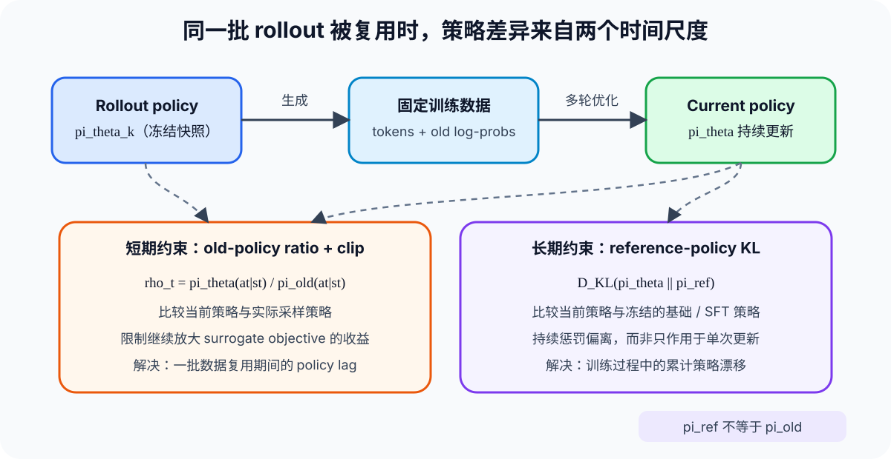
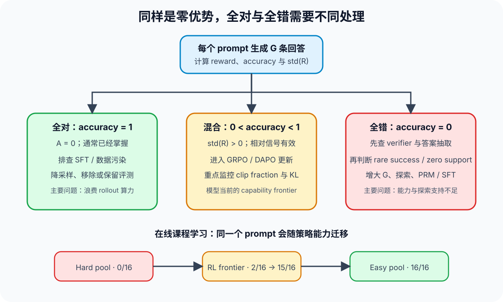

PPO 和 GRPO 经常被归入 on-policy 算法，但实际的 LLM 强化学习很少满足「当前策略采样、立即只更新一次」这一理想条件。rollout 生成昂贵，同一批数据通常会被切成 mini-batch 并复用多轮；异步系统还会让 rollout worker 落后于 trainer。结果是，训练从一开始就要面对两个问题：采样策略与当前策略逐渐错位，以及采到的数据是否还含有可用的 reward 差异。

这两个问题不能混在一起处理。PPO clip 管的是前者。当 GRPO 对同一 prompt 的所有回答给出相同 reward 时，问题出在后者：advantage 已经变成零，ratio、clip 乃至更宽的 Clip-Higher 都无从发挥作用。

本文沿着这条因果链展开。PPO、GRPO 与 KL 的完整基础推导可参阅仓库中的 [PPO、DPO 与 GRPO](PPO-DPO-GRPO.qmd) 和 [KL Divergence](kl-divergence-llm-rl.qmd)；这里集中讨论训练信号何时失效，以及工程上应先动哪一层。

## 1. 三个策略对象与 near on-policy 训练

先固定三个容易混淆的对象。

| 策略 | 作用 | 是否随当前 step 更新 |
| --- | --- | --- |
| $\pi_{\mathrm{rollout}}$ 或 $\pi_{\mathrm{old}}$ | 生成当前训练批次，并提供 old log-probability | 采样期间冻结 |
| $\pi_\theta$ | 正在优化的 current policy | 每个 optimizer step 更新 |
| $\pi_{\mathrm{ref}}$ | KL 参照，通常来自冻结的 base/SFT checkpoint | 通常长期冻结或低频刷新 |

严格 on-policy 要求数据来自当前正在优化的策略。若 $\pi_{\theta_k}$ 完成 rollout 后只做一次更新，训练很接近这个条件；若一批 rollout 被复用多个 epoch，到了 $\pi_{\theta_{k+2}}$、$\pi_{\theta_{k+3}}$，数据仍然来自 $\pi_{\theta_k}$。异步 rollout 会进一步扩大这种 policy lag。

因此，LLM PPO/GRPO 更准确的描述是 **near on-policy**：算法依赖近期策略产生的数据，并允许有限的数据复用和策略错位。若开始使用数小时前的 replay 数据，或者行为策略与当前策略长期不一致，就逐渐进入 off-policy 区域。这是一条连续谱，不是只靠算法名称就能决定的二元标签。

{#fig-policy-lag-zh width="95%" fig-align="center" fig-alt="rollout 策略生成固定训练数据，current policy 多轮更新；ratio clipping 与 reference KL 分别作用于短期策略滞后和长期策略漂移。"}

图中最重要的边界是 $\pi_{\mathrm{old}}$ 不等于 $\pi_{\mathrm{ref}}$。前者回答「这条 token 当时由谁采到」，后者回答「训练长期不希望离哪个策略太远」。把两者合并成一个「旧模型」，很容易误判 ratio、clip 和 KL 各自在约束什么。

## 2. Probability ratio 与 PPO clip 的准确含义

对状态 $s_t$ 和已经采到的动作 $a_t$，重要性采样比率定义为：

$$
\rho_t(\theta)
=
\frac{\pi_\theta(a_t \mid s_t)}{\pi_{\mathrm{old}}(a_t \mid s_t)}
$$

$\rho_t=1$ 表示当前策略对该动作的概率没有变化；$\rho_t=1.2$ 表示提高了约 20%；$\rho_t=0.8$ 表示降到旧概率的 80%。PPO-Clip 优化：

$$
L_{\mathrm{clip}}(\theta)
=
\mathbb{E}_t
\left[
\min\left(
\rho_t A_t,
\mathrm{clip}(\rho_t,1-\epsilon,1+\epsilon)A_t
\right)
\right]
$$

这里不能简化成「先把所有 ratio 裁到区间里，再计算 loss」。未裁剪项和裁剪项会同时进入目标函数，并取更保守的一项。

- 当 $A_t \gt 0$ 时，优化希望提高该动作概率；一旦 $\rho_t \gt 1+\epsilon$，继续提高概率不再增加 surrogate objective。
- 当 $A_t \lt 0$ 时，优化希望降低该动作概率；一旦 $\rho_t \lt 1-\epsilon$，继续降低概率也不再得到额外收益。

例如 $\pi_{\mathrm{old}}(\text{"cat"}\mid x)=0.05$，当前策略提高到 $0.06$，则 $\rho_t=1.2$。若提高到 $0.10$，ratio 变成 2。对正 advantage 且 $\epsilon=0.2$ 的 token，clipped branch 在 1.2 后已经饱和。

这说明 clip 约束的是**当前策略相对采样策略继续改变该动作概率所能获得的目标收益**。它不是参数裁剪，也不直接裁剪 reward 或 advantage；实际参数仍会被其他 token、其他 mini-batch 和其他 loss 项共同更新。PPO clipping 也不是严格的 KL trust region，不能保证整体策略距离一定落在某个固定范围内。

## 3. GRPO 为什么会在全对或全错时失去梯度

GRPO 对同一个 prompt 采样 $G$ 条回答，以组内 reward 的均值和标准差构造相对优势。省略 token 广播后，可写成：

$$
\hat{A}_i
=
\frac{R_i-\mathrm{mean}(R_1,\ldots,R_G)}
{\mathrm{std}(R_1,\ldots,R_G)+\varepsilon}
$$

只要 $R_1=\cdots=R_G$，分子对所有样本都等于零。分母里的数值稳定项 $\varepsilon$ 只能避免除零，不能恢复训练信号：

$$
\hat{A}_1=\cdots=\hat{A}_G=0
\quad\Longrightarrow\quad
\sum_{i=1}^{G}\hat{A}_i\nabla_\theta\log\pi_\theta(o_i\mid q)=0
$$

如果实现中还保留显式 reference KL，KL 项可能继续产生梯度，但它只告诉策略不要偏离 reference，并不说明该 prompt 应该如何答对。[DAPO](https://arxiv.org/abs/2503.14476) 的目标直接移除了 KL 项，因此更不能把 KL 当作同质 reward 的补救信号。

在二元 reward、每次采样独立且单次成功概率固定为 $p$ 的简化模型下，同质组概率为：

$$
P_{\mathrm{homogeneous}}
=
p^G+(1-p)^G
$$

第一项是全对，第二项是全错。当 $p$ 接近 0 或 1 时，两端都会导致 advantage collapse。这个公式只适合做直觉分析：真实 prompt 的难度并不相同，同组回答也会受到解码相关性影响。2026 年的 [Sign advantage 研究](https://arxiv.org/abs/2605.07689)在其设置中观察到，真实退化率可以明显高于简单的 i.i.d. Bernoulli 估计。

## 4. 全对与全错在训练含义上并不对称

数学上，两类 group 都给出 $A=0$；工程上不能采用同一处理策略。

| rollout 状态 | 首要解释 | 先检查什么 | 后续处理 |
| --- | --- | --- | --- |
| 几乎全对 | 模型已经掌握，或存在 contamination | exact/near duplicate、SFT 轨迹重合、verifier 是否过宽 | 降采样、移出 RL 主池或转为评测样本 |
| 有对有错 | prompt 位于当前能力边界 | reward 方差、clip fraction、KL、长度和格式分布 | 作为 GRPO/DAPO 的主要训练数据 |
| 几乎全错 | verifier 故障，或模型缺少探索支持 | 答案抽取、格式判定、数值容差、tool parser、pass@$G$ | 探索、增大 $G$、SFT bootstrap、过程监督或课程学习 |

{#fig-collapse-routing-zh width="95%" fig-align="center" fig-alt="根据组内 accuracy 将 prompt 分成全对、混合和全错三类，并展示 hard pool、RL frontier 与 easy pool 之间的动态迁移。"}

我会先监控 `all_correct_rate`、`all_wrong_rate`、`nonzero_advantage_rate`、`std(R)` 和每个 prompt 的 EMA success rate。只看 batch mean reward 会掩盖问题：均值稳定时，有效梯度比例仍可能持续下降。

## 5. DAPO Dynamic Sampling 解决的是有效 batch 比例

[DAPO](https://arxiv.org/abs/2503.14476) 的 Dynamic Sampling 对每个 prompt 生成一组回答，过滤 accuracy 等于 0 或 1 的 group，并继续采样，直到训练 batch 被非同质 group 填满。它把 optimizer step 集中在 $0\lt\mathrm{accuracy}\lt1$ 的样本上。

{#fig-dapo-dynamic width="90%" fig-align="center" fig-alt="DAPO 论文训练曲线，对比启用和未启用 Dynamic Sampling 时的 AIME avg@32。"}

*来源：[DAPO，Figure 6](https://arxiv.org/abs/2503.14476)。该图支持其特定训练设置下的样本效率结论，不等价于 Dynamic Sampling 在所有任务上都降低总 rollout 成本。*

Dynamic Sampling 不能自动教会 hard prompt。一个持续 $0/16$ 的问题被过滤后，只是不会污染当前 optimizer batch；如果它代表必须突破的能力区域，训练系统仍要把它放入 hard pool，采用其他手段让 pass@$G$ 脱离零。否则过滤策略会稳定地忽略目标能力。

## 6. 让全错样本重新出现正轨迹

全错 group 需要先区分 **rare success** 与 **zero support**。前者表示正确轨迹概率很低但不为零，后者表示当前策略实际上采不到所需行为。

增大 group size 对 rare success 有效。全错概率从 $(1-p)^G$ 随 $G$ 增大而下降，但 rollout 成本近似线性增长，并且收益很快递减。提高 temperature 或调整 top-p 也可能让低概率轨迹出现，同时会增加无效和不可验证输出；它们需要和 pass@$G$、格式失败率及 verifier precision 一起观察。

若长期 pass@$G=0$，更合理的处理是加入少量高质量 demonstration，让正确轨迹进入当前策略的支持集，再回到 RL。SFT 的目标不是把所有训练题直接推到 $p\approx1$，而是把 $p\approx0$ 推到可探索区域。否则会从「全错无梯度」直接移动到「全对无梯度」。[DeepSeek-R1](https://arxiv.org/abs/2501.12948)采用 cold-start data 与后续 reasoning RL 的多阶段流程，这说明冷启动与 RL 可以分工，但不能单凭该报告断言 cold start 专门解决了 advantage collapse。

## 7. Process reward 同时改善稀疏反馈与信用分配

Outcome reward 只告诉模型最终答案是否正确。同一条轨迹中的所有 token 共享一个序列级 advantage，真正出错的步骤无法被定位。规则化 step checker、程序执行器或可验证的中间状态可以给出更细的信号，使最终全错的多条轨迹仍然具有不同的过程质量。

风险在于 learned PRM 并不等于 ground-truth verifier。把 PRM 分数直接聚合成 trajectory reward，会把 PRM 的系统偏差提升到整个序列，并为 reward hacking 留出空间。

{#fig-verigate-prm width="92%" fig-align="center" fig-alt="VeriGate 论文对比三个数学数据集上正确和错误轨迹的 PRM product 分布。"}

*来源：[VeriGate，Figure 2](https://arxiv.org/abs/2605.30451)。图中是特定 PRM 与数学数据集的结果，不能推出所有过程奖励模型都具有相同失配程度。*

[VeriGate](https://arxiv.org/abs/2605.30451) 的处理更克制：outcome verifier 能区分组内轨迹时仍以它为准，只有 outcome reward 退化时才引入 step-level supervision，并将其转换为 token-level relative advantage。这个设计值得借鉴的不是某个固定公式，而是监督优先级：可靠 verifier 负责最终正确性，PRM 只在缺少区分度时补充局部信用。

## 8. 2026 年方案：可验证结果与尚未成熟的外推

[Advantage Collapse Rate（ACR）](https://arxiv.org/abs/2605.21125)直接统计 batch 中 reward 标准差低于阈值的 group 比例。它比只看 loss 或平均 reward 更接近真正浪费了多少训练样本。该论文进一步提出 AVSPO，通过向归一化过程注入 virtual reward samples，为同质 group 构造非零相对信号。

{#fig-acr-performance width="88%" fig-align="center" fig-alt="散点图展示不同模型规模和配置下的早期 Advantage Collapse Rate 与最终 MATH-500 accuracy。"}

*来源：[Advantage Collapse in GRPO，Figure 1](https://arxiv.org/abs/2605.21125)。$R^2=0.617$ 是该研究配置中的相关性证据，不证明降低 ACR 在任意训练配方下都会按同一幅度提高准确率。*

几种新方案解决的对象并不相同：

| 方法 | 恢复信号的方式 | 当前证据边界 |
| --- | --- | --- |
| ACR + AVSPO | 监控 collapse，并用 virtual reward samples 改变同质组归一化 | 0.5B–14B 数学推理实验；需继续验证任务泛化与虚拟样本偏差 |
| VeriGate | verifier 退化时引入 future-cumulated step reward | Qwen2.5 1.5B/7B 和数学 benchmark；依赖 PRM 质量 |
| Sign advantage | 用固定参照 $A=2R-1$ 取代组均值中心化 | 主要结果来自二元 reward 与 GSM8K；全错时只知道「这些轨迹不好」 |
| Critic / global baseline | 用价值函数或跨 prompt 基线打破组内零方差 | 增加模型与系统成本，也会削弱 GRPO 对 prompt 难度偏移的消除 |

我的优先级仍是：先修 reward pipeline，再校准数据难度和采样，随后补足探索支持与局部信用，最后才改变 advantage estimator。新目标函数很容易让梯度重新出现，但「有梯度」并不自动等于「知道正确方向」。

## 9. 一套可执行的训练检查顺序

落到训练系统，可以按下面的顺序收敛问题：

1. 对全错样本做 verifier audit，人工复核一小批答案抽取、格式、数值容差和工具结果。
2. 记录每个 prompt 的 EMA success rate，并将数据动态分入 hard、frontier 与 easy pool。
3. optimizer batch 优先使用 mixed group；用 Dynamic Sampling 保持有效 group 数量稳定，同时单独核算额外 rollout 成本。
4. 对 persistent all-wrong prompt 先测更大的 $G$ 与适度探索；仍为零时，使用 demonstration、rejection sampling 或可验证过程监督做 bootstrap。
5. 监控 ACR、nonzero advantage rate、clip fraction、KL、entropy、response length、pass@1 与 pass@$G$。这些指标共同判断训练是在学习、过度收缩，还是只把计算花在零梯度组上。
6. 只有前述链路正常后，再比较 AVSPO、VeriGate、Sign advantage 或 Critic baseline，并用独立任务检查泛化和 reward hacking。

这里的核心判断很简单：PPO clip 只能约束已经存在的 policy-gradient signal；GRPO 的 group reward 没有差异时，第一任务是恢复**可辨别且方向可信**的反馈。全对数据通常应该退出主训练区，全错数据则要判断是系统判错、探索不足，还是能力尚未进入策略支持集。把这三种情况分开，才能让 rollout 算力真正落在模型当前可学习的边界上。

## 参考资料

- Schulman et al., [Proximal Policy Optimization Algorithms](https://arxiv.org/abs/1707.06347)
- Shao et al., [DeepSeekMath: Pushing the Limits of Mathematical Reasoning in Open Language Models](https://arxiv.org/abs/2402.03300)
- DeepSeek-AI, [DeepSeek-R1: Incentivizing Reasoning Capability in LLMs via Reinforcement Learning](https://arxiv.org/abs/2501.12948)
- Yu et al., [DAPO: An Open-Source LLM Reinforcement Learning System at Scale](https://arxiv.org/abs/2503.14476)
- He et al., [Advantage Collapse in Group Relative Policy Optimization: Diagnosis and Mitigation](https://arxiv.org/abs/2605.21125)
- Agrawal et al., [VeriGate: Verifier-Gated Step-Level Supervision for GRPO](https://arxiv.org/abs/2605.30451)
- Nie et al., [Gradient Starvation in Binary-Reward GRPO](https://arxiv.org/abs/2605.07689)
