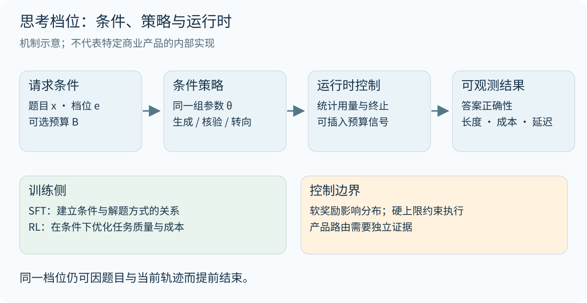
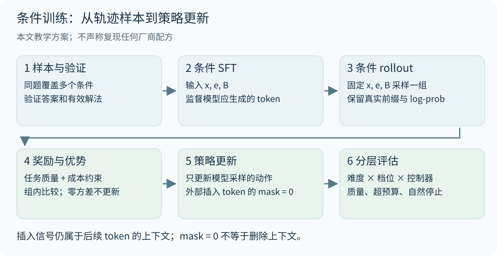
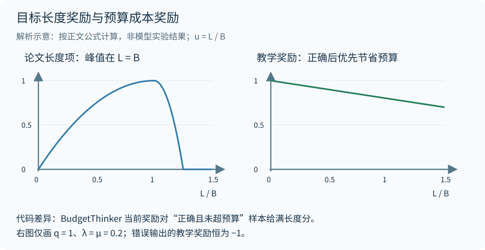

大模型的 `low / medium / high` 思考档位，可以通过同一组参数上的条件策略实现：模型读到档位或预算信号后，改变解题路径、核验方式和结束时机。训练决定这种条件是否有用，推理服务决定预算怎样执行。理解其机制，需要同时检查输入协议、训练目标和解码过程。

本文将公开事实、数学抽象和教学设计分开。gpt-oss 提供档位接口与行为证据；BudgetThinker 展示预算控制的训练方法；s1 展示推理时干预；Qwen3 展示思考与直接回答能力的融合。它们可以解释设计空间，不能拼接成某个闭源产品的真实训练配方。

## 1. 思考档位控制的对象

记题目为 $x$、档位为 $e$、推理轨迹为 $\tau$、最终答案为 $a$。一个条件化自回归策略可写为：

$$
\pi_\theta(\tau,a\mid x,e)
=\prod_{t=1}^{T}\pi_\theta(y_t\mid x,e,y_{\lt t}),
\qquad y=\tau\Vert a.
$$

参数 $\theta$ 不必改变。变化来自条件序列：档位文本经 tokenizer 编码后参与后续预测。`Reasoning: high` 的语义依赖训练；把这句话加到任意模型上，并不能保证得到稳定的预算控制。

| 控制对象 | 实际作用 | 不能据此推出的结论 |
|---|---|---|
| 策略条件 $e$ | 改变条件输出分布 | high 对应独立 checkpoint |
| 预算 $B$ | 给出期望用量或上限 | 模型必然准确计数并遵守 |
| 输出上限 | 服务端限制生成量 | 思考与最终答案各自都得到足够空间 |
| 停止与续写规则 | 强制结束思考、插入提示或继续生成 | 所有控制效果都已写入参数 |
| 产品路由 | 选择模型、工具或执行路径 | 任意产品中的档位都只使用同一模型 |

{width="95%" fig-align="center"}

还要明确“成本”的计量口径。思考 token 数、总输出 token 数、串行解码步数、工具用时和端到端延迟并不相同。本文教学方案以模型生成的思考 token 数 $L$ 作为成本代理，另行记录答案长度；gpt-oss 的相关图表使用 **CoT 与答案的总长度**。跨模型比较时，每 token 的计算量也未必一致。

## 2. gpt-oss：公开证据与披露边界

gpt-oss 模型卡 §2.5.2 明确说明：模型经过训练以支持三个档位，system prompt 中的档位指令控制这一行为，提高档位会增加平均 CoT 长度。§2.5 说明后训练采用与 o3 类似的 CoT RL 技术。[^oss-card]

{width="90%" fig-align="center"}

官方参考实现把 `--reasoning-effort` 映射到 Harmony 的 `SystemContent.with_reasoning_effort(...)`；checkpoint 加载与该系统消息的构造是分开的。这支持“同一模型通过输入条件切换档位”的解释，但没有公开各档训练样本、奖励权重或预算映射。[^oss-code]

{width="95%" fig-align="center"}

图中是指定评测设置下的聚合结果。它不能证明每一道题都因增加 token 而改善，也不能隔离“多算一些”与“换一种条件策略”的因果贡献。若要隔离两者，需要固定模型和题目，同时控制实际计算量，再比较档位。

官方发布说明还提到 SFT 和高计算量 RL；这些信息不足以还原逐阶段的档位训练顺序。[^oss-release] API 文档则说明档位取值依赖模型，且同一档位仍会随任务调整推理量。接口行为可以核验，内部预算函数并未随之公开。[^api]

因此，`low = 512`、`medium = 2048`、`high = 8192` 只能在自行设计的实验中作为配置示例。它们不是 gpt-oss 或 OpenAI API 的官方映射。

## 3. 条件 SFT：让预算信号获得行为含义

### 3.1 样本与监督目标

教学上可把样本组织为 $D=\{(x,e,B,\tau,a)\}$，其中 $B$ 可选。档位表达相对投入，数字预算表达明确约束；实现时应说明二者关系，避免发送互相冲突的信号。

$$
\mathcal L_{\mathrm{SFT}}
=-\mathbb E_{D}\left[
\frac{1}{\sum_t m_t}
\sum_t m_t\log\pi_\theta(y_t\mid x,e,B,y_{\lt t})
\right].
$$

这里选择按样本内有效 token 数归一化，避免仅因轨迹长就获得更大的样本总权重。$m_t$ 标识监督位置：题目和条件作为上下文；目标解题文本和答案参与监督。外部注入的控制信号是否参与 SFT 预测损失，需要显式选择。本文方案将其排除；这不是所有公开实现的统一规定。

一个重要的数据问题是条件混淆。如果 low 数据全是简单题、high 数据全是难题，模型可能主要依赖题目难度，忽略档位。为同一题保留多种经过验证的解法，再跨档位覆盖难度分布，更有利于学习条件的作用。它不要求为每道题机械生成三份文本。

### 3.2 同一道题的训练样例

以下内容是人工编写的教学样例，展示条件与解题方式的关系，不是模型运行记录，也没有声称恰好占用某个 token 数。

| 题目：计算 $\int_0^1 x e^x\,dx$ | 条件 low | 条件 high |
|---|---|---|
| 解题文本 | 分部积分得原函数 $(x-1)e^x$，代入上下限得 $1$ | 取 $u=x$、$dv=e^x dx$，求出原函数；对 $(x-1)e^x$ 求导验证得到 $xe^x$；代入端点，检查结果为正 |
| 最终答案 | $1$ | $1$ |
| 监督意图 | 保留充分且简洁的求解步骤 | 允许在必要时增加独立核验 |

high 样本中的核验有具体对象：原函数与边界值。不要为了增加长度而虚构一次错误的换元尝试，或强制插入回溯句式。短解若已充分成立，也应允许在高档提前结束。对于 $2+2$ 这样的题目，所有档位都可以短答；档位应改变可用策略与投入倾向，而非给每题规定最低篇幅。

SFT 能建立这种行为关系，却不保证训练后的模型会在分布外预算下稳定停止，也不保证更长轨迹带来正确性收益。接下来的 RL 要回答：在给定条件下，哪些生成行为值得保留？

## 4. RL：在任务质量与计算成本之间优化

### 4.1 约束目标与成本价格

一个有用的数学抽象是，对每个档位约束期望成本：

$$
\max_\theta\ \mathbb E[R_{\mathrm{task}}]
\quad\text{subject to}\quad
\mathbb E[C(\tau)\mid e]\le B_e.
$$

其拉格朗日形式为：

$$
\mathcal J(\theta,\lambda)
=\mathbb E[R_{\mathrm{task}}]
-\sum_e p(e)\lambda_e
\left(\mathbb E[C(\tau)\mid e]-B_e\right),
\qquad \lambda_e\ge0.
$$

固定 $\lambda_e$ 更新策略时，$\lambda_e B_e$ 不影响策略梯度，于是可以使用 $R_{\mathrm{task}}-\lambda_e C(\tau)$。若还要更新对偶变量以追踪预算，$B_e$ 项不能丢掉。神经网络优化不保证找到满足约束的全局解，期望成本约束也不保证每次请求都不超限。

设置 $\lambda_{\mathrm{low}}\gt\lambda_{\mathrm{medium}}\gt\lambda_{\mathrm{high}}$ 是一种教学设计：低档对成本更敏感。这个排序并非从档位名称必然推出，也没有证据表明厂商恰好采用该损失。预算条件、训练数据和运行时控制都可能形成相似的可观测行为。

粗略写成 $R=R_{\mathrm{correct}}+\alpha R_{\mathrm{reason}}+\beta R_{\mathrm{budget}}-\lambda R_{\mathrm{cost}}$ 只能提供设计清单。每一项都需要可操作定义，尤其不能把“出现反思语句”当作推理质量。OpenAI 的 o1 报告描述了 RL 后的问题分解、纠错与尝试不同方法，但没有证明必须直接奖励这些表面行为。[^o1]

### 4.2 按条件分组的 GRPO

本文方案固定 $(x,e,B)$，从 rollout 策略采样 $G$ 条轨迹。使用组内标准化优势：

$$
A_i=\frac{R_i-\overline R}{s_R+\epsilon},
\qquad
\overline R=\frac1G\sum_{j=1}^{G}R_j.
$$

不同档位的奖励尺度和允许成本可能不同。先在相同条件内比较，再混合多个组更新，可以避免把“预算更宽松”误当作“轨迹更优”。所有奖励相同的组没有相对学习信号；本文方案跳过这类组，并记录比例。原始 GRPO 的组相对更新见 DeepSeekMath。[^grpo]

令 $h_{i,t}$ 包含真实题目、条件、生成历史及已插入的控制信号，$m_{i,t}$ 只标识模型采样的动作，则一个带 KL 正则的教学目标是：

$$
\begin{aligned}
\rho_{i,t}(\theta)
&=\frac{\pi_\theta(y_{i,t}\mid h_{i,t})}
{\pi_{\mathrm{old}}(y_{i,t}\mid h_{i,t})},\\
\mathcal J_{\mathrm{clip}}
&=\frac1G\sum_{i=1}^{G}\frac1{M_i}\sum_t m_{i,t}
\left[
\min\left(\rho_{i,t}A_i,
\mathrm{clip}(\rho_{i,t},1-\eta,1+\eta)A_i\right)
-\beta D_{i,t}
\right],\\
M_i&=\sum_t m_{i,t}.
\end{aligned}
$$

这里 $D_{i,t}$ 表示当前策略对参考策略的 KL 项或其明确选定的估计量，$\eta$ 为裁剪幅度，$\beta$ 为正则系数。这是便于解释的目标，不是对某个训练框架默认实现的承诺。按轨迹平均还会影响长短轨迹的权重，应作为实验配置记录。

**外部插入的预算提示不能直接当作策略采样动作。** 它们保留在 attention 上下文中，但本文方案将相应 policy-loss mask 设为零。后续生成 token 的 log probability 必须基于包含这些提示的真实前缀计算。若解码器还屏蔽停止 token 或改变采样分布，就必须匹配实际行为分布及相应校正；仅增加一个 mask 并不足以修复任意离策略偏差。

{width="95%" fig-align="center"}

## 5. 公开方法：训练、控制信号与运行时干预

### 5.1 BudgetThinker 的论文目标与代码差异

BudgetThinker 周期性插入表示预算进度的特殊 token。其 SFT 按 $B=T\lceil |y|/T\rceil$ 分配预算，混合长短解题数据；随后用 GRPO 训练。论文设置 $K=8$、$T=50$，预算课程为 $6000\rightarrow4000\rightarrow3000\rightarrow2000$，最后混合这些预算。[^budget]

{width="95%" fig-align="center"}

将论文中的长度记为 $L=|y|$，奖励可整理为：

$$
\begin{aligned}
R_{\mathrm{paper}}&=0.7q+0.15f+0.15r_{\mathrm{len}},\\
r_{\mathrm{len}}(L,B)&=\max\left(1-\gamma\left(\frac{B-L}{B}\right)^2,0\right),\\
\gamma&=\begin{cases}1,&L\le B,\\16,&L\gt B.\end{cases}
\end{aligned}
$$

$q$ 和 $f$ 分别代表正确性与格式检查。由公式直接计算，$L/B$ 为 $0.5,1,1.25$ 时，长度项分别为 $0.75,1,0$。固定其他项，奖励在 $L=B$ 达到峰值。因此，单看这个长度项，它会奖励预算内的短输出继续接近目标长度；这与“只要做对就尽早停止”并不相同。这个判断来自目标函数，不是声称已经观察到模型灌水。

代码需要单独核对。官方仓库提交 `481da904` 的 `reason_with_in_limit_compute_score` 对**正确且未超预算**的结果，把长度奖励直接设为 $1$；其辅助函数在 $B\lt1500$ 时，也对欠预算分支使用系数 $16$。[^budget-code] 因而不能用论文曲线概括该提交所有分支，也不能把当前代码差异倒推成论文实验实际采用的配方。

{width="95%" fig-align="center"}

另一个评测边界是：论文评估会在预算处截断推理并引导输出答案，再给答案分配额外 50 tokens。[^budget] 因此报告表现包含模型与运行时的共同作用。自然停止、强制终止和最终答案完整性应分别统计，不能用硬截断后的长度证明模型独立学会了预算遵循。

### 5.2 s1：解码时延长或终止思考

s1 先做 SFT，再通过 budget forcing 调整推理长度：达到上限时结束思考；尝试提前结束时可抑制结束分隔符并追加 `Wait`。其公开方法不要求新增预算 RL 阶段。论文报告 s1-32B 在 AIME24 上由无干预的 50% 提升到预算扩展后的 57%；这属于特定模型和评测设置，不是任意延长推理的收益保证。[^s1]

{width="80%" fig-align="center"}

这个例子能说明运行时如何改变轨迹，却不足以把一次自我修正推广为普遍能力。“在 token 空间中搜索”是对串行推理的行为描述，不意味着实现了显式搜索树、独立分支或树搜索算法。并行采样多个答案再投票，则是另一种计算分配方式，应与单轨迹延长分开比较。

### 5.3 Qwen3：融合思考与直接回答

Qwen3 的公开后训练流程包括长 CoT 冷启动、推理 RL、Thinking Mode Fusion 和通用 RL。模式融合阶段使用长 CoT 与普通指令数据，使同一模型同时支持思考和直接回答。[^qwen] 这一证据说明模式切换也需要行为训练；它没有证明任意连续预算都已被精确学会。

| 方法 | 公开的主要机制 | 适合支持的结论 |
|---|---|---|
| gpt-oss | system prompt 档位与可变推理训练 | 同一模型可对档位条件产生稳定行为差异 |
| BudgetThinker | 进度 token、SFT、GRPO、预算课程及推理截断 | 预算意识可以联合训练与运行时实现 |
| s1 | SFT 与 budget forcing | 推理时控制也能改变计算量及部分任务表现 |
| Qwen3 | 思考能力训练与模式融合 | 直接回答与长推理可以融合到同一模型 |

把预算作为条件，与 Decision Transformer 中的目标回报条件在“用额外信号选择行为”这一层有相似性；但预算是资源约束，return-to-go 是目标回报。二者的训练数据、目标与决策过程不同，这个类比不能充当算法等价证明。[^dt]

## 6. 一个可检查的教学训练方案

### 6.1 数据、预算与奖励

以下方案用于串起机制，尚未进行模型训练。选择已经具备基本推理能力的开源模型，固定 tokenizer 和模板，只使用可自动验证的数学或代码任务。训练、验证、测试按题目划分，确保同题不同档位不跨集合。

每条样本记录 `problem_id`、`question`、`effort`、`budget`、`reasoning`、`answer` 和验证结果。rollout 还需保存精确 token 序列、外部插入位置、行为策略 log-probability、有效动作 mask、结束原因和分项奖励。这些是教学记录字段，不是本仓库新增 API。

可以把三个档位映射到 $B_e\in\{512,2048,8192\}$ 作为起始实验，并让训练题同时覆盖多个档位。短预算下找不到正确解的题，不应伪造一条短解作为 SFT 标签；可保留为 RL 或评测中的困难样本。混合预算训练用于减少条件遗忘，具体比例需要通过验证集选择。

为避免奖励纯粹堆长或纯粹压短，本文教学奖励先确保正确结果优于错误结果，再对正确结果计算有界成本。令 $u=L/B_e$：

$$
R_{\mathrm{teach}}
=q\left[1-\lambda_e\min(u,1)
-\mu\min\bigl(\max(u-1,0),1\bigr)\right]-(1-q).
$$

取 $\lambda_e\in\{0.20,0.10,0.05\}$，依次对应 low、medium、high，取 $\mu=0.20$。最终答案未完成或验证失败时 $q=0$，奖励为 $-1$；正确时奖励至少为 $0.6$。这样不会因节省 token 而让一个错误答案在标量奖励上胜过正确答案，但所有输出都错的组也没有相对信号，需要更合适的数据课程或推理起点。

例如 low 档下，正确轨迹在 $u=0.5,1,1.25$ 时分别得到 $0.9,0.8,0.75$。这是人为选择的偏好，并非最优超参数。这里还省略了答案生成成本：若模型把思考搬到最终答案中，$L$ 会下降而总成本未必下降，因此必须同时监测总输出长度和答案格式。

### 6.2 采样、评分与更新

下面的伪代码选择 temperature 为 1、无 top-k/top-p 截断的全分布采样，减少行为概率与训练概率的口径歧义。每组固定条件，采样 $G=8$ 条；使用 SFT checkpoint 作为参考策略。裁剪幅度 $0.2$、KL 系数 $0.01$ 都只是教学起点。

```text
for batch of problems:
    groups = []
    for problem in batch:
        effort = sample_one_of(low, medium, high)
        B = budget_for(effort)
        trajectories = sample_group(
            old_policy, problem, effort, B, G = 8,
            temperature = 1, top_p = 1,
            thinking_safety_cap = 2 * B, answer_cap = 256
        )
        # 保留注入信号的上下文 / Keep injected cues in context.
        # 外部信号与强制分隔符不作为动作 / Exclude forced tokens from policy loss.
        for trajectory in trajectories:
            q = verify_completed_final_answer(trajectory)
            L = count_model_generated_thinking_tokens(trajectory)
            reward = teaching_reward(q, L, B, effort)
            record_tokens_masks_logprobs_and_stop_reason(trajectory, reward)
        if reward_std(trajectories) <= 1e-8:
            record_zero_variance_group()
            continue
        groups.append(normalize_advantages_within_group(trajectories))
    if groups:
        update_clipped_policy(groups, reference = sft_policy,
                              clip = 0.2, kl_coef = 0.01)
    refresh_rollout_policy_after_update()
```

这里的 $2B$ 是训练安全上限，给超过目标预算的轨迹留下可评分空间；它不是要求用满 $2B$。达到安全上限后，用模型适用的协议切到 final，并留出答案空间。硬切换 token 被标记为外部事件。控制 token 如果来自新词表，必须同步 tokenizer、embedding 与解码器；只在正文里写一个标签不构成完整实现。

对于自适应停止，可以用 $p_\theta(\mathrm{stop}\mid h_t,e,B)$ 表示在当前位置进入答案阶段的概率。它可能由现有分隔符生成行为实现，不要求另加一个停止网络。“继续计算的预期收益高于成本时继续”是决策解释；本文没有把它当作已经测得的内部价值估计。

### 6.3 区分控制效果与训练收益

| 评测问题 | 固定或分层条件 | 报告指标 |
|---|---|---|
| 档位是否真正被使用 | 同一 checkpoint、同题跨档位，按难度分层 | pass@1、思考长度中位数与 P90、同题长度差异 |
| 模型是否自然遵循预算 | 目标预算提示，保留宽松安全上限，不在目标处强切 | 自然停止率、目标超预算率、安全截断率 |
| 硬预算下能否完成任务 | 相同思考上限、答案空间与停止规则 | 正确率、答案完整率、实际总输出量 |
| 增益来自哪一部分 | SFT、SFT+RL；进度提示开/关；强切开/关 | 准确率—实际成本曲线与置信区间 |
| 是否只优化 token 代理 | 同硬件、并发、缓存与工具设置 | 首个答案 token 延迟、总延迟 P50/P95、工具用时 |

优先在训练未见的题目与中间预算上评估，再检查极紧和极宽预算；不要只报告训练档位。所有曲线使用实际消耗作为横轴，不能把请求预算当作已经消耗的计算量。高档在简单题上仍能短答是合理结果；高档在某些题上退步，也应计入总体评测。

## 7. 常见解释的核验与结论

| 常见说法 | 更准确的技术表述 |
|---|---|
| high 就是换一套更强参数 | gpt-oss 支持同 checkpoint 的输入条件控制；产品路由另需证据 |
| high 等于多输出几千 token | 档位影响分布，预算与停止策略决定执行边界；更多文本可能无效 |
| low 是 exploit，high 是 search | 可作粗略行为类比，不能等同于两个已经确认的算法 |
| 档位一定靠 RL 训练 | SFT、RL 与推理时干预均可贡献控制，s1 提供了无新增预算 RL 的例子 |
| 每档必有固定 token 上限 | 示例预算不等于厂商配置；平均用量与逐请求上限不同 |
| RL 一定奖励反思、回溯语句 | 结果奖励也能支持这些行为；表面句式不等于有效核验 |
| 不直接对齐 CoT，所以没用任何轨迹监督 | 不能从监测与安全对齐语境中的说明推出整个训练过程没有 SFT |
| soft reward 能保证不超预算 | 软目标影响分布；逐请求硬约束仍需运行时执行 |

最后一处容易误读的证据来自 gpt-oss 模型卡 §4.4：作者在 CoT 可监测性的讨论中说明没有对 CoT 施加直接优化压力。该段没有给出完整的监督信号清单，不能据此推断不存在轨迹学习，或断言所有纠错行为都只由最终奖励产生。[^oss-card] DeepSeek-R1 也区分了直接 RL 的 R1-Zero 与包含冷启动数据的 R1 路线，进一步说明不能把一个模型的训练路径推广到所有推理模型。[^r1]

我更关心的验收标准是：在相同题目与可比的实际成本下，模型能否根据条件改变求解方式，保住正确率，并在任务完成后及时结束。能把输出变长只是控制的一部分。条件信号、有效训练反馈和可靠的运行时边界共同决定档位是否有用；公开资料足以解释这些机制，还不足以还原任何闭源产品的完整配方。

## 参考资料

[^oss-card]: OpenAI. [gpt-oss-120b & gpt-oss-20b Model Card](https://cdn.openai.com/pdf/419b6906-9da6-406c-a19d-1bb078ac7637/oai_gpt-oss_model_card.pdf). 2025-08-05 发布版；§2.5、§2.5.2、Figure 3、§4.4。
[^oss-code]: OpenAI. [gpt_oss/chat.py](https://github.com/openai/gpt-oss/blob/7b583341fe16729127f6d5b94a7b09ccae97e1a1/gpt_oss/chat.py#L79-L85). 提交 `7b583341`；档位映射见同文件 `REASONING_EFFORT`。
[^oss-release]: OpenAI. [Introducing gpt-oss](https://openai.com/index/introducing-gpt-oss/). 2025-08-05。
[^api]: OpenAI. [Reasoning models](https://developers.openai.com/api/docs/guides/reasoning). 接口文档，核对日期 2026-09-24；不据此推断内部训练配方。
[^o1]: OpenAI. [Learning to reason with LLMs](https://openai.com/index/learning-to-reason-with-llms/). 2024-09-12。
[^grpo]: Shao et al. [DeepSeekMath: Pushing the Limits of Mathematical Reasoning in Open Language Models](https://arxiv.org/abs/2402.03300). GRPO 的原始方法来源。
[^budget]: Wen et al. [BudgetThinker: Empowering Budget-aware LLM Reasoning with Control Tokens](https://arxiv.org/abs/2508.17196v2). 2025-08-29，v2；§2–3、Figure 1。本文统一记号，不复写原文公式中的重复等号。
[^budget-code]: MobileLLM. [reason_with_in_limit.py](https://github.com/MobileLLM/BudgetThinker/blob/481da9045f761ba34899271db846d659110b7065/easyr1/verl/utils/reward_score/reason_with_in_limit.py#L36-L65). 提交 `481da904`；属于静态代码核验，未复跑作者训练。
[^s1]: Muennighoff et al. [s1: Simple test-time scaling](https://arxiv.org/abs/2501.19393v3). 2025-03-01，v3；§3.1、Figure 3。本文使用 s1-32B 的相关结果，不与 s1.1 混用。
[^qwen]: Qwen Team. [Qwen3: Think Deeper, Act Faster](https://qwenlm.github.io/blog/qwen3/). 2025-04-29；Post-training。
[^dt]: Chen et al. [Decision Transformer: Reinforcement Learning via Sequence Modeling](https://arxiv.org/abs/2106.01345). 预算条件与目标回报条件仅作概念比较。
[^r1]: DeepSeek-AI. [DeepSeek-R1: Incentivizing Reasoning Capability in LLMs via Reinforcement Learning](https://arxiv.org/abs/2501.12948). R1-Zero 与 R1 的训练路径。
