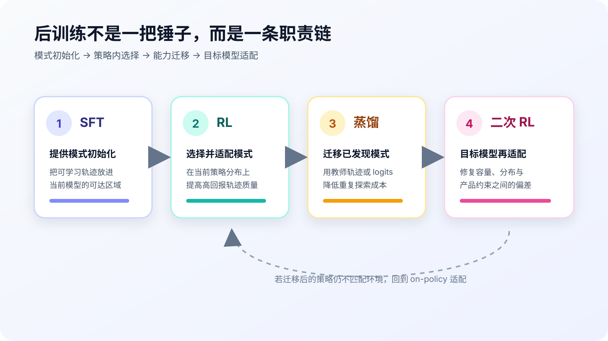
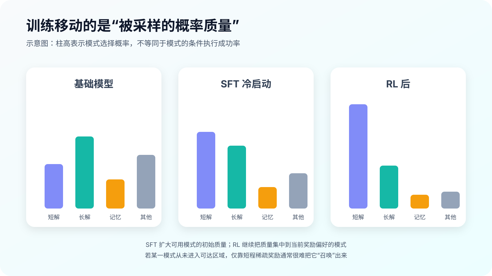
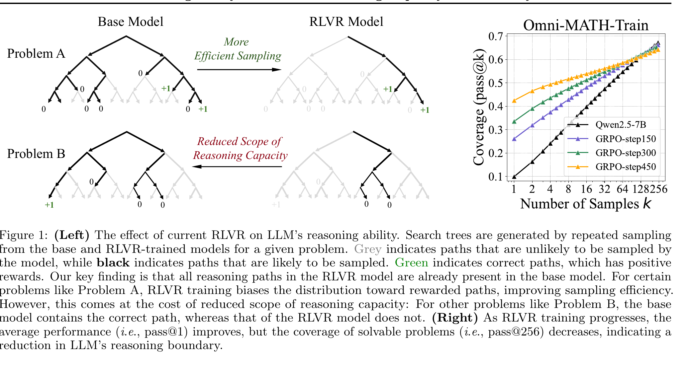
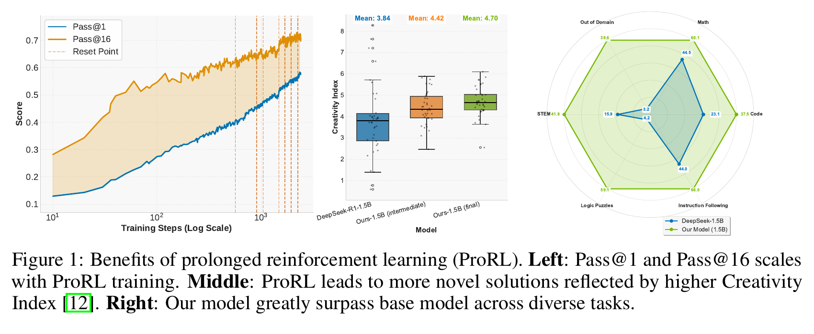
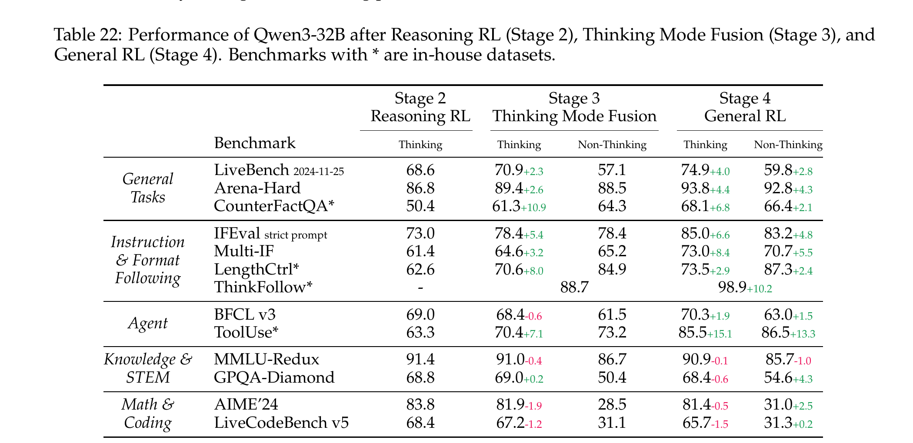
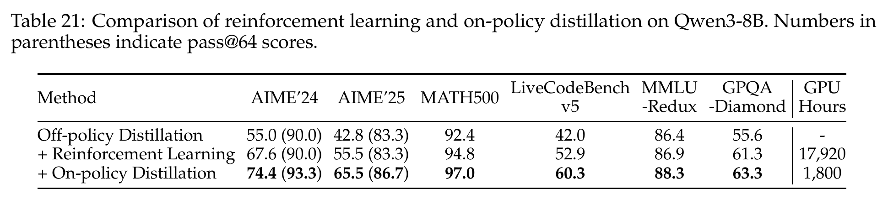
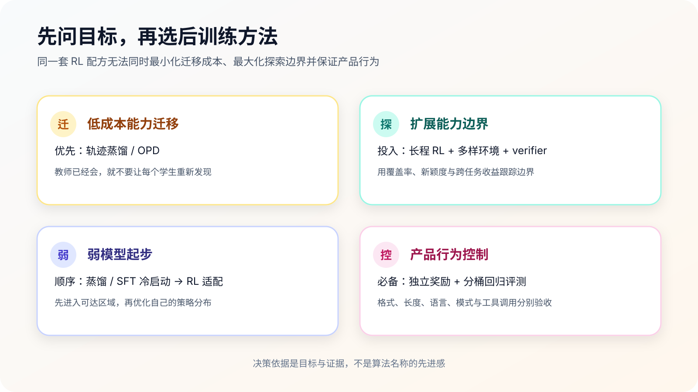

::: {.callout-note title="写作说明"}
这篇笔记受到 [ybq 关于“为什么 RL 很重要”的讨论](https://zhuanlan.zhihu.com/p/2067725096886785009)启发。下面保留其中值得追问的工程判断，但重新组织论证，并补入论文证据与反例；它不是对原文的转述。
:::

讨论 RL 时，一个常见分歧是：它究竟让模型学会了新的推理，还是只让模型更容易采样到原本就会的答案？如果把“能力”当成一个不可再分的标量，这个问题很难说清。更有用的拆法，是区分四件事：某种推理模式是否存在、它被选中的概率、它能否稳定执行，以及我们能否按需控制它。

在这个框架里，SFT、RL 和蒸馏并不是三种互相替代的训练方案。SFT 主要负责把模式放进目标模型的可达区域；RL 在当前策略分布上选择、强化并适配这些模式；蒸馏把已经发现的高价值模式迁移给另一个模型；如果迁移后的策略与新模型或新环境不匹配，再用一轮 RL 做 on-policy 修正。

{#fig-role-map-zh fig-align="center" width="90%"}

这张图不是固定流水线。有时 SFT 已经足够，有时 RL 后直接部署，也有时没有可靠教师可供蒸馏。它表达的是职责边界，而不是每个项目都必须走完的阶段数。

## 先把“推理模式”说清楚

考虑一个故意简单的题目：$997 \times 1003$。模型可能给出三类正确轨迹。

1. **短而可泛化**：识别 $(1000-3)(1000+3)=1000^2-3^2$，得到 $999991$。
2. **冗长但可执行**：按竖式或逐项展开完成乘法。步骤更多，却仍是一套能迁移到其他整数乘法的程序。
3. **只记住答案**：题目或答案对曾出现在数据中，模型直接复现 $999991$，但无法解释相邻问题。

三条轨迹的最终 reward 都可能是 1，却对应不同的泛化价值。更麻烦的是，“短”也不天然比“长”高级：对一个容量足够、代数模式稳定的模型，第一条更合适；对一个容易在恒等式变形上出错的小模型，第二条的冗余反而可能提高条件成功率。训练真正要处理的，不只是答案正确，还包括**选择哪一类模式，以及该模型能否把它执行完**。

## 一个可讨论的简化模型

令 $\mathcal{R}(x)$ 表示输入 $x$ 上可达的推理模式集合，$\pi_{\theta}(r\mid x)$ 表示当前策略选择模式 $r$ 的概率，$c_{\theta}(r,x)$ 表示已经选中该模式后执行成功的概率。于是：

$$
P_{\theta}(\mathrm{success}\mid x)
=
\sum_{r \in \mathcal{R}(x)}
\pi_{\theta}(r\mid x)\,c_{\theta}(r,x)
$$

这不是对 Transformer 内部机制的精确分解，而是一把分析用的刀。它至少把两个经常混在一起的量分开了：

- **模式被采样的概率** $\pi_{\theta}$：模型是否会走到某条解法上。
- **模式执行成功率** $c_{\theta}$：走到这条路以后，模型能否稳定走完。

SFT 用逐 token 监督增加示范轨迹附近的概率质量，同时也可能改善局部执行。RL 从当前策略采样，再按 reward 改变概率质量；足够长、足够多样的训练也可能提高某些模式的执行质量。蒸馏则借助教师，把学生原本很少访问的轨迹或更密集的 logit 偏好带进训练。三者都能改变最终准确率，但作用位置并不相同。

## SFT 初始化，RL 在当前分布上选择

把 SFT 叫作“冷启动”，并不意味着它只负责格式。更关键的作用，是让任务所需的模式在当前模型中变得可采样。对于强底座，少量示范可能只是在若干已有模式之间改权重；对于弱底座，同样的数据还承担了建立执行脚手架的任务。

[《Reshaping Reasoning in LLMs》](https://arxiv.org/abs/2506.04695)把 RL 动态解释为模式选择：不同推理模式的条件成功率相对稳定，训练主要通过少数关键 token 重排模式概率；底座质量又会影响收敛速度，SFT 初始化能够缓解弱模型的慢收敛。这项研究支持“RL 很大一部分收益来自分布重排”，但它不是所有任务和训练尺度的普遍定理。

{#fig-pattern-mass-zh fig-align="center" width="90%"}

这里还有一个容易被统一数据配方掩盖的问题：**最适合教师的轨迹，不一定最适合学生。** 大模型可以把若干步骤压进一次可靠跳跃，小模型可能需要显式中间状态；反过来，把教师的所有冗长自检原样塞给学生，也会浪费容量并增加误差机会。因此，弱模型通常更适合“高质量蒸馏或 SFT 冷启动 → RL 适配”，而不是直接从稀疏 reward 开始搜索，也不是永远停在教师轨迹上。

## RL 是否创造新能力：证据并不只指向一边

[《Does Reinforcement Learning Really Incentivize Reasoning Capacity in LLMs Beyond the Base Model?》](https://arxiv.org/abs/2504.13837)给出了一个尖锐结果：在其数学 RLVR 设置中，训练提高了 pass@1，却可能降低大采样数下的 pass@k。也就是说，正确路径更容易被采到，但基础模型原本覆盖的一些路径从策略分布中退了出去。论文据此把常规 RLVR 描述为提高采样效率、同时收缩推理覆盖范围。

{#fig-rlvr-boundary fig-align="center" width="90%"}

*来源：[能力边界研究，Figure 1](https://arxiv.org/abs/2504.13837)。*

但 [ProRL](https://arxiv.org/abs/2505.24864)给出了另一组证据。它延长 RL 训练，混合数学、代码、逻辑谜题、STEM 和指令遵循等可验证任务，并通过 KL 控制与 reference policy 重置维持探索。论文报告 pass@1 与 pass@16 随训练继续上升、解法新颖度提高，并出现跨任务收益。

{#fig-prorl fig-align="center" width="90%"}

*来源：[ProRL，Figure 1](https://arxiv.org/abs/2505.24864)。*

两篇论文并不构成简单的“谁推翻谁”。它们改变的训练时长、任务多样性、探索机制和评测口径都不同。更稳妥的结论是：**常规短程 RLVR 的多数可观测收益来自已有模式的分布重排；更长训练、更多样任务或可交互环境，可能扩大当前模型的可达边界。** “可能”很重要。要证明边界真的扩展，不能只看 greedy accuracy，还要同时看大 $k$ 覆盖率、解法新颖度、迁移任务和训练前基线是否已能偶然采到同类轨迹。

## RL 也在训练行为控制

把 RL 只理解成数学正确率优化，会漏掉它在产品模型中的另一项工作：控制输出格式、语言、长度、思考模式和工具调用。这些目标通常不是提示词或上下文窗口技巧能够稳定解决的，因为模型要在大量冲突请求上形成一致策略。

[Qwen3 Technical Report](https://arxiv.org/abs/2505.09388)的 Table 22 很有代表性。Stage 3 通过 thinking mode fusion 把思考与非思考模式放入同一模型，Stage 4 再用 general RL 校准通用行为。相较 Stage 2，Stage 4 的 thinking 模式 IFEval strict prompt 从 73.0 升至 85.0，ToolUse 从 63.3 升至 85.5；非思考模式的 LengthCtrl 达到 87.3，ThinkFollow 从 Stage 3 的 88.7 升到 98.9。

{#fig-qwen3-control fig-align="center" width="88%"}

*来源：[Qwen3 Technical Report，Table 22](https://arxiv.org/abs/2505.09388)。*

这里不能只挑上升项。表中 thinking 模式的 AIME'24 从 83.8 降到 81.4，LiveCodeBench v5 从 68.4 降到 65.7。控制能力变好不等于所有能力免费变好。合理的工程做法，是为格式、语言、长度、思考开关和工具调用分别定义奖励与分桶回归评测，再监控数学、代码、知识等保留集；只盯一个综合分数，很容易把能力交换误写成全面提升。

## 蒸馏迁移已经发现的模式

如果强模型已经稳定掌握一类行为，让每个小模型再用 RL 从头探索，通常不是最省算力的方案。常见迁移方式有三种：

- **Rejection-sampling SFT**：生成候选轨迹，用 verifier 过滤后做硬标签训练。便宜、稳定，但保留下来的仍是离线轨迹。
- **轨迹蒸馏**：直接学习强教师的完整推理过程。它能导入学生很少采到的模式，却可能受到教师—学生容量差异和分布错位影响。
- **On-policy distillation（OPD）**：学生从当前策略生成轨迹，教师在这些状态上提供逐 token 分布。它兼顾 on-policy 状态与密集监督，但需要教师 forward，并依赖教师质量。

[DeepSeek-R1](https://arxiv.org/abs/2501.12948)的直接对比显示，把 R1 轨迹蒸馏到 Qwen 32B，效果显著强于在同一 Qwen 32B 基座上直接做 RL；报告也把纯 RL 的语言混杂和可读性问题，作为加入 cold start 与多阶段训练的理由。Qwen3 则进一步比较了直接 RL 与 OPD：在 8B 模型上，OPD 不仅各项分数更高，报告的训练成本还是 1,800 GPU hours，对应直接 RL 的 17,920 GPU hours。

{#fig-qwen3-opd fig-align="center" width="88%"}

*来源：[Qwen3 Technical Report，Table 21](https://arxiv.org/abs/2505.09388)。括号内为 pass@64。*

这不等于“蒸馏永远胜过 RL”。表格比较的是已有强教师时的能力迁移成本，而不是谁负责第一次发现教师尚不会的策略。更合适的职责划分是：**探索者用 RL、环境和 verifier 打开边界；跟随者用蒸馏降低迁移成本；学生再用小规模 RL 适配自身分布。** 关于 OPD 的目标函数、reverse KL 与多教师整合，可以继续读仓库里的 [《OPD：后训练中的能力整合接口》](../opd/post-training-opd.qmd)，这里不重复推导。

## 我所说的“软蒸馏”

我会把一种更宽泛的工程现象叫作“软蒸馏”：团队不一定复制教师 logits 或完整轨迹，但会用更强的外部模型合成边界样本、聚类失败案例、起草 verifier、审查 reward loophole，甚至帮助拆分 agent 工作流。这个说法不是知识蒸馏论文中的严格术语，只是对研发信息流的概括。

我的经验判断是，只要外部模型在目标能力上明显领先，这种软蒸馏就很难完全避免。它带来的价值也不只是“更多答案”，而是更快知道应该采什么数据、奖励哪里会被钻空子、当前模型缺的到底是模式还是执行稳定性。若要把这类收益写进技术报告，应明确记录教师版本、提示词、筛选规则、人工介入比例和污染检查；否则它只能算工程经验，不能算公开对照实验。

容量差异同样需要进入配方。我会用一个故意粗糙的数量示意来提醒团队：同一项 agent 任务，假设 1T 级 policy 用 2 个 sub-agent 就能稳定完成，100B 级 policy 可能需要 5 个，把规划、检索、执行和校验拆得更细。这里的 1T、100B、2 和 5 都不是公开实验统计，更不是缩放定律；它们只说明**更弱的 policy 往往需要更显式的状态与更细的分工**。同理，给大模型最优的短轨迹，未必足以训练小模型；给小模型准备的长脚手架，也未必值得留在大模型的最终策略里。

## 一个更实用的决策框架

{#fig-decision-zh fig-align="center" width="90%"}

落到项目决策，我会按目标而不是算法名选择路径：

1. **目标是低成本能力迁移**：优先轨迹蒸馏或 OPD，并用少量 on-policy 数据检查分布错位。
2. **目标是推高能力边界**：投入更长 RL、更多样或交互式环境和更可靠的 verifier；评测必须覆盖大 $k$、新颖度与迁移。
3. **目标模型明显偏弱**：先用蒸馏或 SFT 建立可达模式，再用 RL 适配它自己的容量和错误分布。
4. **目标是产品行为控制**：为格式、语言、长度、思考模式和工具调用设置独立奖励与回归集，不把它们附会成“推理自然涌现”。

最后回到标题：RL 到底改变了什么？在大多数常规 RLVR 项目里，它首先改变的是**哪些模式会被采样，以及这些模式如何适配当前策略**；在足够长、足够多样、反馈足够好的环境中，它还可能扩展可达模式或提高执行能力。蒸馏负责把这些发现搬运出去，SFT 负责让弱模型先站到能继续优化的位置，而行为控制需要自己的一套奖励和验收标准。

把这些职责分开，比争论“RL 有没有创造智能”更有工程价值。真正需要回答的问题不是某个方法是否重要，而是：当前瓶颈在模式不存在、模式选不中、模式走不完，还是模式无法按需控制。

## 参考资料

- ybq，[《为什么 RL 很重要？》](https://zhuanlan.zhihu.com/p/2067725096886785009)
- Yue et al., [Reshaping Reasoning in LLMs: A Theoretical Analysis of RL Training Dynamics through Pattern Selection](https://arxiv.org/abs/2506.04695)
- Yue et al., [Does Reinforcement Learning Really Incentivize Reasoning Capacity in LLMs Beyond the Base Model?](https://arxiv.org/abs/2504.13837)
- Gao et al., [ProRL: Prolonged Reinforcement Learning Expands Reasoning Boundaries in Large Language Models](https://arxiv.org/abs/2505.24864)
- Qwen Team, [Qwen3 Technical Report](https://arxiv.org/abs/2505.09388)
- DeepSeek-AI, [DeepSeek-R1: Incentivizing Reasoning Capability in LLMs via Reinforcement Learning](https://arxiv.org/abs/2501.12948)
