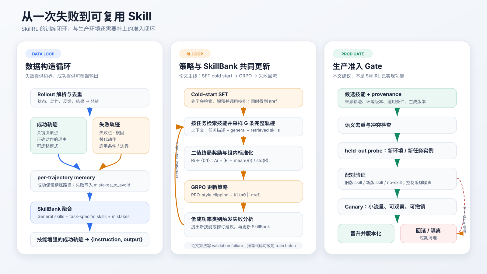

一次失败何时算作「学到了东西」？保留完整轨迹还不够。下一次任务不会逐 token 重演，原始日志里还混有重复探索、偶然动作和环境噪声。真正可复用的部分通常更短：错误发生在哪一步，错误判断是什么，应该改成什么动作，以及这条修正规则在哪些条件下成立。

[SkillRL](https://arxiv.org/abs/2602.08234) 试图把这段压缩过程接入训练。它先从成功和失败轨迹中蒸馏结构化经验，构造分层 SkillBank；再用 cold-start SFT 教模型如何调用技能；最后在 GRPO 期间分析新失败并更新技能库。本文只读这一条方法链，不扩展成 skill learning 综述。主线案例取自论文 Table 6 的 ALFWorld 失败类型 `Skipping State Changes`：agent 看见目标物体后直接放置，却漏掉了清洗、加热或冷却这类状态前置条件。

::: {.callout-warning title="证据边界"}
本文区分三类陈述：论文报告、官方仓库事实和本文工程建议。论文与代码并不完全一致；Table 5 的技能示例和 Table 6 的失败类型也没有逐条 provenance，因此不能声称某个 `gen_005` 就是由 `err_006` 那条失败直接生成。本文没有运行训练或复现实验，所有数值均来自论文。
:::

## 1. 为什么它属于 Agentic RL 的 Interaction Patterns

SkillRL 很容易被归到 Agent Memory：SkillBank 位于模型外部，需要检索并注入上下文。但这个分类只描述了存储位置，没有覆盖训练机制。SkillRL 训练的是一个在长时域环境中「读技能、做动作、接收结果、再更新技能库」的交互回路；策略和外部技能库都随轨迹变化。

在 [Awesome-Long-Horizon-Agents 的 taxonomy](https://github.com/RUC-NLPIR/Awesome-Long-Horizon-Agents/blob/a5c1d54549738aac6e4d728911752053f885718d/README.md#interaction-patterns) 中，SkillRL 位于 `Agentic Reinforcement Learning → Interaction Patterns`。这个位置比单独标成 memory 更准确，原因有两点：

- 技能不是静态提示词。训练策略 $\pi_\theta$ 必须学会在环境状态、任务描述和检索结果共同构成的上下文中选择动作。
- 失败写入外部库后，会改变后续 rollout 的条件分布；新策略又会访问旧策略未覆盖的状态，从而暴露下一轮技能缺口。

因此，SkillBank 是交互结构的一部分。把它只理解为「更短的 memory」会漏掉论文最关心的递归更新。

## 2. 贯穿案例：Skipping State Changes 究竟压缩了什么

把一条完整轨迹写成：

$$
\tau = (o_0,a_0,o_1,a_1,\ldots,o_T,a_T,R),
\qquad R \in \{0,1\},
$$

其中 $o_t$ 是环境观察，$a_t$ 是动作，$R$ 是完整任务的二值结果。对于失败轨迹 $\tau^-$，SkillRL 的教师模型要抽取四类信息：失败点、根因、替代动作和可泛化原则。为了强调适用边界，可以把这份失败摘要记成：

$$
\ell^-
=
f_M(\tau^-,d)
=
(t_{\mathrm{fail}},c_{\mathrm{root}},a_{\mathrm{alt}},\kappa_{\mathrm{scope}}),
$$

$d$ 是任务描述，$\kappa_{\mathrm{scope}}$ 表示修正规则成立的条件。

`Skipping State Changes` 的压缩结果可以按这四个字段理解：

| 字段 | 从失败轨迹中保留的内容 |
| --- | --- |
| 失败点 | 在目标状态尚未满足时执行 placement |
| 根因 | 将「物体已经出现」误判成「任务前置条件已经满足」 |
| 替代动作 | 放置前先核验 cleanliness / temperature；缺失时调用 clean / heat / cool 工具 |
| 适用条件 | 任务描述包含状态约束，或目标谓词要求清洁、热、冷等属性 |

这比「下次记得检查状态」更有用。失败点把诊断连回轨迹，根因说明错误不是随机动作，替代动作给出可执行修复，适用条件则防止所有 placement 任务都被强行插入清洗步骤。

Table 5 中最接近该失败的是 `Use State-Changing Tools Early`：取得物体后，在放置前调用合适的清洗、加热或冷却设备。两张表在语义上对应，但论文只说它们分别是 distilled skills 和 common failures 的示例，没有给出源轨迹 ID、生成批次或一对一链接。严谨的结论只能是：**该技能覆盖了这种失败模式**；不能写成「`err_006` 生成了 `gen_005`」。

## 3. 失败不是 SFT 的负例输出

论文 Figure 2 把方法概括为两层循环：上层从轨迹构造 memory 与 skills，下层以 SFT 模型为起点做 RL，并在训练中更新 SkillBank。

官方仓库在 2026 年 5 月补充了 SFT 数据生成代码。固定到提交 [`8e66726`](https://github.com/aiming-lab/SkillRL/commit/8e66726ed866a4e0a7f053586a41022798192e6c) 后，README 给出的流水线有四个阶段。

### 3.1 解析、去重与差异化 memory

第一阶段将 rollout 文本解析成状态、动作、奖励和终止标记；ALFWorld 与 WebShop 还会去掉重复循环。第二阶段为每条轨迹生成 memory，但成功和失败走不同字段：

- 成功轨迹生成 `refined_trajectory`。代码用 backward causal chaining 从最后一个成功动作向前找必要前置步骤，删除中间无因果贡献的动作；同时生成 `planning_pattern`，并把 `mistakes_to_avoid` 设为空。
- 失败轨迹不生成 `refined_trajectory`，`planning_pattern` 设为 `null`，主要产出抽象化的 `mistakes_to_avoid`，其中包含 `trigger_condition` 与 `bad_action`。

这段实现说明，失败数据没有直接变成「错误回答 → 正确标签」的负例。它先进入经验层，贡献错误模式和候选修正规则。

### 3.2 从 trajectory memory 聚合 SkillBank

聚合器只从成功 memory 的 `planning_pattern` 生成 general skills 和各类别的 task-specific skills；失败 memory 的 `mistakes_to_avoid` 则被去重、归纳成 `common_mistakes`。SkillBank 可写成：

$$
\mathcal S
=
\mathcal S_g
\cup
\bigcup_{k=1}^{K}\mathcal S_k,
$$

$\mathcal S_g$ 是跨任务通用技能，$\mathcal S_k$ 是类别 $k$ 的专用技能。仓库 JSON 还保存 `common_mistakes`。论文的每条 skill 包含 `title`、`principle` 和 `when_to_apply`；后一个字段正是防止错误迁移所需的触发条件。

### 3.3 蒸馏成功轨迹，最后展开成 SFT 样本

第三阶段只读取清洗后的成功轨迹，检索 SkillBank，并让 o3 为每一步补充 skill-aware reasoning。真实动作直接取自成功轨迹；ALFWorld 额外合成一个 `done` 终止回合。第四阶段把 ShareGPT 对话逐步展开为 Alpaca 风格的：

`{instruction, output}`

其中 `instruction` 包含任务、检索到的技能、最近观察和动作历史；`output` 是 `<think>...</think>` 与合法动作。失败在这里的作用是改写 instruction 里的 `Mistakes to Avoid` 和候选技能，而不是作为模型应模仿的 output。

## 4. 两个训练循环与一个工程 Gate

左栏是数据构造：原始 rollout 先压成 trajectory-local memory，再聚合为 SkillBank，最后只蒸馏带正确动作的成功轨迹。中栏是 RL：SFT 模型在技能上下文中采样完整轨迹，以终局奖励更新策略，低成功率类别再触发失败分析。右栏不是论文功能，而是本文建议的生产准入链；后文单独说明。

这三栏不能合并成一个「自动进化」箭头。数据构造解决训练样本如何形成；RL 解决策略如何利用技能；生产 Gate 解决新技能是否有资格影响线上动作。三个问题的验收标准不同。

## 5. Cold-start SFT：先学会用技能

直接把 SkillBank 塞进 base model 的 prompt，不保证模型会读取，更不保证它会在正确时刻应用。SkillRL 因此先让教师模型生成 skill-augmented 成功轨迹 $\mathcal D_{\mathrm{SFT}}$，再做交叉熵训练：

$$
\theta_{\mathrm{sft}}
=
\underset{\theta}{\arg\min}\;
\mathcal L_{\mathrm{CE}}(\mathcal D_{\mathrm{SFT}};\theta),
\qquad
\pi_{\mathrm{ref}} = \pi_{\theta_{\mathrm{sft}}}.
$$

这一步同时完成两件事：模型学会把 skill context 变成动作；得到后续 RL 的起始策略与 KL reference policy。Table 3 提供了直接证据：去掉 cold-start SFT 后，ALFWorld 从 89.9 降到 65.2，WebShop 从 72.7 降到 46.5，分别下降 24.7 和 26.2 个百分点。SkillBank 的内容本身不等于 skill utilization capability。

## 6. GRPO：奖励完整轨迹，而不是单独奖励某条技能

对同一任务 $d$，策略在 general skills 与 retrieved skills 的条件下采样 $G$ 条完整轨迹。每条轨迹只有成功或失败两种奖励：

$$
R_i = r(\tau^{(i)}) \in \{0,1\}.
$$

组内 advantage 为：

$$
A_i
=
\frac{
R_i-\mathrm{mean}(\{R_j\}_{j=1}^{G})
}{
\mathrm{std}(\{R_j\}_{j=1}^{G})
}.
$$

若同组内有成功也有失败，成功轨迹获得正 advantage，失败轨迹获得负 advantage；若整组奖励相同，组内相对信号会退化。SkillRL 没有给中间动作额外的过程奖励，也没有把某条 skill 的使用单独标成 credit。优化目标是带技能上下文的完整轨迹：

$$
J(\theta)
=
\mathbb E_{d,\{\tau^{(i)}\}_{i=1}^{G}}
\left[
\frac{1}{G}
\sum_{i=1}^{G}
\min\left(
\rho_i A_i,
\mathrm{clip}(\rho_i,1-\epsilon,1+\epsilon)A_i
\right)
-
\beta D_{\mathrm{KL}}(\pi_\theta\,\|\,\pi_{\mathrm{ref}})
\right],
$$

其中：

$$
\rho_i
=
\frac{
\pi_\theta(\tau^{(i)}\mid d,\mathcal S_g,\mathcal S_{\mathrm{ret}})
}{
\pi_{\mathrm{old}}(\tau^{(i)}\mid d,\mathcal S_g,\mathcal S_{\mathrm{ret}})
}.
$$

KL 项锚定 cold-start SFT reference。它的目的不是证明每条技能都正确，而是限制 RL 在追求成功率时把已经学到的技能使用方式迅速冲掉。

## 7. 论文算法与 `8e66726` 代码并不相同

论文 Algorithm 1 在 validation epoch 收集失败，并描述按类别分组、按失败严重程度排序、round-robin 采样；教师模型可以提出新技能，也可以修订旧技能。固定提交的代码保留了 validation 更新路径，但还提供了一个更稳妥的训练批次入口。

本文建议使用仓库的 `run_alfworld_skills_train_update.sh` 作为动态更新入口。该脚本设置 `update_skills_from_train=True`；对应函数明确说明它从当前训练 batch 抽取失败，以免 validation 信息进入训练循环。`8e66726` 这个提交本身修复的是 validation 路径的轨迹粒度错位：validation output 和 score 原先按 step 展开，input 却按 trajectory 保存，`zip` 后可能找不到实际存在的失败；修复后先按 `traj_uid` 去重再过滤。

更重要的是下面这些可核对差异：

| 问题 | 论文描述 | `8e66726` 代码行为 |
| --- | --- | --- |
| 更新数据源 | validation failures | 可选 validation；专用脚本改用 training batch，减少验证泄漏 |
| 失败采样 | 类别分组、严重程度优先、round-robin | 依输入顺序收集 `score <= 0`，最多保留前 10 条 |
| 实际送给教师的上下文 | Table 4 写最多分析 10 / 5 条 | collector 最多 10 条；prompt 只取前 5 条，每条只保留最后 5 步 |
| 单轮新增 | 最多 3 条 | `max_new_skills=3`，返回前 3 条 |
| 新技能位置 | general 与 task-specific 分层演化 | 动态生成结果统一以 `category='general'` 加入 |
| 修订旧技能 | 可 refine existing skills | prompt 只把旧标题用于避免重复；实现只追加新技能，不编辑旧条目 |

这张表不是在判断论文错、代码对。论文给出方法目标，仓库给出一个可运行版本；两者的能力边界必须分开。尤其是「递归演化」在当前代码里更接近受限追加，而不是完整的增删改版本管理。

## 8. 哪些环节有实验支持

### 8.1 Table 3：最强证据来自消融

Table 3 能支持四个较具体的判断：

| 移除项 | ALFWorld | WebShop | 能说明什么 |
| --- | ---: | ---: | --- |
| 完整 SkillRL | 89.9 | 72.7 | 参照值 |
| 分层结构 | 76.8 | 61.4 | general + task-specific 的组织方式有增益 |
| Skill Library，改用 raw trajectories | 61.7 | 50.2 | 在该设置下，抽象技能明显优于直接放回原始轨迹 |
| Cold-start SFT | 65.2 | 46.5 | 模型需要先学会使用技能 |
| Dynamic Evolution | 84.4 | 70.3 | 动态更新有增益，但幅度小于 SFT 和抽象表示 |

动态演化在 ALFWorld 上贡献 5.5 个百分点，在 WebShop 上贡献 2.4 个百分点。它有证据，但不是全部增益的来源。最大的下降来自把 SkillBank 换回 raw trajectories：ALFWorld 下降 28.2 个百分点，WebShop 下降 22.5 个百分点。

### 8.2 55 → 100 证明发生了增长，不证明每条新增技能有效

初始 SkillBank 有 55 条技能，其中 12 条 general、43 条 task-specific；到 step 150 增长为 100 条，论文给出的拆分是 20 条 general、80 条 task-specific。Figure 3 证明了更新机制确实持续写入技能库。它没有提供逐条 skill 的使用频率、边际收益或伤害率，因此不能从曲线推出「100 条都通过了验证」。数量增长是运行事实，不是质量证明。

### 8.3 Token 与收敛曲线支持的是两个不同结论

Figure 4 中 raw memory prompt 平均约 1,450 tokens，skills prompt 低于 1,300 tokens，论文报告约 10.3% 的上下文缩减。方法章节另有「skill distillation 相对 raw trajectories 达到 10–20× token compression」的陈述，两者口径不同：前者比较最终 prompt，后者比较蒸馏表示与原始轨迹，不能混成同一个数字。

Figure 5 中，带动态演化的曲线在约 60 个 training steps 后超过 80%，无演化版本到约 90 steps 才达到较低峰值。该图支持「动态更新提高了这次 ALFWorld 训练的收敛速度与上限」。它仍是单一设置下的 validation 曲线，没有置信区间，也不足以证明任意环境中的 SkillBank 更新都会单调改进。

## 9. 生产环境还需要一套 Skill 准入机制

SkillRL 当前代码收到教师模型输出后，做 ID 重排与字段检查，随后直接追加到 general skills。研究原型可以这样验证闭环；生产环境不应把一次失败摘要直接升级成长期规则。

本文建议把候选 skill 先保存为带 provenance 的版本对象，至少包含：

| 字段 | 用途 |
| --- | --- |
| `source_trajectory_ids` | 追溯结论来自哪些失败和成功样本 |
| `environment_version` | 防止界面、工具或规则变化后继续误用 |
| `scope` / `preconditions` | 限定触发条件和禁止场景 |
| `generator_version` | 记录教师模型、prompt 与代码提交 |
| `paired_metrics` | 保存 old-skill / new-skill / no-skill 的配对结果 |
| `rollback_target` / `expires_at` | 支持回滚与过期清理 |

接纳过程可以按图中的 Gate 执行：

1. 语义去重与冲突检查，拒绝只是换标题的重复技能。
2. 在 held-out task 与不同环境状态上做 probe，避免把单条轨迹的偶然性写成通用规则。
3. 固定模型、任务和采样种子，比较旧版、新版与 no-skill。若记新技能为 $s$，最基本的边际效用是：

$$
\Delta(s)
=
\mathbb E[R\mid \pi,\mathcal S\cup\{s\}]
-
\mathbb E[R\mid \pi,\mathcal S].
$$

4. 通过离线验证后只进入小流量 canary，监控成功率、步骤数、token、异常动作和回退次数。
5. 保留明确回滚点；环境版本变化或长期未命中时，把 skill 标记为 stale，而不是让库只增不减。

这套 Gate 是本文建议，不是 SkillRL 已实现功能。它补的是论文当前没有回答的问题：某条新技能何时可以影响真实用户任务，以及出现负迁移时如何定位和撤销。

## 结论

SkillRL 对「如何从失败学习」给出了一个具体答案：失败轨迹先被压缩成失败点、根因、替代动作和适用条件，随后进入 `mistakes_to_avoid` 与候选技能层；SFT 仍然蒸馏带正确动作的成功轨迹。模型先通过 cold-start SFT 学会使用技能，再由 GRPO 用完整轨迹的二值结果更新策略，KL 将策略锚定在 SFT reference；低成功率类别则暴露下一轮 SkillBank 缺口。

这条链中，证据最强的是 Table 3：技能抽象、分层组织和 cold-start SFT 都有明显消融代价；动态演化也有增益，但幅度较小。55 → 100、prompt token 和 validation 曲线说明系统确实在增长、压缩并加速收敛，却没有给每条技能提供 provenance 与独立效用证明。

所以，一次失败变成可复用 Skill 的终点不应是「LLM 生成了一段新原则」。更可靠的终点是：这段原则有来源、有适用条件，能在 held-out 任务上稳定胜过旧版与 no-skill，经过 canary 后仍可观察，并且随时能够回滚。

## 参考资料

- Peng Xia et al., [*SkillRL: Evolving Agents via Recursive Skill-Augmented Reinforcement Learning*](https://arxiv.org/abs/2602.08234), 2026.
- aiming-lab, [SkillRL 官方仓库，提交 `8e66726`](https://github.com/aiming-lab/SkillRL/tree/8e66726ed866a4e0a7f053586a41022798192e6c).
- aiming-lab, [SFT data generation pipeline](https://github.com/aiming-lab/SkillRL/blob/8e66726ed866a4e0a7f053586a41022798192e6c/examples/sft_data_generation/README.md).
- aiming-lab, [train-batch dynamic update script](https://github.com/aiming-lab/SkillRL/blob/8e66726ed866a4e0a7f053586a41022798192e6c/examples/grpo_trainer/run_alfworld_skills_train_update.sh).
- RUC-NLPIR, [Awesome-Long-Horizon-Agents：Interaction Patterns](https://github.com/RUC-NLPIR/Awesome-Long-Horizon-Agents/blob/a5c1d54549738aac6e4d728911752053f885718d/README.md#interaction-patterns).
