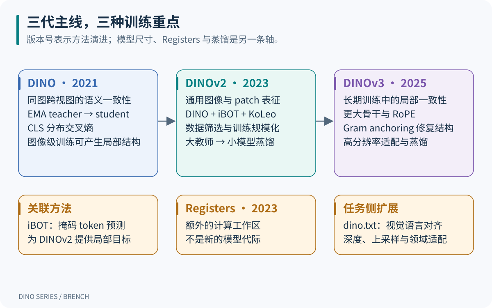
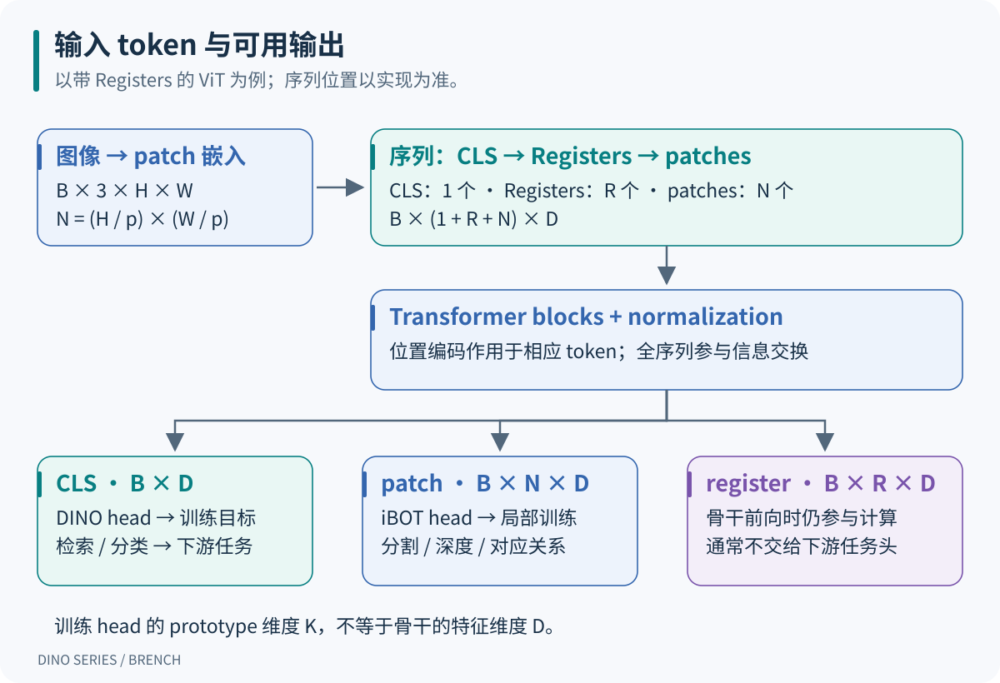
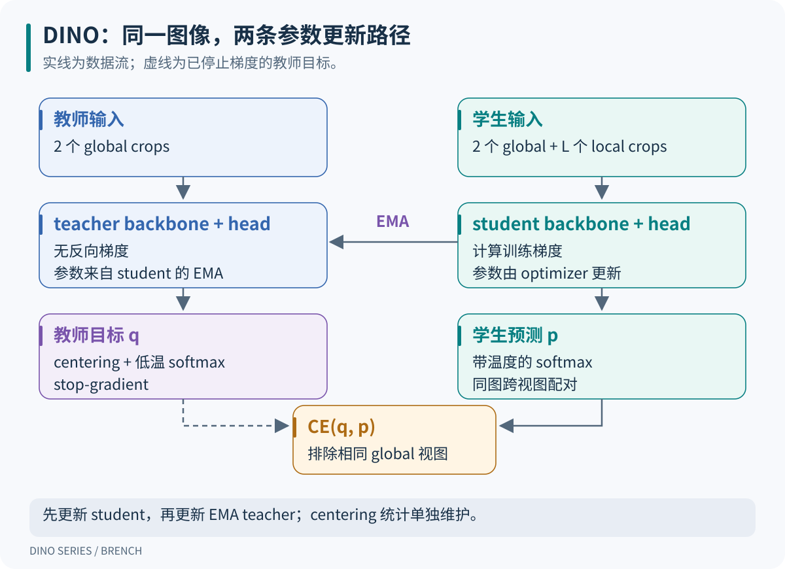
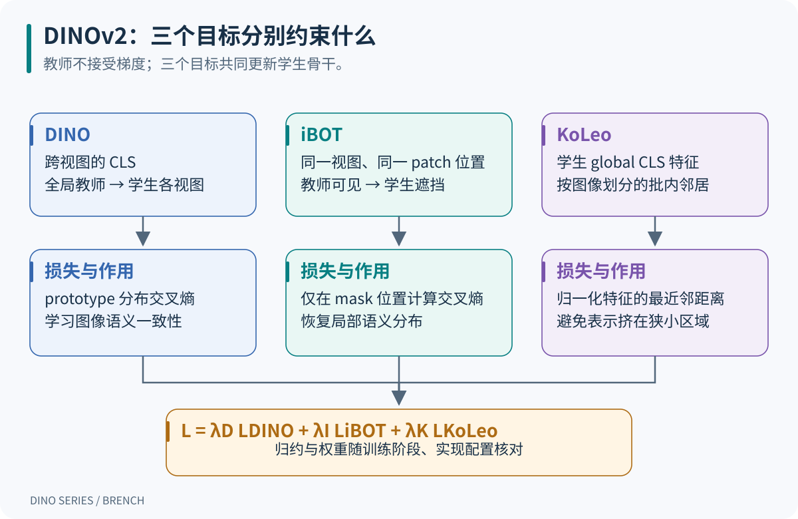
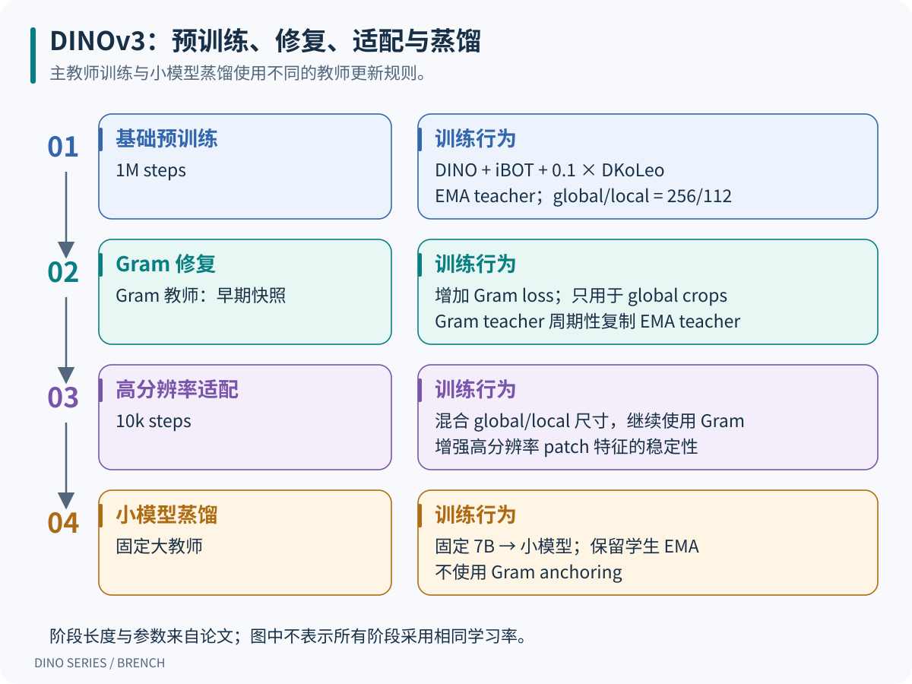
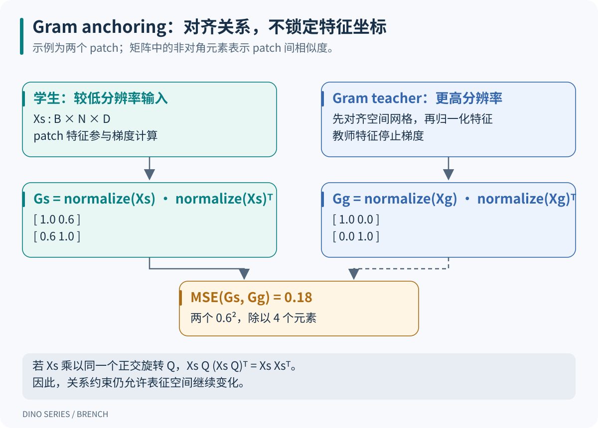
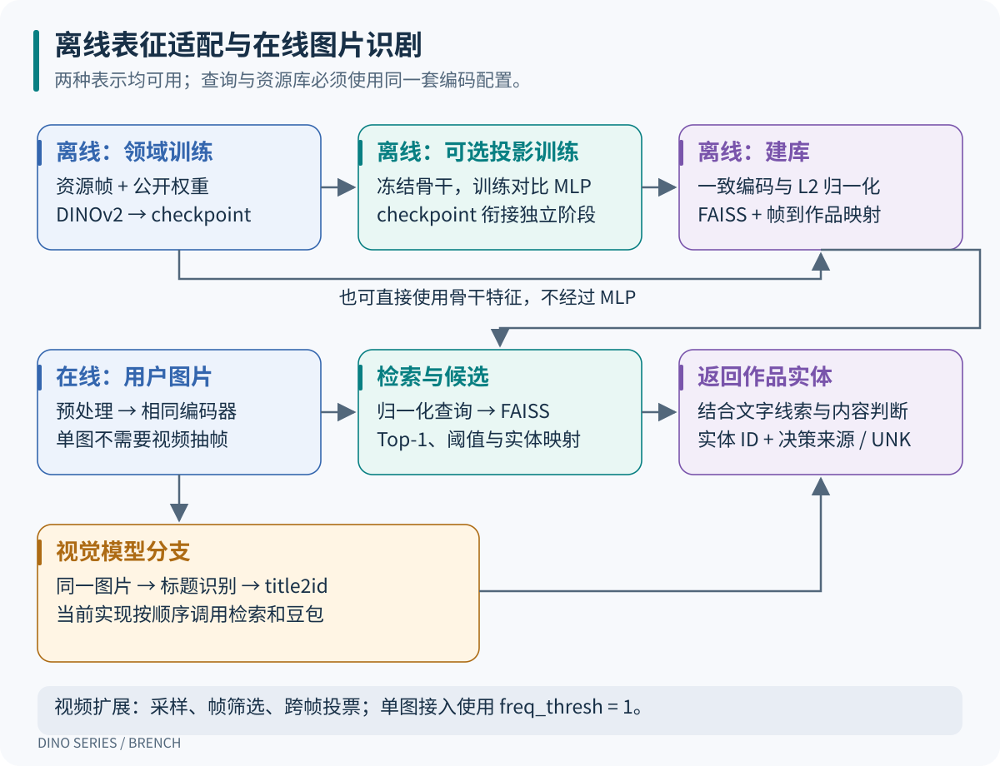
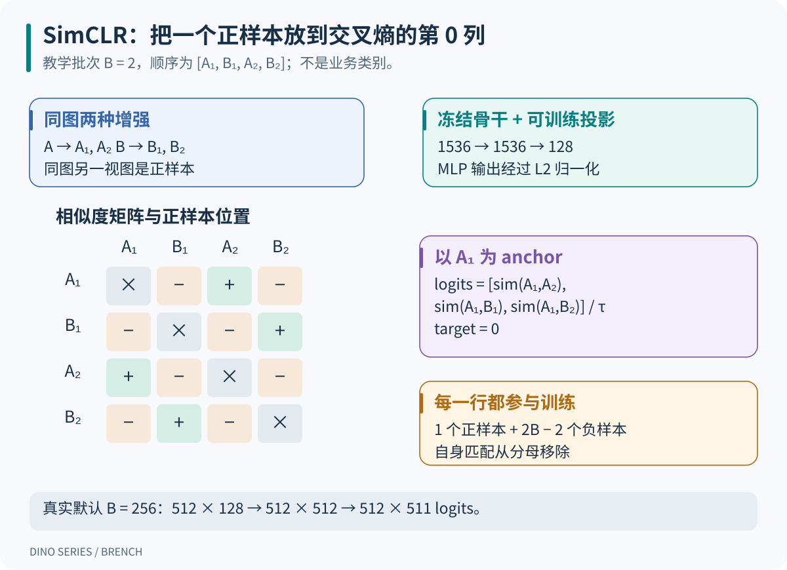

## 1. 先看清 DINO 系列在学什么

DINO 系列把图像转换为可迁移的视觉特征。训练时，同一图像的不同视图提供学习信号；使用时，骨干输出可以接分类器、用于相似图片检索，或组成分割、深度估计等系统。**自监督描述的是预训练信号的来源，不表示每个下游任务都不需要标注。**

三代的主线可以这样理解：DINO 让不同视图的图像级预测保持一致；DINOv2 同时训练图像与 patch 表征，并扩展数据和训练规模；DINOv3 进一步扩大模型，处理长时间训练后局部特征退化的问题。三代都需要结合架构、目标和数据看，不能只比较参数量。[^dino][^dinov2][^dinov3]

{width="100%" fig-align="center"}

::: {.table-responsive}

| 主线 | 主要学习信号 | 代表性骨干与数据 | 使用时主要取什么 |
|---|---|---|---|
| DINO，2021 | 同图跨视图的 CLS 分布交叉熵 | ViT-S/B，patch 16 或 8；论文主要在无标签 ImageNet-1k 上训练，也研究 ResNet | 图像表示；attention 或 patch 可分析局部结构 |
| DINOv2，2023 | DINO + iBOT + KoLeo | ViT-g/14 约 1.1B；LVD-142M；小模型通过蒸馏获得 | 图像级 CLS 与局部 patch 特征 |
| DINOv3，2025 | 初期沿用三类目标，后期加入 Gram anchoring | ViT-7B/16 实际约 6.7B；网络图像预训练模型使用 LVD-1689M | 更适合密集预测和高分辨率使用的视觉特征 |

:::

S、B、L、g／7B 是模型规模；`/14`、`/16` 是 patch 边长；`reg4` 表示四个 register tokens。它们不代表新的代际。DINOv2 有原版和后续 Registers 版本；DINOv3 还有蒸馏得到的 ViT-S/S+/B/L/H+、ConvNeXt，以及在卫星图像上训练的模型。数据不同的 checkpoint 不能仅按大小排序。[^dinov2-code][^dinov3-code]

名字相近的检测模型需要单独区分。本文的 DINO 是 **self-distillation with no labels**，不是“去噪自蒸馏”。检测论文 *DINO: DETR with Improved DeNoising Anchor Boxes for End-to-End Object Detection* 属于 DETR 检测路线；Grounding DINO 研究开放集检测与语言 grounding，也不是这里的 DINOv2／v3 下一代。[^detector][^grounding]

本文沿用此前 [DINO 系列整理](https://github.com/BrenchCC/DINO_Series_Model_Analysis)中的问题线索，机制以官方论文和源码重新核对。后文的数值小例子是教学构造；项目章节依据源码和文档，不把结构推导写成实测收益。

## 2. 共同架构：图像到训练目标

### 2.1 骨干特征、训练 head 和任务 head

设 batch 中有 $B$ 张图像，输入大小为 $H\times W$，patch 边长为 $p$。为简化记号，先假设两条边都能被 $p$ 整除：

$$
N = \frac{H}{p}\frac{W}{p},\qquad
X_{\mathrm{patch}}\in\mathbb{R}^{B\times N\times D}.
$$

每个 patch 经线性映射得到 $D$ 维 token。ViT 再加入一个 CLS token；带 Registers 的版本还加入 $R$ 个可学习 token。完整序列长度是 $1+R+N$。例如，DINOv2 的 $224\times224$ 输入、patch 14 对应 $16\times16=256$ 个 patch；加上 CLS 和四个 registers，总长为 261。DINOv3 的 $256\times256$ 输入、patch 16 也有 256 个 patch。

{width="100%" fig-align="center"}

::: {.table-responsive}

| 对象 | 典型形状 | 作用 |
|---|---|---|
| CLS 输出 | $B\times D$ | 汇聚图像信息，可用于分类、检索 |
| patch 输出 | $B\times N\times D$ | 保留位置相关信息，可还原为空间特征网格 |
| register 输出 | $B\times R\times D$ | 为骨干提供额外计算空间，通常不交给任务 head |
| DINO head 输出 | $B\times K_D$ | 把 CLS 转成训练用的 prototype logits |
| iBOT head 输出 | $M\times K_I$ | 对选中的 $M$ 个 patch 产生局部训练 logits |

:::

$D$ 是骨干特征维度，$K_D/K_I$ 是训练目标的维度。几十万维 prototype logits 不意味着推理必须输出几十万维检索向量。prototype 也没有预先绑定“猫”“汽车”等人工类别。

DINO 的训练 head 由 MLP、归一化 bottleneck 和末端投影组成。后续版本调整 head 的宽度、prototype 数量和归一化细节。训练 head 服务于表示学习；下游线性分类器、DPT 深度 head 或分割解码器则服务于具体任务，两者不能混用。

**CLS 在官方 DINOv2 实现的序列开头。** 带 Registers 时，顺序是 `[CLS, registers, patches]`。旧整理中“CLS 放在末尾能减少干扰”的解释没有实现依据。论文示意图为了排版把 token 画在什么位置，也不能直接当成源码中的序列顺序。[^vit-code]

### 2.2 两个网络为什么能互相教

学生网络 $g_s=h_s\circ f_s$ 有骨干和 head；教师网络 $g_t=h_t\circ f_t$ 产生监督目标。自蒸馏预训练通常让两者从相同参数开始。学生由梯度下降更新，教师参数则跟踪学生参数的指数移动平均：

$$
\theta_t \leftarrow m\theta_t+(1-m)\theta_s.
$$

教师不是提前知道正确类别的分类器。它提供的是相对稳定的目标，学生需要从另一个视图预测这个目标。共享结构、数据增强、跨视图约束和防坍塌处理共同塑造表示；EMA 本身没有“自动产生语义”的保证。

`stop-gradient` 表示交叉熵不会沿教师分支反向传播。EMA 是参数更新规则，centering 则是输出统计的更新规则。两者都涉及移动平均，但平均的对象不同。后面的大模型向小模型蒸馏又不同：固定大教师不再由小学生的 EMA 得到。

推理时通常保留一个训练好的骨干，不需要同时运行学生和教师。若选择带 Registers 的 checkpoint，registers 仍参与骨干前向；通常丢弃的是它们的最终输出，不能直接删除输入 token。

## 3. DINO：跨视图的分布匹配

### 3.1 数据增强提供什么监督

一张图像生成两个覆盖较大区域的 global crops，以及若干 local crops。教师只看 global crops，学生看所有 crops。学生需要从局部画面预测教师从更大画面得到的语义分布，这给模型施加了局部到整体的一致性约束。global 也经过随机裁剪和颜色增强，并不一定等于完整原图。

{width="72%" fig-align="center"}

对两个 global crops $g_1,g_2$ 和 $L$ 个 local crops，教师与学生按同图跨视图配对：教师 $g_1$ 对学生 $g_2$ 及所有 local；教师 $g_2$ 对学生 $g_1$ 及所有 local。排除同一个 global 视图的直接匹配，共有 $2(L+1)$ 个有向视图对。增强应保留任务相关信息；裁剪过小、只剩背景时，一致性目标也可能变得不合理。

### 3.2 交叉熵、温度与 centering

令教师 logits 为 $z_t$，学生 logits 为 $z_s$，中心向量为 $c$：

$$
q_k =
\frac{\exp((z_{t,k}-c_k)/\tau_t)}
{\sum_j\exp((z_{t,j}-c_j)/\tau_t)},\qquad
p_k =
\frac{\exp(z_{s,k}/\tau_s)}
{\sum_j\exp(z_{s,j}/\tau_s)}.
$$

教师分布 $q$ 停止梯度。单个视图对的损失是：

$$
H(q,p)=-\sum_{k=1}^{K}q_k\log p_k.
$$

记合法视图对集合为 $\mathcal P$，DINO 对图片和视图对取平均：

$$
\mathcal L_{\mathrm{DINO}}
=\frac{1}{B|\mathcal P|}
\sum_{b=1}^{B}\sum_{(u,v)\in\mathcal P}
H\!\left(q_t(u_b),p_s(v_b)\right).
$$

这是一种软目标分类。它没有 SimCLR 那样将其他图片显式放进负样本分母；分母在 prototype 维度上归一化，不是在图片维度上做匹配。

centering 用教师的原始 logits 更新中心，分布式训练需要汇总相应统计：

$$
c\leftarrow \mu c+(1-\mu)
\frac{1}{2B}\sum_{b=1}^{B}\sum_{u\in\{g_1,g_2\}}z_t(u_b).
$$

::: {.table-responsive}

| 机制 | 对谁操作 | 主要作用与边界 |
|---|---|---|
| centering | 教师 logits 的各个输出维度 | 抑制某一维长期占优势；单独使用可能趋向过于均匀的输出 |
| sharpening | 教师 softmax 温度 $\tau_t$ | 让单样本目标更集中；过强又可能导致所有样本偏向同一维 |
| stop-gradient | 教师目标 | 防止当前 loss 同时把两个分支拉向容易满足的解 |
| EMA teacher | 教师参数 | 提供随训练缓慢变化的目标 |
| 多视图匹配 | 同图不同裁剪 | 要求表示保留增强后仍共享的信息 |

:::

防坍塌依赖这些机制的组合和合适参数。不能将“有 EMA”或“有 stop-gradient”单独理解成数学上的不坍塌证明。DINO 论文用消融实验展示 centering 与 sharpening 的互补性。[^dino]

用一个三维例子看损失：教师 $q=(0.8,0.1,0.1)$，学生 $p=(0.6,0.3,0.1)$，则交叉熵约为 $0.7593$。当学生完全匹配教师时，损失仍是教师熵 $H(q)\approx0.6390$，并非零。因为

$$
H(q,p)=H(q)+D_{\mathrm{KL}}(q\parallel p).
$$

固定教师目标时，减少交叉熵等于减少 KL；但训练中教师也在变化，不能把所有阶段的 loss 高低直接当成特征质量排名。

### 3.3 一次 DINO 训练步

以下使用教学配置 $B=2,L=2$，因此共有 6 个视图对。若骨干为 ViT-S/16，global 为 224、local 为 96，则每个 global 有 196 个 patch，每个 local 有 36 个 patch；CLS 特征都是 384 维。不同分辨率分组前向，不能把两种大小的图片直接沿 batch 维拼接。

{width="100%" fig-align="center"}

下面是机制伪代码，辅助函数表达数学操作，不是可直接启动训练的脚本：

```python
# 同图多视图 / Multiple views of the same images
global_views, local_views = augment(images)
student_views = global_views + local_views

# 教师只看全局视图 / Teacher sees global views only
with no_grad():
    teacher_logits = [teacher(view) for view in global_views]
    targets = [centered_softmax(z, center, tau_t) for z in teacher_logits]

student_logits = [student(view) for view in student_views]
pair_losses = []
for teacher_index, target in enumerate(targets):
    for student_index, logits in enumerate(student_logits):
        if student_index == teacher_index:
            continue
        pair_losses.append(soft_target_ce(target, logits, tau_s))

loss = mean(pair_losses)  # 每项先对图片平均 / Each item averages over images
optimizer.zero_grad()
loss.backward()
optimizer.step()
ema_update(teacher, student, momentum)
center = update_center(center, teacher_logits, center_momentum)
```

这一训练步中，教师输出是两组 $B\times K$，学生输出是四组 $B\times K$。中心更新使用本步前向时得到的教师 logits；官方实现可将它放在 loss 内部或延迟应用，只要时间语义一致。EMA 使用学生完成本步优化后的参数。

### 3.4 原论文的训练细节与能力边界

论文 §3.2 的 ViT-S/16 训练使用 AdamW、总 batch 1024；学习率按 $0.0005\times B/256$ 缩放，前 10 个 epoch 预热，随后余弦下降；weight decay 从 0.04 变化到 0.4。学生温度为 0.1，所述教师温度在前 30 个 epoch 从 0.04 升到 0.07。教师 EMA 系数从 0.996 向 1 变化。论文包含 300 与 800 epoch 等不同实验，不能给全部结果标同一个训练时长。官方命令的默认值也不必然等于某张实验表的设置。[^dino][^dino-code]

{width="95%" fig-align="center"}

attention 图中的对象轮廓是可观察现象，不等于模型已输出带类别的语义分割结果。训练时没有像素类别交叉熵；若业务需要稳定的分割标签，还要选择适合的提取方法或训练任务 head。

## 4. DINOv2：让全局与局部特征都可用

### 4.1 改进发生在数据、目标和实现三个位置

DINOv2 的主要问题是通用性：在某一个分类数据集上训练出的特征，能否迁移到细粒度分类、检索、分割和深度等不同任务？它把数据筛选、局部目标和规模化训练放在一起改进。LVD-142M 通过视觉特征、去重及与 curated 数据的相似性检索组织数据；“不使用标签训练”不等于“没有数据筛选”。[^dinov2]

{width="95%" fig-align="center"}

论文没有发布足以逐样本重建 LVD-142M 的完整数据。公开训练代码中以 ImageNet-22k 为数据集的配置是可用训练配方，不能直接称为官方 LVD-142M 完整预训练的复现。

### 4.2 三项损失各负责一件事

{width="100%" fig-align="center"}

DINO 继续约束跨视图 CLS。iBOT 则让学生从被遮挡的输入中预测教师在对应可见位置上的语义分布。学生看到的是 mask token，教师看到同一 global crop 的原始内容。**局部匹配要求同视图、同位置；不能把两个独立裁剪中的第 17 个 patch 默认视为同一个图像区域。**

对 $2B$ 个 global crops，设第 $a$ 个裁剪的 masked 位置集合为 $\mathcal M_a$：

$$
\mathcal L_{\mathrm{iBOT}}
=\frac{1}{2B}\sum_{a=1}^{2B}
\frac{1}{\max(1,|\mathcal M_a|)}
\sum_{i\in\mathcal M_a}
H\!\left(q_{t,a,i},p_{s,a,i}\right).
$$

先对每个裁剪的 masked 位置平均，再对裁剪平均，避免 mask 多的图片仅因 token 数量大而占据更多权重；没有 mask 的裁剪贡献零。官方实现会把选中位置打包成 $M\times K_I$，通过 `masks_weight` 保留这种权重语义，并在外层处理多裁剪的缩放。iBOT 预测的是教师的 latent prototype 分布，不是重建 RGB 像素。教师目标停止梯度；梯度通过学生 iBOT head 回到共享骨干。[^v2-loss]

KoLeo 对学生的归一化 CLS 特征施加分布约束。记 $u_b=f_s(x_b)/\|f_s(x_b)\|_2$：

$$
\mathcal L_{\mathrm{KoLeo}}
=-\frac{1}{B}\sum_{b=1}^{B}
\log\!\left(\min_{j\ne b}\|u_b-u_j\|_2+\epsilon\right).
$$

损失对每个样本寻找最近邻，鼓励最近的特征不要过度挤在一起。它只依赖学生特征，梯度可流向距离两端；离散的最近邻索引选择本身不作连续求导。DINOv2 按两个 global 视图分组计算，避免把同图的两个视图当成需要相互推开的邻居。KoLeo 的值可以为负，因为单位球面上两点的距离可能大于 1。

用便于比较的记号，总目标写成：

$$
\mathcal L
=\lambda_D\mathcal L_{\mathrm{DINO}}
+\lambda_I\mathcal L_{\mathrm{iBOT}}
+\lambda_K\mathcal L_{\mathrm{KoLeo}}.
$$

官方常见配置的权重为 $1,1,0.1$。上式描述各目标的职责；逐行复现实装时还要核对 global/local 配对计数、mask 权重和调用层缩放，不能只复制三个系数。训练日志中为了展示而除以 2 的量，也未必就是反向传播使用的量。[^v2-loss][^v2-config]

### 4.3 Sinkhorn-Knopp 与分离 head

DINOv2 的主要配方用三轮 Sinkhorn-Knopp，替代初代 DINO 的 EMA centering 目标处理。它对一批教师 prototype 分数进行交替归一化：使各 prototype 在批内的总使用量更平衡，同时让每个样本得到一个和为 1 的目标分布。学生仍使用带温度的 softmax。

这里的“均衡”是跨样本的 prototype 使用，不是让每个样本的目标都变成均匀分布，也不是按人工类别均匀采样。分布式实现要同步相应统计；只在单卡做归一化可能改变训练目标。公开代码同时支持 centering 与 Sinkhorn-Knopp，讲某次训练时应以选中的配置为准。

初始 iBOT 研究过 CLS 与 patch 共用 head。DINOv2 在规模化实验中采用分离的 DINO head 和 iBOT head，使全局与局部目标能够使用不同映射。它们仍共享骨干，因此目标可能在骨干梯度上相互影响。

### 4.4 一次 DINOv2 训练步

教学 batch 仍取 $B=2$，两个 global、两个 local。对 patch 14 的骨干，global 224 对应 256 个 patch，local 98 对应 49 个 patch。教师 global patch 输出为 $4\times256\times D$；学生相同位置经过 masking。假设选中 $M$ 个位置，iBOT head 只需处理对应的 $M$ 个输出。

```python
# 教师目标：可见的全局图像 / Teacher targets from visible global crops
with no_grad():
    teacher_cls, teacher_patch = teacher(global_views)
    cls_targets = sinkhorn(dino_teacher_head(teacher_cls))
    patch_targets = sinkhorn(ibot_teacher_head(teacher_patch[mask]))

# 学生全局视图被遮挡，局部视图不变 / Mask only student global views
student_cls, student_patch = student(global_views, masks = mask)
local_cls = student(local_views).cls
global_logits = dino_student_head(student_cls)
local_logits = dino_student_head(local_cls)
loss_dino = cross_view_dino(global_logits, local_logits, cls_targets)
loss_ibot = masked_patch_ce(
    ibot_student_head(student_patch[mask]),
    patch_targets,
    masks_weight
)
loss_koleo = koleo_per_global_view(student_cls)
loss = weighted_sum(loss_dino, loss_ibot, loss_koleo)

optimizer.zero_grad()
loss.backward()
clip_student_gradients()
optimizer.step()
ema_update(teacher, student, momentum)
```

伪代码省略混合精度、分布式归约和 scheduler，保留目标与梯度关系。mask 必须同时决定输入的遮挡位置和 loss 的目标位置。计算 patch 目标时不能包含 CLS 或 registers；小批次演示也不能替代真实 batch 下的 KoLeo 与 Sinkhorn 行为。

### 4.5 训练规模、高分辨率与小模型蒸馏

::: {.table-responsive}

| 设置 | 论文所述配方 | 为什么需要区分 |
|---|---|---|
| ViT-g/14 主预训练 | 40 层，1536 维，24 个注意力头；总 batch 3072，625k iterations | 这些是代表性大模型设置，不适用于所有尺寸 |
| 优化 | AdamW；表 16 的 LR 为 $3.5\times10^{-4}$；100k 步预热；weight decay 0.04→0.2；EMA 0.994→1 | 不与公开 ImageNet-22k 示例配置混写 |
| 分辨率适配 | 预训练末尾另用 10k 步适配到 518 | 主要改善密集任务，成本高于低分辨率前向 |
| 小模型蒸馏 | 固定 ViT-g 教师，另存学生 EMA；移除 masking 与 stochastic depth，仍使用 patch 目标 | “iBOT”不表示蒸馏阶段一定遮挡输入 |
| 工程实现 | memory-efficient attention、sequence packing、FSDP、混合精度 | 减少显存与通信开销，不改变这些目标的基本定义 |

:::

以上来自论文 §5、附录 B 和表 16–17。sequence packing 使用块对角 attention mask，避免不同图片互相注意；不能把它理解成让所有图像共享上下文。[^dinov2]

### 4.6 Registers 解决的不是所有局部问题

*Vision Transformers Need Registers* 发现，一些模型把信息较少的背景 patch 当成内部计算空间，产生高范数 outlier tokens。这些 token 含较多全局信息，却会污染局部特征图。增加可学习的 registers，为模型提供独立于图像位置的工作区，能缓解这种现象。[^registers]

{width="92%" fig-align="center"}

registers 参与注意力与训练，但通常不直接接受分类或 patch 目标；它们通过与其他 token 的交互接收梯度。四个 registers 是该工作的常用设置，不是越多越好。它们需要与训练好的 checkpoint 配套，不能在任意旧模型推理时随手插入后就期待相同效果。

{width="95%" fig-align="center"}

PCA 颜色不是类别标签。图中背景经过阈值处理，颜色也依赖用于拟合 PCA 的特征集合。这个结果说明表示有可利用的结构，不能据此声称模型已经完成了任意图像的分割或语义匹配。

## 5. DINOv3：规模扩大后，怎样保住局部结构

### 5.1 架构与训练配方的变化

DINOv3 的大教师把宽度从 DINOv2 ViT-g 的 1536 提高到 4096，层数仍为 40，注意力头从 24 增至 32。patch 从 14 变为 16，使用 RoPE 与四个 storage／register tokens；SwiGLU 隐藏维度为 8192。DINO 与 iBOT 使用不同 head；论文所述 prototype 数分别为 256k 与 96k。[^dinov3]

RoPE 作用于 attention 中的 query/key。DINOv3 为 patch 使用归一化二维坐标，并通过 RoPE-box jittering 改变坐标范围；论文描述把 $[-1,1]$ 缩放为 $[-s,s]$，$s\in[0.5,2]$。这有助于适应尺度和分辨率变化，但不保证任意分辨率下性能不变，也不能消除更多 token 带来的计算开销。

初期目标仍是 DINO、iBOT 和分布式 KoLeo。后者以 16 个样本的小组计算邻居距离；论文附录 C 指明使用学生第一个 global crop 的 CLS，这与简单复用 DINOv2 两个 global 分组的实现有区别。骨干还使用不同的 global/local CLS normalization，减少两类裁剪统计差异带来的影响。[^dinov3][^v3-code]

::: {.table-responsive}

| 阶段 | 论文中可核对的设置 | 教师与目标 |
|---|---|---|
| 主预训练 | LVD-1689M；总 batch 4096；1M 步；2 global + 8 local；256／112 尺寸 | EMA teacher；DINO + iBOT + $0.1\,\mathrm{DKoLeo}$ |
| 优化 | AdamW；LR $4\times10^{-4}$，100k 步预热后保持；weight decay 0.04；EMA 0.999；layerwise decay 0.98 | 不沿用 DINOv2 的整个余弦调度 |
| Gram refinement | 主训练 1M 步后加入 Gram；论文权重 $w_{\mathrm{Gram}}=2$ | 早期 checkpoint 初始化 Gram teacher，周期性刷新 |
| 高分辨率适配 | 额外 10k 步；global 取 512／768，local 取 112／168／224／336 | 保留 Gram；具体 global/local/Gram 尺寸按成组配置采样 |
| 小模型蒸馏 | 固定大教师；1M 步后 250k 步 cooldown，再高分辨率适配 | 保留学生 EMA；不用 Gram anchoring |

:::

这张表记录论文配方，不是把阶段参数拼成一个可直接运行的配置。主预训练 LR 不能复制到 Gram refinement；真实复现应读取对应阶段 YAML、恢复 checkpoint 和 scheduler 状态。官方已提供独立的预训练、Gram、高分辨率和蒸馏配置。[^v3-code]

{width="100%" fig-align="center"}

### 5.2 分类继续变好，局部特征却可能退化

长时间训练时，CLS 分类表现可以继续提高，patch 的局部一致性却变差。DINOv3 论文中，VOC 分割表现约在 200k 步后开始下降；patch 与 CLS 的相似度上升，patch 相似度图也出现更多无关响应。[^dinov3]

{width="95%" fig-align="center"}

这个现象与 Registers 论文的高范数异常不同：已经加入 registers、范数没有明显失控，也仍然可能出现局部相似关系退化。因此，不能用“已经有 registers”推断密集特征已得到充分保护。

### 5.3 Gram anchoring 为什么约束两两关系

设学生和 Gram teacher 对应的 patch 特征经过 L2 归一化，分别为 $\hat X_s,\hat X_g\in\mathbb R^{B\times N\times D}$。每张图像的 Gram 矩阵是：

$$
G_s=\hat X_s\hat X_s^\mathsf T,\qquad
G_g=\hat X_g\hat X_g^\mathsf T.
$$

矩阵形状为 $B\times N\times N$。元素 $(i,j)$ 表示同一图像中两个 patch 的余弦相似度。论文用平方 Frobenius 范数表达差异；官方 `GramLoss` 通过 `MSELoss` 对全部元素平均，可以明确写成：

$$
\mathcal L_{\mathrm{Gram}}
=\frac{1}{BN^2}\sum_{b=1}^{B}
\sum_{i=1}^{N}\sum_{j=1}^{N}
\left(G_{s,b,i,j}-\mathrm{sg}(G_{g,b,i,j})\right)^2.
$$

`sg` 表示停止梯度。只有学生 patch 特征接收梯度。论文中的“求和”记号与实现中的“均值”差一个规模因子，复现权重时需要遵循实际归约。也要检查所选配置是否保留负相似度；本文对照的 Gram refinement 配置使用归一化特征、图像内 Gram，并不截断负值。[^v3-code]

{width="100%" fig-align="center"}

例如，两张矩阵分别为：

$$
G_s=
\begin{bmatrix}1&0.6\\0.6&1\end{bmatrix},
\qquad
G_g=
\begin{bmatrix}1&0\\0&1\end{bmatrix}.
$$

MSE 为 $(0.6^2+0.6^2)/4=0.18$，未归一化的平方 Frobenius 范数则为 0.72。目标要求两个 patch 不再过于相似，没有规定某个 feature channel 必须取什么值。

若 $Q$ 是正交矩阵，$QQ^\mathsf T=I$，则：

$$
(\hat X_sQ)(\hat X_sQ)^\mathsf T
=\hat X_s\hat X_s^\mathsf T.
$$

因此，所有 patch 的特征一起旋转后仍可满足关系约束。相比逐通道匹配早期特征，Gram anchoring 给新表示留下更多变化空间。这是目标的数学性质，不代表它完全不会影响全局能力；实际权衡仍由实验判断。

### 5.4 两种 teacher 与高分辨率目标

EMA teacher 每步由学生更新，为 DINO/iBOT 提供目标。Gram teacher 是另一个参考快照：开始时选取局部结构较好的早期教师，再每 10k 步复制当前 EMA teacher，论文最多刷新三次。两次刷新之间保持固定。因此，将它简单称为“更慢 EMA”会遗漏实际更新方式。

Gram refinement 还让 Gram teacher 看两倍边长的图像：例如学生看 256，Gram teacher 看 512。先把教师空间特征网格用 bicubic 下采样到学生网格，再归一化并计算 Gram。两侧必须描述同一图像区域；不同 token 数的 Gram 矩阵不能不经对齐直接相减。后续混合分辨率阶段使用另外的成组尺寸，不是始终两倍。

{width="95%" fig-align="center"}

这组消融中，采用 200k 步教师并使用两倍分辨率时，ADE20k mIoU 从 baseline 的 50.3 变为 55.7；ImageNet linear 则从 88.2 变为 88.0。这支持“修复局部表示”的判断，不能改写成“所有指标都提高”。100k 和 200k 的早期教师接近，1M 的较晚教师效果较弱。[^dinov3]

### 5.5 一次 DINOv3 Gram refinement 训练步

以 $B=2$、global 256、patch 16 为例，两个 global 视图合并后有 $4\times256$ 个 patch。Gram teacher 的 512 输入得到 $32\times32$ 网格，对齐到 $16\times16$ 后，两侧 Gram 都是 $4\times256\times256$。

```python
# 基础目标仍由 EMA teacher 提供 / EMA teacher supplies the base targets
base_loss, student_global_patch = dino_v3_base_objectives(batch)

# Gram teacher 是单独快照 / The Gram teacher is a separate snapshot
with no_grad():
    gram_patch = gram_teacher(batch.gram_global_views).patch
    gram_patch = resize_patch_grid(gram_patch, batch.student_grid)
    gram_patch = normalize(gram_patch, dim = -1)

student_patch = normalize(student_global_patch, dim = -1)
student_gram = student_patch @ student_patch.transpose(-1, -2)
target_gram = gram_patch @ gram_patch.transpose(-1, -2)
loss_gram = mean((student_gram - target_gram) ** 2)
loss = base_loss + gram_weight * loss_gram

optimizer.zero_grad()
loss.backward()
clip_student_gradients()
optimizer.step()
ema_update(teacher, student, momentum)
if gram_refresh_due(step):
    copy_parameters(gram_teacher, teacher)
```

这里的 `base_loss` 使用 refinement 阶段实际的 DINO／iBOT／KoLeo 权重；`gram_refresh_due` 包含阶段起点、10k 间隔与最多三次刷新的约束。论文与官方配置为这一步规定了 mask、输入增强和 teacher 尺寸，不能仅凭伪代码重建全部训练细节。

{width="95%" fig-align="center"}

小模型蒸馏不直接套用这段 Gram refinement：固定 7B 教师指导小学生，另维护学生 EMA 作为输出模型。论文称该设置没有观察到同类局部退化，因此蒸馏与其高分辨率适配不使用 Gram anchoring。这也说明，某一阶段有效的正则项不应机械添加到所有阶段。

## 6. 适合哪些任务，如何选择适配方式

### 6.1 从输出表示选择任务接口

::: {.table-responsive}

| 任务 | 常用表示与接口 | 额外需要什么 | 主要评估口径 |
|---|---|---|---|
| 图像分类 | CLS；有时拼接多层 CLS 或 pooled patches | k-NN 的带标签参考集，或训练线性分类器 | Top-1／Top-5；类别划分一致 |
| 同图、实例或资源检索 | 归一化 CLS，或任务投影向量；必要时 patch 重排 | 特征库、资源 ID 映射、查询与库的一致编码 | Recall@K、mAP、准确率与覆盖率 |
| 语义分割 | patch 网格、多层特征 | 像素标注；线性 head 或分割解码器 | mIoU；输入分辨率与推理协议 |
| 单目深度 | patch、多层特征 | 经过深度训练的 head；需要度量尺度时增加相应监督 | RMSE、AbsRel；区分相对与度量深度 |
| 局部／语义对应 | patch 之间的相似度 | 网格对齐、匹配过滤、必要时几何约束 | PCK、匹配准确率及遮挡条件 |
| 视频分割／跟踪 | 逐帧 patch、邻近帧匹配 | 初始标注或任务规定的参考信息、时序传播 | DAVIS 的 J&F 等；说明初始监督 |
| 视频分类／作品识别 | 帧级 CLS、投影、跨帧汇聚 | 时间采样、投票或时序 head | 视频级指标；不能只报告帧级 Top-1 |
| 视觉语言任务 | 视觉特征 + 对齐模块 | 文本编码器或语言模型、图文数据与对齐训练 | 对应检索、分类或生成任务指标 |

:::

原始视觉 DINO checkpoint 没有与文本天然对齐的 embedding 空间，不能直接把文字向量与 CLS 做相似度当成 CLIP 式零样本分类。dino.txt 和 DINOv3 的文本对齐模块解决的是这部分额外工作。[^dinotxt][^dinov3]

论文中的“冻结骨干”也不等于“整个任务系统未经训练”。例如 DINOv3 的强系统结果可以由冻结骨干配合训练过的检测器、ViT-Adapter／Mask2Former 或深度模型得到；线性 probe 与复杂系统必须分开比较。

### 6.2 冻结、投影还是微调

先建立冻结骨干基线，确认预处理和评测正确。若 CLS 已能区分目标，只需要适配向量维度或距离空间，可以训练小型投影。若目标需要局部信息，先检查 patch／多层特征与任务 head，不能指望压缩 CLS 恢复已经丢失的位置细节。

当域偏移明显、冻结表示不能分开任务样本时，再比较部分解冻、全量微调或领域自监督训练。解冻会增加显存、训练成本和遗忘风险，也会改变检索向量空间。骨干、投影或预处理发生变化后，旧索引通常需要重新编码，不能把新旧向量直接混在一起。

我的判断是：资源识别项目首先需要验证“表示是否适合这个检索口径”。换更大的骨干、增加 loss、调高分辨率都应在同一资源划分与同一延迟预算下比较，否则很难解释收益来自哪里。

## 7. 项目实践：DINOv2 + SimCLR 如何用于图片识剧

### 7.1 当前实现的范围与训练关系

本节依据 [项目最新文档](https://github.com/BrenchCC/dinov2_with_simclr/blob/cab5828c7c80d59f2b3d7b02c3e04131b7daa290/docs/project-analysis-and-improvements.md)及同一提交的源码。核对版本为 `cab5828c7c80d59f2b3d7b02c3e04131b7daa290`，文档中的实现对照基线为 `c215a89`；两者之间新增的是项目解读与流程图，训练代码未变。

项目的业务入口是一张短剧截图：编码图片、搜索相似资源帧、映射到作品实体，再结合视觉模型提供的内容及标题线索形成结果。上层上传、业务路由与前端展示是接入职责，仓库主要提供路由之后的识别组件。

::: {.table-responsive}

| 阶段 | 实现行为 | 训练参数或产物 |
|---|---|---|
| 数据与权重接入 | 无标签资源帧；本地／HDFS／TOS 读取；分块键名与位置编码适配 | 数据接口、骨干初始化 |
| DINOv2 领域训练 | 保留 student–teacher、多裁剪、DINO/iBOT/KoLeo | 领域骨干 checkpoint |
| SimCLR 投影训练 | 加载骨干 checkpoint，冻结骨干，训练新增 MLP | 投影参数与组合模型 checkpoint |
| 特征与建库 | 支持 `dinov2` 和 `dinov2_mlp` 两种表示 | 向量分片、FAISS 索引、帧到实体映射 |
| 在线识别 | 图像检索、标题映射、规则融合；多帧时可投票 | 实体、实体 ID 与策略来源 |

:::

项目没有把 InfoNCE 加入 `SSLMetaArch.forward_backward()` 的 DINOv2 总损失。两个训练入口通过 checkpoint 衔接。领域训练与 SimCLR 投影是可分别管理的阶段；源码提供链路不表示本次已执行训练或验证收益。[^project-train][^project-ssl]

{width="100%" fig-align="center"}

### 7.2 冻结骨干后到底训练什么

`DinoVisionTransformerWithMLP` 将骨干参数设为 `requires_grad = False`，训练入口又把 Adam 的参数限定为 `model.mlp.parameters()`。默认结构为：

```text
image → ViT-g CLS 1536 → Linear 1536→1536 → ReLU → Linear 1536→128
```

两层线性层含 bias，训练参数量为：

$$
(1536\times1536+1536)+(1536\times128+128)=2{,}557{,}568.
$$

约 256 万个参数是按结构计算的数值。冻结减少骨干梯度和优化器状态，但骨干仍要前向；实际显存和速度变化需要测量。把 1536 维向量变成 128 维，同 dtype 的向量元素存储为原来的 $1/12$，减少约 91.7%，这个比例不包含模型权重、索引和标签开销，也不能直接当成延迟降低比例。[^project-model]

`is_training=False` 在该骨干中控制返回什么，不等于 PyTorch 的 `eval()`。冻结参数、停止记录梯度、关闭 dropout／stochastic depth 是三个不同操作。若希望冻结特征在训练投影期间保持确定，需要检查模块训练模式，而不能只看 `requires_grad`。

### 7.3 正负样本与 InfoNCE

数据集为同一图片产生两种随机增强。将两个视图 batch 拼接，得到 $2B$ 个投影向量，再归一化。对 anchor $z_i$，同图另一视图 $z_{p(i)}$ 是正样本，其他图片的 $2B-2$ 个视图作为负样本：

$$
\ell_i=-\log
\frac{\exp(z_i^\mathsf T z_{p(i)}/\tau)}
{\sum_{k\ne i}\exp(z_i^\mathsf T z_k/\tau)},\qquad
\mathcal L_{\mathrm{InfoNCE}}=\frac{1}{2B}\sum_{i=1}^{2B}\ell_i.
$$

分母包含正样本，不包含自身。全部视图都轮流作为 anchor，因此是双向训练。梯度通过归一化向量回到 MLP，骨干参数不更新。作品 ID 没有参与当前正样本构造；“同一作品的两个不同帧”仍可能被当成负样本。[^project-simclr]

{width="100%" fig-align="center"}

教学例子取 $B=2$，顺序为 `[A1, B1, A2, B2]`。对 `A1`，正样本是 `A2`，负样本是 `B1` 和 `B2`。若正样本余弦相似度为 1，两项负样本相似度都是 0，$\tau=0.5$，则：

$$
\ell_{A1}
=-\log\frac{e^2}{e^2+1+1}
\approx0.2395.
$$

代码把每行正样本放在第 0 列，因此交叉熵 target 全是 0。这个 0 表示“正确候选在第 0 列”，不表示所有图片属于同一业务类别。

### 7.4 一个实际投影训练步与配置检查

默认 $B=256$ 时，训练链路是：

```text
两组图片，各 256 张
  → 拼接为 512 张
  → 冻结骨干输出 512 × 1536
  → MLP 输出 512 × 128
  → 归一化与相似度矩阵 512 × 512
  → 移除自身、正样本置前，logits 为 512 × 511
  → 512 个 target = 0，交叉熵平均
  → 仅更新 MLP
```

与当前训练器对应的简化伪代码：

```python
images = cat(two_view_batches, dim = 0)
image_ids = cat([arange(batch_size), arange(batch_size)])
features = model(images)  # 冻结 backbone，训练 MLP / Frozen backbone, trainable MLP
features = normalize(features, dim = 1)
similarities = features @ features.T
logits = positive_first_without_diagonal(similarities, image_ids)
targets = zeros(2 * batch_size, dtype = long)
loss = cross_entropy(logits / temperature, targets)
optimizer.zero_grad()
loss.backward()
optimizer.step()
```

实际代码可启用 autocast 与 GradScaler。默认 epoch 为 200，Adam LR 为 0.0003，weight decay 为 0.0001，温度为 0.07，投影维度为 128；这些是入口默认值，不是某次最优实验的结果。[^project-train]

当前代码还有两个应先验证的配置细节。SimCLR 增强以 `ToTensor()` 结束，未添加 ImageNet mean/std normalization；在线编码使用带 normalization 的评估变换。训练本来就需要随机增强，但输入数值分布是否应保持一致，应通过对照实验确定。余弦调度器的 `T_max` 使用 `len(train_loader)`，实际却在第十个 epoch 后按 epoch 调用 `step()`；这不是线性 warmup，调度单位也需要核对。这些是静态代码观察，实际影响需要通过对照实验验证。[^project-transforms][^project-train][^project-simclr]

### 7.5 离线向量与在线实体决策

库内资源帧提前编码，并保留路径到作品 ID 的映射。线上使用同一骨干、同一投影选择及一致的预处理编码用户图片。若选择 `dinov2_mlp`，库与查询都必须使用相同 MLP；不能拿 128 维投影查询去检索 1536 维骨干库。

归一化向量配合 FAISS `FlatIP` 时，内积分数等于余弦相似度。服务取每张图的 Top-1，经分数阈值与实体提取后得到视觉候选；豆包视觉提供内容判断和标题，`title2id` 将标题映射到实体，再由规则融合。当前编排先调用检索，再调用豆包，并非图中分支所暗示的并行执行。[^project-service]

单图接入使用 `freq_thresh = 1`。组件默认频次为 5，更适合多帧；一张图片不能满足五次帧级支持。视频才需要抽帧、相似帧筛选与实体频次投票。单图输入不应在解读中被写成“视频多数投票”。

标题唯一映射时可采用文字候选；标题映射到多个 ID 时使用视觉候选；缺少可映射标题时使用视觉结果；内容标记不满足条件时过滤。输出保留实体、实体 ID 和策略来源，无法识别时返回 `UNK`。检索 Top-1、标题匹配与融合结果分别携带不同证据，不应压成一个未经校准的“模型置信度”。

## 8. 延伸工作：改的是哪一层

::: {.table-responsive}

| 工作 | 与 DINO 的关系 | 解决的问题及边界 |
|---|---|---|
| iBOT | DINOv2 局部训练目标的重要来源 | 在线教师提供 masked token 的语义目标；不是像素自编码器。[^ibot] |
| Vision Transformers Need Registers | 骨干中的额外可学习 token | 缓解高范数 patch artifacts；不是所有局部退化的通用解法。[^registers] |
| dino.txt | 在 DINOv2 上做图像与像素级视觉语言对齐 | 增加文本侧和对齐训练；纯视觉 checkpoint 本身不具备这种对齐。[^dinotxt] |
| Channel-Adaptive DINO | 将自监督骨干适配到可变通道的显微图像 | 官方相关实现支持 Bag of Channels；文档明确没有包含 Hierarchical Attention 方案。[^channel] |
| Depth Anything V2 | 将 DINOv2 表征用于深度系统 | 通过深度教师、合成数据和伪标签等专门训练学习深度；不能把裸 DINO 特征直接解释成距离。[^depth] |
| FeatUp | 在骨干外提升特征的空间分辨率 | 学习图像引导的上采样，并提供不同 encoder 的模型；不等于重新预训练 DINO。[^featup] |
| AnyUp | 特征上采样的后续方案 | 设计可在推理时处理不同 encoder 特征的上采样器；“不需针对每个 encoder 重训”不等于上采样器未经训练。[^anyup] |
| DINOv3 元数据引导适配（FINO 分支） | 官方后续的领域适配实现 | 用已有元数据指导或对抗性去偏 CLS；公开参考任务包括 FMoW 与显微图像，不是 DINOv4。[^fino] |

:::

FINO 分支在本次核对时提供 *Who Needs Labels? Adapting Vision Foundation Models With the Metadata You Already Have* 的实现。其 FMoW 示例用区域元数据作辅助目标、年份作对抗目标，并包含 guide loss 的梯度范数平衡等设计。它提示了一种领域适配方向：先判断哪些元数据承载有用信号、哪些承载偏差，再决定鼓励或抑制什么。不能直接假定作品 ID、拍摄年份或来源平台都应采用同一种损失。[^fino]

这些工作分别修改目标、骨干、空间输出或任务接口。判断它们能否组合，先看输入输出和所需监督，而不是看名字是否都出现 DINO。

## 9. 项目改进如何做成可验证的实验

### 9.1 先建立能比较的基线

在相同评测划分下至少保留三种表示：公开 DINOv2、领域训练后的 DINOv2、领域骨干加 SimCLR 投影。若要判断第二阶段本身的作用，再加入“公开骨干 + 同样投影”的对照。不得只比较两个同时改变骨干、增强和向量维度的 checkpoint。

资源识别的验证集应该对应真实使用方式：同作品允许存在于库和查询时，至少按视频、片段或来源去除近重复泄漏；评估新作品泛化时，再按作品划分训练和评估集。即便作品检索要求库中有对应实体，也应保证查询帧与库帧的构造协议清楚。随机把连续视频帧分到两边，会高估泛化。

### 9.2 一次只改变可解释的因素

以下是建议实验，当前项目没有提供足以确认它们已经提高指标的受控结果。

::: {.table-responsive}

| 问题 | 待验证改进 | 对照与观察 |
|---|---|---|
| 同作品不同帧成为假负样本 | 在身份可靠时尝试多正样本、同实体负样本屏蔽；或限制同片段重复采样 | 原始同图双视图作为基线；同时报告同作品与相似作品混淆 |
| 增强破坏识别线索 | 调整裁剪范围、颜色扰动、翻转，保留文字／画面布局的有效信息 | 每次只调整一类增强；分层观察遮挡、字幕、截图压缩样本 |
| 输入分布与模式不一致 | 对齐必要的 normalization；固定骨干评估模式；统一离线与在线编码 | 保存变换、图像尺寸和模型模式；重建对应索引 |
| 投影压缩损失细节 | 比较原始 1536 维与 128／256／512 维投影 | 同骨干与数据预算；同时报告准确率、覆盖率、索引大小和延迟 |
| 冻结骨干不能适配领域 | 比较只训 MLP、解冻最后若干 block、领域自监督训练 | 相同评测集；检查域内收益和域外退化 |
| 全局表示混淆相似画面 | 候选召回后用 patch 对应关系或局部 head 重排 | 固定候选集；记录准确率变化与额外计算成本 |
| 阈值过高造成大量拒识 | 在验证集扫描相似度阈值，选择覆盖率与错误率的工作点 | 测试集一次评估；对未知作品单独报告误接收 |
| 帧投票受重复帧影响 | 限制近重复帧的票数，比较时间覆盖更广的采样 | 视频级对照；不能将高度相关帧当成独立证据 |

:::

冻结投影方案有明确的工程价值：训练参数少、向量空间小、容易做对照。但“MLP 更轻”与“业务更准”是两个结论，后者需要上述评测支撑。

### 9.3 训练指标与业务指标

当前 SimCLR 日志的 Top-1／Top-5 统计正样本在对比候选中的排名。业务帧级指标则按相似度阈值过滤后，计算接收样本中的 Top-1 准确率与总体覆盖率：

$$
\mathrm{Accuracy}_{\mathrm{accepted}}
=\frac{N_{\mathrm{accepted\ and\ correct}}}{N_{\mathrm{accepted}}},
\qquad
\mathrm{Coverage}
=\frac{N_{\mathrm{accepted}}}{N_{\mathrm{all}}}.
$$

当没有样本被接收时，准确率需要按评测协议处理，不能将其当成成功。提高阈值可能提高接收准确率，却降低覆盖率；投影训练 loss 下降也可能只说明增强匹配变容易。项目已提供帧级、视频级和视觉模型评测入口，但脚本存在不表示实验已完成。[^project-metrics]

## 10. 常见疑问与排查顺序

### 10.1 教师起初也不懂图像，监督为什么不全是噪声

初始目标确实没有人工语义保证。学习依赖可重复的视图关系、共享参数与训练约束，教师 EMA 让目标变化更平稳。有效性来自整套方法的实验验证；错误的数据增强、温度或更新流程仍然可能让模型失败。

### 10.2 不用负样本，所有图片输出一样不就满足目标了

只做一致性会允许这类平凡解。初代通过 centering、sharpening、停止梯度和 EMA 等共同处理；后续又加入批归一化目标、局部预测与特征分布正则。应同时监控目标熵、prototype 使用、特征方差和下游指标，而不是只看 loss。

### 10.3 DINO 和 SimCLR 都有交叉熵，差别在哪里

交叉熵只是计算形式。DINO 的类别轴是教师定义的 prototype 分布，目标为软标签；SimCLR 的类别轴是本批候选视图，目标是找到同图正样本。损失的输入对象、分母和监督关系才决定它学什么。

### 10.4 iBOT 有 mask，是否等同 MAE

iBOT 使用教师产生的 latent 分布作为目标；典型 MAE 重建像素。预测目标、教师参与方式与模型计算路径不同。二者都遮挡输入，不意味着目标可以直接互换。

### 10.5 CLS 比 patch 更好还是更差

它们服务于不同粒度。全图分类或资源召回先试 CLS；局部定位、边界和对应关系优先看 patch。平均所有 patch 可以作为对照，但是否优于 CLS 要测，不能靠“信息更多”直接判断。

### 10.6 Registers 与 Gram anchoring 是否重复

Registers 为内部计算提供额外 token，主要针对高范数 artifacts；Gram anchoring 直接约束空间位置之间的相似关系。DINOv3 在已经有 registers 时仍观察到局部退化，两者处理的问题并不相同。

### 10.7 投影头训练后一定应该丢弃吗

原始 SimCLR 常用投影前表示做下游评估，原因与它的实验设置有关。本项目明确提供保留 MLP 的检索模式。应比较投影前后表示，并确保建库和查询一致，不能套用一个与当前接口不符的规则。

### 10.8 更高分辨率为什么不一定更好

分辨率提高会增加 patch 数，但模型可能遇到训练未覆盖的位置和尺度分布。attention 与 Gram 的开销还随 token 配对数量增长：边长翻倍、patch 大小不变时，patch 数约四倍，两两矩阵约十六倍。是否更准和是否值得，取决于任务、适配和预算。

### 10.9 “无监督”为什么能用作品 ID 或元数据

需要指明阶段。原始视觉自监督目标不要求类别标签；索引必须有资源身份才能返回作品。如果再用作品 ID 构造多正样本，就引入身份监督；使用元数据引导训练也应如实描述信号来源。这不妨碍方法有效，但改变了比较口径。

### 10.10 检索变差时先查什么

按数据到结果的顺序检查：图片解码与 RGB、尺寸和 normalization、checkpoint 与 register 配置、模型模式、CLS／patch／MLP 输出选择、向量归一化、索引与查询版本、实体映射、阈值及评测划分。确认这些接口正确后，再判断是否需要改骨干或 loss。

阅读三代后，最实用的选择依据是目标粒度：DINO 解释跨视图的一致性，DINOv2 增加局部语义与通用数据，DINOv3 保护长期训练下的局部关系。落到项目时，把每个目标与使用它的任务指标对应起来，才知道下一次训练应该改什么。

## 参考资料

[^dino]: Caron et al. [Emerging Properties in Self-Supervised Vision Transformers](https://arxiv.org/abs/2104.14294)，2021。重点：§3、§5，附录及 Figure 1–2。
[^dino-code]: [DINO 官方训练实现](https://github.com/facebookresearch/dino/blob/main/main_dino.py)，数据增强、DINOLoss 与教师更新。
[^dinov2]: Oquab et al. [DINOv2: Learning Robust Visual Features without Supervision](https://arxiv.org/abs/2304.07193)，2023／TMLR 2024。重点：§3–5、附录 B、表 16–17。
[^dinov2-code]: [DINOv2 官方模型与用法](https://github.com/facebookresearch/dinov2)，包含 Registers 与 dino.txt。
[^vit-code]: [DINOv2 ViT 源码](https://github.com/facebookresearch/dinov2/blob/7764ea0f912e53c92e82eb78a2a1631e92725fc8/dinov2/models/vision_transformer.py)，`prepare_tokens_with_masks` 与输出切片。
[^v2-loss]: [DINOv2 训练架构](https://github.com/facebookresearch/dinov2/blob/7764ea0f912e53c92e82eb78a2a1631e92725fc8/dinov2/train/ssl_meta_arch.py)及 [loss 实现](https://github.com/facebookresearch/dinov2/tree/7764ea0f912e53c92e82eb78a2a1631e92725fc8/dinov2/loss)，核对裁剪缩放、mask 权重及 KoLeo。
[^v2-config]: [DINOv2 默认配置](https://github.com/facebookresearch/dinov2/blob/7764ea0f912e53c92e82eb78a2a1631e92725fc8/dinov2/configs/ssl_default_config.yaml)与 [ViT-g/14 示例配方](https://github.com/facebookresearch/dinov2/blob/7764ea0f912e53c92e82eb78a2a1631e92725fc8/dinov2/configs/train/vitg14.yaml)。
[^registers]: Darcet et al. [Vision Transformers Need Registers](https://arxiv.org/abs/2309.16588)，2023／ICLR 2024。
[^dinov3]: Siméoni et al. [DINOv3](https://arxiv.org/abs/2508.10104)，2025。重点：§3–5、附录 C、Table 2、Figure 5、9、10。
[^dinov3-code]: [DINOv3 官方模型族与训练发布](https://github.com/facebookresearch/dinov3)，核对日期：2026-09-12。
[^v3-code]: [DINOv3 分阶段配置](https://github.com/facebookresearch/dinov3/tree/main/dinov3/configs/train)、[GramLoss](https://github.com/facebookresearch/dinov3/blob/main/dinov3/loss/gram_loss.py)与 [SSLMetaArch](https://github.com/facebookresearch/dinov3/blob/main/dinov3/train/ssl_meta_arch.py)，核对日期：2026-09-12。
[^detector]: Zhang et al. [DINO: DETR with Improved DeNoising Anchor Boxes for End-to-End Object Detection](https://arxiv.org/abs/2203.03605)。
[^grounding]: Liu et al. [Grounding DINO: Marrying DINO with Grounded Pre-Training for Open-Set Object Detection](https://arxiv.org/abs/2303.05499)。
[^ibot]: Zhou et al. [iBOT: Image BERT Pre-Training with Online Tokenizer](https://arxiv.org/abs/2111.07832)。
[^dinotxt]: Jose et al. [DINOv2 Meets Text: A Unified Framework for Image- and Pixel-Level Vision-Language Alignment](https://arxiv.org/abs/2412.16334)。
[^channel]: [Scaling Channel-Adaptive Self-Supervised Learning](https://openreview.net/forum?id=pT8sgtRVAf)及 [实现说明](https://github.com/facebookresearch/dinov2/blob/main/docs/README_CHANNEL_ADAPTIVE_DINO.md)。
[^depth]: Yang et al. [Depth Anything V2](https://arxiv.org/abs/2406.09414)及 [官方代码](https://github.com/DepthAnything/Depth-Anything-V2)。
[^featup]: Fu et al. [FeatUp: A Model-Agnostic Framework for Features at Any Resolution](https://arxiv.org/abs/2403.10516)及 [官方代码](https://github.com/mhamilton723/FeatUp)。
[^anyup]: Wimmer et al. [AnyUp: Universal Feature Upsampling](https://arxiv.org/abs/2510.12764)及 [官方代码](https://github.com/wimmerth/anyup)。
[^fino]: Gardès et al. [Who Needs Labels? Adapting Vision Foundation Models With the Metadata You Already Have](https://arxiv.org/abs/2606.05107)及 [DINOv3 FINO 分支](https://github.com/facebookresearch/dinov3/tree/FINO)，核对日期：2026-09-12。
[^project-train]: [项目 SimCLR 训练入口](https://github.com/BrenchCC/dinov2_with_simclr/blob/cab5828c7c80d59f2b3d7b02c3e04131b7daa290/dinov2/train/train_simclr.py)。
[^project-ssl]: [项目 SSLMetaArch](https://github.com/BrenchCC/dinov2_with_simclr/blob/cab5828c7c80d59f2b3d7b02c3e04131b7daa290/dinov2/train/ssl_meta_arch.py)。
[^project-model]: [项目骨干与 MLP 包装](https://github.com/BrenchCC/dinov2_with_simclr/blob/cab5828c7c80d59f2b3d7b02c3e04131b7daa290/dinov2/models/vision_transformer.py)。
[^project-simclr]: [项目 InfoNCE 与训练循环](https://github.com/BrenchCC/dinov2_with_simclr/blob/cab5828c7c80d59f2b3d7b02c3e04131b7daa290/dinov2/train/simclr.py)。
[^project-transforms]: [项目训练变换](https://github.com/BrenchCC/dinov2_with_simclr/blob/cab5828c7c80d59f2b3d7b02c3e04131b7daa290/dinov2/data/transforms.py)与 [在线编码器](https://github.com/BrenchCC/dinov2_with_simclr/blob/cab5828c7c80d59f2b3d7b02c3e04131b7daa290/services/ai_resource_recognition/dinov2_resource_recognition.py)。
[^project-service]: [项目识别编排与融合](https://github.com/BrenchCC/dinov2_with_simclr/blob/cab5828c7c80d59f2b3d7b02c3e04131b7daa290/services/ai_resource_recognition/main.py)及 [项目解读](https://github.com/BrenchCC/dinov2_with_simclr/blob/cab5828c7c80d59f2b3d7b02c3e04131b7daa290/docs/project-analysis-and-improvements.md)。
[^project-metrics]: [项目检索与业务指标](https://github.com/BrenchCC/dinov2_with_simclr/blob/cab5828c7c80d59f2b3d7b02c3e04131b7daa290/dinov2/infer/metrics.py)。
